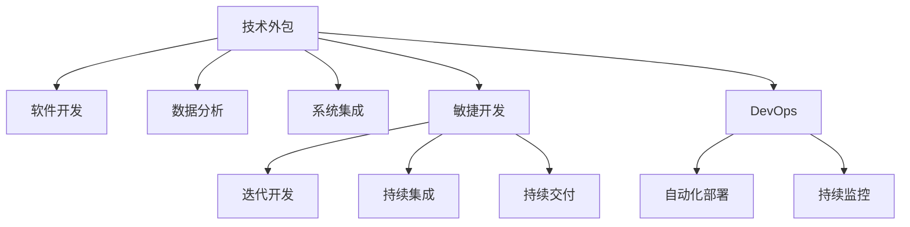

                 

# 技术外包：创业的低风险方式

在当今瞬息万变的科技创业环境中，成功的关键不再仅限于创新的想法和技术，更重要的是能够将资源有效整合并快速响应市场需求。技术外包作为一种有效降低风险、提高效率的创业策略，已受到越来越多创业者的青睐。本文将从背景介绍、核心概念与联系、核心算法原理及操作步骤、数学模型与公式推导、项目实践、实际应用场景、工具与资源推荐、未来发展趋势与挑战等方面，系统阐述技术外包的原理与实践，为创业企业提供科学高效的战略参考。

## 1. 背景介绍

### 1.1 问题由来
随着互联网和信息技术的发展，新创企业如雨后春笋般涌现。然而，资源有限、成本高昂、技术门槛高等问题，使得许多初创公司在业务发展中举步维艰。技术外包作为一种低成本、高效益的解决方案，可以帮助初创企业快速获得必要技术支持，迅速提升竞争力。

### 1.2 问题核心关键点
技术外包指的是企业将部分或全部技术项目，如软件开发、系统集成、数据分析等，外包给第三方专业团队完成，以降低企业自身技术投入和运营风险。技术外包的核心在于如何选择合适的外包合作伙伴，并制定合理的外包策略，以保障项目质量和进度，同时控制成本。

## 2. 核心概念与联系

### 2.1 核心概念概述

为了深入理解技术外包，本节将介绍几个核心概念：

- **技术外包(Outsourcing)**：将企业内部的技术任务，通过合同方式交给外部专业团队或自由职业者完成。技术外包能够大幅降低技术成本，提升技术效率。
- **软件开发生命周期(Software Development Lifecycle, SDLC)**：包括需求分析、系统设计、编码、测试、部署等环节，是软件开发的标准流程。技术外包常涉及多个SDLC阶段。
- **敏捷开发(Agile Development)**：强调快速响应市场需求，通过迭代开发、持续集成等方法，快速交付软件产品。敏捷开发已成为技术外包的主流范式。
- **DevOps**：一种融合开发和运维的技术管理模式，强调自动化、持续交付和协作，提升技术团队的工作效率。

### 2.2 核心概念原理和架构的 Mermaid 流程图



这个流程图展示了大规模技术外包的基本框架，从软件开发、数据分析到系统集成，再结合敏捷开发和DevOps的最佳实践，形成一个完整的技术外包闭环。

## 3. 核心算法原理 & 具体操作步骤

### 3.1 算法原理概述

技术外包的算法原理基于“需求分析-设计-开发-测试-部署”的完整流程。其核心在于如何将企业内部技术需求，通过明确的需求文档和详细的技术标准，转化为外部团队能够理解和执行的任务，并在规定的期限内完成，同时确保高质量交付。

### 3.2 算法步骤详解

技术外包的具体操作步骤包括：

**Step 1: 需求分析与评估**

- **需求文档撰写**：明确外包项目的业务需求、技术要求和质量标准，确保需求文档详细且具体，便于外部团队理解。
- **需求评估**：通过专家评审、可行性分析等手段，评估需求文档的可行性和外包成本。

**Step 2: 选择外包合作伙伴**

- **招标和竞标**：通过公开或定向招标，邀请多家有资质、有经验的外包公司或自由职业者参与竞标。
- **合作伙伴筛选**：根据技术能力、信誉评价、过往案例等因素，选择最合适的合作伙伴。

**Step 3: 签订合同**

- **合同制定**：明确外包任务的范围、交付标准、时间节点、费用结算等条款，确保合同公平合理。
- **签订合同**：双方签订合同，明确各自的责任和义务。

**Step 4: 项目管理与监控**

- **项目规划**：制定详细的项目计划和里程碑，明确每个阶段的任务和时间节点。
- **进度跟踪**：定期跟踪项目进展，确保按计划执行。
- **质量控制**：实施代码评审、测试等质量控制手段，确保外包工作的质量。

**Step 5: 交付与验收**

- **阶段交付**：按计划分阶段交付开发成果，确保每个阶段的质量。
- **最终验收**：进行最终验收，确认交付成果符合预期。

**Step 6: 持续合作与反馈**

- **反馈机制**：建立持续的沟通和反馈机制，及时解决合作中出现的问题。
- **合作评估**：定期评估外包合作伙伴的表现，决定是否续签合同。

### 3.3 算法优缺点

技术外包的优点包括：

1. **降低成本**：通过外包部分技术任务，大幅降低技术团队的人力、物力和时间成本。
2. **提高效率**：外包团队往往具有丰富的经验和高效的开发流程，能够快速响应市场变化。
3. **集中精力**：创业企业可以将精力集中在核心业务上，避免被技术细节分散注意力。

然而，技术外包也存在一些缺点：

1. **质量控制难**：外包团队的工作质量可能不如内部团队，需要额外的时间和成本进行质量控制。
2. **沟通复杂**：外包团队与企业之间存在沟通鸿沟，容易产生误解和延误。
3. **风险存在**：外包合作伙伴的信誉和能力可能存在不确定性，导致项目失败的风险。

## 4. 数学模型和公式 & 详细讲解 & 举例说明

### 4.1 数学模型构建

假设企业需要外包一个软件开发项目，项目周期为$T$天，外包费用为每天$C$元。企业每天的生产力为$P$件，外包团队每天的生产力为$P_{out}$件。我们设$n$为外包团队人数，则总的外包成本为：

$$
Cost = C \times T = C \times \frac{T}{n} \times n = \frac{C \times T}{n} \times n
$$

其中，$n$的取值应满足：

$$
n \geq \frac{T \times P}{P_{out}}
$$

### 4.2 公式推导过程

通过上述公式，我们可以分析外包团队人数与项目周期、生产力的关系。外包团队人数应足够多，以确保外包成本和内部生产力的平衡。同时，外包团队的生产力也直接影响项目进度和成本。

### 4.3 案例分析与讲解

假设企业需要开发一款移动应用，预计开发周期为6个月，即180天。企业内部开发团队每天可完成5件开发任务，外包团队每天可完成3件开发任务。通过计算，可得外包团队人数应不少于120人。企业需支付的外包总费用为：

$$
Cost = \frac{C \times 180}{120} = 1.5C
$$

如果企业选择将项目全外包，则总成本为180天乘以每天3件任务乘以每件任务的固定成本$C'$，即：

$$
Total\_Cost = 180 \times 3 \times C' = 540C'
$$

对比之下，全外包的成本远高于仅外包团队的人数所产生的外包成本。

## 5. 项目实践：代码实例和详细解释说明

### 5.1 开发环境搭建

**环境要求**：

- **操作系统**：Linux或macOS
- **编程语言**：Python 3.7及以上
- **开发工具**：Git、Jira、Confluence、Slack、Zoom

**环境搭建步骤**：

1. **安装操作系统**：根据需要选择安装Linux或macOS。
2. **安装Python**：使用apt-get或brew安装Python 3.7及以上版本。
3. **安装开发工具**：使用pip安装Jira、Confluence、Slack等项目管理工具，并配置好相应的API密钥。
4. **设置开发环境**：使用Anaconda或Miniconda搭建虚拟环境，安装Python相关包和依赖库。

### 5.2 源代码详细实现

以下是一个简化的项目管理和外包任务分配的代码实现：

```python
# 定义外包任务
tasks = [
    {"id": 1, "name": "前端开发", "time": 60},
    {"id": 2, "name": "后端开发", "time": 90},
    {"id": 3, "name": "测试", "time": 30}
]

# 定义外包团队信息
team_members = [
    {"name": "张三", "skill": "前端", "hourly_rate": 100},
    {"name": "李四", "skill": "后端", "hourly_rate": 150},
    {"name": "王五", "skill": "测试", "hourly_rate": 80}
]

# 定义外包任务分配函数
def allocate_tasks(tasks, team_members, total_days):
    available_days = total_days
    total_cost = 0

    for task in tasks:
        cost_per_task = task["time"] * task["hourly_rate"]
        for member in team_members:
            if task["skill"] == member["skill"]:
                if member["name"] in task["assigned_to"]:
                    continue
                if task["time"] <= available_days * member["hourly_rate"]:
                    task["assigned_to"] = member["name"]
                    total_cost += cost_per_task
                    available_days -= task["time"] / member["hourly_rate"]
                    break

    return total_cost

# 测试代码
tasks = tasks
team_members = team_members
total_days = 10
total_cost = allocate_tasks(tasks, team_members, total_days)
print("总成本：", total_cost)
```

### 5.3 代码解读与分析

上述代码实现了一个简单的外包任务分配系统，通过设定每个任务所需的时间和团队成员的技能，动态分配任务给最合适的成员。输出总成本，方便企业进行成本预算。

## 6. 实际应用场景

### 6.1 软件开发

软件开发是技术外包的主要应用场景之一。企业可将复杂的开发任务，如前端、后端、测试等环节，外包给专业团队，提升开发效率和产品质量。

### 6.2 数据分析

数据分析任务涉及大量数据处理和建模，外包团队具有丰富的经验和高效的工具，能够快速完成分析任务，为企业提供数据驱动的决策支持。

### 6.3 系统集成

系统集成任务涉及不同系统和组件的整合，外包团队具备跨平台、跨技术的集成能力，能够高效完成系统整合，满足企业对系统架构的需求。

### 6.4 未来应用展望

未来技术外包的应用前景广阔，包括但不限于以下领域：

- **人工智能与机器学习**：企业可将AI项目外包给专业团队，快速部署AI模型和系统。
- **云计算与大数据**：外包团队具备丰富的云计算和大数据技术，能够帮助企业搭建和管理云平台和数据仓库。
- **网络安全**：网络安全领域的专业性高，外包团队具备丰富的经验和成熟的解决方案，能够提供高质量的安全服务。
- **移动应用开发**：移动互联网时代，企业可将移动应用开发和维护外包给专业的移动开发团队，快速进入市场。

## 7. 工具和资源推荐

### 7.1 学习资源推荐

1. **《敏捷项目管理》书籍**：详细介绍了敏捷项目管理的方法和工具，帮助企业高效管理技术外包项目。
2. **《DevOps实践指南》书籍**：讲解了DevOps的最佳实践，提升技术团队的工作效率和质量控制。
3. **《技术外包指南》网站**：提供技术外包的案例分析和最佳实践，为创业企业提供参考。

### 7.2 开发工具推荐

1. **Jira**：项目管理工具，帮助企业跟踪项目进度和任务分配。
2. **Confluence**：文档协作工具，方便团队成员共享和管理项目文档。
3. **Slack**：即时通讯工具，增强团队内部的沟通和协作。
4. **Zoom**：视频会议工具，方便团队成员远程沟通和协作。

### 7.3 相关论文推荐

1. **《软件外包的成本与效益分析》**：系统介绍了软件外包的成本与效益，为创业企业提供决策依据。
2. **《敏捷开发在技术外包中的应用》**：探讨了敏捷开发在外包项目中的实践方法，提升外包项目的管理效率。
3. **《DevOps实践与技术外包的融合》**：分析了DevOps与技术外包的融合方法，提升外包项目的技术质量和效率。

## 8. 总结：未来发展趋势与挑战

### 8.1 总结

本文对技术外包的原理与实践进行了全面系统的介绍。技术外包作为一种低风险、高效益的创业策略，能够帮助创业企业降低技术成本，提升开发效率，迅速提升市场竞争力。通过需求分析、合作伙伴选择、项目管理与监控、交付与验收、持续合作与反馈等关键步骤，企业可以科学高效地进行技术外包，实现技术资源的最大化利用。

### 8.2 未来发展趋势

未来技术外包将呈现以下几个发展趋势：

1. **人工智能的深入应用**：外包团队将具备更强的AI和机器学习能力，为企业提供更智能的解决方案。
2. **云计算与大数据的融合**：外包团队具备丰富的云计算和大数据技术，能够为企业提供更高效、更安全的数据分析和处理服务。
3. **持续学习和优化**：外包团队将不断学习和优化自身技术，提升项目管理与质量控制的水平。
4. **全球化与本地化结合**：外包团队将更加注重全球化和本地化结合，为企业提供更灵活的解决方案。

### 8.3 面临的挑战

尽管技术外包带来了诸多优势，但也面临一些挑战：

1. **质量控制难**：外包团队的工作质量可能不如内部团队，需要额外的时间和成本进行质量控制。
2. **沟通复杂**：外包团队与企业之间存在沟通鸿沟，容易产生误解和延误。
3. **风险存在**：外包合作伙伴的信誉和能力可能存在不确定性，导致项目失败的风险。

### 8.4 研究展望

未来研究应在以下几个方面寻求突破：

1. **质量控制机制**：建立严格的质量控制机制，确保外包工作的质量。
2. **沟通管理工具**：开发先进的沟通管理工具，增强团队内部的沟通和协作。
3. **风险管理策略**：制定科学的风险管理策略，降低外包项目的风险。
4. **全球化管理**：建立全球化与本地化结合的管理机制，提升外包项目的灵活性。

## 9. 附录：常见问题与解答

**Q1: 技术外包的风险有哪些？**

A: 技术外包的风险主要包括：
1. 质量控制难，外包团队的工作质量可能不如内部团队。
2. 沟通复杂，外包团队与企业之间存在沟通鸿沟，容易产生误解和延误。
3. 风险存在，外包合作伙伴的信誉和能力可能存在不确定性，导致项目失败。

**Q2: 如何选择合适的外包合作伙伴？**

A: 选择合适的外包合作伙伴需考虑以下几个方面：
1. 技术能力和经验，选择有资质、有经验的外包公司或自由职业者。
2. 信誉评价，通过客户反馈和市场评价，选择信誉良好的合作伙伴。
3. 过往案例，查看外包合作伙伴的过往案例，评估其实际工作能力。

**Q3: 如何管理技术外包项目？**

A: 管理技术外包项目需注意以下几点：
1. 需求文档详细，确保外包团队能够准确理解需求。
2. 项目管理工具，使用Jira等工具跟踪项目进度和任务分配。
3. 质量控制机制，实施代码评审、测试等质量控制手段。
4. 持续沟通，建立持续的沟通和反馈机制，及时解决合作中出现的问题。

通过本文的系统梳理，技术外包作为一种高效、低风险的创业策略，必将在创业企业中发挥更大的作用。企业应充分理解和利用技术外包，提升自身技术能力和市场竞争力，最终实现创业成功。

