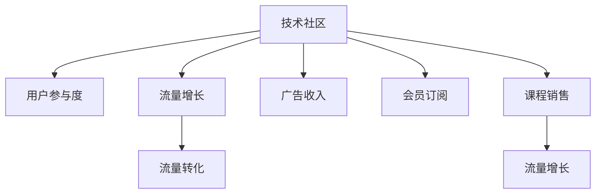

                 

# 技术社区运营：影响力变现

> 关键词：技术社区, 影响力变现, 运营策略, 用户体验, 流量增长, 广告收入, 会员订阅

## 1. 背景介绍

### 1.1 问题由来
随着互联网技术的普及和社交媒体的兴起，技术社区在过去十年中迅速发展，成为程序员、工程师等技术爱好者交流、分享知识的重要平台。但同时，技术社区也面临着商业化压力，如何通过运营策略实现影响力变现，成为当前社区运营的关键课题。

### 1.2 问题核心关键点
技术社区影响力变现的核心在于如何通过优化用户体验、提升流量增长，以及有效转化流量，从而实现商业收入。以下是关键几点：
1. **用户体验优化**：提升社区的参与感和满意度，吸引和保留更多用户。
2. **流量增长**：通过内容营销、社交网络、SEO等手段，扩大社区的覆盖和影响力。
3. **流量转化**：通过广告投放、会员订阅、课程销售等方式，将流量转化为收入。

### 1.3 问题研究意义
研究技术社区影响力变现的运营策略，对于构建可持续发展的社区，推动技术传播和应用，具有重要意义：

1. **提升社区价值**：通过有效的运营手段，提升社区的用户体验和影响力，使社区成为技术交流和创新的重要平台。
2. **实现商业化**：通过广告、会员、课程等多种方式，实现社区的商业收入，推动社区可持续发展。
3. **促进技术应用**：通过社区的影响力，推动新技术的传播和应用，加速行业发展。
4. **赋能开发者**：通过社区平台，为开发者提供学习、交流、合作的机会，提升其技术水平和职业发展。

## 2. 核心概念与联系

### 2.1 核心概念概述

为更好地理解技术社区运营的影响力变现策略，本节将介绍几个密切相关的核心概念：

- **技术社区**：以技术交流、知识分享为目的的在线社区，如Stack Overflow、GitHub、CSDN等。
- **用户参与度**：社区用户活跃度、参与度、贡献度等指标。
- **流量增长**：社区用户访问量、留存率、新用户增长率等指标。
- **流量转化**：访问者转化为付费用户、广告点击量、课程销售量等指标。
- **用户粘性**：用户对社区的忠诚度和重复访问率。
- **广告收入**：通过广告投放获得的收入。
- **会员订阅**：用户为获得更优质服务而支付的费用。
- **课程销售**：技术培训、认证课程的销售收入。

这些概念之间的逻辑关系可以通过以下Mermaid流程图来展示：



这个流程图展示了一系列概念的相互关系：

1. 技术社区通过提升用户参与度吸引更多用户。
2. 用户增多带动流量增长。
3. 流量增长推动广告收入、会员订阅和课程销售。
4. 广告收入、会员订阅、课程销售又反过来促进流量增长。

## 3. 核心算法原理 & 具体操作步骤

### 3.1 算法原理概述

技术社区运营的影响力变现策略，本质上是通过优化用户参与度、流量增长和流量转化，实现商业化目标。其核心思想是：构建一个满足用户需求、提供优质内容、促进社区互动的平台，吸引和保留用户，同时通过多种手段将流量转化为商业价值。

形式化地，假设社区的参与度为 $U$，流量增长率为 $G$，流量转化为广告收入、会员订阅、课程销售的概率分别为 $R_A, R_M, R_C$。社区的影响力变现过程可以表示为：

$$
\text{变现收入} = U \times G \times (R_A + R_M + R_C)
$$

其中，$U$ 通过提升用户体验和内容质量进行优化，$G$ 通过有效的营销和SEO策略提升，而 $R_A, R_M, R_C$ 则通过广告、会员、课程等运营策略进行最大化。

### 3.2 算法步骤详解

技术社区运营的影响力变现，通常包括以下几个关键步骤：

**Step 1: 定义社区目标和指标**
- 明确社区的定位和目标，如成为技术交流、知识分享、学习社区等。
- 设定关键性能指标（KPIs），如用户增长率、参与度、留存率、活跃度等。

**Step 2: 优化用户体验**
- 设计简洁易用的界面和功能，提升用户使用体验。
- 提供高质量的内容，如技术文章、代码示例、问答、视频等。
- 鼓励用户互动，如评论、点赞、回复等。

**Step 3: 流量增长策略**
- 利用SEO优化，提升搜索引擎排名。
- 通过社交媒体、邮件营销等方式，吸引新用户。
- 合作推广，与其他技术社区、网站进行联动。

**Step 4: 流量转化策略**
- 设计有吸引力的广告素材，通过搜索引擎、社交媒体等渠道投放。
- 推出优质会员服务，提供专属内容和资源。
- 开发高质量课程，吸引技术爱好者购买。

**Step 5: 监控和优化**
- 使用数据分析工具，实时监控社区的各项指标。
- 根据数据反馈，持续优化内容和运营策略。
- 定期评估社区效果，调整目标和策略。

### 3.3 算法优缺点

技术社区影响力变现策略的优点：
1. 快速见效：通过有效的运营策略，可以快速提升社区的用户量和影响力。
2. 多样化收入：通过广告、会员、课程等多种方式，实现多渠道收入。
3. 用户粘性强：优质内容和服务可以提升用户粘性，增加用户重复访问率。

策略的缺点：
1. 成本高：初期投入较大，包括内容制作、广告投放、会员服务开发等。
2. 竞争激烈：技术社区市场竞争激烈，需要不断创新和优化。
3. 用户需求多样化：不同用户有不同的需求，需要灵活调整内容和运营策略。

尽管存在这些缺点，但通过系统化的运营策略和持续的优化，技术社区依然可以实现影响力的变现。

### 3.4 算法应用领域

技术社区运营的影响力变现策略，已经广泛应用于各类技术社区中，如Stack Overflow、GitHub、CSDN等。以下是具体应用场景：

1. **Stack Overflow**：通过高质量的技术问答和代码示例，吸引了大量程序员的关注。广告收入和会员订阅成为主要收入来源。
2. **GitHub**：通过开放源代码和协作平台，吸引了大量开发者。GitHub Pages、GitHub Sponsors等增值服务成为收入的重要部分。
3. **CSDN**：作为中国最大的技术社区，通过技术文章、在线课程、软件开发工具的推荐等，实现了多渠道的收入。

这些技术社区的实践，展示了影响力变现策略在提升社区价值和实现商业化方面的巨大潜力。

## 4. 数学模型和公式 & 详细讲解 & 举例说明

### 4.1 数学模型构建

本节将使用数学语言对技术社区运营的影响力变现策略进行更加严格的刻画。

设技术社区的用户参与度为 $U$，流量增长率为 $G$，广告收入为 $R_A$，会员订阅收入为 $R_M$，课程销售收入为 $R_C$。则社区的影响力变现收入 $I$ 可以表示为：

$$
I = U \times G \times (R_A + R_M + R_C)
$$

其中 $U$ 和 $G$ 可以通过以下模型进行预测：

1. **用户参与度模型**：$U = f(U_{in}, U_{out}, U_{engagement})$，其中 $U_{in}$ 为社区新用户增长率，$U_{out}$ 为社区老用户流失率，$U_{engagement}$ 为社区内用户互动率。
2. **流量增长模型**：$G = g(G_{in}, G_{out}, G_{SEO})$，其中 $G_{in}$ 为社区内部流量增长率，$G_{out}$ 为社区外部流量增长率，$G_{SEO}$ 为搜索引擎优化效果。

这些模型可以通过统计分析和机器学习模型进行预测和优化。

### 4.2 公式推导过程

以下我们以广告收入 $R_A$ 为例，推导其计算公式及其优化过程。

设社区的广告点击率为 $C_A$，广告转化率为 $T_A$，平均点击费用为 $CPA_A$，则广告收入 $R_A$ 可以表示为：

$$
R_A = C_A \times T_A \times CPA_A
$$

广告点击率 $C_A$ 可以通过以下模型进行预测：

$$
C_A = h(C_{organic}, C_{paid}, C_{CPC})
$$

其中 $C_{organic}$ 为有机点击率，$C_{paid}$ 为付费点击率，$C_{CPC}$ 为每次点击费用。

广告转化率 $T_A$ 可以通过以下模型进行预测：

$$
T_A = i(T_{brand}, T_{relevant}, T_{call_to_action})
$$

其中 $T_{brand}$ 为品牌相关性，$T_{relevant}$ 为内容相关性，$T_{call_to_action}$ 为呼吁行动。

通过上述模型，可以预测和优化广告点击率和转化率，从而提升广告收入。

### 4.3 案例分析与讲解

我们以CSDN为例，展示如何通过影响力变现策略实现社区的商业化。

**1. 用户体验优化**

CSDN通过优化界面设计和功能，提升用户体验。例如，采用简洁的导航条、清晰的分类展示、强大的搜索功能等，使新用户可以快速找到所需内容。同时，提供高质量的技术文章、代码示例、在线课程等，吸引用户深度参与。

**2. 流量增长策略**

CSDN通过SEO优化，提升搜索引擎排名。例如，为每个技术文章和代码示例提供详细的标签和分类，增加页面访问量。通过社交媒体推广，如微博、微信、知乎等，吸引新用户注册。与其他技术社区和网站进行联动，提升社区影响力。

**3. 流量转化策略**

CSDN通过设计有吸引力的广告素材，在搜索引擎和社交媒体上投放广告。例如，展示热门技术文章、最新开发工具等，吸引用户点击。推出优质会员服务，提供专属内容和资源，如优先下载权限、技术交流群等。开发高质量课程，如CSDN认证工程师培训、云计算课程等，吸引技术爱好者购买。

通过以上策略，CSDN实现了显著的用户增长和影响力提升，广告收入、会员订阅、课程销售等多元化收入也随之增加。

## 5. 项目实践：代码实例和详细解释说明

### 5.1 开发环境搭建

在进行社区运营影响力变现的实践前，我们需要准备好开发环境。以下是使用Python进行Flask开发的环境配置流程：

1. 安装Python：从官网下载并安装Python，确保版本在3.6及以上。
2. 安装Flask：使用pip安装Flask框架。
   ```bash
   pip install flask
   ```
3. 安装SQLite：使用pip安装SQLite数据库，用于社区数据存储。
   ```bash
   pip install sqlite3
   ```
4. 安装第三方库：安装Flask扩展库，如Flask-WTF、Flask-Login、Flask-SQLAlchemy等。
   ```bash
   pip install Flask-WTF Flask-Login Flask-SQLAlchemy
   ```

完成上述步骤后，即可在本地搭建社区运营系统。

### 5.2 源代码详细实现

下面我们以一个简单的技术社区为例，给出社区运营的Python代码实现。

首先，定义社区的基本数据模型：

```python
from flask_sqlalchemy import SQLAlchemy
from flask_login import UserMixin, login_user, current_user
from werkzeug.security import generate_password_hash, check_password_hash

db = SQLAlchemy()

class User(UserMixin, db.Model):
    id = db.Column(db.Integer, primary_key=True)
    username = db.Column(db.String(50), unique=True, nullable=False)
    email = db.Column(db.String(120), unique=True, nullable=False)
    password = db.Column(db.String(100))
    is_admin = db.Column(db.Boolean, default=False)

class Article(db.Model):
    id = db.Column(db.Integer, primary_key=True)
    title = db.Column(db.String(100), nullable=False)
    content = db.Column(db.Text, nullable=False)
    user_id = db.Column(db.Integer, db.ForeignKey('user.id'), nullable=False)
```

接着，定义用户认证和文章管理的API：

```python
from flask import Flask, render_template, request, redirect, url_for

app = Flask(__name__)
app.config['SECRET_KEY'] = 'secret_key'
app.config['SQLALCHEMY_DATABASE_URI'] = 'sqlite:///test.db'
db.init_app(app)

@app.route('/')
def index():
    articles = Article.query.all()
    return render_template('index.html', articles=articles)

@app.route('/login', methods=['GET', 'POST'])
def login():
    if request.method == 'POST':
        user = User.query.filter_by(username=request.form['username']).first()
        if user and check_password_hash(user.password, request.form['password']):
            login_user(user)
            return redirect(url_for('index'))
        else:
            return render_template('login.html', error='Invalid credentials')
    else:
        return render_template('login.html')

@app.route('/logout')
def logout():
    logout_user()
    return redirect(url_for('index'))

@app.route('/register', methods=['GET', 'POST'])
def register():
    if request.method == 'POST':
        hashed_password = generate_password_hash(request.form['password'], method='sha256')
        new_user = User(username=request.form['username'], email=request.form['email'], password=hashed_password)
        db.session.add(new_user)
        db.session.commit()
        return redirect(url_for('login'))
    else:
        return render_template('register.html')

@app.route('/articles', methods=['GET', 'POST'])
@login_required
def articles():
    if request.method == 'POST':
        new_article = Article(title=request.form['title'], content=request.form['content'], user_id=current_user.id)
        db.session.add(new_article)
        db.session.commit()
        return redirect(url_for('index'))
    else:
        articles = Article.query.all()
        return render_template('articles.html', articles=articles)
```

最后，启动Flask应用：

```python
if __name__ == '__main__':
    db.create_all()
    app.run(debug=True)
```

以上是一个简单的社区系统，包含了用户认证、文章管理和登录注销等功能。开发者可以根据自己的需求，进一步扩展和优化社区系统，实现更高级的功能和业务逻辑。

### 5.3 代码解读与分析

让我们再详细解读一下关键代码的实现细节：

**User类**：
- 定义了用户的基本信息，包括用户名、邮箱、密码和管理员身份。
- 通过SQLAlchemy框架，建立了用户与文章的关联。

**Article类**：
- 定义了文章的基本信息，包括标题和内容。
- 通过SQLAlchemy框架，建立了文章与用户的关联。

**API**：
- 登录和注册功能，使用Flask-Login库进行用户认证。
- 文章管理功能，允许用户发布文章和查看文章列表。

**Flask应用启动**：
- 通过SQLAlchemy框架创建数据库表。
- 通过Flask的run方法启动应用，开启开发调试模式。

通过上述代码，我们可以看到一个基本的社区系统是如何通过Flask框架实现的。开发者可以通过添加更多的业务逻辑和功能，将社区系统扩展为一个具备影响力变现能力的平台。

## 6. 实际应用场景

### 6.1 社交媒体平台

技术社区的影响力变现策略可以广泛应用在各类社交媒体平台中，如Facebook、Twitter等。这些平台通过高质量的内容和互动机制，吸引大量用户，同时通过广告、会员、订阅等方式实现商业化。

**案例**：Facebook
- **用户体验优化**：通过个性化的内容推荐和互动界面，提升用户体验。
- **流量增长策略**：通过社交网络推广、SEO优化等方式，吸引新用户。
- **流量转化策略**：通过广告投放、会员服务、社交电商等方式，实现商业收入。

### 6.2 电商平台

电商平台可以通过技术社区的影响力变现策略，提升平台的活跃度和用户粘性，增加平台的商业价值。

**案例**：Amazon
- **用户体验优化**：通过高质量的产品展示和用户评价，提升用户体验。
- **流量增长策略**：通过SEO优化、社交媒体推广等方式，吸引新用户。
- **流量转化策略**：通过推荐系统、广告投放、会员服务等，提升用户购买转化率。

### 6.3 教育平台

教育平台可以通过技术社区的影响力变现策略，提供优质的在线教育资源，吸引更多的学习者和开发者。

**案例**：Coursera
- **用户体验优化**：通过高质量的课程内容和学习工具，提升用户体验。
- **流量增长策略**：通过SEO优化、社交媒体推广等方式，吸引新用户。
- **流量转化策略**：通过会员订阅、课程销售等方式，实现商业收入。

### 6.4 未来应用展望

随着技术社区运营影响力的不断提升，未来其应用场景将更加广泛。以下是几个可能的方向：

1. **企业内网**：企业可以通过技术社区内部平台，提升员工的协作效率，同时通过知识分享、技术交流等方式，增强企业的技术氛围和创新能力。
2. **智慧城市**：技术社区可以与城市管理、公共服务等领域结合，提供智慧城市的解决方案，提升城市治理的效率和效果。
3. **社交娱乐**：技术社区可以与游戏、动漫、虚拟现实等领域结合，提供丰富的社交娱乐体验，同时通过虚拟商品、虚拟货币等新模式实现商业变现。

技术社区的影响力变现，将为各行各业带来新的机遇和挑战。通过系统化的运营策略和不断的创新，技术社区有望成为推动社会进步的重要力量。

## 7. 工具和资源推荐

### 7.1 学习资源推荐

为了帮助开发者系统掌握技术社区运营的影响力变现策略，这里推荐一些优质的学习资源：

1. **《Flask Web Development》**：讲解如何使用Flask框架进行Web应用开发，适合初学者入门。
2. **《Flask Pallets》**：涵盖Flask的扩展库和插件，提供了丰富的开发工具和资源。
3. **《Python Web Development with Flask》**：系统介绍了如何使用Python和Flask开发Web应用，适合进阶学习。
4. **《Django for Beginners》**：讲解如何使用Django框架进行Web应用开发，适合有一定基础的开发者。
5. **《Web Development with Flask》**：结合实际项目，讲解如何使用Flask进行Web应用开发，适合实践练习。

通过对这些资源的学习实践，相信你一定能够快速掌握技术社区运营的影响力变现策略，并用于解决实际的社区运营问题。

### 7.2 开发工具推荐

高效的开发离不开优秀的工具支持。以下是几款用于技术社区运营开发的工具：

1. **Flask**：轻量级Web框架，易于上手，适合快速开发。
2. **Django**：功能强大的Web框架，适合大型Web应用开发。
3. **SQLAlchemy**：Python的ORM框架，方便进行数据库操作。
4. **Flask-WTF**：Flask的表单处理库，方便处理用户输入。
5. **Flask-Login**：用户认证库，方便实现用户登录和注册功能。
6. **Flask-SQLAlchemy**：Flask和SQLAlchemy的结合，方便进行数据库操作。

合理利用这些工具，可以显著提升技术社区运营的影响力变现效率，加快创新迭代的步伐。

### 7.3 相关论文推荐

技术社区运营的影响力变现策略，近年来成为了研究的热点。以下是几篇具有代表性的论文，推荐阅读：

1. **《The Economics of Open Source: Microeconomics of Mass Collaboration》**：探讨了开源社区的商业模式和用户激励机制，对技术社区的影响力变现提供了理论基础。
2. **《Social Media Networks: An Empirical Study of Structural and Evolutionary Patterns》**：分析了社交媒体平台的社区结构和用户行为，为技术社区的运营提供了数据支持。
3. **《Open Source Platforms: The Foundation of Technological Change》**：研究了开源平台对技术创新的影响，对技术社区的商业化提供了参考。
4. **《Online Learning Platforms: An Empirical Study of Continuous Learning》**：分析了在线教育平台的用户行为和留存策略，为技术社区的流量增长提供了经验借鉴。
5. **《Community Development in Social Media》**：探讨了社交媒体社区的成长和运营策略，为技术社区的商业化提供了实践经验。

这些论文代表了大社区运营策略的发展脉络。通过学习这些前沿成果，可以帮助研究者把握学科前进方向，激发更多的创新灵感。

## 8. 总结：未来发展趋势与挑战

### 8.1 总结

本文对技术社区运营的影响力变现策略进行了全面系统的介绍。首先阐述了技术社区运营的商业化背景和意义，明确了社区运营的目标和关键指标。其次，从原理到实践，详细讲解了社区运营的数学模型和关键策略，给出了社区运营的完整代码实例。同时，本文还广泛探讨了社区运营在社交媒体、电商平台、教育平台等各个领域的应用前景，展示了社区运营的巨大潜力。此外，本文精选了社区运营的技术资源，力求为读者提供全方位的技术指引。

通过本文的系统梳理，可以看到，技术社区运营的影响力变现策略在提升社区价值、推动技术传播和应用方面具有重要意义。未来，伴随社区运营策略的不断优化和创新，技术社区有望成为推动技术发展和社会进步的重要平台。

### 8.2 未来发展趋势

展望未来，技术社区运营的影响力变现策略将呈现以下几个发展趋势：

1. **用户个性化**：通过大数据分析和个性化推荐，提供更符合用户需求的内容和服务。
2. **社区生态化**：构建社区生态系统，鼓励用户参与内容创造、交流和分享，提升社区的活力和粘性。
3. **跨平台合作**：通过与其他平台和应用的合作，扩大社区的影响力和覆盖面。
4. **人工智能**：引入人工智能技术，提升社区运营的效率和智能化水平。
5. **用户教育**：通过知识分享和社区教育，提升用户的技术水平和行业认知。
6. **内容多样性**：提供多样化的内容形式，如视频、直播、互动问答等，增强用户体验。

以上趋势凸显了技术社区运营的影响力变现策略的广阔前景。这些方向的探索发展，必将进一步提升技术社区的用户体验和影响力，为技术传播和应用提供更加多样化和高效的服务。

### 8.3 面临的挑战

尽管技术社区运营的影响力变现策略已经取得了瞩目成就，但在迈向更加智能化、普适化应用的过程中，它仍面临着诸多挑战：

1. **用户需求多样化**：不同用户有不同的需求，需要灵活调整内容和运营策略。
2. **竞争激烈**：技术社区市场竞争激烈，需要不断创新和优化。
3. **内容生产困难**：高质量内容的生产成本高，需要持续投入。
4. **用户流失率高**：用户流失率高，需要不断优化用户体验和互动机制。
5. **广告效果不佳**：广告投放效果难以保证，需要不断优化广告素材和投放策略。
6. **用户隐私保护**：用户隐私保护和数据安全问题突出，需要采取严格的隐私保护措施。

正视社区运营面临的这些挑战，积极应对并寻求突破，将是大社区运营走向成熟的必由之路。相信随着学界和产业界的共同努力，这些挑战终将一一被克服，技术社区运营的影响力变现必将在构建人机协同的智能时代中扮演越来越重要的角色。

### 8.4 研究展望

面对技术社区运营所面临的种种挑战，未来的研究需要在以下几个方面寻求新的突破：

1. **用户行为分析**：通过数据分析技术，深入理解用户行为和需求，优化社区运营策略。
2. **内容生产自动化**：引入人工智能技术，自动生成高质量的内容，降低内容生产成本。
3. **个性化推荐**：利用推荐系统技术，实现个性化内容推荐，提升用户体验。
4. **跨平台协作**：通过API接口和数据共享，实现跨平台社区的互联互通。
5. **数据安全和隐私保护**：采取严格的隐私保护措施，保障用户数据安全。
6. **用户教育和社区治理**：通过社区教育和技术培训，提升用户的技术水平，加强社区治理能力。

这些研究方向的探索，必将引领技术社区运营的影响力变现技术迈向更高的台阶，为构建安全、可靠、可解释、可控的智能系统铺平道路。面向未来，技术社区运营的影响力变现技术还需要与其他人工智能技术进行更深入的融合，如知识表示、因果推理、强化学习等，多路径协同发力，共同推动自然语言理解和智能交互系统的进步。只有勇于创新、敢于突破，才能不断拓展技术社区运营的影响力变现边界，让智能技术更好地造福人类社会。

## 9. 附录：常见问题与解答

**Q1：技术社区运营的影响力变现策略是否适用于所有类型的社区？**

A: 技术社区运营的影响力变现策略主要适用于具有知识分享、技术交流、用户互动等特点的社区。对于以娱乐、社交为主导的社区，需要根据具体情况进行调整和优化。

**Q2：如何判断技术社区的用户需求和行为？**

A: 通过数据分析工具，如Google Analytics、Mixpanel等，可以实时监控用户的行为数据，分析用户需求和行为特征。同时，可以通过用户调查和反馈收集用户的意见和建议，进一步优化社区运营策略。

**Q3：社区内容如何保持高质量和多样化？**

A: 可以通过引入用户生成内容（UGC）机制，鼓励用户贡献高质量的内容。同时，通过社区管理员的审核和筛选，保证内容的质量。在内容形式上，可以结合文本、视频、直播等多种形式，提升用户体验。

**Q4：如何设计有吸引力的广告素材？**

A: 设计广告素材时，需要注意以下几个要点：
1. 突出社区特色和优势。
2. 展示高质量的内容和用户评价。
3. 使用吸引人的视觉元素和文案。
4. 测试不同广告素材的效果，选择最优方案。

**Q5：如何提高广告投放的效果？**

A: 提高广告投放效果的关键在于精准定位和个性化推荐。可以通过数据分析和机器学习技术，对用户进行细分和画像，进行定向投放。同时，可以使用A/B测试等方法，不断优化广告素材和投放策略。

通过对这些问题的解答，相信你能够更好地理解和应用技术社区运营的影响力变现策略，构建具有竞争力和影响力的技术社区平台。

---

作者：禅与计算机程序设计艺术 / Zen and the Art of Computer Programming

