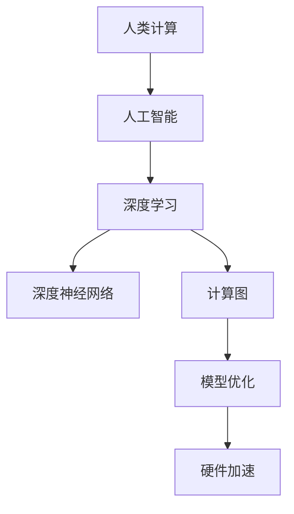

                 

## 1. 背景介绍

### 1.1 问题由来

人类计算的历史源远流长，从古老的笔算、计数棒到现代的计算机，每一次技术革新都极大地推动了社会的进步。在信息时代，计算能力成为科技发展的核心驱动力，推动了众多前沿技术的创新，包括人工智能、大数据、区块链、物联网等。人类计算不再局限于传统的数据处理，而是走向了更为复杂和智能的领域。

### 1.2 问题核心关键点

人类计算的核心在于将复杂的计算问题转化为机器可以理解和执行的形式，从而通过硬件和软件协同工作，实现高效的计算处理。在人工智能时代，这一过程更是通过深度学习等先进技术得以实现。深度学习模型通过大规模数据集的训练，自动学习特征提取和数据表示，能够在各种复杂任务上实现超越人类的性能。

当前，深度学习模型已经在图像识别、自然语言处理、语音识别等领域取得显著成果，但仍然面临计算资源消耗大、模型训练时间长、泛化能力不足等挑战。因此，如何更高效地利用人类计算资源，实现更加智能、灵活的计算处理，成为了当前研究的重点。

## 2. 核心概念与联系

### 2.1 核心概念概述

为更好地理解人类计算的创新力量，本节将介绍几个关键概念：

- **人类计算(Human Computing)**：指利用人类思维和知识，结合计算工具，解决复杂计算问题。包括符号计算、逻辑推理、模型建立等。
- **人工智能(Artificial Intelligence, AI)**：指通过算法和模型，赋予机器智能能力，使其具备理解、学习、推理、决策等功能。
- **深度学习(Deep Learning)**：一种机器学习技术，通过构建多层神经网络，自动学习特征表示，解决复杂的模式识别和预测问题。
- **深度神经网络(Deep Neural Network, DNN)**：深度学习的基础模型，由多层神经元组成，能够自动学习特征表示和复杂模式。
- **计算图(Computational Graph)**：用于描述计算过程的图形表示，每个节点代表一个计算操作，边表示数据流。常见计算图包括前向传播和反向传播。
- **模型优化(Model Optimization)**：指通过算法和技巧，优化深度学习模型的计算效率和性能。包括模型剪枝、量化、压缩、蒸馏等方法。
- **硬件加速(Hardware Acceleration)**：指通过专用硬件（如GPU、TPU）加速计算过程，提高深度学习模型的训练和推理速度。

这些概念之间的逻辑关系可以通过以下Mermaid流程图来展示：



这个流程图展示了一系列概念的因果关系：人类计算通过人工智能，借助深度学习技术，构建了深度神经网络，并通过计算图进行模型优化，最终通过硬件加速提高计算效率。

## 3. 核心算法原理 & 具体操作步骤

### 3.1 算法原理概述

深度学习模型通过反向传播算法进行训练，将大规模数据集的输入映射到目标输出。计算过程通常分为前向传播和反向传播两个阶段。前向传播将输入数据通过网络传递，得到输出结果；反向传播则根据输出误差，反向更新网络参数，最小化损失函数。

深度学习模型在训练时，需要大量标注数据和强大的计算资源。因此，如何高效利用这些资源，优化模型性能，成为了当前研究的热点。基于人类计算的创新力量，研究者们提出了多种模型优化和加速方法。

### 3.2 算法步骤详解

深度学习模型的训练通常包括以下几个关键步骤：

**Step 1: 数据预处理**
- 收集大规模数据集，并进行数据清洗、归一化、分块等预处理操作。
- 将数据集划分为训练集、验证集和测试集。
- 对图像、文本、语音等不同类型的数据进行特定格式的处理。

**Step 2: 模型构建**
- 设计合适的深度神经网络架构，包括输入层、隐藏层和输出层。
- 选择合适的激活函数、损失函数、优化器等，并进行超参数调优。
- 使用符号计算工具（如TensorFlow、PyTorch）构建计算图，并定义前向传播和反向传播过程。

**Step 3: 训练过程**
- 使用训练集数据对模型进行前向传播和反向传播，计算损失函数。
- 根据损失函数值，使用优化器更新模型参数。
- 在验证集上评估模型性能，防止过拟合，调整学习率等超参数。
- 重复上述过程，直至模型收敛。

**Step 4: 模型优化**
- 使用模型剪枝、量化、压缩、蒸馏等方法，优化模型计算图，减少参数量，提升推理速度。
- 引入正则化技术，如L1/L2正则、Dropout等，防止过拟合。
- 使用硬件加速技术，如GPU、TPU等，加速模型训练和推理过程。

**Step 5: 测试和部署**
- 在测试集上评估模型性能，对比训练前后的效果。
- 使用微调技术，将预训练模型适应特定任务，提升模型泛化能力。
- 将训练好的模型部署到实际应用中，进行实时推理和预测。

### 3.3 算法优缺点

深度学习模型的优化和加速方法具有以下优点：
1. 提升计算效率。通过剪枝、量化、压缩等方法，显著减少模型参数量，加速推理速度。
2. 提高泛化能力。正则化技术可防止模型过拟合，提升模型在未见过的数据上的表现。
3. 减少资源消耗。使用硬件加速技术，大幅提升训练和推理的效率，降低计算资源的消耗。
4. 增强模型灵活性。模型蒸馏等方法可大幅减小模型规模，方便在不同设备上部署和使用。

同时，这些方法也存在一定的局限性：
1. 计算资源消耗大。剪枝、量化等方法需要耗费大量计算资源，优化过程可能较慢。
2. 模型泛化能力受限。过度压缩和剪枝可能降低模型性能，影响泛化能力。
3. 硬件依赖性强。深度学习模型对硬件加速器依赖度高，不同设备上的性能差异可能较大。
4. 模型可解释性不足。深度学习模型通常被视为"黑盒"系统，难以解释其内部决策过程。

尽管存在这些局限性，但深度学习模型的优化和加速方法仍然是当前研究的热点，为实现高效、智能的计算处理提供了重要技术支持。

### 3.4 算法应用领域

深度学习模型和优化技术已经被广泛应用于众多领域，包括但不限于：

- **计算机视觉**：图像识别、目标检测、语义分割等任务。通过优化和加速方法，提升模型在图像数据上的处理速度和准确性。
- **自然语言处理**：机器翻译、文本分类、情感分析、问答系统等任务。通过微调技术，提升模型在文本数据上的处理能力和泛化能力。
- **语音识别**：语音转文字、说话人识别、情感分析等任务。通过硬件加速技术，提升模型的推理速度和准确性。
- **推荐系统**：商品推荐、内容推荐、广告推荐等任务。通过优化方法，提升模型对用户行为的预测能力，提高推荐效果。
- **医疗诊断**：医学影像分析、疾病预测、基因组分析等任务。通过模型蒸馏等方法，提升模型在医疗数据的处理速度和准确性。
- **金融分析**：市场预测、风险评估、信用评分等任务。通过优化方法，提升模型对金融数据的处理能力和泛化能力。

除了以上领域，深度学习模型还在智能制造、智能交通、智能家居等新兴领域得到广泛应用，推动了多个行业的数字化转型。

## 4. 数学模型和公式 & 详细讲解 & 举例说明

### 4.1 数学模型构建

深度学习模型通常使用前向传播和反向传播算法进行训练。假设模型包含 $n$ 层神经网络，每一层 $i$ 的输入为 $x^{(i)}$，输出为 $y^{(i)}$，参数为 $\theta^{(i)}$。则前向传播过程可表示为：

$$
y^{(n)} = \sigma(W^{(n)}x^{(n-1)} + b^{(n)})
$$

其中 $\sigma$ 为激活函数，$W$ 和 $b$ 分别为权重和偏置。

反向传播过程则计算损失函数对每一层参数的梯度，更新参数。假设损失函数为 $L$，则：

$$
\frac{\partial L}{\partial \theta^{(n)}} = \frac{\partial L}{\partial y^{(n)}} \frac{\partial y^{(n)}}{\partial x^{(n-1)}} \frac{\partial x^{(n-1)}}{\partial \theta^{(n-1)}} \cdots \frac{\partial x^{(1)}}{\partial \theta^{(1)}}
$$

其中 $\frac{\partial L}{\partial y^{(n)}}$ 为链式法则的第一部分，$\frac{\partial y^{(n)}}{\partial x^{(n-1)}}$ 为激活函数的导数，$\frac{\partial x^{(n-1)}}{\partial \theta^{(n-1)}}$ 为权重矩阵的导数。

### 4.2 公式推导过程

以图像识别任务为例，假设模型为卷积神经网络（CNN），输入为 $28 \times 28$ 的灰度图像，输出为 10 个类别的概率。则前向传播过程可表示为：

$$
y = \sigma(Wx + b)
$$

其中 $x$ 为输入图像，$y$ 为输出概率，$W$ 和 $b$ 分别为权重和偏置。

反向传播过程则计算损失函数对每一层参数的梯度。假设损失函数为交叉熵损失，则：

$$
L = -\frac{1}{N} \sum_{i=1}^N \sum_{j=1}^{10} y_j \log \hat{y}_j
$$

其中 $N$ 为样本数，$y_j$ 为真实标签，$\hat{y}_j$ 为模型预测的概率。

根据链式法则，反向传播过程为：

$$
\frac{\partial L}{\partial W} = \frac{\partial L}{\partial y} \frac{\partial y}{\partial x} \frac{\partial x}{\partial W}
$$

其中 $\frac{\partial L}{\partial y}$ 为交叉熵损失的导数，$\frac{\partial y}{\partial x}$ 为激活函数的导数，$\frac{\partial x}{\partial W}$ 为权重矩阵的导数。

### 4.3 案例分析与讲解

以图像分类为例，假设模型为LeNet，输入为 $28 \times 28$ 的灰度图像，输出为 10 个类别的概率。则前向传播过程为：

$$
y = \sigma(W_1x + b_1) \cdot \sigma(W_2y + b_2)
$$

其中 $W_1$ 和 $b_1$ 为第一层权重和偏置，$W_2$ 和 $b_2$ 为第二层权重和偏置。

反向传播过程为：

$$
\frac{\partial L}{\partial W_2} = \frac{\partial L}{\partial y} \cdot \sigma(W_2y + b_2) \cdot (1 - \sigma(W_2y + b_2)) \cdot x
$$

其中 $\frac{\partial L}{\partial y}$ 为交叉熵损失的导数，$\sigma(W_2y + b_2)$ 为第二层激活函数，$1 - \sigma(W_2y + b_2)$ 为激活函数的导数，$x$ 为输入图像。

通过前向传播和反向传播，模型可以不断更新参数，最小化损失函数，提升分类准确率。

## 5. 项目实践：代码实例和详细解释说明

### 5.1 开发环境搭建

在进行深度学习项目实践前，需要准备好开发环境。以下是使用Python进行TensorFlow开发的環境配置流程：

1. 安装Anaconda：从官网下载并安装Anaconda，用于创建独立的Python环境。

2. 创建并激活虚拟环境：
```bash
conda create -n tf-env python=3.8 
conda activate tf-env
```

3. 安装TensorFlow：根据CUDA版本，从官网获取对应的安装命令。例如：
```bash
conda install tensorflow-gpu -c pytorch -c conda-forge
```

4. 安装各类工具包：
```bash
pip install numpy pandas scikit-learn matplotlib tqdm jupyter notebook ipython
```

完成上述步骤后，即可在`tf-env`环境中开始深度学习项目实践。

### 5.2 源代码详细实现

下面我们以图像分类任务为例，给出使用TensorFlow进行卷积神经网络（CNN）训练的PyTorch代码实现。

首先，定义数据处理函数：

```python
import tensorflow as tf
import numpy as np

def load_data():
    # 加载MNIST数据集
    mnist = tf.keras.datasets.mnist
    (x_train, y_train), (x_test, y_test) = mnist.load_data()
    
    # 将数据归一化到0-1之间
    x_train, x_test = x_train / 255.0, x_test / 255.0
    
    # 将标签转换为one-hot编码
    y_train = tf.keras.utils.to_categorical(y_train, 10)
    y_test = tf.keras.utils.to_categorical(y_test, 10)
    
    return x_train, y_train, x_test, y_test
```

然后，定义模型：

```python
from tensorflow.keras import layers

def build_model(input_shape):
    model = tf.keras.Sequential([
        layers.Conv2D(32, 3, activation='relu', input_shape=input_shape),
        layers.MaxPooling2D(),
        layers.Flatten(),
        layers.Dense(10, activation='softmax')
    ])
    return model
```

接着，定义损失函数和优化器：

```python
from tensorflow.keras.losses import categorical_crossentropy
from tensorflow.keras.optimizers import Adam

loss_fn = categorical_crossentropy
optimizer = Adam(lr=0.001)
```

最后，定义训练和评估函数：

```python
from tensorflow.keras.callbacks import EarlyStopping

def train_model(model, x_train, y_train, x_test, y_test, epochs=10, batch_size=128):
    early_stopping = EarlyStopping(patience=3)
    model.compile(optimizer=optimizer, loss=loss_fn, metrics=['accuracy'])
    model.fit(x_train, y_train, epochs=epochs, batch_size=batch_size, validation_data=(x_test, y_test), callbacks=[early_stopping])
    
    test_loss, test_acc = model.evaluate(x_test, y_test)
    print(f'Test loss: {test_loss:.4f}, Test accuracy: {test_acc:.4f}')
    
def evaluate_model(model, x_test, y_test):
    test_loss, test_acc = model.evaluate(x_test, y_test)
    print(f'Test loss: {test_loss:.4f}, Test accuracy: {test_acc:.4f}')
```

启动训练流程并在测试集上评估：

```python
input_shape = (28, 28, 1)

x_train, y_train, x_test, y_test = load_data()

model = build_model(input_shape)
train_model(model, x_train, y_train, x_test, y_test)
evaluate_model(model, x_test, y_test)
```

以上就是使用TensorFlow进行CNN图像分类任务的完整代码实现。可以看到，通过TensorFlow的高效API，我们能够快速实现深度学习模型的训练和评估。

### 5.3 代码解读与分析

让我们再详细解读一下关键代码的实现细节：

**load_data函数**：
- 使用TensorFlow的Keras API加载MNIST数据集，并对数据进行归一化和标签编码。

**build_model函数**：
- 定义一个简单的CNN模型，包括卷积层、池化层、全连接层和softmax激活函数，用于图像分类任务。

**loss_fn和optimizer**：
- 定义交叉熵损失函数和Adam优化器，用于模型训练。

**train_model函数**：
- 使用Keras API进行模型训练，设置EarlyStopping回调函数，防止过拟合。
- 在训练过程中评估模型性能，并在验证集上调整学习率等超参数。

**evaluate_model函数**：
- 使用Keras API进行模型评估，输出测试集上的损失和精度。

**启动训练流程**：
- 定义输入图像的形状，加载数据集。
- 构建CNN模型，进行训练和评估。

可以看到，TensorFlow的Keras API使得深度学习模型的实现变得简洁高效，能够快速迭代研究，提升模型的性能。

当然，工业级的系统实现还需考虑更多因素，如模型的保存和部署、超参数的自动搜索、模型的集成和部署等。但核心的训练和评估过程与上述代码实现类似。

## 6. 实际应用场景

### 6.1 智能制造

在智能制造领域，深度学习模型可以用于质量检测、故障诊断、设备维护等任务。通过图像识别、语音识别、自然语言处理等技术，实现对生产流程的实时监控和优化。

例如，使用卷积神经网络（CNN）进行图像识别，识别生产线上产品的缺陷和损坏情况，实时反馈给生产管理系统，进行自动分类和处理。

### 6.2 智能交通

智能交通系统包括自动驾驶、交通监控、智能导航等任务。通过深度学习模型，可以实现对交通数据的分析和预测，提升交通安全和效率。

例如，使用卷积神经网络（CNN）进行交通监控，对视频流进行实时分析，检测行人和车辆，并进行违规行为识别。

### 6.3 智能家居

智能家居系统包括智能音箱、智能照明、智能温控等任务。通过深度学习模型，可以实现对家庭环境的智能管理和优化。

例如，使用卷积神经网络（CNN）进行图像识别，识别家庭环境中的物品和状态，进行自动控制和反馈。

### 6.4 未来应用展望

随着深度学习模型的不断发展，其在更多领域的应用前景将更加广阔。未来，深度学习模型将在医疗、金融、农业、能源等众多领域得到广泛应用，推动各行业的数字化转型升级。

在医疗领域，深度学习模型可以用于医学影像分析、疾病预测、基因组分析等任务，提升医疗诊断和治疗的准确性和效率。

在金融领域，深度学习模型可以用于市场预测、风险评估、信用评分等任务，提升金融决策的科学性和准确性。

在农业领域，深度学习模型可以用于农作物识别、病虫害预测、气象分析等任务，提升农业生产的智能化水平。

在能源领域，深度学习模型可以用于能源消耗预测、智能电网调度、能源管理等任务，提升能源利用效率和稳定性。

此外，深度学习模型还在环境保护、公共安全、灾害预测等诸多领域得到广泛应用，推动社会治理和环境保护的智能化进程。

## 7. 工具和资源推荐

### 7.1 学习资源推荐

为了帮助开发者系统掌握深度学习理论基础和实践技巧，这里推荐一些优质的学习资源：

1. 《深度学习》（Ian Goodfellow, Yoshua Bengio, Aaron Courville著）：深度学习领域的经典教材，全面介绍了深度学习的基本概念和算法。
2. 《TensorFlow实战Google深度学习框架》（书如其名）：TensorFlow的官方文档和实战教程，适合初学者和进阶开发者。
3. 《PyTorch深度学习》（李沐等著）：PyTorch的官方文档和实战教程，适合深度学习初学者和进阶开发者。
4. 《神经网络与深度学习》（Michael Nielsen著）：深度学习领域的入门教材，通俗易懂，适合初学者。
5. 《Deep Learning Specialization》（Andrew Ng著）：Coursera平台上Andrew Ng的深度学习课程，系统讲解了深度学习的基本概念和算法。

通过对这些资源的学习实践，相信你一定能够快速掌握深度学习的基本原理和实践技巧。

### 7.2 开发工具推荐

高效的开发离不开优秀的工具支持。以下是几款用于深度学习开发的常用工具：

1. TensorFlow：由Google主导开发的深度学习框架，生产部署方便，适合大规模工程应用。
2. PyTorch：Facebook开发的深度学习框架，灵活高效，适合快速迭代研究。
3. Keras：TensorFlow和Theano的高级API，简单易用，适合初学者。
4. MXNet：由亚马逊开发的深度学习框架，支持分布式训练，适合大规模数据集。
5. JAX：Google开发的深度学习框架，基于JIT编译，支持动态计算图，适合研究型应用。
6. PyTorch Lightning：基于PyTorch的高级框架，支持自动化的模型调度和超参数优化。

合理利用这些工具，可以显著提升深度学习项目的开发效率，加快创新迭代的步伐。

### 7.3 相关论文推荐

深度学习模型的发展和优化源于学界的持续研究。以下是几篇奠基性的相关论文，推荐阅读：

1. ImageNet Classification with Deep Convolutional Neural Networks：AlexNet论文，引入了深度卷积神经网络，为图像分类奠定了基础。
2. AlexNet: One Million Training Examples for Large Scale Image Recognition：大规模数据集和深度网络的应用，提升了图像分类的精度和鲁棒性。
3. Delving Deep into Rectifiers: Surpassing Human-Level Performance on ImageNet Classification：ReLU激活函数的引入，提高了深度神经网络的训练速度和性能。
4. Deep Residual Learning for Image Recognition：ResNet论文，提出了残差网络，解决了深度神经网络的梯度消失问题。
5. Learning to Train Neural Networks：通过神经网络学习网络训练策略，提高了模型的泛化能力和训练速度。
6. Network in Network：网络在网络中，提出了一种轻量级的卷积神经网络架构，提升了模型性能和计算效率。

这些论文代表了大深度学习模型的发展脉络。通过学习这些前沿成果，可以帮助研究者把握学科前进方向，激发更多的创新灵感。

## 8. 总结：未来发展趋势与挑战

### 8.1 总结

本文对深度学习模型的优化和加速方法进行了全面系统的介绍。首先阐述了深度学习模型在各个领域的应用，明确了优化方法在提升模型性能、降低资源消耗、提高训练效率等方面的重要价值。其次，从原理到实践，详细讲解了深度学习模型的前向传播、反向传播和优化过程，给出了完整的代码实例。同时，本文还探讨了深度学习模型在实际应用场景中的前景，展示了其广阔的发展空间。最后，本文推荐了相关的学习资源、开发工具和学术论文，力求为读者提供全方位的技术指引。

通过本文的系统梳理，可以看到，深度学习模型和优化方法在各个领域的应用前景广阔，为复杂计算问题的解决提供了重要技术支持。未来，随着深度学习模型的不断演进，其在更多领域的落地应用将进一步推动科技的进步和社会的进步。

### 8.2 未来发展趋势

深度学习模型的未来发展将呈现以下几个趋势：

1. **模型规模持续增大**：随着算力成本的下降和数据规模的扩张，深度学习模型的参数量将不断增加，模型规模将进一步扩大。超大模型将具备更强的泛化能力和表达能力，解决更为复杂的计算问题。

2. **模型优化和加速**：未来的模型优化将更加注重参数高效和计算高效。例如，通过剪枝、量化、压缩等方法，减小模型参数量，提高推理速度。同时，通过硬件加速和分布式计算，进一步提升训练和推理效率。

3. **跨领域知识整合**：未来的模型将不仅仅依赖数据和计算，还将与外部知识库、规则库等专家知识进行整合，形成更加全面、准确的信息整合能力。

4. **模型可解释性增强**：未来的模型将更加注重可解释性和可控性，通过因果分析、逻辑推理等手段，增强模型的决策过程和结果的可解释性。

5. **模型伦理和安全**：未来的模型将更加注重伦理和安全问题，通过数据过滤、算法审计等手段，确保模型的输出符合人类价值观和伦理道德。

6. **模型融合和协同**：未来的模型将不仅仅局限于单个任务，还将与其他人工智能技术进行更深入的融合，如知识表示、因果推理、强化学习等，多路径协同发力，共同推动智能交互系统的进步。

### 8.3 面临的挑战

尽管深度学习模型的优化和加速方法已经取得了显著成果，但在迈向更加智能化、普适化应用的过程中，仍然面临诸多挑战：

1. **计算资源消耗大**：剪枝、量化等方法需要耗费大量计算资源，优化过程可能较慢。如何高效利用计算资源，优化模型性能，是未来需要解决的问题。

2. **模型泛化能力受限**：过度压缩和剪枝可能降低模型性能，影响泛化能力。如何设计更高效的优化方法，提升模型的泛化能力，是未来需要解决的问题。

3. **硬件依赖性强**：深度学习模型对硬件加速器依赖度高，不同设备上的性能差异可能较大。如何优化硬件加速器的使用，提高计算效率，是未来需要解决的问题。

4. **模型可解释性不足**：深度学习模型通常被视为"黑盒"系统，难以解释其内部决策过程。如何赋予模型更强的可解释性，是未来需要解决的问题。

5. **伦理和安全问题**：预训练语言模型难免会学习到有害信息，通过微调传递到下游任务，产生误导性、歧视性的输出。如何过滤和消除模型偏见，确保输出的安全性，是未来需要解决的问题。

### 8.4 研究展望

未来的研究需要在以下几个方向进行突破：

1. **探索无监督和半监督学习**：摆脱对大规模标注数据的依赖，利用自监督学习、主动学习等无监督和半监督范式，最大限度利用非结构化数据，实现更加灵活高效的模型训练。

2. **研究参数高效和计算高效**：开发更加参数高效和计算高效的优化方法，在固定大部分预训练参数的同时，只更新极少量的任务相关参数。同时优化计算图，减少前向传播和反向传播的资源消耗，实现更加轻量级、实时性的部署。

3. **引入因果分析和博弈论工具**：通过引入因果推断和博弈论思想，增强模型建立稳定因果关系的能力，学习更加普适、鲁棒的语言表征，从而提升模型泛化性和抗干扰能力。

4. **融合多模态数据**：将符号化的先验知识，如知识图谱、逻辑规则等，与神经网络模型进行巧妙融合，引导模型学习更准确、合理的语言模型。同时加强不同模态数据的整合，实现视觉、语音等多模态信息与文本信息的协同建模。

5. **加入伦理和安全的约束**：在模型训练目标中引入伦理导向的评估指标，过滤和惩罚有偏见、有害的输出倾向。同时加强人工干预和审核，建立模型行为的监管机制，确保输出符合人类价值观和伦理道德。

这些研究方向将引领深度学习模型向更高的台阶，为构建安全、可靠、可解释、可控的智能系统铺平道路。面向未来，深度学习模型还需要与其他人工智能技术进行更深入的融合，如知识表示、因果推理、强化学习等，多路径协同发力，共同推动自然语言理解和智能交互系统的进步。只有勇于创新、敢于突破，才能不断拓展深度学习模型的边界，让智能技术更好地造福人类社会。

## 9. 附录：常见问题与解答

**Q1：深度学习模型在实际应用中面临哪些问题？**

A: 深度学习模型在实际应用中面临以下问题：

1. 计算资源消耗大：深度学习模型需要大量的计算资源进行训练和推理，计算成本较高。

2. 模型泛化能力不足：深度学习模型对训练数据和测试数据之间的差异较为敏感，泛化能力较弱。

3. 模型可解释性不足：深度学习模型通常被视为"黑盒"系统，难以解释其内部决策过程。

4. 模型依赖标注数据：深度学习模型需要大量的标注数据进行训练，获取高质量标注数据的成本较高。

5. 模型易受攻击：深度学习模型在对抗样本攻击下，容易产生误判，安全性较低。

**Q2：如何提高深度学习模型的泛化能力？**

A: 提高深度学习模型的泛化能力可以从以下几个方面入手：

1. 数据增强：通过数据增强技术，增加训练集的多样性，提高模型的泛化能力。

2. 正则化：通过L2正则、Dropout等技术，防止模型过拟合，提升泛化能力。

3. 迁移学习：通过在相关任务上进行迁移学习，利用已有模型的知识，提升泛化能力。

4. 多任务学习：通过同时训练多个任务，提升模型在不同任务上的泛化能力。

5. 对抗训练：通过引入对抗样本，提高模型的鲁棒性，提升泛化能力。

6. 模型蒸馏：通过教师-学生模型，利用大模型的知识，提升小模型的泛化能力。

**Q3：如何提高深度学习模型的推理速度？**

A: 提高深度学习模型的推理速度可以从以下几个方面入手：

1. 量化：将浮点模型转换为定点模型，减少内存占用，提升计算速度。

2. 剪枝：通过剪枝技术，去除冗余的权重，减少计算量和内存占用。

3. 压缩：通过压缩技术，减小模型参数量，提升计算速度。

4. 硬件加速：使用GPU、TPU等加速器，提升模型推理速度。

5. 模型并行：通过分布式计算，将计算任务并行化，提升计算速度。

**Q4：深度学习模型在实际应用中需要注意哪些问题？**

A: 深度学习模型在实际应用中需要注意以下问题：

1. 模型优化：通过剪枝、量化、压缩等方法，优化模型性能，减少计算资源消耗。

2. 模型集成：通过模型集成技术，提升模型的泛化能力和鲁棒性。

3. 模型部署：通过模型封装和优化，确保模型在实际应用中的性能和稳定性。

4. 模型监控：通过模型监控技术，实时监测模型性能，及时发现和修复问题。

5. 模型审计：通过模型审计技术，确保模型的公正性和安全性，避免模型偏见和有害输出。

**Q5：如何提高深度学习模型的可解释性？**

A: 提高深度学习模型的可解释性可以从以下几个方面入手：

1. 可视化技术：通过可视化技术，可视化模型的决策过程，解释模型的行为。

2. 因果分析：通过因果分析技术，解释模型输出的因果关系，提升模型的可解释性。

3. 逻辑推理：通过逻辑推理技术，解释模型的推理过程，提升模型的可解释性。

4. 知识表示：通过知识表示技术，将模型的知识与外部知识库结合，提升模型的可解释性。

5. 模型蒸馏：通过教师-学生模型，利用大模型的知识，提升小模型的可解释性。

这些方法可以帮助研究者更好地理解深度学习模型的行为，提升模型的可解释性和可控性。

---

作者：禅与计算机程序设计艺术 / Zen and the Art of Computer Programming

