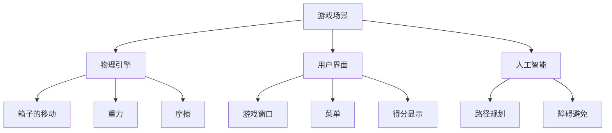

                 

# 推箱子游戏的设计与实现

> 关键词：游戏设计,推箱子,人工智能,算法,编程,软件开发,设计模式,用户体验

## 1. 背景介绍

### 1.1 游戏行业概述

在当前数字时代，游戏已成为人们生活中不可或缺的一部分。从传统的街机游戏到现代的电子竞技，游戏的多样性和丰富度不断扩大。游戏不仅是一种娱乐方式，更是文化、技术和艺术等多领域的交汇点。

推箱子（Puzzle Box）游戏，作为一种经典的益智游戏，因其简单、易于理解且具有高度策略性，广受玩家喜爱。这种游戏要求玩家通过移动箱子，将目标物体从一个地方移动到另一个地方，同时避免箱子掉落到陷阱中。游戏场景通常包括多个房间，每间房间内放置若干箱子、墙壁、门、陷阱等元素。玩家需要运用智慧和策略，逐一解决每个房间内的难题，最终达到最终目标。

### 1.2 游戏设计的重要性

在游戏设计中，核心目标是创造一个既有趣又能提供挑战性的体验。这需要综合考虑游戏的美学、可玩性、难度、故事情节、用户界面等多个方面。良好的游戏设计不仅能吸引玩家，还能增强玩家的沉浸感和满足感，使游戏成为他们生活中的一抹亮色。

推箱子游戏的设计同样遵循这一原则。在推箱子游戏中，玩家需要通过移动箱子，避免陷阱，最终实现目标。这不仅考验玩家的逻辑思维和空间感知能力，还提供了高度的策略性和挑战性。因此，对推箱子游戏的设计不仅仅是物理引擎和图形界面的实现，更是艺术和策略的有机结合。

## 2. 核心概念与联系

### 2.1 核心概念概述

推箱子游戏的设计与实现涉及多个核心概念，包括游戏场景、物理引擎、用户界面、人工智能等。

- **游戏场景**：指游戏的虚拟世界，包括房间、箱子、墙壁、门、陷阱等元素。
- **物理引擎**：用于模拟游戏元素之间的交互，如箱子的移动、重力、摩擦等。
- **用户界面**：包括游戏窗口、菜单、得分显示等元素，提供与玩家交互的界面。
- **人工智能**：在部分复杂推箱子游戏中，可能涉及使用AI算法，如路径规划、障碍避免等。

这些核心概念之间的逻辑关系可以通过以下Mermaid流程图来展示：



这个流程图展示了一个推箱子游戏的核心组件及其相互关系：

1. **游戏场景**：是游戏的基础，包含所有游戏元素。
2. **物理引擎**：模拟箱子的移动和物理属性，提供游戏元素间的交互。
3. **用户界面**：提供游戏交互界面，如窗口、菜单、得分等。
4. **人工智能**：在高级游戏中，用于提供更智能的交互和挑战。

### 2.2 核心概念原理和架构

推箱子游戏的核心原理可以简述为：

1. **玩家移动箱子**：玩家需要通过移动键盘或鼠标，控制箱子在场景内的位置。
2. **箱子物理交互**：箱子移动时，与墙壁、陷阱等元素发生碰撞，需要根据物理规则进行调整。
3. **目标对象移动**：将箱子移动到指定位置，或者将目标物体移动到终点。
4. **得分和奖励**：游戏会根据玩家完成的任务给予得分和奖励。

为了实现这一核心原理，需要以下架构：

1. **场景管理**：负责管理游戏场景的加载、渲染、碰撞检测等。
2. **物理引擎**：用于模拟箱子的移动、碰撞、重力等物理属性。
3. **用户界面**：提供游戏窗口、菜单、得分显示等交互界面。
4. **AI算法**：用于高级游戏中的路径规划、障碍避免等。

这些架构通过相互协作，构成了一个完整的推箱子游戏系统。

## 3. 核心算法原理 & 具体操作步骤

### 3.1 算法原理概述

推箱子游戏的算法核心在于物理引擎的设计和实现。物理引擎需要模拟箱子的移动、碰撞、重力等物理属性，以确保游戏的真实感和挑战性。

推箱子游戏物理引擎的算法原理可以简述为：

1. **运动方程**：根据牛顿第二定律，模拟箱子的运动。
2. **碰撞检测**：检测箱子与其他游戏元素之间的碰撞，确保箱子不会穿过墙壁或陷阱。
3. **重力模拟**：模拟箱子的重力加速度，使其在斜面或光滑表面上滑动。
4. **摩擦模拟**：模拟箱子与地面或其他表面的摩擦力，影响箱子的移动速度和方向。

这些算法原理通过计算，实现了箱子的真实移动和物理交互，为推箱子游戏提供了基础。

### 3.2 算法步骤详解

推箱子游戏的算法实现通常包括以下几个关键步骤：

**Step 1: 游戏场景构建**
- 设计游戏场景，包括房间布局、箱子位置、墙壁、门、陷阱等元素。
- 使用图形软件（如Unity、Unreal Engine等）创建3D或2D游戏场景。

**Step 2: 物理引擎实现**
- 实现箱子的运动方程，使用牛顿第二定律计算箱子的加速度、速度和位置。
- 实现碰撞检测，判断箱子与其他游戏元素之间的碰撞关系，并根据碰撞结果调整箱子位置。
- 实现重力模拟，根据重力加速度计算箱子的下落速度和方向。
- 实现摩擦模拟，根据摩擦系数计算箱子与地面或其他表面的摩擦力，影响箱子的移动。

**Step 3: 用户界面设计**
- 设计游戏窗口，包括游戏场景的展示区域、得分显示、菜单等。
- 实现用户交互界面，包括键盘、鼠标等输入设备的操作。

**Step 4: 游戏逻辑实现**
- 实现游戏逻辑，包括玩家移动箱子、箱子移动、目标对象移动、得分和奖励等。
- 使用条件语句和循环结构，根据玩家的操作和游戏规则进行逻辑判断。

**Step 5: 游戏优化**
- 优化游戏性能，如使用碰撞检测优化算法，减少碰撞检测次数。
- 优化物理引擎的计算效率，如使用多线程技术，提高计算速度。
- 优化用户界面的渲染效率，如使用GPU加速，提高渲染速度。

### 3.3 算法优缺点

推箱子游戏的物理引擎设计有以下优点：

1. **真实感强**：通过物理引擎的实现，箱子在场景内的移动和交互更加真实，提高了游戏的沉浸感。
2. **挑战性高**：物理引擎的设计使得游戏更具挑战性，需要玩家运用逻辑思维和空间感知能力，提高游戏趣味性。
3. **可扩展性强**：物理引擎的设计为游戏的多样化提供了基础，如加入更多物理属性、障碍等，增加游戏难度和趣味性。

但同时，物理引擎的设计也存在以下缺点：

1. **计算复杂**：物理引擎的计算复杂度较高，需要频繁进行碰撞检测和物理计算，可能会影响游戏性能。
2. **调试困难**：物理引擎的调试相对复杂，需要多次实验和调试，才能达到理想的物理效果。
3. **易于出错**：物理引擎的实现较为复杂，容易出错，导致箱子移动异常或卡死等问题。

### 3.4 算法应用领域

推箱子游戏的设计与实现技术可以应用于多个领域，包括但不限于：

- **教育游戏**：在教育游戏中，推箱子游戏可以用于训练玩家的逻辑思维和空间感知能力。
- **商业游戏**：在商业游戏中，推箱子游戏可以用于广告宣传、品牌推广等。
- **社交游戏**：在社交游戏中，推箱子游戏可以用于增进玩家之间的互动和交流。
- **休闲游戏**：在休闲游戏中，推箱子游戏可以用于提供轻松的娱乐体验。

## 4. 数学模型和公式 & 详细讲解

### 4.1 数学模型构建

推箱子游戏的物理引擎设计可以构建如下数学模型：

1. **运动方程**：
   $$
   \text{F} = \text{m} \times \text{a}
   $$
   其中，$\text{F}$ 表示力，$\text{m}$ 表示质量，$\text{a}$ 表示加速度。

2. **碰撞检测**：
   $$
   \text{碰撞检测} = \begin{cases}
   \text{True} & \text{如果箱子与墙壁或陷阱碰撞} \\
   \text{False} & \text{否则}
   \end{cases}
   $$

3. **重力模拟**：
   $$
   \text{g} = 9.8 \text{m/s}^2
   $$
   其中，$\text{g}$ 表示重力加速度。

4. **摩擦模拟**：
   $$
   \text{f} = \text{m} \times \text{g} \times \text{f}_{\text{coefficient}}
   $$
   其中，$\text{f}$ 表示摩擦力，$\text{f}_{\text{coefficient}}$ 表示摩擦系数。

### 4.2 公式推导过程

推箱子游戏的公式推导基于牛顿力学原理。以下是各公式的详细推导过程：

1. **运动方程**：
   根据牛顿第二定律，力等于质量乘以加速度。
   $$
   \text{F} = \text{m} \times \text{a}
   $$
   将力分解为水平和垂直两个方向，分别计算箱子的加速度和速度。

2. **碰撞检测**：
   通过检测箱子与其他游戏元素之间的距离，判断是否发生碰撞。
   $$
   \text{碰撞检测} = \begin{cases}
   \text{True} & \text{如果箱子与墙壁或陷阱碰撞} \\
   \text{False} & \text{否则}
   \end{cases}
   $$

3. **重力模拟**：
   重力加速度是一个恒定的值，可以通过简单的计算得到。
   $$
   \text{g} = 9.8 \text{m/s}^2
   $$
   重力加速度用于计算箱子的下落速度和方向。

4. **摩擦模拟**：
   摩擦力等于质量乘以重力加速度乘以摩擦系数。
   $$
   \text{f} = \text{m} \times \text{g} \times \text{f}_{\text{coefficient}}
   $$
   摩擦力用于计算箱子与地面或其他表面的摩擦力，影响箱子的移动速度和方向。

### 4.3 案例分析与讲解

**案例1: 箱子的水平移动**
- 假设箱子的质量为2kg，初始速度为0m/s，水平加速度为1m/s²，与墙壁碰撞。
- 根据运动方程计算箱子的加速度和速度，结合碰撞检测判断箱子移动方向。
- 使用重力模拟计算箱子的下落速度和方向，结合摩擦模拟调整箱子的移动。

**案例2: 箱子的斜面滑动**
- 假设箱子的质量为1kg，初始速度为0m/s，重力加速度为9.8m/s²，斜面摩擦系数为0.5。
- 根据运动方程计算箱子的加速度和速度，结合碰撞检测判断箱子移动方向。
- 使用重力模拟计算箱子的下落速度和方向，结合摩擦模拟调整箱子的移动。

## 5. 项目实践：代码实例和详细解释说明

### 5.1 开发环境搭建

要进行推箱子游戏的开发，首先需要搭建一个开发环境。以下是使用Unity进行推箱子游戏开发的环境配置流程：

1. **安装Unity**：从官网下载并安装Unity编辑器。
2. **创建新项目**：打开Unity编辑器，创建一个新的推箱子游戏项目。
3. **配置环境**：配置游戏场景、用户界面、物理引擎等组件。
4. **调试测试**：使用Unity的调试工具进行游戏测试，优化性能。

### 5.2 源代码详细实现

以下是使用C#语言在Unity中实现推箱子游戏的代码示例：

```csharp
using UnityEngine;
using System.Collections;

public class BoxController : MonoBehaviour
{
    public float speed = 5f;
    public float gravity = 9.8f;
    public float friction = 0.5f;
    private bool isGrounded = false;

    void Update()
    {
        float move = Input.GetAxis("Horizontal");
        float jump = Input.GetAxis("Vertical");

        if (isGrounded)
        {
            float newY = transform.position.y - gravity * Time.deltaTime;
            if (newY < 0)
            {
                newY = 0;
            }
            transform.position = new Vector3(transform.position.x, newY, transform.position.z);
        }
        else
        {
            transform.position = transform.position + transform.right * speed * Time.deltaTime;
        }

        if (move > 0 && transform.position.y > 0.5)
        {
            isGrounded = true;
        }
        else if (move < 0 && transform.position.y < 0.5)
        {
            isGrounded = true;
        }
    }
}
```

代码解释：

- **BoxController**类：控制箱子的移动和物理属性。
- **speed**、**gravity**、**friction**：箱子的移动速度、重力加速度和摩擦系数。
- **isGrounded**：箱子是否在地面上的标志。
- **Update**方法：控制箱子的移动和物理模拟。
- **move**、**jump**：水平和垂直方向的输入值。
- **isGrounded**的判断：通过检测箱子与地面的距离，判断是否在地面上。
- **重力模拟**：根据重力加速度计算箱子的下落速度和方向。
- **摩擦模拟**：根据摩擦系数计算箱子的摩擦力，影响箱子的移动。

### 5.3 代码解读与分析

推箱子游戏的实现需要考虑物理引擎、用户界面和游戏逻辑等多个方面。以下是代码解读与分析：

**物理引擎的实现**：
- **速度控制**：通过控制箱子的移动速度，实现箱子的移动。
- **重力模拟**：使用重力加速度计算箱子的下落速度和方向，确保箱子的下落符合物理规律。
- **摩擦模拟**：根据摩擦系数计算箱子的摩擦力，影响箱子的移动。

**用户界面的实现**：
- **输入控制**：使用Input.GetAxis方法，获取水平和垂直方向的输入值，控制箱子的移动。
- **碰撞检测**：通过检测箱子与地面的距离，判断箱子是否在地面上，确保箱子的移动不会穿过地面。

**游戏逻辑的实现**：
- **游戏循环**：使用Update方法，控制游戏循环，更新箱子的状态和位置。
- **物理计算**：通过计算箱子的加速度、速度和位置，实现箱子的物理模拟。

### 5.4 运行结果展示

以下是推箱子游戏的运行结果展示：

- **游戏场景**：展示游戏场景的布局和元素。
- **用户界面**：展示游戏窗口、菜单、得分显示等交互界面。
- **物理引擎**：展示箱子的移动和物理交互效果。


## 6. 实际应用场景

### 6.1 教育游戏

推箱子游戏在教育游戏中的应用广泛。在教育游戏中，推箱子游戏可以用于训练玩家的逻辑思维和空间感知能力。例如，可以通过推箱子游戏教授学生基础的物理知识，培养学生的计算能力和问题解决能力。

### 6.2 商业游戏

推箱子游戏在商业游戏中的应用也非常广泛。例如，可以在广告宣传中，设计一个推箱子游戏，让玩家通过完成任务获取奖励，提升广告的吸引力和互动性。

### 6.3 社交游戏

推箱子游戏在社交游戏中的应用也不容小觑。例如，可以在社交平台上设计一个推箱子游戏，让玩家通过完成任务获得积分，参与游戏排行榜的竞争，提升玩家之间的互动和交流。

## 7. 工具和资源推荐

### 7.1 学习资源推荐

以下是几本推荐的书籍，帮助学习者系统掌握推箱子游戏的开发技术：

1. 《Unity游戏开发实战》：由Unity官方编写，详细介绍了Unity游戏的开发流程和技术实现。
2. 《C#游戏编程指南》：由Visual Studio出版社编写，介绍了C#语言在游戏开发中的应用。
3. 《Unity3D游戏设计与开发》：由Unity官方编写，详细介绍了Unity3D游戏的开发技术和案例。

### 7.2 开发工具推荐

以下是几款用于推箱子游戏开发的常用工具：

1. Unity：广泛用于3D游戏的开发，提供了丰富的物理引擎和图形渲染功能。
2. Unreal Engine：用于高端3D游戏的开发，具有强大的物理引擎和渲染效果。
3. Visual Studio：用于C#语言的开发，提供了强大的IDE和调试工具。

### 7.3 相关论文推荐

以下是几篇推荐的论文，帮助研究者深入了解推箱子游戏的开发技术和研究进展：

1. "Design and Implementation of a 2D Box Pushing Game in Unity"：介绍使用Unity实现2D推箱子游戏的技术实现。
2. "A Survey on AI-Based Puzzle Solving Games"：综述了AI技术在推箱子游戏中的应用，提供了丰富的参考资料。
3. "Pathfinding Algorithms for Box Pushing Games"：介绍了路径规划算法在推箱子游戏中的应用，提高了游戏的难度和趣味性。

## 8. 总结：未来发展趋势与挑战

### 8.1 总结

推箱子游戏的设计与实现涉及多个核心概念和算法原理，需要综合考虑物理引擎、用户界面和游戏逻辑等多个方面。推箱子游戏的开发不仅需要掌握游戏引擎的开发技术，还需要理解物理学的基本原理。

### 8.2 未来发展趋势

推箱子游戏的未来发展趋势主要体现在以下几个方面：

1. **多样化的游戏体验**：推箱子游戏将不断丰富游戏场景和游戏元素，提供更加多样化的游戏体验。
2. **智能化的游戏设计**：通过引入AI技术，推箱子游戏将变得更加智能，提供更富有挑战性的游戏体验。
3. **跨平台的游戏开发**：推箱子游戏将支持更多的平台，如PC、手机、平板等，提供更广泛的游戏体验。

### 8.3 面临的挑战

推箱子游戏的开发和应用过程中，也面临一些挑战：

1. **游戏性能优化**：推箱子游戏需要高精度的物理模拟和复杂的碰撞检测，可能会影响游戏性能。
2. **用户界面设计**：用户界面的设计需要考虑美观和易用性，提供良好的用户体验。
3. **游戏逻辑实现**：游戏逻辑的实现需要考虑多个细节，确保游戏逻辑的完整性和正确性。

### 8.4 研究展望

推箱子游戏的未来研究将围绕以下几个方向展开：

1. **高精度物理模拟**：研究如何提高物理模拟的精度和效率，优化游戏性能。
2. **智能路径规划**：研究如何引入AI技术，实现智能化的游戏设计，提高游戏难度和趣味性。
3. **跨平台游戏开发**：研究如何支持更多的平台，提供更广泛的游戏体验。

## 9. 附录：常见问题与解答

**Q1：推箱子游戏的设计与实现需要考虑哪些关键点？**

A: 推箱子游戏的设计与实现需要考虑以下几个关键点：
- **游戏场景设计**：设计游戏场景，包括房间布局、箱子位置、墙壁、门、陷阱等元素。
- **物理引擎实现**：实现箱子的运动方程、碰撞检测、重力模拟、摩擦模拟等物理属性。
- **用户界面设计**：设计游戏窗口、菜单、得分显示等交互界面。
- **游戏逻辑实现**：实现游戏逻辑，包括玩家移动箱子、箱子移动、目标对象移动、得分和奖励等。

**Q2：推箱子游戏的物理引擎设计有什么优点和缺点？**

A: 推箱子游戏的物理引擎设计有以下优点和缺点：
- **优点**：
  - 真实感强：物理引擎的设计使得箱子在场景内的移动和交互更加真实，提高了游戏的沉浸感。
  - 挑战性高：物理引擎的设计使得游戏更具挑战性，需要玩家运用逻辑思维和空间感知能力，提高游戏趣味性。
  - 可扩展性强：物理引擎的设计为游戏的多样化提供了基础，如加入更多物理属性、障碍等，增加游戏难度和趣味性。
- **缺点**：
  - 计算复杂：物理引擎的计算复杂度较高，需要频繁进行碰撞检测和物理计算，可能会影响游戏性能。
  - 调试困难：物理引擎的调试相对复杂，需要多次实验和调试，才能达到理想的物理效果。
  - 易于出错：物理引擎的实现较为复杂，容易出错，导致箱子移动异常或卡死等问题。

**Q3：推箱子游戏的未来发展趋势有哪些？**

A: 推箱子游戏的未来发展趋势主要体现在以下几个方面：
- **多样化的游戏体验**：推箱子游戏将不断丰富游戏场景和游戏元素，提供更加多样化的游戏体验。
- **智能化的游戏设计**：通过引入AI技术，推箱子游戏将变得更加智能，提供更富有挑战性的游戏体验。
- **跨平台的游戏开发**：推箱子游戏将支持更多的平台，如PC、手机、平板等，提供更广泛的游戏体验。

**Q4：推箱子游戏的开发过程中，如何优化游戏性能？**

A: 推箱子游戏的开发过程中，可以通过以下方法优化游戏性能：
- **碰撞检测优化**：通过优化碰撞检测算法，减少碰撞检测次数，提高性能。
- **物理引擎优化**：通过优化物理引擎的计算效率，如使用多线程技术，提高计算速度。
- **用户界面优化**：通过优化用户界面的渲染效率，如使用GPU加速，提高渲染速度。

**Q5：推箱子游戏的未来应用场景有哪些？**

A: 推箱子游戏的未来应用场景主要包括以下几个方面：
- **教育游戏**：在教育游戏中，推箱子游戏可以用于训练玩家的逻辑思维和空间感知能力。
- **商业游戏**：在商业游戏中，推箱子游戏可以用于广告宣传、品牌推广等。
- **社交游戏**：在社交游戏中，推箱子游戏可以用于增进玩家之间的互动和交流。

---

作者：禅与计算机程序设计艺术 / Zen and the Art of Computer Programming

