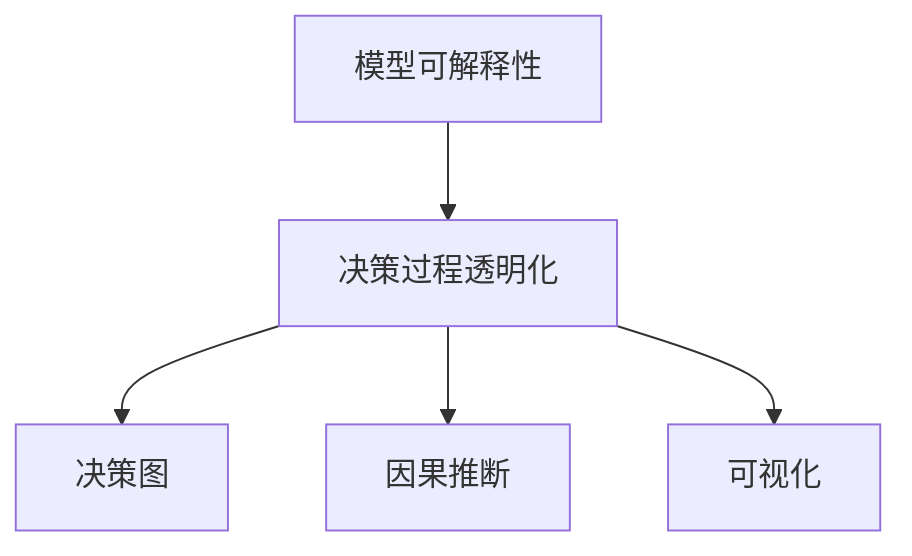

                 

# 提高模型决策过程的透明度

> 关键词：模型可解释性, 决策过程透明化, 决策图, 因果推断, 可视化

## 1. 背景介绍

### 1.1 问题由来
随着人工智能(AI)技术的迅速发展，特别是深度学习在各行各业的应用日益广泛，如何提高模型的可解释性和决策透明度成为了一个迫切需要解决的问题。传统的AI模型，如决策树、支持向量机等，通常具有较高的可解释性，但面对日益复杂的数据和任务，深度学习模型（尤其是深度神经网络）在许多应用场景中表现出更强的预测能力，但也面临黑盒化的决策过程。这种缺乏透明度的模型，在金融、医疗、司法等高风险领域尤为突出，容易造成误解和滥用。

### 1.2 问题核心关键点
模型决策过程的透明度通常指的是模型如何进行输入数据处理、特征提取、中间层计算和最终输出预测的整个过程是否公开、可理解。这个问题的核心关键点在于：
- 如何通过设计和使用模型架构，使得决策过程可被人类理解和验证。
- 如何通过模型训练和微调，优化决策过程的逻辑和鲁棒性。
- 如何通过解释性技术，如决策树、LIME、SHAP等，将模型决策的各个步骤可视化，便于分析和调试。

## 2. 核心概念与联系

### 2.1 核心概念概述

为更好地理解模型决策过程透明化的技术，本节将介绍几个密切相关的核心概念：

- **模型可解释性**：指模型决策过程是否公开、可理解，即能否通过简单的解释说明使得非专家也能理解模型的预测依据。
- **决策过程透明化**：通过可视化和文本描述等方式，将模型的各个决策步骤和计算过程清晰呈现，便于人类理解和验证。
- **决策图(Decision Graph)**：一种将决策树、路径图等可视化表示方法应用于深度学习模型的技术，用于展示模型的决策过程和特征重要性。
- **因果推断(Causal Inference)**：通过统计学和机器学习方法，分析变量之间的因果关系，帮助理解和预测模型决策过程中的逻辑链条。
- **可视化(Visualization)**：使用图形、图表等形式，将复杂的数据和模型信息简化，直观地展现给用户，便于理解和分析。

这些概念之间的逻辑关系可以通过以下Mermaid流程图来展示：



这个流程图展示了几者之间的关系：
- 通过模型可解释性，确保决策过程透明化。
- 决策过程透明化可以通过决策图、因果推断、可视化等多种手段实现。

## 3. 核心算法原理 & 具体操作步骤
### 3.1 算法原理概述

模型决策过程透明化的核心原理是使用多种技术手段，将模型的决策逻辑和过程公开、可视化，使其可以被人类理解和验证。其核心思想是将复杂、抽象的模型表示为易于理解的形式，如决策树、路径图等，并将模型的计算过程和中间结果可视化呈现。

### 3.2 算法步骤详解

基于模型决策过程透明化的目标，通常包括以下几个关键步骤：

**Step 1: 选择适当的解释性方法**
- 根据具体应用场景，选择合适的解释性方法，如决策树、LIME、SHAP、CAIMM等。
- 对于分类任务，可以使用决策树、LIME、SHAP等方法。
- 对于生成任务，可以使用决策图、生成对抗网络(GAN)等方法。

**Step 2: 模型选择和训练**
- 选择合适的深度学习模型，如决策树、随机森林、LSTM、Transformer等。
- 使用训练数据对模型进行训练，确保模型在特定任务上达到较高精度。
- 对于深度模型，可以在训练过程中引入正则化技术，如L2正则、Dropout、Early Stopping等，避免过拟合。

**Step 3: 解释性计算**
- 应用选定的解释性方法，对训练好的模型进行解释性计算。
- 对于决策树，可以提取决策路径和特征重要性。
- 对于LIME、SHAP等方法，可以生成局部近似模型(LAM)，用于解释模型在特定样本上的预测。
- 对于生成对抗网络(GAN)，可以通过生成样本数据，进一步理解模型的生成过程和特征分布。

**Step 4: 可视化呈现**
- 使用图表、决策图、表格等形式，将解释性结果呈现给用户。
- 对于决策树，可以展示决策路径、特征重要性和规则。
- 对于LIME、SHAP，可以展示特征贡献度和局部近似模型。
- 对于GAN，可以展示生成样本和特征分布。

**Step 5: 交互式分析**
- 为使用用户提供交互式分析工具，如交互式决策图、可编辑的LIME解释结果等。
- 允许用户对特定样本进行详细解释，以验证模型预测的合理性。
- 提供定制化的可视化选项，满足不同用户和场景的需求。

### 3.3 算法优缺点

模型决策过程透明化的主要优点包括：
1. 增强用户信任。通过透明化决策过程，用户可以更好地理解模型的预测依据，增加对模型的信任感。
2. 提升模型鲁棒性。可视化的过程可以帮助开发者发现模型中的错误和缺陷，进一步优化模型。
3. 支持模型验证和调试。可视化结果可以作为验证和调试的重要依据，帮助开发者和用户共同发现问题。

同时，该方法也存在一定的局限性：
1. 复杂度高。特别是对于深度学习模型，解释性计算和可视化过程可能非常复杂，需要耗费大量时间和资源。
2. 解释精度受限。现有的解释性方法往往只能提供局部或近似的解释，难以全面、准确地描述模型的决策逻辑。
3. 数据隐私问题。在解释性计算和可视化过程中，可能泄露敏感数据，需要注意数据保护。
4. 可扩展性不足。对于大规模数据和复杂模型，解释性计算和可视化可能面临性能瓶颈。

尽管存在这些局限性，但就目前而言，提高模型决策过程透明化的方法仍然是优化深度学习模型和确保其安全可靠的重要手段。未来相关研究的重点在于如何进一步降低复杂度、提高解释精度、保护数据隐私，并增强模型的可扩展性。

### 3.4 算法应用领域

模型决策过程透明化的应用场景非常广泛，涉及多个领域：

- **金融**：模型在贷款审批、风险评估、投资决策等任务上，决策透明化可以帮助监管机构和用户更好地理解模型预测。
- **医疗**：模型在疾病诊断、治疗方案推荐等任务上，决策透明化可以提高医生的决策可信度，减少误诊。
- **司法**：模型在判决预测、法律咨询等任务上，决策透明化可以提升司法公正性，减少错误判决。
- **教育**：模型在个性化学习、作业评分等任务上，决策透明化可以提升教师和学生的理解，改进教育效果。
- **制造业**：模型在故障预测、生产调度等任务上，决策透明化可以提高生产效率和产品质量。

这些领域中，模型决策过程透明化都是至关重要的。通过透明化决策过程，可以增强模型的可信度，降低风险，提升应用价值。

## 4. 数学模型和公式 & 详细讲解 & 举例说明
### 4.1 数学模型构建

决策树是一种常用的模型可解释性方法，其数学模型构建如下：

- 决策树模型可以表示为一系列条件语句的组合，形式化表示为：
  $$
  T = \bigwedge_{i=1}^m \text{if}~x_i > t_i~\text{then}~y_i \in C_i
  $$
  其中，$x_i$ 表示输入特征，$t_i$ 表示特征阈值，$y_i$ 表示输出结果，$C_i$ 表示输出类别。
  
- 决策树的构建过程，通常使用贪心算法，每次选择最优特征和阈值进行分裂。

### 4.2 公式推导过程

决策树的构建过程，可以通过信息熵和信息增益来推导。以二分类任务为例：

- 假设训练数据集为 $D=\{(x_1,y_1),(x_2,y_2),\ldots,(x_n,y_n)\}$，其中 $y_i \in \{0,1\}$。
- 计算训练数据集的熵 $H(D)$：
  $$
  H(D) = -\sum_{i=1}^n p_i \log_2 p_i
  $$
  其中，$p_i = \frac{1}{n} \sum_{j=1}^n \mathbb{I}(y_j = i)$，$\mathbb{I}$ 表示示性函数。
- 计算输入特征 $x_j$ 的信息增益 $IG(x_j, D)$：
  $$
  IG(x_j, D) = H(D) - \sum_{v \in V_j} \frac{|D_v|}{|D|} H(D_v)
  $$
  其中，$V_j$ 表示特征 $x_j$ 的可能取值集合，$D_v = \{(x_i,y_i)~|~x_i[j] = v\}$。

决策树的构建过程，就是在特征集合 $X$ 中选择信息增益最大的特征 $x_j$ 作为分裂节点，根据特征值将数据集分为多个子集，并递归构建子树的决策树。

### 4.3 案例分析与讲解

以房价预测为例，使用决策树模型进行解释：

假设训练数据集包含 $n$ 个样本，每个样本包含 $m$ 个特征。首先，计算特征 $x_1, x_2, \ldots, x_m$ 的信息增益 $IG(x_j, D)$。选择信息增益最大的特征 $x_j$ 作为分裂节点，将数据集分为 $k$ 个子集 $D_1, D_2, \ldots, D_k$。然后，递归构建子树的决策树。

以特征 $x_1$ 为例，假设训练数据集的熵为 $H(D) = 0.9$，特征 $x_1$ 的可能取值为 $v_1, v_2, \ldots, v_k$。计算 $v_j$ 的样本比例 $p_j = \frac{|D_j|}{|D|}$，子集 $D_j$ 的熵 $H(D_j) = -\sum_{i=1}^n p_{ij} \log_2 p_{ij}$，其中 $p_{ij} = \frac{1}{|D_j|} \sum_{k=1}^n \mathbb{I}(y_k = i, x_k[j] = v_j)$。最终，计算信息增益 $IG(x_1, D) = H(D) - \sum_{j=1}^k p_j H(D_j)$。选择信息增益最大的特征 $x_1$ 作为分裂节点，递归构建子树的决策树。

## 5. 项目实践：代码实例和详细解释说明
### 5.1 开发环境搭建

在进行决策过程透明化的实践前，我们需要准备好开发环境。以下是使用Python进行Scikit-Learn开发的环境配置流程：

1. 安装Anaconda：从官网下载并安装Anaconda，用于创建独立的Python环境。

2. 创建并激活虚拟环境：
```bash
conda create -n explain-env python=3.8 
conda activate explain-env
```

3. 安装Scikit-Learn：
```bash
conda install scikit-learn
```

4. 安装其他工具包：
```bash
pip install numpy pandas matplotlib jupyter notebook
```

完成上述步骤后，即可在`explain-env`环境中开始解释性计算和可视化实践。

### 5.2 源代码详细实现

下面我们以房价预测为例，使用Scikit-Learn中的决策树模型进行解释性计算和可视化。

首先，准备数据集并进行预处理：

```python
import pandas as pd
from sklearn.model_selection import train_test_split
from sklearn.preprocessing import StandardScaler
from sklearn.tree import DecisionTreeClassifier

# 加载数据集
data = pd.read_csv('house_prices.csv')

# 特征选择
selected_features = ['sqft_living', 'grade', 'num_bedrooms']
X = data[selected_features]
y = data['price']

# 数据标准化
scaler = StandardScaler()
X = scaler.fit_transform(X)

# 划分训练集和测试集
X_train, X_test, y_train, y_test = train_test_split(X, y, test_size=0.2, random_state=42)
```

然后，训练决策树模型并计算特征重要性：

```python
from sklearn.tree import DecisionTreeClassifier
from sklearn.tree import plot_tree
from sklearn.tree import plot_tree
from sklearn.tree import export_graphviz

# 训练决策树模型
clf = DecisionTreeClassifier()
clf.fit(X_train, y_train)

# 输出决策树结构
print(clf)

# 输出特征重要性
importances = clf.feature_importances_
feature_names = selected_features
feature_importance = pd.DataFrame({'feature': feature_names, 'importance': importances})
print(feature_importance)

# 绘制决策树可视化图
plt.figure(figsize=(12, 8))
plot_tree(clf, filled=True)
plt.show()

# 生成决策树图形文件
dot_data = export_graphviz(clf, out_file=None, feature_names=feature_names, class_names=['low', 'high'], filled=True, rounded=True, special_characters=True)
graph = pydot.graph_from_dot_data(dot_data)
plt.figure(figsize=(12, 8))
graph.write_png('decision_tree.png')
plt.show()
```

最后，输出决策树结构、特征重要性和决策树可视化图：

```python
# 输出决策树结构
print(clf)

# 输出特征重要性
importances = clf.feature_importances_
feature_names = selected_features
feature_importance = pd.DataFrame({'feature': feature_names, 'importance': importances})
print(feature_importance)

# 绘制决策树可视化图
plt.figure(figsize=(12, 8))
plot_tree(clf, filled=True)
plt.show()

# 生成决策树图形文件
dot_data = export_graphviz(clf, out_file=None, feature_names=feature_names, class_names=['low', 'high'], filled=True, rounded=True, special_characters=True)
graph = pydot.graph_from_dot_data(dot_data)
plt.figure(figsize=(12, 8))
graph.write_png('decision_tree.png')
plt.show()
```

通过以上代码实现，可以对决策树模型的决策过程进行详细的解释性计算和可视化呈现，帮助用户理解模型的预测依据和特征重要性。

### 5.3 代码解读与分析

让我们再详细解读一下关键代码的实现细节：

**Data Preprocessing**：
- 数据加载：使用`pandas`读取数据集，并进行特征选择。
- 数据标准化：使用`StandardScaler`对特征进行标准化处理，避免特征之间的尺度差异影响模型训练。
- 数据划分：使用`train_test_split`划分训练集和测试集。

**Model Training**：
- 训练模型：使用`DecisionTreeClassifier`训练决策树模型。
- 输出模型结构：使用`print`函数输出模型结构。
- 计算特征重要性：使用`feature_importances_`属性计算特征重要性，并使用`pd.DataFrame`转换为DataFrame格式。
- 可视化模型：使用`plot_tree`函数绘制决策树可视化图，并使用`export_graphviz`函数生成决策树图形文件。

可以看到，Scikit-Learn提供了丰富的决策树解释性计算和可视化工具，通过这些工具，可以轻松实现模型决策过程透明化的目标。

## 6. 实际应用场景
### 6.1 智能推荐系统

智能推荐系统是模型决策过程透明化的典型应用场景。通过分析用户行为数据，智能推荐系统可以实时为用户推荐个性化商品或服务。然而，推荐系统的推荐逻辑通常是高度复杂和黑盒化的，缺乏透明度，容易造成用户困惑和误解。

为了提高推荐系统的透明度，可以使用决策树、LIME、SHAP等解释性方法，对模型的决策过程进行详细解释。例如，可以使用决策树模型分析用户行为与推荐结果之间的逻辑关系，通过可视化展示决策路径和特征重要性，使用户更容易理解和接受推荐结果。此外，还可以通过LIME、SHAP等方法，生成局部近似模型，对特定用户行为进行详细解释，进一步提升系统的可信度和用户满意度。

### 6.2 医疗诊断系统

医疗诊断系统是另一个需要高透明度的应用场景。由于医疗数据的复杂性和敏感性，医疗诊断系统的决策过程必须公开透明，才能获得医生和患者的信任。

为了实现医疗诊断系统的决策过程透明化，可以使用因果推断和决策树等方法。例如，可以使用因果推断方法分析不同医疗变量之间的因果关系，通过可视化展示决策链条，帮助医生理解模型预测的依据。此外，还可以使用决策树模型分析病人的症状和诊断结果之间的逻辑关系，通过可视化展示决策路径和特征重要性，帮助医生验证诊断结果的正确性。

### 6.3 风险管理平台

风险管理平台是用于预测和评估金融风险的工具。传统的风险管理平台通常是黑盒化的，缺乏透明度，容易造成误解和滥用。

为了提高风险管理平台的透明度，可以使用LIME、SHAP等解释性方法，对模型的决策过程进行详细解释。例如，可以使用LIME方法生成局部近似模型，对特定交易进行详细解释，帮助用户理解模型的预测依据。此外，还可以使用决策树模型分析交易特征与风险评估结果之间的逻辑关系，通过可视化展示决策路径和特征重要性，帮助用户验证风险评估结果的正确性。

### 6.4 未来应用展望

随着模型决策过程透明化的技术不断进步，未来的应用场景将更加丰富多样。

在智能制造领域，模型决策过程透明化可以帮助提升生产效率和产品质量。通过分析设备运行数据，智能制造系统可以实时监测设备状态，预测故障风险，并自动调度维护资源。使用决策树和可视化工具，可以直观展示设备状态与故障风险之间的逻辑关系，帮助工程师理解模型的预测依据。

在环境保护领域，模型决策过程透明化可以帮助提升环境监测和治理效果。通过分析环境数据，环境监测系统可以实时评估环境质量，预测污染风险，并提出治理方案。使用因果推断和决策树方法，可以直观展示环境变量与治理效果之间的逻辑关系，帮助决策者理解模型的预测依据。

此外，在智能交通、智能能源、智能物流等多个领域，模型决策过程透明化也将发挥重要作用，推动人工智能技术在更广泛的场景中落地应用。

## 7. 工具和资源推荐
### 7.1 学习资源推荐

为了帮助开发者系统掌握模型决策过程透明化的理论基础和实践技巧，这里推荐一些优质的学习资源：

1. 《Python机器学习》：Wes McKinney所著，全面介绍了Python在机器学习中的应用，包括决策树、LIME、SHAP等解释性方法。

2. 《深入理解机器学习：从原理到算法》：唐杰所著，深入浅出地介绍了机器学习的原理和算法，涵盖了决策树、因果推断、可视化等前沿话题。

3. 《深度学习》：Ian Goodfellow、Yoshua Bengio和Aaron Courville所著，详细介绍了深度学习的基础知识和前沿技术，包括模型可解释性、因果推断等。

4. 《机器学习实战》：Peter Harrington所著，提供了大量的代码实例，帮助读者深入理解机器学习算法和模型可解释性方法。

5. 《Scikit-Learn官方文档》：Scikit-Learn官方文档，提供了丰富的模型可解释性工具和示例，是学习Scikit-Learn的必备资料。

通过对这些资源的学习实践，相信你一定能够快速掌握模型决策过程透明化的精髓，并用于解决实际的NLP问题。
###  7.2 开发工具推荐

高效的开发离不开优秀的工具支持。以下是几款用于模型决策过程透明化的常用工具：

1. Scikit-Learn：Python中的经典机器学习库，提供了丰富的模型可解释性工具，如决策树、LIME、SHAP等。

2. SHAP：模型解释性库，通过Shapley值等方法计算模型特征贡献度，生成局部近似模型，可视化模型决策过程。

3. ELI5：模型解释性库，通过文本和图表形式解释模型预测结果，支持决策树、随机森林、神经网络等模型。

4. PyCaret：模型选择和调优库，提供了丰富的模型可解释性工具，支持决策树、LIME、SHAP等方法。

5. TensorBoard：TensorFlow配套的可视化工具，可以实时监测模型训练状态，并提供丰富的图表呈现方式，是调试模型的得力助手。

6. Weights & Biases：模型训练的实验跟踪工具，可以记录和可视化模型训练过程中的各项指标，方便对比和调优。

合理利用这些工具，可以显著提升模型决策过程透明化的开发效率，加快创新迭代的步伐。

### 7.3 相关论文推荐

模型决策过程透明化的研究源于学界的持续研究。以下是几篇奠基性的相关论文，推荐阅读：

1. LIME: An Explainable AI Toolkit：LIME（局部可解释模型）方法，通过生成局部近似模型，解释深度学习模型的预测结果。

2. SHAP: A Unified Approach to Interpreting Model Predictions：SHAP（Shapley Additive Explanations）方法，通过Shapley值等方法计算模型特征贡献度，生成局部近似模型，可视化模型决策过程。

3. Decision Tree Interpretability：决策树方法的经典论文，介绍了决策树模型的构建和解释方法，提供了丰富的解释性工具。

4. Visualizing and Understanding the Prediction Decisions of Deep Neural Networks：关于神经网络解释性的论文，介绍了使用可视化技术解释神经网络决策过程的方法。

5. Beyond Generalization: Causal Relationships for Predicting Medical Outcomes in Clinical Data：关于因果推断的论文，通过统计学方法分析变量之间的因果关系，帮助理解和预测模型决策过程中的逻辑链条。

这些论文代表了大模型决策过程透明化的发展脉络。通过学习这些前沿成果，可以帮助研究者把握学科前进方向，激发更多的创新灵感。

## 8. 总结：未来发展趋势与挑战
### 8.1 总结

本文对模型决策过程透明化的技术进行了全面系统的介绍。首先阐述了模型决策过程透明化的研究背景和意义，明确了模型决策过程透明化的重要性和必要性。其次，从原理到实践，详细讲解了模型决策过程透明化的数学原理和关键步骤，给出了模型决策过程透明化的完整代码实例。同时，本文还广泛探讨了模型决策过程透明化的实际应用场景，展示了模型决策过程透明化的广阔前景。

通过本文的系统梳理，可以看到，模型决策过程透明化是提高人工智能系统可信度和用户满意度的重要手段。随着模型决策过程透明化技术的不断进步，未来的应用场景将更加丰富多样，为各行各业带来新的创新突破。

### 8.2 未来发展趋势

展望未来，模型决策过程透明化的发展趋势如下：

1. 模型可解释性方法的不断丰富。未来的研究将探索更多高效、可解释的模型，如AlphaZero、自适应神经网络等，进一步提升模型的可解释性。

2. 因果推断与机器学习方法的融合。通过引入因果推断方法，模型决策过程透明化将更加全面、准确，提升模型的鲁棒性和预测能力。

3. 交互式决策工具的开发。未来将开发更多交互式决策工具，如交互式决策树、可编辑的LIME解释结果等，提升用户对模型的理解和验证能力。

4. 多模态数据整合。未来的模型决策过程透明化将支持多模态数据的整合，提升模型的综合预测能力。

5. 分布式决策系统的构建。未来的模型决策过程透明化将支持分布式计算环境，提高系统的可扩展性和计算效率。

这些趋势凸显了模型决策过程透明化的广阔前景，这些方向的探索发展，将推动模型决策过程透明化技术迈向更高的台阶，为人工智能系统带来更多的创新突破。

### 8.3 面临的挑战

尽管模型决策过程透明化技术已经取得了显著进展，但在迈向更加智能化、普适化应用的过程中，它仍面临诸多挑战：

1. 模型复杂度增加。随着模型可解释性方法的不断丰富，模型的复杂度可能进一步增加，带来更高的计算和存储成本。

2. 解释精度受限。当前的解释性方法往往只能提供局部或近似的解释，难以全面、准确地描述模型的决策逻辑。

3. 数据隐私问题。在解释性计算和可视化过程中，可能泄露敏感数据，需要注意数据保护。

4. 可扩展性不足。对于大规模数据和复杂模型，解释性计算和可视化可能面临性能瓶颈。

尽管存在这些挑战，但通过研究者的不懈努力和技术的不断进步，这些挑战终将一一被克服，模型决策过程透明化必将在构建安全、可靠、可解释、可控的智能系统中发挥重要作用。相信随着模型的不断演进和技术的持续创新，模型决策过程透明化技术将更加成熟，为各行各业带来更多的创新突破。

### 8.4 研究展望

面向未来，模型决策过程透明化的研究需要在以下几个方面寻求新的突破：

1. 探索无监督和半监督决策过程透明化方法。摆脱对大规模标注数据的依赖，利用自监督学习、主动学习等无监督和半监督范式，最大限度利用非结构化数据，实现更加灵活高效的决策过程透明化。

2. 研究高效、准确的解释性计算方法。开发更加高效、准确的解释性计算方法，如因果推断、注意力机制等，进一步提升决策过程透明化的精度和可解释性。

3. 融合多模态数据进行决策过程透明化。将符号化的先验知识，如知识图谱、逻辑规则等，与神经网络模型进行巧妙融合，引导决策过程透明化过程学习更准确、合理的决策逻辑。

4. 引入伦理道德约束。在决策过程透明化模型的训练目标中引入伦理导向的评估指标，过滤和惩罚有偏见、有害的输出倾向。同时加强人工干预和审核，建立模型行为的监管机制，确保输出符合人类价值观和伦理道德。

这些研究方向的探索，必将引领模型决策过程透明化技术迈向更高的台阶，为构建安全、可靠、可解释、可控的智能系统铺平道路。面向未来，模型决策过程透明化技术还需要与其他人工智能技术进行更深入的融合，如知识表示、因果推理、强化学习等，多路径协同发力，共同推动自然语言理解和智能交互系统的进步。只有勇于创新、敢于突破，才能不断拓展语言模型的边界，让智能技术更好地造福人类社会。

## 9. 附录：常见问题与解答

**Q1：模型决策过程透明化是否适用于所有模型？**

A: 模型决策过程透明化主要适用于深度学习模型，特别是神经网络模型。对于传统机器学习模型，如决策树、支持向量机等，由于其可解释性较强，直接使用特征重要性和决策路径等方法即可实现决策过程透明化。

**Q2：模型决策过程透明化对模型性能有影响吗？**

A: 模型决策过程透明化通常不会显著影响模型性能。解释性计算和可视化过程中，对模型进行一定的剪枝和参数冻结，以避免对模型性能产生较大影响。同时，一些高效的解释性方法，如LIME、SHAP等，可以生成局部近似模型，避免对模型整体性能产生较大影响。

**Q3：如何平衡模型性能和解释性？**

A: 在模型设计阶段，应综合考虑模型性能和解释性。可以使用决策树、LIME、SHAP等方法，在不影响模型性能的前提下，生成模型决策过程的详细解释。在模型训练阶段，可以使用正则化技术，如L2正则、Dropout等，提升模型的鲁棒性和泛化能力，进一步提升解释性。

**Q4：模型决策过程透明化是否只适用于解释性模型？**

A: 模型决策过程透明化并不仅适用于解释性模型。对于复杂、黑盒化的深度学习模型，通过引入解释性方法，可以增强其透明度，便于用户理解和验证。

**Q5：模型决策过程透明化能否应对模型偏见？**

A: 模型决策过程透明化可以揭示模型偏见和缺陷，帮助开发者和用户共同发现问题，进而优化模型。例如，可以使用LIME、SHAP等方法，生成局部近似模型，分析模型在特定样本上的预测依据，发现模型中的偏见和缺陷。

通过本文的系统梳理，可以看到，模型决策过程透明化是提高人工智能系统可信度和用户满意度的重要手段。随着模型决策过程透明化技术的不断进步，未来的应用场景将更加丰富多样，为各行各业带来新的创新突破。未来，随着技术的不断演进和创新，模型决策过程透明化技术必将更加成熟，为构建安全、可靠、可解释、可控的智能系统铺平道路。

