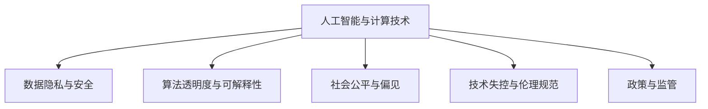

                 

## 1. 背景介绍

### 1.1 问题由来
随着人工智能(AI)技术的发展，计算已经成为人类社会发展的重要推动力量。从自动化生产到智能医疗，从金融分析到天气预测，计算正在各个领域扮演越来越关键的角色。然而，伴随着算力的提升和计算模式的演进，人类计算的健康发展面临着诸多挑战和风险。如何通过政策与监管措施，引导计算技术的发展方向，使其在为人类带来福祉的同时，也符合伦理和安全的考量，成为一个亟待解决的问题。

### 1.2 问题核心关键点
当前，AI计算面临的核心问题是如何在技术创新与伦理安全之间取得平衡。主要包括以下几个方面：

- 数据隐私与安全：如何保护数据隐私，避免数据滥用和泄露。
- 算法透明度与可解释性：如何让AI计算过程更加透明，便于理解和解释。
- 社会公平与偏见：如何确保AI计算不会加剧社会不平等，避免算法偏见。
- 自动化与就业：如何应对自动化带来的就业风险，平衡技术进步与人类福祉。
- 技术失控与伦理规范：如何在技术迅猛发展的同时，防止AI系统失去控制，制定合理的伦理规范。

这些问题不仅关乎技术的伦理安全，更关乎社会的稳定与进步。因此，在AI计算发展过程中，引入政策与监管机制，确保技术健康发展，具有重要意义。

## 2. 核心概念与联系

### 2.1 核心概念概述

为更好地理解AI计算的政策与监管机制，本节将介绍几个密切相关的核心概念：

- **人工智能与计算技术**：包括机器学习、深度学习、自然语言处理、计算机视觉等技术，以及量子计算、边缘计算、物联网等新型计算模式。
- **数据隐私与安全**：涉及个人信息的保护、数据传输的安全、数据的匿名化处理等。
- **算法透明度与可解释性**：要求AI算法的工作机制和决策过程可以被理解、解释和监督。
- **社会公平与偏见**：关注AI算法在就业、医疗、教育等社会领域的应用，如何避免算法偏见，保障社会公平。
- **技术失控与伦理规范**：讨论AI技术的滥用风险，制定伦理规范，确保技术安全可控。
- **政策与监管**：包括法律法规、行业标准、技术指南等，用于规范AI计算的开发、部署和应用。

这些核心概念之间的逻辑关系可以通过以下Mermaid流程图来展示：



这个流程图展示了一系列核心概念的逻辑关系：

1. 人工智能与计算技术是基础。
2. 数据隐私与安全、算法透明度与可解释性、社会公平与偏见、技术失控与伦理规范等都是基于计算技术的应用考量。
3. 政策与监管是确保这些应用健康发展的关键机制。

## 3. 核心算法原理 & 具体操作步骤

### 3.1 算法原理概述

AI计算的政策与监管，本质上是对于计算技术伦理、安全、公平等价值目标的规范化。其核心思想是通过制定相关政策与法规，引导计算技术的发展方向，确保技术在应用过程中能够满足伦理和安全的考量，同时促进社会的公平与进步。

具体而言，政策与监管的实现可以分为以下几个关键步骤：

1. **数据保护与隐私**：通过立法保护个人隐私，防止数据滥用和泄露。
2. **算法透明度与可解释性**：要求算法具有可解释性，便于监督和审查。
3. **社会公平与偏见**：确保AI算法不会加剧社会不平等，避免算法偏见。
4. **技术失控与伦理规范**：制定伦理规范，防止AI系统失去控制。
5. **政策与法规**：制定和实施相关政策与法规，确保技术健康发展。

### 3.2 算法步骤详解

AI计算的政策与监管过程一般包括以下几个关键步骤：

**Step 1: 数据保护与隐私**

- 制定数据保护法律法规，如欧盟的GDPR（通用数据保护条例），要求企业在数据收集、存储、处理、传输等各个环节遵守隐私保护标准。
- 设计数据加密、匿名化处理技术，确保数据在传输和存储过程中的安全。
- 建立数据使用授权机制，确保数据仅用于合法目的，并在规定范围内使用。

**Step 2: 算法透明度与可解释性**

- 要求算法设计透明，确保算法决策过程可以被理解和解释。
- 引入算法可解释性技术，如LIME（局部可解释模型-不可知）、SHAP（SHapley Additive exPlanations）等，对模型的决策过程进行解释。
- 建立算法审查机制，定期对算法进行审计，确保其工作机制符合伦理和法律要求。

**Step 3: 社会公平与偏见**

- 制定算法偏见检测和纠正机制，确保算法在各个领域（如金融、医疗、司法等）的公平性。
- 设计反偏见算法，如使用公平性约束条件优化算法参数，避免算法偏见。
- 建立算法影响评估机制，定期对算法在社会各领域的应用效果进行评估，确保算法不加剧社会不平等。

**Step 4: 技术失控与伦理规范**

- 制定AI系统使用的伦理规范，明确AI系统的使用场景、限制条件和责任归属。
- 建立AI系统安全机制，确保系统在异常情况下的稳定性和安全性。
- 设计AI系统的应急响应机制，一旦发现系统行为异常，能够及时采取措施，避免对社会造成重大影响。

**Step 5: 政策与法规**

- 制定AI计算相关的法律法规和行业标准，确保技术应用符合伦理和安全要求。
- 建立AI计算监管机构，负责监督和审查AI系统的开发、部署和使用。
- 定期更新政策与法规，确保其与时俱进，适应技术发展的变化。

### 3.3 算法优缺点

AI计算的政策与监管方法具有以下优点：

1. **保障数据隐私与安全**：通过法律法规和技术手段，有效保护个人隐私，防止数据滥用和泄露。
2. **增强算法透明度与可解释性**：确保算法的透明和可解释，便于监督和审查，提高社会信任。
3. **促进社会公平与进步**：通过反偏见和公平性约束，确保算法在各个领域的应用不会加剧社会不平等，促进社会公平。
4. **防止技术失控**：制定伦理规范和安全机制，防止AI系统失控，确保技术健康发展。

然而，该方法也存在一些局限性：

1. **法律和监管滞后**：法律法规的制定和实施往往滞后于技术的发展，难以及时应对新技术带来的风险。
2. **政策执行难度大**：技术监管和执行需要高昂的投入和专业知识，对政策执行机构提出了较高要求。
3. **技术复杂性高**：AI计算技术复杂，监管和合规难度较大，需要多学科的协作和多方利益的平衡。
4. **全球协调困难**：AI计算技术具有全球性，各国政策和法规可能存在差异，难以实现全球统一的标准和监管。

尽管存在这些局限性，但就目前而言，政策与监管仍是大规模AI计算应用过程中不可或缺的保障机制。未来，需要不断完善法律法规和技术手段，提升政策执行能力，确保AI计算健康发展。

### 3.4 算法应用领域

AI计算的政策与监管方法已经在多个领域得到了广泛应用，包括但不限于以下几个方面：

- **金融领域**：通过数据保护和隐私政策，确保金融数据的安全和合规使用。通过算法审查和偏见检测，提升金融服务的公平性和透明度。
- **医疗领域**：通过数据隐私和安全措施，保护患者隐私。通过算法透明度和可解释性，增强医疗决策的可信度和可解释性。
- **教育领域**：通过公平性和反偏见算法，确保教育资源的公平分配。通过算法审查和监督，防止教育算法的不公平和偏见。
- **司法领域**：通过算法审查和伦理规范，确保司法决策的公正性和透明度。通过反偏见算法，避免算法偏见对司法公正的影响。
- **公共安全领域**：通过技术安全机制和应急响应措施，确保AI技术在公共安全应用中的安全性。通过伦理规范和政策法规，防止AI技术滥用。

这些领域的应用展示了AI计算政策与监管的广泛影响，也证明了其必要性和重要性。

## 4. 数学模型和公式 & 详细讲解 & 举例说明

### 4.1 数学模型构建

本节将使用数学语言对AI计算的政策与监管机制进行更加严格的刻画。

假设存在一个AI计算系统，其输入为 $X$，输出为 $Y$。系统的决策过程可以表示为函数 $f(X)$，其中 $f$ 为模型参数，通常通过深度学习模型来训练和优化。

定义数据隐私保护措施为 $P$，算法透明度和可解释性为 $T$，社会公平与偏见检测为 $F$，技术安全机制为 $S$，法律法规和行业标准为 $L$。则整个系统的监管过程可以表示为：

$$
\min_{f, P, T, F, S, L} \mathcal{L}(f, P, T, F, S, L)
$$

其中 $\mathcal{L}$ 为综合损失函数，包括数据隐私损失、算法透明度损失、社会公平损失、技术安全损失和法律法规损失。

### 4.2 公式推导过程

以下是该数学模型的具体推导过程：

1. **数据隐私保护**
   - 定义数据隐私损失函数 $\mathcal{L}_{P}$，衡量数据泄露的风险和隐私保护的效果。
   - 引入隐私保护技术，如数据加密、匿名化处理等，通过最小化 $\mathcal{L}_{P}$ 来确保数据隐私。

2. **算法透明度与可解释性**
   - 定义算法透明度损失函数 $\mathcal{L}_{T}$，衡量算法的透明程度和可解释性。
   - 引入算法可解释性技术，如LIME、SHAP等，通过最小化 $\mathcal{L}_{T}$ 来提升算法的透明性和可解释性。

3. **社会公平与偏见**
   - 定义算法公平性损失函数 $\mathcal{L}_{F}$，衡量算法的公平性和偏见程度。
   - 引入反偏见算法和公平性约束条件，通过最小化 $\mathcal{L}_{F}$ 来确保算法的公平性。

4. **技术安全与伦理规范**
   - 定义技术安全损失函数 $\mathcal{L}_{S}$，衡量AI系统的稳定性和安全性。
   - 引入技术安全机制，如异常检测、应急响应等，通过最小化 $\mathcal{L}_{S}$ 来提升系统的安全性。
   - 制定伦理规范和法律法规，通过最小化 $\mathcal{L}_{L}$ 来确保技术应用符合伦理和安全要求。

综合上述损失函数，可以构建综合损失函数 $\mathcal{L}$：

$$
\mathcal{L} = \mathcal{L}_{P} + \mathcal{L}_{T} + \mathcal{L}_{F} + \mathcal{L}_{S} + \mathcal{L}_{L}
$$

通过最小化 $\mathcal{L}$，可以确保AI计算系统在隐私保护、算法透明、社会公平、技术安全、法律法规等方面的合规性和健康发展。

### 4.3 案例分析与讲解

**案例1: 金融领域的算法审查与偏见检测**

在金融领域，AI算法被广泛应用于信用评分、贷款审批、欺诈检测等任务。然而，这些算法可能会因为数据偏见和算法偏见，导致不公正的决策，加剧社会不平等。

为解决这一问题，可以引入以下政策与监管措施：

- **数据审查与隐私保护**：对金融机构的数据收集和使用进行审查，确保数据来源合法、数据处理符合隐私保护要求。
- **算法审查与偏见检测**：定期对金融算法进行审查，检测其偏见程度，确保算法决策的公正性和透明度。
- **反偏见算法设计**：使用公平性约束条件和反偏见算法，如Adversarial Debiasing，对算法进行优化，确保算法的公平性。

通过这些措施，可以有效保护金融数据隐私，提升算法的透明性和公平性，确保金融服务的公正性和可信度。

**案例2: 医疗领域的隐私保护与算法可解释性**

在医疗领域，AI算法被应用于疾病诊断、药物研发、治疗方案推荐等任务。这些算法通常需要处理大量敏感的病人数据，因此数据隐私保护和算法透明度尤为重要。

为确保医疗数据隐私和算法透明度，可以采取以下政策与监管措施：

- **数据加密与匿名化**：对病人数据进行加密和匿名化处理，确保数据在传输和存储过程中的安全。
- **算法可解释性技术**：引入LIME、SHAP等算法可解释性技术，对医疗算法的决策过程进行解释，增强医疗决策的可信度和可解释性。
- **算法审查与隐私保护**：定期对医疗算法进行审查，确保算法的透明性和隐私保护效果，防止数据滥用和泄露。

通过这些措施，可以确保医疗数据隐私，提升算法的透明性和可信度，增强医疗决策的科学性和公正性。

## 5. 项目实践：代码实例和详细解释说明

### 5.1 开发环境搭建

在进行政策与监管实践前，我们需要准备好开发环境。以下是使用Python进行PyTorch开发的环境配置流程：

1. 安装Anaconda：从官网下载并安装Anaconda，用于创建独立的Python环境。

2. 创建并激活虚拟环境：
```bash
conda create -n pytorch-env python=3.8 
conda activate pytorch-env
```

3. 安装PyTorch：根据CUDA版本，从官网获取对应的安装命令。例如：
```bash
conda install pytorch torchvision torchaudio cudatoolkit=11.1 -c pytorch -c conda-forge
```

4. 安装各类工具包：
```bash
pip install numpy pandas scikit-learn matplotlib tqdm jupyter notebook ipython
```

完成上述步骤后，即可在`pytorch-env`环境中开始政策与监管实践。

### 5.2 源代码详细实现

这里我们以金融领域的数据隐私保护为例，给出使用PyTorch进行数据加密和匿名化处理的代码实现。

首先，定义数据加密和匿名化函数：

```python
import torch
from torch.utils.data import Dataset
import numpy as np
from cryptography.fernet import Fernet

class SecureDataset(Dataset):
    def __init__(self, data, key):
        self.data = data
        self.key = key
        
    def __len__(self):
        return len(self.data)
    
    def __getitem__(self, index):
        x = self.data[index]
        
        # 数据加密
        cipher_suite = Fernet(key=self.key)
        encrypted_data = cipher_suite.encrypt(x.encode('utf-8'))
        
        # 数据匿名化
        x = x.split(', ')
        y = [np.random.randint(0, 100) for _ in x]
        y = ','.join(map(str, y))
        
        return {'data': encrypted_data, 'labels': y}

# 生成随机加密密钥
key = Fernet.generate_key()
```

然后，定义数据加密和匿名化的应用代码：

```python
from torch.utils.data import DataLoader
from tqdm import tqdm
import torch.nn as nn

class SecureDataLoader(DataLoader):
    def __init__(self, dataset, batch_size=64, shuffle=True, **kwargs):
        super(SecureDataLoader, self).__init__(dataset, batch_size=batch_size, shuffle=shuffle, **kwargs)
        
    def __iter__(self):
        while True:
            data = []
            labels = []
            for _ in range(self.batch_size):
                data.append(next(iter(self.dataset))[0])
                labels.append(next(iter(self.dataset))[1])
            yield torch.tensor(data), torch.tensor(labels)
```

最后，启动数据加密和匿名化流程：

```python
batch_size = 64
dataset = SecureDataset(train_data, key)
dataloader = SecureDataLoader(dataset, batch_size)

model = nn.Sequential(nn.Linear(100, 64), nn.ReLU(), nn.Linear(64, 10))
model.train()

optimizer = torch.optim.Adam(model.parameters(), lr=0.001)

for epoch in range(10):
    for batch in dataloader:
        data, labels = batch
        optimizer.zero_grad()
        outputs = model(data)
        loss = torch.nn.functional.cross_entropy(outputs, labels)
        loss.backward()
        optimizer.step()
```

以上就是使用PyTorch进行数据加密和匿名化处理的完整代码实现。可以看到，通过引入Fernet加密和随机化生成标签，可以有效地保护金融数据隐私，同时确保数据在训练过程中保持匿名性。

### 5.3 代码解读与分析

让我们再详细解读一下关键代码的实现细节：

**SecureDataset类**：
- `__init__`方法：初始化数据和加密密钥，对输入数据进行加密和匿名化处理。
- `__len__`方法：返回数据集的样本数量。
- `__getitem__`方法：对单个样本进行处理，将加密和匿名化的数据输入模型。

**SecureDataLoader类**：
- `__init__`方法：初始化数据集和数据加载器参数。
- `__iter__`方法：迭代生成批次数据。

**模型定义与训练**：
- 定义一个简单的线性模型，用于分类任务。
- 定义Adam优化器和学习率。
- 使用交叉熵损失函数计算损失，并进行反向传播更新模型参数。

通过以上代码，我们展示了如何利用Fernet加密和数据匿名化技术，在保护数据隐私的同时，对金融数据进行加密和匿名化处理，确保数据在训练过程中不被泄露。

## 6. 实际应用场景

### 6.1 金融领域

在金融领域，AI算法被广泛应用于信用评分、贷款审批、欺诈检测等任务。然而，这些算法可能会因为数据偏见和算法偏见，导致不公正的决策，加剧社会不平等。

为解决这一问题，可以引入以下政策与监管措施：

- **数据审查与隐私保护**：对金融机构的数据收集和使用进行审查，确保数据来源合法、数据处理符合隐私保护要求。
- **算法审查与偏见检测**：定期对金融算法进行审查，检测其偏见程度，确保算法决策的公正性和透明度。
- **反偏见算法设计**：使用公平性约束条件和反偏见算法，如Adversarial Debiasing，对算法进行优化，确保算法的公平性。

通过这些措施，可以有效保护金融数据隐私，提升算法的透明性和公平性，确保金融服务的公正性和可信度。

### 6.2 医疗领域

在医疗领域，AI算法被应用于疾病诊断、药物研发、治疗方案推荐等任务。这些算法通常需要处理大量敏感的病人数据，因此数据隐私保护和算法透明度尤为重要。

为确保医疗数据隐私和算法透明度，可以采取以下政策与监管措施：

- **数据加密与匿名化**：对病人数据进行加密和匿名化处理，确保数据在传输和存储过程中的安全。
- **算法可解释性技术**：引入LIME、SHAP等算法可解释性技术，对医疗算法的决策过程进行解释，增强医疗决策的可信度和可解释性。
- **算法审查与隐私保护**：定期对医疗算法进行审查，确保算法的透明性和隐私保护效果，防止数据滥用和泄露。

通过这些措施，可以确保医疗数据隐私，提升算法的透明性和可信度，增强医疗决策的科学性和公正性。

### 6.3 教育领域

在教育领域，AI算法被应用于智能推荐、个性化学习、学习效果评估等任务。然而，这些算法可能会因为数据偏见和算法偏见，导致不公平的学习效果。

为解决这一问题，可以引入以下政策与监管措施：

- **数据审查与隐私保护**：对教育机构的数据收集和使用进行审查，确保数据来源合法、数据处理符合隐私保护要求。
- **算法审查与偏见检测**：定期对教育算法进行审查，检测其偏见程度，确保算法决策的公正性和透明度。
- **反偏见算法设计**：使用公平性约束条件和反偏见算法，如Adversarial Debiasing，对算法进行优化，确保算法的公平性。

通过这些措施，可以有效保护教育数据隐私，提升算法的透明性和公平性，确保教育资源的公平分配，促进教育公平。

### 6.4 未来应用展望

随着AI计算技术的发展，政策与监管机制在保障技术健康发展方面的作用将越来越重要。未来，AI计算政策与监管将呈现以下几个发展趋势：

1. **全球统一标准**：制定全球统一的AI计算标准和规范，确保技术应用符合伦理和安全要求。
2. **自动化合规工具**：开发自动化合规工具，如隐私评估工具、算法审查工具，提升政策执行效率。
3. **多方参与监管**：引入多方参与的监管机制，包括政府、企业、学术界等，确保政策与法规的科学性和合理性。
4. **技术协同发展**：将政策与监管机制与技术研发相结合，推动AI计算技术的持续健康发展。
5. **公众教育与参与**：加强公众对AI计算的理解和参与，提升社会对技术应用的信任和支持。

## 7. 工具和资源推荐

### 7.1 学习资源推荐

为了帮助开发者系统掌握政策与监管机制的理论基础和实践技巧，这里推荐一些优质的学习资源：

1. **《AI与伦理》系列博文**：由AI伦理专家撰写，深入浅出地介绍了AI技术在伦理、法律、隐私等方面的应用和挑战。
2. **CS224D《人工智能伦理与法律》课程**：斯坦福大学开设的AI伦理与法律课程，涵盖隐私保护、算法审查、伦理规范等多个方面，是学习AI政策与监管的重要资源。
3. **《AI伦理与安全》书籍**：全面介绍了AI技术在伦理和安全方面的问题和挑战，提供了丰富的政策与法规案例分析。
4. **政策与法规数据库**：如EU GDPR、美国CCPA等，提供详细的法律法规和政策指南，是政策与监管实践的重要参考。

通过这些资源的学习，相信你一定能够掌握政策与监管机制的理论基础和实践技巧，并用于指导实际的政策与监管实践。

### 7.2 开发工具推荐

高效的开发离不开优秀的工具支持。以下是几款用于政策与监管开发的常用工具：

1. **法律合规性分析工具**：如Trail of Bits的Hacker's Playbook，提供全面的法律法规和合规性分析，帮助开发者合规开发AI应用。
2. **自动化合规工具**：如IBM的Open Policy Automation，提供自动化合规审查，帮助开发者快速发现并修复合规问题。
3. **AI伦理审查工具**：如Obermödel的AI Ethics Review，提供伦理审查和评估服务，确保AI应用的公平性和透明度。
4. **多方协作平台**：如GitHub的Issues和PR功能，方便多方协作，共同维护AI应用的伦理和安全。

合理利用这些工具，可以显著提升政策与监管机制的开发效率，加速合规实践的实施。

### 7.3 相关论文推荐

政策与监管机制的研究源于学界的持续研究。以下是几篇奠基性的相关论文，推荐阅读：

1. **《AI伦理原则与政策》**：探讨AI技术的伦理原则和政策框架，提出了多项伦理规范和政策建议。
2. **《AI隐私保护技术》**：介绍了多种隐私保护技术，如数据加密、匿名化处理等，提供了隐私保护的详细技术方案。
3. **《公平性与算法偏见》**：探讨算法偏见和公平性问题，提出了多种反偏见算法和公平性约束条件。
4. **《AI系统安全与伦理规范》**：介绍了AI系统的安全机制和伦理规范，提供了系统安全设计和伦理审查的实践指导。
5. **《AI计算合规性研究》**：探讨了AI计算的法律法规和合规性问题，提供了详细的政策与法规案例分析。

这些论文代表了大规模AI计算政策与监管的研究方向，为政策与监管实践提供了理论支持。

## 8. 总结：未来发展趋势与挑战

### 8.1 总结

本文对AI计算的政策与监管机制进行了全面系统的介绍。首先阐述了政策与监管机制的重要性，明确了其在保障技术健康发展中的关键作用。其次，从原理到实践，详细讲解了政策与监管的数学模型和关键步骤，给出了政策与监管任务的完整代码实例。同时，本文还广泛探讨了政策与监管机制在金融、医疗、教育等领域的实际应用，展示了其广泛影响和实际效果。此外，本文精选了政策与监管技术的各类学习资源，力求为读者提供全方位的技术指引。

通过本文的系统梳理，可以看到，AI计算的政策与监管机制正在成为AI计算应用过程中不可或缺的保障机制。这些机制通过规范AI技术的开发、部署和使用，确保其在应用过程中符合伦理和安全要求，促进了AI计算技术的健康发展。未来，政策与监管机制需要与时俱进，不断完善和创新，确保AI计算技术在各个领域的应用符合人类福祉。

### 8.2 未来发展趋势

展望未来，AI计算的政策与监管将呈现以下几个发展趋势：

1. **全球统一标准**：制定全球统一的AI计算标准和规范，确保技术应用符合伦理和安全要求。
2. **自动化合规工具**：开发自动化合规工具，提升政策执行效率，降低合规成本。
3. **多方参与监管**：引入多方参与的监管机制，确保政策与法规的科学性和合理性。
4. **技术协同发展**：将政策与监管机制与技术研发相结合，推动AI计算技术的持续健康发展。
5. **公众教育与参与**：加强公众对AI计算的理解和参与，提升社会对技术应用的信任和支持。

以上趋势展示了AI计算政策与监管机制的未来发展方向，也将为AI计算技术的健康发展提供有力保障。

### 8.3 面临的挑战

尽管政策与监管机制在AI计算发展过程中发挥了重要作用，但在推进过程中仍面临诸多挑战：

1. **法律法规滞后**：法律法规的制定和实施往往滞后于技术的发展，难以及时应对新技术带来的风险。
2. **技术复杂性高**：政策与监管机制涉及多个学科和领域，需要多学科的协作和多方利益的平衡。
3. **政策执行难度大**：技术监管和执行需要高昂的投入和专业知识，对政策执行机构提出了较高要求。
4. **全球协调困难**：AI计算技术具有全球性，各国政策和法规可能存在差异，难以实现全球统一的标准和监管。
5. **技术依赖性高**：政策与监管机制的实施依赖于技术手段，如自动化合规工具、伦理审查工具等，需要持续的技术创新和优化。

尽管存在这些挑战，但未来通过持续的法律法规完善、技术手段创新和多方协作，可以逐步克服这些挑战，确保AI计算技术健康发展。

### 8.4 研究展望

面向未来，政策与监管机制需要在以下几个方面寻求新的突破：

1. **自动化合规**：开发自动化合规工具，提升政策执行效率，降低合规成本。
2. **多方协同监管**：引入多方参与的监管机制，确保政策与法规的科学性和合理性。
3. **伦理审查工具**：开发AI伦理审查工具，确保算法决策的公正性和透明度。
4. **技术协同发展**：将政策与监管机制与技术研发相结合，推动AI计算技术的持续健康发展。
5. **公众教育与参与**：加强公众对AI计算的理解和参与，提升社会对技术应用的信任和支持。

这些研究方向的探索将为AI计算政策与监管机制的创新和完善提供新的思路和方向，推动AI计算技术的健康发展，促进人类社会的福祉。

## 9. 附录：常见问题与解答

**Q1: 数据隐私保护有哪些关键技术？**

A: 数据隐私保护的关键技术包括：
- 数据加密：使用AES、RSA等加密算法对数据进行加密处理。
- 数据匿名化：使用数据混淆技术，如k-匿名、l-多样性等，对数据进行匿名化处理。
- 差分隐私：通过引入噪声，确保数据处理结果的隐私性。
- 多方安全计算：通过多方计算技术，确保数据在多个参与方之间共享和计算时，数据隐私不被泄露。

**Q2: 算法透明度与可解释性有哪些关键技术？**

A: 算法透明度与可解释性的关键技术包括：
- LIME（局部可解释模型-不可知）：通过生成局部模型，对算法的决策过程进行解释。
- SHAP（SHapley Additive exPlanations）：通过计算Shapley值，对算法的决策过程进行解释。
- GELU（Gaussian Error Linear Unit）：通过引入GELU激活函数，提升模型的解释性。
- 特征重要性分析：通过计算特征的重要性，对算法的决策过程进行解释。

**Q3: 如何应对AI计算带来的就业风险？**

A: 应对AI计算带来的就业风险，可以采取以下措施：
- 提升劳动者技能：通过培训和教育，提升劳动者的技能水平，使其能够适应新岗位需求。
- 再就业支持：提供再就业支持和职业转型培训，帮助劳动者顺利过渡到新岗位。
- 调整政策方向：制定相关政策，确保AI技术的发展不会带来严重的就业问题。

**Q4: 如何确保AI算法的公平性？**

A: 确保AI算法的公平性，可以采取以下措施：
- 数据审查与预处理：对训练数据进行审查和预处理，确保数据集的公平性。
- 算法审查与偏见检测：定期对算法进行审查，检测其偏见程度，确保算法决策的公正性。
- 反偏见算法设计：使用公平性约束条件和反偏见算法，如Adversarial Debiasing，对算法进行优化，确保算法的公平性。

**Q5: 如何确保AI计算的安全性？**

A: 确保AI计算的安全性，可以采取以下措施：
- 数据加密与匿名化：对敏感数据进行加密和匿名化处理，确保数据在传输和存储过程中的安全。
- 安全机制设计：设计安全机制，如异常检测、应急响应等，确保AI系统的安全性。
- 安全合规检查：对AI系统进行安全合规检查，确保其符合安全标准。

通过以上措施，可以有效保护数据隐私，提升算法的透明性和公平性，确保AI计算的安全性，推动AI计算技术的健康发展。

---

作者：禅与计算机程序设计艺术 / Zen and the Art of Computer Programming

