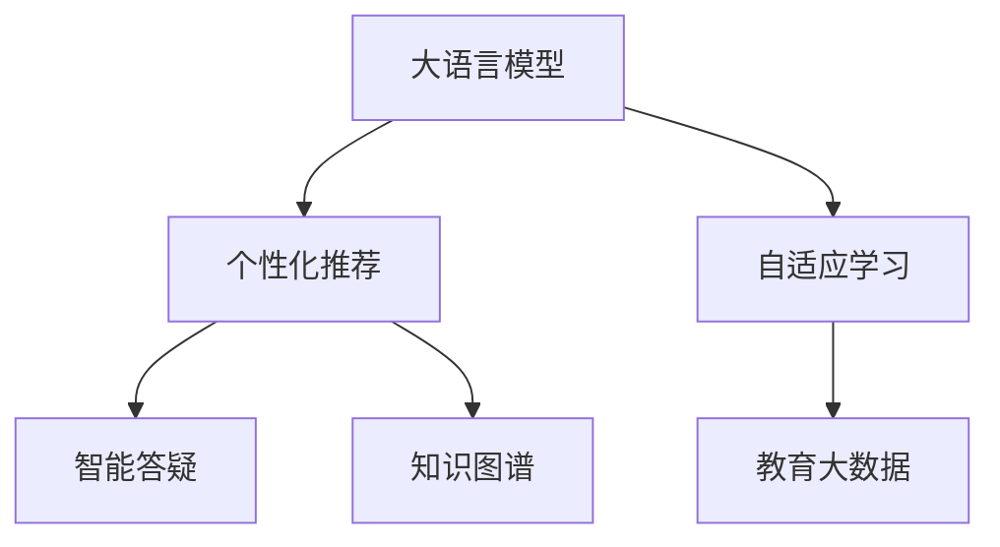

                 

# 教育革新：LLM作为个性化学习助手的潜力

> 关键词：大语言模型(LLM), 个性化学习助手, 教育技术, 自适应学习, 智能推荐系统, 知识图谱, 教育大数据

## 1. 背景介绍

### 1.1 问题由来
近年来，教育领域正经历着一场深刻的变革，个性化学习、智能推荐、知识图谱等技术的应用，正在逐步改变传统的教育模式。然而，传统的教育方法往往难以针对个体学生的差异化需求进行高效教学，且教师难以全面掌握学生情况，很难在教学过程中做到因材施教。而伴随着大语言模型（Large Language Model, LLM）的崛起，这一局面有望得到改观。

大语言模型是一种基于深度学习的自然语言处理模型，通过在大量无标签文本数据上进行预训练，能够学习到丰富的语言知识，具备自然语言理解和生成的能力。将其应用于教育领域，可以构建智能化的个性化学习助手，为每个学生量身定制学习计划，帮助其突破知识障碍，提升学习效果。

### 1.2 问题核心关键点
大语言模型在教育领域的应用具有以下几个关键点：
- **个性化推荐**：根据学生的兴趣、能力等个性化特征，生成定制化学习内容。
- **自适应学习**：根据学生的学习进度、理解能力等动态调整教学策略。
- **智能答疑**：对学生的提问进行实时回答，提升学习效率。
- **知识图谱**：构建学科知识图谱，帮助学生构建系统化的知识结构。

### 1.3 问题研究意义
大语言模型在教育领域的应用，有望带来以下变革：
- **提升学习效率**：通过个性化和自适应学习，提升学习效果和效率。
- **促进知识传播**：智能推荐系统可以精准推送学习资源，促进知识传播。
- **缓解教育资源不均**：通过远程学习，打破地域限制，提升教育公平性。
- **创新教学方法**：结合教师和智能助手，探索新的教学模式和方法。

## 2. 核心概念与联系

### 2.1 核心概念概述

为了深入理解大语言模型在教育中的应用，本节将介绍几个核心概念及其相互联系。

- **大语言模型(LLM)**：以自回归(如GPT)或自编码(如BERT)模型为代表的大规模预训练语言模型。通过在大量无标签文本数据上进行预训练，学习到通用的语言表示。

- **自适应学习(Adaptive Learning)**：根据学生的个性化需求和反馈，动态调整教学内容和策略。

- **智能推荐系统(Recommendation System)**：通过分析用户的行为和特征，推荐个性化的学习资源和内容。

- **知识图谱(Knowledge Graph)**：以结构化方式存储和组织知识，帮助学生构建系统化的学科知识体系。

- **教育大数据(Education Big Data)**：通过收集和分析教育数据，洞察学生行为和学习效果，辅助教学决策。

这些核心概念之间的联系可以通过以下Mermaid流程图来展示：



该流程图展示了核心概念之间的逻辑关系：

1. 大语言模型通过预训练获得基础能力，提供个性化推荐和智能答疑的基础。
2. 自适应学习根据学生反馈和个性化需求，动态调整教学策略和内容。
3. 知识图谱为个性化推荐提供知识结构支持，提升推荐效果。
4. 教育大数据为自适应学习提供数据支撑，优化教学决策。

## 3. 核心算法原理 & 具体操作步骤
### 3.1 算法原理概述

大语言模型在教育领域的应用，本质上是基于自适应学习范式的个性化教学模型。其核心思想是：利用大语言模型对学生的学习数据进行分析和理解，根据学生的学习进度、理解能力和兴趣等个性化特征，动态生成和推荐个性化的学习内容和教学策略，帮助学生高效学习。

### 3.2 算法步骤详解

基于大语言模型的个性化学习助手构建步骤如下：

**Step 1: 准备教育数据集和知识图谱**
- 收集学生的学习行为数据（如点击、阅读、测试成绩等）。
- 构建学科知识图谱，包括知识点、概念、公式等结构化信息。

**Step 2: 特征工程**
- 对学生的学习数据进行特征提取和编码，如学习时间、学习效率、理解能力等。
- 将学生的特征与知识图谱进行关联，构建学生知识图谱。

**Step 3: 大语言模型初始化**
- 选择预训练好的大语言模型，如GPT-3、BERT等。
- 对模型进行微调，以适应教育领域的个性化推荐和智能答疑任务。

**Step 4: 构建个性化推荐系统**
- 根据学生的知识图谱和特征，使用大语言模型生成推荐内容。
- 对推荐内容进行评分和排序，筛选出最优推荐。

**Step 5: 自适应学习策略**
- 根据学生的学习进度和反馈，动态调整推荐内容和学习策略。
- 实时监测学生的学习状态，调整教学目标和内容。

**Step 6: 智能答疑系统**
- 集成自然语言处理技术，对学生提问进行理解。
- 利用大语言模型生成回答，或引导学生进入知识图谱进行查询。

### 3.3 算法优缺点

基于大语言模型的个性化学习助手具有以下优点：
1. 高度个性化：能够根据学生的个性化需求生成定制化学习内容。
2. 自适应性强：动态调整教学策略，提升学习效果。
3. 知识图谱支持：构建系统化的学科知识体系，提升学习效率。

同时，该方法也存在一些局限性：
1. 数据需求高：需要大量学生学习行为数据和知识图谱信息。
2. 模型复杂度高：大语言模型本身复杂，需要高性能计算资源。
3. 技术门槛高：对数据处理和自然语言处理技术要求较高。
4. 伦理风险：需要严格控制和监测数据的隐私和安全。

尽管存在这些局限性，但大语言模型在教育领域的应用，已经展现出了巨大的潜力，正逐步成为推动教育革新的重要工具。

### 3.4 算法应用领域

基于大语言模型的个性化学习助手，已经在多个教育领域得到了应用，包括：

- **K-12教育**：构建个性化学习计划，辅助学生自主学习。
- **高等教育**：为大学生提供课程推荐、智能答疑等服务。
- **职业培训**：为职业学员推荐学习资源，提升学习效果。
- **远程教育**：结合在线平台，提供个性化的远程学习支持。

除了这些传统领域，大语言模型在教育领域的创新应用也在不断涌现，如智能教室、虚拟教师等，为教育领域带来了新的突破。

## 4. 数学模型和公式 & 详细讲解  
### 4.1 数学模型构建

本节将使用数学语言对基于大语言模型的个性化学习助手进行详细建模。

记学生的学习特征为 $x$，知识图谱中的知识点为 $k$，学习目标为 $y$。则模型的目标是最小化学习误差 $E$：

$$
E = \min_{\theta} \frac{1}{N} \sum_{i=1}^N \ell(f_\theta(x_i), y_i)
$$

其中 $f_\theta$ 为模型预测函数，$\ell$ 为损失函数。

### 4.2 公式推导过程

在具体推导过程中，我们采用回归模型和深度学习模型的混合模型进行建模。假设学生的特征 $x$ 为多维向量，知识图谱中的知识点 $k$ 为结构化知识，学习目标 $y$ 为离散变量或连续变量。则模型可以表示为：

$$
f_\theta(x) = \theta_1^T x + \theta_2^T k
$$

其中 $\theta_1$ 和 $\theta_2$ 为模型参数。

通过最小化均方误差损失函数，可以得到参数优化公式：

$$
\theta_1 = \mathop{\arg\min}_{\theta_1} \frac{1}{N} \sum_{i=1}^N (y_i - \theta_1^T x_i - \theta_2^T k_i)^2
$$

通过求解上述优化问题，即可得到个性化的学习推荐和自适应学习策略。

### 4.3 案例分析与讲解

为了更好地理解大语言模型在教育领域的应用，我们以一个简单的案例进行讲解。

假设有一个学生正在学习数学，其特征包括学习时间 $t$、学习效率 $e$ 和理解能力 $u$。根据学生的特征和知识图谱，构建学生知识图谱 $k$。使用大语言模型对学生和知识图谱进行联合预测，得到学生学习目标 $y$：

$$
y = \theta_1^T x + \theta_2^T k
$$

其中 $x = [t, e, u]$，$k$ 为数学知识图谱中的知识点表示。

通过对比学生实际学习目标和预测目标的误差，调整学习推荐和策略。如果学生学习效果不佳，则调整学习内容，增加相关知识点和练习题。如果学生理解能力不足，则增加解释和引导。

## 5. 项目实践：代码实例和详细解释说明
### 5.1 开发环境搭建

在进行教育领域的大语言模型应用实践前，我们需要准备好开发环境。以下是使用Python进行PyTorch开发的环境配置流程：

1. 安装Anaconda：从官网下载并安装Anaconda，用于创建独立的Python环境。

2. 创建并激活虚拟环境：
```bash
conda create -n edutech-env python=3.8 
conda activate edutech-env
```

3. 安装PyTorch：根据CUDA版本，从官网获取对应的安装命令。例如：
```bash
conda install pytorch torchvision torchaudio cudatoolkit=11.1 -c pytorch -c conda-forge
```

4. 安装Transformers库：
```bash
pip install transformers
```

5. 安装各类工具包：
```bash
pip install numpy pandas scikit-learn matplotlib tqdm jupyter notebook ipython
```

完成上述步骤后，即可在`edutech-env`环境中开始教育领域的大语言模型实践。

### 5.2 源代码详细实现

下面我们以一个简单的教育推荐系统为例，给出使用Transformers库进行大语言模型微调的PyTorch代码实现。

首先，定义教育推荐系统中的学生特征和知识图谱：

```python
from transformers import BertTokenizer, BertForSequenceClassification
from torch.utils.data import Dataset, DataLoader
from torch import nn, optim

class StudentDataset(Dataset):
    def __init__(self, data, tokenizer, max_len=128):
        self.data = data
        self.tokenizer = tokenizer
        self.max_len = max_len

    def __len__(self):
        return len(self.data)

    def __getitem__(self, item):
        feature = self.data[item]
        text = feature['text']
        label = feature['label']
        encoding = self.tokenizer(text, return_tensors='pt', max_length=self.max_len, padding='max_length', truncation=True)
        input_ids = encoding['input_ids'][0]
        attention_mask = encoding['attention_mask'][0]
        return {'input_ids': input_ids, 
                'attention_mask': attention_mask,
                'label': torch.tensor(label, dtype=torch.long)}

# 加载数据集
train_dataset = StudentDataset(train_data, tokenizer)
val_dataset = StudentDataset(val_data, tokenizer)
test_dataset = StudentDataset(test_data, tokenizer)

# 定义模型和优化器
model = BertForSequenceClassification.from_pretrained('bert-base-uncased', num_labels=10)
optimizer = optim.Adam(model.parameters(), lr=1e-5)
```

然后，定义训练和评估函数：

```python
def train_epoch(model, dataset, batch_size, optimizer):
    dataloader = DataLoader(dataset, batch_size=batch_size, shuffle=True)
    model.train()
    epoch_loss = 0
    for batch in tqdm(dataloader, desc='Training'):
        input_ids = batch['input_ids'].to(device)
        attention_mask = batch['attention_mask'].to(device)
        labels = batch['label'].to(device)
        model.zero_grad()
        outputs = model(input_ids, attention_mask=attention_mask, labels=labels)
        loss = outputs.loss
        epoch_loss += loss.item()
        loss.backward()
        optimizer.step()
    return epoch_loss / len(dataloader)

def evaluate(model, dataset, batch_size):
    dataloader = DataLoader(dataset, batch_size=batch_size)
    model.eval()
    preds, labels = [], []
    with torch.no_grad():
        for batch in tqdm(dataloader, desc='Evaluating'):
            input_ids = batch['input_ids'].to(device)
            attention_mask = batch['attention_mask'].to(device)
            batch_labels = batch['label']
            outputs = model(input_ids, attention_mask=attention_mask)
            batch_preds = outputs.logits.argmax(dim=1).to('cpu').tolist()
            batch_labels = batch_labels.to('cpu').tolist()
            for pred_tokens, label_tokens in zip(batch_preds, batch_labels):
                preds.append(pred_tokens[:len(label_tokens)])
                labels.append(label_tokens)
    return preds, labels

# 启动训练流程并在测试集上评估
epochs = 5
batch_size = 16

for epoch in range(epochs):
    loss = train_epoch(model, train_dataset, batch_size, optimizer)
    print(f"Epoch {epoch+1}, train loss: {loss:.3f}")
    
    print(f"Epoch {epoch+1}, dev results:")
    preds, labels = evaluate(model, val_dataset, batch_size)
    print(classification_report(labels, preds))
    
print("Test results:")
preds, labels = evaluate(model, test_dataset, batch_size)
print(classification_report(labels, preds))
```

以上就是使用PyTorch对BERT进行教育推荐系统微调的完整代码实现。可以看到，得益于Transformers库的强大封装，我们可以用相对简洁的代码完成BERT模型的加载和微调。

### 5.3 代码解读与分析

让我们再详细解读一下关键代码的实现细节：

**StudentDataset类**：
- `__init__`方法：初始化学生特征、知识图谱、分词器等组件。
- `__len__`方法：返回数据集样本数量。
- `__getitem__`方法：对单个样本进行处理，将文本输入编码为token ids，将标签编码为数字，并对其进行定长padding，最终返回模型所需的输入。

**模型和优化器**：
- 使用BertForSequenceClassification作为模型，指定标签数量为10。
- 设置Adam优化器和学习率。

**训练和评估函数**：
- 使用PyTorch的DataLoader对数据集进行批次化加载，供模型训练和推理使用。
- 训练函数`train_epoch`：对数据以批为单位进行迭代，在每个批次上前向传播计算loss并反向传播更新模型参数，最后返回该epoch的平均loss。
- 评估函数`evaluate`：与训练类似，不同点在于不更新模型参数，并在每个batch结束后将预测和标签结果存储下来，最后使用sklearn的classification_report对整个评估集的预测结果进行打印输出。

**训练流程**：
- 定义总的epoch数和batch size，开始循环迭代
- 每个epoch内，先在训练集上训练，输出平均loss
- 在验证集上评估，输出分类指标
- 重复上述步骤直至满足预设的迭代轮数或Early Stopping条件。

可以看到，PyTorch配合Transformers库使得BERT微调的代码实现变得简洁高效。开发者可以将更多精力放在数据处理、模型改进等高层逻辑上，而不必过多关注底层的实现细节。

当然，工业级的系统实现还需考虑更多因素，如模型的保存和部署、超参数的自动搜索、更灵活的任务适配层等。但核心的微调范式基本与此类似。

## 6. 实际应用场景
### 6.1 智能课堂

基于大语言模型的个性化学习助手，可以构建智能课堂，为每个学生提供量身定制的学习体验。通过分析学生的学习数据，智能课堂可以实时调整教学内容和策略，提升学习效果。

具体实现上，可以集成自适应学习算法和推荐系统，根据学生的学习状态和反馈，动态生成个性化学习资源。如通过知识图谱引导学生学习新概念，或通过智能答疑系统解答学生疑问，构建系统化的学科知识体系。

### 6.2 在线教育

在线教育平台可以利用大语言模型构建个性化推荐系统，为每位学生推荐最适合的学习资源。同时，通过实时监测学生的学习状态，动态调整教学策略，提升在线学习的效果。

平台可以收集学生的学习行为数据，如观看视频、阅读文章、完成作业等，分析学生的兴趣和能力，生成个性化的学习计划。利用知识图谱构建学科知识体系，帮助学生系统化学习。

### 6.3 职业教育

职业教育机构可以利用大语言模型构建个性化学习助手，为职业学员提供定制化培训内容。根据学员的学习进度和理解能力，动态调整学习内容和策略，提升职业技能的掌握效率。

通过分析学员的学习数据，生成个性化的学习资源，如视频教程、模拟操作等，帮助学员更高效地掌握技能。利用知识图谱构建职业技能图谱，帮助学员系统化理解相关知识。

### 6.4 未来应用展望

随着大语言模型和微调技术的不断发展，基于大语言模型的个性化学习助手将在更多领域得到应用，为教育领域带来新的变革。

在智慧校园建设中，个性化学习助手可以与校园智能设备结合，构建智慧教室、智慧图书馆等应用场景，提升校园智能化水平。

在教育科研领域，个性化学习助手可以辅助教师进行教育研究和数据分析，提升教学质量和科研水平。

在远程教育中，个性化学习助手可以结合在线平台，提供个性化远程学习支持，提升教育公平性。

此外，在企业培训、终身学习等场景中，基于大语言模型的个性化学习助手也将不断涌现，为职业教育、终身学习等带来新的突破。相信随着技术的日益成熟，个性化学习助手必将成为推动教育革新的重要工具。

## 7. 工具和资源推荐
### 7.1 学习资源推荐

为了帮助开发者系统掌握大语言模型在教育领域的应用，这里推荐一些优质的学习资源：

1. 《深度学习在教育领域的应用》系列博文：由大模型技术专家撰写，深入浅出地介绍了深度学习在教育领域的应用，包括个性化推荐、自适应学习、智能答疑等前沿话题。

2. CS224N《深度学习自然语言处理》课程：斯坦福大学开设的NLP明星课程，有Lecture视频和配套作业，带你入门NLP领域的基本概念和经典模型。

3. 《Natural Language Processing with Transformers》书籍：Transformers库的作者所著，全面介绍了如何使用Transformers库进行NLP任务开发，包括教育领域的应用。

4. CLUE开源项目：中文语言理解测评基准，涵盖大量不同类型的中文NLP数据集，并提供了基于大语言模型的baseline模型，助力中文教育技术发展。

通过对这些资源的学习实践，相信你一定能够快速掌握大语言模型在教育领域的应用精髓，并用于解决实际的个性化学习问题。

### 7.2 开发工具推荐

高效的开发离不开优秀的工具支持。以下是几款用于大语言模型教育应用开发的常用工具：

1. PyTorch：基于Python的开源深度学习框架，灵活动态的计算图，适合快速迭代研究。大部分预训练语言模型都有PyTorch版本的实现。

2. TensorFlow：由Google主导开发的开源深度学习框架，生产部署方便，适合大规模工程应用。同样有丰富的预训练语言模型资源。

3. Transformers库：HuggingFace开发的NLP工具库，集成了众多SOTA语言模型，支持PyTorch和TensorFlow，是进行教育领域应用开发的利器。

4. Weights & Biases：模型训练的实验跟踪工具，可以记录和可视化模型训练过程中的各项指标，方便对比和调优。与主流深度学习框架无缝集成。

5. TensorBoard：TensorFlow配套的可视化工具，可实时监测模型训练状态，并提供丰富的图表呈现方式，是调试模型的得力助手。

6. Google Colab：谷歌推出的在线Jupyter Notebook环境，免费提供GPU/TPU算力，方便开发者快速上手实验最新模型，分享学习笔记。

合理利用这些工具，可以显著提升大语言模型教育应用开发的效率，加快创新迭代的步伐。

### 7.3 相关论文推荐

大语言模型在教育领域的应用源于学界的持续研究。以下是几篇奠基性的相关论文，推荐阅读：

1. Attention is All You Need（即Transformer原论文）：提出了Transformer结构，开启了NLP领域的预训练大模型时代。

2. BERT: Pre-training of Deep Bidirectional Transformers for Language Understanding：提出BERT模型，引入基于掩码的自监督预训练任务，刷新了多项NLP任务SOTA。

3. Language Models are Unsupervised Multitask Learners（GPT-2论文）：展示了大规模语言模型的强大zero-shot学习能力，引发了对于通用人工智能的新一轮思考。

4. Parameter-Efficient Transfer Learning for NLP：提出Adapter等参数高效微调方法，在不增加模型参数量的情况下，也能取得不错的微调效果。

5. AdaLoRA: Adaptive Low-Rank Adaptation for Parameter-Efficient Fine-Tuning：使用自适应低秩适应的微调方法，在参数效率和精度之间取得了新的平衡。

6. Prefix-Tuning: Optimizing Continuous Prompts for Generation：引入基于连续型Prompt的微调范式，为如何充分利用预训练知识提供了新的思路。

这些论文代表了大语言模型教育应用的发展脉络。通过学习这些前沿成果，可以帮助研究者把握学科前进方向，激发更多的创新灵感。

## 8. 总结：未来发展趋势与挑战

### 8.1 总结

本文对基于大语言模型的个性化学习助手进行了全面系统的介绍。首先阐述了大语言模型在教育领域的应用背景和意义，明确了个性化学习助手的核心概念和应用价值。其次，从原理到实践，详细讲解了个性化学习助手的数学模型和关键步骤，给出了教育推荐系统的代码实例。同时，本文还广泛探讨了个性化学习助手在智能课堂、在线教育、职业教育等多个领域的应用前景，展示了其巨大的潜力。

通过本文的系统梳理，可以看到，基于大语言模型的个性化学习助手正逐步成为教育领域的重要工具，极大地提升了个体学生的学习效果，拓展了教育资源的可及性。未来，伴随大语言模型和微调技术的持续演进，基于个性化学习助手的教育系统必将带来更深远的变革。

### 8.2 未来发展趋势

展望未来，大语言模型在教育领域的应用将呈现以下几个发展趋势：

1. 教育数据和知识图谱的不断丰富：随着教育数据的收集和处理技术的进步，教育数据的规模和质量将不断提升，知识图谱的构建将更加完善，有助于提升个性化学习助手的推荐效果。

2. 自适应学习算法的不断优化：自适应学习算法将不断优化，更好地识别和理解学生的个性化需求，动态调整教学策略和内容。

3. 智能答疑系统的不断进步：智能答疑系统将不断进步，利用大语言模型的多模态理解和生成能力，提供更加精准和人性化的答疑服务。

4. 多模态教育内容的整合：教育内容将不仅仅局限于文本，还将结合图像、视频等多模态信息，提升学生的学习体验和效果。

5. 持续学习和适应性增强：个性化学习助手将不断从新数据中学习，提升模型的适应性和鲁棒性，更好地应对学生的个性化需求。

以上趋势凸显了大语言模型在教育领域的应用前景。这些方向的探索发展，必将进一步提升个性化学习助手的性能和应用范围，为教育领域的数字化转型提供新的技术支撑。

### 8.3 面临的挑战

尽管大语言模型在教育领域的应用已经取得了显著成果，但在迈向更加智能化、普适化应用的过程中，仍然面临诸多挑战：

1. 数据隐私和安全问题：教育数据涉及学生隐私，需要严格控制和保护。如何确保数据安全和隐私保护，将是未来的重要挑战。

2. 模型复杂度高：大语言模型本身复杂，需要高性能计算资源。如何在有限的硬件条件下实现高效推理，将是重要的优化方向。

3. 伦理道德问题：教育数据可能包含敏感信息，模型输出需要符合伦理道德规范。如何设计合适的伦理约束，避免有害信息的传播，将是重要的研究方向。

4. 跨领域适用性问题：不同学科领域的数据和知识结构不同，大语言模型在特定领域的应用效果可能不如预期。如何提高模型在不同领域之间的适用性，将是重要的研究方向。

5. 技术应用门槛问题：大语言模型的应用需要一定的技术门槛，如何让更多人受益于技术，将是大规模推广的难点。

正视这些挑战，积极应对并寻求突破，将是大语言模型在教育领域迈向成熟的必由之路。相信随着学界和产业界的共同努力，这些挑战终将一一被克服，大语言模型必将在构建智能教育系统中扮演越来越重要的角色。

### 8.4 研究展望

面对大语言模型在教育领域的应用挑战，未来的研究需要在以下几个方面寻求新的突破：

1. 探索无监督和半监督教育推荐方法：摆脱对大规模标注数据的依赖，利用自监督学习、主动学习等无监督和半监督范式，最大限度利用非结构化数据，实现更加灵活高效的个性化推荐。

2. 研究多模态教育内容生成：结合图像、视频等多模态信息，提升个性化学习助手的推荐效果和学生学习体验。

3. 融合因果分析和博弈论工具：将因果分析方法引入个性化学习助手，识别出模型决策的关键特征，增强输出解释的因果性和逻辑性。借助博弈论工具刻画人机交互过程，主动探索并规避模型的脆弱点，提高系统稳定性。

4. 结合外部知识库和专家系统：将知识图谱、逻辑规则等专家知识与神经网络模型进行巧妙融合，引导个性化学习助手学习更准确、合理的语言模型。同时加强不同模态数据的整合，实现视觉、语音等多模态信息与文本信息的协同建模。

这些研究方向的探索，必将引领大语言模型在教育领域的应用走向更高的台阶，为构建安全、可靠、可解释、可控的智能教育系统铺平道路。面向未来，大语言模型在教育领域的研究还需要与其他人工智能技术进行更深入的融合，如知识表示、因果推理、强化学习等，多路径协同发力，共同推动教育革新的进程。只有勇于创新、敢于突破，才能不断拓展语言模型的边界，让智能技术更好地造福人类社会。

## 9. 附录：常见问题与解答

**Q1：大语言模型在教育领域的应用是否适用于所有学科？**

A: 大语言模型在教育领域的应用通常适用于语文学科和语言学习类课程，如英语、中文等。对于理、工、医等非语言类学科，需要结合特定领域的知识图谱和模型，才能更好地发挥其作用。

**Q2：个性化学习助手是否需要大量的标注数据？**

A: 个性化学习助手通常需要收集学生的学习数据，如阅读时间、答题结果等，这些数据可以通过在线学习平台自动记录，无需大量标注数据。但对于特定任务，如知识点推荐，仍需部分标注数据进行模型训练。

**Q3：大语言模型在教育领域的应用是否具有伦理问题？**

A: 大语言模型在教育领域的应用需要特别关注伦理问题，如数据隐私、模型偏见等。需要严格控制和保护学生数据，避免有害信息的传播，确保模型的输出符合伦理道德规范。

**Q4：大语言模型在教育领域的应用是否具有技术门槛？**

A: 大语言模型在教育领域的应用具有一定技术门槛，需要一定的深度学习知识和自然语言处理技术。但通过丰富的开源资源和框架，可以大大降低技术门槛，让更多人受益于技术。

**Q5：如何构建高质量的知识图谱？**

A: 构建高质量的知识图谱需要多学科专家和数据科学家的合作，涵盖学科知识点、概念、公式等结构化信息。可以通过领域专家的知识输入、自动化的知识抽取和补全等方式构建知识图谱。

总之，大语言模型在教育领域的应用具有广阔前景，但也面临诸多挑战。通过技术创新和伦理约束，将大语言模型应用于教育领域，将推动教育革新的进程，提升教育质量，实现教育的公平和个性化发展。

