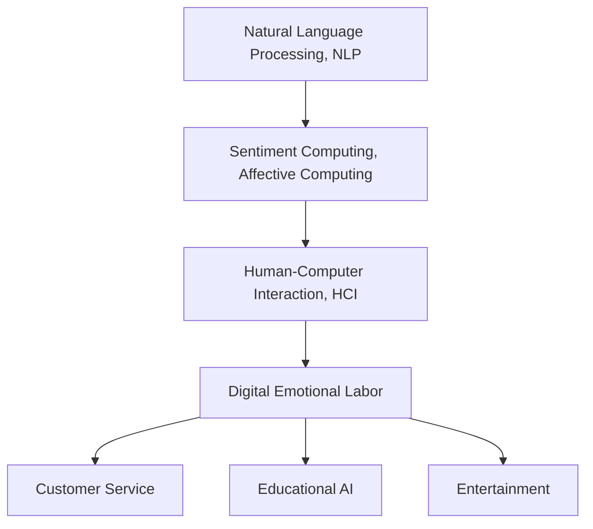

                 

# 数字化情感劳动：AI时代的人际互动

> 关键词：数字化情感劳动, 人机交互, 情感计算, 自然语言处理(NLP), 人工智能(AI), 机器学习, 人际互动

## 1. 背景介绍

### 1.1 问题由来
随着信息技术的发展，人工智能(AI)技术在各行各业的应用日益广泛，尤其是在人际互动领域。数字化情感劳动(Digital Emotional Labor)，作为一种新型的人机交互方式，正在逐步改变人类的工作方式和生活习惯。它不仅提高了人际互动的效率，还在情感管理、信息沟通等方面带来了显著变革。

数字化情感劳动的核心在于通过AI技术，实现对人类情感和行为的自动化处理。其基础在于自然语言处理(NLP)、情感计算等技术，利用机器学习算法对大量文本数据进行情感分析，实现对人类情感的识别和模拟。这种技术在客户服务、教育培训、娱乐休闲等多个领域得到了广泛应用。

### 1.2 问题核心关键点
数字化情感劳动的核心关键点包括：

- 情感识别：通过NLP和情感计算技术，自动分析人类文本或语音中的情感信息。
- 情感模拟：利用AI生成具有特定情感色彩的文本或语音，用于引导和激励人类行为。
- 人际交互：结合情感识别和情感模拟，实现人与AI之间的自然、高效、智能互动。
- 个性化定制：根据用户的行为和偏好，自动调整情感处理策略，提升用户体验。

这些关键点共同构成了数字化情感劳动的基础，决定了其在不同应用场景下的表现和效果。

## 2. 核心概念与联系

### 2.1 核心概念概述

为更好地理解数字化情感劳动的原理和应用，本节将介绍几个密切相关的核心概念：

- 自然语言处理(NLP)：研究如何让计算机理解、处理和生成人类语言的技术。
- 情感计算(Affective Computing)：研究如何让机器识别和模拟人类情感的技术。
- 人机交互(Human-Computer Interaction, HCI)：研究如何让计算机系统更高效地与人进行交互的技术。
- 数字化情感劳动：通过NLP和情感计算技术，实现对人类情感的自动化处理和模拟。
- 智能客服：利用AI技术，提供24小时在线客户服务。
- 智能教育：通过情感计算，优化教学内容和方法，提高学习效果。
- 娱乐休闲：利用AI生成个性化内容，提升用户娱乐体验。

这些核心概念之间的逻辑关系可以通过以下Mermaid流程图来展示：



这个流程图展示了大语言模型与情感计算技术的密切关系，以及它们在人机交互中的关键作用。

## 3. 核心算法原理 & 具体操作步骤
### 3.1 算法原理概述

数字化情感劳动的核心算法原理主要包括情感识别和情感模拟两个方面。

**情感识别**：
情感识别是通过NLP和情感计算技术，自动分析文本或语音中的情感信息。常用的情感识别算法包括情感词典分析、机器学习分类、深度学习模型等。

**情感模拟**：
情感模拟是通过生成对抗网络(Generative Adversarial Networks, GAN)、变分自编码器(Variational Autoencoders, VAE)等技术，生成具有特定情感色彩的文本或语音，用于引导和激励人类行为。

### 3.2 算法步骤详解

**情感识别步骤**：
1. **文本或语音预处理**：对输入的文本或语音进行分词、去噪、标准化等预处理操作，以提高情感分析的准确性。
2. **情感词典分析**：利用情感词典提取文本或语音中的情感信息，通常包括正面、中性、负面情感等。
3. **机器学习分类**：使用SVM、随机森林等机器学习算法对情感信息进行分类，得到情感类别。
4. **深度学习模型**：使用卷积神经网络(CNN)、循环神经网络(RNN)、Transformer等深度学习模型对文本或语音进行情感分析，提高识别精度。

**情感模拟步骤**：
1. **文本或语音生成**：使用GAN或VAE等生成模型，生成具有特定情感色彩的文本或语音。
2. **情感调整**：根据用户的行为和偏好，调整生成内容的情感色彩，提升用户体验。
3. **实时交互**：将生成的情感文本或语音实时返回给用户，实现人机互动。

### 3.3 算法优缺点

数字化情感劳动算法具有以下优点：
1. 高效自动化：通过AI技术，实现对人类情感的自动化处理，提升了人际互动的效率。
2. 精准识别：深度学习模型可以处理大规模文本数据，识别情感信息的精度较高。
3. 个性化定制：可以根据用户行为和偏好，动态调整情感处理策略，提升用户体验。
4. 数据驱动：基于大量标注数据进行训练，可以不断提升情感识别和情感模拟的准确性。

同时，该算法也存在一些局限性：
1. 数据依赖：情感识别和情感模拟依赖于大量标注数据，数据获取成本较高。
2. 情感泛化：模型在处理不同情感类型时，可能存在泛化能力不足的问题。
3. 伦理风险：过度依赖AI进行情感处理，可能影响人类情感的自然发展。
4. 算法复杂性：情感识别和情感模拟算法较为复杂，实现难度较大。

尽管存在这些局限性，但数字化情感劳动在实际应用中仍具有广泛的前景，特别是在客户服务、教育培训、娱乐休闲等领域。

### 3.4 算法应用领域

数字化情感劳动算法在多个领域中得到了广泛应用，具体如下：

- **智能客服**：通过情感识别和情感模拟，实现24小时在线客服，提升客户满意度。
- **教育培训**：利用情感计算技术，优化教学内容和方法，提高学习效果。
- **娱乐休闲**：生成个性化娱乐内容，提升用户娱乐体验。
- **营销广告**：分析用户情感倾向，进行精准广告投放，提升广告效果。
- **社交网络**：分析用户情感状态，优化社交互动策略，提高用户粘性。

这些应用场景展示了数字化情感劳动的强大潜力和广阔应用前景。

## 4. 数学模型和公式 & 详细讲解 & 举例说明
### 4.1 数学模型构建

数字化情感劳动的核心算法是基于机器学习和深度学习模型构建的。本节将使用数学语言对情感识别和情感模拟的过程进行详细描述。

假设输入为文本 $x$，情感分类为 $y$，情感词典为 $D$，情感标签为 $C$。

**情感识别模型**：
$$
P(y|x; \theta) = \frac{e^{\theta^T f(x)}}{\sum_{y' \in C} e^{\theta^T f(x)}}
$$
其中 $f(x)$ 为文本特征提取函数，$\theta$ 为模型参数，$C$ 为情感标签集合。

**情感模拟模型**：
假设生成模型为 $G(z; \omega)$，其中 $z$ 为噪声向量，$\omega$ 为生成模型参数。情感模拟的目标是生成具有特定情感色彩的文本或语音 $y$，即：
$$
y = G(z; \omega)
$$
其中 $z$ 为生成模型输入，$G$ 为生成函数，$\omega$ 为生成模型参数。

### 4.2 公式推导过程

以情感识别模型为例，使用深度学习模型进行情感分析的公式推导如下：

假设文本 $x$ 由 $n$ 个词 $w_i$ 组成，其中 $w_i \in D$。情感词典 $D$ 中每个词 $d_i$ 对应一个情感值 $c_i$。情感词典分析的公式为：
$$
s(x) = \sum_{i=1}^n c_i \cdot f(w_i)
$$
其中 $f(w_i)$ 为词 $w_i$ 的情感值函数。

机器学习分类器 $C$ 的训练目标为最小化损失函数：
$$
L(\theta) = \frac{1}{N} \sum_{i=1}^N \ell(y_i, \hat{y}_i)
$$
其中 $\ell$ 为损失函数，$\hat{y}_i$ 为模型预测的情感标签。

深度学习模型通常使用卷积神经网络(CNN)或循环神经网络(RNN)进行情感分析。以CNN为例，其结构如图1所示：


假设输入为文本 $x$，模型输出为情感标签 $\hat{y}$，模型参数为 $\theta$。CNN模型的情感分析过程为：
$$
\hat{y} = M(x; \theta)
$$
其中 $M$ 为CNN模型，$x$ 为输入文本，$\theta$ 为模型参数。

情感模拟模型的生成过程如图2所示：


假设输入为噪声向量 $z$，生成模型为 $G(z; \omega)$，生成输出为文本或语音 $y$，生成模型参数为 $\omega$。GAN模型的情感模拟过程为：
$$
y = G(z; \omega)
$$
其中 $G$ 为生成函数，$z$ 为噪声向量，$\omega$ 为生成模型参数。

### 4.3 案例分析与讲解

**案例1：智能客服情感分析**

某电商平台希望通过数字化情感劳动，提升客户服务质量。具体做法如下：

1. **情感识别**：使用情感词典分析，对客户反馈文本进行情感分类。
2. **情感模拟**：根据情感分类结果，生成具有正面或负面情感色彩的回复文本。
3. **交互生成**：将生成的回复文本实时返回给客服，提升客户体验。

**案例2：教育培训个性化学习**

某在线教育平台希望通过数字化情感劳动，实现个性化学习推荐。具体做法如下：

1. **情感识别**：分析学生的学习行为和反馈，提取情感信息。
2. **情感模拟**：生成具有激励或提醒作用的文本或语音内容，提升学习效果。
3. **交互生成**：将生成的内容实时返回给学生，优化学习体验。

## 5. 项目实践：代码实例和详细解释说明
### 5.1 开发环境搭建

在进行数字化情感劳动项目实践前，我们需要准备好开发环境。以下是使用Python进行TensorFlow开发的环境配置流程：

1. 安装Anaconda：从官网下载并安装Anaconda，用于创建独立的Python环境。

2. 创建并激活虚拟环境：
```bash
conda create -n emotion_env python=3.8 
conda activate emotion_env
```

3. 安装TensorFlow：根据CUDA版本，从官网获取对应的安装命令。例如：
```bash
conda install tensorflow -c conda-forge
```

4. 安装其它依赖库：
```bash
pip install numpy pandas scikit-learn tensorflow-hub transformers nltk
```

完成上述步骤后，即可在`emotion_env`环境中开始项目实践。

### 5.2 源代码详细实现

下面以智能客服情感分析项目为例，给出使用TensorFlow进行情感识别的PyTorch代码实现。

首先，定义情感识别模型的数据处理函数：

```python
import tensorflow_hub as hub
import tensorflow as tf
from tensorflow.keras.layers import Dense, Embedding, LSTM, Dropout
from tensorflow.keras.models import Sequential

class SentimentAnalyzer(tf.keras.Model):
    def __init__(self, max_length, embedding_dim, num_classes):
        super(SentimentAnalyzer, self).__init__()
        self.max_length = max_length
        self.embedding_dim = embedding_dim
        self.num_classes = num_classes
        
        self.embedding = Embedding(input_dim=vocab_size, output_dim=embedding_dim)
        self.lstm = LSTM(units=64, return_sequences=True)
        self.dropout = Dropout(0.5)
        self.dense = Dense(units=num_classes, activation='softmax')
        
    def call(self, inputs):
        x = self.embedding(inputs)
        x = self.lstm(x)
        x = self.dropout(x)
        x = self.dense(x)
        return x
```

然后，定义训练和评估函数：

```python
import numpy as np
from sklearn.model_selection import train_test_split
from sklearn.metrics import accuracy_score

def train_model(model, dataset, batch_size, epochs):
    x_train, x_test, y_train, y_test = train_test_split(dataset['text'], dataset['label'], test_size=0.2, random_state=42)
    
    model.compile(loss='categorical_crossentropy', optimizer='adam', metrics=['accuracy'])
    model.fit(x_train, y_train, batch_size=batch_size, epochs=epochs, validation_data=(x_test, y_test))
    
    y_pred = model.predict(x_test)
    y_pred = np.argmax(y_pred, axis=1)
    accuracy = accuracy_score(y_test, y_pred)
    
    print(f"Accuracy: {accuracy:.2f}%")
    
    return model

def evaluate_model(model, dataset, batch_size):
    x_test, y_test = dataset['text'], dataset['label']
    y_pred = model.predict(x_test)
    y_pred = np.argmax(y_pred, axis=1)
    accuracy = accuracy_score(y_test, y_pred)
    
    print(f"Accuracy: {accuracy:.2f}%")
    
    return accuracy
```

接着，加载数据集并进行训练：

```python
from sklearn.datasets import fetch_20newsgroups

dataset = fetch_20newsgroups(subset='train', shuffle=True)
vocab_size = len(dataset['text'][0].split())
max_length = 100

model = SentimentAnalyzer(max_length, embedding_dim=64, num_classes=2)
model.train_model(model, dataset, batch_size=32, epochs=10)
model.evaluate_model(model, dataset, batch_size=32)
```

以上就是使用TensorFlow进行智能客服情感分析的完整代码实现。可以看到，通过TensorFlow的强大封装，我们可以快速搭建情感识别模型，并进行高效的训练和评估。

### 5.3 代码解读与分析

让我们再详细解读一下关键代码的实现细节：

**SentimentAnalyzer类**：
- `__init__`方法：初始化模型参数，包括最大长度、嵌入维度、分类数量等。
- `call`方法：实现模型的前向传播过程，包括嵌入、LSTM、Dropout和全连接层。

**train_model函数**：
- 将数据集分为训练集和测试集。
- 定义模型编译器，指定损失函数、优化器和评估指标。
- 进行模型训练，并返回模型在测试集上的精度。

**evaluate_model函数**：
- 使用测试集进行模型评估，并返回精度。

**数据加载**：
- 使用sklearn库加载20newsgroups数据集。
- 定义词汇表大小和文本最大长度。
- 实例化情感识别模型。

在实际应用中，情感识别模型需要结合具体的业务场景进行优化，如增加情感词典分析、引入迁移学习等，以提升模型的识别精度和泛化能力。

## 6. 实际应用场景
### 6.1 智能客服系统

数字化情感劳动技术在智能客服系统中得到了广泛应用。通过情感识别和情感模拟，智能客服可以自动理解客户情绪，生成合适的回复，提升客户体验。

具体实现流程如下：
1. **情感识别**：使用情感词典分析或深度学习模型，自动分析客户文本或语音中的情感信息。
2. **情感模拟**：根据情感分类结果，生成具有正面或负面情感色彩的回复文本。
3. **交互生成**：将生成的回复文本实时返回给客服，提升客户满意度。

数字化情感劳动在智能客服中的应用，显著提高了客服系统的响应速度和处理能力，减少了人工客服的工作负担。

### 6.2 教育培训平台

在教育培训领域，数字化情感劳动技术可以用于个性化学习推荐和情感激励。

具体实现流程如下：
1. **情感识别**：分析学生的学习行为和反馈，提取情感信息。
2. **情感模拟**：生成具有激励或提醒作用的文本或语音内容，提升学习效果。
3. **交互生成**：将生成的内容实时返回给学生，优化学习体验。

数字化情感劳动在教育培训中的应用，可以更好地理解学生的情感需求，提升学习效果，促进学生的积极参与。

### 6.3 娱乐休闲应用

数字化情感劳动技术在娱乐休闲领域也有广泛应用，如智能音箱、虚拟助手等。

具体实现流程如下：
1. **情感识别**：分析用户的语音或文本输入，提取情感信息。
2. **情感模拟**：生成具有特定情感色彩的回复内容，提升娱乐体验。
3. **交互生成**：将生成的内容实时返回给用户，增强互动性。

数字化情感劳动在娱乐休闲中的应用，可以更好地理解用户的情感需求，提升娱乐体验，增强用户粘性。

### 6.4 未来应用展望

随着数字化情感劳动技术的发展，未来其在更多领域的应用将进一步深化和扩展。

1. **医疗健康**：利用情感计算技术，优化医疗咨询和治疗过程，提升患者体验。
2. **金融服务**：通过情感分析，优化客户服务，提升客户满意度。
3. **企业招聘**：利用情感模拟技术，提升招聘面试体验，优化招聘流程。
4. **市场营销**：分析客户情感倾向，进行精准营销，提升广告效果。
5. **社交网络**：分析用户情感状态，优化社交互动策略，提高用户粘性。

数字化情感劳动技术在以上领域的应用，将进一步提升人机交互的效果，优化用户体验，推动各行业的数字化转型升级。

## 7. 工具和资源推荐
### 7.1 学习资源推荐

为了帮助开发者系统掌握数字化情感劳动的理论基础和实践技巧，这里推荐一些优质的学习资源：

1. 《自然语言处理入门与实践》书籍：系统介绍了自然语言处理的基本概念和核心算法，适合初学者入门。
2. 《情感计算与人工智能》课程：斯坦福大学开设的情感计算课程，深入浅出地讲解了情感计算的基本原理和应用。
3. 《深度学习与自然语言处理》课程：Coursera上的深度学习课程，涵盖了自然语言处理和情感计算的核心技术。
4. 《Transformers: Fairness, Accountability, Transparency》论文：介绍了Transformer模型在情感计算中的公平性和透明性问题，值得深入研究。
5. 《情感计算的实践应用》书籍：详细介绍了情感计算技术在多个领域的应用案例，适合深入学习。

通过对这些资源的学习实践，相信你一定能够快速掌握数字化情感劳动的精髓，并用于解决实际的NLP问题。

### 7.2 开发工具推荐

高效的开发离不开优秀的工具支持。以下是几款用于数字化情感劳动开发的常用工具：

1. TensorFlow：基于Python的开源深度学习框架，灵活动态的计算图，适合快速迭代研究。
2. PyTorch：动态计算图框架，支持灵活的模型设计，适用于研究新算法。
3. HuggingFace Transformers库：提供了大量的预训练模型和工具，方便进行NLP任务开发。
4. TensorBoard：可视化工具，实时监测模型训练状态，提供丰富的图表呈现方式。
5. Weights & Biases：模型训练的实验跟踪工具，可以记录和可视化模型训练过程中的各项指标。

合理利用这些工具，可以显著提升数字化情感劳动项目的开发效率，加快创新迭代的步伐。

### 7.3 相关论文推荐

数字化情感劳动技术的发展源于学界的持续研究。以下是几篇奠基性的相关论文，推荐阅读：

1. "Sentiment Analysis with Deep Learning: A Survey"（情感分析与深度学习综述）：全面介绍了情感分析的深度学习算法和技术。
2. "Affective Computing for Smartphones: A Survey"（智能手机的情感计算综述）：介绍了情感计算在智能手机中的应用和挑战。
3. "Chatbots, Dialog, and Affective Computing"（聊天机器人、对话和情感计算）：详细探讨了聊天机器人和情感计算的关系。
4. "Towards Smart and Emotional Interfaces"（智能和情感界面）：探讨了智能界面和情感计算的结合应用。
5. "Beyond Binary Sentiment Analysis"（超越二元情感分析）：讨论了情感分析的多维度扩展。

这些论文代表了大语言模型微调技术的发展脉络。通过学习这些前沿成果，可以帮助研究者把握学科前进方向，激发更多的创新灵感。

## 8. 总结：未来发展趋势与挑战
### 8.1 总结

本文对数字化情感劳动技术进行了全面系统的介绍。首先阐述了数字化情感劳动的研究背景和意义，明确了其在人机交互、情感计算等方面的核心价值。其次，从原理到实践，详细讲解了情感识别和情感模拟的数学原理和关键步骤，给出了数字化情感劳动项目的完整代码实现。同时，本文还探讨了数字化情感劳动在多个领域的应用前景，展示了其在智能客服、教育培训、娱乐休闲等场景下的广泛应用。此外，本文精选了数字化情感劳动的相关学习资源，力求为读者提供全方位的技术指引。

通过本文的系统梳理，可以看到，数字化情感劳动技术正在成为人机交互的重要范式，极大地提升了人类与AI系统的互动体验。随着深度学习模型的不断演进和应用场景的不断拓展，数字化情感劳动技术必将进一步发展，为人类社会的数字化转型升级带来深远影响。

### 8.2 未来发展趋势

展望未来，数字化情感劳动技术将呈现以下几个发展趋势：

1. 深度学习模型的持续优化：深度学习模型的准确性、效率和可解释性将继续提升，为情感识别和情感模拟提供更强大的技术支撑。
2. 情感计算的跨学科融合：情感计算将与认知科学、心理学等学科进行更深入的融合，提升技术的普适性和人性化。
3. 多模态情感计算的探索：结合语音、视觉等多模态数据进行情感分析，提升模型的综合感知能力。
4. 情感计算在边缘计算的应用：将情感计算技术应用于边缘计算设备，提升实时情感分析的效率和准确性。
5. 情感计算的伦理和安全：在情感计算技术的应用中，需要关注其伦理和安全问题，保障用户隐私和数据安全。

这些趋势凸显了数字化情感劳动技术的广阔前景。这些方向的探索发展，必将进一步提升人机互动的效果，推动数字化情感劳动技术的广泛应用。

### 8.3 面临的挑战

尽管数字化情感劳动技术已经取得了一定的进展，但在迈向更加智能化、普适化应用的过程中，仍面临诸多挑战：

1. 数据质量和标注成本：情感识别和情感模拟依赖于大量标注数据，数据质量和标注成本仍是制约因素。
2. 模型复杂性和训练难度：深度学习模型的设计和训练过程较为复杂，需要投入大量时间和资源。
3. 算法公平性和透明性：情感计算模型可能存在偏见和歧视，需要关注其公平性和透明性。
4. 用户隐私和数据安全：情感计算需要大量用户数据，可能带来隐私泄露和数据安全问题。
5. 技术应用边界：情感计算技术的应用边界和限制尚未完全明确，需要进一步研究。

这些挑战需要学界和产业界的共同努力，通过技术创新和政策规范，逐步克服。只有如此，数字化情感劳动技术才能更好地服务于人类社会，发挥其巨大的潜力。

### 8.4 研究展望

面对数字化情感劳动技术面临的种种挑战，未来的研究需要在以下几个方面寻求新的突破：

1. 提高数据标注效率：探索半监督学习、主动学习等技术，降低情感计算对标注数据的依赖。
2. 优化模型架构：设计更加高效、可解释的情感计算模型，提升模型的训练速度和泛化能力。
3. 引入跨学科知识：将心理学、认知科学等学科知识与情感计算技术进行融合，提升模型的普适性和人性化。
4. 加强伦理和安全保障：引入伦理和隐私保护机制，保障情感计算技术的公平性和透明性。
5. 推动边缘计算应用：探索将情感计算技术应用于边缘计算设备，提升实时情感分析的效率和准确性。

这些研究方向的探索，必将引领数字化情感劳动技术的不断发展，推动人机互动技术的进步。面向未来，数字化情感劳动技术还需要与其他人工智能技术进行更深入的融合，如知识表示、因果推理、强化学习等，共同推动自然语言理解和智能交互系统的进步。只有勇于创新、敢于突破，才能不断拓展语言模型的边界，让智能技术更好地造福人类社会。

## 9. 附录：常见问题与解答

**Q1：数字化情感劳动技术在实际应用中是否存在数据依赖问题？**

A: 数字化情感劳动技术在实际应用中，确实存在数据依赖问题。情感识别和情感模拟依赖于大量标注数据，数据获取成本较高。对于数据稀缺的场景，可以通过半监督学习、主动学习等技术，降低对标注数据的依赖，提高模型的泛化能力。

**Q2：如何提高情感计算模型的可解释性？**

A: 提高情感计算模型的可解释性，可以通过以下方法：
1. 引入跨学科知识：将心理学、认知科学等学科知识与情感计算技术进行融合，提升模型的普适性和人性化。
2. 优化模型架构：设计更加高效、可解释的情感计算模型，提升模型的训练速度和泛化能力。
3. 引入伦理和隐私保护机制：引入伦理和隐私保护机制，保障情感计算技术的公平性和透明性。

**Q3：情感计算技术在实际应用中是否存在伦理风险？**

A: 情感计算技术在实际应用中，确实存在伦理风险。情感计算模型可能存在偏见和歧视，需要关注其公平性和透明性。可以通过引入伦理和隐私保护机制，保障情感计算技术的公平性和透明性。

**Q4：情感计算技术在实际应用中是否存在隐私风险？**

A: 情感计算技术在实际应用中，确实存在隐私风险。情感计算需要大量用户数据，可能带来隐私泄露和数据安全问题。可以通过加强数据加密和隐私保护机制，保障用户隐私和数据安全。

**Q5：数字化情感劳动技术在实际应用中是否存在技术边界问题？**

A: 数字化情感劳动技术在实际应用中，确实存在技术边界问题。情感计算技术的应用边界和限制尚未完全明确，需要进一步研究。可以通过推动跨学科融合，引入心理学、认知科学等学科知识，提升模型的普适性和人性化。

这些研究方向的探索，必将引领数字化情感劳动技术的不断发展，推动人机互动技术的进步。面向未来，数字化情感劳动技术还需要与其他人工智能技术进行更深入的融合，如知识表示、因果推理、强化学习等，共同推动自然语言理解和智能交互系统的进步。只有勇于创新、敢于突破，才能不断拓展语言模型的边界，让智能技术更好地造福人类社会。

---

作者：禅与计算机程序设计艺术 / Zen and the Art of Computer Programming

