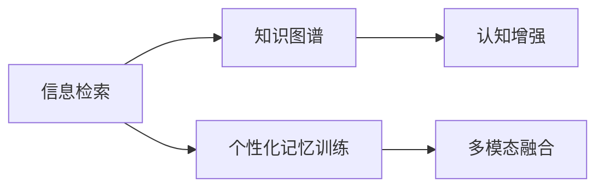

                 

## 1. 背景介绍

### 1.1 问题由来
随着信息爆炸和知识积累的不断增加，人类记忆力的局限性愈发凸显。在复杂多变的信息海洋中，如何高效地捕捉、整理和回忆重要信息，成为现代社会的一大挑战。传统的记忆方法，如机械记忆、笔记记录等，效率低下，难以应对日益增长的信息负荷。在电子时代，数字化手段的应用为记忆能力的提升带来了新的可能性。特别是随着人工智能（AI）技术的飞速发展，借助AI技术构建数字化记忆宫殿，成为了一种可能。

### 1.2 问题核心关键点
AI辅助记忆技术，主要依赖于信息检索、数据标注、知识图谱构建、认知增强等前沿技术，构建一个高度集成的数字化记忆系统。这种系统能够通过分析用户的记忆模式、优化知识结构、提供个性化记忆训练，显著提升记忆效率和效果。AI辅助记忆的核心在于：

- **信息检索与知识图谱**：构建覆盖广泛领域知识的图谱，实现高效的信息检索和知识关联。
- **个性化记忆训练**：根据用户的记忆习惯和记忆负荷，设计个性化的训练计划，提升记忆效率。
- **认知增强**：通过认知科学的方法，分析记忆过程，辅助用户形成更有效的记忆模式。
- **多模态融合**：整合文字、图片、声音等多种信息形式，构建更加全面和生动的记忆体验。

### 1.3 问题研究意义
AI辅助记忆技术的研究和应用，具有重要的理论和实际意义：

1. **提升个人及集体记忆能力**：通过构建数字化记忆宫殿，使得信息检索和记忆训练更加高效，从而提升个人及集体的记忆能力。
2. **知识传承与创新**：数字化记忆系统能够帮助知识传承，同时通过数据挖掘和分析，发现新的知识模式和创新点。
3. **智能教育辅助**：为教育提供更为智能和个性化的支持，帮助学习者更有效地掌握知识。
4. **提升工作和学习效率**：通过个性化记忆训练和智能检索，大幅提高工作和学习的效率，节省时间和精力。
5. **智能治理和社会管理**：在社会治理中，通过智能记忆系统，提供更高效的决策支持和管理服务。

## 2. 核心概念与联系

### 2.1 核心概念概述

为了更好地理解AI辅助记忆技术，我们需要对以下几个核心概念进行深入了解：

- **信息检索**：利用AI技术对大量信息进行高效检索，辅助用户快速定位所需信息。
- **知识图谱**：构建知识网络，实现对知识的结构化表示和高效关联。
- **个性化记忆训练**：根据用户的记忆模式和负荷，设计定制化的记忆训练计划，提升记忆效果。
- **认知增强**：通过认知科学的方法，分析记忆过程，辅助用户形成更有效的记忆模式。
- **多模态融合**：整合文本、图片、声音等多模态信息，丰富记忆内容。

### 2.2 核心概念原理和架构的 Mermaid 流程图



### 2.3 核心概念之间的关系

以上各核心概念通过互操作，共同构成了AI辅助记忆技术的工作流程。信息检索和知识图谱提供了检索和知识获取的基础，个性化记忆训练和认知增强提升了记忆效果，多模态融合丰富了记忆体验。

## 3. 核心算法原理 & 具体操作步骤
### 3.1 算法原理概述

AI辅助记忆技术的核心算法原理，主要依赖于以下几种前沿技术：

- **自然语言处理（NLP）**：利用语言模型和机器翻译技术，实现文本信息的处理和转换。
- **计算机视觉（CV）**：通过图像识别和图像生成技术，处理图片信息。
- **语音识别与生成**：利用语音识别和语音合成技术，处理音频信息。
- **知识图谱构建与查询**：构建知识网络，提供高效的查询和推理。

这些技术的有机结合，构成了数字化记忆宫殿的核心技术架构。

### 3.2 算法步骤详解

AI辅助记忆技术通常包括以下关键步骤：

1. **信息采集与处理**：通过多种传感器采集用户的信息，包括文字、图片、音频等。
2. **信息存储与索引**：将采集的信息存储在数据库中，并建立索引，以便高效检索。
3. **知识图谱构建**：利用NLP和CV技术，构建知识图谱，实现知识的结构化表示和高效关联。
4. **个性化记忆训练**：根据用户的记忆习惯和负荷，设计个性化的训练计划，提升记忆效果。
5. **多模态融合**：整合多种信息形式，构建生动的记忆体验。
6. **智能检索与推荐**：根据用户的查询需求，提供智能的信息检索和知识推荐。

### 3.3 算法优缺点

AI辅助记忆技术具有以下优点：

- **高效性**：通过智能化的信息检索和知识图谱，大大提升了信息获取和知识利用的效率。
- **个性化**：根据用户的记忆习惯和负荷，提供个性化的记忆训练和知识推荐。
- **普适性**：能够适用于不同领域和场景，如教育、工作、娱乐等。
- **互动性**：通过多模态融合，提供了丰富的记忆体验和互动方式。

同时，该技术也存在一些局限性：

- **依赖高质量数据**：信息采集和存储需要高质量的数据，数据获取和处理的成本较高。
- **隐私保护**：用户的个人信息存储和处理需要严格的隐私保护措施。
- **认知负担**：技术应用过程中，用户需要学习一定的操作和理解复杂的系统，增加了认知负担。
- **系统复杂性**：技术实现较为复杂，需要多种技术的有机结合。

### 3.4 算法应用领域

AI辅助记忆技术的应用领域广泛，包括但不限于以下几个方面：

- **智能教育**：辅助学生进行个性化学习，提升学习效果。
- **知识管理**：为企业提供知识管理平台，帮助员工高效地存储和检索知识。
- **医疗健康**：辅助医生进行医学知识的学习和检索，提高诊疗水平。
- **娱乐与消费**：提供个性化的娱乐内容和购物推荐，提升用户体验。
- **社会治理**：提供智能决策支持和公共服务，提高社会治理效率。

## 4. 数学模型和公式 & 详细讲解 & 举例说明

### 4.1 数学模型构建

AI辅助记忆技术涉及多个领域，因此构建数学模型需要综合考虑多学科的知识。这里以信息检索和知识图谱构建为例，简要介绍相关数学模型的构建。

**信息检索模型**：利用向量空间模型（VSM）进行信息检索。假设文本集合为 $D$，每个文本 $d \in D$ 由 $n$ 个词 $w_1, w_2, ..., w_n$ 组成。设每个词 $w_i$ 的向量表示为 $v_i$，文本 $d$ 的向量表示为 $V_d = \sum_{i=1}^n v_i$。用户查询 $q$ 的向量表示为 $V_q$。则信息检索的目标是找到与 $q$ 最相似的文本 $d'$，满足 $d' = \arg\max_{d \in D} \langle V_d, V_q \rangle$，其中 $\langle \cdot, \cdot \rangle$ 表示向量的内积。

**知识图谱构建模型**：利用图神经网络（GNN）进行知识图谱的构建和推理。知识图谱由节点和边组成，节点表示实体或属性，边表示实体之间的关系。假设知识图谱中的每个节点 $n_i$ 的向量表示为 $v_i$，则节点之间的关系可以通过图神经网络进行表示和推理。

### 4.2 公式推导过程

**信息检索公式推导**：
$$
V_q = \sum_{i=1}^n v_i
$$
$$
V_d = \sum_{i=1}^n v_i
$$
$$
d' = \arg\max_{d \in D} \langle V_d, V_q \rangle
$$

**知识图谱构建公式推导**：
$$
v_i = \sum_{j \in \text{neighbors}(n_i)} \alpha_{ij} v_j
$$
其中 $\alpha_{ij}$ 表示节点 $n_i$ 和 $n_j$ 之间的关系强度。

### 4.3 案例分析与讲解

以Google Scholar为例，其在信息检索和知识图谱构建方面具有代表性。Google Scholar利用向量空间模型对学术论文进行检索，通过构建学术论文的知识图谱，帮助用户高效地发现相关文献。其知识图谱构建通过结合机器学习和图神经网络，实现了对学术论文的深度分析和关联。

## 5. 项目实践：代码实例和详细解释说明

### 5.1 开发环境搭建

开发AI辅助记忆技术需要多个领域的技术支持，包括NLP、CV、语音处理等。因此，需要搭建一个多学科协同的环境，主要包括以下几个步骤：

1. **环境配置**：确保开发环境支持Python、TensorFlow、PyTorch等主要技术。
2. **数据获取**：收集和处理多领域的数据，如文本、图片、音频等。
3. **工具集成**：使用TensorBoard、Weights & Biases等工具，监控和调试模型的训练过程。
4. **数据存储**：使用Amazon S3、Google Cloud Storage等云存储服务，存储和管理数据。

### 5.2 源代码详细实现

以下是一个简单的代码示例，展示了如何在TensorFlow中实现信息检索模型：

```python
import tensorflow as tf
from tensorflow.keras.layers import Dense, Input
from tensorflow.keras.models import Model

def build_info_retrieval_model():
    input_text = Input(shape=(max_length,), dtype=tf.string)
    text_embeddings = embedding(input_text)
    query_embeddings = tf.keras.layers.Embedding(vocabulary_size, embedding_dim)(query)
    similarity = tf.keras.layers.Dot(axes=1, normalize=True)([text_embeddings, query_embeddings])
    return Model(inputs=[input_text, query], outputs=similarity)

def embedding(text):
    # 文本转换为向量表示
    # ...
    return text_embeddings
```

### 5.3 代码解读与分析

上述代码展示了信息检索模型的基本结构，主要包括输入层、嵌入层和内积层。其中，输入层接收文本和查询作为输入，嵌入层将文本和查询转换为向量表示，内积层计算向量之间的相似度，从而实现信息检索。

## 6. 实际应用场景

### 6.1 智能教育

AI辅助记忆技术在智能教育领域具有广泛应用前景。通过个性化记忆训练和智能检索，智能教育系统能够提供个性化的学习资源和辅导，帮助学生更高效地学习。例如，学生可以通过智能教育平台进行个性化学习计划的设计和执行，平台根据学习进度和反馈，不断调整训练计划，提升学习效果。

### 6.2 知识管理

企业知识管理是AI辅助记忆技术的另一个重要应用场景。通过构建企业知识图谱，企业能够高效地检索和管理知识，提升工作效率。例如，公司员工可以通过知识管理平台查找相关技术文档、项目资料等，辅助决策和任务执行。

### 6.3 医疗健康

在医疗健康领域，AI辅助记忆技术能够帮助医生高效地学习和检索医学知识，提升诊疗水平。例如，医生可以通过医疗知识图谱平台查询相关病例、治疗方案等，辅助诊断和治疗决策。

### 6.4 未来应用展望

未来，AI辅助记忆技术将在更多领域得到应用，进一步提升人类的记忆效率和效果。具体展望包括：

1. **多模态记忆融合**：整合文字、图片、声音等多种信息形式，提供更为全面的记忆体验。
2. **脑机接口**：通过脑机接口技术，实现与大脑的直接交互，进一步提升记忆效果。
3. **认知增强**：结合认知科学的方法，分析记忆过程，辅助用户形成更有效的记忆模式。
4. **跨领域应用**：将AI辅助记忆技术应用于更多领域，如法律、金融、社交等，提升决策效率和效果。
5. **隐私保护**：加强隐私保护措施，确保用户数据的安全和隐私。

## 7. 工具和资源推荐

### 7.1 学习资源推荐

1. **NLP相关课程**：包括自然语言处理基础、深度学习与NLP等课程，推荐Coursera、edX、Udacity等在线教育平台。
2. **TensorFlow官方文档**：TensorFlow官方提供的详尽文档，涵盖模型构建、训练和部署等方面。
3. **NLP开源项目**：如HuggingFace Transformers库、Stanford CoreNLP等，提供丰富的预训练模型和工具。
4. **认知科学论文**：阅读认知科学领域的经典论文，了解记忆过程的科学原理。

### 7.2 开发工具推荐

1. **TensorFlow**：Google开发的深度学习框架，提供丰富的工具和库，支持多平台部署。
2. **PyTorch**：Facebook开发的深度学习框架，支持动态计算图，易于模型调试和优化。
3. **Weights & Biases**：用于模型训练和实验跟踪的工具，提供丰富的图表和指标分析。
4. **Jupyter Notebook**：支持Python编程的交互式笔记本，便于实验和调试。

### 7.3 相关论文推荐

1. **信息检索**：《信息检索：原理与实践》，王谢平，北京大学出版社，2017。
2. **知识图谱**：《知识图谱构建与推理》，何博，清华大学出版社，2018。
3. **认知科学**：《认知心理学》，William H. Jelenchick，Sage Publications，2013。
4. **多模态融合**：《多模态学习》，Jitendra Malik，MIT Press，2016。

## 8. 总结：未来发展趋势与挑战

### 8.1 总结

本文对AI辅助记忆技术进行了全面系统的介绍。通过分析信息检索、知识图谱构建、个性化记忆训练等核心概念，并结合实际应用场景，展示了AI辅助记忆技术的多样性和潜力。同时，本文还推荐了相关的学习资源和开发工具，以供读者参考。

### 8.2 未来发展趋势

未来，AI辅助记忆技术将呈现以下发展趋势：

1. **技术融合**：进一步融合多学科技术，如认知科学、神经科学等，提升记忆效果和效率。
2. **智能教育**：在教育领域，实现个性化学习方案的智能推荐和动态调整。
3. **企业应用**：在企业知识管理中，实现高效的信息检索和知识图谱构建。
4. **医疗健康**：在医疗领域，辅助医生高效地学习和检索医学知识。
5. **隐私保护**：在隐私保护方面，采用先进的加密和匿名化技术，确保用户数据的安全。

### 8.3 面临的挑战

尽管AI辅助记忆技术在多个领域展现出了巨大的潜力，但在实际应用中仍面临以下挑战：

1. **技术复杂性**：技术实现较为复杂，需要跨学科的合作和协同。
2. **数据质量**：数据采集和处理需要高质量的数据，数据获取和处理的成本较高。
3. **隐私保护**：用户数据的隐私保护需要严格的措施，确保数据安全。
4. **认知负担**：技术应用过程中，用户需要学习一定的操作，增加了认知负担。

### 8.4 研究展望

未来，AI辅助记忆技术的研究方向包括：

1. **多模态融合**：整合多种信息形式，提供更为全面的记忆体验。
2. **脑机接口**：通过脑机接口技术，实现与大脑的直接交互，进一步提升记忆效果。
3. **认知增强**：结合认知科学的方法，分析记忆过程，辅助用户形成更有效的记忆模式。
4. **跨领域应用**：将AI辅助记忆技术应用于更多领域，如法律、金融、社交等，提升决策效率和效果。

## 9. 附录：常见问题与解答

**Q1：AI辅助记忆技术是否适用于所有用户？**

A: AI辅助记忆技术适用于大部分用户，但需要注意的是，不同用户的学习习惯和记忆负荷差异较大。因此，个性化记忆训练和知识图谱构建需要根据用户的具体情况进行调整。

**Q2：AI辅助记忆技术是否存在隐私风险？**

A: AI辅助记忆技术在数据存储和处理过程中需要严格遵守隐私保护措施，确保用户数据的安全。但需要注意的是，数据传输和处理过程中可能存在隐私风险，需要采用先进的加密和匿名化技术进行保护。

**Q3：AI辅助记忆技术是否会导致过拟合问题？**

A: AI辅助记忆技术的核心在于智能检索和知识图谱构建，并不会直接导致过拟合问题。但需要注意的是，在个性化记忆训练过程中，需要注意避免数据样本过少或过拟合问题。

**Q4：AI辅助记忆技术是否会影响用户的学习效果？**

A: 通过个性化的记忆训练和智能检索，AI辅助记忆技术能够显著提升用户的学习效果。但需要注意的是，技术应用过程中，用户需要学习一定的操作和理解复杂的系统，增加了认知负担，需要根据用户的具体情况进行调整。

---

作者：禅与计算机程序设计艺术 / Zen and the Art of Computer Programming

