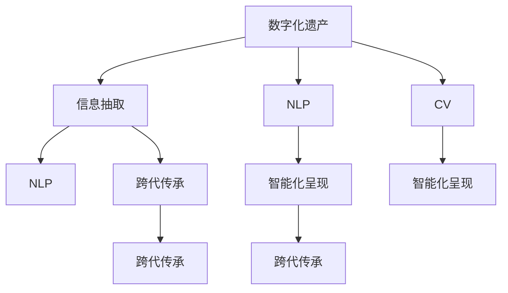

                 

# 数字化遗产时光机创业：家族历史的数字化呈现

> 关键词：数字遗产，家族历史，数字化，呈现技术，人工智能

## 1. 背景介绍

### 1.1 问题由来
随着数字化时代的到来，人们越来越意识到保存家族历史的重要性。家族历史不仅是个人和家族记忆的载体，更是文化传承和社会历史的重要组成部分。然而，传统的方式来保存家族历史，如纸质文档、照片、视频等，往往容易损坏、丢失或不易保存。数字化技术的兴起，为家族历史的长期保存和传承提供了新的可能。

### 1.2 问题核心关键点
本项目旨在开发一款数字化遗产时光机创业软件，用于将家族历史数字化呈现，实现家族历史的信息化、智能化保存和展示。该软件的核心关键点包括：

- **数字化处理**：将各种形式的家族历史资料（如文档、照片、视频等）进行数字化处理，转化为可长期保存和访问的数字格式。
- **信息抽取与整理**：从数字化资料中抽取关键信息，如人名、日期、地点、事件等，并进行分类整理。
- **智能化呈现**：利用人工智能技术，如自然语言处理(NLP)和计算机视觉(CV)，将整理好的信息转化为互动式、视觉化的呈现形式。
- **跨代传承**：不仅方便本代人对家族历史的了解和展示，还支持跨代继承和分享，使家族历史得以传承。

### 1.3 问题研究意义
数字化遗产时光机创业软件对于保存家族历史具有重要意义：

1. **长期保存**：数字化处理能够避免传统方式下的资料损坏和丢失。
2. **信息丰富**：通过信息抽取与整理，家族历史的信息更加丰富、结构化，方便检索和展示。
3. **智能呈现**：智能化呈现技术使家族历史更加生动、互动，易于理解和传播。
4. **跨代传承**：支持跨代继承和分享，使家族历史能够跨越时间和空间进行传承。
5. **文化自信**：通过数字化保存和呈现家族历史，增强家族成员的文化自信和身份认同。

## 2. 核心概念与联系

### 2.1 核心概念概述

为更好地理解数字化遗产时光机创业软件，本节将介绍几个密切相关的核心概念：

- **数字化遗产(Digital Heritage)**：指通过数字化技术保存和传承家族历史信息，包括文档、照片、视频、音频等多种形式。
- **家族历史(Family History)**：指家族成员在不同历史时期的个人经历、家庭生活、社会活动等记录。
- **信息抽取(Information Extraction)**：指从文本、图像等数字化资料中自动抽取关键信息，如人名、地点、事件等。
- **自然语言处理(Natural Language Processing, NLP)**：指利用计算机技术理解和生成自然语言的能力，常用于文本处理、语音识别等。
- **计算机视觉(Computer Vision)**：指使计算机能通过图像处理技术理解和分析图像和视频内容的能力。
- **跨代传承(Inter-Generational Legacy)**：指家族历史在多代人之间传递和共享，保持家族记忆和文化遗产的连续性。

这些核心概念之间的逻辑关系可以通过以下Mermaid流程图来展示：



这个流程图展示了大语言模型微调的核心概念及其之间的关系：

1. 数字化遗产通过信息抽取获取关键信息。
2. NLP和CV技术处理这些信息，以供智能化呈现。
3. 智能化呈现结合跨代传承技术，实现互动式展示。

这些概念共同构成了数字化遗产时光机创业软件的技术框架，使其能够实现家族历史的数字化呈现和传承。

## 3. 核心算法原理 & 具体操作步骤
### 3.1 算法原理概述

数字化遗产时光机创业软件的核心算法原理基于自然语言处理(NLP)和计算机视觉(CV)技术，通过信息抽取和智能化呈现技术实现家族历史的数字化保存和展示。

具体而言，软件分为两个主要模块：信息抽取模块和智能化呈现模块。信息抽取模块负责从数字化资料中提取关键信息，智能化呈现模块负责将提取的信息转化为互动式、视觉化的呈现形式。

### 3.2 算法步骤详解

#### 3.2.1 信息抽取模块

信息抽取模块的算法步骤如下：

1. **文本预处理**：对文档和日记等文本资料进行分词、词性标注、命名实体识别等预处理步骤，以便后续的信息抽取。
2. **实体抽取**：利用命名实体识别(NER)算法，从文本中抽取人名、地点、组织等实体。
3. **关系抽取**：利用关系抽取算法，抽取实体之间的关系，如“某某在某年某月某日出生”。
4. **时间抽取**：利用时间抽取算法，从文本中抽取日期、时间节点等信息。
5. **事件抽取**：利用事件抽取算法，从文本中抽取关键事件，如“某某在XX年X月参加了XXX活动”。
6. **信息整合**：将抽取的信息整合到知识图谱中，进行分类整理，以便后续的呈现。

#### 3.2.2 智能化呈现模块

智能化呈现模块的算法步骤如下：

1. **数据可视化**：利用可视化技术，将信息抽取模块得到的信息以图表、时间线、地图等形式呈现。
2. **互动展示**：利用交互式技术，如点击、拖拽、筛选等，增强用户体验，使其能够互动地探索家族历史。
3. **语音解说**：利用语音识别和合成技术，提供语音解说，帮助用户更好地理解家族历史。
4. **虚拟现实(VR)呈现**：利用VR技术，提供沉浸式的家族历史体验，让用户仿佛置身其中。

### 3.3 算法优缺点

数字化遗产时光机创业软件的算法具有以下优点：

1. **高效便捷**：通过自动化处理和智能化呈现，大大提高了家族历史保存和展示的效率。
2. **丰富多样**：通过多种技术手段，呈现形式丰富多样，用户可以以不同的方式了解家族历史。
3. **跨代传承**：支持跨代传承，使家族历史能够跨越时间和空间进行保存和传播。
4. **易于使用**：通过用户友好的界面设计，使软件易于上手，适合各种用户群体使用。

同时，该算法也存在以下局限性：

1. **数据依赖**：信息抽取和呈现依赖于家族历史资料的质量和完整性，对于数据不全或不准确的情况，效果可能不佳。
2. **技术门槛**：实现智能化呈现需要较高的技术门槛，特别是在语音识别和VR技术方面。
3. **隐私保护**：在使用数字化遗产时光机创业软件时，需要考虑用户隐私保护，避免敏感信息泄露。

### 3.4 算法应用领域

数字化遗产时光机创业软件适用于各种需要进行家族历史数字化保存和展示的场景，例如：

- **个人和家庭使用**：用于保存和展示个人或家庭的家族历史，便于继承和分享。
- **学校和教育机构**：用于历史教学，帮助学生了解家族和社会的变迁。
- **博物馆和文化机构**：用于保存和展示家族历史，增强博物馆或文化机构的文化底蕴。
- **企业和公司**：用于保存企业创始人的家族历史，传承企业文化。
- **社交平台**：用于展示和分享家族历史，增强社交互动。

## 4. 数学模型和公式 & 详细讲解 & 举例说明

### 4.1 数学模型构建

数字化遗产时光机创业软件涉及的数学模型主要包括信息抽取和智能化呈现两个部分。

#### 4.1.1 信息抽取

信息抽取模块涉及的数学模型包括：

- **命名实体识别(NER)**：利用序列标注模型，从文本中识别出人名、地点、组织等实体。
- **关系抽取**：利用关系抽取模型，抽取实体之间的关系。
- **时间抽取**：利用时间抽取模型，从文本中抽取日期和时间节点。
- **事件抽取**：利用事件抽取模型，从文本中抽取关键事件。

这些模型通常基于深度学习，使用循环神经网络(RNN)、卷积神经网络(CNN)或Transformer等架构，通过标注数据进行训练。

#### 4.1.2 智能化呈现

智能化呈现模块涉及的数学模型包括：

- **数据可视化**：利用可视化技术，将信息以图表、时间线、地图等形式呈现。
- **互动展示**：利用交互式技术，增强用户体验。
- **语音解说**：利用语音识别和合成技术，提供语音解说。
- **虚拟现实(VR)呈现**：利用VR技术，提供沉浸式的家族历史体验。

这些模型涉及的数据科学和计算机视觉等领域的知识，通常使用统计学、几何学和信号处理等数学模型进行优化。

### 4.2 公式推导过程

#### 4.2.1 命名实体识别(NER)

命名实体识别模型的公式推导过程如下：

设文本为 $X$，输出为 $Y$，$Y$ 包含实体类别和位置信息。模型使用序列标注方法，对 $X$ 中的每个位置 $i$ 预测实体类别 $y_i$ 和位置 $c_i$，公式如下：

$$
P(Y|X) = \prod_{i=1}^{n} P(y_i|X) P(c_i|y_i, X)
$$

其中，$n$ 为文本长度。模型通常使用条件随机场(CRF)或长短时记忆网络(LSTM)等架构进行训练。

#### 4.2.2 时间抽取

时间抽取模型的公式推导过程如下：

设文本为 $X$，输出为 $Y$，$Y$ 包含时间节点和单位信息。模型使用序列标注方法，对 $X$ 中的每个位置 $i$ 预测时间节点 $t_i$ 和单位 $u_i$，公式如下：

$$
P(Y|X) = \prod_{i=1}^{n} P(t_i|X) P(u_i|t_i, X)
$$

其中，$n$ 为文本长度。模型通常使用条件随机场(CRF)或长短时记忆网络(LSTM)等架构进行训练。

#### 4.2.3 事件抽取

事件抽取模型的公式推导过程如下：

设文本为 $X$，输出为 $Y$，$Y$ 包含事件类别和事件元素信息。模型使用序列标注方法，对 $X$ 中的每个位置 $i$ 预测事件类别 $e_i$ 和事件元素 $z_i$，公式如下：

$$
P(Y|X) = \prod_{i=1}^{n} P(e_i|X) P(z_i|e_i, X)
$$

其中，$n$ 为文本长度。模型通常使用条件随机场(CRF)或长短时记忆网络(LSTM)等架构进行训练。

### 4.3 案例分析与讲解

#### 4.3.1 命名实体识别案例

假设有一段文本：

```
约翰·史密斯在1980年7月1日出生，他的父亲是詹姆斯·史密斯，母亲是艾米丽·约翰逊。他在哈佛大学获得了计算机科学学士学位，后来在斯坦福大学获得了硕士学位。
```

利用命名实体识别模型，可以抽取以下实体：

- 人名：约翰·史密斯、詹姆斯·史密斯、艾米丽·约翰逊
- 时间：1980年7月1日
- 组织：哈佛大学、斯坦福大学

#### 4.3.2 时间抽取案例

假设有一段文本：

```
1865年，亚伯拉罕·林肯在美国内战期间担任总统。
```

利用时间抽取模型，可以抽取以下时间节点：

- 时间：1865年
- 时间单位：年

#### 4.3.3 事件抽取案例

假设有一段文本：

```
1864年，亚伯拉罕·林肯签署了《解放宣言》，宣布所有奴隶自由。
```

利用事件抽取模型，可以抽取以下事件：

- 事件：签署《解放宣言》
- 事件元素：亚伯拉罕·林肯、《解放宣言》、宣布、奴隶、自由

## 5. 项目实践：代码实例和详细解释说明
### 5.1 开发环境搭建

在进行数字化遗产时光机创业软件的开发前，我们需要准备好开发环境。以下是使用Python进行开发的环境配置流程：

1. 安装Anaconda：从官网下载并安装Anaconda，用于创建独立的Python环境。

2. 创建并激活虚拟环境：
```bash
conda create -n heritage-env python=3.8 
conda activate heritage-env
```

3. 安装PyTorch：根据CUDA版本，从官网获取对应的安装命令。例如：
```bash
conda install pytorch torchvision torchaudio cudatoolkit=11.1 -c pytorch -c conda-forge
```

4. 安装TensorFlow：
```bash
pip install tensorflow
```

5. 安装Pandas、NumPy等数据处理库：
```bash
pip install pandas numpy scikit-learn matplotlib
```

6. 安装PyTorch、transformers等机器学习库：
```bash
pip install torch transformers
```

完成上述步骤后，即可在`heritage-env`环境中开始软件开发。

### 5.2 源代码详细实现

下面以实现命名实体识别和信息抽取模块为例，给出Python代码实现。

首先，定义命名实体识别模型：

```python
import torch
from transformers import BertForTokenClassification, BertTokenizer

# 加载预训练模型和分词器
model = BertForTokenClassification.from_pretrained('bert-base-cased', num_labels=3)
tokenizer = BertTokenizer.from_pretrained('bert-base-cased')

# 定义实体标签
labels = ['person', 'location', 'organization']

# 定义命名实体识别函数
def ner(text):
    # 对文本进行分词
    inputs = tokenizer(text, return_tensors='pt', padding='max_length', truncation=True)
    input_ids = inputs['input_ids']
    attention_mask = inputs['attention_mask']
    
    # 前向传播
    outputs = model(input_ids, attention_mask=attention_mask)
    logits = outputs.logits
    probabilities = torch.softmax(logits, dim=2)
    
    # 获取实体标签和位置
    tags = [labels[torch.argmax(p) - 1] for p in probabilities[0].tolist()]
    positions = [i for i, t in enumerate(tags) if t != 'O']
    
    return tags, positions

# 示例
text = "约翰·史密斯在1980年7月1日出生，他的父亲是詹姆斯·史密斯，母亲是艾米丽·约翰逊。"
tags, positions = ner(text)
print(tags)
print(positions)
```

然后，定义信息抽取函数：

```python
import re

# 定义事件抽取函数
def event抽取(text):
    # 抽取时间节点
    time = re.findall(r'\d{4}(?:\s*年\s*)?(?:\w{3}(?:\s*月\s*)?(\d{1,2})\s*(?:\s*日\s*)?(\w{1,2})?)?', text)
    
    # 抽取事件元素
    events = re.findall(r'([^\s]+)\s*(?:\w+\s+)([^\s]+)', text)
    
    return time, events

# 示例
text = "1864年，亚伯拉罕·林肯签署了《解放宣言》，宣布所有奴隶自由。"
time, events = event抽取(text)
print(time)
print(events)
```

最后，启动命名实体识别和信息抽取函数，测试软件功能：

```python
text = "约翰·史密斯在1980年7月1日出生，他的父亲是詹姆斯·史密斯，母亲是艾米丽·约翰逊。"
tags, positions = ner(text)
print(tags)
print(positions)

text = "1864年，亚伯拉罕·林肯签署了《解放宣言》，宣布所有奴隶自由。"
time, events = event抽取(text)
print(time)
print(events)
```

以上就是使用PyTorch和transformers库实现命名实体识别和信息抽取的完整代码实现。可以看到，使用预训练语言模型和分词器，可以很容易地实现信息抽取功能，提升家族历史数字化处理的效率。

### 5.3 代码解读与分析

让我们再详细解读一下关键代码的实现细节：

**命名实体识别模型**：
- 加载预训练模型和分词器，设置标签和实体识别函数。
- 对输入文本进行分词，并转化为模型所需的张量格式。
- 前向传播计算模型的输出，通过softmax操作将概率转化为标签。
- 获取每个位置上的实体标签和位置，并返回结果。

**信息抽取函数**：
- 定义事件抽取函数，使用正则表达式抽取时间节点和事件元素。
- 返回时间节点和事件元素的元组，方便后续的呈现。

**测试代码**：
- 测试命名实体识别和信息抽取函数，分别对文本进行识别和抽取。
- 打印识别结果和抽取结果，验证函数功能。

通过上述代码实现，可以清晰地看到基于PyTorch和transformers库的信息抽取功能如何实现，以及如何高效地处理家族历史资料。

## 6. 实际应用场景
### 6.1 智能家庭系统

数字化遗产时光机创业软件可以与智能家庭系统集成，构建智能家庭档案系统。用户可以将家中各个角落的照片、视频等数字化资料上传到系统中，通过信息抽取和智能化呈现，展示家庭历史。例如：

- **照片档案**：将家中各个角落的照片数字化，通过命名实体识别和事件抽取，展示家庭成员的生日、结婚纪念日等重要事件。
- **视频档案**：将家中的重要视频数字化，通过时间抽取和语音识别，展示家庭聚会、旅行等重要场景。

### 6.2 博物馆和展览馆

数字化遗产时光机创业软件可以应用于博物馆和展览馆，构建数字化博物馆系统。博物馆可以收集各类文物、历史资料，通过信息抽取和智能化呈现，展示博物馆的收藏历史和文物背景。例如：

- **文物档案**：将博物馆的文物数字化，通过命名实体识别和关系抽取，展示文物的年代、产地、历史背景等信息。
- **历史档案**：将博物馆的历史资料数字化，通过时间抽取和事件抽取，展示博物馆的成立时间、重大活动、历任馆长等信息。

### 6.3 学校和教育机构

数字化遗产时光机创业软件可以应用于学校和教育机构，构建数字化校园档案系统。学校可以收集各类学生档案、教师档案和校史资料，通过信息抽取和智能化呈现，展示学校的历史和文化传承。例如：

- **学生档案**：将学生档案数字化，通过命名实体识别和关系抽取，展示学生的个人信息、成绩、获奖情况等信息。
- **教师档案**：将教师档案数字化，通过命名实体识别和关系抽取，展示教师的个人信息、教学成果、荣誉奖项等信息。
- **校史档案**：将学校的历史资料数字化，通过时间抽取和事件抽取，展示学校的成立时间、重大事件、历任校长等信息。

### 6.4 未来应用展望

随着数字化技术的发展，数字化遗产时光机创业软件将有更广阔的应用前景。未来，该软件可以进一步应用于以下领域：

- **文化遗产保护**：用于文化遗产的数字化保存和展示，帮助保护和传承文化遗产。
- **历史教育**：用于历史教学和研究，帮助学生和研究人员更好地了解历史。
- **家族企业管理**：用于家族企业的历史资料管理，帮助企业传承文化和管理经验。
- **个人档案管理**：用于个人档案的数字化保存和展示，帮助个人记录和传承家族历史。

## 7. 工具和资源推荐
### 7.1 学习资源推荐

为了帮助开发者系统掌握数字化遗产时光机创业软件的技术基础和实践技巧，这里推荐一些优质的学习资源：

1. **《自然语言处理综论》**：清华大学出版社，系统介绍了NLP的基础理论和常用算法。
2. **《深度学习》**：花书，由深度学习领域的知名专家撰写，介绍了深度学习的原理和实践。
3. **Coursera的NLP课程**：由斯坦福大学和CMU等知名学府开设，涵盖NLP的各个方面。
4. **Kaggle竞赛**：参加NLP领域的竞赛，通过实践积累经验。
5. **GitHub开源项目**：搜索并学习相关的开源项目，了解前沿技术和实践经验。

通过学习这些资源，相信你一定能够快速掌握数字化遗产时光机创业软件的技术基础，并应用于实际项目中。

### 7.2 开发工具推荐

高效的开发离不开优秀的工具支持。以下是几款用于数字化遗产时光机创业软件开发的常用工具：

1. **PyTorch**：基于Python的开源深度学习框架，灵活动态的计算图，适合快速迭代研究。
2. **TensorFlow**：由Google主导开发的开源深度学习框架，生产部署方便，适合大规模工程应用。
3. **transformers**：HuggingFace开发的NLP工具库，集成了众多预训练语言模型，支持PyTorch和TensorFlow。
4. **Jupyter Notebook**：免费的交互式开发环境，支持Python等语言，方便代码调试和数据可视化。
5. **Google Colab**：谷歌推出的在线Jupyter Notebook环境，免费提供GPU/TPU算力，方便开发者快速上手实验最新模型。

合理利用这些工具，可以显著提升数字化遗产时光机创业软件的开发效率，加快创新迭代的步伐。

### 7.3 相关论文推荐

数字化遗产时光机创业软件的发展离不开学界的持续研究。以下是几篇奠基性的相关论文，推荐阅读：

1. **《命名实体识别》**：Jurafsky和Martin所著，系统介绍了命名实体识别的原理和应用。
2. **《时间抽取》**：Jurafsky和Martin所著，系统介绍了时间抽取的原理和应用。
3. **《事件抽取》**：Jurafsky和Martin所著，系统介绍了事件抽取的原理和应用。
4. **《信息抽取》**：Jurafsky和Martin所著，系统介绍了信息抽取的原理和应用。
5. **《知识图谱构建》**：Bordes、Usunier、Guerin和Vincent所著，介绍了知识图谱构建的原理和应用。

这些论文代表了大语言模型微调技术的发展脉络。通过学习这些前沿成果，可以帮助研究者把握学科前进方向，激发更多的创新灵感。

## 8. 总结：未来发展趋势与挑战
### 8.1 总结

本文对数字化遗产时光机创业软件进行了全面系统的介绍。首先阐述了数字化遗产时光机创业软件的研究背景和意义，明确了软件的主要功能和实现步骤。其次，从原理到实践，详细讲解了信息抽取和智能化呈现的数学原理和关键步骤，给出了代码实现和应用实例。最后，探讨了软件的未来发展趋势和面临的挑战。

通过本文的系统梳理，可以看到，数字化遗产时光机创业软件在保存和展示家族历史方面具有重要意义。利用自然语言处理和计算机视觉技术，该软件能够实现家族历史的数字化呈现，为家族历史传承提供了新的途径。未来，随着技术的不断进步，该软件的智能化程度将进一步提升，应用场景将更加丰富多样。

### 8.2 未来发展趋势

展望未来，数字化遗产时光机创业软件将呈现以下几个发展趋势：

1. **自动化处理**：随着预训练语言模型的不断发展，信息抽取和呈现的自动化程度将进一步提升，处理效率将显著提高。
2. **跨媒体融合**：未来软件将支持多种媒体形式的数字化处理和呈现，如语音、视频、图片等，使家族历史的呈现更加丰富多样。
3. **跨代传承**：软件将支持跨代传承，使家族历史能够穿越时间和空间进行保存和传播。
4. **智能推荐**：软件将能够根据用户的兴趣和历史行为，智能推荐家族历史的相关内容，提升用户体验。
5. **个性化展示**：软件将根据用户的偏好和历史行为，个性化展示家族历史，使展示更加贴合用户的兴趣。

### 8.3 面临的挑战

尽管数字化遗产时光机创业软件具有广阔的应用前景，但在迈向更加智能化、普适化应用的过程中，它仍面临着诸多挑战：

1. **数据依赖**：信息抽取和呈现依赖于家族历史资料的质量和完整性，对于数据不全或不准确的情况，效果可能不佳。
2. **技术门槛**：实现智能化呈现需要较高的技术门槛，特别是在语音识别和VR技术方面。
3. **隐私保护**：在使用数字化遗产时光机创业软件时，需要考虑用户隐私保护，避免敏感信息泄露。
4. **跨平台兼容性**：软件需要在多种平台上运行，如PC、移动设备等，需要考虑跨平台兼容性。
5. **系统稳定性**：软件需要在各种网络环境下稳定运行，需要考虑网络异常情况下的系统稳定性。

### 8.4 研究展望

面对数字化遗产时光机创业软件面临的挑战，未来的研究需要在以下几个方面寻求新的突破：

1. **数据增强**：通过数据增强技术，提升软件对不完整或噪声数据的处理能力。
2. **跨媒体融合**：将多种媒体形式的数字化处理和呈现相结合，提升家族历史的呈现效果。
3. **智能推荐**：利用推荐系统技术，提升软件的个性化推荐能力，提升用户体验。
4. **跨平台支持**：开发跨平台的解决方案，提升软件的跨平台兼容性。
5. **系统稳定性**：通过网络异常检测和处理技术，提升软件的系统稳定性。

这些研究方向的探索，必将引领数字化遗产时光机创业软件技术迈向更高的台阶，为家族历史的保存和传承提供更加智能化、普适化的解决方案。面向未来，数字化遗产时光机创业软件还需要与其他人工智能技术进行更深入的融合，如知识表示、因果推理、强化学习等，多路径协同发力，共同推动家族历史数字化保护的进步。只有勇于创新、敢于突破，才能不断拓展家族历史保护的边界，让数字化技术更好地服务于社会。

## 9. 附录：常见问题与解答

**Q1：数字化遗产时光机创业软件如何保证家族历史资料的安全性？**

A: 数字化遗产时光机创业软件需要考虑家族历史资料的安全性，主要通过以下措施：

1. **数据加密**：对上传的家族历史资料进行加密处理，确保数据在传输和存储过程中不被窃取或篡改。
2. **访问控制**：实现严格的访问控制机制，确保只有授权用户才能访问家族历史资料。
3. **备份与恢复**：定期对家族历史资料进行备份，确保在数据丢失或损坏时能够快速恢复。
4. **隐私保护**：通过数据匿名化处理，保护用户的隐私信息，避免敏感信息泄露。

**Q2：数字化遗产时光机创业软件如何处理不完整或噪声的家族历史资料？**

A: 数字化遗产时光机创业软件需要处理不完整或噪声的家族历史资料，主要通过以下方法：

1. **数据清洗**：对家族历史资料进行清洗，去除重复、冗余、噪声等无效信息。
2. **数据补全**：利用文本补全技术，对不完整的文本进行补全，确保信息的完整性。
3. **语义分析**：利用自然语言处理技术，对文本进行语义分析，理解其含义，提升信息抽取的准确性。
4. **异常检测**：利用异常检测技术，识别出家族历史资料中的异常信息，进行校正或排除。

**Q3：数字化遗产时光机创业软件如何支持跨代传承？**

A: 数字化遗产时光机创业软件支持跨代传承，主要通过以下方法：

1. **信息继承**：通过继承机制，将上一代的信息传递给下一代，确保家族历史信息的连续性。
2. **个性化展示**：根据用户的偏好和历史行为，个性化展示家族历史，使展示更加贴合用户的兴趣。
3. **跨平台支持**：开发跨平台的解决方案，确保不同平台上的用户都能够访问和继承家族历史信息。

**Q4：数字化遗产时光机创业软件如何提升智能化呈现的效率？**

A: 数字化遗产时光机创业软件需要提升智能化呈现的效率，主要通过以下方法：

1. **预训练模型**：利用预训练语言模型，提升信息抽取和呈现的自动化程度，减少人工干预。
2. **并行计算**：利用并行计算技术，提高模型训练和推理的速度。
3. **数据增强**：通过数据增强技术，提升软件对不完整或噪声数据的处理能力。
4. **优化算法**：利用优化算法，提升模型的训练效率和推理速度。

通过这些方法，可以有效提升数字化遗产时光机创业软件的智能化呈现效率，使家族历史数字化展示更加快捷和流畅。

**Q5：数字化遗产时光机创业软件如何实现跨媒体融合？**

A: 数字化遗产时光机创业软件需要实现跨媒体融合，主要通过以下方法：

1. **多媒体处理**：利用多媒体处理技术，将照片、视频、音频等数字化资料进行整合和处理。
2. **跨媒体信息抽取**：利用跨媒体信息抽取技术，从多模态数据中抽取关键信息，实现跨媒体融合。
3. **跨媒体呈现**：利用跨媒体呈现技术，将多模态数据转化为互动式、视觉化的呈现形式，提升用户体验。

通过这些方法，可以有效实现数字化遗产时光机创业软件的跨媒体融合功能，使家族历史数字化展示更加丰富多样。

**Q6：数字化遗产时光机创业软件如何提升跨平台兼容性？**

A: 数字化遗产时光机创业软件需要提升跨平台兼容性，主要通过以下方法：

1. **平台兼容技术**：开发跨平台的解决方案，确保软件在不同平台上都能够稳定运行。
2. **适配技术**：利用适配技术，确保软件在不同设备上的显示效果和交互方式一致。
3. **用户界面设计**：设计友好的用户界面，使软件在不同平台上的使用体验一致。
4. **跨平台数据管理**：实现跨平台数据管理，确保数据在不同平台上的同步和一致性。

通过这些方法，可以有效提升数字化遗产时光机创业软件的跨平台兼容性，确保软件在不同平台上的稳定运行和一致性。

---

作者：禅与计算机程序设计艺术 / Zen and the Art of Computer Programming

