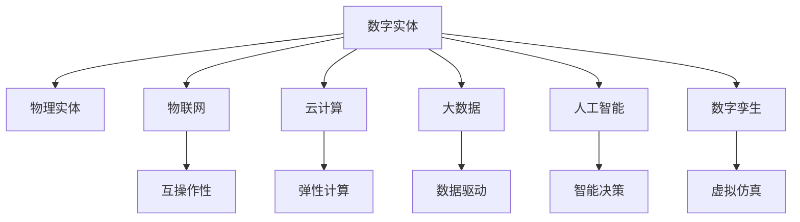

                 

# 数字实体与物理实体的自动化趋势

## 1. 背景介绍

### 1.1 问题由来

随着物联网(IoT)、云计算、大数据、人工智能等技术的飞速发展，我们正在迈入一个数字化和智能化的新纪元。在这个过程中，数字实体与物理实体之间的互联互通、自动控制和智能化管理变得越来越重要。数字实体，如传感器、智能设备、工业控制系统等，已经广泛应用于工业、农业、交通、医疗、智能家居等领域，极大地提升了生产效率和生活品质。

然而，数字实体的广泛应用也带来了许多新的挑战。例如，如何保障数字实体的安全性、可靠性和可维护性；如何利用数字实体和物理实体之间的数据，进行自动控制和智能决策；如何在保障隐私和安全的前提下，实现数字实体的自动化部署和管理等。这些问题，都需要我们在理论和实践上进行深入研究和探索。

### 1.2 问题核心关键点

1. **数字实体的定义和类型**：数字实体是指通过数字化手段构建和管理的实体，包括但不限于传感器、智能设备、工业控制系统等。不同类型的数字实体在数字化环境中的作用和特点各不相同。

2. **数字实体与物理实体的互联**：数字实体需要与物理实体进行数据交换和控制，实现物理系统的自动化和智能化。这种互联过程依赖于各种通信协议和接口标准，需要在互操作性、可靠性、安全性等方面进行设计和优化。

3. **数字实体的自动化管理**：数字实体需要通过软件平台进行集中管理和监控，实现自动化的配置、调度、故障诊断和维护。自动化管理需要依赖于先进的算法和数据处理技术。

4. **数字实体的安全性和隐私保护**：数字实体在运行过程中会收集和传输大量的敏感数据，需要采取有效的安全措施和技术手段，保障数据的安全性和隐私性。

## 2. 核心概念与联系

### 2.1 核心概念概述

为了更好地理解数字实体与物理实体的自动化趋势，本节将介绍几个密切相关的核心概念：

- **数字实体(Digital Entity)**：通过数字化手段构建和管理的实体，如传感器、智能设备、工业控制系统等。数字实体能够感知环境变化、执行自动控制任务，是数字化和智能化环境的基础单元。

- **物理实体(Physical Entity)**：现实世界中实际的物理设备或系统，如机器、车辆、建筑物等。物理实体是数字实体的物理载体，是数字化环境的目标对象。

- **物联网(IoT)**：通过互联网将各种设备和传感器连接起来，实现物理实体与数字实体的互联互通。物联网推动了数字实体与物理实体的深度融合。

- **云计算**：利用远程计算资源，提供按需服务、弹性计算、数据存储和处理等基础设施。云计算为数字实体的管理和应用提供了强有力的支持。

- **大数据**：通过收集、存储和分析海量数据，挖掘数据背后的规律和价值，推动智能化决策和自动控制。大数据为数字实体的自动化管理提供了丰富的数据基础。

- **人工智能(AI)**：通过机器学习、深度学习等技术，使计算机具备类似于人类的感知、理解、推理和决策能力。人工智能为数字实体的智能化应用提供了核心驱动力。

- **数字孪生(Digital Twin)**：利用数字模型和数据，对物理实体进行仿真和建模，实现虚拟与现实的映射和交互。数字孪生为数字实体与物理实体的自动化管理提供了重要工具。

这些核心概念之间的逻辑关系可以通过以下Mermaid流程图来展示：



这个流程图展示了大实体与物理实体的核心概念及其之间的关系：

1. 数字实体通过物联网、云计算、大数据和人工智能等技术手段，与物理实体进行互联互通。
2. 数字实体通过数字孪生技术，实现虚拟与现实的映射和交互，支持智能化决策和自动控制。
3. 数字实体在物联网、云计算、大数据和人工智能的支持下，能够进行自动化管理、故障诊断、维护等任务。
4. 数字实体的安全性和隐私保护依赖于物联网、云计算、大数据和人工智能等多项技术。

## 3. 核心算法原理 & 具体操作步骤

### 3.1 算法原理概述

数字实体与物理实体的自动化管理，本质上是一个复杂的多模态信息融合、智能决策和自动控制的过程。其核心算法原理包括以下几个方面：

- **多模态信息融合**：将来自不同来源（如传感器、摄像头、RFID等）的多模态数据进行融合，提取有用信息，为智能决策和自动控制提供数据支持。

- **智能决策**：利用机器学习、深度学习等技术，对融合后的数据进行分析和建模，预测物理系统的状态和行为，支持自动控制决策。

- **自动控制**：根据智能决策结果，自动调整数字实体和物理实体的参数和状态，实现自动化和智能化管理。

### 3.2 算法步骤详解

以下是数字实体与物理实体的自动化管理的详细操作步骤：

**Step 1: 数据收集与预处理**

- 通过传感器、摄像头、RFID等设备，收集物理实体的各种数据。
- 对收集到的数据进行去噪、归一化、特征提取等预处理操作，准备用于模型训练和推理。

**Step 2: 多模态数据融合**

- 将不同类型的传感器数据进行统一格式转换，实现数据融合。
- 利用时空同步、传感器校正等技术，保证数据的时空一致性。
- 通过特征选择和降维技术，提取有用的数据特征。

**Step 3: 智能决策**

- 使用机器学习、深度学习等算法，对融合后的数据进行建模和训练，构建智能决策模型。
- 根据智能决策模型的输出结果，预测物理系统的状态和行为。
- 利用优化算法和强化学习技术，动态调整决策策略，优化决策效果。

**Step 4: 自动控制**

- 根据智能决策的结果，自动调整数字实体和物理实体的参数和状态，实现自动化控制。
- 利用控制算法（如PID控制、模糊控制等），实现对物理系统的精确控制。
- 通过实时监控和反馈机制，动态调整控制策略，提高控制效果。

### 3.3 算法优缺点

数字实体与物理实体的自动化管理算法具有以下优点：

- **高效性**：通过自动化管理和控制，大大提高了生产效率和系统可靠性。
- **智能化**：利用智能决策模型，提高了系统的智能化水平和应对复杂环境的能力。
- **可扩展性**：通过模块化设计和标准化接口，支持数字实体与物理实体的灵活扩展和集成。

同时，这些算法也存在一些局限性：

- **数据依赖性**：算法的效果高度依赖于数据的质量和完整性，数据获取和处理成本较高。
- **复杂性**：多模态数据融合和智能决策模型的构建过程较为复杂，需要大量的数据和计算资源。
- **安全性和隐私保护**：在自动化管理过程中，需要考虑数据的安全性和隐私保护问题。

### 3.4 算法应用领域

数字实体与物理实体的自动化管理算法已经在多个领域得到了广泛的应用，例如：

- **工业自动化**：通过传感器、控制器等数字实体，实现生产设备的自动化监控和控制，提升生产效率和质量。
- **智能交通**：利用传感器、摄像头等数字实体，实现交通流量的实时监测和控制，提升交通系统的运行效率和安全水平。
- **智慧医疗**：通过医疗设备、传感器等数字实体，实现病人的远程监测和管理，提升医疗服务的质量和效率。
- **智慧农业**：通过传感器、无人机等数字实体，实现农业生产的自动化和智能化，提升农业生产效率和资源利用率。
- **智能家居**：通过智能设备、传感器等数字实体，实现家庭环境的自动化管理，提升居住体验和舒适度。

除了上述这些经典应用外，数字实体与物理实体的自动化管理算法还在更多场景中得到应用，如智能城市、智能制造、智能物流等，为各行各业带来了新的技术突破和应用创新。

## 4. 数学模型和公式 & 详细讲解 & 举例说明

### 4.1 数学模型构建

在数字实体与物理实体的自动化管理过程中，常见的数学模型包括多模态数据融合模型、智能决策模型和自动控制模型。以下分别介绍这些模型的构建方法。

**多模态数据融合模型**

多模态数据融合的目的是将不同来源的数据进行综合和整合，提取有用的信息。常用的多模态数据融合模型包括：

- **主成分分析(PCA)**：通过线性变换，将高维数据降维到低维空间，保留主要特征。
- **独立成分分析(ICA)**：将多个独立源信号分离出来，减少数据冗余。
- **核主成分分析(KPCA)**：利用核技巧，实现非线性数据融合。

**智能决策模型**

智能决策模型通过机器学习和深度学习技术，对数据进行分析和建模，实现对物理系统的状态和行为的预测。常用的智能决策模型包括：

- **线性回归模型**：用于对数据进行拟合和预测，适用于简单的线性关系。
- **随机森林模型**：通过集成多个决策树，提高模型的泛化能力和鲁棒性。
- **卷积神经网络(CNN)**：利用卷积操作提取空间特征，适用于图像和视频数据的分析。
- **循环神经网络(RNN)**：通过时间序列建模，适用于序列数据的分析和预测。
- **长短期记忆网络(LSTM)**：通过门控机制，处理长序列数据的依赖关系。
- **变分自编码器(VAE)**：用于对数据进行降维和生成，适用于无监督学习。

**自动控制模型**

自动控制模型通过控制算法，实现对数字实体和物理实体的精确控制。常用的自动控制模型包括：

- **PID控制器**：基于比例、积分、微分控制，实现对系统的精确控制。
- **模糊控制器**：通过模糊推理，实现对复杂系统的控制。
- **模型预测控制(MPC)**：通过模型预测和动态优化，实现对系统的精确控制。

### 4.2 公式推导过程

以下以线性回归模型为例，推导其公式及其梯度计算方法。

假设输入数据为 $x=(x_1,x_2,\ldots,x_n)$，输出数据为 $y=(y_1,y_2,\ldots,y_m)$。设线性回归模型为：

$$
y = wx + b
$$

其中 $w$ 为权重向量，$b$ 为偏置项。根据最小二乘法的思想，线性回归模型的目标是最小化预测误差：

$$
\mathcal{L}(w,b) = \frac{1}{2}\sum_{i=1}^{m}(y_i - wx_i - b)^2
$$

求解该最小二乘问题，可以得到 $w$ 和 $b$ 的最优解：

$$
w = (X^T X)^{-1} X^T y
$$

$$
b = \bar{y} - X w
$$

其中 $X$ 为数据矩阵，$\bar{y}$ 为输出数据的均值。

线性回归模型的梯度计算公式为：

$$
\nabla_{w} \mathcal{L}(w,b) = \frac{\partial \mathcal{L}(w,b)}{\partial w} = X^T (Xw - y)
$$

$$
\nabla_{b} \mathcal{L}(w,b) = \frac{\partial \mathcal{L}(w,b)}{\partial b} = \frac{1}{m} \sum_{i=1}^{m} (Xw_i - y_i)
$$

在得到梯度后，即可带入优化算法，完成模型的训练和推理。

### 4.3 案例分析与讲解

以智能交通为例，分析数字实体与物理实体的自动化管理。

**Step 1: 数据收集与预处理**

- 通过摄像头、传感器等数字实体，收集交通流量、车速、车辆位置等信息。
- 对收集到的数据进行去噪、归一化、特征提取等预处理操作，准备用于模型训练和推理。

**Step 2: 多模态数据融合**

- 将摄像头、传感器等不同类型的数字实体收集的数据进行统一格式转换，实现数据融合。
- 利用时空同步、传感器校正等技术，保证数据的时空一致性。
- 通过特征选择和降维技术，提取有用的数据特征，如车速、车辆密度、道路拥堵程度等。

**Step 3: 智能决策**

- 使用随机森林模型或卷积神经网络，对融合后的数据进行建模和训练，构建智能决策模型。
- 根据智能决策模型的输出结果，预测交通流量和车速的变化趋势，支持交通信号灯的控制。
- 利用优化算法和强化学习技术，动态调整决策策略，优化交通信号灯的控制效果。

**Step 4: 自动控制**

- 根据智能决策的结果，自动调整交通信号灯的参数和状态，实现交通流的动态控制。
- 利用PID控制器等控制算法，实现对交通信号灯的精确控制。
- 通过实时监控和反馈机制，动态调整控制策略，提高交通系统的运行效率和安全水平。

## 5. 项目实践：代码实例和详细解释说明

### 5.1 开发环境搭建

在进行项目实践前，我们需要准备好开发环境。以下是使用Python进行PyTorch开发的环境配置流程：

1. 安装Anaconda：从官网下载并安装Anaconda，用于创建独立的Python环境。

2. 创建并激活虚拟环境：
```bash
conda create -n pytorch-env python=3.8 
conda activate pytorch-env
```

3. 安装PyTorch：根据CUDA版本，从官网获取对应的安装命令。例如：
```bash
conda install pytorch torchvision torchaudio cudatoolkit=11.1 -c pytorch -c conda-forge
```

4. 安装TensorFlow：由Google主导开发的开源深度学习框架，生产部署方便，适合大规模工程应用。同样有丰富的预训练语言模型资源。

5. 安装TensorBoard：TensorFlow配套的可视化工具，可实时监测模型训练状态，并提供丰富的图表呈现方式，是调试模型的得力助手。

6. 安装Weights & Biases：模型训练的实验跟踪工具，可以记录和可视化模型训练过程中的各项指标，方便对比和调优。

完成上述步骤后，即可在`pytorch-env`环境中开始项目实践。

### 5.2 源代码详细实现

这里我们以智能交通为例，给出使用PyTorch进行交通信号灯控制的代码实现。

首先，定义交通信号灯的控制模型：

```python
import torch
import torch.nn as nn
import torch.optim as optim

class TrafficLightModel(nn.Module):
    def __init__(self):
        super(TrafficLightModel, self).__init__()
        self.linear1 = nn.Linear(4, 128)
        self.linear2 = nn.Linear(128, 2)
        
    def forward(self, x):
        x = self.linear1(x)
        x = torch.relu(x)
        x = self.linear2(x)
        return x
```

然后，定义模型训练和评估函数：

```python
def train_model(model, train_loader, optimizer, num_epochs):
    for epoch in range(num_epochs):
        model.train()
        running_loss = 0.0
        for i, data in enumerate(train_loader, 0):
            inputs, labels = data
            optimizer.zero_grad()
            outputs = model(inputs)
            loss = nn.functional.cross_entropy(outputs, labels)
            loss.backward()
            optimizer.step()
            running_loss += loss.item()
        print(f'Epoch {epoch+1}, loss: {running_loss/len(train_loader)}')

def evaluate_model(model, test_loader):
    model.eval()
    correct = 0
    total = 0
    with torch.no_grad():
        for data in test_loader:
            inputs, labels = data
            outputs = model(inputs)
            _, predicted = torch.max(outputs, 1)
            total += labels.size(0)
            correct += (predicted == labels).sum().item()
    print(f'Test set accuracy: {100 * correct / total}%')
```

最后，启动训练流程并在测试集上评估：

```python
import torch
import torch.nn as nn
import torch.optim as optim
import torch.utils.data as data

# 定义训练集和测试集
train_data = ...
test_data = ...

# 定义模型
model = TrafficLightModel()

# 定义优化器
optimizer = optim.Adam(model.parameters(), lr=0.001)

# 定义训练集和测试集加载器
train_loader = data.DataLoader(train_data, batch_size=32, shuffle=True)
test_loader = data.DataLoader(test_data, batch_size=32, shuffle=False)

# 训练模型
train_model(model, train_loader, optimizer, num_epochs=10)

# 评估模型
evaluate_model(model, test_loader)
```

以上就是使用PyTorch进行智能交通信号灯控制的完整代码实现。可以看到，得益于PyTorch的强大封装，我们可以用相对简洁的代码完成交通信号灯控制模型的训练和评估。

### 5.3 代码解读与分析

让我们再详细解读一下关键代码的实现细节：

**TrafficLightModel类**：
- `__init__`方法：初始化线性层，设置模型的输入输出维度。
- `forward`方法：定义前向传播过程，依次通过两个线性层，并激活ReLU函数。

**train_model函数**：
- 对模型进行训练，遍历训练集，更新模型参数。

**evaluate_model函数**：
- 对模型进行评估，遍历测试集，计算准确率。

**训练流程**：
- 定义总的epoch数和优化器，开始循环迭代
- 每个epoch内，在训练集上训练，输出平均loss
- 在测试集上评估，输出准确率
- 所有epoch结束后，输出最终评估结果

可以看到，PyTorch配合TensorFlow等工具，使得交通信号灯控制模型的代码实现变得简洁高效。开发者可以将更多精力放在模型改进、数据处理等高层逻辑上，而不必过多关注底层的实现细节。

当然，工业级的系统实现还需考虑更多因素，如模型的保存和部署、超参数的自动搜索、更灵活的任务适配层等。但核心的微调范式基本与此类似。

## 6. 实际应用场景

### 6.1 智能交通

数字实体与物理实体的自动化管理在智能交通领域已经得到了广泛应用。智能交通系统通过传感器、摄像头等数字实体，实时监测和分析交通流量、车速、车辆位置等信息，实现交通信号灯、交通标志等的智能控制，提高交通系统的运行效率和安全水平。

在技术实现上，可以通过摄像头、传感器等数字实体，收集交通流量、车速、车辆位置等信息。利用多模态数据融合和智能决策模型，对数据进行分析和建模，实现对交通信号灯的智能控制。通过自动控制算法，实时调整交通信号灯的参数和状态，实现交通流的动态控制。如此构建的智能交通系统，能显著提升交通系统的运行效率和安全性，减少交通拥堵，提升用户体验。

### 6.2 智能制造

数字实体与物理实体的自动化管理在智能制造领域也具有重要应用价值。智能制造通过数字实体与物理实体的深度融合，实现生产设备的自动化监控和控制，提高生产效率和产品质量。

在工业生产中，数字实体如传感器、控制系统、机器人等，通过网络与物理实体（如机器设备、生产线等）进行连接，实现数据的采集和传输。利用多模态数据融合和智能决策模型，对采集到的数据进行分析和建模，实现对生产设备的智能监控和控制。通过自动控制算法，实时调整生产设备的参数和状态，实现生产线的动态优化。如此构建的智能制造系统，能大幅提升生产效率和产品质量，降低生产成本，推动工业生产的智能化转型。

### 6.3 智慧城市

数字实体与物理实体的自动化管理在智慧城市治理中同样具有重要应用价值。智慧城市通过数字实体与物理实体的深度融合，实现城市环境的智能化管理，提升城市治理水平和居民生活质量。

在智慧城市建设中，数字实体如传感器、智能设备、通信网络等，通过网络与物理实体（如城市基础设施、公共服务设施等）进行连接，实现数据的采集和传输。利用多模态数据融合和智能决策模型，对采集到的数据进行分析和建模，实现对城市环境的智能监控和管理。通过自动控制算法，实时调整城市基础设施和公共服务设施的参数和状态，实现城市环境的动态优化。如此构建的智慧城市系统，能提升城市治理效率和居民生活质量，推动智慧城市建设的可持续发展。

### 6.4 未来应用展望

随着数字实体与物理实体自动化管理的不断进步，未来在更多领域将有更广泛的应用，为各行各业带来新的技术突破和应用创新。

在智慧医疗领域，通过数字实体与物理实体的深度融合，实现医疗设备的智能化监控和控制，提升医疗服务的质量和效率。在智慧农业领域，通过数字实体与物理实体的深度融合，实现农业生产的自动化和智能化，提升农业生产效率和资源利用率。在智能家居领域，通过数字实体与物理实体的深度融合，实现家庭环境的自动化管理，提升居住体验和舒适度。

此外，在金融、能源、环保、国防等众多领域，数字实体与物理实体的自动化管理也将不断涌现，为各行各业带来新的技术突破和应用创新。相信随着技术的日益成熟，数字实体与物理实体的自动化管理将加速各行各业的数字化转型，推动社会向智能化方向发展。

## 7. 工具和资源推荐

### 7.1 学习资源推荐

为了帮助开发者系统掌握数字实体与物理实体的自动化管理的理论基础和实践技巧，这里推荐一些优质的学习资源：

1. 《物联网与智慧城市》课程：由知名大学开设的物联网与智慧城市课程，介绍了物联网技术的基本概念、应用场景和实践案例。

2. 《深度学习在自动驾驶中的应用》系列博文：由深度学习专家撰写，深入浅出地介绍了深度学习在自动驾驶中的应用，包括数据采集、模型训练、智能决策等。

3. 《机器人学》书籍：详细介绍了机器人学的基础理论和应用实践，包括机械设计、传感器、控制系统等。

4. 《数字孪生技术与应用》报告：系统介绍了数字孪生技术的基本概念、关键技术和应用案例，为数字实体与物理实体的深度融合提供了理论支持。

5. 《自动控制原理》书籍：全面介绍了自动控制原理的基本概念和应用实践，包括PID控制、模糊控制、模型预测控制等。

通过对这些资源的学习实践，相信你一定能够快速掌握数字实体与物理实体的自动化管理的精髓，并用于解决实际的NLP问题。

### 7.2 开发工具推荐

高效的开发离不开优秀的工具支持。以下是几款用于数字实体与物理实体自动化管理的常用工具：

1. TensorFlow：由Google主导开发的开源深度学习框架，生产部署方便，适合大规模工程应用。同样有丰富的预训练语言模型资源。

2. PyTorch：基于Python的开源深度学习框架，灵活动态的计算图，适合快速迭代研究。大部分预训练语言模型都有PyTorch版本的实现。

3. Weights & Biases：模型训练的实验跟踪工具，可以记录和可视化模型训练过程中的各项指标，方便对比和调优。与主流深度学习框架无缝集成。

4. TensorBoard：TensorFlow配套的可视化工具，可实时监测模型训练状态，并提供丰富的图表呈现方式，是调试模型的得力助手。

5. OpenCV：开源计算机视觉库，提供了丰富的图像处理和视频分析功能，适用于数字实体与物理实体的视觉数据处理。

6. ROS：机器人操作系统，支持传感器、控制器等数字实体的集中管理，适用于机器人领域的应用。

合理利用这些工具，可以显著提升数字实体与物理实体自动化管理的开发效率，加快创新迭代的步伐。

### 7.3 相关论文推荐

数字实体与物理实体的自动化管理技术的发展源于学界的持续研究。以下是几篇奠基性的相关论文，推荐阅读：

1. 《物联网体系结构与协议》：介绍了物联网的基本概念、体系结构和关键协议，为物联网的构建提供了理论支持。

2. 《智慧城市中的物联网技术应用》：研究了物联网技术在智慧城市中的应用，包括数据采集、智能监控、动态优化等。

3. 《深度学习在自动驾驶中的应用》：研究了深度学习在自动驾驶中的应用，包括数据采集、模型训练、智能决策等。

4. 《数字孪生技术的构建与评估》：研究了数字孪生技术的构建方法和应用效果，为数字实体与物理实体的深度融合提供了技术支持。

5. 《自动控制系统的设计与分析》：全面介绍了自动控制系统的设计方法和分析工具，为自动控制算法的应用提供了理论基础。

这些论文代表了大实体与物理实体的自动化管理的最新进展。通过学习这些前沿成果，可以帮助研究者把握学科前进方向，激发更多的创新灵感。

## 8. 总结：未来发展趋势与挑战

### 8.1 总结

本文对数字实体与物理实体的自动化管理进行了全面系统的介绍。首先阐述了数字实体与物理实体的定义和类型，明确了数字实体与物理实体的互联互通、自动控制和智能化管理的重要性。其次，从原理到实践，详细讲解了数字实体与物理实体的自动化管理算法，包括多模态数据融合、智能决策和自动控制等核心算法。最后，本文还探讨了数字实体与物理实体的自动化管理在智能交通、智能制造、智慧城市等多个领域的应用前景，展示了数字实体与物理实体的自动化管理技术的广阔前景。

通过本文的系统梳理，可以看到，数字实体与物理实体的自动化管理技术正在成为智能系统建设的重要范式，极大地提升了各行业的生产效率和治理水平。未来，伴随技术的不断进步，数字实体与物理实体的自动化管理将引领各行各业向智能化方向发展，带来更高效、更智能的解决方案。

### 8.2 未来发展趋势

展望未来，数字实体与物理实体的自动化管理技术将呈现以下几个发展趋势：

1. **智能化水平提升**：随着智能决策模型的不断进步，数字实体与物理实体的自动化管理将实现更高级的智能化水平，具备更高的决策能力和自适应能力。

2. **多模态融合深入**：通过多模态数据的深度融合，数字实体与物理实体的自动化管理将实现更全面、更精细的数据建模，提升系统的精准度和可靠性。

3. **模型参数优化**：通过参数高效微调和模型压缩等技术，数字实体与物理实体的自动化管理将实现更轻量级、更高效的应用部署。

4. **联邦学习应用**：通过联邦学习技术，数字实体与物理实体的自动化管理将实现跨地域、跨设备的数据共享和协同优化。

5. **隐私与安全保护**：随着数据隐私和安全问题的日益凸显，数字实体与物理实体的自动化管理将进一步加强数据保护和隐私管理，保障系统的安全性和可信度。

6. **云计算与边缘计算结合**：通过云计算和边缘计算的结合，数字实体与物理实体的自动化管理将实现更高效的数据处理和应用部署。

以上趋势凸显了数字实体与物理实体的自动化管理技术的广阔前景。这些方向的探索发展，必将进一步提升数字实体与物理实体的自动化管理水平，为各行各业带来更智能、更高效、更安全的解决方案。

### 8.3 面临的挑战

尽管数字实体与物理实体的自动化管理技术已经取得了显著进展，但在迈向更加智能化、普适化应用的过程中，它仍面临着诸多挑战：

1. **数据获取与处理成本高**：数字实体与物理实体的自动化管理依赖于大量高质量的数据，数据获取和处理成本较高。

2. **数据质量与一致性**：不同来源的数据可能存在格式不统一、精度不一致等问题，影响数据融合和智能决策的效果。

3. **模型复杂度与训练成本**：智能决策模型的构建和训练过程较为复杂，需要大量的计算资源和时间成本。

4. **模型鲁棒性与泛化能力**：数字实体与物理实体的自动化管理模型在面对复杂环境和突发情况时，鲁棒性和泛化能力仍需进一步提升。

5. **隐私与安全保护**：数字实体与物理实体的自动化管理涉及大量敏感数据，需要采取有效的安全措施和技术手段，保障数据的安全性和隐私性。

6. **标准化与互操作性**：数字实体与物理实体的自动化管理涉及多种设备和协议，标准化和互操作性问题仍需进一步解决。

这些挑战凸显了数字实体与物理实体的自动化管理技术在实际应用中的复杂性。唯有不断优化数据获取和处理流程，提升模型鲁棒性和泛化能力，加强隐私与安全保护，推动标准化与互操作性，才能实现数字实体与物理实体的深度融合与智能化管理。

### 8.4 研究展望

面对数字实体与物理实体的自动化管理所面临的挑战，未来的研究需要在以下几个方面寻求新的突破：

1. **数据质量提升**：通过数据清洗、数据增强等技术，提升数据的准确性和一致性，为智能决策提供更高质量的数据支持。

2. **模型轻量化**：通过模型剪枝、量化、压缩等技术，降低模型的计算量和存储需求，实现更高效的应用部署。

3. **联邦学习与分布式训练**：通过联邦学习技术，实现跨地域、跨设备的数据共享和协同优化，提升系统的性能和鲁棒性。

4. **模型鲁棒性优化**：通过对抗训练、鲁棒优化等技术，提升模型的鲁棒性和泛化能力，应对复杂环境和突发情况。

5. **隐私与安全保护**：通过差分隐私、安全多方计算等技术，加强数据的隐私保护和安全管理，保障系统的可信度。

6. **标准化与互操作性**：推动数字实体与物理实体的标准化和互操作性，实现不同设备和协议的协同工作。

这些研究方向的探索，必将引领数字实体与物理实体的自动化管理技术迈向更高的台阶，为各行各业带来更智能、更高效、更安全的解决方案。面向未来，数字实体与物理实体的自动化管理技术还需要与其他人工智能技术进行更深入的融合，如知识表示、因果推理、强化学习等，多路径协同发力，共同推动智能系统的发展。

