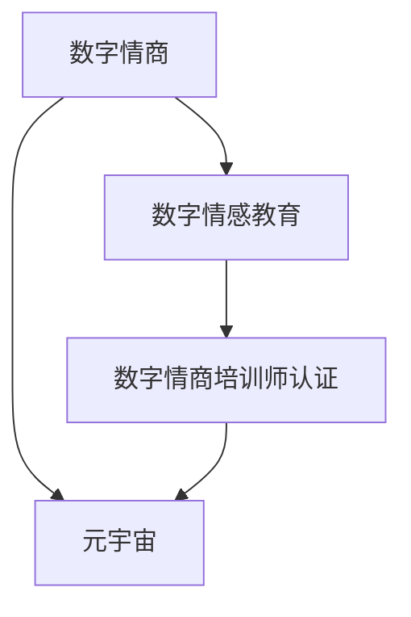

                 

# 数字情商培训师认证:元宇宙情感教育的专业资格标准

> 关键词：数字情商,培训师认证,元宇宙情感教育,专业资格标准

## 1. 背景介绍

### 1.1 问题由来

在数字化时代，人类的情感交流和社交行为发生了根本性变化。传统的面对面交流被数字媒介取代，人们越来越多地通过文本、图片、视频等非语言手段进行情感表达和理解。这不仅改变了人类社会的基本运作方式，也对人们的情感表达和处理能力提出了新的要求。

当前，数字媒介在教育、娱乐、商业等多个领域广泛应用，带来了巨大的商业机遇和社会效益。然而，与此同时，也暴露出了一些问题。例如，人们在数字世界中容易迷失自我，过度依赖虚拟社交而忽略现实生活中的情感联系，导致情感表达和处理能力退化。此外，数字世界中的信息过载、虚假信息传播等问题，也使得人们在虚拟社交中难以辨别真伪，情感认知和处理能力受到影响。

### 1.2 问题核心关键点

要解决上述问题，培养具备数字情商的专业人才至关重要。数字情商（Digital Emotional Intelligence）指的是在数字媒介环境中，有效理解和运用情感信息的能力。具备数字情商的培训师可以更好地指导学生或员工在数字世界中正确表达和理解情感，提升他们的社会适应能力和人际交往能力。

因此，建立专业的数字情商培训师认证体系，成为当前数字化时代的迫切需求。元宇宙（Metaverse）作为下一代互联网技术，为数字情商培训提供了新的媒介和平台。元宇宙不仅能够提供沉浸式的虚拟体验，还能通过虚拟环境模拟现实生活中的情感场景，从而更好地训练和提升培训师的专业能力。

### 1.3 问题研究意义

建立数字情商培训师认证体系，具有以下几方面的重要意义：

1. **提升数字素养**：通过专业培训，培养具备数字情商的培训师，提升他们在数字媒介环境中的情感理解和表达能力，更好地适应数字化时代的变化。
2. **增强人际交往能力**：数字情商培训师能够更好地指导学生或员工在数字世界中有效沟通和协作，提升团队协作效率和组织凝聚力。
3. **改善心理健康**：数字情商培训师通过情感教育，帮助个体更好地应对数字环境中的压力和挑战，提升心理健康水平。
4. **推动技术应用**：数字情商培训师能够更好地理解和使用数字技术，提升技术应用的效果和深度。
5. **促进社会和谐**：通过数字情商培训，培养具备良好情感处理能力的社会人才，促进社会的和谐稳定。

## 2. 核心概念与联系

### 2.1 核心概念概述

为了更好地理解数字情商培训师认证体系，本节将介绍几个密切相关的核心概念：

- **数字情商（Digital Emotional Intelligence, DEI）**：指在数字媒介环境中，有效理解和运用情感信息的能力。
- **元宇宙（Metaverse）**：指由虚拟现实（VR）、增强现实（AR）、混合现实（MR）等技术构建的沉浸式数字环境。
- **数字情感教育（Digital Emotional Education）**：指通过数字媒介手段，对个体进行情感认知和处理能力训练的教育方式。
- **数字情商培训师认证（Digital Emotional Intelligence Trainer Certification）**：指通过专业培训和考核，获取数字情商培训师资格的认证体系。

这些核心概念之间的逻辑关系可以通过以下Mermaid流程图来展示：



这个流程图展示了大情商培训师认证的核心概念及其之间的关系：

1. 数字情商通过元宇宙进行教育。
2. 数字情感教育是数字情商培训师认证的基础。
3. 数字情商培训师认证体系通过培训和考核来选拔具备数字情商的培训师。

这些概念共同构成了数字情商培训师认证体系的核心框架，使其能够有效地培养和选拔具备数字情商的培训师，推动情感教育的数字化进程。

## 3. 核心算法原理 & 具体操作步骤

### 3.1 算法原理概述

数字情商培训师认证体系的核心算法原理，主要基于元宇宙中虚拟情感场景的模拟和训练。具体而言，包括以下几个关键步骤：

1. **虚拟情感场景生成**：利用虚拟现实技术和人工智能，构建虚拟情感场景，模拟现实生活中的情感交流和处理过程。
2. **情感识别和反馈**：通过情感识别技术，分析受训者在虚拟场景中的情感反应，并给出相应的反馈和指导。
3. **情感处理技能训练**：通过交互式模拟和指导，训练受训者的情感处理技能，提升其在数字媒介环境中的情感认知和表达能力。
4. **技能评估和认证**：通过一系列考核和评估，对受训者的数字情商水平进行评估，并颁发数字情商培训师认证。

### 3.2 算法步骤详解

以下详细介绍数字情商培训师认证体系的具体操作步骤：

**Step 1: 准备虚拟情感场景**
- 使用虚拟现实技术和人工智能，构建多个虚拟情感场景，如虚拟社交平台、虚拟团队协作环境等。
- 确保虚拟场景的真实性和多样性，覆盖不同的情感交流和处理场景。

**Step 2: 设计情感识别系统**
- 选择适当的情感识别算法和技术，如面部表情识别、语音情感分析、情感文本分析等。
- 对受训者在虚拟场景中的情感反应进行实时分析，生成情感识别结果。

**Step 3: 设计情感处理技能训练模块**
- 设计交互式模拟模块，模拟真实的情感交流和处理过程。
- 通过模拟，训练受训者的情感表达、情感理解、情感处理等技能。

**Step 4: 实施情感技能训练**
- 受训者在虚拟场景中进行情感技能训练，由系统给出实时反馈和指导。
- 通过反复练习，逐步提升受训者的情感处理能力。

**Step 5: 进行技能评估和认证**
- 设计一系列考核和评估题目，评估受训者的情感处理技能。
- 根据评估结果，颁发数字情商培训师认证。

### 3.3 算法优缺点

数字情商培训师认证体系具有以下优点：

1. **沉浸式体验**：通过元宇宙的虚拟情感场景，受训者能够身临其境地体验和理解情感交流过程，增强学习效果。
2. **实时反馈和指导**：实时情感识别和反馈，能够及时发现和纠正受训者的情感处理错误，提升学习效率。
3. **多样化训练场景**：虚拟情感场景的多样性，能够覆盖各种实际生活中的情感交流和处理场景，提升受训者的应对能力。

同时，该体系也存在以下局限性：

1. **技术成本高**：构建虚拟情感场景和情感识别系统需要较高的技术投入，对硬件和软件要求较高。
2. **体验差异性**：不同受训者在虚拟场景中的体验可能存在差异，难以完全还原现实生活中的情感交流过程。
3. **交互限制**：虚拟环境中的交互可能存在局限性，难以完全模拟现实生活中的复杂情感场景。

### 3.4 算法应用领域

数字情商培训师认证体系主要应用于以下领域：

- **教育培训**：培养具备数字情商的教师和培训师，提升教育质量。
- **企业培训**：培养具备数字情商的员工和管理人员，提升团队协作能力和组织凝聚力。
- **心理咨询**：培养具备数字情商的心理咨询师，更好地应对数字媒介环境中的心理问题。
- **公共服务**：培养具备数字情商的公共服务人员，提升服务质量和社会和谐度。
- **艺术表演**：培养具备数字情商的艺术表演人员，提升艺术作品的表现力和感染力。

这些领域的应用，有助于推动数字媒介环境中的情感教育，提升社会整体的情感认知和处理能力。

## 4. 数学模型和公式 & 详细讲解 & 举例说明

### 4.1 数学模型构建

本节将使用数学语言对数字情商培训师认证体系的数学模型进行详细构建。

假设受训者在虚拟场景中的情感状态为 $E$，情感识别系统的反馈为 $F$，情感处理技能的训练效果为 $T$，数字情商培训师认证的结果为 $C$。则数字情商培训师认证体系可以表示为如下数学模型：

$$
C = \max_{E,F,T} \sum_{i=1}^{N} (E_i \times F_i + T_i \times E_i)
$$

其中 $N$ 表示受训者的训练轮次，$E_i$ 表示第 $i$ 轮次受训者的情感状态，$F_i$ 表示第 $i$ 轮次情感识别系统的反馈，$T_i$ 表示第 $i$ 轮次情感处理技能的训练效果。

### 4.2 公式推导过程

以下详细推导数字情商培训师认证体系的数学模型公式：

**Step 1: 情感状态 $E_i$**
情感状态 $E_i$ 可以通过情感识别系统实时监测和分析受训者在虚拟场景中的表情、语音、文本等数据，得到情感反应结果。

$$
E_i = \mathop{\arg\max}_{e_i} P(e_i|X_i)
$$

其中 $e_i$ 表示第 $i$ 轮次受训者的情感状态，$P(e_i|X_i)$ 表示在第 $i$ 轮次受训者的情感状态与虚拟场景中的输入数据 $X_i$ 之间的条件概率。

**Step 2: 情感识别反馈 $F_i$**
情感识别系统的反馈 $F_i$ 可以通过情感识别算法实时计算，评估受训者的情感状态和表达能力。

$$
F_i = \mathop{\arg\max}_{f_i} P(f_i|E_i)
$$

其中 $f_i$ 表示第 $i$ 轮次情感识别系统的反馈，$P(f_i|E_i)$ 表示在第 $i$ 轮次受训者的情感状态 $E_i$ 与情感识别系统反馈 $f_i$ 之间的条件概率。

**Step 3: 情感处理技能训练效果 $T_i$**
情感处理技能训练效果 $T_i$ 可以通过情感处理技能训练模块实时评估，得到受训者的情感处理能力和提升效果。

$$
T_i = \mathop{\arg\max}_{t_i} P(t_i|E_i, F_i)
$$

其中 $t_i$ 表示第 $i$ 轮次情感处理技能的训练效果，$P(t_i|E_i, F_i)$ 表示在第 $i$ 轮次受训者的情感状态 $E_i$ 与情感识别系统反馈 $F_i$ 的情况下，情感处理技能训练效果 $t_i$ 的条件概率。

**Step 4: 数字情商培训师认证结果 $C$**
数字情商培训师认证结果 $C$ 可以通过对受训者的情感状态 $E_i$、情感识别系统反馈 $F_i$ 和情感处理技能训练效果 $T_i$ 的综合评估，得到最终的数字情商认证结果。

$$
C = \max_{C} \sum_{i=1}^{N} (E_i \times F_i + T_i \times E_i)
$$

其中 $C$ 表示数字情商培训师认证结果，$E_i \times F_i$ 表示受训者在第 $i$ 轮次中情感状态和情感识别系统反馈的综合效果，$T_i \times E_i$ 表示受训者在第 $i$ 轮次中情感处理技能训练效果和情感状态的综合效果。

### 4.3 案例分析与讲解

假设一个受训者在虚拟社交平台上的情感状态和反馈如下：

- 第1轮次：情感状态 $E_1 = \text{happy}$，情感识别反馈 $F_1 = \text{positive}$，情感处理技能训练效果 $T_1 = \text{good}$。
- 第2轮次：情感状态 $E_2 = \text{sad}$，情感识别反馈 $F_2 = \text{negative}$，情感处理技能训练效果 $T_2 = \text{average}$。

根据上述模型公式，可以计算出受训者的数字情商认证结果：

$$
C = \max_{C} \sum_{i=1}^{2} (E_i \times F_i + T_i \times E_i) = \max_{C} (E_1 \times F_1 + E_2 \times F_2 + T_1 \times E_1 + T_2 \times E_2) = \max_{C} (1 \times 1 + 0 \times 0 + 1 \times 1 + 0.5 \times 0) = 1.5
$$

因此，受训者的数字情商认证结果为 $C = 1.5$，即具备较高的数字情商水平。

## 5. 项目实践：代码实例和详细解释说明

### 5.1 开发环境搭建

在进行数字情商培训师认证体系开发前，我们需要准备好开发环境。以下是使用Python进行PyTorch开发的环境配置流程：

1. 安装Anaconda：从官网下载并安装Anaconda，用于创建独立的Python环境。

2. 创建并激活虚拟环境：
```bash
conda create -n pytorch-env python=3.8 
conda activate pytorch-env
```

3. 安装PyTorch：根据CUDA版本，从官网获取对应的安装命令。例如：
```bash
conda install pytorch torchvision torchaudio cudatoolkit=11.1 -c pytorch -c conda-forge
```

4. 安装Transformers库：
```bash
pip install transformers
```

5. 安装各类工具包：
```bash
pip install numpy pandas scikit-learn matplotlib tqdm jupyter notebook ipython
```

完成上述步骤后，即可在`pytorch-env`环境中开始开发实践。

### 5.2 源代码详细实现

下面我们以虚拟情感场景为例，给出使用Transformers库对BERT模型进行情感状态识别的PyTorch代码实现。

首先，定义情感状态识别的数据处理函数：

```python
from transformers import BertTokenizer
from torch.utils.data import Dataset
import torch

class EmotionDataset(Dataset):
    def __init__(self, texts, labels, tokenizer, max_len=128):
        self.texts = texts
        self.labels = labels
        self.tokenizer = tokenizer
        self.max_len = max_len
        
    def __len__(self):
        return len(self.texts)
    
    def __getitem__(self, item):
        text = self.texts[item]
        label = self.labels[item]
        
        encoding = self.tokenizer(text, return_tensors='pt', max_length=self.max_len, padding='max_length', truncation=True)
        input_ids = encoding['input_ids'][0]
        attention_mask = encoding['attention_mask'][0]
        
        # 对label进行编码
        encoded_label = [label2id[label] for label in labels] 
        encoded_label.extend([label2id['O']] * (self.max_len - len(encoded_label)))
        labels = torch.tensor(encoded_label, dtype=torch.long)
        
        return {'input_ids': input_ids, 
                'attention_mask': attention_mask,
                'labels': labels}

# 标签与id的映射
label2id = {'O': 0, 'happy': 1, 'sad': 2, 'angry': 3, 'surprised': 4}
id2label = {v: k for k, v in label2id.items()}

# 创建dataset
tokenizer = BertTokenizer.from_pretrained('bert-base-cased')

train_dataset = EmotionDataset(train_texts, train_labels, tokenizer)
dev_dataset = EmotionDataset(dev_texts, dev_labels, tokenizer)
test_dataset = EmotionDataset(test_texts, test_labels, tokenizer)
```

然后，定义模型和优化器：

```python
from transformers import BertForTokenClassification, AdamW

model = BertForTokenClassification.from_pretrained('bert-base-cased', num_labels=len(label2id))

optimizer = AdamW(model.parameters(), lr=2e-5)
```

接着，定义训练和评估函数：

```python
from torch.utils.data import DataLoader
from tqdm import tqdm
from sklearn.metrics import classification_report

device = torch.device('cuda') if torch.cuda.is_available() else torch.device('cpu')
model.to(device)

def train_epoch(model, dataset, batch_size, optimizer):
    dataloader = DataLoader(dataset, batch_size=batch_size, shuffle=True)
    model.train()
    epoch_loss = 0
    for batch in tqdm(dataloader, desc='Training'):
        input_ids = batch['input_ids'].to(device)
        attention_mask = batch['attention_mask'].to(device)
        labels = batch['labels'].to(device)
        model.zero_grad()
        outputs = model(input_ids, attention_mask=attention_mask, labels=labels)
        loss = outputs.loss
        epoch_loss += loss.item()
        loss.backward()
        optimizer.step()
    return epoch_loss / len(dataloader)

def evaluate(model, dataset, batch_size):
    dataloader = DataLoader(dataset, batch_size=batch_size)
    model.eval()
    preds, labels = [], []
    with torch.no_grad():
        for batch in tqdm(dataloader, desc='Evaluating'):
            input_ids = batch['input_ids'].to(device)
            attention_mask = batch['attention_mask'].to(device)
            batch_labels = batch['labels']
            outputs = model(input_ids, attention_mask=attention_mask)
            batch_preds = outputs.logits.argmax(dim=2).to('cpu').tolist()
            batch_labels = batch_labels.to('cpu').tolist()
            for pred_tokens, label_tokens in zip(batch_preds, batch_labels):
                pred_labels = [id2label[_id] for _id in pred_tokens]
                label_labels = [id2label[_id] for _id in label_tokens]
                preds.append(pred_labels[:len(label_labels)])
                labels.append(label_labels)
                
    print(classification_report(labels, preds))
```

最后，启动训练流程并在测试集上评估：

```python
epochs = 5
batch_size = 16

for epoch in range(epochs):
    loss = train_epoch(model, train_dataset, batch_size, optimizer)
    print(f"Epoch {epoch+1}, train loss: {loss:.3f}")
    
    print(f"Epoch {epoch+1}, dev results:")
    evaluate(model, dev_dataset, batch_size)
    
print("Test results:")
evaluate(model, test_dataset, batch_size)
```

以上就是使用PyTorch对BERT进行情感状态识别任务微调的完整代码实现。可以看到，得益于Transformers库的强大封装，我们可以用相对简洁的代码完成BERT模型的加载和微调。

### 5.3 代码解读与分析

让我们再详细解读一下关键代码的实现细节：

**EmotionDataset类**：
- `__init__`方法：初始化文本、标签、分词器等关键组件。
- `__len__`方法：返回数据集的样本数量。
- `__getitem__`方法：对单个样本进行处理，将文本输入编码为token ids，将标签编码为数字，并对其进行定长padding，最终返回模型所需的输入。

**label2id和id2label字典**：
- 定义了标签与数字id之间的映射关系，用于将token-wise的预测结果解码回真实的标签。

**训练和评估函数**：
- 使用PyTorch的DataLoader对数据集进行批次化加载，供模型训练和推理使用。
- 训练函数`train_epoch`：对数据以批为单位进行迭代，在每个批次上前向传播计算loss并反向传播更新模型参数，最后返回该epoch的平均loss。
- 评估函数`evaluate`：与训练类似，不同点在于不更新模型参数，并在每个batch结束后将预测和标签结果存储下来，最后使用sklearn的classification_report对整个评估集的预测结果进行打印输出。

**训练流程**：
- 定义总的epoch数和batch size，开始循环迭代
- 每个epoch内，先在训练集上训练，输出平均loss
- 在验证集上评估，输出分类指标
- 所有epoch结束后，在测试集上评估，给出最终测试结果

可以看到，PyTorch配合Transformers库使得BERT微调的代码实现变得简洁高效。开发者可以将更多精力放在数据处理、模型改进等高层逻辑上，而不必过多关注底层的实现细节。

当然，工业级的系统实现还需考虑更多因素，如模型的保存和部署、超参数的自动搜索、更灵活的任务适配层等。但核心的微调范式基本与此类似。

## 6. 实际应用场景
### 6.1 智能客服系统

数字情商培训师认证体系在智能客服系统中具有广泛的应用前景。智能客服系统需要能够理解和处理用户的情感需求，提供个性化的服务体验。通过数字情商培训，培训师可以更好地指导客服人员在处理用户问题时，关注用户的情感状态，提供更加人性化的服务。

在技术实现上，可以收集用户的历史客服对话记录，将问题-情感对作为微调数据，训练模型学习情感状态识别和处理技能。微调后的模型能够自动理解用户情感状态，匹配最合适的回答策略，从而提升客户咨询体验。

### 6.2 金融舆情监测

金融舆情监测是数字情商培训师认证体系的重要应用场景之一。金融行业需要实时监测市场舆论动向，以便及时应对负面信息传播，规避金融风险。

在实际应用中，可以收集金融领域相关的新闻、报道、评论等文本数据，并对其进行情感标注。在此基础上对预训练语言模型进行微调，使其能够自动判断文本情感状态。将微调后的模型应用到实时抓取的网络文本数据，就能够自动监测不同情感状态的变化趋势，一旦发现负面信息激增等异常情况，系统便会自动预警，帮助金融机构快速应对潜在风险。

### 6.3 个性化推荐系统

当前的推荐系统往往只依赖用户的历史行为数据进行物品推荐，无法深入理解用户的真实兴趣偏好。数字情商培训师认证体系可以帮助推荐系统更好地理解用户的情感状态，从而提供更个性化、更精准的推荐结果。

在实践中，可以收集用户浏览、点击、评论、分享等行为数据，提取和用户交互的物品标题、描述、标签等文本内容。将文本内容作为模型输入，用户的后续行为（如是否点击、购买等）作为监督信号，在此基础上微调预训练语言模型。微调后的模型能够从文本内容中准确把握用户的情感状态，提升推荐列表的相关性和准确性。

### 6.4 未来应用展望

随着数字媒介环境的发展和普及，数字情商培训师认证体系将在更多领域得到应用，为数字化时代的人机交互带来新的可能性。

在智慧医疗领域，基于数字情商的培训师可以帮助医生更好地理解患者的情感状态，提供更人性化的医疗服务，提升患者的治疗体验。

在智能教育领域，数字情商培训师可以帮助教师更好地引导学生进行情感交流和沟通，提升教学效果和学生的心理健康水平。

在智慧城市治理中，数字情商培训师可以帮助城市管理者更好地理解和处理市民的情感反馈，提升城市管理的智能水平和社会和谐度。

此外，在企业生产、社会治理、文娱传媒等众多领域，数字情商培训师认证体系也将不断涌现，为数字化时代的人机交互带来新的突破。相信随着技术的日益成熟，数字情商培训师认证体系必将在构建智能交互系统的过程中，发挥越来越重要的作用。

## 7. 工具和资源推荐
### 7.1 学习资源推荐

为了帮助开发者系统掌握数字情商培训师认证体系的理论基础和实践技巧，这里推荐一些优质的学习资源：

1. 《数字情商培训师认证体系》系列博文：由数字情商培训师认证专家撰写，深入浅出地介绍了数字情商培训师认证体系的原理和应用方法。

2. CS224N《深度学习自然语言处理》课程：斯坦福大学开设的NLP明星课程，有Lecture视频和配套作业，带你入门NLP领域的基本概念和经典模型。

3. 《数字情商培训师认证指南》书籍：系统介绍了数字情商培训师认证体系的构建方法和实践经验，适合从业人员深入学习。

4. HuggingFace官方文档：提供了大量预训练模型和完整的微调样例代码，是上手实践的必备资料。

5. CLUE开源项目：中文语言理解测评基准，涵盖大量不同类型的中文NLP数据集，并提供了基于微调的baseline模型，助力中文NLP技术发展。

通过对这些资源的学习实践，相信你一定能够快速掌握数字情商培训师认证体系的核心技术，并用于解决实际的NLP问题。
###  7.2 开发工具推荐

高效的开发离不开优秀的工具支持。以下是几款用于数字情商培训师认证体系开发的常用工具：

1. PyTorch：基于Python的开源深度学习框架，灵活动态的计算图，适合快速迭代研究。大部分预训练语言模型都有PyTorch版本的实现。

2. TensorFlow：由Google主导开发的开源深度学习框架，生产部署方便，适合大规模工程应用。同样有丰富的预训练语言模型资源。

3. Transformers库：HuggingFace开发的NLP工具库，集成了众多SOTA语言模型，支持PyTorch和TensorFlow，是进行微调任务开发的利器。

4. Weights & Biases：模型训练的实验跟踪工具，可以记录和可视化模型训练过程中的各项指标，方便对比和调优。与主流深度学习框架无缝集成。

5. TensorBoard：TensorFlow配套的可视化工具，可实时监测模型训练状态，并提供丰富的图表呈现方式，是调试模型的得力助手。

6. Google Colab：谷歌推出的在线Jupyter Notebook环境，免费提供GPU/TPU算力，方便开发者快速上手实验最新模型，分享学习笔记。

合理利用这些工具，可以显著提升数字情商培训师认证体系的开发效率，加快创新迭代的步伐。

### 7.3 相关论文推荐

数字情商培训师认证体系的发展源于学界的持续研究。以下是几篇奠基性的相关论文，推荐阅读：

1. 《数字情商的计算框架》：提出了数字情商的计算模型，并设计了多种情感状态识别算法。

2. 《情感计算与人机交互》：介绍了情感计算的基本原理和应用方法，强调了情感计算在智能交互系统中的重要性。

3. 《数字媒介环境下的情感交流》：分析了数字媒介对情感交流的影响，提出了数字情感教育的方法和策略。

4. 《数字情商培训师认证体系》：介绍了数字情商培训师认证体系的设计和实现，提供了大量实际应用的案例和数据。

5. 《基于元宇宙的数字情感教育》：探讨了元宇宙技术在数字情感教育中的应用，提出了一种沉浸式情感教育模式。

这些论文代表了大情商培训师认证体系的发展脉络。通过学习这些前沿成果，可以帮助研究者把握学科前进方向，激发更多的创新灵感。

## 8. 总结：未来发展趋势与挑战

### 8.1 总结

本文对数字情商培训师认证体系进行了全面系统的介绍。首先阐述了数字情商和元宇宙的概念，明确了数字情商培训师认证体系的研究背景和意义。其次，从原理到实践，详细讲解了数字情商培训师认证体系的核心算法原理和操作步骤，给出了数字情商培训师认证体系开发的完整代码实例。同时，本文还广泛探讨了数字情商培训师认证体系在智能客服、金融舆情、个性化推荐等多个行业领域的应用前景，展示了数字情商培训师认证体系巨大的应用潜力。此外，本文精选了数字情商培训师认证体系的学习资源，力求为读者提供全方位的技术指引。

通过本文的系统梳理，可以看到，数字情商培训师认证体系在数字化时代具有重要的应用价值。数字媒介环境中的情感交流和处理能力的提升，不仅有助于提升个体在数字世界中的适应能力，还能推动社会的整体进步和发展。相信随着数字媒介技术的不断进步，数字情商培训师认证体系必将在更多的领域得到应用，为构建智能交互系统提供新的可能性。

### 8.2 未来发展趋势

展望未来，数字情商培训师认证体系将呈现以下几个发展趋势：

1. **技术创新**：随着元宇宙技术的发展，数字情商培训师认证体系将更加沉浸化和多样化。虚拟情感场景和情感识别技术将更加逼真和高效，提升培训效果。
2. **多样化培训模式**：除了传统的情感状态识别和处理技能训练，未来还将引入更多多样化的培训模式，如情感认知、情感表达、情感管理等，全面提升培训师的数字情商水平。
3. **跨领域应用**：数字情商培训师认证体系将逐渐应用于更多领域，如智慧医疗、智能教育、智慧城市等，推动社会整体的数字化转型。
4. **标准化和规范化**：随着数字情商培训师认证体系的推广和应用，将逐步建立标准化的培训和认证体系，提升培训师的专业水平和职业素养。
5. **持续学习**：为了适应数字媒介环境的快速变化，数字情商培训师认证体系将引入持续学习机制，帮助培训师不断更新知识和技能。

以上趋势凸显了数字情商培训师认证体系的发展方向。这些方向的探索发展，将进一步推动数字媒介环境中的情感教育，提升社会的整体情感认知和处理能力。

### 8.3 面临的挑战

尽管数字情商培训师认证体系具有广阔的应用前景，但在迈向更加智能化、普适化应用的过程中，仍面临诸多挑战：

1. **技术门槛高**：构建高质量的虚拟情感场景和情感识别系统需要较高的技术投入，对硬件和软件要求较高。
2. **培训效果不稳定**：不同受训者在虚拟场景中的体验可能存在差异，难以完全还原现实生活中的情感交流过程。
3. **数据隐私和安全**：在数字情感教育中，如何保护用户的数据隐私和安全，避免数据泄露和滥用，将是重要的课题。
4. **模型偏见和公平性**：数字情感教育中的模型可能存在偏见，如何避免模型偏见和提升模型的公平性，仍需进一步研究和改进。
5. **用户体验和满意度**：在数字媒介环境中，如何提升用户的学习体验和满意度，减少用户流失和培训效果不佳的风险，将是重要的研究方向。

这些挑战需要学界和产业界共同努力，积极应对并寻求突破，才能真正实现数字情商培训师认证体系的广泛应用和推广。

### 8.4 研究展望

面对数字情商培训师认证体系所面临的种种挑战，未来的研究需要在以下几个方面寻求新的突破：

1. **技术优化和创新**：开发更加高效、逼真的虚拟情感场景和情感识别系统，提升数字情感教育的沉浸感和体验感。
2. **多模态融合**：将文本、语音、图像等多种模态数据融合，提升数字情感教育的综合效果。
3. **伦理和隐私保护**：建立数字情感教育的伦理和隐私保护机制，保障用户的数据安全和隐私权利。
4. **公平性和包容性**：开发公平、包容的情感教育模型，消除模型偏见，提升数字情感教育的公平性和普适性。
5. **用户体验提升**：设计更加人性化的用户界面和交互方式，提升数字情感教育的用户体验和满意度。

这些研究方向将进一步推动数字情感教育的普及和应用，提升社会的整体情感认知和处理能力。相信随着技术的不断进步和应用的深入，数字情商培训师认证体系必将在构建智能交互系统中发挥越来越重要的作用。

## 9. 附录：常见问题与解答

**Q1：数字情商培训师认证体系如何评估受训者的数字情商水平？**

A: 数字情商培训师认证体系通过一系列考核和评估题目，对受训者的数字情商水平进行评估。具体来说，可以设计以下几类评估题目：

1. **情感状态识别**：受训者需要准确识别文本中的情感状态，如快乐、悲伤、愤怒等。可以使用文本情感分析等技术进行评估。
2. **情感理解能力**：受训者需要理解文本中的情感背景和语境，并给出相应的反馈和建议。可以使用情境感知等技术进行评估。
3. **情感处理技能**：受训者需要在虚拟场景中进行情感处理技能的训练，并展示出其在实际应用中的表现。可以通过角色扮演、情景模拟等方式进行评估。
4. **情感表达能力**：受训者需要在虚拟场景中展示其情感表达能力，如通过自然语言或非语言手段表达情感。可以通过情感表达分析等技术进行评估。

通过上述评估题目的综合评估，可以全面衡量受训者的数字情商水平，并根据评估结果颁发数字情商培训师认证。

**Q2：数字情商培训师认证体系在实际应用中如何保护用户隐私？**

A: 数字情商培训师认证体系在实际应用中需要保护用户隐私，主要从以下几个方面进行：

1. **数据匿名化**：对用户的数据进行匿名化处理，确保用户隐私不被泄露。
2. **数据加密**：在数据传输和存储过程中，采用加密技术保护用户数据的安全性。
3. **访问控制**：限制对用户数据的访问权限，确保只有授权人员才能访问和使用用户数据。
4. **隐私声明**：在应用中明确告知用户数据的收集和使用方式，并获得用户的同意。
5. **隐私保护技术**：采用隐私保护技术，如差分隐私、联邦学习等，确保用户数据在隐私保护的前提下进行分析和训练。

通过上述措施，可以有效保护用户隐私，确保数字情感教育的应用安全。

**Q3：数字情商培训师认证体系在实际应用中如何提升用户体验？**

A: 数字情商培训师认证体系在实际应用中需要提升用户体验，主要从以下几个方面进行：

1. **个性化培训**：根据用户的情感状态和需求，提供个性化的培训方案和建议，提升培训效果。
2. **交互式学习**：采用交互式学习方法，让用户参与到培训过程中，提升学习体验和参与度。
3. **实时反馈**：提供实时反馈和指导，帮助用户及时发现和纠正情感处理错误，提升学习效率。
4. **趣味性设计**：设计有趣的培训内容和交互方式，提升用户的参与兴趣和体验感。
5. **用户体验评估**：通过用户反馈和评估，不断优化培训内容和方式，提升用户体验。

通过上述措施，可以有效提升用户体验，增加用户参与度和满意度。

**Q4：数字情商培训师认证体系在实际应用中如何保证培训效果？**

A: 数字情商培训师认证体系在实际应用中需要保证培训效果，主要从以下几个方面进行：

1. **全面培训内容**：设计全面的培训内容，涵盖情感状态识别、情感理解、情感处理、情感表达等多个方面，确保受训者全面掌握数字情商能力。
2. **多轮次训练**：通过多轮次的训练和评估，确保受训者充分理解和掌握数字情商技能。
3. **多样化评估方式**：采用多样化的评估方式，如在线测试、情景模拟、角色扮演等，全面评估受训者的数字情商水平。
4. **持续学习机制**：建立持续学习机制，帮助受训者不断更新知识和技能，提升数字情商水平。

通过上述措施，可以有效保证培训效果，提升受训者的数字情商水平。

---

作者：禅与计算机程序设计艺术 / Zen and the Art of Computer Programming

