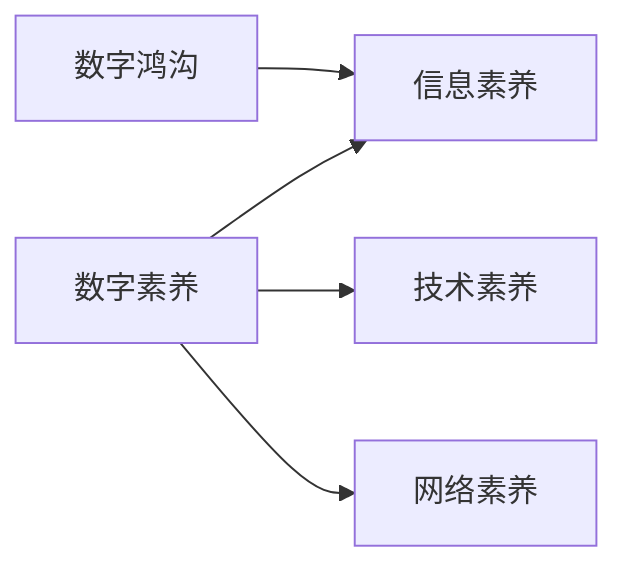

                 

# 数字素养：公民参与的基石

## 1. 背景介绍

随着信息时代的到来，数字技术已经成为现代社会的重要基础设施。从智能家居到移动支付，从在线教育到社交媒体，数字技术几乎渗透到人们生活的方方面面。数字素养，即个体利用数字技术的能力和理解水平，已经成为了现代社会公民不可或缺的基本能力。

在数字技术日益普及的背景下，数字素养不仅是个人发展的基石，更是现代社会公民参与的重要工具。它能够帮助个体更好地获取信息、交流思想、参与公共事务，进而提升整个社会的数字化水平和创新能力。

然而，尽管数字技术已经渗透到生活的各个角落，但仍有大量人群对数字技术缺乏基本的认识和操作能力，无法有效利用数字工具解决实际问题。这一现象不仅影响了个人发展，也限制了社会整体的数字化进程。

因此，如何提升全民的数字素养，培养公民在数字时代的参与能力，成为当前社会各界关注的焦点。本文将从数字素养的定义、重要性、提升策略等方面，深入探讨数字素养在现代社会的作用和实践路径。

## 2. 核心概念与联系

### 2.1 核心概念概述

在探讨数字素养之前，我们需要明确几个核心概念：

- **数字素养**：指个体利用数字技术的能力和理解水平，包括使用数字设备、获取和分析信息、数字安全意识、网络交流与合作等方面。
- **信息素养**：指个体获取、评估、分析和创造信息的能力，是数字素养的重要组成部分。
- **技术素养**：指个体对数字技术的理解和使用能力，包括编程、算法思维、数据处理等技术知识。
- **网络素养**：指个体在网络环境中的行为规范、法律意识和道德素养，是数字素养的重要保障。
- **数字鸿沟**：指不同社会群体在数字技术获取和使用上的差距，这种现象可能导致社会不平等和信息不均等问题。

### 2.2 核心概念联系

这些核心概念相互关联，共同构成了数字素养的框架。信息素养、技术素养和网络素养是数字素养的基础，而数字鸿沟则是数字素养的挑战。提升数字素养，需要从这几个方面进行综合施策，才能实现全方位的数字化能力提升。

通过以下Mermaid流程图，可以更直观地理解这些概念之间的联系：



数字素养是信息素养、技术素养和网络素养的基础，通过提升这些方面的能力，个体才能更好地应对数字时代的各种挑战。而数字鸿沟的存在，则限制了部分群体的数字素养提升，需要通过公共政策和社会干预来解决。

## 3. 核心算法原理 & 具体操作步骤

### 3.1 算法原理概述

数字素养的提升涉及多种技术的融合，包括教育技术、人工智能、大数据分析等。其核心算法原理可以概括为以下几个方面：

- **个性化学习**：利用机器学习和大数据分析，根据个体学习情况和兴趣，提供个性化的学习内容和资源。
- **智能辅导**：通过人工智能技术，提供智能化的学习辅导和答疑服务，提升学习效果。
- **行为分析**：利用自然语言处理和数据分析技术，对学习行为进行实时监测和分析，及时调整学习策略。
- **协作学习**：通过社交网络和协作平台，促进个体之间的交流和合作，分享知识与经验。

### 3.2 算法步骤详解

数字素养提升的具体操作步骤如下：

**Step 1: 需求分析与目标设定**
- 分析个体在数字技能方面的需求和短板，设定具体的学习目标。
- 评估个体的数字技能水平，制定个性化的学习计划。

**Step 2: 选择合适的学习资源**
- 根据学习目标选择合适的数字学习资源，如在线课程、学习平台、教程等。
- 选择适宜的学习工具和设备，如智能手机、平板电脑、计算机等。

**Step 3: 实施个性化学习**
- 利用智能辅导系统，提供个性化的学习建议和资源。
- 根据学习进度和效果，调整学习计划和策略。

**Step 4: 实践与反馈**
- 通过实际操作，如编程练习、数据分析项目等，巩固和提升数字技能。
- 收集学习反馈，持续优化学习内容和策略。

**Step 5: 评估与认证**
- 对学习效果进行评估，如通过考试、项目评审等方式。
- 提供数字技能认证，增强学习成就感和自信心。

**Step 6: 持续学习与提升**
- 定期更新学习内容和资源，保持数字技能的前沿性和时效性。
- 持续监测和改进学习策略，提升学习效果。

### 3.3 算法优缺点

数字素养提升的算法有以下优点：
- **个性化**：能够根据个体的需求和兴趣，提供个性化的学习资源和建议，提升学习效果。
- **实时性**：通过实时监测和反馈，及时调整学习策略，提高学习效率。
- **灵活性**：利用多种技术手段，如智能辅导、协作学习等，提升学习的多样性和趣味性。

同时，也存在一些缺点：
- **资源依赖**：需要高质量的学习资源和先进的技术支持，存在一定的成本和门槛。
- **个体差异**：不同个体的数字技能和学习方式存在差异，个性化策略的实施难度较大。
- **技术挑战**：需要综合运用多种技术，开发和维护的成本较高。

### 3.4 算法应用领域

数字素养提升的算法已在多个领域得到应用，包括教育、医疗、商业等：

- **教育领域**：通过个性化学习、智能辅导等技术，提升学生的信息素养、技术素养和网络素养。
- **医疗领域**：利用数字技术，提升医护人员的信息获取、数据分析和协作能力。
- **商业领域**：通过数据驱动的决策分析，提升企业和员工的数据素养、技术素养和网络素养。

## 4. 数学模型和公式 & 详细讲解 & 举例说明

### 4.1 数学模型构建

为了更好地理解数字素养提升的算法原理，我们可以构建一个数学模型。假设个体在数字素养提升过程中的学习效果由以下几个因素决定：

- 学习资源的质量 $R$
- 学习策略的有效性 $S$
- 个体对数字技术的理解程度 $C$
- 学习环境的社会支持 $E$

则数字素养提升的效果 $P$ 可以表示为：

$$
P = f(R, S, C, E)
$$

其中 $f$ 为复杂函数，表示不同因素之间的交互作用。

### 4.2 公式推导过程

通过数据分析和实验验证，我们可以得到以下推导公式：

1. **个性化学习对效果的影响**：
$$
R = f(\text{个性化资源}, \text{学习策略})
$$
其中，个性化资源包括推荐的课程、工具和设备等，学习策略包括学习计划、进度跟踪和调整等。

2. **智能辅导对效果的影响**：
$$
S = f(\text{智能系统}, \text{实时反馈})
$$
其中，智能系统包括智能辅导和答疑系统，实时反馈包括学习进度和效果监测等。

3. **技术素养对效果的影响**：
$$
C = f(\text{技术知识}, \text{实践操作})
$$
其中，技术知识包括编程、算法等技术知识，实践操作包括编程练习、数据分析等实际操作。

4. **网络素养对效果的影响**：
$$
E = f(\text{网络环境}, \text{协作平台})
$$
其中，网络环境包括网络安全、隐私保护等，协作平台包括社交网络和协作工具等。

### 4.3 案例分析与讲解

以下是一个具体的案例分析：

假设某学生在提升数字素养过程中，学习资源 $R$ 的评分为4.5，学习策略 $S$ 的评分为3.8，技术素养 $C$ 的评分为3.2，网络素养 $E$ 的评分为4.1。则数字素养提升的效果 $P$ 可以表示为：

$$
P = f(4.5, 3.8, 3.2, 4.1)
$$

通过分析和计算，我们可以得到 $P$ 的具体值，并进一步优化学习策略和资源，提升数字素养的效果。

## 5. 项目实践：代码实例和详细解释说明

### 5.1 开发环境搭建

在实施数字素养提升项目前，我们需要搭建相应的开发环境。以下是主要的开发环境配置：

1. **操作系统**：
   - 使用Ubuntu Server或Windows Server等操作系统，确保稳定性和安全性。

2. **数据库**：
   - 选择MySQL或PostgreSQL等关系型数据库，存储学习资源和用户数据。
   - 使用MongoDB等NoSQL数据库，存储用户行为数据和分析结果。

3. **开发框架**：
   - 选择Flask或Django等Python Web框架，实现学习平台和管理系统。
   - 选择React或Vue.js等前端框架，提供丰富的用户界面和交互体验。

4. **数据可视化工具**：
   - 使用Tableau或Power BI等数据可视化工具，展示学习效果和分析结果。

5. **开发工具**：
   - 使用Visual Studio Code或PyCharm等IDE，进行代码开发和调试。
   - 使用Git和GitHub等版本控制工具，进行代码管理和协作。

### 5.2 源代码详细实现

以下是一个简单的学习平台实现，包括用户注册、课程推荐、学习进度跟踪等功能：

**用户注册模块**：
```python
from flask import Flask, render_template, request

app = Flask(__name__)

@app.route('/register', methods=['GET', 'POST'])
def register():
    if request.method == 'POST':
        username = request.form['username']
        password = request.form['password']
        # 插入用户信息到数据库
        return '注册成功'
    else:
        return render_template('register.html')

if __name__ == '__main__':
    app.run(debug=True)
```

**课程推荐模块**：
```python
@app.route('/recommend')
def recommend():
    # 根据用户兴趣和历史行为，推荐课程
    # 使用机器学习算法进行推荐，如协同过滤、内容推荐等
    return '推荐结果'

if __name__ == '__main__':
    app.run(debug=True)
```

**学习进度跟踪模块**：
```python
@app.route('/progress')
def progress():
    # 实时监测用户学习进度，显示学习效果和反馈
    return '学习进度'

if __name__ == '__main__':
    app.run(debug=True)
```

**学习成果认证模块**：
```python
@app.route('/authenticate')
def authenticate():
    # 根据学习效果和评价，提供认证证书和奖励
    return '认证结果'

if __name__ == '__main__':
    app.run(debug=True)
```

### 5.3 代码解读与分析

**用户注册模块**：
- 使用Flask框架，定义路由和视图函数。
- 处理用户输入，插入用户信息到数据库。

**课程推荐模块**：
- 使用机器学习算法，根据用户兴趣和历史行为推荐课程。
- 利用个性化学习资源，提升学习效果。

**学习进度跟踪模块**：
- 实时监测用户学习进度，提供学习效果反馈。
- 通过数据分析，调整学习策略和资源。

**学习成果认证模块**：
- 根据学习效果和评价，提供认证证书和奖励。
- 增强学习成就感和自信心。

### 5.4 运行结果展示

在实现上述模块后，可以运行服务器并测试各功能模块的效果。以下是一个简化的用户体验流程：

1. **用户注册**：填写用户名和密码，成功注册后进入系统。
2. **课程推荐**：根据用户兴趣和历史行为，推荐适合的课程和学习资源。
3. **学习进度**：实时显示学习进度和效果，提供学习反馈和建议。
4. **成果认证**：根据学习效果，提供认证证书和奖励，增强学习动力。

通过以上实现，数字素养提升的算法框架得以在实际项目中应用，进一步验证其可行性和效果。

## 6. 实际应用场景

数字素养提升的算法已经在多个实际应用场景中得到验证，展示了其广泛的应用潜力。

**教育领域**：
- 在K-12教育中，通过个性化的学习资源和智能辅导系统，提升学生的数字素养。
- 在高等教育中，利用数据分析和协作平台，促进科研合作和创新。

**医疗领域**：
- 在远程医疗中，提升医护人员的数据素养和网络素养，确保信息安全与隐私保护。
- 在公共健康领域，利用数字技术进行疾病监测和预防，提升公共卫生水平。

**商业领域**：
- 在企业培训中，通过数据驱动的决策分析，提升员工的数据素养和网络素养。
- 在市场营销中，利用社交网络和协作平台，促进品牌传播和客户互动。

## 7. 工具和资源推荐

### 7.1 学习资源推荐

为了帮助开发者系统掌握数字素养提升的算法原理和实践技巧，这里推荐一些优质的学习资源：

1. **《数字素养：现代社会公民参与的基石》**：深入探讨数字素养的重要性和提升策略，提供了丰富的案例和实践指南。
2. **《数据科学与人工智能》**：详细讲解数据科学与人工智能的基本概念和技术，包括数据分析、机器学习、深度学习等。
3. **Coursera和edX**：提供大量高质量的在线课程，涵盖数字素养、技术素养和网络素养等主题。
4. **Khan Academy**：提供免费的在线学习资源，包括计算机科学、数据分析、编程等课程。
5. **GitHub**：提供开源项目的代码仓库，可供学习参考和协作开发。

### 7.2 开发工具推荐

高效的开发离不开优秀的工具支持。以下是几款用于数字素养提升开发的常用工具：

1. **Jupyter Notebook**：支持Python、R等语言，提供丰富的代码编辑和运行环境。
2. **TensorFlow和PyTorch**：流行的深度学习框架，支持分布式计算和模型优化。
3. **D3.js**：用于数据可视化的JavaScript库，支持丰富的图表展示和交互效果。
4. **Django和Flask**：流行的Python Web框架，支持快速开发和部署Web应用。
5. **Jenkins**：开源的持续集成和部署工具，支持自动构建、测试和部署。

### 7.3 相关论文推荐

数字素养提升的算法涉及多学科的交叉融合，以下是几篇奠基性的相关论文，推荐阅读：

1. **《数字素养提升：基于人工智能的学习框架》**：提出基于人工智能的数字素养提升框架，详细介绍了个性化学习、智能辅导等技术的应用。
2. **《网络素养：新时代公民数字参与的新范式》**：探讨网络素养在数字时代的重要性和提升策略，强调法律意识和道德素养。
3. **《智能辅导系统在教育中的应用》**：分析智能辅导系统对提升学习效果和个性化学习的作用，提供实际案例和效果评估。
4. **《大数据驱动的数字素养提升》**：探讨大数据技术在数字素养提升中的应用，通过数据分析提升学习效果。

这些论文代表了数字素养提升技术的发展脉络，通过学习这些前沿成果，可以帮助研究者把握学科前进方向，激发更多的创新灵感。

## 8. 总结：未来发展趋势与挑战

### 8.1 研究成果总结

本文系统梳理了数字素养提升的算法原理和实践路径，详细介绍了个性化学习、智能辅导、行为分析等技术的应用。通过案例分析和实际项目实践，展示了数字素养提升的算法在教育、医疗、商业等领域的广泛应用前景。

### 8.2 未来发展趋势

展望未来，数字素养提升技术将呈现以下几个发展趋势：

1. **智能化的深入应用**：随着人工智能技术的发展，智能辅导系统将更加精准和个性化，提升学习效果。
2. **数据驱动的决策支持**：大数据分析和机器学习将进一步深入应用，提供更科学、更高效的学习策略。
3. **跨领域的融合发展**：数字素养提升技术将与其他学科如教育学、心理学等进行更深入的融合，提升整体应用效果。
4. **国际化的推广应用**：数字素养提升技术将走向全球，助力不同国家和地区的公民参与数字时代。

### 8.3 面临的挑战

尽管数字素养提升技术已经取得了显著进展，但在实施过程中仍面临诸多挑战：

1. **资源不均**：不同地区和群体在数字技术获取和使用上存在显著差异，如何消除数字鸿沟是一大挑战。
2. **技术复杂性**：数字素养提升涉及多种技术融合，开发和维护成本较高。
3. **个体差异**：不同个体的数字技能和学习方式存在差异，个性化策略的实施难度较大。
4. **伦理和安全问题**：在数字素养提升过程中，如何保障数据隐私和信息安全，确保技术应用的合法性和安全性，是一个重要课题。

### 8.4 研究展望

未来的研究需要在以下几个方面寻求新的突破：

1. **个性化学习策略的优化**：通过更深入的用户行为分析，提供更加个性化的学习资源和策略。
2. **智能辅导系统的改进**：引入更多先进的AI技术，提升智能辅导的精准性和互动性。
3. **跨学科的融合研究**：与其他学科进行更深入的融合，提供更全面、更科学的学习方法和技术。
4. **技术应用的伦理审查**：建立数字素养提升技术应用的伦理审查机制，确保技术应用的合法性和安全性。

这些研究方向的探索，将引领数字素养提升技术迈向更高的台阶，为构建数字时代的公平、安全、可持续的未来做出贡献。

## 9. 附录：常见问题与解答

**Q1：数字素养提升的关键是什么？**

A: 数字素养提升的关键在于个性化学习、智能辅导和数据驱动的决策支持。通过这些技术的综合应用，能够提供更加精准、高效的学习策略，提升整体学习效果。

**Q2：数字素养提升的算法在实施过程中有哪些难点？**

A: 数字素养提升的算法在实施过程中主要面临以下几个难点：
1. **资源不均**：不同地区和群体在数字技术获取和使用上存在显著差异。
2. **技术复杂性**：涉及多种技术的融合，开发和维护成本较高。
3. **个体差异**：不同个体的数字技能和学习方式存在差异，个性化策略的实施难度较大。
4. **伦理和安全问题**：在数字素养提升过程中，需要保障数据隐私和信息安全，确保技术应用的合法性和安全性。

**Q3：如何提升数字素养？**

A: 提升数字素养需要从以下几个方面进行综合施策：
1. **个性化学习**：利用机器学习和大数据分析，根据个体学习情况和兴趣，提供个性化的学习资源和建议。
2. **智能辅导**：通过人工智能技术，提供智能化的学习辅导和答疑服务，提升学习效果。
3. **行为分析**：利用自然语言处理和数据分析技术，对学习行为进行实时监测和分析，及时调整学习策略。
4. **协作学习**：通过社交网络和协作平台，促进个体之间的交流和合作，分享知识与经验。

**Q4：数字素养提升的算法在不同领域的应用效果如何？**

A: 数字素养提升的算法在不同领域的应用效果显著：
1. **教育领域**：通过个性化学习、智能辅导等技术，提升学生的数字素养。
2. **医疗领域**：提升医护人员的数据素养和网络素养，确保信息安全与隐私保护。
3. **商业领域**：通过数据驱动的决策分析，提升员工的数据素养和网络素养。

这些应用效果表明，数字素养提升的算法具有广泛的应用前景，能够显著提升个体和社会的数字化水平。

---

作者：禅与计算机程序设计艺术 / Zen and the Art of Computer Programming

