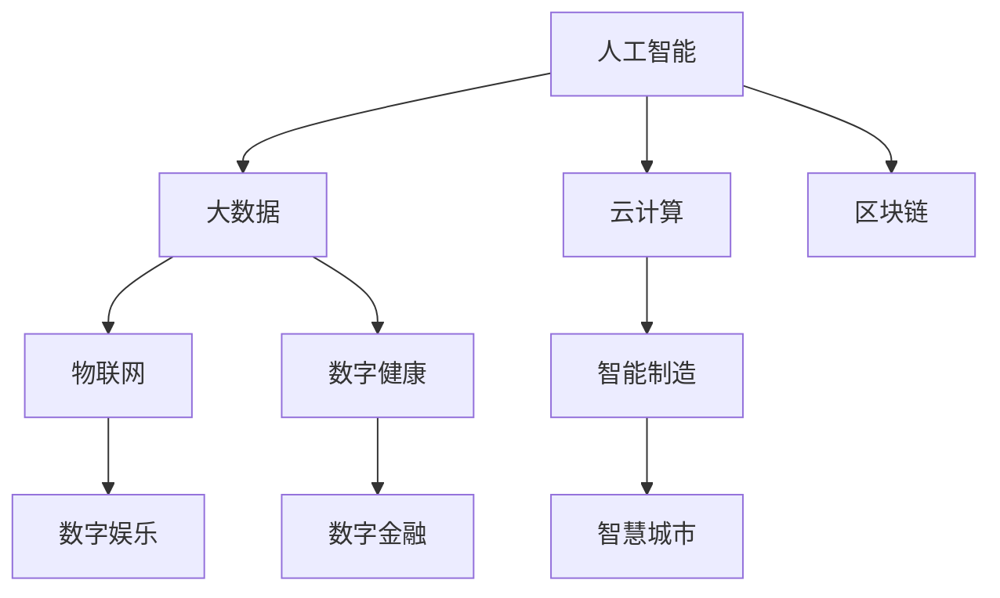

                 

# 数字经济：社会发展的助推器

> 关键词：数字经济, 人工智能, 社会变革, 智能制造, 大数据, 区块链, 云计算

## 1. 背景介绍

### 1.1 问题由来
数字经济是继农业经济、工业经济之后，人类社会经济发展的第三大形态。近年来，随着信息技术的迅猛发展，数字经济正以空前速度重塑全球经济版图，催生出数字货币、数字金融、智慧城市、数字制造等新兴业态，为社会进步注入新的活力。

数字经济的核心驱动力是信息技术的广泛应用，尤其是互联网、物联网、大数据、人工智能等前沿技术，对传统产业进行数字化、网络化、智能化改造，形成了以数字技术和数字产业为支撑的新型经济形态。

在数字经济时代，数据成为新型生产要素，平台化、网络化、普惠化成为新时代经济发展的重要特征。企业和个人都可以在更开放、更灵活的数字平台上进行创新创业，推动经济活力释放，社会福利提升，公平正义实现。

### 1.2 问题核心关键点
数字经济涉及的关键点包括：

1. **数据驱动决策**：通过对大数据的深度分析，企业能够精准把握市场趋势，优化运营策略，提升决策水平。
2. **智能化生产**：借助人工智能技术，实现生产线智能化、自动化，提高生产效率和质量。
3. **平台化运营**：利用云平台、电商平台等数字基础设施，企业可以实现规模化、低成本的运营。
4. **普惠金融**：通过区块链、大数据等技术，实现资金流转的透明化、去中心化，提高金融服务的覆盖面和可及性。
5. **智慧城市**：通过物联网、大数据、人工智能等技术，实现城市治理的精细化、智能化。
6. **新业态涌现**：数字经济催生了智能制造、数字健康、数字娱乐等众多新兴行业，带来新的就业机会和商业模式。

这些关键点共同构成了数字经济的核心要素，推动着社会经济结构的深刻变革，为实现高质量发展提供了新动能。

### 1.3 问题研究意义
研究数字经济及其对社会发展的促进作用，对于把握经济转型的新趋势，指导政策制定和企业战略具有重要意义。理解数字经济的核心技术、商业模式、发展路径，有助于制定适应数字时代的新政策，优化产业结构，培育新的经济增长点。

## 2. 核心概念与联系

### 2.1 核心概念概述

为更好地理解数字经济的原理和应用，本节将介绍几个关键概念：

- **数字经济**：基于信息技术的经济形态，核心特征是数据驱动、平台化运营、普惠金融等。
- **人工智能**：通过模拟人类智能行为，实现机器学习、智能推理、自主决策等功能。
- **大数据**：海量、多样、实时数据，用于数据挖掘、分析、预测等。
- **区块链**：分布式账本技术，实现去中心化、透明化、安全性等。
- **云计算**：通过互联网提供计算资源、软件、服务，支持弹性扩展、按需付费。
- **物联网**：连接人、设备、系统的网络，实现全面感知、互联互通。
- **智能制造**：利用数字技术改造传统制造业，实现智能化、个性化生产。
- **数字健康**：通过数字手段，提供便捷、高效的医疗健康服务。
- **数字娱乐**：利用数字技术，提供沉浸式、互动式的新型娱乐体验。

这些概念之间相互关联，共同构成了数字经济的基础。人工智能、大数据、云计算等技术，为数字经济提供了强大的技术支撑。而物联网、智能制造、数字健康等新业态，则进一步丰富了数字经济的应用场景。

### 2.2 核心概念原理和架构的 Mermaid 流程图



这个流程图展示了核心概念之间的联系：人工智能和大数据是数字经济的技术基础；云计算、物联网、区块链为数字经济提供了技术平台；智能制造、数字健康、数字娱乐等新业态，则为数字经济注入了新的应用场景。

## 3. 核心算法原理 & 具体操作步骤

### 3.1 算法原理概述

数字经济的核心算法主要围绕数据驱动、平台化运营、普惠金融等几个方面展开。其中，人工智能算法和区块链算法是关键技术，大数据算法和云计算技术则是支撑平台化运营的基础。

**人工智能算法**：通过机器学习、深度学习等技术，实现数据的自动化分析、智能决策和个性化服务。

**区块链算法**：通过分布式账本、共识机制、智能合约等技术，实现数据的透明化、去中心化和安全性。

**大数据算法**：通过数据挖掘、数据处理、数据可视化等技术，实现数据的深度分析和预测。

**云计算算法**：通过弹性调度、资源分配、分布式计算等技术，实现计算资源的优化配置和高效利用。

### 3.2 算法步骤详解

数字经济的核心算法步骤主要包括数据采集、数据处理、模型训练、应用部署、监测优化等几个环节。

1. **数据采集**：通过传感器、网络、社交媒体等渠道，采集海量数据。

2. **数据处理**：对采集到的数据进行清洗、标注、转换等处理，生成可用于分析和训练的数据集。

3. **模型训练**：利用机器学习、深度学习等算法，对数据集进行模型训练，生成可以应用到实际场景的模型。

4. **应用部署**：将训练好的模型部署到云端或本地，实现数据的实时分析和决策。

5. **监测优化**：通过数据反馈和评估，持续监测模型的性能，进行参数调整和优化。

### 3.3 算法优缺点

数字经济的核心算法具有以下优点：

1. **高效准确**：人工智能算法和深度学习模型可以实现高精度预测和分析，大数据算法可以快速处理海量数据。

2. **灵活可扩展**：云计算技术支持弹性计算和分布式处理，区块链技术可以实现去中心化的数据管理和智能合约。

3. **普惠公平**：平台化运营可以实现资源共享和公平分配，数字金融可以实现普惠金融服务。

然而，这些算法也存在一些缺点：

1. **数据隐私风险**：大数据和人工智能算法需要处理大量敏感数据，存在数据泄露和隐私保护的风险。

2. **模型复杂度高**：深度学习和大数据算法通常需要高计算资源和大量数据，模型复杂度高。

3. **技术门槛高**：数字经济涉及多种复杂技术，需要高水平的技术团队和人才储备。

### 3.4 算法应用领域

数字经济的核心算法在多个领域得到广泛应用：

- **智能制造**：利用机器视觉、语音识别、自然语言处理等技术，实现生产线智能化。
- **智慧城市**：通过物联网、大数据、人工智能等技术，实现城市治理的精细化、智能化。
- **数字金融**：利用区块链、大数据、人工智能等技术，实现金融服务的透明化、去中心化。
- **智能医疗**：通过机器学习、自然语言处理、图像识别等技术，实现诊断和治疗的智能化。
- **数字娱乐**：利用增强现实、虚拟现实、游戏引擎等技术，实现沉浸式、互动式的新型娱乐体验。
- **电子商务**：通过推荐系统、搜索算法、个性化服务等技术，提升电商平台的用户体验和运营效率。

## 4. 数学模型和公式 & 详细讲解 & 举例说明

### 4.1 数学模型构建

在数字经济中，常用的数学模型包括线性回归、逻辑回归、支持向量机、随机森林、神经网络等。

以线性回归模型为例，其数学模型为：

$$y = \beta_0 + \beta_1x_1 + \beta_2x_2 + \cdots + \beta_nx_n + \epsilon$$

其中，$y$ 表示目标变量，$x_i$ 表示自变量，$\beta_i$ 表示回归系数，$\epsilon$ 表示随机误差项。

线性回归模型的损失函数为：

$$\mathcal{L}(\beta) = \frac{1}{2N} \sum_{i=1}^N(y_i - \hat{y}_i)^2$$

其中，$N$ 表示样本数量，$\hat{y}_i$ 表示模型预测值。

### 4.2 公式推导过程

线性回归模型的推导过程如下：

假设目标变量 $y$ 和自变量 $x$ 之间存在线性关系，即：

$$y = \beta_0 + \beta_1x + \epsilon$$

其中，$\beta_0$ 和 $\beta_1$ 为常数，$\epsilon$ 为随机误差项。

根据最小二乘法，求解回归系数 $\beta_0$ 和 $\beta_1$：

$$\hat{\beta}_0 = \frac{\sum(y_i - \bar{y}) \sum(x_i - \bar{x}) - \sum(x_i - \bar{x}) \sum(y_i - \bar{y})}{\sum(x_i - \bar{x})^2}$$

$$\hat{\beta}_1 = \frac{\sum(y_i - \bar{y}) \sum(x_i - \bar{x}) - \sum(x_i - \bar{x}) \sum(y_i - \bar{y})}{\sum(x_i - \bar{x})^2}$$

其中，$\bar{x}$ 和 $\bar{y}$ 分别为自变量和目标变量的均值。

### 4.3 案例分析与讲解

假设我们有一组数据集，包含 $x_1, x_2, \cdots, x_n$ 和 $y$。我们可以使用线性回归模型对数据进行拟合，得到回归方程：

$$y = \hat{\beta}_0 + \hat{\beta}_1x + \epsilon$$

其中，$\hat{\beta}_0$ 和 $\hat{\beta}_1$ 可以通过最小二乘法求解得到。

通过训练好的线性回归模型，可以对新的数据进行预测和分析。例如，我们可以利用模型预测某一产品的销售量，或者分析某一地区的房价变化趋势。

## 5. 项目实践：代码实例和详细解释说明

### 5.1 开发环境搭建

在进行数字经济相关项目开发时，需要搭建Python开发环境，安装必要的库和工具。以下是一个示例Python环境搭建流程：

1. 安装Anaconda：从官网下载并安装Anaconda，用于创建独立的Python环境。

2. 创建并激活虚拟环境：
```bash
conda create -n digital-economy python=3.8 
conda activate digital-economy
```

3. 安装Python库：
```bash
conda install numpy pandas scikit-learn tensorflow keras
```

4. 安装Jupyter Notebook：
```bash
conda install jupyter notebook
```

5. 安装TensorBoard：
```bash
pip install tensorboard
```

完成上述步骤后，即可在`digital-economy`环境中进行开发。

### 5.2 源代码详细实现

以下是一个线性回归模型的代码实现，用于预测房价变化趋势：

```python
import numpy as np
from sklearn.linear_model import LinearRegression
import pandas as pd

# 加载数据集
data = pd.read_csv('house_prices.csv')

# 分割数据集
X = data[['x1', 'x2', 'x3']]
y = data['y']

# 创建模型
model = LinearRegression()

# 训练模型
model.fit(X, y)

# 预测新数据
new_data = pd.DataFrame({'x1': [3, 4, 5], 'x2': [2, 3, 4], 'x3': [1, 2, 3]})
predictions = model.predict(new_data)

# 输出结果
print(predictions)
```

在这个示例中，我们使用了Scikit-learn库中的线性回归模型，对房价数据集进行训练和预测。可以看到，代码实现非常简单，易于理解和修改。

### 5.3 代码解读与分析

在线性回归模型的代码实现中，我们首先加载了数据集，并将其分割为特征和目标变量。然后，创建了线性回归模型，并使用训练数据对模型进行拟合。最后，使用新数据进行预测，并输出结果。

线性回归模型的优点在于实现简单、计算速度快，适合处理小规模数据集。缺点在于对数据的线性关系假设较强，可能无法处理复杂非线性的问题。

## 6. 实际应用场景

### 6.1 智能制造

智能制造是数字经济的重要应用场景之一。通过物联网、云计算、大数据、人工智能等技术，可以实现生产线的智能化、自动化和柔性化，提高生产效率和质量。

在智能制造中，可以使用机器视觉技术对产品进行质量检测，自然语言处理技术进行语音识别和指令下达，人工智能技术进行生产调度和优化。例如，通过预测生产线的停机率，优化生产计划，减少停机时间，提升生产效率。

### 6.2 智慧城市

智慧城市是数字经济在城市治理中的重要应用。通过物联网、云计算、大数据、人工智能等技术，可以实现城市管理的精细化、智能化。

在智慧城市中，可以使用智能监控系统对城市交通、环境、安全等进行实时监测，使用大数据分析进行城市运营优化，使用人工智能技术进行决策支持。例如，通过智能交通系统，优化交通流量，减少交通拥堵，提升城市运行效率。

### 6.3 数字金融

数字金融是数字经济在金融领域的重要应用。通过区块链、大数据、人工智能等技术，可以实现金融服务的透明化、去中心化和普惠化。

在数字金融中，可以使用区块链技术实现资金流转的透明化和去中心化，使用大数据技术进行风险评估和客户画像，使用人工智能技术进行智能投融资和风险管理。例如，通过智能合约，实现自动化的金融交易和理赔。

### 6.4 数字健康

数字健康是数字经济在医疗健康领域的重要应用。通过物联网、云计算、大数据、人工智能等技术，可以实现医疗服务的便捷化、个性化和智能化。

在数字健康中，可以使用物联网技术实现远程医疗和健康监测，使用大数据技术进行疾病预测和预防，使用人工智能技术进行诊断和治疗。例如，通过智能穿戴设备，实时监测健康数据，及时发现疾病隐患。

### 6.5 数字娱乐

数字娱乐是数字经济在新兴娱乐领域的重要应用。通过增强现实、虚拟现实、游戏引擎等技术，可以实现沉浸式、互动式的新型娱乐体验。

在数字娱乐中，可以使用增强现实技术实现虚拟试衣、虚拟旅游等互动体验，使用虚拟现实技术实现虚拟演唱会、虚拟游戏等沉浸体验，使用游戏引擎技术实现多人在线游戏和虚拟社交。例如，通过虚拟现实技术，创造沉浸式的娱乐体验，提升用户体验。

### 6.6 数字商务

数字商务是数字经济在电子商务领域的重要应用。通过推荐系统、搜索算法、个性化服务等技术，可以实现电商平台的用户体验和运营效率。

在数字商务中，可以使用推荐系统进行商品推荐和个性化展示，使用搜索算法进行高效检索和排序，使用个性化服务进行定制化和个性化推荐。例如，通过推荐系统，根据用户的历史行为和偏好，推荐最相关的商品。

## 7. 工具和资源推荐

### 7.1 学习资源推荐

为了帮助开发者系统掌握数字经济的核心技术，这里推荐一些优质的学习资源：

1. Coursera《人工智能基础》课程：由斯坦福大学开设的NLP明星课程，涵盖深度学习、自然语言处理等前沿话题。

2. 《Deep Learning with Python》书籍：Hands-On深度学习实战，详细讲解了深度学习框架TensorFlow和Keras的实际应用。

3. Kaggle机器学习竞赛平台：提供丰富的机器学习竞赛和数据集，帮助开发者提升实践能力和数据分析能力。

4. PyTorch官方文档：PyTorch深度学习框架的官方文档，提供完整的代码样例和详细解释。

5. GitHub开源项目：GitHub上大量开源项目和代码库，方便开发者学习和借鉴。

通过这些资源的学习实践，相信你一定能够快速掌握数字经济的核心技术，并用于解决实际的商业问题。

### 7.2 开发工具推荐

高效的开发离不开优秀的工具支持。以下是几款用于数字经济开发的常用工具：

1. Jupyter Notebook：Python交互式开发环境，支持代码块、数据可视化和实时调试。

2. TensorFlow：由Google主导开发的深度学习框架，支持分布式计算和模型优化。

3. PyTorch：由Facebook开发的深度学习框架，灵活的动态图结构，适合研究型应用。

4. Azure云平台：微软提供的云服务平台，提供多种AI和机器学习服务，支持大规模数据处理和模型训练。

5. AWS云平台：亚马逊提供的云服务平台，提供丰富的云服务和计算资源，支持弹性扩展和高可用性。

6. Docker容器化工具：帮助开发者快速部署和管理应用，支持多环境下的跨平台应用。

合理利用这些工具，可以显著提升数字经济项目的开发效率，加快创新迭代的步伐。

### 7.3 相关论文推荐

数字经济及其相关技术的研究源于学界的持续探索。以下是几篇奠基性的相关论文，推荐阅读：

1. 《Deep Residual Learning for Image Recognition》（ResNet）：提出深度残差网络，解决深度神经网络训练中梯度消失的问题。

2. 《Training Deep Neural Networks with Limited Data Using Sythetic Data》：提出数据增强技术，通过合成数据提高模型的泛化能力。

3. 《ImageNet Classification with Deep Convolutional Neural Networks》：提出卷积神经网络（CNN），用于图像分类任务，取得SOTA效果。

4. 《Attention is All You Need》（Transformer）：提出Transformer结构，解决注意力机制在自然语言处理任务中的问题。

5. 《BERT: Pre-training of Deep Bidirectional Transformers for Language Understanding》：提出BERT模型，引入自监督预训练任务，提升自然语言理解性能。

6. 《Blockchain-based Supply Chain Management System》：提出基于区块链的供应链管理系统，提升供应链管理的透明化和去中心化。

这些论文代表了大数据、人工智能和数字经济等领域的最新进展，通过学习这些前沿成果，可以帮助研究者把握学科前进方向，激发更多的创新灵感。

## 8. 总结：未来发展趋势与挑战

### 8.1 总结

本文对数字经济及其核心技术进行了全面系统的介绍。首先阐述了数字经济的背景、关键点及其对社会发展的促进作用，明确了数据驱动、平台化运营、普惠金融等数字经济的核心理念。其次，从原理到实践，详细讲解了数字经济的核心算法和操作步骤，给出了数字经济项目开发的完整代码实例。同时，本文还广泛探讨了数字经济在智能制造、智慧城市、数字金融等众多领域的应用前景，展示了数字经济技术的巨大潜力。此外，本文精选了数字经济领域的各类学习资源，力求为开发者提供全方位的技术指引。

通过本文的系统梳理，可以看到，数字经济正以空前速度重塑全球经济版图，为社会进步注入新的活力。数字经济涉及数据驱动、平台化运营、普惠金融等核心理念，其核心算法和操作步骤也在不断演进，助力实现高质量发展，推动社会进步。

### 8.2 未来发展趋势

展望未来，数字经济将呈现以下几个发展趋势：

1. **智能化**：通过人工智能和机器学习技术，实现生产、管理、服务的智能化。智能制造、智能物流、智能城市等新业态将大幅提升社会生产效率和质量。

2. **去中心化**：通过区块链和分布式账本技术，实现数据透明化和去中心化管理。数字金融、供应链管理等新业态将提升资源配置的公平性和效率。

3. **融合化**：数字经济将与物联网、智能制造、智能医疗等新业态深度融合，实现全面感知、互联互通。智慧城市、数字健康、数字娱乐等新业态将提升生活质量和社会福利。

4. **普惠化**：数字经济将通过平台化运营，实现资源共享和公平分配。数字金融、电子商务等新业态将提升普惠金融服务覆盖面和可及性，推动社会公平正义。

5. **国际化**：数字经济将推动全球资源配置和合作，加速全球经济一体化进程。数字贸易、数字货币等新业态将带来新的国际贸易模式。

6. **可持续发展**：数字经济将推动绿色低碳、智能节能等技术应用，实现可持续发展。数字环保、智慧农业等新业态将提升资源利用效率，促进环境保护。

以上趋势凸显了数字经济技术的广阔前景。这些方向的探索发展，必将进一步推动社会进步，提升社会福利，实现高质量发展。

### 8.3 面临的挑战

尽管数字经济技术已经取得了瞩目成就，但在迈向更加智能化、普惠化、可持续化应用的过程中，它仍面临着诸多挑战：

1. **数据隐私和安全**：数字经济涉及大量敏感数据，存在数据泄露和隐私保护的风险。如何保护用户隐私，确保数据安全，是数字经济发展的关键。

2. **技术标准和规范**：数字经济涉及多种复杂技术，需要制定统一的技术标准和规范，避免技术孤岛和互操作性问题。

3. **伦理和法律**：数字经济涉及大量人工智能和机器学习技术，可能存在算法偏见、决策透明性等问题。如何制定伦理规范和法律法规，确保公平公正，是数字经济发展的挑战。

4. **跨领域融合**：数字经济涉及多个领域，需要跨领域协同合作，实现技术和应用的深度融合。

5. **资源和成本**：数字经济需要大量的计算资源和基础设施，高昂的开发和部署成本可能限制其大规模应用。

6. **安全防护**：数字经济涉及复杂的技术应用，可能面临多种安全威胁。如何加强安全防护，确保系统的稳定性和可靠性，是数字经济发展的关键。

7. **社会影响**：数字经济可能带来就业结构变化、社会公平等问题，需要制定政策，引导其健康发展。

正视数字经济面临的这些挑战，积极应对并寻求突破，将是大数据、人工智能和数字经济等技术走向成熟的必由之路。相信随着学界和产业界的共同努力，这些挑战终将一一被克服，数字经济必将在构建人机协同的智能社会中扮演越来越重要的角色。

### 8.4 研究展望

面向未来，数字经济技术需要在以下几个方面寻求新的突破：

1. **智能化技术的提升**：通过更高级的机器学习算法和神经网络结构，提升智能制造、智能医疗等新业态的智能化水平。

2. **去中心化技术的演进**：通过更先进的安全技术和共识机制，提升区块链和分布式账本技术的应用效果。

3. **融合化技术的创新**：通过更紧密的技术融合和应用集成，推动数字经济与物联网、智能制造、智能医疗等新业态的协同发展。

4. **普惠化技术的拓展**：通过更广泛的数据平台和资源共享，提升普惠金融、智慧城市等新业态的覆盖面和可及性。

5. **可持续发展技术的探索**：通过更环保、低碳、节能的技术应用，推动数字经济与绿色低碳、智能节能等新业态的融合发展。

6. **国际化技术的推广**：通过更开放、透明、可互操作的技术标准和规范，推动数字经济的全球化发展。

这些研究方向的探索，必将引领数字经济技术的不断演进，为社会进步和经济发展注入新的动力。

## 9. 附录：常见问题与解答

**Q1：数字经济的核心技术有哪些？**

A: 数字经济的核心技术包括人工智能、大数据、区块链、云计算、物联网等。这些技术相互交织，共同构成了数字经济的基础，推动着社会进步和经济发展。

**Q2：数字经济的应用领域有哪些？**

A: 数字经济的应用领域广泛，涵盖智能制造、智慧城市、数字金融、数字健康、数字娱乐、数字商务等众多领域。这些应用领域通过数据驱动、平台化运营、普惠金融等核心理念，提升社会生产效率和质量，改善人民生活水平。

**Q3：数字经济如何影响社会公平正义？**

A: 数字经济通过平台化运营和普惠金融服务，提升资源配置的公平性和效率，推动社会公平正义。例如，数字金融为中小企业提供低成本、便捷的金融服务，数字健康为偏远地区提供高效的医疗服务，数字教育为边远地区提供优质的教育资源。

**Q4：数字经济面临的主要挑战有哪些？**

A: 数字经济面临的主要挑战包括数据隐私和安全问题、技术标准和规范问题、伦理和法律问题、跨领域融合问题、资源和成本问题、安全防护问题、社会影响问题等。这些挑战需要各方共同努力，才能推动数字经济技术的健康发展。

**Q5：数字经济的未来发展方向是什么？**

A: 数字经济的未来发展方向包括智能化、去中心化、融合化、普惠化、可持续化、国际化等多个方向。这些方向将进一步推动数字经济技术的演进，为社会进步和经济发展注入新的动力。

---

作者：禅与计算机程序设计艺术 / Zen and the Art of Computer Programming

