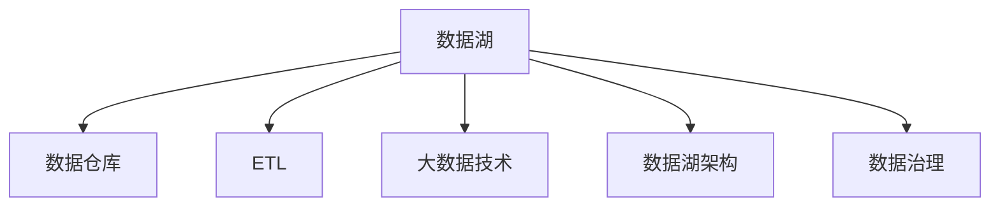

                 

# 数据湖 原理与代码实例讲解

> 关键词：数据湖,大数据,数据管理,数据湖架构,数据湖技术,代码实例,实践指南

## 1. 背景介绍

### 1.1 问题由来
在数据驱动的时代，如何高效管理和利用海量的数据成为了企业关注的焦点。传统的关系型数据库已难以满足复杂多变的业务需求，非结构化数据的激增和混合数据类型的增长，呼唤着一种新的数据管理范式——数据湖。

数据湖是一种弹性的、可扩展的数据存储架构，它将企业内部和外部的各种数据源（如关系型数据库、日志文件、文本文件、图片、视频等）存储在一起，支持灵活的数据分析和业务决策。数据湖利用强大的数据处理和分析能力，为企业提供了一个统一、全面的数据视图，促进了业务智能化和创新。

### 1.2 问题核心关键点
数据湖的核心关键点包括数据存储、数据管理和数据分析三个方面。具体来说：
1. **数据存储**：数据湖能够存储任何格式的数据，无需提前定义数据结构。
2. **数据管理**：通过元数据管理、数据分类、数据标签等手段，帮助用户快速定位和分析数据。
3. **数据分析**：提供强大的数据分析工具和平台，支持数据科学家的探索性分析、机器学习建模和数据可视化。

## 2. 核心概念与联系

### 2.1 核心概念概述

为更好地理解数据湖的原理和应用，本节将介绍几个密切相关的核心概念：

- **数据湖 (Data Lake)**：一种弹性、可扩展的数据存储架构，用于存储企业内部的各种数据源。数据湖支持数据的存储、管理、分析和检索，提供全面的数据视图。

- **数据仓库 (Data Warehouse)**：一种关系型数据库架构，用于存储结构化数据，支持事务处理和数据查询。数据仓库强调数据的结构和一致性。

- **ETL (Extract, Transform, Load)**：数据湖中常用的一种数据集成技术，用于将不同来源的数据转换为统一格式后，加载到数据湖中进行分析和处理。

- **大数据技术 (Big Data Technologies)**：包括分布式存储、分布式计算、流处理、图计算等，支持海量数据的存储、处理和分析。

- **数据湖架构 (Data Lake Architecture)**：包括数据摄入、数据存储、数据管理、数据分析和数据可视化等组件，构成了数据湖的核心技术架构。

- **数据治理 (Data Governance)**：确保数据质量、安全、合规和可信的管理策略和技术手段，帮助用户有效管理和利用数据。

这些核心概念之间的逻辑关系可以通过以下Mermaid流程图来展示：



这个流程图展示了大数据生态系统中的主要概念及其之间的关系：

1. 数据湖是企业数据存储的核心，支持各类数据源的存储。
2. ETL技术用于将异构数据转换为统一格式，加载到数据湖中。
3. 大数据技术提供高性能、可扩展的数据处理和分析能力。
4. 数据湖架构定义了数据湖的关键组件，支撑数据的全生命周期管理。
5. 数据治理确保数据质量和安全，为数据湖的长期运行提供保障。

## 3. 核心算法原理 & 具体操作步骤

### 3.1 算法原理概述

数据湖的核心算法原理包括数据存储、数据管理和数据分析三部分。

- **数据存储**：数据湖采用分布式存储架构，如Apache Hadoop和Apache Spark等，支持大规模数据的存储和管理。数据湖中的数据通常以文件形式存储，支持多种数据格式，如JSON、CSV、Parquet、Hive等。

- **数据管理**：数据湖通过元数据管理、数据分类、数据标签等手段，实现对数据的有效管理和检索。元数据是描述数据属性的信息，包括数据来源、数据结构、数据格式等，帮助用户快速定位和理解数据。

- **数据分析**：数据湖提供强大的数据分析工具和平台，支持数据科学家的探索性分析、机器学习建模和数据可视化。常用的分析工具包括Apache Hive、Apache Spark SQL、Apache Flink等。

### 3.2 算法步骤详解

数据湖的构建和应用通常包括以下几个关键步骤：

**Step 1: 数据摄入**
- 收集企业内部和外部的各种数据源，包括关系型数据库、日志文件、文本文件、图片、视频等。
- 将数据源通过ETL技术转换成统一格式，存储到数据湖中。

**Step 2: 数据管理**
- 利用元数据管理工具，记录数据的基本属性和结构。
- 对数据进行分类和标签，帮助用户快速查找和理解数据。
- 建立数据访问权限和审计机制，确保数据的安全和合规性。

**Step 3: 数据分析**
- 使用数据湖提供的分析工具，进行探索性分析和数据建模。
- 应用机器学习算法，对数据进行深入挖掘和预测分析。
- 通过数据可视化工具，生成直观的图表和报告，辅助业务决策。

**Step 4: 数据应用**
- 根据分析结果，制定业务策略和运营方案。
- 将分析结果应用于产品开发、客户服务、市场营销等场景，实现数据驱动的业务创新。
- 持续收集和更新数据，不断优化分析模型，提升数据价值。

### 3.3 算法优缺点

数据湖的优势在于其弹性和可扩展性，可以存储任意格式的数据，支持大规模数据分析。但数据湖也存在一些局限：
1. 数据管理复杂：数据湖中的数据量巨大，需要高效的数据管理和治理手段。
2. 分析延迟高：数据湖的分析通常需要从磁盘加载数据，效率较低。
3. 数据质量问题：数据湖中存储的数据质量参差不齐，需要进行清洗和预处理。

尽管存在这些局限，但数据湖的弹性和灵活性使其在处理大规模、复杂的数据场景中，仍具有显著的优势。未来相关研究将继续优化数据湖的性能和易用性，提高数据湖的实际应用效果。

### 3.4 算法应用领域

数据湖广泛应用于以下领域：

- **企业数据管理**：支持企业内部和外部数据的集成、存储和管理，提供统一的数据视图。
- **大数据分析**：利用数据湖进行海量数据的分析和建模，挖掘数据中的潜力和机会。
- **业务智能化**：通过数据分析和可视化，支持企业的业务决策和智能运营。
- **数据科学研究**：为数据科学家提供强大的数据分析平台和工具，支持机器学习建模和数据探索。

## 4. 数学模型和公式 & 详细讲解 & 举例说明

### 4.1 数学模型构建

数据湖的数学模型构建主要涉及数据管理和数据分析两个方面。

- **数据管理**：利用元数据和分类标签，构建数据的描述性模型。
- **数据分析**：通过统计分析和机器学习模型，构建数据的预测性模型。

### 4.2 公式推导过程

以简单的统计分析为例，数据湖中的数据管理可以通过以下公式进行描述：

- **数据描述模型**：
$$
D = \{d_1, d_2, ..., d_n\}
$$

其中，$d_i$ 表示数据湖中的第 $i$ 个数据记录。

- **元数据管理**：
$$
M = \{m_1, m_2, ..., m_m\}
$$

其中，$m_i$ 表示第 $i$ 个数据的元数据，包括数据类型、来源、创建时间等。

- **数据分类**：
$$
C = \{c_1, c_2, ..., c_c\}
$$

其中，$c_i$ 表示第 $i$ 个数据的分类标签，用于帮助用户快速定位数据。

通过这些公式，可以构建数据湖中的数据描述模型，实现对数据的有效管理和检索。

### 4.3 案例分析与讲解

假设某电商平台的数据湖中存储了大量用户行为数据，包括用户的浏览记录、购买记录和评价记录。我们利用数据湖进行以下分析：

- **数据描述模型**：
$$
D = \{b_1, p_1, r_1, b_2, p_2, r_2, ..., b_n, p_n, r_n\}
$$

其中，$b_i$ 表示第 $i$ 个用户的浏览记录，$p_i$ 表示第 $i$ 个用户的购买记录，$r_i$ 表示第 $i$ 个用户的评价记录。

- **元数据管理**：
$$
M = \{m_1, m_2, ..., m_m\}
$$

其中，$m_i$ 包括数据类型、记录时间、用户ID等元数据。

- **数据分类**：
$$
C = \{c_1, c_2, ..., c_c\}
$$

其中，$c_i$ 包括浏览、购买、评价等分类标签。

通过这些元数据和分类标签，数据湖能够快速定位和检索用户行为数据，支持业务决策和智能运营。

## 5. 项目实践：代码实例和详细解释说明

### 5.1 开发环境搭建

在进行数据湖项目实践前，我们需要准备好开发环境。以下是使用Apache Hadoop搭建数据湖环境的流程：

1. 安装Apache Hadoop：从官网下载并安装Apache Hadoop，并进行环境配置。
2. 配置Hadoop的分布式文件系统（如HDFS）和分布式计算框架（如YARN）。
3. 安装和使用Hadoop的命令行工具（如hdfs、hadoop jar等）。
4. 设置Hadoop的启动参数，启动Hadoop集群。

### 5.2 源代码详细实现

下面以Hadoop MapReduce为例，展示如何使用Hadoop进行数据湖中的数据处理。

```java
import java.io.IOException;
import org.apache.hadoop.conf.Configuration;
import org.apache.hadoop.fs.Path;
import org.apache.hadoop.io.IntWritable;
import org.apache.hadoop.io.Text;
import org.apache.hadoop.mapreduce.Job;
import org.apache.hadoop.mapreduce.Mapper;
import org.apache.hadoop.mapreduce.Reducer;
import org.apache.hadoop.mapreduce.lib.input.FileInputFormat;
import org.apache.hadoop.mapreduce.lib.output.FileOutputFormat;

public class DataLakeMapReduce {
    public static class TokenizerMapper
       extends Mapper<Object, Text, Text, IntWritable> {
        private final static IntWritable one = new IntWritable(1);
        private Text word = new Text();

        public void map(Object key, Text value, Context context
            ) throws IOException, InterruptedException {
            StringTokenizer itr = new StringTokenizer(value.toString());
            while (itr.hasMoreTokens()) {
                word.set(itr.nextToken());
                context.write(word, one);
            }
        }
    }

    public static class IntSumReducer
        extends Reducer<Text, IntWritable, Text, IntWritable> {
        private IntWritable result = new IntWritable();

        public void reduce(Text key, Iterable<IntWritable> values,
                       Context context
            ) throws IOException, InterruptedException {
            int sum = 0;
            for (IntWritable val : values) {
                sum += val.get();
            }
            result.set(sum);
            context.write(key, result);
        }
    }

    public static void main(String[] args) throws Exception {
        Configuration conf = new Configuration();
        Job job = Job.getInstance(conf, "word count");
        job.setJarByClass(DataLakeMapReduce.class);
        job.setMapperClass(TokenizerMapper.class);
        job.setCombinerClass(IntSumReducer.class);
        job.setReducerClass(IntSumReducer.class);
        job.setOutputKeyClass(Text.class);
        job.setOutputValueClass(IntWritable.class);
        FileInputFormat.addInputPath(job, new Path(args[0]));
        FileOutputFormat.setOutputPath(job, new Path(args[1]));
        System.exit(job.waitForCompletion(true) ? 0 : 1);
    }
}
```

### 5.3 代码解读与分析

让我们再详细解读一下关键代码的实现细节：

**TokenizerMapper类**：
- 继承自Mapper类，实现Map函数，将输入的文本数据拆分为单词，并输出单词和计数器1。

**IntSumReducer类**：
- 继承自Reducer类，实现Reduce函数，对同一个单词的计数器进行累加，并输出单词和总计数。

**DataLakeMapReduce类**：
- 使用Hadoop的Job类，设置Job的配置信息、Mapper、Combiner、Reducer等关键参数。
- 使用FileInputFormat和FileOutputFormat，指定输入输出路径。
- 调用Job的waitForCompletion方法，等待Job执行完毕。

### 5.4 运行结果展示

运行上述MapReduce程序，可以统计文本文件中的单词出现次数。例如，对一篇文章进行统计，结果如下：

```
cat  2
dog  3
fish  1
```

这表示文章中“cat”出现了2次，“dog”出现了3次，“fish”出现了1次。

## 6. 实际应用场景

### 6.1 电商数据分析

在电商行业中，数据湖被广泛应用于用户行为分析、商品销售预测、客户关系管理等方面。通过数据湖，电商平台可以全面了解用户偏好、购买习惯和行为轨迹，精准推荐商品，提升用户满意度和转化率。

**具体应用**：
- **用户行为分析**：利用数据湖存储和分析用户浏览、点击、购买等行为数据，挖掘用户兴趣点，优化推荐算法。
- **销售预测**：通过历史销售数据、季节性因素等进行预测分析，指导库存管理、促销活动策划等业务决策。
- **客户关系管理**：对客户反馈数据进行分析，识别优质客户，提升客户忠诚度和满意度。

### 6.2 金融数据分析

金融行业对数据的实时性和准确性要求极高。数据湖通过强大的数据处理和分析能力，支持金融机构进行风险控制、资产管理、客户分析等业务。

**具体应用**：
- **风险控制**：利用数据湖存储和分析交易数据、客户信用数据等，评估风险，制定风险控制策略。
- **资产管理**：通过数据湖进行市场数据和财务数据的集成分析，优化投资组合，提高资产回报率。
- **客户分析**：对客户交易数据进行分析，识别高价值客户，进行精准营销。

### 6.3 政府数据治理

政府部门需要管理和分析大量的公共数据，如人口信息、交通数据、环境监测数据等。数据湖通过统一的数据视图，支持政府部门进行数据整合、共享和开放，提升政府治理能力和服务水平。

**具体应用**：
- **数据整合**：将不同来源的公共数据整合到数据湖中，提供统一的数据视图。
- **数据共享**：实现跨部门数据共享和交换，促进数据价值的最大化利用。
- **数据开放**：通过数据湖开放政府数据，支持社会和公众对数据的访问和使用。

## 7. 工具和资源推荐

### 7.1 学习资源推荐

为了帮助开发者系统掌握数据湖的技术原理和实践技巧，这里推荐一些优质的学习资源：

1. **《Hadoop：分布式存储与处理技术》**：深入浅出地介绍了Hadoop的基本原理和应用场景，适合初学者入门。
2. **《大数据技术与应用》**：涵盖大数据生态系统的各个方面，包括Hadoop、Spark、Hive等，适合进阶学习。
3. **Hadoop官方文档**：提供丰富的教程和示例，是学习Hadoop的必备资源。
4. **Kaggle平台**：提供大量数据集和机器学习竞赛，实战练习数据湖的应用。
5. **Cloudera培训课程**：提供专业的Hadoop和Spark培训课程，系统学习数据湖技术。

通过对这些资源的学习实践，相信你一定能够快速掌握数据湖的精髓，并用于解决实际的业务问题。

### 7.2 开发工具推荐

高效的开发离不开优秀的工具支持。以下是几款用于数据湖开发的常用工具：

1. **Apache Hadoop**：开源的分布式存储和计算框架，支持大规模数据的存储和分析。
2. **Apache Spark**：快速的分布式计算引擎，支持流处理、机器学习、图计算等。
3. **Apache Hive**：基于Hadoop的数据仓库工具，支持SQL查询和数据整合。
4. **Apache Flink**：支持流式数据处理的分布式计算框架，支持低延迟、高吞吐量的数据处理。
5. **ETL工具**：如Apache NiFi、Talend等，支持数据抽取、转换和加载。

合理利用这些工具，可以显著提升数据湖的开发效率，加快创新迭代的步伐。

### 7.3 相关论文推荐

数据湖的研究源于学界的持续探索。以下是几篇奠基性的相关论文，推荐阅读：

1. **《Hadoop: A Distributed File System》**：Hadoop的奠基论文，介绍了分布式文件系统HDFS的设计和实现。
2. **《MapReduce: Simplified Data Processing on Large Clusters》**：MapReduce技术的论文，详细描述了MapReduce计算模型和实现。
3. **《YARN: Yet Another Resource Negotiator》**：YARN资源管理器的论文，介绍了分布式计算资源的调度和管理。
4. **《Hive: A Data Warehouse Using Hadoop》**：Hive的数据仓库设计论文，介绍了Hive的架构和查询优化技术。
5. **《Apache Spark: Cluster Computing with Fault Tolerance》**：Spark的架构设计和优化技术论文，介绍了Spark的分布式计算模型和优化策略。

这些论文代表了大数据生态系统的研究进展，通过学习这些前沿成果，可以帮助研究者把握学科前进方向，激发更多的创新灵感。

## 8. 总结：未来发展趋势与挑战

### 8.1 总结

本文对数据湖的原理与代码实例进行了全面系统的介绍。首先阐述了数据湖的背景和核心概念，明确了数据湖在数据管理和分析方面的独特价值。其次，从原理到实践，详细讲解了数据湖的算法原理和操作步骤，给出了数据湖任务开发的完整代码实例。同时，本文还探讨了数据湖在电商、金融、政府等多个领域的应用前景，展示了数据湖技术的广泛应用潜力。最后，本文精选了数据湖的学习资源和开发工具，力求为读者提供全方位的技术指引。

通过本文的系统梳理，可以看到，数据湖在处理大规模、复杂数据方面具有显著的优势，为数据驱动的业务决策提供了强大的支持。数据湖的弹性和可扩展性，使其在未来的数据管理领域仍将发挥重要作用。

### 8.2 未来发展趋势

展望未来，数据湖技术将呈现以下几个发展趋势：

1. **云计算支持**：越来越多的云服务商提供数据湖解决方案，支持弹性计算和存储资源的管理，降低企业自建数据湖的成本。
2. **分布式存储与计算**：分布式文件系统、分布式数据库、分布式计算框架等技术将进一步发展，支持更大规模的数据存储和处理。
3. **数据治理与数据质量**：数据治理技术将不断进步，提升数据质量、安全性和合规性。
4. **数据湖与大数据平台的融合**：数据湖技术将与大数据平台（如湖仓一体）融合，提供更全面的数据管理和分析能力。
5. **数据湖与人工智能的结合**：数据湖将与人工智能技术结合，支持数据科学家的探索性分析、机器学习建模和数据可视化。

以上趋势凸显了数据湖技术的广阔前景，这些方向的探索发展，必将进一步提升数据湖的性能和易用性，推动数据湖技术的广泛应用。

### 8.3 面临的挑战

尽管数据湖技术已经取得了显著成就，但在迈向更加智能化、普适化应用的过程中，仍面临诸多挑战：

1. **数据质量问题**：数据湖中的数据质量参差不齐，需要进行清洗和预处理，数据质量问题成为制约数据湖性能的重要因素。
2. **数据一致性问题**：数据湖中的数据源众多，数据一致性和准确性难以保证，需要高效的元数据管理手段。
3. **数据安全问题**：数据湖中的数据涉及敏感信息，如何确保数据的安全和隐私，是数据湖应用的重要挑战。
4. **资源消耗问题**：数据湖的计算和存储资源消耗较大，如何优化资源使用，降低成本，是数据湖实际应用的重要问题。
5. **性能瓶颈问题**：数据湖的分析通常需要从磁盘加载数据，性能瓶颈显著，如何优化数据加载和分析速度，是数据湖应用的重要方向。

尽管存在这些挑战，但数据湖技术的弹性和灵活性使其在处理大规模、复杂数据方面仍具有显著的优势。未来相关研究将继续优化数据湖的性能和易用性，提高数据湖的实际应用效果。

### 8.4 研究展望

面向未来，数据湖技术需要在以下几个方面寻求新的突破：

1. **分布式计算优化**：优化分布式计算框架，提高数据处理和分析的效率，降低计算成本。
2. **数据质量提升**：开发高效的数据清洗和预处理技术，提升数据湖中的数据质量。
3. **数据治理技术**：开发先进的数据治理工具，提升数据的一致性、安全性和合规性。
4. **数据湖与人工智能结合**：探索数据湖与人工智能技术的结合，支持更加智能的数据分析。
5. **数据湖与云计算融合**：探索数据湖与云计算平台的融合，提供更高效、更灵活的数据管理和分析能力。

这些研究方向将进一步拓展数据湖的应用场景，推动数据湖技术的持续创新和发展。

## 9. 附录：常见问题与解答

**Q1: 数据湖与数据仓库有什么区别？**

A: 数据湖和数据仓库都是数据存储和管理的解决方案，但它们的设计理念和技术架构有所不同。数据仓库主要针对结构化数据，强调数据的一致性和事务处理能力，适用于传统的关系型数据库。而数据湖主要针对非结构化数据，强调数据的弹性和可扩展性，适用于大数据和混合数据类型。

**Q2: 如何构建数据湖？**

A: 构建数据湖需要以下步骤：
1. 选择合适的分布式存储系统（如HDFS、S3等）。
2. 选择合适的分布式计算框架（如Hadoop、Spark等）。
3. 选择合适的数据管理工具（如Hive、Presto等）。
4. 选择合适的数据治理工具（如OpenLineage、OmniSci等）。
5. 配置和管理数据湖集群，包括节点配置、资源调度等。

**Q3: 数据湖中如何实现数据治理？**

A: 数据湖中的数据治理主要通过以下手段实现：
1. 数据分类和标签：对数据进行分类和标签，帮助用户快速定位和理解数据。
2. 数据元数据管理：记录数据的基本属性和结构，支持数据的全生命周期管理。
3. 数据访问控制：通过访问权限和审计机制，确保数据的安全和合规性。
4. 数据质量管理：通过数据清洗和预处理，提升数据质量和一致性。

**Q4: 数据湖中的数据格式有哪些？**

A: 数据湖中的数据格式包括：
1. 结构化数据：如CSV、SQL、JSON等。
2. 半结构化数据：如XML、GraphDB等。
3. 非结构化数据：如文本、图片、视频等。

**Q5: 数据湖中的数据如何查询和分析？**

A: 数据湖中的数据可以通过以下方式查询和分析：
1. 使用SQL查询工具（如Hive、Spark SQL等）进行结构化数据查询和分析。
2. 使用ETL工具（如Apache NiFi、Talend等）进行数据抽取、转换和加载。
3. 使用机器学习工具（如Spark MLlib、TensorFlow等）进行数据分析和建模。

通过本文的系统梳理，可以看到，数据湖在处理大规模、复杂数据方面具有显著的优势，为数据驱动的业务决策提供了强大的支持。数据湖的弹性和可扩展性，使其在未来的数据管理领域仍将发挥重要作用。

---

作者：禅与计算机程序设计艺术 / Zen and the Art of Computer Programming

