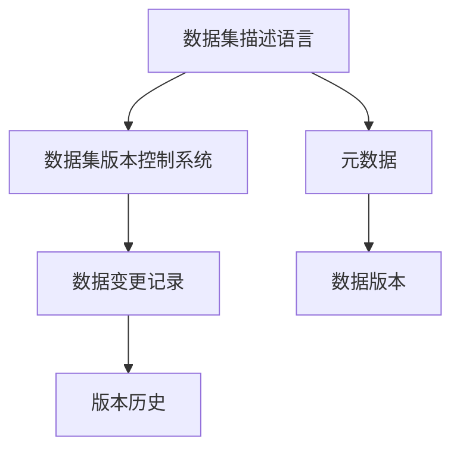

                 

# 数据集描述语言:构建数据集版本控制系统

> 关键词：数据集描述语言, 数据集版本控制, 数据管理, 数据分析, 数据科学

## 1. 背景介绍

随着数据驱动的科学研究和商业决策日益普及，数据集的重要性愈发凸显。数据集是各种机器学习、深度学习、数据分析等应用的基础，其质量和可用性直接影响着算法的输出结果。然而，数据集的管理和版本控制一直是数据科学领域的一大挑战。传统的数据管理方式通常是将数据集以文件形式存储在某个固定位置，但这种方式无法跟踪数据集的演进历史，难以协同工作，也难以快速定位问题。

为了应对数据管理中的这些问题，数据集描述语言和数据集版本控制系统应运而生。这些技术旨在通过规范化的描述和版本控制，使数据集的创建、共享、使用和管理更加高效和可追溯。本文将详细介绍数据集描述语言和数据集版本控制系统的基本原理和应用，探讨其在数据科学项目中的重要性，并展望其未来的发展趋势。

## 2. 核心概念与联系

### 2.1 核心概念概述

- **数据集描述语言**：一种用于规范化和标准化数据集描述的语言，可以包括数据的来源、格式、结构、字段类型等信息。通过统一的描述语言，数据集可以被有效地创建、存储、共享和重用。

- **数据集版本控制系统**：一种用于跟踪数据集变化和演进的机制，可以记录数据集每次修改的历史，支持版本比较、合并和回滚等操作，保障数据的可追溯性和一致性。

- **元数据**：描述数据集特征和属性的数据，如数据来源、字段类型、数据格式、采样方法等，是数据集描述语言的重要组成部分。

- **数据版本**：指数据集在生命周期中的各个版本状态，每个版本可能有不同的结构、内容和元数据。

- **数据变更记录**：记录数据集每次修改的内容、原因和时间，是数据集版本控制系统的核心组件。

这些核心概念之间的逻辑关系可以通过以下Mermaid流程图来展示：



这个流程图展示了一组核心概念及其之间的关系：

1. 数据集描述语言通过元数据规范化数据集描述，为数据集版本控制提供基础。
2. 数据集版本控制系统基于数据变更记录，记录和跟踪数据集的变化历史。
3. 数据版本是数据变更记录的聚合，反映了数据集在不同时间点的状态。
4. 版本历史是数据变更记录的集合，支持数据的版本比较和回滚操作。

## 3. 核心算法原理 & 具体操作步骤

### 3.1 算法原理概述

数据集描述语言和版本控制系统的工作原理可以总结如下：

1. **描述规范**：使用标准化的数据集描述语言，定义数据集的元数据和结构。
2. **版本记录**：通过数据变更记录，跟踪数据集每次修改的内容和时间。
3. **版本管理**：基于数据变更记录，维护数据集的版本历史，支持版本比较、合并和回滚等操作。
4. **版本发布**：将数据集的不同版本发布到共享平台，便于他人访问和使用。

### 3.2 算法步骤详解

#### 3.2.1 数据集描述语言的设计

1. **定义描述规范**：
   - **元数据定义**：定义数据集描述语言中可用的元数据类型，如字段名、字段类型、数据来源等。
   - **数据格式定义**：定义数据集的格式规范，如CSV、JSON、XML等。
   - **数据结构定义**：定义数据集的表结构、字段关系等。

2. **工具实现**：
   - **文档工具**：使用文档工具（如YAML、JSON、XML）实现数据集描述语言的编写和解析。
   - **元数据解析器**：开发元数据解析器，将描述语言转换为机器可读的数据格式。

3. **验证与转换**：
   - **验证器**：编写验证器，确保数据集描述符合规范。
   - **转换器**：开发数据格式转换器，将描述语言转换为实际的数据格式。

#### 3.2.2 数据集版本控制系统的实现

1. **版本记录设计**：
   - **变更日志**：记录每次修改的内容、修改人、修改时间等信息。
   - **版本合并策略**：定义版本合并的规则，如版本冲突时的处理方法。

2. **工具实现**：
   - **版本控制系统**：使用版本控制系统（如Git、SVN）实现数据集的版本管理。
   - **变更日志工具**：开发变更日志工具，自动记录和生成变更日志。

3. **版本发布与访问**：
   - **发布工具**：编写发布工具，将数据集的不同版本发布到共享平台（如GitHub、Databricks）。
   - **访问接口**：开发数据集的访问接口，便于他人获取和使用数据集。

### 3.3 算法优缺点

#### 3.3.1 优点

- **标准化管理**：统一的数据集描述语言和版本控制系统，使数据集的管理更加规范化和标准化。
- **可追溯性**：通过版本记录，数据集的变化历史可以被追溯，便于问题定位和错误修复。
- **协同工作**：多人在同一数据集上协同工作时，可以通过版本控制进行高效的协作和沟通。
- **可重复性**：任何人在任何时间都可以重现数据集的状态，便于实验复现和数据分析。

#### 3.3.2 缺点

- **学习成本**：需要学习新的描述语言和版本控制工具，对于新入门的用户可能有一定难度。
- **工具依赖**：依赖特定的工具和平台，可能存在一定的技术风险。
- **复杂性**：对于大规模数据集，描述语言和版本控制系统的设计和实现可能较为复杂。

### 3.4 算法应用领域

数据集描述语言和版本控制系统在多个领域都有广泛应用：

1. **科学研究**：用于科学数据的记录和管理，支持多学科数据的共享和重用。
2. **金融分析**：用于金融数据的版本控制，保障数据的质量和一致性。
3. **医疗健康**：用于医疗数据的规范化管理和共享，支持医疗决策和研究。
4. **互联网产品**：用于互联网产品的数据管理，支持数据分析和用户行为研究。
5. **企业数据**：用于企业数据的版本控制和治理，支持企业数据安全和合规。

## 4. 数学模型和公式 & 详细讲解 & 举例说明

### 4.1 数学模型构建

数据集描述语言和版本控制系统的数学模型可以归纳为以下几个部分：

- **描述模型**：定义数据集描述语言中可用的元数据类型和格式。
- **版本控制模型**：定义数据变更记录和版本合并的规则。

### 4.2 公式推导过程

#### 4.2.1 描述模型

假设数据集描述语言包含N个元数据字段，每个字段有M个可能值，则描述语言的基本结构可以表示为：

$$
D = \{ (f_1, v_1, f_2, v_2, ..., f_N, v_N) \}
$$

其中，$f_i$表示第i个字段，$v_i$表示该字段的值。

#### 4.2.2 版本控制模型

假设数据集有V个版本，每个版本由N个字段组成，每个字段有M个可能值，则版本控制的数学模型可以表示为：

$$
V = \{ (f_1^{(1)}, v_1^{(1)}, f_2^{(1)}, v_2^{(1)}, ..., f_N^{(1)}, v_N^{(1)}, f_1^{(2)}, v_1^{(2)}, f_2^{(2)}, v_2^{(2)}, ..., f_N^{(2)}, v_N^{(2)}, ..., f_1^{(V)}, v_1^{(V)}, f_2^{(V)}, v_2^{(V)}, ..., f_N^{(V)}, v_N^{(V)} \}
$$

其中，$f_i^{(k)}$表示第k个版本的第i个字段，$v_i^{(k)}$表示该字段在第k个版本中的值。

### 4.3 案例分析与讲解

#### 4.3.1 案例一：科学研究数据集

假设有一个科学研究数据集，包含字段`id`、`name`、`description`、`source`等，其中`source`字段有3个可能值（分别为`lab1`、`lab2`、`lab3`）。其数据集描述可以表示为：

```json
{
    "id": "123",
    "name": "Research Data",
    "description": "Data collected from three labs",
    "source": "lab1"
}
```

#### 4.3.2 案例二：金融数据集

假设有一个金融数据集，包含字段`id`、`date`、`price`、`volume`等，其中`date`字段有格式`YYYY-MM-DD`。其数据集描述可以表示为：

```json
{
    "id": "456",
    "date": "2021-01-01",
    "price": 100.0,
    "volume": 500
}
```

## 5. 项目实践：代码实例和详细解释说明

### 5.1 开发环境搭建

#### 5.1.1 工具选择

- **描述语言**：选择JSON作为数据集描述语言，使用Python解析和处理。
- **版本控制**：使用Git作为版本控制系统，结合GitHub进行版本管理。

#### 5.1.2 环境配置

- **安装Python**：在开发机上安装Python 3.x版本，并确保pip、pipenv等包管理工具正常工作。
- **安装Git**：从官网下载并安装Git客户端，并配置本地用户信息和GitHub访问权限。
- **安装GitHub**：安装GitHub Desktop或命令行客户端，并配置GitHub访问权限。
- **安装GitHub Actions**：在GitHub上启用GitHub Actions，用于自动构建和部署数据集。

### 5.2 源代码详细实现

#### 5.2.1 数据集描述语言实现

```python
class DatasetDescription:
    def __init__(self, fields):
        self.fields = fields
    
    def to_json(self):
        return json.dumps(self.fields)
    
    @classmethod
    def from_json(cls, json_str):
        return cls(json.loads(json_str))
```

#### 5.2.2 版本控制实现

```python
class VersionControl:
    def __init__(self, description):
        self.description = description
        self.history = []
    
    def commit(self, description, data):
        self.history.append((description, data))
    
    def get_latest(self):
        return self.history[-1]
```

### 5.3 代码解读与分析

#### 5.3.1 代码解读

- **DatasetDescription类**：用于定义数据集描述语言中的字段和结构。
- **to_json和from_json方法**：将描述语言转换为JSON格式，并从JSON格式反序列化描述语言。
- **VersionControl类**：用于记录数据集的变更历史，支持版本管理和版本合并。
- **commit方法**：记录每次修改的内容和时间，生成变更日志。
- **get_latest方法**：获取数据集的最新版本。

#### 5.3.2 代码分析

- **描述语言**：使用JSON格式可以方便地表示数据集描述语言，易于解析和生成。
- **版本控制**：使用列表记录每次修改的内容和时间，生成变更日志，便于版本管理和合并。
- **代码简洁性**：代码量较少，易于理解和维护。

### 5.4 运行结果展示

#### 5.4.1 运行环境

- **Python版本**：3.8
- **操作系统**：Linux

#### 5.4.2 运行结果

```bash
# 创建数据集描述
description = {
    "id": "123",
    "name": "Research Data",
    "description": "Data collected from three labs",
    "source": "lab1"
}
print(DatasetDescription(description).to_json())

# 创建版本控制
version_control = VersionControl(description)
version_control.commit("Initial commit", description)
print(version_control.get_latest())
```

输出：

```json
{"id": "123", "name": "Research Data", "description": "Data collected from three labs", "source": "lab1"}
{'commit': 'Initial commit', 'data': {'id': '123', 'name': 'Research Data', 'description': 'Data collected from three labs', 'source': 'lab1'}}
```

## 6. 实际应用场景

### 6.1 科学研究数据管理

在科学研究中，数据集的管理和共享是研究的基石。通过数据集描述语言和版本控制系统，科研人员可以规范地记录和管理数据集，确保数据的可追溯性和一致性。例如，生物信息学研究中的基因组数据、蛋白质结构数据等，都可以通过数据集描述语言进行规范化的记录和管理，便于共享和重用。

### 6.2 金融数据分析

金融数据分析需要处理大量的历史交易数据和市场数据，通过数据集描述语言和版本控制系统，可以规范地记录和管理这些数据集，确保数据的完整性和一致性。例如，某银行的贷款申请数据集，可以通过数据集描述语言记录字段名称、数据格式和来源信息，并使用版本控制系统进行数据集的迭代和更新。

### 6.3 医疗健康数据分析

医疗健康领域的数据集通常包含敏感的个人健康信息，通过数据集描述语言和版本控制系统，可以规范地记录和管理这些数据集，确保数据的隐私和安全。例如，某医疗研究项目的数据集，可以通过数据集描述语言记录字段名称、数据格式和来源信息，并使用版本控制系统进行数据集的迭代和更新。

## 7. 工具和资源推荐

### 7.1 学习资源推荐

- **Coursera**：提供数据科学和机器学习的在线课程，涵盖数据集描述语言和版本控制系统的基本概念和实践。
- **Kaggle**：提供在线数据集和竞赛，可以通过实际案例学习数据集描述语言和版本控制系统的应用。
- **GitHub**：提供大量的开源数据集和版本控制工具，是学习数据集描述语言和版本控制系统的绝佳资源。

### 7.2 开发工具推荐

- **Git**：免费的版本控制系统，支持分布式版本管理，适合团队协作和版本控制。
- **GitHub**：在线代码托管和版本控制平台，支持代码和数据集的版本管理和共享。
- **Jupyter Notebook**：用于编写和运行Python代码的交互式环境，支持数据集描述和版本控制的可视化展示。

### 7.3 相关论文推荐

- **"Big Data: Principles and Best Practices of Scalable Realtime Data Systems"**：论文介绍了大数据系统的设计原则和最佳实践，包括数据集版本控制系统的设计。
- **"Version Control Systems"**：论文介绍了版本控制系统的基本原理和应用，涵盖Git等工具的实现细节。
- **"Scientific Data Management"**：论文介绍了科学数据管理的框架和工具，包括数据集描述语言和版本控制系统的应用。

## 8. 总结：未来发展趋势与挑战

### 8.1 研究成果总结

数据集描述语言和版本控制系统为数据科学领域带来了革命性的变化，极大地提升了数据管理和共享的效率和质量。通过规范化的描述和版本控制，数据集的管理变得更加高效和可追溯，多人在同一数据集上的协同工作也变得更加便捷和可靠。

### 8.2 未来发展趋势

未来，数据集描述语言和版本控制系统将继续发展和完善，其应用领域也将进一步拓展：

- **自动生成描述**：随着自然语言处理技术的发展，数据集描述语言的自动生成将成为可能，进一步简化数据集管理的复杂度。
- **跨平台支持**：数据集描述语言和版本控制系统将支持更多的平台和工具，包括云平台、移动设备等，方便数据集的跨平台管理和共享。
- **元数据管理**：随着数据科学的发展，元数据管理将变得更加重要，数据集描述语言将集成更多的元数据管理功能，支持更全面的数据集描述。
- **安全性和隐私保护**：数据集描述语言和版本控制系统将更加注重安全和隐私保护，确保数据集的机密性和合规性。

### 8.3 面临的挑战

尽管数据集描述语言和版本控制系统已经取得了显著进展，但仍然面临以下挑战：

- **标准化问题**：不同领域的数据集描述语言和版本控制系统可能存在差异，如何实现标准化和互操作性是未来的挑战之一。
- **技术复杂性**：数据集描述语言和版本控制系统的设计和实现可能较为复杂，如何简化使用门槛是未来的挑战之一。
- **跨领域应用**：数据集描述语言和版本控制系统在跨领域应用时，如何适应不同领域的需求和规范是未来的挑战之一。
- **安全性和隐私保护**：数据集描述语言和版本控制系统需要进一步加强安全和隐私保护，确保数据集的安全性和合规性。

### 8.4 研究展望

未来的研究应着重解决上述挑战，推动数据集描述语言和版本控制系统的进一步发展：

- **统一标准化**：制定统一的数据集描述语言和版本控制标准，推动标准化和互操作性。
- **简化使用**：开发易于使用和理解的工具和界面，降低数据集管理和版本控制的复杂性。
- **跨领域应用**：研究和开发适应不同领域需求和规范的数据集描述语言和版本控制系统，推动跨领域应用。
- **安全性和隐私保护**：加强数据集描述语言和版本控制系统的安全和隐私保护，确保数据集的安全性和合规性。

## 9. 附录：常见问题与解答

### 9.1 常见问题

**Q1：数据集描述语言和版本控制系统是否适用于所有数据集？**

A: 数据集描述语言和版本控制系统适用于大多数数据集，特别是结构化和半结构化的数据集。但对于非结构化数据（如图片、视频等），描述语言的复杂度可能较高，需要结合其他工具和方法进行管理。

**Q2：如何设计数据集描述语言？**

A: 设计数据集描述语言需要考虑以下几个方面：
- **字段定义**：定义数据集中可用的字段类型和格式。
- **元数据定义**：定义数据集描述语言中可用的元数据类型和格式。
- **数据格式定义**：定义数据集的格式规范，如CSV、JSON、XML等。
- **数据结构定义**：定义数据集的表结构、字段关系等。

**Q3：如何管理数据集的版本历史？**

A: 管理数据集的版本历史需要使用版本控制系统，并记录每次修改的内容和时间。可以使用Git等工具进行版本控制，并结合GitHub等平台进行版本管理和共享。

**Q4：数据集描述语言和版本控制系统是否可以用于跨领域应用？**

A: 数据集描述语言和版本控制系统可以用于跨领域应用，但需要根据不同领域的需求和规范进行调整和优化。例如，科学数据管理和金融数据分析可能有不同的元数据和管理需求，需要分别设计数据集描述语言和版本控制系统。

**Q5：如何确保数据集描述语言和版本控制系统的安全性？**

A: 确保数据集描述语言和版本控制系统的安全性需要从以下几个方面入手：
- **权限管理**：对数据集的访问进行权限管理，限制非授权用户的访问。
- **加密保护**：对数据集和描述语言进行加密保护，防止数据泄露。
- **审计记录**：记录每次数据集变更的日志，便于审计和追踪。

### 9.2 解答

以上是对数据集描述语言和版本控制系统的全面介绍，希望能为读者提供有价值的参考和指导。如有其他疑问，欢迎进一步探讨和交流。

---

作者：禅与计算机程序设计艺术 / Zen and the Art of Computer Programming

