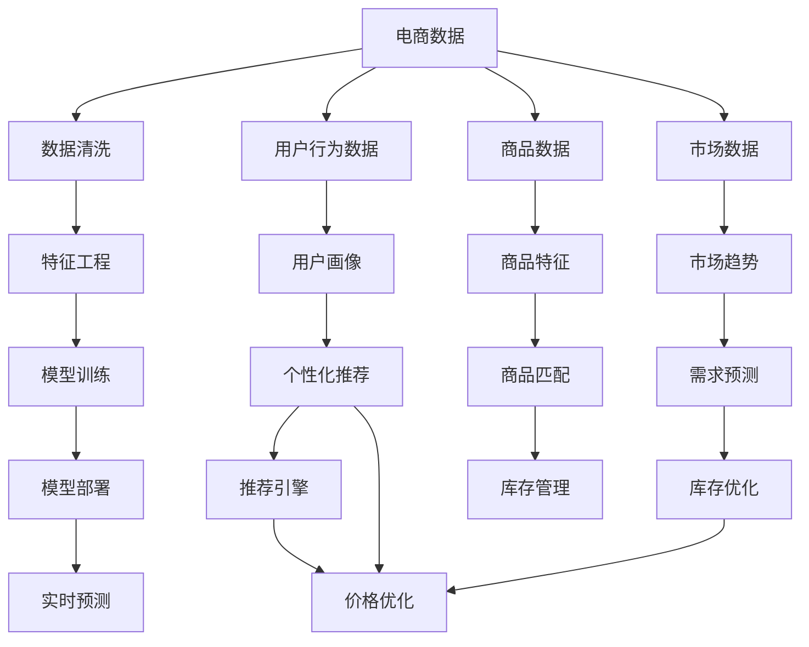

                 

## 1. 背景介绍

### 1.1 问题由来

在电商领域，决策一直是核心竞争力所在。传统电商决策依赖于人工经验与市场分析，但在数据量爆炸的今天，这种模式越来越难以满足用户需求和市场变化。通过引入人工智能(AI)，电商公司可以基于数据驱动进行精准决策，提升客户体验和运营效率。

### 1.2 问题核心关键点

人工智能在电商决策中扮演了重要角色，主要体现在以下几个方面：

- **需求预测**：通过机器学习模型，预测未来的商品需求量，优化库存和补货策略。
- **个性化推荐**：利用用户行为数据，进行深度个性化推荐，提高用户转化率和满意度。
- **价格优化**：利用历史销售数据和市场需求，动态调整商品价格，实现利润最大化。
- **欺诈检测**：使用异常检测算法，识别和预防欺诈行为，保护交易安全。
- **客服机器人**：部署智能客服机器人，自动解答常见问题，提升客户支持效率。

AI在电商中的引入，极大地改善了决策效率和效果。但同时，也面临着数据隐私保护、模型鲁棒性、实时性等挑战。

### 1.3 问题研究意义

AI在电商决策中的应用，能够带来多方面的实际收益：

1. **提升客户体验**：通过精准推荐和个性化服务，提升用户满意度和留存率。
2. **优化运营效率**：减少人工决策的延时和误差，降低运营成本。
3. **增加销售收入**：精准的库存管理和价格优化策略，提升商品销售量和利润率。
4. **降低风险**：欺诈检测和异常行为识别，保障交易安全和平台稳定。
5. **市场竞争力**：利用AI技术，快速响应市场变化，保持竞争优势。

本文旨在探讨AI如何在电商决策中发挥作用，介绍核心技术和实现方法，以期对电商决策领域的从业者提供有益的参考和启示。

## 2. 核心概念与联系

### 2.1 核心概念概述

电商决策中的AI应用，涉及多个关键概念：

- **人工智能(AI)**：通过计算机算法，使机器具备类似人类的智能决策能力。
- **机器学习(ML)**：让机器通过数据学习规律，自主做出预测和决策。
- **深度学习(DL)**：利用神经网络结构，构建多层非线性模型，进行复杂决策。
- **自然语言处理(NLP)**：处理和理解自然语言文本，支持语音助手、客服聊天机器人等应用。
- **计算机视觉(CV)**：处理和理解图像和视频数据，支持智能推荐和库存监控。
- **强化学习(RL)**：通过奖励机制，让模型在不断试错中优化策略，支持动态价格和库存管理。

这些概念彼此关联，共同构成电商AI决策的技术框架。

### 2.2 核心概念原理和架构的 Mermaid 流程图



这个流程图展示了电商AI决策的核心流程：

1. **电商数据**：收集用户行为、商品销售、市场趋势等多维度数据。
2. **数据清洗**：处理缺失值、异常值，保证数据质量。
3. **特征工程**：提取和构建对模型有用的特征，如用户特征、商品特征等。
4. **模型训练**：基于历史数据训练各种AI模型，包括预测、推荐、优化等。
5. **模型部署**：将训练好的模型部署到实际应用中，支持实时预测和决策。
6. **实时预测**：根据当前数据和模型，实时输出决策结果。

通过这个流程，AI可以在电商决策中发挥重要作用。

## 3. 核心算法原理 & 具体操作步骤

### 3.1 算法原理概述

电商决策中的AI应用，主要基于以下算法原理：

- **监督学习(Supervised Learning)**：利用标注数据训练模型，进行需求预测、个性化推荐等任务。
- **无监督学习(Unsupervised Learning)**：无需标注数据，通过聚类、降维等方法，发现数据中的隐藏结构，用于用户画像和市场趋势分析。
- **强化学习(RL)**：通过奖励机制优化决策策略，支持动态价格和库存管理。
- **深度学习(DL)**：构建多层神经网络，处理复杂的数据关系，实现精准的预测和推荐。

### 3.2 算法步骤详解

以**个性化推荐系统**为例，其基本步骤如下：

**Step 1: 数据收集**
- 收集用户历史行为数据、商品信息和市场趋势数据。
- 进行数据清洗和特征工程，提取对推荐有用的特征。

**Step 2: 模型训练**
- 选择合适的推荐算法，如协同过滤、深度学习等，进行模型训练。
- 利用标注数据或无监督方法，对模型进行初始化或优化。

**Step 3: 推荐引擎部署**
- 将训练好的模型部署到推荐系统中，支持实时推荐。
- 定期更新模型，考虑新数据和新算法。

**Step 4: 实时推荐**
- 根据用户当前行为和系统实时数据，生成推荐结果。
- 利用模型输出，更新商品展示和推荐列表。

**Step 5: 效果评估**
- 通过点击率、转化率等指标，评估推荐系统效果。
- 根据评估结果，调整模型参数和推荐策略。

### 3.3 算法优缺点

电商决策中的AI应用具有以下优点：

- **高效性**：利用大数据和算法优化，快速做出决策。
- **准确性**：基于数据驱动，避免人为偏差，提高决策精度。
- **实时性**：支持实时数据处理和决策，提升运营效率。

但同时也存在以下缺点：

- **数据隐私**：需要收集和处理大量用户数据，可能存在隐私泄露风险。
- **模型复杂**：部分算法复杂度高，训练和推理成本高。
- **鲁棒性**：模型对异常数据和噪声敏感，可能出现误判。
- **解释性**：部分模型黑盒特性强，难以解释决策逻辑。

### 3.4 算法应用领域

AI在电商决策中，主要应用于以下领域：

- **需求预测**：基于历史数据，预测未来的需求量，优化库存和补货策略。
- **个性化推荐**：利用用户行为数据，生成个性化推荐，提高转化率和满意度。
- **价格优化**：利用市场需求和销售数据，动态调整商品价格，实现利润最大化。
- **库存管理**：实时监控库存状态，进行动态调整，防止缺货或积压。
- **客户服务**：部署智能客服机器人，自动解答常见问题，提升客户支持效率。
- **欺诈检测**：识别和预防欺诈行为，保障交易安全。

这些应用领域展示了AI在电商决策中的广泛应用和巨大潜力。

## 4. 数学模型和公式 & 详细讲解 & 举例说明

### 4.1 数学模型构建

电商决策中的AI应用，通常构建在以下数学模型基础上：

- **线性回归**：用于需求预测，假设需求与多个变量线性相关。
- **协同过滤**：用于个性化推荐，利用用户行为矩阵进行相似性匹配。
- **深度神经网络**：用于特征提取和复杂决策，包括卷积神经网络(CNN)、循环神经网络(RNN)等。
- **强化学习**：利用Q-learning等算法，优化动态决策策略。

### 4.2 公式推导过程

以**线性回归**为例，其基本公式为：

$$ y = \beta_0 + \beta_1 x_1 + \beta_2 x_2 + \cdots + \beta_n x_n + \epsilon $$

其中 $y$ 为目标变量，$x_i$ 为输入变量，$\beta_i$ 为回归系数，$\epsilon$ 为误差项。

利用最小二乘法，可以求解出最优回归系数：

$$ \hat{\beta} = (X^T X)^{-1} X^T y $$

### 4.3 案例分析与讲解

假设某电商网站收集了过去一年的销售数据，包括时间、日期、商品类别、销售量等。利用线性回归模型，预测下一季度各商品的需求量。

首先，将销售数据进行归一化处理，并计算相关性矩阵。然后，构造矩阵 $X$ 和向量 $y$，其中 $X$ 包含时间、日期、商品类别等特征，$y$ 为销售量。

接着，利用最小二乘法求解回归系数 $\hat{\beta}$。最后，将得到的系数应用于新数据，进行需求预测。

## 5. 项目实践：代码实例和详细解释说明

### 5.1 开发环境搭建

在电商决策中，AI应用通常使用Python和相关库进行开发。以下是搭建开发环境的详细步骤：

1. **安装Python**：
   - 从官网下载并安装Python，建议使用Anaconda或Miniconda。
   - 创建虚拟环境，安装所需库。

2. **安装数据处理库**：
   - 安装Pandas、NumPy等库，用于数据清洗和处理。
   - 安装Scikit-learn，用于机器学习模型训练。
   - 安装TensorFlow或PyTorch，用于深度学习模型训练。

3. **安装推荐系统库**：
   - 安装LightFM、Surprise等推荐系统库，支持协同过滤和深度学习推荐。
   - 安装Scrapy、BeautifulSoup等网络爬虫库，用于数据收集。

4. **安装部署工具**：
   - 安装Flask或Django等Web框架，用于搭建推荐系统。
   - 安装Gunicorn、Nginx等Web服务器，支持模型部署和实时预测。

完成上述步骤后，即可在虚拟环境中进行电商AI决策的开发。

### 5.2 源代码详细实现

以下是一个基于TensorFlow的线性回归需求预测模型的代码实现：

```python
import tensorflow as tf
import pandas as pd
import numpy as np

# 数据预处理
data = pd.read_csv('sales_data.csv')
data['time'] = pd.to_datetime(data['time'])
data['month'] = data['time'].dt.month
data['day'] = data['time'].dt.day
data = data.groupby(['month', 'day', 'category'])['quantity'].sum().reset_index()

# 特征工程
X = data[['month', 'day', 'category']]
y = data['quantity']
X = (X - X.mean()) / X.std()

# 模型训练
model = tf.keras.Sequential([
    tf.keras.layers.Dense(10, activation='relu', input_shape=[3]),
    tf.keras.layers.Dense(1)
])
model.compile(optimizer=tf.keras.optimizers.Adam(), loss='mse')
model.fit(X, y, epochs=100)

# 预测需求
new_data = pd.read_csv('new_sales_data.csv')
new_data['time'] = pd.to_datetime(new_data['time'])
new_data['month'] = new_data['time'].dt.month
new_data['day'] = new_data['time'].dt.day
new_data = new_data.groupby(['month', 'day', 'category'])[['quantity']].sum().reset_index()
new_data = (new_data - new_data.mean()) / new_data.std()
predictions = model.predict(new_data[['month', 'day', 'category']])
```

### 5.3 代码解读与分析

上述代码主要分为数据预处理、特征工程、模型训练和预测需求四个步骤：

1. **数据预处理**：读取销售数据，提取时间、日期、类别等特征，并进行归一化处理。
2. **特征工程**：构造特征矩阵 $X$ 和目标变量 $y$，并进行标准化处理。
3. **模型训练**：定义神经网络模型，使用Adam优化器和均方误差损失函数进行训练。
4. **预测需求**：读取新数据，进行标准化处理，利用训练好的模型进行需求预测。

### 5.4 运行结果展示

训练完成后，可以通过以下代码展示预测结果：

```python
import matplotlib.pyplot as plt

# 计算预测误差
errors = y - predictions
plt.hist(errors, bins=100)
plt.title('Predicted vs Actual Demand')
plt.xlabel('Error')
plt.ylabel('Frequency')
plt.show()
```

通过可视化误差分布，可以直观地评估模型的预测效果。

## 6. 实际应用场景

### 6.1 智能推荐系统

电商推荐系统是AI在电商决策中应用最广泛的场景之一。通过分析用户行为数据，推荐系统可以生成个性化推荐，提高用户满意度。

### 6.2 实时库存管理

库存管理是电商运营中的重要环节。通过实时监控库存状态，AI可以优化库存策略，避免缺货或积压。

### 6.3 动态定价策略

基于市场数据和用户行为，AI可以动态调整商品价格，实现利润最大化。

### 6.4 欺诈检测

电商交易中存在大量欺诈行为，AI可以通过异常检测算法识别和预防欺诈行为，保障交易安全。

### 6.5 客户服务机器人

智能客服机器人可以自动解答常见问题，提升客户支持效率，减轻人工客服压力。

### 6.6 市场趋势分析

利用AI进行市场趋势分析，可以提前发现市场变化，调整策略，保持竞争优势。

## 7. 工具和资源推荐

### 7.1 学习资源推荐

电商AI决策的学习资源丰富，以下几本书籍和在线课程值得推荐：

1. 《Python数据分析与机器学习实战》：讲解数据处理和机器学习基本原理，适合电商决策初学者。
2. 《TensorFlow实战》：详细讲解TensorFlow库的使用，涵盖深度学习模型构建和训练。
3. 《深度学习与数据挖掘：基于Python的案例实践》：结合实际案例，讲解深度学习在电商中的应用。
4. Coursera的《机器学习》课程：斯坦福大学教授讲授的机器学习课程，涵盖监督学习和无监督学习。
5. Udacity的《强化学习》课程：讲解强化学习算法和应用，适合电商中的动态决策。

### 7.2 开发工具推荐

电商AI决策的开发通常使用Python和相关库进行。以下推荐几个常用的开发工具：

1. PyTorch：深度学习框架，易于构建和训练复杂模型。
2. TensorFlow：Google开发的深度学习框架，功能强大，支持多种硬件。
3. LightFM：推荐系统库，支持协同过滤和深度学习推荐。
4. Scrapy：网络爬虫库，用于数据收集。
5. Flask：Web框架，用于搭建推荐系统。
6. Gunicorn：Python Web服务器，支持模型部署和实时预测。

### 7.3 相关论文推荐

电商AI决策的相关论文众多，以下几篇论文值得重点阅读：

1. 《E-commerce Recommendation System: A Survey and Future Trends》：综述电商推荐系统的现状和未来趋势。
2. 《LSTM-Based Demand Prediction for Retail Industry》：使用LSTM网络进行电商需求预测的论文。
3. 《Integrating User Data for Personalized Product Recommendation》：利用用户数据进行个性化推荐的论文。
4. 《Online Retail Demand Forecasting Using Deep Learning》：使用深度学习模型进行电商需求预测的论文。
5. 《Real-time Dynamic Pricing for Retailing》：基于动态定价算法的电商决策论文。

## 8. 总结：未来发展趋势与挑战

### 8.1 研究成果总结

电商AI决策技术的发展，带来了诸多实际收益。通过AI应用，电商企业可以提升决策效率和效果，改善用户体验，优化运营成本。

### 8.2 未来发展趋势

电商AI决策的未来趋势如下：

- **智能化程度提升**：随着AI技术的发展，电商决策将更加智能化，能够处理更复杂的场景。
- **实时化**：实时数据处理和决策将成为电商决策的常态，提高运营效率。
- **跨平台融合**：电商决策将更多地融合跨平台数据，如社交媒体、物联网等，提供更全面的用户画像。
- **自适应学习**：AI将具备自适应学习能力，不断优化决策策略，应对市场变化。
- **多模态融合**：利用计算机视觉、自然语言处理等多模态数据，提升决策的全面性和准确性。

### 8.3 面临的挑战

电商AI决策也面临诸多挑战：

- **数据隐私**：电商决策需要处理大量用户数据，可能存在隐私泄露风险。
- **模型复杂性**：部分AI模型复杂度高，训练和部署成本高。
- **实时性**：电商决策需要实时处理和响应，对系统性能要求高。
- **鲁棒性**：模型对异常数据和噪声敏感，可能出现误判。
- **解释性**：部分模型黑盒特性强，难以解释决策逻辑。

### 8.4 研究展望

未来电商AI决策的研究方向包括：

- **隐私保护技术**：研究数据隐私保护技术，确保用户数据安全。
- **轻量级模型**：开发轻量级AI模型，降低训练和部署成本。
- **实时处理技术**：提升实时处理能力，支持高并发和低延迟。
- **模型鲁棒性**：研究鲁棒性更强的AI模型，提高决策准确性。
- **模型解释性**：开发可解释性更强的AI模型，增强决策透明度。

## 9. 附录：常见问题与解答

**Q1：电商决策中AI应用有哪些？**

A: 电商决策中的AI应用主要包括需求预测、个性化推荐、动态定价、库存管理、欺诈检测、客户服务等。

**Q2：电商AI决策的数据来源有哪些？**

A: 电商AI决策的数据来源包括用户行为数据、商品信息、市场趋势、社交媒体数据、物联网数据等。

**Q3：电商AI决策的模型有哪些？**

A: 电商AI决策的模型包括线性回归、协同过滤、深度神经网络、强化学习等。

**Q4：电商AI决策的算法步骤有哪些？**

A: 电商AI决策的算法步骤包括数据收集、数据预处理、特征工程、模型训练、模型部署和效果评估等。

**Q5：电商AI决策的开发环境有哪些？**

A: 电商AI决策的开发环境包括Python、TensorFlow、Scikit-learn、LightFM、Flask、Gunicorn等。

---

作者：禅与计算机程序设计艺术 / Zen and the Art of Computer Programming

