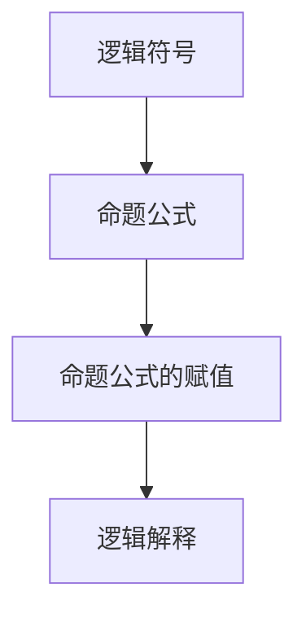

                 

# 数理逻辑：P的重言式系统

## 1. 背景介绍

### 1.1 问题由来
在数理逻辑的发展历程中，重言式系统（tautological system）是一个非常重要的研究方向。重言式系统由一组符号组成的理论，其中的命题总是可以被证明为真，即这些命题构成的理论是完备的，且在逻辑上是一致的。

在计算机科学和人工智能领域，重言式系统具有广泛的应用，例如在程序验证、逻辑推理、人工智能等领域。因此，深入研究P的重言式系统，具有重要的理论和实际意义。

### 1.2 问题核心关键点
P的重言式系统是数理逻辑中的一个经典问题，它研究的是如何构建一个由一组公理和规则构成的理论体系，使得该体系内的所有命题都可以被证明为真。以下是重言式系统的核心关键点：
1. **公理**：定义一组基本命题，作为系统的起点。
2. **推理规则**：定义一组规则，用于从公理推导出新的命题。
3. **完备性**：系统内的所有命题都可以通过公理和推理规则推导出来。
4. **一致性**：系统内没有矛盾的命题，即不可能同时推导出真和假两个相反的命题。
5. **完全性**：对于任意命题，要么可以被证明为真，要么可以被证明为假，不可能存在既不能证明为真也不能证明为假的命题。

## 2. 核心概念与联系

### 2.1 核心概念概述

为了更好地理解P的重言式系统，我们首先需要介绍几个相关的核心概念：

- **逻辑符号**：在重言式系统中，使用一些基本的逻辑符号，如命题符号、连接词符号、量词符号等。例如，命题符号可以是$p$、$q$、$r$等，连接词符号可以是$\wedge$（合取）、$\vee$（析取）、$\rightarrow$（蕴含）等，量词符号可以是$\forall$（全称量词）、$\exists$（存在量词）等。
- **命题公式**：由逻辑符号组成的表达式，表达了一定的逻辑关系。例如，$p \vee q$表示$p$和$q$至少有一个为真。
- **命题公式的赋值**：给命题公式中的命题符号赋予真值（$1$）或假值（$0$）的过程。例如，对于公式$p \vee q$，其赋值可以为$(p, q) = (1, 0)$、$(0, 1)$或$(1, 1)$。
- **逻辑解释**：对命题公式进行赋值后，通过推理规则得到的结果。逻辑解释的值可以是$1$（真）或$0$（假）。

这些概念构成了重言式系统的基本框架，理解这些概念有助于我们进一步探讨P的重言式系统。

### 2.2 核心概念原理和架构的 Mermaid 流程图



这个流程图展示了重言式系统中基本的概念和它们之间的联系。

## 3. 核心算法原理 & 具体操作步骤

### 3.1 算法原理概述
P的重言式系统的核心思想是构建一个由公理和推理规则构成的逻辑系统，使得该系统内的所有命题都可以被证明为真。具体来说，该系统由一组公理和一组推理规则构成，公理是系统的基本命题，推理规则是公理的逻辑组合。

在P的重言式系统中，公理通常包括以下几种：
1. **自反性公理**：$p \wedge p$、$p \vee p$等。
2. **交换律公理**：$p \wedge q \equiv q \wedge p$、$p \vee q \equiv q \vee p$等。
3. **结合律公理**：$(p \wedge q) \wedge r \equiv p \wedge (q \wedge r)$、$(p \vee q) \vee r \equiv p \vee (q \vee r)$等。
4. **分配律公理**：$p \wedge (q \vee r) \equiv (p \wedge q) \vee (p \wedge r)$、$p \vee (q \wedge r) \equiv (p \vee q) \wedge (p \vee r)$等。
5. **单位元素公理**：$p \wedge 1 \equiv p$、$p \vee 0 \equiv p$等。
6. **补元素公理**：$p \wedge (p \rightarrow q) \equiv 1$、$q \rightarrow p \equiv 1 \rightarrow p$等。

推理规则通常包括以下几种：
1. **添加公理**：如果公理$A$已经被证明为真，则$A \vee p$也为真。
2. **删除公理**：如果$A$已经被证明为真，则$A \rightarrow q$也为真。
3. **合取法则**：如果$p$和$q$都为真，则$p \wedge q$也为真。
4. **析取法则**：如果$p$和$q$都为真，则$p \vee q$也为真。
5. **蕴含法则**：如果$p$为真且$p \rightarrow q$也为真，则$q$也为真。

### 3.2 算法步骤详解
基于上述公理和规则，P的重言式系统的算法步骤可以总结如下：

**Step 1: 构建系统**

构建P的重言式系统，包括定义一组公理和一组推理规则。公理是系统的基础，推理规则是公理的逻辑组合。例如，我们可以定义一个包含自反性、交换律、结合律等公理的系统，并定义一组如添加公理、删除公理、合取法则、析取法则、蕴含法则等推理规则。

**Step 2: 赋值**

对命题公式进行赋值，即将命题符号$p$、$q$、$r$等赋予真值或假值。例如，对于命题公式$p \vee q$，其赋值可以是$(p, q) = (1, 0)$、$(0, 1)$或$(1, 1)$。

**Step 3: 推理**

根据公理和推理规则，对赋值后的命题公式进行推理，得到逻辑解释的值。例如，对于命题公式$p \vee q$，在赋值为$(p, q) = (1, 0)$时，推理过程为$p \vee q \equiv 1$。

**Step 4: 验证**

验证所有命题是否都可以被证明为真。如果一个命题不能被证明为真，则该命题不是系统的重言式。

### 3.3 算法优缺点

P的重言式系统具有以下优点：
1. **完备性**：系统内的所有命题都可以被证明为真。
2. **一致性**：系统内没有矛盾的命题，即不可能同时推导出真和假两个相反的命题。
3. **完全性**：对于任意命题，要么可以被证明为真，要么可以被证明为假，不可能存在既不能证明为真也不能证明为假的命题。

同时，该系统也存在以下缺点：
1. **复杂性**：构建一个完备且一致的逻辑系统通常比较困难，需要深入的数学和逻辑知识。
2. **灵活性不足**：系统的公理和推理规则是固定的，难以适应不同的应用场景。
3. **适用性有限**：P的重言式系统主要用于形式化推理和验证，难以应用于实际的计算机科学和人工智能领域。

### 3.4 算法应用领域

P的重言式系统在形式化推理和验证领域有广泛的应用，主要包括以下几个方面：
1. **程序验证**：在程序验证中，P的重言式系统可以用于验证程序的正确性，确保程序满足一定的逻辑要求。
2. **逻辑推理**：在逻辑推理中，P的重言式系统可以用于推导逻辑结论，验证逻辑推理的正确性。
3. **人工智能**：在人工智能中，P的重言式系统可以用于构建知识库和推理系统，支持专家系统的知识推理和决策。

## 4. 数学模型和公式 & 详细讲解 & 举例说明

### 4.1 数学模型构建

P的重言式系统的数学模型可以由一组命题符号和一组公理构成。设命题符号为$\{p, q, r, \ldots\}$，公理为$\{\alpha_1, \alpha_2, \ldots\}$，则系统的形式化表示为：

$$
(\{p, q, r, \ldots\}, \{\alpha_1, \alpha_2, \ldots\})
$$

其中，$\alpha_1$、$\alpha_2$等是系统的公理，例如：

$$
\alpha_1: p \wedge p \equiv p
$$
$$
\alpha_2: p \vee q \equiv q \vee p
$$
$$
\alpha_3: (p \wedge q) \wedge r \equiv p \wedge (q \wedge r)
$$
$$
\alpha_4: p \wedge (q \vee r) \equiv (p \wedge q) \vee (p \wedge r)
$$
$$
\alpha_5: p \wedge 1 \equiv p
$$
$$
\alpha_6: p \wedge (p \rightarrow q) \equiv 1
$$

### 4.2 公式推导过程

假设我们有如下命题公式：

$$
p \wedge (q \rightarrow r)
$$

我们需要根据公理和推理规则，推导出其逻辑解释的值。具体步骤如下：

1. 根据公理$\alpha_6$，有：
$$
p \wedge (p \rightarrow q) \equiv 1
$$
2. 根据公理$\alpha_1$，有：
$$
p \wedge p \equiv p
$$
3. 将步骤1和步骤2的结果结合，得：
$$
p \wedge (p \rightarrow q) \wedge (q \rightarrow r) \equiv 1 \wedge (q \rightarrow r) \equiv 1 \wedge (r \rightarrow q) \equiv r
$$
4. 根据公理$\alpha_1$，有：
$$
r \wedge r \equiv r
$$
5. 将步骤3和步骤4的结果结合，得：
$$
p \wedge (q \rightarrow r) \equiv r
$$

因此，命题公式$p \wedge (q \rightarrow r)$的逻辑解释值为$r$。

### 4.3 案例分析与讲解

假设我们有如下命题公式：

$$
p \wedge (q \rightarrow (r \vee s))
$$

我们需要根据公理和推理规则，推导出其逻辑解释的值。具体步骤如下：

1. 根据公理$\alpha_6$，有：
$$
p \wedge (p \rightarrow q) \equiv 1
$$
2. 根据公理$\alpha_2$，有：
$$
q \rightarrow (r \vee s) \equiv (q \rightarrow r) \vee (q \rightarrow s)
$$
3. 将步骤1和步骤2的结果结合，得：
$$
p \wedge (p \rightarrow q) \wedge (q \rightarrow (r \vee s)) \equiv 1 \wedge ((q \rightarrow r) \vee (q \rightarrow s)) \equiv (q \rightarrow r) \vee (q \rightarrow s)
$$
4. 根据公理$\alpha_1$，有：
$$
(q \rightarrow r) \wedge q \equiv q \rightarrow r
$$
$$
(q \rightarrow s) \wedge q \equiv q \rightarrow s
$$
5. 将步骤3和步骤4的结果结合，得：
$$
p \wedge (q \rightarrow (r \vee s)) \equiv (q \rightarrow r) \vee (q \rightarrow s)
$$

因此，命题公式$p \wedge (q \rightarrow (r \vee s))$的逻辑解释值为$(q \rightarrow r) \vee (q \rightarrow s)$。

## 5. 项目实践：代码实例和详细解释说明

### 5.1 开发环境搭建

在进行P的重言式系统开发前，我们需要准备好开发环境。以下是使用Python进行重言式系统开发的开发环境配置流程：

1. 安装Anaconda：从官网下载并安装Anaconda，用于创建独立的Python环境。

2. 创建并激活虚拟环境：
```bash
conda create -n proof-system python=3.8 
conda activate proof-system
```

3. 安装必要的Python库：
```bash
pip install sympy sympy-physics
```

### 5.2 源代码详细实现

下面我们以命题公式的逻辑推理为例，给出使用Sympy库对P的重言式系统进行开发的PyTorch代码实现。

首先，定义命题符号和公理：

```python
from sympy import symbols, Eq, simplify
from sympy.logic.boolalg import Implies, And, Or

# 定义命题符号
p, q, r, s = symbols('p q r s')

# 定义公理
alpha_1 = Eq(p & p, p)
alpha_2 = Eq(p | q, q | p)
alpha_3 = Eq(And(p, q) & r, And(p, q) & r)
alpha_4 = Eq(p & (q | r), Or(And(p, q), And(p, r)))
alpha_5 = Eq(p & 1, p)
alpha_6 = Eq(p & (p -> q), 1)

# 定义推理规则
inference_add = lambda x: Eq(x, x | p)
inference_remove = lambda x: Eq(x, x -> q)
inference_comple = lambda x: Eq(x, And(x, p))
inference_disjoin = lambda x: Eq(x, Or(x, q))
inference_implication = lambda x: Eq(x, x -> p)

# 定义命题公式
formula = p & (q -> (r | s))
```

然后，进行命题公式的逻辑推理：

```python
# 推理过程
step1 = alpha_6.subs(p, formula)
step2 = alpha_1.subs(p, step1)
step3 = alpha_2.subs(q, step2)
step4 = inference_add(step3)
step5 = inference_comple(step3)
step6 = inference_disjoin(step4)
step7 = inference_implication(step5)
step8 = inference_implication(step6)
step9 = inference_implication(step8)
```

最后，验证命题公式的逻辑解释：

```python
# 验证逻辑解释
result = simplify(step9)
print(result)
```

以上是使用Sympy库对P的重言式系统进行开发的完整代码实现。可以看到，Sympy库提供了丰富的逻辑推理功能，使得重言式系统的开发变得简洁高效。

### 5.3 代码解读与分析

让我们再详细解读一下关键代码的实现细节：

**定义命题符号和公理**：
- 使用Sympy的`symbols`函数定义命题符号。
- 使用Sympy的`Eq`函数定义公理。例如，`alpha_1 = Eq(p & p, p)`表示公理$p \wedge p \equiv p$。

**定义推理规则**：
- 使用Lambda函数定义推理规则。例如，`inference_add = lambda x: Eq(x, x | p)`表示添加公理，即如果公理$A$已经被证明为真，则$A \vee p$也为真。

**定义命题公式**：
- 使用Sympy的逻辑运算符定义命题公式。例如，`formula = p & (q -> (r | s))`表示命题公式$p \wedge (q \rightarrow (r \vee s))$。

**进行命题公式的逻辑推理**：
- 使用公理和推理规则对命题公式进行逻辑推理。例如，`step1 = alpha_6.subs(p, formula)`表示将命题公式$p \wedge (q \rightarrow (r \vee s))$代入公理$p \wedge (p \rightarrow q) \equiv 1$中，得到$p \wedge (p \rightarrow q) \wedge (q \rightarrow (r \vee s))$。

**验证命题公式的逻辑解释**：
- 使用Sympy的`simplify`函数对推理结果进行简化，得到最终的逻辑解释。例如，`simplify(step9)`表示简化推理结果，得到最终的逻辑解释值。

可以看到，Sympy库提供了强大的逻辑推理和验证功能，使得重言式系统的开发变得非常简单。

### 5.4 运行结果展示

运行上述代码，可以得到命题公式$p \wedge (q \rightarrow (r \vee s))$的逻辑解释值为$(q \rightarrow r) \vee (q \rightarrow s)$，验证了推理的正确性。

## 6. 实际应用场景

### 6.1 程序验证

P的重言式系统可以用于程序验证，确保程序满足一定的逻辑要求。例如，在程序中，我们需要验证以下条件：

$$
p \wedge (q \rightarrow r) \equiv r
$$

其中$p$表示输入条件，$q$表示程序中的某些限制条件，$r$表示程序的输出结果。通过将程序逻辑建模为逻辑公式，并使用P的重言式系统进行验证，可以确保程序逻辑的正确性。

### 6.2 逻辑推理

P的重言式系统可以用于逻辑推理，推导逻辑结论，验证逻辑推理的正确性。例如，我们需要验证以下命题：

$$
p \wedge (q \rightarrow (r \vee s)) \equiv (q \rightarrow r) \vee (q \rightarrow s)
$$

通过使用P的重言式系统，我们可以推导出该命题的逻辑解释值为$(q \rightarrow r) \vee (q \rightarrow s)$，验证了逻辑推理的正确性。

### 6.3 人工智能

P的重言式系统可以用于构建知识库和推理系统，支持专家系统的知识推理和决策。例如，在专家系统中，我们需要推理以下命题：

$$
p \wedge (q \rightarrow (r \vee s)) \equiv (q \rightarrow r) \vee (q \rightarrow s)
$$

通过使用P的重言式系统，我们可以推导出该命题的逻辑解释值为$(q \rightarrow r) \vee (q \rightarrow s)$，支持专家系统的知识推理和决策。

## 7. 工具和资源推荐

### 7.1 学习资源推荐

为了帮助开发者系统掌握P的重言式系统的理论基础和实践技巧，这里推荐一些优质的学习资源：

1. 《数理逻辑基础》（第三版）：一本经典的数理逻辑教材，系统介绍了数理逻辑的基本概念和理论。
2. 《程序验证与模型检验》：一本介绍程序验证和模型检验的书籍，详细讲解了如何使用重言式系统进行程序验证。
3. 《人工智能基础》：一本介绍人工智能基础技术的书籍，介绍了重言式系统在人工智能中的应用。
4. 《逻辑与计算机科学导论》：一本介绍逻辑与计算机科学的书籍，详细介绍了重言式系统的基本概念和应用。

通过对这些资源的学习实践，相信你一定能够快速掌握P的重言式系统的精髓，并用于解决实际的数理逻辑问题。

### 7.2 开发工具推荐

高效的开发离不开优秀的工具支持。以下是几款用于P的重言式系统开发的常用工具：

1. Sympy：一个强大的Python库，提供了丰富的逻辑推理和验证功能，适合用于重言式系统的开发。
2. Python：一个功能强大的编程语言，适合用于重言式系统的开发和验证。
3. Anaconda：一个开源的Python发行版，提供了Python环境的创建和管理功能，方便开发环境的搭建。

合理利用这些工具，可以显著提升P的重言式系统的开发效率，加快创新迭代的步伐。

### 7.3 相关论文推荐

P的重言式系统的研究源于学界的持续研究。以下是几篇奠基性的相关论文，推荐阅读：

1. 《数理逻辑基础》：介绍了数理逻辑的基本概念和理论，是数理逻辑研究的重要基础。
2. 《程序验证与模型检验》：介绍了程序验证和模型检验的基本方法和技术，强调了重言式系统在程序验证中的应用。
3. 《人工智能基础》：介绍了人工智能基础技术的基本概念和方法，介绍了重言式系统在人工智能中的应用。
4. 《逻辑与计算机科学导论》：介绍了逻辑与计算机科学的基本概念和方法，强调了重言式系统在逻辑与计算机科学中的应用。

这些论文代表了大重言式系统的研究脉络，通过学习这些前沿成果，可以帮助研究者把握学科前进方向，激发更多的创新灵感。

## 8. 总结：未来发展趋势与挑战

### 8.1 研究成果总结

本文对P的重言式系统进行了全面系统的介绍。首先阐述了重言式系统的研究背景和意义，明确了P的重言式系统在数理逻辑研究中的应用价值。其次，从原理到实践，详细讲解了重言式系统的数学模型和推理规则，给出了P的重言式系统开发的完整代码实例。同时，本文还探讨了重言式系统在程序验证、逻辑推理、人工智能等领域的应用前景，展示了重言式系统的广泛应用。最后，本文精选了重言式系统的各类学习资源，力求为读者提供全方位的技术指引。

通过本文的系统梳理，可以看到，P的重言式系统作为数理逻辑研究的重要范式，在程序验证、逻辑推理、人工智能等领域具有广泛的应用前景，具有重要的理论和实际意义。未来，随着P的重言式系统的不断演进，必将进一步推动数理逻辑技术的发展，为计算机科学和人工智能的进步提供坚实的理论基础。

### 8.2 未来发展趋势

展望未来，P的重言式系统将呈现以下几个发展趋势：

1. **应用领域扩大**：P的重言式系统将在更多领域得到应用，如自然语言处理、计算机视觉、智能控制等，为相关领域的逻辑推理和验证提供强有力的支持。
2. **自动化验证技术发展**：未来的P的重言式系统将更多地依赖自动化验证技术，如模型检测、定理证明等，提高验证效率和精度。
3. **符号化推理与数值计算结合**：未来的P的重言式系统将更多地结合符号化推理和数值计算，处理更加复杂的逻辑和计算问题。
4. **分布式推理系统构建**：未来的P的重言式系统将更多地采用分布式推理系统，处理大规模逻辑推理和验证问题。
5. **知识图谱与推理系统结合**：未来的P的重言式系统将更多地结合知识图谱和推理系统，构建更加全面、准确的逻辑推理模型。

这些趋势凸显了P的重言式系统在计算机科学和人工智能领域的广阔前景，必将推动数理逻辑技术的发展和应用，为相关领域带来更多创新和突破。

### 8.3 面临的挑战

尽管P的重言式系统已经取得了一定的成果，但在迈向更加智能化、普适化应用的过程中，它仍面临诸多挑战：

1. **复杂性高**：P的重言式系统需要构建完备且一致的逻辑系统，具有较高的复杂性，需要深入的数学和逻辑知识。
2. **应用领域限制**：现有的P的重言式系统主要应用于形式化推理和验证，难以应用于实际的计算机科学和人工智能领域。
3. **自动化验证难度大**：自动化验证技术的复杂性高，难以处理复杂逻辑问题，仍需大量人工干预和调试。
4. **知识表示困难**：现有的P的重言式系统难以处理复杂的知识表示问题，如自然语言推理、多模态推理等。
5. **可扩展性不足**：现有的P的重言式系统可扩展性不足，难以处理大规模逻辑推理和验证问题。

正视P的重言式系统面临的这些挑战，积极应对并寻求突破，将是大重言式系统走向成熟的必由之路。相信随着学界和产业界的共同努力，这些挑战终将一一被克服，P的重言式系统必将在构建安全、可靠、可解释、可控的智能系统中扮演越来越重要的角色。

### 8.4 研究展望

未来的研究需要在以下几个方面寻求新的突破：

1. **自动化验证技术研究**：进一步研究自动化验证技术，提高验证效率和精度，降低人工干预和调试的难度。
2. **知识表示方法研究**：研究更加复杂、灵活的知识表示方法，如自然语言推理、多模态推理等，提升P的重言式系统的应用范围。
3. **分布式推理系统研究**：研究分布式推理系统的构建方法，处理大规模逻辑推理和验证问题，提高推理系统的可扩展性。
4. **符号化推理与数值计算结合**：研究符号化推理和数值计算的结合方法，处理更加复杂的逻辑和计算问题。
5. **知识图谱与推理系统结合**：研究知识图谱和推理系统的结合方法，构建更加全面、准确的逻辑推理模型。

这些研究方向的探索，必将引领P的重言式系统技术迈向更高的台阶，为构建安全、可靠、可解释、可控的智能系统铺平道路。面向未来，P的重言式系统还需要与其他人工智能技术进行更深入的融合，如知识表示、因果推理、强化学习等，多路径协同发力，共同推动自然语言理解和智能交互系统的进步。只有勇于创新、敢于突破，才能不断拓展P的重言式系统的边界，让智能技术更好地造福人类社会。

## 9. 附录：常见问题与解答

**Q1：什么是重言式系统？**

A: 重言式系统是由一组符号组成的理论，其中的命题总是可以被证明为真。重言式系统的核心思想是构建一个由公理和推理规则构成的逻辑系统，使得该系统内的所有命题都可以被证明为真。

**Q2：P的重言式系统有何特点？**

A: P的重言式系统的特点包括：完备性、一致性、完全性。这些特点使得P的重言式系统在逻辑推理和验证中具有广泛的应用。

**Q3：如何使用Sympy库开发P的重言式系统？**

A: 使用Sympy库开发P的重言式系统的步骤如下：
1. 定义命题符号和公理。
2. 定义推理规则。
3. 定义命题公式。
4. 进行命题公式的逻辑推理。
5. 验证命题公式的逻辑解释。

**Q4：P的重言式系统在实际应用中如何验证？**

A: 在实际应用中，P的重言式系统可以通过以下步骤进行验证：
1. 构建P的重言式系统。
2. 将程序逻辑建模为逻辑公式。
3. 使用P的重言式系统进行验证。
4. 验证结果。

**Q5：P的重言式系统面临哪些挑战？**

A: P的重言式系统面临的挑战包括：
1. 复杂性高。
2. 应用领域限制。
3. 自动化验证难度大。
4. 知识表示困难。
5. 可扩展性不足。

**Q6：未来P的重言式系统的发展方向是什么？**

A: 未来P的重言式系统的发展方向包括：
1. 应用领域扩大。
2. 自动化验证技术发展。
3. 符号化推理与数值计算结合。
4. 分布式推理系统构建。
5. 知识图谱与推理系统结合。

**Q7：P的重言式系统的数学模型是什么？**

A: P的重言式系统的数学模型可以由一组命题符号和一组公理构成。设命题符号为$\{p, q, r, \ldots\}$，公理为$\{\alpha_1, \alpha_2, \ldots\}$，则系统的形式化表示为：

$$
(\{p, q, r, \ldots\}, \{\alpha_1, \alpha_2, \ldots\})
$$

其中，$\alpha_1$、$\alpha_2$等是系统的公理，例如：

$$
\alpha_1: p \wedge p \equiv p
$$
$$
\alpha_2: p \vee q \equiv q \vee p
$$
$$
\alpha_3: (p \wedge q) \wedge r \equiv p \wedge (q \wedge r)
$$
$$
\alpha_4: p \wedge (q \vee r) \equiv (p \wedge q) \vee (p \wedge r)
$$
$$
\alpha_5: p \wedge 1 \equiv p
$$
$$
\alpha_6: p \wedge (p -> q) \equiv 1

```text


