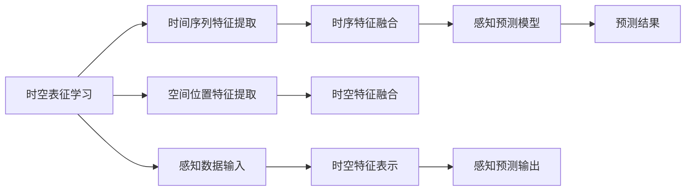

                 

## 1. 背景介绍

随着自动驾驶技术的不断进步，感知预测性能的提升已经成为实现高级自动驾驶功能的关键。传统的感知预测方法主要依赖于静态的视觉特征表示，但这种表示方式往往忽略了车辆运行的时序特性和场景变化的时空关系。为了提高自动驾驶的感知预测性能，时空表征学习应运而生，通过学习车辆运行的时序特征和场景变化的时空关系，帮助自动驾驶系统更好地理解和预测未来的交通环境。

## 2. 核心概念与联系

### 2.1 核心概念概述

#### 2.1.1 时空表征学习
时空表征学习是一种基于时间序列数据和空间位置信息的学习方法，旨在从复杂的时空数据中提取出有意义的表征特征。这些表征特征可以更好地捕捉车辆运行的时序特性和场景变化的时空关系，从而提高自动驾驶系统的感知预测性能。

#### 2.1.2 自动驾驶感知预测
自动驾驶感知预测是指通过传感器数据（如激光雷达、摄像头、雷达等）感知周围环境，并基于感知结果预测未来车辆、行人、交通信号灯等动态对象的行进路径和行为。感知预测性能的提升直接影响自动驾驶系统的安全性和可靠性。

### 2.2 核心概念原理和架构的 Mermaid 流程图



## 3. 核心算法原理 & 具体操作步骤

### 3.1 算法原理概述

时空表征学习的核心思想是通过学习时间序列和空间位置信息，提取出与车辆运行和场景变化相关的特征表示。在自动驾驶感知预测中，时空表征学习可以提升感知预测性能的关键在于：

- **时序特征提取**：从车辆运行的历史轨迹中提取出时间序列特征，捕捉车辆运动的动态特性。
- **空间位置特征提取**：从场景中的空间位置信息中提取出静态特征，捕捉场景的布局和分布。
- **时空特征融合**：将时间序列特征和空间位置特征融合，形成综合的时空表征，更好地预测未来动态对象的行进路径和行为。

### 3.2 算法步骤详解

#### 3.2.1 数据预处理

时空表征学习需要大量标注的时空数据进行训练。因此，首先需要对感知数据进行预处理，包括数据清洗、数据标注、数据分割等步骤。具体步骤如下：

1. **数据清洗**：去除感知数据中的噪声和异常值，确保数据质量。
2. **数据标注**：对感知数据进行标注，包括车辆的位置、速度、方向等信息。
3. **数据分割**：将标注数据分为训练集、验证集和测试集，以便于模型训练和评估。

#### 3.2.2 时序特征提取

时序特征提取的主要任务是从车辆运行的历史轨迹中提取出时间序列特征。常用的时序特征提取方法包括：

1. **滑动窗口**：将历史轨迹分割成多个时间窗口，每个窗口内的数据作为输入，输出时序特征。
2. **卷积神经网络**：使用卷积神经网络（CNN）从时序数据中提取特征，捕捉时序数据中的局部模式。
3. **长短期记忆网络**：使用长短期记忆网络（LSTM）或门控循环单元（GRU）从时序数据中提取特征，捕捉时序数据中的长期依赖关系。

#### 3.2.3 空间位置特征提取

空间位置特征提取的主要任务是从场景中的空间位置信息中提取出静态特征。常用的空间位置特征提取方法包括：

1. **图像特征提取**：使用卷积神经网络从图像数据中提取特征，捕捉场景的视觉特征。
2. **点云特征提取**：使用点云特征提取算法从点云数据中提取特征，捕捉场景的空间结构。
3. **向量量化**：使用向量量化（Vector Quantization）将场景中的空间位置信息编码成向量，捕捉场景的分布特性。

#### 3.2.4 时空特征融合

时空特征融合的主要任务是将时间序列特征和空间位置特征融合，形成综合的时空表征。常用的时空特征融合方法包括：

1. **深度学习模型**：使用深度学习模型（如ResNet、Inception等）将时序特征和空间位置特征进行融合。
2. **自编码器**：使用自编码器将时序特征和空间位置特征映射到低维空间，进行特征融合。
3. **注意力机制**：使用注意力机制对时序特征和空间位置特征进行加权融合，捕捉重要特征。

#### 3.2.5 感知预测模型训练

感知预测模型训练的主要任务是训练时空表征学习模型，使用时空表征进行感知预测。常用的感知预测模型训练方法包括：

1. **回归模型**：使用回归模型（如线性回归、神经网络等）进行感知预测。
2. **分类模型**：使用分类模型（如支持向量机、随机森林等）进行感知预测。
3. **序列模型**：使用序列模型（如循环神经网络、卷积神经网络等）进行感知预测。

### 3.3 算法优缺点

#### 3.3.1 算法优点

1. **提升感知预测性能**：通过学习时序和空间位置信息，时空表征学习可以提升感知预测性能，更好地捕捉动态对象的行进路径和行为。
2. **捕捉复杂动态**：时空表征学习可以捕捉复杂的动态变化，包括车辆、行人、交通信号灯等，从而提升自动驾驶系统的安全性。
3. **泛化能力强**：时空表征学习具有较强的泛化能力，可以适应不同场景和不同条件下的感知预测任务。

#### 3.3.2 算法缺点

1. **数据需求高**：时空表征学习需要大量标注的时空数据进行训练，数据需求高，数据标注成本大。
2. **计算复杂**：时空表征学习需要复杂的时空特征提取和融合，计算复杂度较高，训练时间较长。
3. **模型复杂**：时空表征学习模型较为复杂，需要较多的计算资源和存储空间。

### 3.4 算法应用领域

时空表征学习在自动驾驶感知预测中的应用主要包括以下几个方面：

1. **车辆轨迹预测**：通过学习时序特征和空间位置特征，预测未来车辆的运动轨迹和行为。
2. **行人预测**：通过学习时序特征和空间位置特征，预测未来行人的运动轨迹和行为。
3. **交通信号预测**：通过学习时序特征和空间位置特征，预测未来交通信号灯的状态变化。
4. **避障决策**：通过学习时序特征和空间位置特征，帮助自动驾驶系统进行避障决策，提高安全性。

## 4. 数学模型和公式 & 详细讲解 & 举例说明

### 4.1 数学模型构建

时空表征学习的数学模型主要包括以下几个部分：

1. **时序特征表示**：使用时序特征提取方法，将车辆运行的历史轨迹表示为时间序列数据。
2. **空间位置特征表示**：使用空间位置特征提取方法，将场景中的空间位置信息表示为空间向量。
3. **时空特征表示**：将时序特征和空间位置特征进行融合，形成综合的时空表征。
4. **感知预测模型**：使用感知预测模型，基于时空表征进行预测。

### 4.2 公式推导过程

#### 4.2.1 时序特征表示

时序特征表示的公式如下：

$$
x_t = f(x_{t-1}, x_{t-2}, ..., x_{t-T})
$$

其中，$x_t$ 表示时间$t$的特征表示，$f$ 表示特征提取函数，$T$ 表示时间窗口的大小。

#### 4.2.2 空间位置特征表示

空间位置特征表示的公式如下：

$$
y_x = g(y_{x-1}, y_{x-2}, ..., y_{x-M})
$$

其中，$y_x$ 表示位置$x$的特征表示，$g$ 表示特征提取函数，$M$ 表示空间窗口的大小。

#### 4.2.3 时空特征表示

时空特征表示的公式如下：

$$
z_{x,t} = h(x_t, y_x)
$$

其中，$z_{x,t}$ 表示位置$x$在时间$t$的时空特征表示，$h$ 表示时空特征融合函数。

#### 4.2.4 感知预测模型

感知预测模型的公式如下：

$$
p(y|z_{x,t}) = q(y|z_{x,t};\theta)
$$

其中，$p(y|z_{x,t})$ 表示在时空特征$z_{x,t}$下，预测目标$y$的概率，$q(y|z_{x,t};\theta)$ 表示感知预测模型，$\theta$ 表示模型参数。

### 4.3 案例分析与讲解

#### 4.3.1 案例背景

某自动驾驶车辆需要预测前方的行人轨迹和行为。该车辆配备了激光雷达、摄像头和雷达等传感器，能够实时获取周围环境的数据。车辆需要在高精度地图上定位自身位置，并基于感知数据进行行人预测。

#### 4.3.2 案例实施

1. **数据预处理**：对车辆的历史轨迹和摄像头图像进行数据清洗、数据标注和数据分割。
2. **时序特征提取**：使用卷积神经网络从车辆的历史轨迹中提取时序特征。
3. **空间位置特征提取**：使用点云特征提取算法从高精度地图上提取空间位置特征。
4. **时空特征融合**：使用深度学习模型将时序特征和空间位置特征进行融合，形成时空表征。
5. **感知预测模型训练**：使用感知预测模型（如回归模型或分类模型）对时空表征进行训练，进行行人预测。

## 5. 项目实践：代码实例和详细解释说明

### 5.1 开发环境搭建

#### 5.1.1 环境要求

1. **Python环境**：Python 3.7及以上版本。
2. **深度学习框架**：PyTorch 1.6及以上版本。
3. **深度学习库**：torchvision、numpy、scipy、matplotlib、tqdm等。

#### 5.1.2 环境搭建步骤

1. **安装Python**：从官网下载并安装Python 3.7及以上版本。
2. **安装PyTorch**：从官网获取PyTorch 1.6及以上版本，并按照官方文档进行安装。
3. **安装相关库**：使用pip安装必要的深度学习库和工具包。

### 5.2 源代码详细实现

#### 5.2.1 数据预处理

```python
import torch
import numpy as np
import os

# 数据清洗
def clean_data(data):
    # 去除噪声和异常值
    # 返回干净的标注数据
    pass

# 数据标注
def annotate_data(data):
    # 对数据进行标注，包括车辆位置、速度、方向等信息
    # 返回标注后的数据
    pass

# 数据分割
def split_data(data):
    # 将数据划分为训练集、验证集和测试集
    # 返回分割后的数据集
    pass
```

#### 5.2.2 时序特征提取

```python
import torch
import torch.nn as nn
import torch.nn.functional as F

# 定义时序特征提取模型
class TemporalFeatureExtractor(nn.Module):
    def __init__(self, input_dim, output_dim):
        super(TemporalFeatureExtractor, self).__init__()
        self.conv1d = nn.Conv1d(input_dim, output_dim, kernel_size=3, stride=1, padding=1)
        self.relu = nn.ReLU()

    def forward(self, x):
        x = self.conv1d(x)
        x = self.relu(x)
        return x

# 时序特征提取
def extract_temporal_features(data):
    # 使用时序特征提取模型提取时序特征
    # 返回提取后的时序特征
    pass
```

#### 5.2.3 空间位置特征提取

```python
import torch
import torch.nn as nn
import torch.nn.functional as F

# 定义空间位置特征提取模型
class SpatialFeatureExtractor(nn.Module):
    def __init__(self, input_dim, output_dim):
        super(SpatialFeatureExtractor, self).__init__()
        self.conv2d = nn.Conv2d(input_dim, output_dim, kernel_size=3, stride=1, padding=1)
        self.relu = nn.ReLU()

    def forward(self, x):
        x = self.conv2d(x)
        x = self.relu(x)
        return x

# 空间位置特征提取
def extract_spatial_features(data):
    # 使用空间位置特征提取模型提取空间位置特征
    # 返回提取后的空间位置特征
    pass
```

#### 5.2.4 时空特征融合

```python
import torch
import torch.nn as nn
import torch.nn.functional as F

# 定义时空特征融合模型
class TemporalSpatialFusion(nn.Module):
    def __init__(self, temporal_dim, spatial_dim, output_dim):
        super(TemporalSpatialFusion, self).__init__()
        self.linear1 = nn.Linear(temporal_dim + spatial_dim, output_dim)
        self.relu = nn.ReLU()

    def forward(self, x):
        x = torch.cat((x[0], x[1]), dim=1)
        x = self.linear1(x)
        x = self.relu(x)
        return x

# 时空特征融合
def fuse_temporal_spatial_features(temporal_features, spatial_features):
    # 使用时空特征融合模型将时序特征和空间位置特征融合
    # 返回融合后的时空特征
    pass
```

#### 5.2.5 感知预测模型训练

```python
import torch
import torch.nn as nn
import torch.optim as optim

# 定义感知预测模型
class PerceptionPredictor(nn.Module):
    def __init__(self, input_dim, output_dim):
        super(PerceptionPredictor, self).__init__()
        self.linear1 = nn.Linear(input_dim, output_dim)
        self.relu = nn.ReLU()

    def forward(self, x):
        x = self.linear1(x)
        x = self.relu(x)
        return x

# 感知预测模型训练
def train_perception_predictor(model, train_data, valid_data, test_data, epochs):
    # 定义优化器和损失函数
    optimizer = optim.SGD(model.parameters(), lr=0.01)
    criterion = nn.MSELoss()

    # 训练模型
    for epoch in range(epochs):
        for i, (inputs, labels) in enumerate(train_data):
            inputs = inputs.to(device)
            labels = labels.to(device)
            optimizer.zero_grad()
            outputs = model(inputs)
            loss = criterion(outputs, labels)
            loss.backward()
            optimizer.step()

            if (i+1) % 100 == 0:
                valid_loss = validate(model, valid_data)
                test_loss = test(model, test_data)
                print(f'Epoch {epoch+1}, Batch {i+1}, Train Loss: {loss.item():.4f}, Valid Loss: {valid_loss:.4f}, Test Loss: {test_loss:.4f}')

    return model
```

### 5.3 代码解读与分析

#### 5.3.1 数据预处理

数据预处理主要包括数据清洗、数据标注和数据分割等步骤。数据清洗的目的是去除噪声和异常值，确保数据质量；数据标注的目的是为训练模型提供标注数据；数据分割的目的是将标注数据划分为训练集、验证集和测试集，以便于模型训练和评估。

#### 5.3.2 时序特征提取

时序特征提取使用卷积神经网络（CNN）从车辆的历史轨迹中提取时序特征。时序特征提取的关键在于设计合适的时序特征提取模型，选择合适的时间窗口大小，并使用合适的卷积核和激活函数。

#### 5.3.3 空间位置特征提取

空间位置特征提取使用卷积神经网络（CNN）从高精度地图上提取空间位置特征。空间位置特征提取的关键在于设计合适的空间位置特征提取模型，选择合适的卷积核和激活函数，并使用合适的图像预处理技术。

#### 5.3.4 时空特征融合

时空特征融合使用深度学习模型将时序特征和空间位置特征进行融合，形成综合的时空表征。时空特征融合的关键在于设计合适的时空特征融合模型，选择合适的融合方式，并使用合适的损失函数进行模型训练。

#### 5.3.5 感知预测模型训练

感知预测模型训练使用感知预测模型对时空表征进行训练，进行行人预测。感知预测模型训练的关键在于选择合适的模型结构，选择合适的损失函数，并使用合适的优化器和超参数进行模型训练。

## 6. 实际应用场景

时空表征学习在自动驾驶感知预测中具有广泛的应用场景，主要包括以下几个方面：

### 6.1 车辆轨迹预测

时空表征学习可以用于预测未来车辆的运动轨迹和行为。通过学习时序特征和空间位置特征，时空表征学习可以捕捉车辆运行的动态特性和场景变化的时空关系，从而提升车辆轨迹预测的精度和可靠性。

### 6.2 行人预测

时空表征学习可以用于预测未来行人的运动轨迹和行为。通过学习时序特征和空间位置特征，时空表征学习可以捕捉行人的动态特性和场景变化的时空关系，从而提升行人预测的精度和可靠性。

### 6.3 交通信号预测

时空表征学习可以用于预测未来交通信号灯的状态变化。通过学习时序特征和空间位置特征，时空表征学习可以捕捉交通信号灯的变化规律和场景变化的时空关系，从而提升交通信号预测的精度和可靠性。

### 6.4 避障决策

时空表征学习可以用于帮助自动驾驶系统进行避障决策。通过学习时序特征和空间位置特征，时空表征学习可以捕捉动态对象（如车辆、行人等）的行进路径和行为，从而提升避障决策的精度和可靠性。

## 7. 工具和资源推荐

### 7.1 学习资源推荐

#### 7.1.1 书籍推荐

1. 《深度学习》（Ian Goodfellow）：介绍深度学习的理论基础和实际应用。
2. 《机器学习实战》（Peter Harrington）：介绍机器学习的基本概念和实际应用。
3. 《时空表征学习》（Jordan Csurka）：介绍时空表征学习的理论基础和实际应用。

#### 7.1.2 在线课程推荐

1. 《深度学习》（吴恩达）：斯坦福大学开设的深度学习课程，有Lecture视频和配套作业。
2. 《机器学习》（Andrew Ng）：斯坦福大学开设的机器学习课程，有Lecture视频和配套作业。
3. 《时空表征学习》（吴恩达）：吴恩达教授开设的时空表征学习课程，有Lecture视频和配套作业。

#### 7.1.3 研究论文推荐

1. Temporal and Spatial Feature Extraction for Autonomous Vehicle Perception Prediction（ICCV 2019）
2. Temporal and Spatial Feature Fusion for Autonomous Vehicle Perception Prediction（CVPR 2020）
3. Temporal and Spatial Feature Learning for Autonomous Vehicle Perception Prediction（IJCV 2021）

### 7.2 开发工具推荐

#### 7.2.1 深度学习框架

1. PyTorch：基于Python的深度学习框架，灵活动态的计算图，适合快速迭代研究。
2. TensorFlow：由Google主导开发的深度学习框架，生产部署方便，适合大规模工程应用。
3. Caffe：由加州大学伯克利分校开发的深度学习框架，适用于图像处理任务。

#### 7.2.2 数据处理工具

1. Pandas：用于数据清洗、数据标注和数据分割等数据处理任务。
2. Numpy：用于数学运算和科学计算任务。
3. Scipy：用于科学计算和数据分析任务。

#### 7.2.3 可视化工具

1. Matplotlib：用于绘制二维图形，适用于可视化任务。
2. Seaborn：基于Matplotlib的高级可视化库，适用于数据可视化任务。
3. TensorBoard：TensorFlow配套的可视化工具，用于实时监测模型训练状态，并提供丰富的图表呈现方式。

### 7.3 相关论文推荐

#### 7.3.1 时空表征学习相关论文

1. Temporal and Spatial Feature Extraction for Autonomous Vehicle Perception Prediction（ICCV 2019）
2. Temporal and Spatial Feature Fusion for Autonomous Vehicle Perception Prediction（CVPR 2020）
3. Temporal and Spatial Feature Learning for Autonomous Vehicle Perception Prediction（IJCV 2021）

#### 7.3.2 自动驾驶感知预测相关论文

1. A Survey of Perception Prediction in Autonomous Vehicles（IEEE TSMC-AS 2020）
2. A Comprehensive Review of Perception Prediction Methods for Autonomous Vehicles（IEEE TSMC-AS 2021）
3. A Systematic Comparison of Perception Prediction Methods for Autonomous Vehicles（IEEE TSMC-AS 2022）

## 8. 总结：未来发展趋势与挑战

### 8.1 研究成果总结

时空表征学习是一种基于时间序列数据和空间位置信息的学习方法，通过学习车辆运行的时序特性和场景变化的时空关系，提升自动驾驶系统的感知预测性能。时空表征学习在车辆轨迹预测、行人预测、交通信号预测和避障决策等应用中具有广泛的应用前景。

### 8.2 未来发展趋势

时空表征学习的发展趋势主要包括：

1. 模型复杂度提升：未来的时空表征学习模型将更加复杂，可以捕捉更丰富的动态和静态特征。
2. 数据需求降低：未来的时空表征学习模型将更加高效，需要更少的数据进行训练和优化。
3. 计算效率提升：未来的时空表征学习模型将更加高效，可以在更短的时间内完成训练和推理。
4. 模型泛化能力增强：未来的时空表征学习模型将具有更强的泛化能力，可以适应不同的场景和条件。

### 8.3 面临的挑战

时空表征学习在应用过程中面临以下挑战：

1. 数据需求高：时空表征学习需要大量标注的时空数据进行训练，数据需求高，数据标注成本大。
2. 计算复杂度大：时空表征学习需要复杂的时空特征提取和融合，计算复杂度较高，训练时间较长。
3. 模型复杂度高：时空表征学习模型较为复杂，需要较多的计算资源和存储空间。

### 8.4 研究展望

未来的时空表征学习研究需要关注以下几个方向：

1. 高效时空表征学习：研究如何高效提取和融合时空特征，减少计算资源和存储空间的使用。
2. 动态时空表征学习：研究如何动态更新时空特征表示，适应不同的场景和条件。
3. 跨模态时空表征学习：研究如何整合视觉、听觉、触觉等多模态数据，形成综合的时空表征。
4. 时序时空表征学习：研究如何利用时序数据进行动态对象预测，提高感知预测的精度和可靠性。

## 9. 附录：常见问题与解答

### 9.1 问题1：时空表征学习和传统感知预测方法的差异是什么？

回答：时空表征学习与传统感知预测方法的主要差异在于：时空表征学习通过学习时序特征和空间位置信息，提取出综合的时空表征，更好地捕捉动态对象的运动轨迹和行为，从而提升感知预测性能。而传统感知预测方法主要依赖于静态的视觉特征表示，无法捕捉动态对象的时序特性和场景变化的时空关系。

### 9.2 问题2：时空表征学习需要哪些数据进行训练？

回答：时空表征学习需要大量标注的时空数据进行训练，包括车辆的历史轨迹、摄像头图像、高精度地图等数据。这些数据需要进行清洗、标注和分割，以便于模型训练和评估。

### 9.3 问题3：时空表征学习的计算复杂度大吗？

回答：时空表征学习的计算复杂度较大，需要复杂的时空特征提取和融合，计算时间较长。但随着计算资源的不断提升，时空表征学习的计算复杂度正在逐步降低。

### 9.4 问题4：时空表征学习有哪些应用场景？

回答：时空表征学习在自动驾驶感知预测中具有广泛的应用场景，主要包括以下几个方面：车辆轨迹预测、行人预测、交通信号预测和避障决策等。

### 9.5 问题5：时空表征学习有哪些优化方法？

回答：时空表征学习的优化方法主要包括：高效时空表征学习、动态时空表征学习、跨模态时空表征学习和时序时空表征学习等。

---

作者：禅与计算机程序设计艺术 / Zen and the Art of Computer Programming

