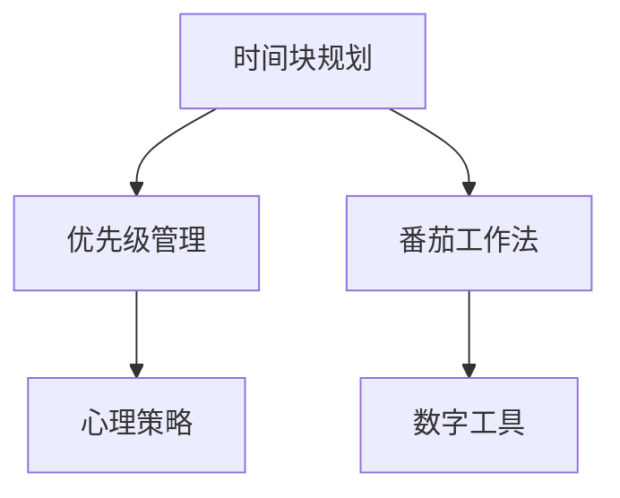

                 

# 时间管理：高效利用时间

> 关键词：时间管理, 高效利用, 生产力提升, 优先级管理, 时间块规划, 数字工具, 心理策略

## 1. 背景介绍

### 1.1 问题由来
在当今快速变化且充满竞争的现代社会中，有效的时间管理能力成为个体实现高效工作与生活的关键。不论是在学术研究、商业运营还是日常生活管理中，个体都需要掌握有效的策略来合理安排时间，以应对日益复杂多变的环境和任务。因此，时间管理不仅是一门技术，更是一门艺术，它涉及到如何优化时间配置以提升生产力、满足个人需求以及应对不确定性的挑战。

### 1.2 问题核心关键点
时间管理的核心在于如何高效地规划和利用有限的时间资源，以实现个人和组织的最大化效益。关键点包括：
- 设定清晰的优先级：在众多任务中识别哪些任务最为重要，并优先处理。
- 制定明确的时间块规划：将时间分割成可管理的小块，以实现持续的专注和高效率。
- 使用有效的数字工具：利用应用程序和软件来追踪时间、设置提醒、优化任务安排。
- 实施心理策略：如番茄工作法、时间盒技术，以改善注意力和自律性。

### 1.3 问题研究意义
时间管理的研究和实践有助于个体在职业生涯中更好地规划和管理时间，从而提升个人效率、实现目标、减少压力，并提高生活质量。在企业和组织层面，有效的时管理能够促进团队协作、增强决策质量、提升组织绩效。研究时间管理的方法与策略，不仅有助于理解个体行为模式，还能为企业提供有效的管理工具和策略，推动企业向更高效率、更高质量的方向发展。

## 2. 核心概念与联系

### 2.1 核心概念概述

时间管理是一门集技术、艺术与心理学于一体的综合性学科。以下是构成时间管理核心概念的几个关键要素：

- **时间块规划(Time Blocking)**：将一天或一周的时间分成若干个块，每个时间块专注于一个特定任务或活动。
- **优先级管理(Priority Management)**：根据任务的紧急程度和重要性来确定处理顺序。
- **番茄工作法(Pomodoro Technique)**：通过25分钟的高强度专注工作和5分钟的短暂休息来提升工作效率。
- **数字工具(Digital Tools)**：如Trello、Asana、Google Calendar等，用于任务安排、时间跟踪和提醒设置。
- **心理策略(Psychological Strategies)**：如自我激励、心理适应等，帮助个体应对压力、提升自律性。

这些核心概念之间的逻辑关系可以通过以下Mermaid流程图来展示：



这个流程图展示了时间管理的基本逻辑框架，其中每个核心概念都直接或间接地影响到整体的时间利用效率。

## 3. 核心算法原理 & 具体操作步骤
### 3.1 算法原理概述

时间管理的时间块规划算法原理基于“时间即资源”的观念，认为时间是一种稀缺的、有限的资源，通过高效分配和利用这一资源，可以实现个人目标和需求的满足。时间块规划的核心在于，将时间分割成若干个固定长度的时间段，每个时间段专注于完成一个具体的任务，从而提高任务完成的效率和质量。

### 3.2 算法步骤详解

时间块规划的具体步骤包括：

1. **任务清单制作**：列出所有需要完成的任务和活动，并根据重要性和紧急程度进行排序。
2. **时间块划分**：将一天或一周的时间划分为若干个时间块，每个时间块约25-30分钟不等。
3. **任务分配**：将任务分配到各个时间块中，每个时间块专注于一个任务，直到任务完成或时间块结束。
4. **休息时间安排**：在每个时间块之间安排5-10分钟的短暂休息，以恢复精力。
5. **定期评估**：定期评估时间块规划的效果，调整时间分配策略以适应任务的变化。

### 3.3 算法优缺点

时间块规划的优点包括：
- **提高专注度**：通过固定时间段专注于单一任务，减少任务切换的干扰，提升工作效率。
- **减少拖延**：明确的时间段安排和截止时间可以激励个体按时完成任务，减少拖延行为。
- **灵活调整**：可以根据任务变化灵活调整时间块划分，适应不同任务需求。

时间块规划的缺点包括：
- **固定性限制**：对于突发情况和不可预见的任务，时间块规划的固定性可能成为限制。
- **缺乏弹性**：在时间块规划中，若一个时间块内未完成任务，后续任务可能会受到影响。
- **依赖自律性**：需要高度的自律性和自我管理能力，才能有效执行时间块规划。

### 3.4 算法应用领域

时间块规划在多个领域中都有广泛的应用，包括：
- **学术研究**：帮助学者有效安排实验、阅读和撰写论文的时间。
- **商业管理**：提高企业团队的会议效率、项目执行和日常操作。
- **个人生活**：提升日常生活管理的组织性和效率，如家庭事务安排、个人健康管理等。

## 4. 数学模型和公式 & 详细讲解 & 举例说明

### 4.1 数学模型构建

时间管理的时间块规划数学模型可以表示为：

$$
T = \sum_{i=1}^n \Delta_i
$$

其中，$T$ 为总时间，$\Delta_i$ 为第 $i$ 个时间块的长度。每个时间块内的任务处理可以通过以下公式来衡量：

$$
E_i = \frac{\Delta_i}{\tau}
$$

其中，$E_i$ 为第 $i$ 个时间块内完成任务的期望完成率，$\tau$ 为任务在时间块内实际所需的平均时间。

### 4.2 公式推导过程

为了评估时间块规划的效果，引入时间利用率的概念：

$$
R = \frac{T}{\sum_{i=1}^n \Delta_i}
$$

其中，$R$ 为时间利用率，表示实际用于任务的时间与总时间之比。根据期望完成率的计算，可以推导出：

$$
E = \frac{1}{n} \sum_{i=1}^n E_i = \frac{1}{n} \sum_{i=1}^n \frac{\Delta_i}{\tau}
$$

其中，$E$ 为所有任务在所有时间块中的总期望完成率。

### 4.3 案例分析与讲解

假设一天有5个时间块，每个时间块长度为1小时（60分钟），每个任务实际所需时间为2小时，则在理想情况下，一个时间块内可以完成一半的任务，期望完成率为50%。如果每个任务按此时间块规划执行，一天可以完成所有任务的2.5倍，时间利用率为100%。

## 5. 项目实践：代码实例和详细解释说明

### 5.1 开发环境搭建

时间管理的时间块规划可以通过多种编程语言和框架实现。这里以Python为例，搭建开发环境：

1. 安装Python：从官网下载并安装Python，建议使用Anaconda进行环境管理。
2. 安装必要的库：如pandas、numpy、matplotlib等。
3. 创建虚拟环境：使用`conda create`命令创建虚拟环境，以避免与其他项目冲突。
4. 配置时间跟踪工具：可以使用如Toggl、Harvest等时间跟踪工具，并使用API将数据导入到Python中进行分析。

### 5.2 源代码详细实现

以下是使用Python实现时间块规划的示例代码：

```python
import pandas as pd
import numpy as np

# 定义时间块规划的数据结构
data = {
    'Task': ['Task 1', 'Task 2', 'Task 3', 'Task 4', 'Task 5'],
    'Time Block': [1, 1, 1, 1, 1],
    'Time Required': [2, 2, 2, 2, 2]
}

# 创建一个Pandas DataFrame对象
df = pd.DataFrame(data)

# 计算每个任务的期望完成率
df['Expected Completion'] = df['Time Block'] / df['Time Required']

# 计算总的期望完成率
total_expected = df['Expected Completion'].sum() / len(df)

# 输出结果
print('Total Expected Completion Rate:', total_expected)
```

### 5.3 代码解读与分析

上述代码中，我们首先创建了一个包含任务、时间块和所需时间的Pandas DataFrame。然后，计算每个任务的期望完成率，并最终计算所有任务的平均期望完成率。这个计算过程体现了时间块规划的数学模型，并可以根据实际情况进行调整和优化。

## 6. 实际应用场景

### 6.1 学术研究

学术研究人员常常面临多个课题和项目，通过时间块规划可以有效安排每天的研究任务，提升科研效率。例如，可以使用Python和pandas库对研究时间进行详细记录和分析，从而找出效率低下的环节并进行改进。

### 6.2 商业管理

企业中的项目经理可以使用时间块规划来安排会议和项目执行，提升团队协作效率。例如，可以使用Asana等工具来创建项目时间表，并结合Python进行数据分析，以评估项目进度和调整时间安排。

### 6.3 个人生活

个人可以通过时间块规划来优化日常事务管理，如家庭事务、健康管理等。例如，可以使用Google Calendar来安排日常活动，并通过Python脚本自动统计时间利用率，找出时间浪费的环节并进行优化。

### 6.4 未来应用展望

未来，时间管理的应用将更加智能化和自动化。随着人工智能和大数据分析技术的发展，时间管理工具将能够提供更加精准的预测和建议，帮助用户更好地规划和管理时间。例如，智能助理可以通过学习用户的工作习惯，自动调整时间块规划，提升工作效率。

## 7. 工具和资源推荐

### 7.1 学习资源推荐

为了深入理解时间管理的原理和实践，以下是一些优质的学习资源：

1. **《深度工作》**：Cal Newport所著，探讨了如何通过深度工作（Deep Work）提高专注力和效率。
2. **《时间管理》**：Robin Sharma所著，提供了系统的时间管理策略和技巧。
3. **《番茄工作法图解》**：Francesco Cirillo所著，详细介绍了番茄工作法的使用方法和效果。
4. **Coursera《时间管理》课程**：提供系统的在线课程，涵盖时间管理的基本原理和实践技巧。
5. **Trello官方文档**：提供全面的Trello使用指南和技巧，帮助用户更好地管理时间。

### 7.2 开发工具推荐

以下是一些常用的时间管理工具和应用程序：

1. **Trello**：一个基于看板的项目管理工具，支持时间块的创建和任务安排。
2. **Asana**：一个团队协作和项目管理工具，支持时间规划和进度跟踪。
3. **Google Calendar**：一个高效的日程安排工具，支持时间块的添加和提醒设置。
4. **Harvest**：一个时间跟踪工具，帮助用户自动记录工作时间，并进行数据分析。
5. **RescueTime**：一个自动时间跟踪工具，帮助用户分析日常时间的分配情况。

### 7.3 相关论文推荐

时间管理的理论研究涉及心理学、管理学等多个学科。以下是一些相关领域的经典论文：

1. **《时间管理：有效利用时间的心理学视角》**：探讨时间管理在心理学中的理论基础和方法。
2. **《优化时间规划的数学模型研究》**：研究时间规划的数学模型及其优化方法。
3. **《番茄工作法的研究与应用》**：探讨番茄工作法的心理学基础和实践效果。
4. **《时间管理工具对个体和组织绩效的影响》**：研究时间管理工具在企业和组织中的应用效果。

## 8. 总结：未来发展趋势与挑战

### 8.1 总结

本文全面介绍了时间管理的核心概念、算法原理和实际操作流程，提供了系统的时间块规划方法和工具推荐。通过时间管理，个体可以更好地安排和利用时间资源，提高工作效率和生活质量。

### 8.2 未来发展趋势

时间管理的未来发展趋势包括：
- **智能化**：时间管理工具将更加智能化，能够根据用户的行为数据提供个性化建议。
- **自动化**：时间管理将更加自动化，通过人工智能技术自动调整时间规划。
- **跨平台集成**：时间管理工具将实现跨平台集成，方便用户在不同设备间无缝切换。

### 8.3 面临的挑战

时间管理面临的挑战包括：
- **个体差异**：时间管理方法需要根据不同个体的需求和习惯进行个性化调整。
- **数据隐私**：时间管理工具需要确保用户数据的隐私和安全。
- **工具适用性**：时间管理工具需要适应不同行业和领域的需求，提供定制化的解决方案。

### 8.4 研究展望

未来研究时间管理需要关注以下几个方向：
- **心理适应性**：研究时间管理对个体心理状态的影响，提供心理适应性强的管理策略。
- **跨学科整合**：将时间管理与心理学、管理学等学科进行整合，提供综合性的管理方法。
- **技术创新**：探索新的时间管理技术和工具，提升时间规划的效率和准确性。

## 9. 附录：常见问题与解答

**Q1: 时间块规划对提高效率的科学依据是什么？**

A: 时间块规划的科学依据在于它遵循了心理学中的“工作记忆”理论。人类的工作记忆能力有限，通常只能同时处理3-5个任务。时间块规划将一天或一周的时间分成若干个块，每个时间块专注于一个任务，从而减少任务切换的干扰，提高专注度和效率。

**Q2: 如何选择合适的工具进行时间管理？**

A: 选择合适的工具需要考虑以下几点：
- **功能需求**：根据任务需求选择合适的工具，如项目安排、时间跟踪等。
- **用户界面**：选择界面友好、操作简单的工具，提升使用体验。
- **集成性**：选择能够与现有工具和系统进行集成的工具，实现无缝对接。
- **数据安全性**：选择数据安全保障性强的工具，保护用户隐私和数据安全。

**Q3: 时间管理对提升个人目标实现有帮助吗？**

A: 时间管理对提升个人目标实现有显著帮助。通过系统的时间规划，个体可以更好地识别和管理时间，提升任务完成的效率和质量，从而实现个人目标。例如，通过优先级管理，个体可以专注于最重要的任务，提升完成率，实现更高质量的目标。

---

作者：禅与计算机程序设计艺术 / Zen and the Art of Computer Programming

