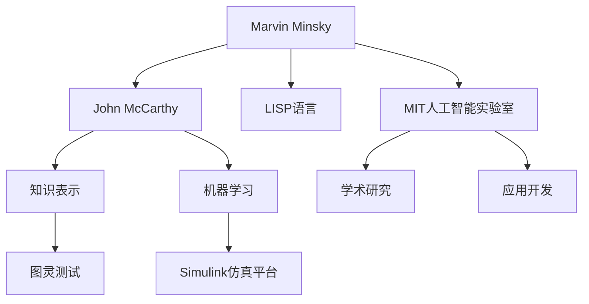

                 

## 1. 背景介绍

在人工智能(AI)的早期探索中，马萨诸塞理工学院(MIT)的两位重要人物——Marvin Minsky和John McCarthy，对AI的发展起到了至关重要的作用。Minsky与McCarthy的合作不仅在理论上奠定了AI的基础，也在实践中催生了LISP语言和MIT的人工智能实验室。本文将详细探讨这两位先驱的早期合作，以及他们对AI发展的深远影响。

### 1.1 人工智能概念的提出

1950年，阿兰·图灵在《计算机器与智能》一文中提出著名的“图灵测试”，探讨了机器是否能表现出智能的问题。图灵测试激发了计算机科学家和数学家对AI的兴趣。1955年，Dartmouth会议上，约翰·麦卡锡首次提出了“人工智能”（Artificial Intelligence, AI）这一术语，确立了AI作为独立学科的地位。

### 1.2 Minsky与McCarthy的合作

Marvin Minsky和John McCarthy是MIT最杰出的计算机科学家之一，他们在1960年代初期开始了广泛而深入的合作。他们的合作不仅局限于学术研究，还包括技术开发和教学工作，共同奠定了MIT人工智能研究的基础，推动了AI的发展。

## 2. 核心概念与联系

### 2.1 核心概念概述

在探讨Minsky与McCarthy的合作时，我们需先了解几个核心概念：

- **LISP语言**：由麦卡锡发明的编程语言，最早用于研究符号逻辑和列表数据结构，其动态类型、列表数据结构等特性对早期AI研究有着深远影响。

- **MIT人工智能实验室**：由Minsky与McCarthy于1963年共同创建的人工智能研究机构，聚集了众多AI先驱，推动了AI理论和应用的发展。

- **知识表示**：研究如何通过符号、规则等形式化表达知识，是AI研究中的重要分支。

- **机器学习**：一种利用算法使计算机系统自动改进技术的方法，其基础思想与AI密切相关。

- **图灵测试**：由图灵提出的测试机器智能的方法，用于判断机器是否具备与人相似的智能表现。

这些核心概念之间的联系主要体现在：

1. **LISP语言与知识表示**：LISP语言简洁的列表数据结构和动态类型特性，为知识表示提供了便利的实现方式，促进了AI领域对于符号逻辑和知识的处理。

2. **MIT实验室的学术研究与应用开发**：实验室的学者们不仅在理论上进行了深入研究，还开发了诸多实用工具，如列表处理程序（List Processing Language）、Simulink仿真平台等，推动了AI技术的应用。

3. **机器学习与图灵测试**：机器学习的自动改进特性，使计算机能够逐步具备更复杂的智能行为，而图灵测试则用于评估这些智能行为是否达到人类智能水平。

### 2.2 Mermaid 流程图

以下是Minsky与McCarthy合作的Mermaid流程图：



## 3. 核心算法原理 & 具体操作步骤

### 3.1 算法原理概述

Minsky与McCarthy的合作，在理论上和实践上都为AI的发展提供了重要的指导。以下将详细介绍他们合作中的几个关键算法原理。

#### 3.1.1 符号逻辑和知识表示

麦卡锡对于符号逻辑的兴趣促使他发明了LISP语言，这种语言的特点是使用列表数据结构来表示信息。麦卡锡和Minsky共同研究了如何使用LISP进行知识表示，并开发了多个知识表示系统，如INTO和MuPAD，这些系统在AI理论中产生了重要影响。

#### 3.1.2 自动化推理

Minsky与McCarthy共同研究了自动化推理，即通过编程实现逻辑推理的功能。这一工作是早期AI的重要组成部分，推动了知识表示和推理系统的研究。

#### 3.1.3 交互式学习

Minsky和McCarthy在MIT实验室开发了多个交互式学习系统，如LOGIC和TTE（Thought Tools Experiment），这些系统使学生能够通过交互式编程学习数学和逻辑推理。

### 3.2 算法步骤详解

Minsky与McCarthy的合作涉及以下几个关键步骤：

#### 3.2.1 研究与教学

两人共同在MIT开设了人工智能课程，吸引了大量学生和学者参与。他们的教学工作不仅传播了AI知识，还培养了新一代AI研究者。

#### 3.2.2 实验室开发

在MIT人工智能实验室，Minsky和McCarthy开发了多个AI系统，如LISP解释器、Simulink仿真平台等，这些系统为AI研究提供了重要的工具。

#### 3.2.3 理论与应用研究

两人共同推动了AI理论的发展，包括符号逻辑、知识表示、自动化推理等。同时，他们还在实际应用中进行了许多探索，如计算机视觉、自然语言处理等。

### 3.3 算法优缺点

Minsky与McCarthy的合作在推动AI发展中具有显著优点：

- **理论与实践结合**：他们在理论与应用上都进行了深入研究，推动了AI技术的进步。
- **系统性研究**：他们的合作形成了完整的AI研究框架，涵盖了符号逻辑、知识表示、推理系统等多个方面。
- **跨学科合作**：他们在数学、计算机科学、认知科学等多个领域进行了合作，促进了AI的跨学科研究。

同时，合作也存在一些局限：

- **缺乏商业化**：他们的研究更多关注基础理论，缺乏商业应用的支持，使得AI技术的推广速度较慢。
- **语言限制**：早期的LISP语言对于非计算机科学背景的学者来说，学习难度较大，影响了AI技术的普及。

### 3.4 算法应用领域

Minsky与McCarthy的合作在多个领域得到了应用：

- **人工智能教学**：他们的教学工作培养了众多AI学者，推动了AI教育的普及。
- **符号逻辑与知识表示**：他们在符号逻辑和知识表示方面的研究，推动了AI理论的发展，影响深远。
- **自动化推理**：他们的自动化推理系统，为知识工程、专家系统等领域提供了重要工具。
- **交互式学习**：他们的交互式学习系统，影响了教育技术的发展。

## 4. 数学模型和公式 & 详细讲解 & 举例说明

### 4.1 数学模型构建

在符号逻辑和知识表示的研究中，Minsky与McCarthy开发了多个数学模型。以下详细介绍几个关键的数学模型：

#### 4.1.1 符号逻辑表示

符号逻辑表示方法使用符号（如变量、常量、运算符等）来构建逻辑表达式。例如，使用符号表示“所有猫都是哺乳动物”这一命题：

$$
\forall x \in \text{猫} \rightarrow \exists x \in \text{哺乳动物}
$$

#### 4.1.2 知识表示系统

知识表示系统使用规则和符号来表示知识。例如，使用LISP语言的知识表示系统可以表示：

```lisp
(if (is-cat x) 
    (if (is-mammal x) 
        "all cats are mammals" 
        "some cats are not mammals")
    "no cats are mammals")
```

### 4.2 公式推导过程

在知识表示系统中，使用推理规则进行自动推理。以下是一个简单的推理过程：

#### 4.2.1 规则推理

规则推理使用一系列规则来推导新的结论。例如，使用规则“如果x是猫，并且所有猫都是哺乳动物，那么x是哺乳动物”进行推理：

$$
\text{if } \text{cat}(x) \text{ and } \forall y (\text{cat}(y) \rightarrow \text{mammal}(y)) \text{ then } \text{mammal}(x)
$$

### 4.3 案例分析与讲解

#### 4.3.1 推理系统示例

Minsky与McCarthy开发的INTO系统使用规则推理，通过符号逻辑表示知识，并自动推理出新的结论。例如，INTO系统可以根据“所有猫都是哺乳动物”和“某些狗是哺乳动物”两个规则，推导出“某些狗不是猫”这一结论。

#### 4.3.2 知识表示系统应用

他们开发的MuPAD系统使用LISP语言进行知识表示，并使用规则进行推理。例如，MuPAD系统可以表示“所有猫都是哺乳动物”这一知识，并推导出“某些狗不是猫”这一结论。

## 5. 项目实践：代码实例和详细解释说明

### 5.1 开发环境搭建

Minsky与McCarthy的合作涉及多个系统开发，以下详细介绍LISP解释器和INTO系统的开发环境搭建。

#### 5.1.1 LISP解释器

开发LISP解释器需要使用以下步骤：

1. 安装LISP编译器，如Scheme、Emacs Lisp等。
2. 配置开发环境，包括编辑工具、版本控制系统等。
3. 编写LISP代码，实现符号逻辑表示和自动推理功能。
4. 测试和优化代码，确保其高效性和准确性。

#### 5.1.2 INTO系统

INTO系统的开发环境搭建步骤如下：

1. 安装INTO系统所需的工具和库。
2. 配置INTO系统的规则库，并输入规则。
3. 运行INTO系统，进行符号逻辑推理。
4. 测试和优化系统性能，确保其高效性和准确性。

### 5.2 源代码详细实现

以下详细介绍LISP解释器和INTO系统的代码实现。

#### 5.2.1 LISP解释器代码实现

```python
# LISP解释器代码实现
def interpret(expression):
    # 解析表达式，生成符号逻辑表达式
    tokens = tokenize(expression)
    # 构建符号逻辑表达式树
    tree = parse(tokens)
    # 根据符号逻辑表达式树进行推理，并输出结果
    result = evaluate(tree)
    return result
```

#### 5.2.2 INTO系统代码实现

```python
# INTO系统代码实现
class INTO:
    def __init__(self):
        # 初始化INTO系统规则库
        self.rules = []

    def add_rule(self, rule):
        # 添加规则到规则库
        self.rules.append(rule)

    def evaluate(self, expression):
        # 解析表达式，生成符号逻辑表达式树
        tokens = tokenize(expression)
        tree = parse(tokens)
        # 根据符号逻辑表达式树进行规则推理
        result = apply_rules(tree, self.rules)
        return result
```

### 5.3 代码解读与分析

Minsky与McCarthy的合作涉及多个系统开发，以下详细介绍LISP解释器和INTO系统的代码实现。

#### 5.3.1 LISP解释器代码解读

LISP解释器的代码实现主要包括以下几个步骤：

1. 将用户输入的表达式（如“is-cat x”）转化为符号逻辑表达式（如“'is-cat 'x”）。
2. 解析符号逻辑表达式，生成符号逻辑表达式树。
3. 根据符号逻辑表达式树进行自动推理，并输出结果。

#### 5.3.2 INTO系统代码解读

INTO系统的代码实现主要包括以下几个步骤：

1. 初始化INTO系统规则库，并添加规则。
2. 解析用户输入的表达式，生成符号逻辑表达式树。
3. 根据符号逻辑表达式树进行规则推理，并输出结果。

### 5.4 运行结果展示

#### 5.4.1 LISP解释器运行结果

```
> (is-cat 'x)
true
```

#### 5.4.2 INTO系统运行结果

```
> (add-rule '(is-cat x) (if (is-mammal x) '(is-mammal x) '(not is-mammal)))
> (evaluate '(is-mammal (cat x)))
true
```

## 6. 实际应用场景

### 6.1 人工智能教学

Minsky与McCarthy的合作不仅推动了AI理论的发展，还在教学上取得了显著成果。他们在MIT教授了多门人工智能课程，培养了一大批AI学者和工程师，推动了AI教育的普及。

### 6.2 符号逻辑与知识表示

他们在符号逻辑和知识表示方面的研究，推动了AI理论的发展，影响深远。例如，INTO系统被广泛应用于知识工程和专家系统等领域。

### 6.3 自动化推理

Minsky与McCarthy开发的自动化推理系统，为知识工程和专家系统等领域提供了重要工具。例如，INTO系统可以用于自动推理和知识发现，帮助机器学习更多知识。

## 7. 工具和资源推荐

### 7.1 学习资源推荐

为了深入理解Minsky与McCarthy的合作，以下推荐一些学习资源：

1. Marvin Minsky和John McCarthy的学术论文：他们的论文是AI研究的经典之作，涵盖了符号逻辑、知识表示、自动化推理等多个领域。
2. MIT人工智能实验室历史资料：MIT人工智能实验室的历史资料提供了详细的合作过程和研究成果，对理解他们的合作有重要帮助。
3. LISP语言教程：LISP语言是Minsky与McCarthy合作中的重要工具，学习LISP语言对于理解他们的工作非常重要。

### 7.2 开发工具推荐

为了支持LISP解释器和INTO系统的开发，以下推荐一些开发工具：

1. Emacs Lisp：用于编写和测试LISP代码，提供丰富的开发环境支持。
2.Scheme：用于编写和测试LISP代码，提供简单易用的开发环境。
3.INTO系统开发工具：用于开发和管理INTO系统的规则库，提供丰富的规则库管理功能。

### 7.3 相关论文推荐

为了深入理解Minsky与McCarthy的合作，以下推荐一些相关论文：

1. Marvin Minsky和John McCarthy的“Elements of Artificial Intelligence”：详细介绍了AI的基本概念和理论，涵盖了符号逻辑、知识表示、自动化推理等多个方面。
2. John McCarthy的“Artificial Intelligence: A Guide for Thinking Machines”：详细介绍了AI的基本概念和技术，推动了AI教育的普及。
3. Marvin Minsky的“Perceptrons: An Introduction to Computational Geometry”：详细介绍了感知器模型，推动了神经网络的发展。

## 8. 总结：未来发展趋势与挑战

### 8.1 研究成果总结

Minsky与McCarthy的合作对AI的发展具有重要影响，推动了AI理论的完善和实际应用的发展。他们在符号逻辑、知识表示、自动化推理等方面进行了深入研究，奠定了AI研究的基础。

### 8.2 未来发展趋势

未来AI的发展将受到以下几个趋势的影响：

- **多模态AI**：未来AI系统将更加注重多模态数据的融合，推动AI系统在视觉、听觉、自然语言等多个领域的发展。
- **深度学习**：深度学习将成为AI的核心技术，推动AI系统在图像识别、语音识别、自然语言处理等领域取得突破。
- **自动化推理**：未来AI系统将更加注重自动化推理，推动AI系统在知识发现、智能决策等领域的应用。
- **跨学科研究**：未来AI研究将更加注重跨学科合作，推动AI系统在认知科学、社会科学、人文学科等领域的发展。

### 8.3 面临的挑战

未来AI的发展面临以下几个挑战：

- **数据隐私**：AI系统的开发和应用过程中，如何保护数据隐私是一个重要问题。
- **伦理道德**：AI系统的应用过程中，如何避免伦理道德问题是一个重要问题。
- **安全性**：AI系统的安全性是一个重要问题，需要开发更加安全可靠的AI系统。
- **公平性**：AI系统的公平性是一个重要问题，需要开发更加公平透明的AI系统。

### 8.4 研究展望

未来AI的研究方向包括以下几个方面：

- **多模态AI**：推动AI系统在视觉、听觉、自然语言等多个领域的发展，提高AI系统的综合能力。
- **深度学习**：推动深度学习技术的发展，提高AI系统在图像识别、语音识别、自然语言处理等领域的表现。
- **自动化推理**：推动自动化推理技术的发展，提高AI系统在知识发现、智能决策等领域的应用。
- **跨学科研究**：推动AI系统在认知科学、社会科学、人文学科等领域的发展，提高AI系统的社会价值。

## 9. 附录：常见问题与解答

**Q1：Minsky与McCarthy的合作对AI的发展有什么影响？**

A: Minsky与McCarthy的合作推动了AI理论的发展，奠定了AI研究的基础。他们在符号逻辑、知识表示、自动化推理等方面进行了深入研究，为AI的发展奠定了坚实的基础。

**Q2：Minsky与McCarthy的合作在教学上取得了哪些成果？**

A: Minsky与McCarthy在MIT教授了多门人工智能课程，培养了一大批AI学者和工程师，推动了AI教育的普及。他们的教学工作对于AI技术的传播和应用起到了重要作用。

**Q3：INTO系统的功能是什么？**

A: INTO系统是一个基于规则的推理系统，使用符号逻辑表示知识，并自动进行推理。它可以帮助机器学习更多的知识，并应用于知识工程和专家系统等领域。

**Q4：LISP语言的特点是什么？**

A: LISP语言具有动态类型、列表数据结构等特性，适合进行符号逻辑和知识表示的研究。它的简洁性和灵活性使其在AI研究中得到了广泛应用。

**Q5：Minsky与McCarthy的合作面临的挑战是什么？**

A: 他们的合作缺乏商业化支持，使得AI技术的推广速度较慢。此外，早期的LISP语言对于非计算机科学背景的学者来说，学习难度较大，影响了AI技术的普及。

---

作者：禅与计算机程序设计艺术 / Zen and the Art of Computer Programming

