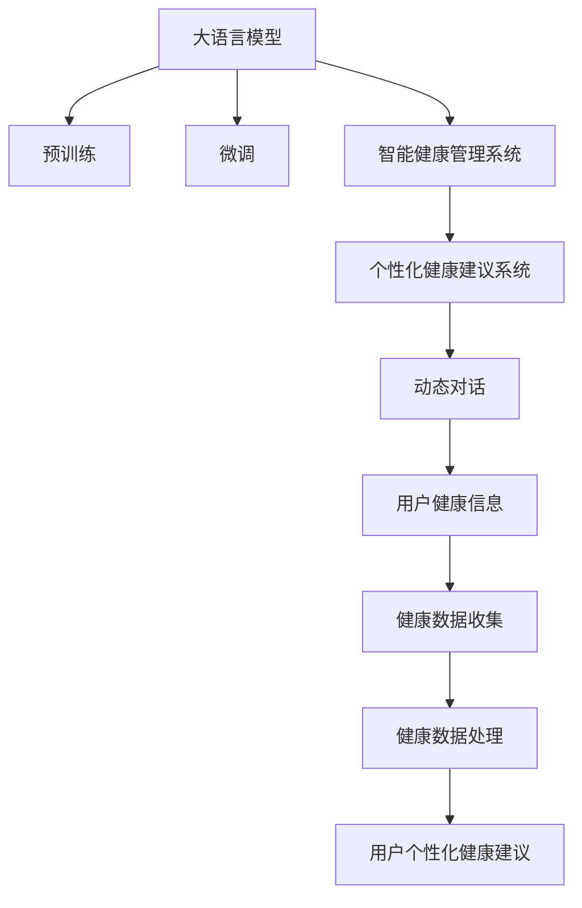

                 

## 1. 背景介绍

随着科技进步，智能健康管理系统正成为提升个人健康管理质量的重要工具。智能健康管理系统依托于大量健康数据和先进算法，能实现个性化的健康建议，如饮食建议、运动计划、心理健康支持等。特别是基于大语言模型(Large Language Model, LLM)的智能健康管理系统的推出，将健康建议的生成从静态文本扩展到动态对话，极大提升了用户体验。

近年来，人工智能在健康管理领域的应用不断涌现，对大语言模型的需求也日益增加。通过大语言模型，系统可以更好地理解用户的健康问题，根据用户的健康历史数据和实时数据，提供更加个性化的健康建议。文章将围绕大语言模型在智能健康管理系统中的应用进行详细探讨，并给出实现原理和具体步骤。

## 2. 核心概念与联系

### 2.1 核心概念概述

大语言模型和大健康管理系统的联系主要体现在以下几个方面：

- **大语言模型(Large Language Model, LLM)**：以自回归(如GPT)或自编码(如BERT)模型为代表的大规模预训练语言模型。通过在大规模无标签文本语料上进行预训练，学习通用的语言表示，具备强大的语言理解和生成能力。

- **预训练(Pre-training)**：指在大规模无标签文本语料上，通过自监督学习任务训练通用语言模型的过程。常见的预训练任务包括言语建模、遮挡语言模型等。预训练使得模型学习到语言的通用表示。

- **微调(Fine-tuning)**：指在预训练模型的基础上，使用下游任务的少量标注数据，通过有监督学习优化模型在特定任务上的性能。通常只需要调整顶层分类器或解码器，并以较小的学习率更新全部或部分的模型参数。

- **智能健康管理系统(Intelligent Health Management System, IHMS)**：通过收集用户的健康数据，并利用人工智能技术为用户提供个性化健康管理建议的系统。系统可以通过动态对话形式，实时接收和处理用户健康信息，提供智能化的健康建议。

- **个性化健康建议系统(Health Advice System, HAS)**：基于智能健康管理系统，结合大语言模型，根据用户的具体健康状况，提供针对性的健康建议。

这些核心概念之间的逻辑关系可以通过以下Mermaid流程图来展示：



这个流程图展示了大语言模型在智能健康管理系统中的应用流程：

1. 大语言模型通过预训练获得基础能力。
2. 微调使模型更好地适应特定的健康建议任务。
3. 智能健康管理系统收集用户健康数据。
4. 个性化健康建议系统利用微调后的模型，为用户提供针对性的健康建议。
5. 用户与系统通过动态对话实时交互，获取健康建议。

## 3. 核心算法原理 & 具体操作步骤

### 3.1 算法原理概述

基于大语言模型的个性化健康建议系统，通过收集用户的历史健康数据和实时健康数据，将用户问题转化为自然语言形式，输入到微调后的语言模型中，生成个性化的健康建议。其核心算法原理如下：

- **问题定义**：用户健康问题可以形式化为自然语言问题，如“我最近总是感到疲劳，该怎么办？”。
- **输入处理**：将自然语言问题转化为模型可以接受的输入形式，如将问题转换为“我最近总是感到疲劳”。
- **模型推理**：将输入问题输入到微调后的语言模型中，模型基于用户历史健康数据和实时健康数据，生成健康建议。
- **结果输出**：将模型生成的健康建议转化为用户可理解的自然语言形式，如“建议您多休息，加强锻炼”。

### 3.2 算法步骤详解

基于大语言模型的个性化健康建议系统主要包括如下关键步骤：

**Step 1: 准备数据和模型**
- 收集用户的健康数据，包括历史健康记录、实时监测数据等。
- 准备大量的健康问题-建议对，如“疲劳”-“多休息”，“高血压”-“低盐饮食”等。
- 选择合适的预训练语言模型，如GPT-3、BERT等，进行微调。

**Step 2: 设计任务适配层**
- 在预训练模型的基础上，设计合适的任务适配层，如添加分类器、解码器等。
- 对于健康建议生成任务，通常在模型顶层添加生成器，使用交叉熵损失函数。

**Step 3: 微调模型**
- 使用微调后的语言模型，在标注的健康数据上进行有监督学习，调整模型参数以适应健康建议任务。
- 微调过程中，使用合适的优化器和学习率，避免过拟合，保留预训练权重。

**Step 4: 动态对话交互**
- 系统接收用户输入的健康问题，通过动态对话，将问题转化为模型可接受的形式。
- 模型根据用户问题，结合用户历史健康数据和实时健康数据，生成健康建议。
- 系统将健康建议转化为自然语言，反馈给用户。

**Step 5: 模型评估和优化**
- 在用户反馈中收集模型效果数据，评估模型性能。
- 根据用户反馈和系统性能数据，进一步优化微调模型和适配层。

**Step 6: 系统集成和部署**
- 将微调模型集成到智能健康管理系统中。
- 部署系统到云端或本地，供用户随时访问。

### 3.3 算法优缺点

基于大语言模型的个性化健康建议系统有以下优点：
1. 提升用户体验。通过动态对话，系统能实时响应用户需求，提供个性化健康建议。
2. 提高健康建议的准确性。基于大量标注数据微调后的模型，能够更好地理解用户问题，提供更合理的建议。
3. 降低开发成本。使用预训练语言模型，减少了从头开发健康建议系统所需的数据和计算资源。

同时，该系统也存在一些局限性：
1. 数据隐私问题。用户健康数据涉及隐私，如何保护数据安全是一大挑战。
2. 模型鲁棒性。模型在大规模数据上微调，但面对特定用户的个性化问题，可能泛化能力不足。
3. 计算资源需求。微调和推理过程需要大量计算资源，限制了系统的应用范围。
4. 缺乏专业性。健康建议依赖于模型的泛化能力，但模型可能无法处理一些复杂的健康问题。

尽管存在这些局限性，但基于大语言模型的健康建议系统仍具有很大的应用前景，特别是在医疗、健康咨询等领域，可以极大地提升服务质量和效率。

### 3.4 算法应用领域

基于大语言模型的个性化健康建议系统，已经在多个应用领域展现出显著的效果：

- **医疗咨询**：结合医生的医疗知识，大语言模型可以为患者提供个性化的治疗建议。
- **健康监测**：系统可以通过用户输入的实时健康数据，如心率、血压等，提供及时的健康管理建议。
- **饮食规划**：根据用户的健康状况和饮食偏好，大语言模型可以推荐合理的饮食计划。
- **运动计划**：结合用户的健康数据，系统可以设计个性化的运动方案，帮助用户保持健康。
- **心理健康**：大语言模型可以提供心理支持，帮助用户缓解压力、焦虑等情绪问题。

## 4. 数学模型和公式 & 详细讲解  
### 4.1 数学模型构建

假设用户的健康问题可以表示为自然语言形式$q$，模型的输出为健康建议$s$。则问题转化为预测问题，形式化为：

$$
\max_{\theta} \mathcal{L}(s;\theta) = \max_{\theta} -\frac{1}{N}\sum_{i=1}^N \log P(s_i|q_i;\theta)
$$

其中$P(s|q;\theta)$为模型在输入$q$条件下，生成健康建议$s$的概率。$\mathcal{L}$为损失函数，通常使用交叉熵损失。

### 4.2 公式推导过程

模型在输入$q$下的输出$s$为：

$$
s = M_{\theta}(q)
$$

其中$M_{\theta}$为微调后的语言模型，$\theta$为模型参数。

交叉熵损失函数为：

$$
\ell(s,q;\theta) = -\sum_{s\in \mathcal{S}} s_{\text{true}} \log P(s|q;\theta)
$$

其中$\mathcal{S}$为健康建议的集合，$s_{\text{true}}$为用户真实健康建议，$P(s|q;\theta)$为模型在输入$q$条件下，生成健康建议$s$的概率。

### 4.3 案例分析与讲解

假设用户输入健康问题$q$为“最近总是感到疲劳，该怎么办？”，模型在训练时使用标注数据集$\{(q_i,s_i)\}_{i=1}^N$，其中$s_i$为针对$q_i$的健康建议。则模型的预测问题转化为最大化概率问题：

$$
\max_{\theta} P(s|q;\theta) = \max_{\theta} \frac{e^{M_{\theta}(q)}}{\sum_{s\in \mathcal{S}} e^{M_{\theta}(s)}}
$$

其中$\mathcal{S}$为健康建议集合。

使用预训练语言模型进行微调，通常使用监督学习框架，如PyTorch、TensorFlow等，训练过程如下：

```python
import torch
import torch.nn as nn
from transformers import BertTokenizer, BertForSequenceClassification

tokenizer = BertTokenizer.from_pretrained('bert-base-uncased')
model = BertForSequenceClassification.from_pretrained('bert-base-uncased', num_labels=2)

optimizer = torch.optim.Adam(model.parameters(), lr=2e-5)

for epoch in range(epochs):
    for batch in train_dataset:
        input_ids = batch['input_ids']
        attention_mask = batch['attention_mask']
        labels = batch['labels']
        
        outputs = model(input_ids, attention_mask=attention_mask, labels=labels)
        loss = outputs.loss
        loss.backward()
        optimizer.step()
```

其中，`BertForSequenceClassification`用于表示语言模型的分类器，`BertTokenizer`用于处理输入的文本。模型训练使用Adam优化器，学习率为$2e-5$。

## 5. 项目实践：代码实例和详细解释说明

### 5.1 开发环境搭建

在进行项目实践前，我们需要准备好开发环境。以下是使用Python进行PyTorch开发的环境配置流程：

1. 安装Anaconda：从官网下载并安装Anaconda，用于创建独立的Python环境。

2. 创建并激活虚拟环境：
```bash
conda create -n pytorch-env python=3.8 
conda activate pytorch-env
```

3. 安装PyTorch：根据CUDA版本，从官网获取对应的安装命令。例如：
```bash
conda install pytorch torchvision torchaudio cudatoolkit=11.1 -c pytorch -c conda-forge
```

4. 安装Transformers库：
```bash
pip install transformers
```

5. 安装各类工具包：
```bash
pip install numpy pandas scikit-learn matplotlib tqdm jupyter notebook ipython
```

完成上述步骤后，即可在`pytorch-env`环境中开始项目实践。

### 5.2 源代码详细实现

这里我们以饮食建议系统为例，给出使用Transformers库对BERT模型进行微调的PyTorch代码实现。

首先，定义饮食建议任务的数据处理函数：

```python
from transformers import BertTokenizer
from torch.utils.data import Dataset
import torch

class DietDataset(Dataset):
    def __init__(self, texts, tags, tokenizer, max_len=128):
        self.texts = texts
        self.tags = tags
        self.tokenizer = tokenizer
        self.max_len = max_len
        
    def __len__(self):
        return len(self.texts)
    
    def __getitem__(self, item):
        text = self.texts[item]
        tags = self.tags[item]
        
        encoding = self.tokenizer(text, return_tensors='pt', max_length=self.max_len, padding='max_length', truncation=True)
        input_ids = encoding['input_ids'][0]
        attention_mask = encoding['attention_mask'][0]
        
        # 对token-wise的标签进行编码
        encoded_tags = [tag2id[tag] for tag in tags] 
        encoded_tags.extend([tag2id['O']] * (self.max_len - len(encoded_tags)))
        labels = torch.tensor(encoded_tags, dtype=torch.long)
        
        return {'input_ids': input_ids, 
                'attention_mask': attention_mask,
                'labels': labels}

# 标签与id的映射
tag2id = {'O': 0, '健康': 1, '不健康': 2}
id2tag = {v: k for k, v in tag2id.items()}

# 创建dataset
tokenizer = BertTokenizer.from_pretrained('bert-base-cased')

train_dataset = DietDataset(train_texts, train_tags, tokenizer)
dev_dataset = DietDataset(dev_texts, dev_tags, tokenizer)
test_dataset = DietDataset(test_texts, test_tags, tokenizer)
```

然后，定义模型和优化器：

```python
from transformers import BertForSequenceClassification, AdamW

model = BertForSequenceClassification.from_pretrained('bert-base-cased', num_labels=len(tag2id))

optimizer = AdamW(model.parameters(), lr=2e-5)
```

接着，定义训练和评估函数：

```python
from torch.utils.data import DataLoader
from tqdm import tqdm
from sklearn.metrics import classification_report

device = torch.device('cuda') if torch.cuda.is_available() else torch.device('cpu')
model.to(device)

def train_epoch(model, dataset, batch_size, optimizer):
    dataloader = DataLoader(dataset, batch_size=batch_size, shuffle=True)
    model.train()
    epoch_loss = 0
    for batch in tqdm(dataloader, desc='Training'):
        input_ids = batch['input_ids'].to(device)
        attention_mask = batch['attention_mask'].to(device)
        labels = batch['labels'].to(device)
        model.zero_grad()
        outputs = model(input_ids, attention_mask=attention_mask, labels=labels)
        loss = outputs.loss
        epoch_loss += loss.item()
        loss.backward()
        optimizer.step()
    return epoch_loss / len(dataloader)

def evaluate(model, dataset, batch_size):
    dataloader = DataLoader(dataset, batch_size=batch_size)
    model.eval()
    preds, labels = [], []
    with torch.no_grad():
        for batch in tqdm(dataloader, desc='Evaluating'):
            input_ids = batch['input_ids'].to(device)
            attention_mask = batch['attention_mask'].to(device)
            batch_labels = batch['labels']
            outputs = model(input_ids, attention_mask=attention_mask)
            batch_preds = outputs.logits.argmax(dim=2).to('cpu').tolist()
            batch_labels = batch_labels.to('cpu').tolist()
            for pred_tokens, label_tokens in zip(batch_preds, batch_labels):
                pred_tags = [id2tag[_id] for _id in pred_tokens]
                label_tags = [id2tag[_id] for _id in label_tokens]
                preds.append(pred_tags[:len(label_tags)])
                labels.append(label_tags)
                
    print(classification_report(labels, preds))
```

最后，启动训练流程并在测试集上评估：

```python
epochs = 5
batch_size = 16

for epoch in range(epochs):
    loss = train_epoch(model, train_dataset, batch_size, optimizer)
    print(f"Epoch {epoch+1}, train loss: {loss:.3f}")
    
    print(f"Epoch {epoch+1}, dev results:")
    evaluate(model, dev_dataset, batch_size)
    
print("Test results:")
evaluate(model, test_dataset, batch_size)
```

以上就是使用PyTorch对BERT进行饮食建议系统微调的完整代码实现。可以看到，得益于Transformers库的强大封装，我们可以用相对简洁的代码完成BERT模型的加载和微调。

### 5.3 代码解读与分析

让我们再详细解读一下关键代码的实现细节：

**DietDataset类**：
- `__init__`方法：初始化文本、标签、分词器等关键组件。
- `__len__`方法：返回数据集的样本数量。
- `__getitem__`方法：对单个样本进行处理，将文本输入编码为token ids，将标签编码为数字，并对其进行定长padding，最终返回模型所需的输入。

**tag2id和id2tag字典**：
- 定义了标签与数字id之间的映射关系，用于将token-wise的预测结果解码回真实的标签。

**训练和评估函数**：
- 使用PyTorch的DataLoader对数据集进行批次化加载，供模型训练和推理使用。
- 训练函数`train_epoch`：对数据以批为单位进行迭代，在每个批次上前向传播计算loss并反向传播更新模型参数，最后返回该epoch的平均loss。
- 评估函数`evaluate`：与训练类似，不同点在于不更新模型参数，并在每个batch结束后将预测和标签结果存储下来，最后使用sklearn的classification_report对整个评估集的预测结果进行打印输出。

**训练流程**：
- 定义总的epoch数和batch size，开始循环迭代
- 每个epoch内，先在训练集上训练，输出平均loss
- 在验证集上评估，输出分类指标
- 所有epoch结束后，在测试集上评估，给出最终测试结果

可以看到，PyTorch配合Transformers库使得BERT微调的代码实现变得简洁高效。开发者可以将更多精力放在数据处理、模型改进等高层逻辑上，而不必过多关注底层的实现细节。

当然，工业级的系统实现还需考虑更多因素，如模型的保存和部署、超参数的自动搜索、更灵活的任务适配层等。但核心的微调范式基本与此类似。

## 6. 实际应用场景
### 6.1 智能健康管理系统的应用

智能健康管理系统在现代社会中得到了广泛应用，帮助用户更好地管理自身健康状况。大语言模型结合个性化健康建议系统，可以在智能健康管理系统中发挥重要作用：

**6.1.1 个性化饮食建议**：根据用户的健康数据和饮食偏好，系统可以生成个性化的饮食建议，如餐单设计、食材推荐等。

**6.1.2 运动计划**：结合用户的健康数据和运动偏好，系统可以设计个性化的运动方案，如运动时长、运动类型等。

**6.1.3 心理健康支持**：通过用户输入的情绪和行为数据，系统可以提供心理健康建议，如放松技巧、心理咨询等。

**6.1.4 健康监测**：系统可以实时监测用户的健康状况，如心率、血压等，并提供相应的健康建议。

**6.1.5 健康数据记录和分析**：系统可以记录用户的健康数据，并根据这些数据进行分析和统计，为用户提供健康趋势分析、风险预警等功能。

### 6.2 医疗咨询的应用

医疗咨询是大语言模型在健康管理领域的重要应用之一。基于大语言模型的医疗咨询系统，可以结合医生的医疗知识，提供个性化的治疗建议，帮助医生诊断疾病、制定治疗方案等。

**6.2.1 症状查询**：用户可以输入症状描述，系统根据描述推荐可能的疾病和症状。

**6.2.2 疾病诊断**：用户可以输入详细的健康数据和症状，系统结合医疗知识库，提供疾病诊断建议。

**6.2.3 治疗方案**：系统可以提供针对特定疾病的治疗方案，包括药物、手术等。

**6.2.4 健康指导**：系统可以提供健康生活方式指导，帮助用户预防疾病、保持健康。

### 6.3 未来应用展望

大语言模型在健康管理领域的应用前景广阔，未来将呈现以下几个趋势：

**6.3.1 个性化医疗**：结合用户基因信息、生活方式等数据，提供个性化的医疗建议和治疗方案。

**6.3.2 远程医疗**：基于大语言模型的远程医疗系统，可以实现跨地域、跨医院的医疗咨询和诊断。

**6.3.3 健康数据分析**：通过大语言模型分析大规模健康数据，发现疾病模式和趋势，提升公共卫生管理水平。

**6.3.4 实时健康监测**：基于大语言模型的健康监测系统，可以实现实时健康数据收集和分析，及时发现健康问题，提供即时建议。

## 7. 工具和资源推荐
### 7.1 学习资源推荐

为了帮助开发者系统掌握大语言模型在健康管理中的应用，这里推荐一些优质的学习资源：

1. 《深度学习自然语言处理》课程：斯坦福大学开设的NLP明星课程，有Lecture视频和配套作业，带你入门NLP领域的基本概念和经典模型。

2. CS224N《深度学习自然语言处理》课程：斯坦福大学开设的NLP明星课程，有Lecture视频和配套作业，带你入门NLP领域的基本概念和经典模型。

3. 《Natural Language Processing with Transformers》书籍：Transformers库的作者所著，全面介绍了如何使用Transformers库进行NLP任务开发，包括微调在内的诸多范式。

4. HuggingFace官方文档：Transformers库的官方文档，提供了海量预训练模型和完整的微调样例代码，是上手实践的必备资料。

5. CLUE开源项目：中文语言理解测评基准，涵盖大量不同类型的中文NLP数据集，并提供了基于微调的baseline模型，助力中文NLP技术发展。

通过对这些资源的学习实践，相信你一定能够快速掌握大语言模型在健康管理中的应用，并用于解决实际的NLP问题。

### 7.2 开发工具推荐

高效的开发离不开优秀的工具支持。以下是几款用于大语言模型在健康管理领域应用的开发工具：

1. PyTorch：基于Python的开源深度学习框架，灵活动态的计算图，适合快速迭代研究。大部分预训练语言模型都有PyTorch版本的实现。

2. TensorFlow：由Google主导开发的开源深度学习框架，生产部署方便，适合大规模工程应用。同样有丰富的预训练语言模型资源。

3. Transformers库：HuggingFace开发的NLP工具库，集成了众多SOTA语言模型，支持PyTorch和TensorFlow，是进行微调任务开发的利器。

4. Weights & Biases：模型训练的实验跟踪工具，可以记录和可视化模型训练过程中的各项指标，方便对比和调优。与主流深度学习框架无缝集成。

5. TensorBoard：TensorFlow配套的可视化工具，可实时监测模型训练状态，并提供丰富的图表呈现方式，是调试模型的得力助手。

6. Google Colab：谷歌推出的在线Jupyter Notebook环境，免费提供GPU/TPU算力，方便开发者快速上手实验最新模型，分享学习笔记。

合理利用这些工具，可以显著提升大语言模型在健康管理领域的应用开发效率，加快创新迭代的步伐。

### 7.3 相关论文推荐

大语言模型在健康管理领域的应用源于学界的持续研究。以下是几篇奠基性的相关论文，推荐阅读：

1. Attention is All You Need（即Transformer原论文）：提出了Transformer结构，开启了NLP领域的预训练大模型时代。

2. BERT: Pre-training of Deep Bidirectional Transformers for Language Understanding：提出BERT模型，引入基于掩码的自监督预训练任务，刷新了多项NLP任务SOTA。

3. Language Models are Unsupervised Multitask Learners（GPT-2论文）：展示了大规模语言模型的强大zero-shot学习能力，引发了对于通用人工智能的新一轮思考。

4. Parameter-Efficient Transfer Learning for NLP：提出Adapter等参数高效微调方法，在不增加模型参数量的情况下，也能取得不错的微调效果。

5. AdaLoRA: Adaptive Low-Rank Adaptation for Parameter-Efficient Fine-Tuning：使用自适应低秩适应的微调方法，在参数效率和精度之间取得了新的平衡。

6. Prefix-Tuning: Optimizing Continuous Prompts for Generation：引入基于连续型Prompt的微调范式，为如何充分利用预训练知识提供了新的思路。

这些论文代表了大语言模型在健康管理领域的应用方向和前沿进展。通过学习这些前沿成果，可以帮助研究者把握学科前进方向，激发更多的创新灵感。

## 8. 总结：未来发展趋势与挑战

### 8.1 总结

本文对基于大语言模型的个性化健康建议系统进行了详细探讨。首先阐述了智能健康管理系统和大语言模型的应用背景，明确了个性化健康建议系统在健康管理中的独特价值。其次，从原理到实践，详细讲解了个性化健康建议系统的算法原理和关键步骤，给出了实现原理和具体步骤。同时，本文还广泛探讨了个性化健康建议系统在智能健康管理系统和医疗咨询中的应用前景，展示了其广阔的应用空间。

通过本文的系统梳理，可以看到，基于大语言模型的个性化健康建议系统正逐步成为健康管理领域的重要技术手段，极大地提升了健康建议的个性化和智能化水平。未来，随着大语言模型和微调方法的持续演进，基于微调范式在健康管理领域的应用将更加广泛，为健康管理系统的智能化转型提供新的动力。

### 8.2 未来发展趋势

展望未来，基于大语言模型的个性化健康建议系统将呈现以下几个发展趋势：

**8.2.1 多模态融合**：未来的健康管理系统将不仅基于文本数据，还将融合图像、音频、视频等多模态数据，提升系统的感知能力和信息获取量。

**8.2.2 跨领域知识整合**：通过与医疗知识库、健康数据仓库等外部知识源结合，提升系统的知识广度和深度，更好地理解和应对用户问题。

**8.2.3 实时动态反馈**：基于大语言模型的健康管理系统将能够实时动态反馈用户行为，优化健康建议，提高用户的满意度和粘性。

**8.2.4 隐私保护和安全**：随着用户健康数据的敏感性增加，隐私保护和安全将越来越受到重视，系统需要采用更高级的加密和匿名化技术。

**8.2.5 个性化医疗**：结合用户基因信息、生活方式等数据，提供个性化的医疗建议和治疗方案，提升医疗服务的精准度和效率。

**8.2.6 多语言支持**：未来健康管理系统将支持多种语言，帮助全球不同语种的用户获取健康建议。

这些趋势将引领健康管理系统迈向更加智能化、个性化、高效化的方向，提升用户的健康管理体验和医疗服务质量。

### 8.3 面临的挑战

尽管大语言模型在健康管理领域的应用已经取得显著成果，但在迈向更加智能化、普适化应用的过程中，仍面临一些挑战：

**8.3.1 数据隐私保护**：用户健康数据涉及隐私，如何保护数据安全是一大挑战。如何在保证用户隐私的前提下，充分利用数据提升健康建议的准确性，仍需要进一步探索。

**8.3.2 模型鲁棒性**：模型在大规模数据上微调，但面对特定用户的个性化问题，可能泛化能力不足。如何在保证泛化能力的同时，提高模型的准确性和个性化程度，还需要进一步优化。

**8.3.3 计算资源需求**：微调和推理过程需要大量计算资源，限制了系统的应用范围。如何降低计算资源需求，优化推理速度，提升系统效率，还需进一步努力。

**8.3.4 模型可解释性**：大语言模型生成的健康建议缺乏可解释性，用户难以理解模型的决策依据。如何在保证模型性能的同时，提高可解释性，增强用户的信任感，还需进一步研究。

**8.3.5 模型安全性**：健康建议系统可能被恶意利用，生成有害的误导性建议。如何避免模型偏见，确保输出的安全性，还需进一步加强。

**8.3.6 用户接受度**：用户对健康管理系统的接受度影响其应用效果。如何在提升系统智能化水平的同时，提高用户的使用体验和接受度，还需进一步优化。

这些挑战需要在技术、伦理、法律等多个层面共同努力，才能使大语言模型在健康管理领域得到更广泛的应用。

### 8.4 研究展望

未来，在以下几个方面还需进行深入研究：

**8.4.1 多模态融合**：研究如何高效融合多模态数据，提升系统的感知能力和信息获取量，更好地理解用户健康状况。

**8.4.2 跨领域知识整合**：研究如何与医疗知识库、健康数据仓库等外部知识源结合，提升系统的知识广度和深度，更好地理解和应对用户问题。

**8.4.3 实时动态反馈**：研究如何在保证系统稳定性的同时，实现实时动态反馈，优化健康建议，提高用户的满意度和粘性。

**8.4.4 隐私保护和安全**：研究如何在保证用户隐私的前提下，充分利用数据提升健康建议的准确性，确保系统输出的安全性，增强用户信任感。

**8.4.5 个性化医疗**：研究如何结合用户基因信息、生活方式等数据，提供个性化的医疗建议和治疗方案，提升医疗服务的精准度和效率。

**8.4.6 多语言支持**：研究如何支持多种语言，帮助全球不同语种的用户获取健康建议。

这些研究方向将引领健康管理系统迈向更加智能化、个性化、高效化的方向，提升用户的健康管理体验和医疗服务质量。

## 9. 附录：常见问题与解答

**Q1：大语言模型在健康管理中的应用前景如何？**

A: 大语言模型在健康管理领域的应用前景广阔，可以为用户提供个性化的健康建议和治疗方案，帮助用户预防疾病、保持健康。同时，结合医疗知识库和健康数据仓库，系统可以提供更精准的医疗诊断和咨询。未来，大语言模型在健康管理中的应用将进一步扩展，为用户提供更全面的健康管理服务。

**Q2：基于大语言模型的健康建议系统有哪些优点？**

A: 基于大语言模型的健康建议系统有以下优点：
1. 提供个性化健康建议：系统可以根据用户的具体健康状况，提供个性化的健康建议和治疗方案。
2. 实时动态反馈：系统可以实时监测用户的健康状况，提供动态的健康建议。
3. 结合医疗知识库：系统可以结合医疗知识库，提供更精准的医疗诊断和治疗方案。
4. 多模态数据融合：系统可以融合图像、音频、视频等多模态数据，提升系统的感知能力和信息获取量。

**Q3：基于大语言模型的健康建议系统有哪些缺点？**

A: 基于大语言模型的健康建议系统有以下缺点：
1. 数据隐私问题：用户健康数据涉及隐私，如何保护数据安全是一大挑战。
2. 模型鲁棒性不足：模型在大规模数据上微调，但面对特定用户的个性化问题，可能泛化能力不足。
3. 计算资源需求高：微调和推理过程需要大量计算资源，限制了系统的应用范围。
4. 模型可解释性差：大语言模型生成的健康建议缺乏可解释性，用户难以理解模型的决策依据。

**Q4：基于大语言模型的健康建议系统在应用中需要注意哪些问题？**

A: 基于大语言模型的健康建议系统在应用中需要注意以下问题：
1. 数据隐私保护：用户健康数据涉及隐私，如何保护数据安全是一大挑战。
2. 模型鲁棒性：模型在大规模数据上微调，但面对特定用户的个性化问题，可能泛化能力不足。
3. 计算资源需求：微调和推理过程需要大量计算资源，限制了系统的应用范围。
4. 模型可解释性：大语言模型生成的健康建议缺乏可解释性，用户难以理解模型的决策依据。
5. 模型安全性：健康建议系统可能被恶意利用，生成有害的误导性建议。

这些问题是系统应用中需要重点关注的，需要在技术、伦理、法律等多个层面共同努力，才能使大语言模型在健康管理领域得到更广泛的应用。

---

作者：禅与计算机程序设计艺术 / Zen and the Art of Computer Programming

