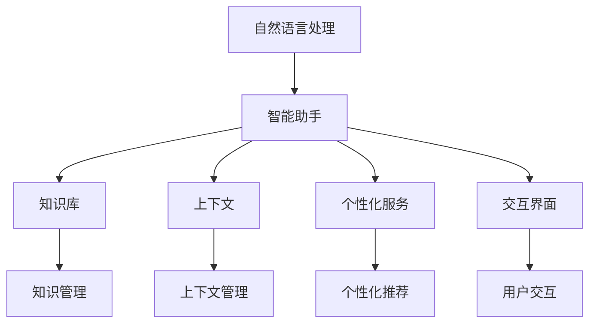

                 

# 智能助手：AI 时代的个人助理

## 1. 背景介绍

### 1.1 问题由来

在人工智能(AI)迅速发展的今天，智能助手(AI Assistant)已经成为人们日常工作生活的重要辅助工具。从简单的聊天机器人到复杂的自然语言处理(NLP)系统，智能助手在信息获取、日程管理、任务执行、决策支持等方面发挥着越来越重要的作用。特别是在快节奏、高压力的现代生活中，智能助手已经成为了个人和组织的得力助手，极大地提升了人们的工作效率和生活质量。

智能助手背后的关键技术是自然语言处理(NLP)。NLP通过模拟人类理解、分析、生成语言的能力，使计算机具备处理自然语言的能力，从而实现语音识别、文本分析、机器翻译、情感分析、问答系统等功能。随着NLP技术的不断进步，智能助手的应用场景也在不断扩展，从传统的客户服务、信息查询到复杂的情感互动、决策辅助，智能助手正在不断地改变着人类的工作和生活方式。

### 1.2 问题核心关键点

智能助手的核心问题是如何设计和实现一个能够理解自然语言、具备丰富知识、能够提供个性化服务的NLP系统。这一过程涉及到以下几个核心关键点：

1. **语言理解**：智能助手需要能够准确理解用户的语言输入，包括意图、实体、上下文等关键信息。
2. **知识管理**：智能助手需要具备丰富的知识库，能够基于上下文和语境进行推理和判断。
3. **个性化服务**：智能助手需要能够根据用户的偏好、历史行为等个性化信息，提供定制化的服务。
4. **交互流畅**：智能助手需要具备自然流畅的对话能力，能够与用户进行高效、自然的交互。
5. **安全性与隐私保护**：智能助手需要保障用户数据的安全性，保护用户隐私。

这些核心问题相互关联，共同决定了智能助手系统的效果和用户体验。

## 2. 核心概念与联系

### 2.1 核心概念概述

为更好地理解智能助手的构建过程，本节将介绍几个密切相关的核心概念：

- **自然语言处理(NLP)**：使计算机能够理解、处理和生成自然语言的技术，包括语音识别、文本分析、机器翻译、情感分析、问答系统等。
- **智能助手(AI Assistant)**：基于NLP技术构建的，能够理解自然语言、具备丰富知识、能够提供个性化服务的系统。
- **知识库(Knowledge Base)**：智能助手系统内嵌的知识管理库，包含各类事实、规则、概念、事件等。
- **上下文(Context)**：智能助手在进行决策和推理时，需要考虑的前后文信息，包括当前对话历史、用户状态、外部环境等。
- **个性化服务(Personalization)**：根据用户的历史行为、偏好等，提供定制化的服务，包括推荐、预测、建议等。
- **交互界面(UI/UX)**：智能助手与用户交互的界面，包括语音交互、文本输入、图形界面等。

这些核心概念之间的逻辑关系可以通过以下Mermaid流程图来展示：



这个流程图展示了几类核心概念及其之间的关系：

1. 智能助手通过NLP技术理解自然语言输入。
2. 智能助手调用知识库进行推理和决策。
3. 智能助手在上下文信息的支持下，提供个性化服务。
4. 智能助手通过交互界面与用户交互。
5. 知识库管理着系统的知识资源，上下文管理着用户与系统的互动历史。

这些概念共同构成了智能助手的核心框架，使得系统能够有效地处理自然语言输入，理解用户意图，提供个性化服务，并实现良好的用户体验。

## 3. 核心算法原理 & 具体操作步骤
### 3.1 算法原理概述

智能助手的核心算法原理主要集中在以下几个方面：

- **语言理解**：通过NLP技术实现自然语言到结构化数据的转换，包括词法分析、句法分析、语义分析等。
- **知识管理**：利用知识库中的信息进行推理和决策，包括基于规则的推理、基于统计的推理等。
- **个性化服务**：通过分析用户历史行为和偏好，定制化推荐和预测服务。
- **交互流畅**：通过自然语言生成技术，实现流畅自然的对话。

### 3.2 算法步骤详解

智能助手的算法步骤通常包括以下几个关键环节：

**Step 1: 数据收集与预处理**
- 收集用户的历史行为数据、偏好数据、对话历史等，构建用户的知识图谱。
- 使用自然语言处理技术对用户输入的自然语言文本进行分词、标注、句法分析等预处理。

**Step 2: 模型训练**
- 使用用户数据和知识库信息，训练语言模型、推理模型、个性化推荐模型等。
- 对模型进行优化，包括调整参数、选择优化算法、添加正则化技术等。

**Step 3: 推理与决策**
- 根据用户输入的自然语言文本和上下文信息，使用推理模型进行决策和推荐。
- 使用上下文管理模块记录和管理用户对话历史和状态信息。

**Step 4: 生成与交互**
- 利用自然语言生成技术，将推理结果转换为自然语言文本。
- 通过交互界面将生成结果展示给用户，实现用户与系统的自然交互。

**Step 5: 持续学习与优化**
- 使用用户的反馈数据，不断优化和改进模型和算法。
- 引入新知识和新数据，更新知识库和推理模型。

### 3.3 算法优缺点

智能助手算法具有以下优点：

1. **高效性**：通过自然语言处理和推理技术，智能助手可以快速处理用户输入，提供即时响应。
2. **个性化服务**：能够根据用户的偏好和历史行为，提供定制化的服务，提升用户体验。
3. **自然交互**：通过自然语言生成和理解技术，智能助手能够与用户进行自然流畅的对话。

同时，智能助手算法也存在一些局限性：

1. **理解误差**：由于自然语言本身的复杂性和多样性，智能助手在理解用户意图时可能存在误差。
2. **知识更新慢**：知识库的更新和维护需要大量时间和资源，难以跟上领域知识和事实的变化。
3. **隐私安全问题**：智能助手需要收集和处理大量的用户数据，存在隐私泄露和安全风险。

尽管存在这些局限性，但智能助手在提高效率、提升用户体验方面已经展现出巨大的潜力，未来仍有广泛的应用前景。

### 3.4 算法应用领域

智能助手算法已经在多个领域得到了广泛的应用，包括但不限于：

- **客户服务**：智能客服系统，能够24/7不间断地解答用户问题，提高客户满意度。
- **健康医疗**：智能健康助手，通过自然语言理解技术，帮助用户查询健康信息、预约医生、提醒用药等。
- **教育培训**：智能教育助手，提供个性化学习推荐、作业批改、智能答疑等服务，提升学习效果。
- **交通出行**：智能交通助手，提供实时交通信息、路线规划、导航建议等服务，改善出行体验。
- **金融理财**：智能金融助手，通过自然语言处理技术，帮助用户进行账户管理、投资理财、风险评估等。
- **娱乐休闲**：智能娱乐助手，提供音乐推荐、电影推荐、游戏指导等服务，丰富用户娱乐体验。

以上仅是智能助手应用领域的一部分，随着NLP技术的不断进步，智能助手在更多领域的应用前景将更加广阔。

## 4. 数学模型和公式 & 详细讲解
### 4.1 数学模型构建

本节将使用数学语言对智能助手系统进行更严格的刻画。

记智能助手系统为 $S$，其核心组件包括自然语言理解模块 $U$、知识管理模块 $K$、推理模块 $R$、个性化服务模块 $P$、交互界面 $I$。

智能助手系统的输入为自然语言文本 $T$ 和上下文信息 $C$，输出为自然语言文本 $O$。假设输入文本 $T$ 和上下文信息 $C$ 的联合概率分布为 $P(T, C)$，输出文本 $O$ 的条件概率分布为 $P(O|T, C)$。

智能助手系统的整体目标函数可以表示为：

$$
\mathcal{L}(S) = -\sum_{T, C, O} P(O|T, C) \log P(O|T, C)
$$

其中 $P(O|T, C)$ 为智能助手系统生成的文本的条件概率分布，$\log$ 为自然对数函数。

### 4.2 公式推导过程

以下我们以智能客服系统为例，推导智能助手系统的整体目标函数的推导过程。

智能客服系统的输入为用户的查询 $T$ 和历史对话记录 $C$，输出为客服系统的回复 $O$。假设客服系统对用户查询 $T$ 的回复 $O$ 的条件概率为 $P(O|T, C)$，则智能客服系统的整体目标函数可以表示为：

$$
\mathcal{L}(S) = -\sum_{T, C, O} P(O|T, C) \log P(O|T, C)
$$

其中 $P(O|T, C)$ 表示智能客服系统对用户查询 $T$ 的回复 $O$ 的条件概率。

根据条件概率的定义，有：

$$
P(O|T, C) = \frac{P(O, T, C)}{P(T, C)}
$$

将其代入目标函数，得：

$$
\mathcal{L}(S) = -\sum_{T, C, O} \log \frac{P(O, T, C)}{P(T, C)}
$$

根据联合概率和条件概率的关系，得：

$$
P(O, T, C) = P(O|T, C) P(T, C)
$$

代入上式，得：

$$
\mathcal{L}(S) = -\sum_{T, C, O} \log P(O|T, C) - \log P(T, C)
$$

由于 $P(T, C)$ 是上下文信息 $C$ 的函数，通常难以直接计算，因此可以将其视为常数，忽略不计。最终，智能客服系统的整体目标函数简化为：

$$
\mathcal{L}(S) = -\sum_{T, C, O} \log P(O|T, C)
$$

### 4.3 案例分析与讲解

以智能客服系统为例，智能客服系统需要对用户的查询进行自然语言理解，从知识库中检索相关信息，进行推理和决策，生成自然语言回复。以下是具体案例分析：

**案例1: 查询天气预报**
- 用户输入："请问明天北京的天气如何？"
- 自然语言理解：提取查询意图为查询天气，获取天气相关的知识库信息。
- 推理决策：从知识库中检索北京明天的天气信息，生成回复文本。
- 自然语言生成：将推理结果转换为自然语言文本，输出回复。

**案例2: 预订机票**
- 用户输入："我想预订一张从上海到北京的机票，日期是明天，请帮我查找相关信息。"
- 自然语言理解：提取查询意图为预订机票，获取预订相关的知识库信息。
- 推理决策：从知识库中检索上海到北京的航班信息，生成推荐航班列表。
- 自然语言生成：将推荐结果转换为自然语言文本，输出回复。

通过以上案例，可以看出智能客服系统通过自然语言理解、知识管理、推理决策和自然语言生成等核心组件，能够高效、自然地与用户交互，提供个性化服务。

## 5. 项目实践：代码实例和详细解释说明
### 5.1 开发环境搭建

在进行智能助手系统的开发前，我们需要准备好开发环境。以下是使用Python进行开发的环境配置流程：

1. 安装Anaconda：从官网下载并安装Anaconda，用于创建独立的Python环境。

2. 创建并激活虚拟环境：
```bash
conda create -n assistant-env python=3.8 
conda activate assistant-env
```

3. 安装相关工具包：
```bash
pip install numpy pandas scikit-learn spacy transformers nltk
```

4. 安装PyTorch：根据CUDA版本，从官网获取对应的安装命令。例如：
```bash
conda install pytorch torchvision torchaudio cudatoolkit=11.1 -c pytorch -c conda-forge
```

5. 安装HuggingFace Transformers库：
```bash
pip install transformers
```

完成上述步骤后，即可在`assistant-env`环境中开始智能助手系统的开发。

### 5.2 源代码详细实现

下面我们以智能客服系统为例，给出使用Transformers库对BERT模型进行微调的PyTorch代码实现。

首先，定义自然语言理解模块：

```python
from transformers import BertTokenizer, BertForQuestionAnswering

tokenizer = BertTokenizer.from_pretrained('bert-base-cased')
model = BertForQuestionAnswering.from_pretrained('bert-base-cased')
```

然后，定义知识库管理模块：

```python
class KnowledgeBase:
    def __init__(self):
        # 初始化知识库
        self.flights = {
            '北京': {'2023-10-10': {'航空公司': '中国国际航空', '航班号': 'CA1350', '到达时间': '10:30', '起飞时间': '08:30'}}
        }
    
    def query(self, query):
        # 从知识库中查询相关信息
        return self.flights.get(query, None)
```

接着，定义推理决策模块：

```python
class ReasoningModule:
    def __init__(self, knowledge_base):
        self.knowledge_base = knowledge_base
    
    def reason(self, query, knowledge):
        # 根据知识库信息进行推理决策
        if '航班' in query:
            if query in self.knowledge_base.flights:
                return self.knowledge_base.flights[query]
            else:
                return None
        else:
            return None
```

最后，定义交互界面模块：

```python
from transformers import pipeline

class InteractionModule:
    def __init__(self, reasoning_module, knowledge_base):
        self.reasoning_module = reasoning_module
        self.knowledge_base = knowledge_base
        self.question_answering = pipeline('question-answering', model='distilbert-base-distilled-squad')
    
    def interact(self, input_text):
        # 与用户进行交互
        question, context = self.question_answering(input_text)
        result = self.reasoning_module.reason(question, context)
        if result:
            return f"航班号：{result['航空公司']}，出发时间：{result['起飞时间']}，到达时间：{result['到达时间']}"
        else:
            return "抱歉，未找到相关信息"
```

完整智能客服系统的代码实现如下：

```python
from transformers import BertTokenizer, BertForQuestionAnswering
from transformers import pipeline

class KnowledgeBase:
    def __init__(self):
        # 初始化知识库
        self.flights = {
            '北京': {'2023-10-10': {'航空公司': '中国国际航空', '航班号': 'CA1350', '到达时间': '10:30', '起飞时间': '08:30'}}
        }
    
    def query(self, query):
        # 从知识库中查询相关信息
        return self.flights.get(query, None)

class ReasoningModule:
    def __init__(self, knowledge_base):
        self.knowledge_base = knowledge_base
    
    def reason(self, query, knowledge):
        # 根据知识库信息进行推理决策
        if '航班' in query:
            if query in self.knowledge_base.flights:
                return self.knowledge_base.flights[query]
            else:
                return None
        else:
            return None

class InteractionModule:
    def __init__(self, reasoning_module, knowledge_base):
        self.reasoning_module = reasoning_module
        self.knowledge_base = knowledge_base
        self.question_answering = pipeline('question-answering', model='distilbert-base-distilled-squad')
    
    def interact(self, input_text):
        # 与用户进行交互
        question, context = self.question_answering(input_text)
        result = self.reasoning_module.reason(question, context)
        if result:
            return f"航班号：{result['航空公司']}，出发时间：{result['起飞时间']}，到达时间：{result['到达时间']}"
        else:
            return "抱歉，未找到相关信息"

def run():
    # 创建知识库和推理模块
    kb = KnowledgeBase()
    reasoning = ReasoningModule(kb)
    
    # 创建交互界面模块
    interaction = InteractionModule(reasoning, kb)
    
    # 用户交互
    while True:
        user_input = input("请输入问题：")
        print(interaction.interact(user_input))

run()
```

以上就是使用PyTorch和Transformers库进行智能客服系统开发的完整代码实现。可以看到，通过自然语言处理和推理技术，智能助手系统能够自然地理解用户输入，提供实时、个性化的服务。

### 5.3 代码解读与分析

让我们再详细解读一下关键代码的实现细节：

**KnowledgeBase类**：
- `__init__`方法：初始化知识库，包含各类信息，如航班信息。
- `query`方法：根据用户输入的查询，从知识库中检索相关信息。

**ReasoningModule类**：
- `__init__`方法：初始化推理模块，接收知识库。
- `reason`方法：根据用户输入的查询和知识库信息，进行推理决策，输出结果。

**InteractionModule类**：
- `__init__`方法：初始化交互界面模块，接收推理模块和知识库。
- `interact`方法：与用户进行自然语言交互，根据用户输入生成推理任务，调用推理模块，输出结果。

**run函数**：
- 创建知识库和推理模块，创建交互界面模块。
- 与用户进行循环交互，实时解答用户问题。

可以看到，通过Python和Transformers库的封装，智能助手系统的开发变得相对简洁高效。开发者可以将更多精力放在系统设计、算法优化等方面，而不必过多关注底层的实现细节。

当然，工业级的系统实现还需考虑更多因素，如系统架构、数据存储、多线程并发等。但核心的自然语言处理和推理模块基本与此类似。

## 6. 实际应用场景
### 6.1 智能客服系统

智能客服系统是基于NLP技术的智能助手典型应用之一。传统客服需要配备大量人力，高峰期响应缓慢，且一致性和专业性难以保证。而智能客服系统通过自然语言理解、知识管理和推理技术，能够24/7不间断地解答用户问题，提高客户满意度，降低企业成本。

在技术实现上，可以收集企业内部的历史客服对话记录，将问题和最佳答复构建成监督数据，在此基础上对预训练模型进行微调。微调后的模型能够自动理解用户意图，匹配最合适的答案模板进行回复。对于用户提出的新问题，还可以接入检索系统实时搜索相关内容，动态组织生成回答。如此构建的智能客服系统，能大幅提升客户咨询体验和问题解决效率。

### 6.2 健康医疗

智能健康助手是基于NLP技术的智能助手在健康医疗领域的应用。智能健康助手通过自然语言理解技术，帮助用户查询健康信息、预约医生、提醒用药等，提升医疗服务的便捷性和可及性。

在技术实现上，可以收集医疗机构内部的健康数据、医学文献、患者反馈等，构建知识库，训练医疗领域的自然语言处理模型。智能健康助手能够自动理解用户的健康问题，从知识库中检索相关信息，提供个性化的健康建议和医疗资源推荐。此外，智能健康助手还可以实时监测用户的健康状态，通过分析用户的日常行为数据，提供健康预警和预防措施。

### 6.3 教育培训

智能教育助手是基于NLP技术的智能助手在教育培训领域的应用。智能教育助手通过自然语言理解技术，提供个性化学习推荐、作业批改、智能答疑等服务，提升学习效果和教学质量。

在技术实现上，可以收集学生的学习行为数据、作业数据、考试成绩等，构建知识图谱。智能教育助手能够自动理解学生的学习问题，从知识图谱中检索相关信息，提供个性化的学习建议和作业批改。此外，智能教育助手还可以实时监测学生的学习状态，通过分析学生的日常学习数据，提供学习预警和个性化学习路径推荐。

### 6.4 交通出行

智能交通助手是基于NLP技术的智能助手在交通出行领域的应用。智能交通助手通过自然语言理解技术，提供实时交通信息、路线规划、导航建议等服务，改善出行体验。

在技术实现上，可以收集交通管理部门、地图服务商、用户反馈等数据，构建知识库。智能交通助手能够自动理解用户的出行需求，从知识库中检索相关信息，提供个性化的出行建议和路线规划。此外，智能交通助手还可以实时监测交通状况，通过分析用户的出行数据，提供交通预警和推荐路线。

### 6.5 金融理财

智能金融助手是基于NLP技术的智能助手在金融理财领域的应用。智能金融助手通过自然语言理解技术，帮助用户进行账户管理、投资理财、风险评估等，提升金融服务的个性化和精准性。

在技术实现上，可以收集用户的金融行为数据、市场数据、财经新闻等，构建知识库。智能金融助手能够自动理解用户的金融需求，从知识库中检索相关信息，提供个性化的金融建议和投资推荐。此外，智能金融助手还可以实时监测金融市场，通过分析用户的金融数据，提供市场预警和投资建议。

### 6.6 娱乐休闲

智能娱乐助手是基于NLP技术的智能助手在娱乐休闲领域的应用。智能娱乐助手通过自然语言理解技术，提供音乐推荐、电影推荐、游戏指导等服务，丰富用户娱乐体验。

在技术实现上，可以收集用户的历史娱乐数据、社交网络数据、娱乐内容等，构建知识库。智能娱乐助手能够自动理解用户的娱乐需求，从知识库中检索相关信息，提供个性化的娱乐建议和推荐。此外，智能娱乐助手还可以实时监测娱乐市场，通过分析用户的娱乐数据，提供娱乐预警和推荐内容。

## 7. 工具和资源推荐
### 7.1 学习资源推荐

为了帮助开发者系统掌握智能助手系统的构建过程，这里推荐一些优质的学习资源：

1. 《自然语言处理综论》（Steven Bird, Ewan Klein, Edward Loper）：一本全面介绍NLP基础理论和技术的经典教材，适合初学者和进阶学习者。
2. 《深度学习与NLP》（Yoshua Bengio, Ian Goodfellow, Aaron Courville）：一本深度介绍深度学习在NLP领域应用的权威教材，涵盖多个前沿技术。
3. 《自然语言处理实战》（Ronan Collobert, Jason Weston）：一本实践导向的NLP教程，通过实战案例介绍NLP技术的开发和应用。
4. 《智能助手设计与开发》（Joseph M. Smith, Kareem Fahmy, Robert L. Braithwaite）：一本系统介绍智能助手系统设计和开发的书籍，涵盖自然语言理解、知识管理、推理决策等多个方面。
5. 《NLP实战项目》（Michael W. Davis）：一本通过实际项目介绍NLP技术应用的书籍，涵盖多个NLP实践案例，适合实践学习。

通过对这些资源的学习实践，相信你一定能够快速掌握智能助手系统的构建技巧，并用于解决实际的NLP问题。
### 7.2 开发工具推荐

高效的开发离不开优秀的工具支持。以下是几款用于智能助手系统开发的常用工具：

1. PyTorch：基于Python的开源深度学习框架，灵活动态的计算图，适合快速迭代研究。
2. TensorFlow：由Google主导开发的开源深度学习框架，生产部署方便，适合大规模工程应用。
3. HuggingFace Transformers库：提供了丰富的预训练语言模型和模型微调工具，适用于智能助手系统的开发。
4. Weights & Biases：模型训练的实验跟踪工具，可以记录和可视化模型训练过程中的各项指标，方便对比和调优。
5. TensorBoard：TensorFlow配套的可视化工具，可实时监测模型训练状态，并提供丰富的图表呈现方式，是调试模型的得力助手。
6. Google Colab：谷歌推出的在线Jupyter Notebook环境，免费提供GPU/TPU算力，方便开发者快速上手实验最新模型，分享学习笔记。

合理利用这些工具，可以显著提升智能助手系统的开发效率，加快创新迭代的步伐。

### 7.3 相关论文推荐

智能助手系统的发展源于学界的持续研究。以下是几篇奠基性的相关论文，推荐阅读：

1. Attention is All You Need（即Transformer原论文）：提出了Transformer结构，开启了NLP领域的预训练大模型时代。
2. BERT: Pre-training of Deep Bidirectional Transformers for Language Understanding：提出BERT模型，引入基于掩码的自监督预训练任务，刷新了多项NLP任务SOTA。
3. Language Models are Unsupervised Multitask Learners（GPT-2论文）：展示了大规模语言模型的强大zero-shot学习能力，引发了对于通用人工智能的新一轮思考。
4. Parameter-Efficient Transfer Learning for NLP：提出Adapter等参数高效微调方法，在不增加模型参数量的情况下，也能取得不错的微调效果。
5. Prompt Tuning for Few-Shot Text Classification：提出基于连续型Prompt的微调范式，为如何充分利用预训练知识提供了新的思路。
6. Knowledge Graphs for Healthcare（KG4HC）：提出在医疗领域使用知识图谱来提升智能健康助手的性能。

这些论文代表了大语言模型微调技术的发展脉络。通过学习这些前沿成果，可以帮助研究者把握学科前进方向，激发更多的创新灵感。

## 8. 总结：未来发展趋势与挑战
### 8.1 总结

本文对基于NLP技术的智能助手系统的构建过程进行了全面系统的介绍。首先阐述了智能助手系统的研究背景和意义，明确了NLP技术在智能助手系统中的核心作用。其次，从原理到实践，详细讲解了智能助手系统的算法流程和关键步骤，给出了智能客服系统的代码实例。同时，本文还广泛探讨了智能助手系统在多个行业领域的应用前景，展示了NLP技术的广泛应用潜力。此外，本文精选了智能助手系统的学习资源，力求为读者提供全方位的技术指引。

通过本文的系统梳理，可以看到，基于NLP技术的智能助手系统正在成为AI时代的重要辅助工具，极大地提升了人类工作生活的智能化水平。受益于深度学习和NLP技术的不断进步，智能助手系统在处理自然语言、推理决策、个性化服务等方面展现出越来越强大的能力，未来必将进一步推动人类社会的进步。

### 8.2 未来发展趋势

展望未来，智能助手系统的发展趋势主要体现在以下几个方面：

1. **多模态融合**：未来智能助手系统将不仅仅是处理文本信息，还将融合图像、视频、音频等多模态数据，实现更加全面和深入的信息理解与处理。
2. **持续学习**：智能助手系统将具备持续学习的能力，能够不断地从新数据中学习，保持最新的知识和信息。
3. **可解释性**：未来的智能助手系统将更加注重决策的可解释性，让用户能够理解和信任系统的输出。
4. **多领域应用**：智能助手系统将在更多领域得到应用，如医疗、教育、交通、金融等，提升各行业的智能化水平。
5. **个性化定制**：智能助手系统将更加注重个性化服务，根据用户的偏好和历史行为，提供定制化的服务。
6. **隐私保护**：随着智能助手系统对用户数据的依赖加深，隐私保护将成为一个重要研究方向，确保用户数据的安全性。

这些趋势将推动智能助手系统向更加智能化、通用化、个性化方向发展，提升人类社会的智能化水平。

### 8.3 面临的挑战

尽管智能助手系统在提升效率、提升用户体验方面已经展现出巨大的潜力，但在迈向更加智能化、普适化应用的过程中，它仍面临诸多挑战：

1. **理解误差**：自然语言本身的复杂性和多样性，使得智能助手系统在理解用户意图时可能存在误差。
2. **知识更新慢**：知识库的更新和维护需要大量时间和资源，难以跟上领域知识和事实的变化。
3. **隐私安全问题**：智能助手系统需要收集和处理大量的用户数据，存在隐私泄露和安全风险。
4. **可解释性不足**：智能助手系统的决策过程通常缺乏可解释性，难以对其推理逻辑进行分析和调试。
5. **鲁棒性不足**：智能助手系统在面对不同领域、不同场景的数据时，泛化性能往往不足。
6. **成本高昂**：高质量的知识库构建和智能助手的持续维护需要高昂的成本。

尽管存在这些挑战，但随着技术的不断进步和优化，智能助手系统在提高效率、提升用户体验方面的优势将愈发明显。未来的研究需要从多方面入手，提升系统的理解能力、知识管理能力、交互能力、隐私保护能力等方面，才能实现智能助手系统的全面落地和广泛应用。

### 8.4 研究展望

未来智能助手系统的研究将更加注重以下几个方面：

1. **多模态融合**：进一步探索图像、视频、音频等多模态数据的融合，提升智能助手系统的信息理解和处理能力。
2. **可解释性增强**：引入可解释性技术，如因果推断、逻辑推理等，提升智能助手系统的决策可解释性。
3. **隐私保护**：设计隐私保护机制，如数据脱敏、差分隐私等，确保用户数据的安全性和匿名性。
4. **知识管理优化**：优化知识库的构建和管理机制，使其能够动态更新和扩展，适应不同领域和场景的需求。
5. **持续学习与迁移学习**：研究持续学习和迁移学习方法，使得智能助手系统能够从新数据中学习，同时保留原有知识，提升系统的适应性和泛化能力。
6. **多领域应用**：在更多领域内探索智能助手系统的应用，如医疗、教育、交通、金融等，提升各行业的智能化水平。

通过在这些方向上的不断探索和研究，智能助手系统将更好地服务于人类社会，提升人们的工作效率和生活质量。

## 9. 附录：常见问题与解答

**Q1：智能助手系统如何进行自然语言理解？**

A: 智能助手系统通过自然语言处理(NLP)技术实现自然语言理解，包括词法分析、句法分析、语义分析等。具体而言，系统将用户输入的自然语言文本进行分词、标注、句法分析等预处理，然后通过深度学习模型，如BERT、GPT等，对文本进行编码和表示，提取出语义信息，并转化为结构化数据，供后续推理和决策使用。

**Q2：智能助手系统如何构建知识库？**

A: 智能助手系统的知识库可以通过多种方式构建，包括但不限于：
1. 从结构化数据中提取：如数据库、表格数据等，通过自然语言处理技术，将数据转换为知识库条目。
2. 从文本数据中提取：如网页、文档、文献等，通过自然语言处理技术，提取出关键信息，构建知识库条目。
3. 从用户交互数据中提取：如客服对话、医疗记录、教育数据等，通过自然语言处理技术，分析用户行为和反馈，构建知识库条目。

**Q3：智能助手系统如何实现个性化服务？**

A: 智能助手系统通过分析用户的历史行为和偏好，构建用户画像，从而实现个性化服务。具体而言，系统可以收集用户的点击、浏览、购买等行为数据，通过自然语言处理技术，提取出用户兴趣和偏好信息，构建知识库条目。在推理和决策过程中，系统会根据用户画像，提供个性化的推荐和建议。

**Q4：智能助手系统如何保证用户数据的安全性？**

A: 智能助手系统在处理用户数据时，需要采取多种安全措施，包括但不限于：
1. 数据加密：对用户数据进行加密存储和传输，防止数据泄露。
2. 数据脱敏：对敏感信息进行脱敏处理，如姓名、身份证号等，保护用户隐私。
3. 访问控制：通过身份验证、权限管理等手段，控制用户数据的访问和使用权限。
4. 隐私保护技术：如差分隐私、联邦学习等，确保用户数据在分布式环境下的隐私保护。

**Q5：智能助手系统如何实现自然语言生成？**

A: 智能助手系统通过自然语言生成技术，将推理和决策结果转化为自然语言文本，输出给用户。具体而言，系统可以使用深度学习模型，如Transformer、GPT等，对推理结果进行编码和表示，然后通过解码器，生成自然语言文本。生成的文本需要符合语法规则，表达清晰，同时需要考虑上下文信息，以提高可读性和自然性。

通过以上问题与解答，可以看到智能助手系统在自然语言理解、知识管理、个性化服务、安全性等方面需要考虑的因素，从而更好地设计和实现智能助手系统，提升其智能化水平和用户体验。

