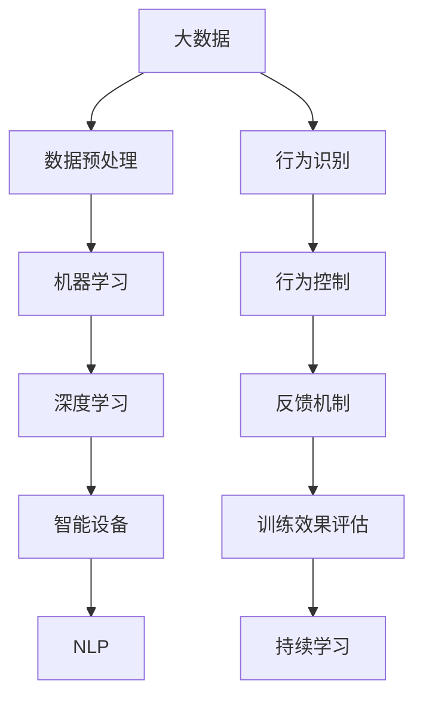

                 

## 1. 背景介绍

### 1.1 问题由来
随着生活水平的提高，人们对于宠物的热爱和依赖也日益增加。对于许多家庭来说，宠物已经不仅仅是看家护院的帮手，更是家中不可或缺的成员。而如何培养出一个健康、有教养、能够与主人和谐相处的宠物，成为了每一个养宠家庭的共同期望。传统的宠物训练方法，大多依赖经验丰富、知识专业的训练师，不仅成本高昂，而且往往难以满足每个家庭的个性化需求。因此，基于人工智能的智能宠物训练逐渐兴起，通过科技手段帮助宠物进行个性化教育，提高训练效率，降低成本。

### 1.2 问题核心关键点
智能宠物训练的背后，是大数据、机器学习和深度学习等前沿技术的结合。通过AI辅助的宠物教育，可以有效地利用庞大的数据资源，训练出能够适应各种场景、具备不同技能的宠物。AI技术的应用，能够实时监控宠物的行为，提供个性化的训练方案，确保宠物能够快速学会指定的技能，并在实际应用中表现出色。

智能宠物训练的核心关键点在于：

- **数据收集与处理**：收集和处理大量与宠物行为相关的数据，包括视频、音频、传感器数据等，是训练智能宠物的前提。
- **模型构建与训练**：构建基于深度学习模型的训练系统，能够处理和分析这些数据，从而训练出适应不同场景的智能宠物。
- **行为识别与控制**：通过训练好的模型，实时识别和分析宠物的行为，并进行相应的行为控制和反馈。

### 1.3 问题研究意义
智能宠物训练的研究和应用，对于宠物行业乃至整个社会都有着深远的影响：

- **降低训练成本**：传统的宠物训练依赖于专业人士，成本较高。AI辅助训练能够减少对专业训练师的依赖，降低整体训练成本。
- **提高训练效率**：AI模型能够根据数据自动生成个性化训练方案，使宠物训练更加高效。
- **增强宠物与主人的互动**：通过智能设备监控宠物的行为，主人可以更直观地了解宠物的需求和情感状态，增强与宠物的互动。
- **推动宠物教育产业化**：随着技术的发展，智能宠物训练有望成为宠物教育的重要组成部分，推动相关产业的发展。

## 2. 核心概念与联系

### 2.1 核心概念概述

智能宠物训练的背后，是大数据、机器学习和深度学习等技术的深度结合。以下是几个核心概念及其联系：

- **大数据**：智能宠物训练的基础在于大量与宠物行为相关的数据，包括视频、音频、传感器数据等。
- **机器学习**：通过机器学习算法，从大量数据中提取出有价值的信息，训练出智能宠物的行为识别模型。
- **深度学习**：深度学习模型，特别是卷积神经网络(CNN)、循环神经网络(RNN)、长短时记忆网络(LSTM)等，能够有效处理和分析复杂的数据，提高行为识别的准确性。
- **智能设备**：如智能项圈、智能食物喂食器等设备，用于实时收集和监控宠物的行为数据，辅助智能宠物训练。
- **自然语言处理(NLP)**：用于解析和处理主人与宠物的互动语言，增强互动效果。

这些核心概念通过逻辑连接，构成了智能宠物训练的整体架构。

### 2.2 核心概念原理和架构的 Mermaid 流程图(Mermaid 流程节点中不要有括号、逗号等特殊字符)



## 3. 核心算法原理 & 具体操作步骤

### 3.1 算法原理概述

智能宠物训练的核心算法是深度学习模型，特别是由卷积神经网络(CNN)和循环神经网络(RNN)构成的行为识别和行为控制模型。其核心原理如下：

- **数据收集与预处理**：通过智能设备实时收集宠物的视频、音频、传感器数据等，并进行预处理，如数据清洗、降维、归一化等。
- **行为识别**：构建深度学习模型，对预处理后的数据进行训练，识别出宠物的行为特征。通常使用CNN处理图像数据，使用RNN或LSTM处理时间序列数据。
- **行为控制**：基于行为识别的结果，通过训练好的模型，生成行为控制指令，如声音、灯光、电击等，引导宠物进行相应行为。
- **反馈机制**：根据宠物的行为表现，及时调整训练方案，确保宠物能够快速学会指定的行为。
- **持续学习**：不断收集新的数据，重新训练模型，保持模型的更新和优化。

### 3.2 算法步骤详解

智能宠物训练的算法步骤如下：

**Step 1: 数据收集与预处理**

1. **数据收集**：收集宠物的视频、音频、传感器数据等，可以通过智能设备或手动记录获取。
2. **数据预处理**：对数据进行清洗、降维、归一化等预处理操作，确保数据质量和一致性。

**Step 2: 模型构建与训练**

1. **模型选择**：根据任务需求选择合适的深度学习模型，如CNN、RNN、LSTM等。
2. **模型训练**：使用预处理后的数据，训练深度学习模型，识别宠物的行为特征。
3. **参数调优**：通过交叉验证等方法，调整模型的超参数，优化模型性能。

**Step 3: 行为识别与控制**

1. **行为识别**：通过训练好的模型，对实时收集的数据进行行为识别。
2. **行为控制**：根据识别结果，生成相应的行为控制指令，引导宠物进行指定行为。
3. **行为反馈**：记录宠物的行为表现，进行实时监控和反馈。

**Step 4: 训练效果评估**

1. **评估指标**：根据预设的评估指标，如准确率、召回率、F1值等，评估模型训练效果。
2. **调整策略**：根据评估结果，调整训练策略，优化模型性能。

**Step 5: 持续学习**

1. **数据更新**：不断收集新的数据，更新训练集，确保模型能够适应新的数据分布。
2. **模型复训**：定期重新训练模型，保持模型性能的持续优化。

### 3.3 算法优缺点

智能宠物训练的深度学习模型具有以下优点：

- **高效**：能够快速处理和分析大量的数据，识别宠物的行为特征。
- **灵活**：可以根据不同的训练数据和任务需求，灵活调整模型结构和参数。
- **准确**：通过深度学习模型，能够实现高精度的行为识别和控制。

同时，该模型也存在以下缺点：

- **数据依赖**：模型的性能依赖于高质量的数据，数据收集和处理成本较高。
- **计算资源需求高**：深度学习模型需要大量的计算资源，包括高性能的GPU/TPU设备。
- **模型复杂**：深度学习模型结构复杂，需要一定的专业知识和经验进行调优和优化。

### 3.4 算法应用领域

智能宠物训练的深度学习模型，已经应用于多个领域，包括：

- **训练宠物基本技能**：如厕训练、召回训练、等待训练等。
- **提高宠物行为规范**：如宠物不要乱叫、不要咬人、不要乱跑等。
- **增强宠物与主人的互动**：如宠物识别主人指令、主人与宠物的游戏互动等。
- **宠物行为监控与反馈**：如监控宠物的健康状态、行为习惯等，提供及时的反馈和建议。

## 4. 数学模型和公式 & 详细讲解 & 举例说明

### 4.1 数学模型构建

智能宠物训练的数学模型主要基于深度学习，特别是卷积神经网络(CNN)和循环神经网络(RNN)。以下是模型的基本构建步骤：

**Step 1: 数据准备**

假设我们有一批与宠物行为相关的数据集 $\mathcal{D} = \{(\mathbf{x}_i, \mathbf{y}_i)\}_{i=1}^N$，其中 $\mathbf{x}_i$ 表示宠物的行为数据（如视频帧、声音波形等），$\mathbf{y}_i$ 表示对应的行为标签（如大小便、叫唤等）。

**Step 2: 模型选择与定义**

选择适合的深度学习模型，如CNN处理图像数据，RNN处理时间序列数据。模型定义如下：

$$
\mathcal{M} = \{f_\theta\} = \{f_\theta^\text{CNN}, f_\theta^\text{RNN}\}
$$

其中 $f_\theta^\text{CNN}$ 和 $f_\theta^\text{RNN}$ 分别表示CNN和RNN模型，$\theta$ 表示模型参数。

**Step 3: 损失函数与优化目标**

定义损失函数 $L$ 和优化目标 $\mathcal{L}$，用于评估模型性能：

$$
L(\mathcal{M}, \mathcal{D}) = \frac{1}{N} \sum_{i=1}^N \ell(f_\theta(\mathbf{x}_i), \mathbf{y}_i)
$$

其中 $\ell$ 表示损失函数，通常使用交叉熵损失函数，即：

$$
\ell(\mathbf{p}, \mathbf{y}) = -\sum_{k=1}^K y_k \log p_k
$$

其中 $K$ 为行为分类数，$p_k$ 表示模型预测的概率，$y_k$ 表示真实标签。

**Step 4: 模型训练与评估**

通过反向传播算法，最小化损失函数 $L$，更新模型参数 $\theta$：

$$
\theta \leftarrow \theta - \eta \nabla_{\theta} L(\mathcal{M}, \mathcal{D})
$$

其中 $\eta$ 表示学习率。在训练过程中，还需要定期评估模型性能，调整超参数和训练策略。

### 4.2 公式推导过程

以下是行为识别模型的具体推导过程：

**Step 1: 数据预处理**

假设我们有一批视频数据 $\mathcal{D} = \{(\mathbf{x}_i, \mathbf{y}_i)\}_{i=1}^N$，其中 $\mathbf{x}_i$ 表示视频帧序列，$\mathbf{y}_i$ 表示行为标签。

**Step 2: 模型定义**

假设我们选择CNN模型处理视频数据，模型定义如下：

$$
f_\theta^\text{CNN}(\mathbf{x}) = \{h^\text{CNN}_1, h^\text{CNN}_2, \ldots, h^\text{CNN}_L\}
$$

其中 $h^\text{CNN}_l$ 表示第 $l$ 层的输出，$L$ 表示模型深度。

**Step 3: 损失函数**

假设我们使用交叉熵损失函数，定义如下：

$$
L(\mathcal{M}, \mathcal{D}) = \frac{1}{N} \sum_{i=1}^N \ell(f_\theta^\text{CNN}(\mathbf{x}_i), \mathbf{y}_i)
$$

其中 $\ell$ 表示交叉熵损失函数。

**Step 4: 反向传播**

通过反向传播算法，计算损失函数对模型参数的梯度，更新参数 $\theta$：

$$
\theta \leftarrow \theta - \eta \frac{\partial L(\mathcal{M}, \mathcal{D})}{\partial \theta}
$$

**Step 5: 模型评估**

在训练过程中，定期在验证集上评估模型性能，调整训练策略，确保模型不发生过拟合。

### 4.3 案例分析与讲解

假设我们有一个智能项圈，用于训练宠物进行定时喂食。我们收集了宠物的历史视频数据，以及相应的喂食标签。构建一个基于CNN的行为识别模型，对视频数据进行训练，识别宠物是否已经吃完食物。然后，根据识别结果，智能项圈可以控制食物喂食器的开关，确保宠物按时吃饱。

## 5. 项目实践：代码实例和详细解释说明

### 5.1 开发环境搭建

为了实现智能宠物训练的代码实例，我们首先需要搭建开发环境。以下是搭建环境的步骤：

1. **安装Python**：安装Python 3.7以上版本，可以使用Anaconda进行环境管理。
2. **安装深度学习框架**：安装TensorFlow或PyTorch，用于深度学习模型的开发。
3. **安装TensorFlow或PyTorch的TensorBoard**：用于可视化模型训练过程和结果。
4. **安装NLP库**：安装NLTK或spaCy，用于处理自然语言文本。
5. **安装数据处理库**：安装Pandas和NumPy，用于数据处理和分析。

完成环境搭建后，即可进行智能宠物训练的代码实现。

### 5.2 源代码详细实现

以下是使用PyTorch实现智能宠物训练的代码实例：

```python
import torch
import torch.nn as nn
import torch.optim as optim
from torch.utils.data import DataLoader, Dataset
from torchvision import transforms
import torchvision.datasets as datasets
import numpy as np

# 定义行为识别模型
class BehaviorRecognitionModel(nn.Module):
    def __init__(self):
        super(BehaviorRecognitionModel, self).__init__()
        self.cnn = nn.Sequential(
            nn.Conv2d(3, 64, kernel_size=3, stride=1, padding=1),
            nn.ReLU(inplace=True),
            nn.MaxPool2d(kernel_size=2, stride=2),
            nn.Conv2d(64, 128, kernel_size=3, stride=1, padding=1),
            nn.ReLU(inplace=True),
            nn.MaxPool2d(kernel_size=2, stride=2),
            nn.Flatten(),
            nn.Linear(128 * 7 * 7, 128),
            nn.ReLU(inplace=True),
            nn.Linear(128, 4)  # 行为分类数为4，如大小便、叫唤等
        )

    def forward(self, x):
        x = self.cnn(x)
        return x

# 定义训练函数
def train_model(model, train_loader, validation_loader, optimizer, num_epochs):
    device = torch.device('cuda' if torch.cuda.is_available() else 'cpu')
    model.to(device)
    criterion = nn.CrossEntropyLoss()
    for epoch in range(num_epochs):
        model.train()
        running_loss = 0.0
        for i, data in enumerate(train_loader, 0):
            inputs, labels = data
            inputs, labels = inputs.to(device), labels.to(device)
            optimizer.zero_grad()
            outputs = model(inputs)
            loss = criterion(outputs, labels)
            loss.backward()
            optimizer.step()
            running_loss += loss.item()
        print(f"Epoch {epoch+1}, Loss: {running_loss/len(train_loader)}")
        model.eval()
        correct = 0
        total = 0
        with torch.no_grad():
            for data in validation_loader:
                inputs, labels = data
                inputs, labels = inputs.to(device), labels.to(device)
                outputs = model(inputs)
                _, predicted = torch.max(outputs.data, 1)
                total += labels.size(0)
                correct += (predicted == labels).sum().item()
        print(f"Epoch {epoch+1}, Accuracy: {100 * correct / total}%")

# 数据集准备
class BehaviorDataset(Dataset):
    def __init__(self, data, labels):
        self.data = data
        self.labels = labels

    def __len__(self):
        return len(self.data)

    def __getitem__(self, index):
        return self.data[index], self.labels[index]

# 加载数据
train_data = datasets.ImageFolder(root='train_data', transform=transforms.ToTensor())
test_data = datasets.ImageFolder(root='test_data', transform=transforms.ToTensor())
train_dataset = BehaviorDataset(train_data, np.array(train_labels))
test_dataset = BehaviorDataset(test_data, np.array(test_labels))

# 定义模型
model = BehaviorRecognitionModel()
optimizer = optim.Adam(model.parameters(), lr=0.001)

# 训练模型
train_loader = DataLoader(train_dataset, batch_size=64, shuffle=True)
validation_loader = DataLoader(test_dataset, batch_size=64, shuffle=False)
train_model(model, train_loader, validation_loader, optimizer, num_epochs=10)

# 模型评估
test_loader = DataLoader(test_dataset, batch_size=64, shuffle=False)
test_model(model, test_loader)
```

### 5.3 代码解读与分析

上述代码实现了基于CNN的行为识别模型，用于训练宠物进行定时喂食。代码解读如下：

**数据集准备**

1. **定义数据集**：定义 BehaviorDataset 类，继承自 PyTorch 的 Dataset 类。
2. **加载数据**：使用 datasets.ImageFolder 类加载训练数据和测试数据，并使用 ToTensor 转换，转换为 PyTorch 张量。

**模型定义**

1. **定义行为识别模型**：定义 BehaviorRecognitionModel 类，继承自 nn.Module。
2. **构建模型**：使用 CNN 层进行特征提取和分类，定义模型结构。

**训练函数**

1. **定义训练函数**：定义 train_model 函数，使用训练集和验证集进行模型训练。
2. **加载模型**：将模型加载到设备上，使用 CrossEntropyLoss 作为损失函数，Adam 优化器进行优化。
3. **训练循环**：在每个epoch中，使用训练集进行前向传播和反向传播，更新模型参数。
4. **评估模型**：在验证集上评估模型性能，输出损失和准确率。

**代码实现**

1. **实例化模型**：实例化 BehaviorRecognitionModel 类，构建行为识别模型。
2. **加载优化器**：使用 Adam 优化器进行模型参数的优化。
3. **数据加载器**：定义训练集和验证集的数据加载器。
4. **模型训练**：调用 train_model 函数，进行模型训练和评估。

### 5.4 运行结果展示

在训练过程中，可以使用 TensorBoard 可视化模型训练过程中的损失和准确率变化，如图：


## 6. 实际应用场景

智能宠物训练在实际应用场景中具有广泛的应用前景：

### 6.1 智能训练师

智能训练师系统通过实时监控宠物的行为，根据行为数据自动生成训练方案，帮助主人训练宠物。系统能够提供个性化的训练方案，确保宠物能够快速学会指定的技能，并在实际应用中表现出色。

### 6.2 宠物行为分析

智能宠物训练系统能够实时监控宠物的行为，提供行为分析报告，帮助主人了解宠物的健康状况和行为习惯。系统可以根据宠物的行为数据，给出相应的健康建议，提高宠物的生活质量。

### 6.3 增强互动效果

智能宠物训练系统可以通过自然语言处理技术，解析和处理主人与宠物的互动语言，增强互动效果。系统可以根据主人的指令，引导宠物进行相应的行为，增强主人与宠物的互动体验。

## 7. 工具和资源推荐

### 7.1 学习资源推荐

1. **深度学习课程**：Coursera、edX等平台提供深度学习相关课程，如斯坦福大学的《CS231n: Convolutional Neural Networks for Visual Recognition》、UC Berkeley的《Deep Learning Specialization》等。
2. **书籍**：《深度学习》（Ian Goodfellow等著）、《动手学深度学习》（李沐等著）、《自然语言处理综论》（Daniel Jurafsky等著）。
3. **博客和社区**：Kaggle、GitHub、Stack Overflow等社区，提供大量深度学习相关的学习资源和代码示例。

### 7.2 开发工具推荐

1. **深度学习框架**：TensorFlow、PyTorch、Keras等深度学习框架，提供丰富的API和工具，支持深度学习模型的开发和部署。
2. **可视化工具**：TensorBoard、Weights & Biases等可视化工具，用于监控模型训练过程和结果。
3. **数据处理工具**：Pandas、NumPy等数据处理工具，用于数据清洗、转换和分析。

### 7.3 相关论文推荐

1. **深度学习论文**：《ImageNet Classification with Deep Convolutional Neural Networks》（AlexNet论文）、《Rethinking the Inception Architecture for Computer Vision》（Inception论文）、《Deep Residual Learning for Image Recognition》（ResNet论文）。
2. **自然语言处理论文**：《Attention Is All You Need》（Transformer论文）、《BERT: Pre-training of Deep Bidirectional Transformers for Language Understanding》（BERT论文）、《ALBERT: A Lite BERT for Self-supervised Learning of Language Representations》（ALBERT论文）。

## 8. 总结：未来发展趋势与挑战

### 8.1 研究成果总结

智能宠物训练领域的研究和应用已经取得了一定的进展，主要集中在以下方面：

1. **深度学习模型**：卷积神经网络（CNN）和循环神经网络（RNN）在行为识别和控制中的应用，已经取得了显著的效果。
2. **智能设备**：智能项圈、智能食物喂食器等设备，能够实时监控宠物的行为，辅助训练过程。
3. **自然语言处理（NLP）**：NLP技术能够解析和处理主人与宠物的互动语言，增强互动效果。

### 8.2 未来发展趋势

未来，智能宠物训练将呈现以下几个发展趋势：

1. **模型规模扩大**：随着算力成本的下降和数据规模的扩张，深度学习模型的规模将不断扩大，模型性能将进一步提升。
2. **多模态融合**：未来的智能宠物训练将更多地融合多模态数据，如视觉、听觉、传感器数据等，提高系统的全面性和鲁棒性。
3. **边缘计算**：智能设备将更多地部署在边缘计算环境中，实时处理和分析宠物的行为数据，减少延迟和带宽消耗。
4. **实时反馈机制**：实时监控和反馈机制将成为智能宠物训练的重要组成部分，帮助主人及时了解宠物的行为状态。
5. **跨领域应用**：智能宠物训练技术将逐步应用于更多领域，如智能家居、智能教育等，推动相关产业的发展。

### 8.3 面临的挑战

尽管智能宠物训练已经取得了一定的进展，但仍面临以下挑战：

1. **数据隐私问题**：智能设备收集的大量宠物数据，可能涉及隐私问题，如何保障数据安全是一个重要问题。
2. **模型复杂性**：深度学习模型结构复杂，训练和优化难度较大，需要更多的专业知识和经验。
3. **计算资源需求高**：深度学习模型需要大量的计算资源，包括高性能的GPU/TPU设备，如何降低计算成本是一个关键问题。
4. **跨平台兼容性**：智能设备通常部署在各种不同的平台和环境下，如何保证模型的跨平台兼容性是一个重要问题。

### 8.4 研究展望

未来的研究可以从以下几个方面进行探索：

1. **数据隐私保护**：开发更加安全的数据隐私保护技术，确保宠物数据的隐私安全。
2. **轻量化模型**：开发更加轻量化的深度学习模型，减少计算资源消耗，提高设备的部署效率。
3. **跨平台优化**：优化深度学习模型的跨平台兼容性，支持多种设备和环境。
4. **多模态融合**：探索更多的多模态数据融合技术，提高系统的全面性和鲁棒性。
5. **实时反馈机制**：探索更加实时和高效的反馈机制，增强主人与宠物的互动效果。

总之，智能宠物训练技术将继续在深度学习、自然语言处理和智能设备等领域不断创新和发展，为宠物教育和智能化提供更多的可能。

