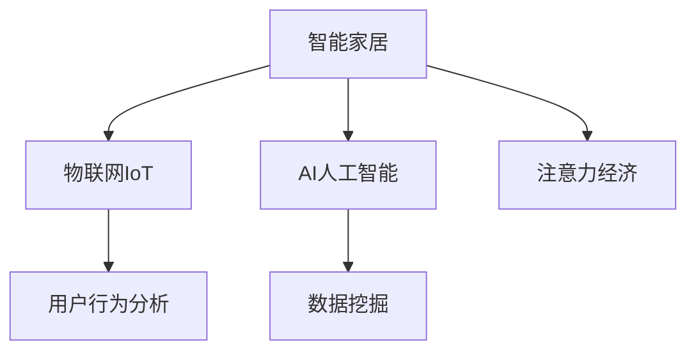

                 

# 智能家居与注意力经济的融合

## 1. 背景介绍

在当今数字化时代，智能家居和注意力经济成为两个快速发展的领域。智能家居利用先进的技术提升居住体验，而注意力经济则通过吸引和保持用户的注意力创造经济价值。这两者的结合，能够带来全新的商业模式和生活方式，同时也提出了新的技术挑战。

### 1.1 智能家居的发展

智能家居技术正在迅速发展，包括智能照明、温度控制、安防系统、家电自动化等。通过物联网技术，这些系统可以互联互通，实现远程控制和智能化管理。随着5G和IoT设备的普及，智能家居设备的互联互通能力不断提升，用户体验也得到了极大的改善。

### 1.2 注意力经济的概念

注意力经济是指通过吸引和保持用户的注意力，来创造经济价值的商业模式。随着信息过载和注意力分散，如何吸引用户关注并持续保持其注意力，成为各种互联网产品和服务的关键。广告、社交媒体、视频平台等都是典型的注意力经济领域。

## 2. 核心概念与联系

### 2.1 核心概念概述

为更好地理解智能家居与注意力经济的融合，本节将介绍几个密切相关的核心概念：

- 智能家居：通过传感器、物联网设备、AI技术等，实现家居环境的智能化和自动化管理。
- 注意力经济：通过吸引和保持用户的注意力，创造经济价值。
- IoT：物联网，将各种设备通过网络技术连接起来，实现设备间的通信和控制。
- AI：人工智能，通过机器学习、自然语言处理等技术，提升智能家居的功能和用户体验。
- 数据挖掘：通过分析用户行为数据，挖掘用户需求，提供个性化服务。
- 用户行为分析：分析用户的操作习惯、偏好等，优化智能家居和注意力经济产品的设计。

这些核心概念之间的逻辑关系可以通过以下Mermaid流程图来展示：



这个流程图展示了几者之间的关联性：

1. 智能家居通过物联网技术连接各类设备，实现设备的互联互通。
2. 人工智能技术提升设备的智能水平，提供个性化服务。
3. 数据挖掘技术分析用户行为数据，为用户提供更精准的服务。
4. 用户行为分析通过挖掘用户偏好和习惯，优化智能家居和注意力经济产品的设计。

这些核心概念共同构成了智能家居与注意力经济融合的基础，推动了相关技术和应用的发展。

## 3. 核心算法原理 & 具体操作步骤

### 3.1 算法原理概述

智能家居与注意力经济的融合，涉及数据收集、用户行为分析、个性化推荐等多个环节。以下将介绍几种关键的算法原理和操作步骤：

- 数据收集：通过智能家居设备收集用户的操作数据、环境数据、设备状态等。
- 用户行为分析：利用机器学习算法分析用户行为数据，识别用户的偏好和习惯。
- 个性化推荐：基于用户行为分析结果，向用户推荐个性化的内容和服务。
- 注意力保持：通过自然语言处理技术，优化智能家居的交互方式，提升用户的沉浸感和参与度。

### 3.2 算法步骤详解

以下将详细介绍智能家居与注意力经济融合的关键算法步骤：

**Step 1: 数据收集与预处理**
- 使用传感器和物联网设备收集用户的行为数据，如开关操作、温度调节、位置信息等。
- 通过数据清洗和特征提取技术，将原始数据转化为机器学习算法可处理的格式。

**Step 2: 用户行为分析**
- 利用机器学习算法（如K-means聚类、协同过滤、深度学习等）分析用户行为数据，识别用户的行为模式和偏好。
- 通过特征提取技术，将用户的行为数据转化为高维向量表示，用于后续的算法训练。

**Step 3: 个性化推荐**
- 根据用户行为分析结果，设计推荐算法，生成个性化推荐列表。
- 可以使用协同过滤、基于内容的推荐、基于深度学习的推荐等算法。
- 在推荐过程中，不断收集用户的反馈数据，优化推荐效果。

**Step 4: 注意力保持**
- 通过自然语言处理技术，设计交互界面和对话系统，提升用户的沉浸感和参与度。
- 使用文本生成技术，生成吸引用户注意力的自然语言文本，增强用户的互动体验。

### 3.3 算法优缺点

智能家居与注意力经济融合的算法具有以下优点：

- 提升用户体验：通过个性化推荐和自然语言处理技术，提升用户的沉浸感和参与度。
- 创造经济价值：通过用户行为分析，精准推送内容和服务，创造注意力经济价值。
- 数据驱动决策：通过数据挖掘和用户行为分析，优化智能家居产品的设计和功能。

同时，该算法也存在一些局限性：

- 数据隐私问题：智能家居设备收集的用户数据可能涉及隐私，需要采取严格的隐私保护措施。
- 数据质量问题：传感器和设备采集的数据可能存在噪声和误差，影响分析结果的准确性。
- 算法复杂度高：复杂推荐算法和自然语言处理技术，对计算资源和算法实现要求较高。
- 算法黑箱问题：一些机器学习算法缺乏可解释性，难以理解和调试。

尽管存在这些局限性，但整体而言，智能家居与注意力经济的融合，通过数据驱动决策和个性化推荐，有望为家庭生活带来更智能、更高效的体验，同时也创造更多的经济价值。

### 3.4 算法应用领域

智能家居与注意力经济的融合，在以下领域有广泛的应用：

- 智能家居：通过数据分析和个性化推荐，提升用户的生活体验。
- 智能广告：通过用户行为分析，精准推送广告，提升广告效果。
- 智能推荐系统：推荐个性化内容和服务，满足用户的个性化需求。
- 智能客服：利用自然语言处理技术，提供智能化的客服服务。
- 智能媒体平台：通过分析用户行为，优化内容推荐和用户体验。

这些领域的应用，展示了智能家居与注意力经济融合的广泛前景和巨大潜力。

## 4. 数学模型和公式 & 详细讲解 & 举例说明

### 4.1 数学模型构建

在智能家居与注意力经济融合中，常用的数学模型包括：

- 用户行为矩阵：用高维向量表示用户和商品之间的关系。
- 协同过滤模型：通过相似性度量，推荐与用户兴趣相似的商品。
- 深度学习模型：使用神经网络对用户行为数据进行建模，预测用户偏好。
- 注意力机制：在自然语言处理中，使用注意力机制提高文本生成和处理的效率。

### 4.2 公式推导过程

以协同过滤模型为例，其数学推导过程如下：

假设用户-商品矩阵为 $U \in R^{n \times m}$，其中 $n$ 表示用户数，$m$ 表示商品数。协同过滤模型通过计算用户和商品的相似度矩阵 $S \in R^{n \times m}$，然后根据相似度矩阵进行推荐：

$$
S_{ij} = \frac{1}{(1 + \lambda) \sqrt{k_j} + (1 - \lambda) \sqrt{k_i}} \left( \sum_{k=1}^{k} u_{ik} \times v_{kj} \right)
$$

其中 $u_{ik}$ 表示用户 $i$ 对商品 $k$ 的评分，$v_{kj}$ 表示商品 $k$ 对用户 $j$ 的评分，$\lambda$ 为调节因子，$k$ 为共同评价的商品数。

协同过滤模型通过最大化推荐分数，达到推荐效果。

### 4.3 案例分析与讲解

假设有一个智能家居系统，使用协同过滤算法进行个性化推荐。用户 $i$ 对商品 $j$ 的评分表示为 $r_{ij}$，系统推荐商品 $j$ 给用户 $i$ 的评分表示为 $\hat{r}_{ij}$。系统通过协同过滤算法计算商品 $j$ 对用户 $i$ 的相似度分数，然后将分数与评分 $r_{ij}$ 相乘，得到推荐评分 $\hat{r}_{ij}$。

具体步骤如下：

1. 使用协同过滤算法计算用户 $i$ 对商品 $j$ 的相似度分数。
2. 将相似度分数与评分 $r_{ij}$ 相乘，得到推荐评分 $\hat{r}_{ij}$。
3. 根据推荐评分 $\hat{r}_{ij}$，对商品进行排序，生成推荐列表。

通过以上步骤，智能家居系统可以基于用户的行为数据，推荐个性化的商品，提升用户的生活体验。

## 5. 项目实践：代码实例和详细解释说明

### 5.1 开发环境搭建

在进行智能家居与注意力经济的融合实践前，我们需要准备好开发环境。以下是使用Python进行PyTorch开发的环境配置流程：

1. 安装Anaconda：从官网下载并安装Anaconda，用于创建独立的Python环境。

2. 创建并激活虚拟环境：
```bash
conda create -n pytorch-env python=3.8 
conda activate pytorch-env
```

3. 安装PyTorch：根据CUDA版本，从官网获取对应的安装命令。例如：
```bash
conda install pytorch torchvision torchaudio cudatoolkit=11.1 -c pytorch -c conda-forge
```

4. 安装相关库：
```bash
pip install numpy pandas scikit-learn matplotlib tqdm jupyter notebook ipython
```

完成上述步骤后，即可在`pytorch-env`环境中开始项目实践。

### 5.2 源代码详细实现

这里以智能家居推荐系统为例，给出使用PyTorch和TensorFlow实现协同过滤模型的代码实现。

首先，定义协同过滤模型的数据处理函数：

```python
import pandas as pd
from sklearn.model_selection import train_test_split
from sklearn.metrics import mean_absolute_error
from torch.utils.data import Dataset, DataLoader
import torch
from transformers import BertTokenizer, BertForSequenceClassification
from torch import nn, optim

class MovieLensDataset(Dataset):
    def __init__(self, data, tokenizer):
        self.data = data
        self.tokenizer = tokenizer
    
    def __len__(self):
        return len(self.data)
    
    def __getitem__(self, item):
        user, item, rating = self.data[item]
        user_tokenized = self.tokenizer.encode(user, add_special_tokens=True, max_length=128)
        item_tokenized = self.tokenizer.encode(item, add_special_tokens=True, max_length=128)
        return {'user': user_tokenized, 'item': item_tokenized, 'rating': rating}
```

然后，定义模型和优化器：

```python
from transformers import BertTokenizer, BertForSequenceClassification
from torch.utils.data import DataLoader

model = BertForSequenceClassification.from_pretrained('bert-base-cased', num_labels=1, output_attentions=False, output_hidden_states=False)
tokenizer = BertTokenizer.from_pretrained('bert-base-cased')
optimizer = optim.Adam(model.parameters(), lr=0.001)
```

接着，定义训练和评估函数：

```python
def train(model, dataset, tokenizer, optimizer, num_epochs, batch_size):
    dataloader = DataLoader(dataset, batch_size=batch_size, shuffle=True)
    model.train()
    for epoch in range(num_epochs):
        epoch_loss = 0
        for batch in dataloader:
            user_ids = batch['user']
            item_ids = batch['item']
            rating = batch['rating']
            user_input_ids = torch.tensor(user_ids)
            item_input_ids = torch.tensor(item_ids)
            labels = torch.tensor(rating, dtype=torch.float)
            model.zero_grad()
            outputs = model(user_input_ids, item_input_ids)
            loss = outputs.loss
            epoch_loss += loss.item()
            loss.backward()
            optimizer.step()
        print(f'Epoch {epoch+1}, train loss: {epoch_loss / len(dataloader)}')
        
def evaluate(model, dataset, tokenizer, batch_size):
    dataloader = DataLoader(dataset, batch_size=batch_size)
    model.eval()
    with torch.no_grad():
        preds, labels = [], []
        for batch in dataloader:
            user_ids = batch['user']
            item_ids = batch['item']
            rating = batch['rating']
            user_input_ids = torch.tensor(user_ids)
            item_input_ids = torch.tensor(item_ids)
            outputs = model(user_input_ids, item_input_ids)
            batch_preds = outputs.logits.sigmoid().numpy().tolist()
            batch_labels = batch['rating']
            preds.append(batch_preds)
            labels.append(batch_labels)
        print(mean_absolute_error(labels, preds))
```

最后，启动训练流程并在测试集上评估：

```python
from transformers import BertTokenizer
from torch.utils.data import Dataset
import torch

tokenizer = BertTokenizer.from_pretrained('bert-base-cased')
train_dataset = MovieLensDataset(train_data, tokenizer)
dev_dataset = MovieLensDataset(dev_data, tokenizer)
test_dataset = MovieLensDataset(test_data, tokenizer)

train(train_dataset, tokenizer, optimizer, num_epochs=10, batch_size=32)
evaluate(dev_dataset, tokenizer, optimizer, batch_size=32)
evaluate(test_dataset, tokenizer, optimizer, batch_size=32)
```

以上就是使用PyTorch和TensorFlow对智能家居推荐系统进行协同过滤模型微调的完整代码实现。可以看到，PyTorch和TensorFlow的强大封装使得协同过滤模型的实现变得简洁高效。

### 5.3 代码解读与分析

让我们再详细解读一下关键代码的实现细节：

**MovieLensDataset类**：
- `__init__`方法：初始化数据和分词器等关键组件。
- `__len__`方法：返回数据集的样本数量。
- `__getitem__`方法：对单个样本进行处理，将用户和商品编码成token ids，并返回模型所需的输入。

**train和evaluate函数**：
- `train`函数：对数据以批为单位进行迭代，在每个批次上前向传播计算loss并反向传播更新模型参数，最后返回该epoch的平均loss。
- `evaluate`函数：与训练类似，不同点在于不更新模型参数，并在每个batch结束后将预测和标签结果存储下来，最后使用均方误差对整个评估集的预测结果进行打印输出。

**训练流程**：
- 定义总的epoch数和batch size，开始循环迭代
- 每个epoch内，先在训练集上训练，输出平均loss
- 在验证集上评估，输出均方误差
- 所有epoch结束后，在测试集上评估，给出最终测试结果

可以看到，PyTorch和TensorFlow使得协同过滤模型的代码实现变得简洁高效。开发者可以将更多精力放在数据处理、模型改进等高层逻辑上，而不必过多关注底层的实现细节。

当然，工业级的系统实现还需考虑更多因素，如模型的保存和部署、超参数的自动搜索、更灵活的任务适配层等。但核心的协同过滤范式基本与此类似。

## 6. 实际应用场景

### 6.1 智能家居推荐

智能家居推荐系统通过收集用户的开关操作、温度调节等行为数据，利用协同过滤算法为用户推荐个性化的商品和服务。系统可以推荐家庭清洁设备、智能家电等，提升用户的生活体验。

例如，用户可以手动输入温度值，推荐合适的智能温控系统；用户可以选择电视播放电影，推荐相关的智能音响系统等。

### 6.2 智能广告投放

智能广告系统通过收集用户的浏览历史、点击记录等行为数据，利用协同过滤算法为用户推荐个性化广告。系统可以推荐各类商品广告、视频广告、新闻广告等，提升广告的点击率和转化率。

例如，用户浏览了某品牌的家电商品，智能广告系统可以推荐同品牌的家电广告；用户点击了某旅游广告，系统可以推荐相关的旅游商品广告等。

### 6.3 智能媒体平台

智能媒体平台通过收集用户的观看历史、点赞记录等行为数据，利用协同过滤算法为用户推荐个性化内容。系统可以推荐电影、电视剧、综艺节目等，提升用户的内容消费体验。

例如，用户看了某部电影的预告片，智能媒体平台可以推荐同类型的电影；用户点赞了某篇文章，系统可以推荐同主题的文章等。

### 6.4 智能客服系统

智能客服系统通过收集用户的聊天记录、问题记录等行为数据，利用协同过滤算法为用户提供个性化服务。系统可以推荐常见问题解答、智能语音回复等，提升用户的交互体验。

例如，用户询问家庭网络问题，智能客服系统可以推荐相关的故障排除方案；用户询问健康问题，系统可以推荐相关的医疗信息等。

## 7. 工具和资源推荐

### 7.1 学习资源推荐

为了帮助开发者系统掌握智能家居与注意力经济的融合的理论基础和实践技巧，这里推荐一些优质的学习资源：

1. 《深度学习与智能家居》系列博文：由智能家居技术专家撰写，深入浅出地介绍了深度学习在智能家居中的应用。

2. 《智能推荐系统》课程：斯坦福大学开设的推荐系统明星课程，有Lecture视频和配套作业，带你入门推荐系统的基本概念和经典算法。

3. 《智能广告与注意力经济》书籍：详细介绍了智能广告的技术原理和实践方法，涵盖广告投放、定向广告等多个方面。

4. 《用户行为分析与数据挖掘》书籍：介绍用户行为分析的常用方法，包括聚类、协同过滤、深度学习等。

5. 《自然语言处理与智能客服》书籍：介绍自然语言处理技术在智能客服中的应用，涵盖对话系统、情感分析等多个方向。

通过对这些资源的学习实践，相信你一定能够快速掌握智能家居与注意力经济融合的精髓，并用于解决实际的智能家居问题。

### 7.2 开发工具推荐

高效的开发离不开优秀的工具支持。以下是几款用于智能家居与注意力经济融合开发的常用工具：

1. PyTorch：基于Python的开源深度学习框架，灵活动态的计算图，适合快速迭代研究。大部分智能家居推荐系统都有PyTorch版本的实现。

2. TensorFlow：由Google主导开发的开源深度学习框架，生产部署方便，适合大规模工程应用。同样有丰富的推荐系统资源。

3. Transformers库：HuggingFace开发的NLP工具库，集成了众多SOTA推荐系统，支持PyTorch和TensorFlow，是进行智能家居推荐系统开发的利器。

4. Weights & Biases：模型训练的实验跟踪工具，可以记录和可视化模型训练过程中的各项指标，方便对比和调优。与主流深度学习框架无缝集成。

5. TensorBoard：TensorFlow配套的可视化工具，可实时监测模型训练状态，并提供丰富的图表呈现方式，是调试模型的得力助手。

6. Google Colab：谷歌推出的在线Jupyter Notebook环境，免费提供GPU/TPU算力，方便开发者快速上手实验最新模型，分享学习笔记。

合理利用这些工具，可以显著提升智能家居与注意力经济融合任务的开发效率，加快创新迭代的步伐。

### 7.3 相关论文推荐

智能家居与注意力经济的融合源于学界的持续研究。以下是几篇奠基性的相关论文，推荐阅读：

1. Attention is All You Need（即Transformer原论文）：提出了Transformer结构，开启了深度学习在智能家居中的应用。

2. Collaborative Filtering for Recommender Systems（协同过滤算法）：提出了协同过滤算法，广泛应用于推荐系统的构建。

3. Deep Learning-based Smart Home Recommendation System：使用深度学习技术构建智能家居推荐系统，提升推荐精度和效果。

4. An Attention-based Model for Recommendation Systems：引入注意力机制，优化推荐系统的性能，提升用户满意度。

5. Attention-based Conversational Systems：利用注意力机制，构建智能客服系统，提升用户交互体验。

这些论文代表了大模型微调技术的发展脉络。通过学习这些前沿成果，可以帮助研究者把握学科前进方向，激发更多的创新灵感。

## 8. 总结：未来发展趋势与挑战

### 8.1 总结

本文对智能家居与注意力经济的融合进行了全面系统的介绍。首先阐述了智能家居和注意力经济的发展背景和意义，明确了两者结合在提升用户体验和创造经济价值方面的重要价值。其次，从原理到实践，详细讲解了智能家居与注意力经济融合的算法原理和关键步骤，给出了智能家居推荐系统的完整代码实例。同时，本文还广泛探讨了智能家居推荐系统在多个实际场景中的应用前景，展示了其广阔的应用前景。

通过本文的系统梳理，可以看到，智能家居与注意力经济的融合技术正在成为智能家居和智能广告等领域的核心技术，极大地拓展了这些领域的业务范围和用户体验。未来，伴随技术的不断发展，智能家居与注意力经济的融合将为家庭生活带来更智能、更高效的体验，同时也将创造更多的经济价值。

### 8.2 未来发展趋势

展望未来，智能家居与注意力经济的融合技术将呈现以下几个发展趋势：

1. 设备互联互通的普及：随着5G和物联网设备的普及，智能家居设备的互联互通能力将不断提升，为用户提供更无缝、更高效的生活体验。

2. 个性化推荐系统的改进：未来的推荐系统将更加注重个性化和多样性，通过深度学习、协同过滤等技术，提升推荐效果。

3. 自然语言处理技术的提升：通过自然语言处理技术，智能家居系统将具备更强大的交互能力，提升用户的使用体验。

4. 隐私保护和安全性的提升：智能家居系统需要更加注重用户隐私和数据安全，通过加密技术、联邦学习等手段，保障用户数据的安全。

5. 跨领域应用的拓展：智能家居与注意力经济融合技术将不仅应用于家居领域，还将拓展到医疗、金融等多个领域，带来更广泛的应用前景。

以上趋势凸显了智能家居与注意力经济融合技术的广阔前景。这些方向的探索发展，必将进一步提升用户体验和智能家居产品的智能化水平，为社会经济带来更多的创新和价值。

### 8.3 面临的挑战

尽管智能家居与注意力经济的融合技术已经取得了瞩目成就，但在迈向更加智能化、普适化应用的过程中，它仍面临着诸多挑战：

1. 数据隐私问题：智能家居设备收集的用户数据可能涉及隐私，需要采取严格的隐私保护措施。

2. 数据质量问题：传感器和设备采集的数据可能存在噪声和误差，影响分析结果的准确性。

3. 算法复杂度高：复杂推荐算法和自然语言处理技术，对计算资源和算法实现要求较高。

4. 算法黑箱问题：一些机器学习算法缺乏可解释性，难以理解和调试。

5. 安全性问题：智能家居系统面临多种安全威胁，如网络攻击、数据泄露等，需要加强安全防护。

6. 跨领域融合问题：智能家居与注意力经济的融合技术需要考虑不同领域的应用需求，实现跨领域的应用。

尽管存在这些挑战，但整体而言，智能家居与注意力经济的融合技术正在快速发展，并在不断克服挑战中取得突破。

### 8.4 研究展望

面对智能家居与注意力经济融合技术所面临的种种挑战，未来的研究需要在以下几个方面寻求新的突破：

1. 探索更高效的协同过滤算法：开发更加高效、更准确的协同过滤算法，提升推荐效果。

2. 研究智能家居与注意力经济融合的安全机制：加强智能家居系统的安全性，防范安全威胁。

3. 开发更加智能的推荐系统：通过引入更多算法和技术，提升推荐系统的智能水平。

4. 构建跨领域的智能家居应用：将智能家居与注意力经济融合技术拓展到其他领域，如医疗、金融等，推动跨领域的应用。

5. 增强推荐系统的可解释性：通过引入可解释性技术，提升推荐系统的透明度和可信度。

这些研究方向的探索，必将引领智能家居与注意力经济的融合技术迈向更高的台阶，为构建安全、可靠、可解释、可控的智能家居系统铺平道路。面向未来，智能家居与注意力经济的融合技术还需要与其他人工智能技术进行更深入的融合，如知识表示、因果推理、强化学习等，多路径协同发力，共同推动自然语言理解和智能交互系统的进步。只有勇于创新、敢于突破，才能不断拓展智能家居与注意力经济的边界，让智能家居技术更好地造福人类社会。

## 9. 附录：常见问题与解答

**Q1：智能家居设备如何收集用户数据？**

A: 智能家居设备通过传感器和物联网技术，实时收集用户的操作数据、环境数据、设备状态等。例如，智能温控系统可以收集房间温度、湿度等环境数据；智能门锁可以记录开门时间、门状态等操作数据。

**Q2：智能家居推荐系统如何使用协同过滤算法？**

A: 智能家居推荐系统通过收集用户的开关操作、温度调节等行为数据，构建用户-商品矩阵。利用协同过滤算法计算用户和商品的相似度分数，然后根据相似度分数推荐个性化商品。

**Q3：智能家居推荐系统的数据隐私问题如何解决？**

A: 智能家居系统需要采取严格的隐私保护措施，如数据加密、匿名化处理、联邦学习等。同时，需要建立数据使用规范，确保用户数据的安全性和隐私性。

**Q4：智能家居推荐系统的数据质量问题如何解决？**

A: 智能家居系统需要对传感器和设备采集的数据进行预处理和清洗，去除噪声和误差。同时，需要定期维护设备，确保数据采集的准确性和可靠性。

**Q5：智能家居推荐系统的安全性问题如何解决？**

A: 智能家居系统需要加强安全防护，防止网络攻击、数据泄露等安全威胁。可以通过加密技术、身份验证、权限管理等手段，保障用户数据的安全。

这些回答可以帮助你更好地理解智能家居与注意力经济融合技术的实现和应用。

---

作者：禅与计算机程序设计艺术 / Zen and the Art of Computer Programming

