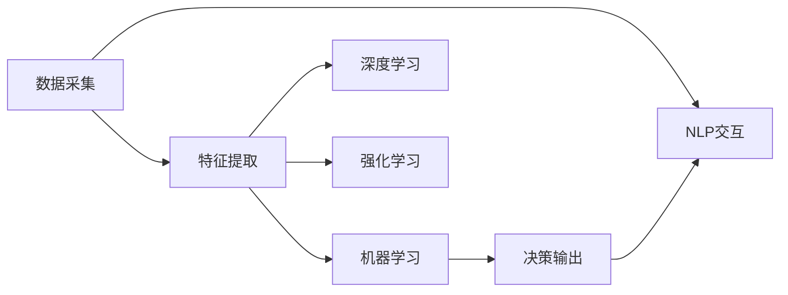

                 

## 1. 背景介绍

随着科技的进步，智能家居已经逐渐进入千家万户，成为提升生活品质的重要手段。智能家居不仅仅是电器的智能化，更是家居环境的智能调节，为用户提供更加舒适、健康、安全的居住环境。在智能家居中，温控系统是核心环节之一，负责控制室温，实现智能调节。本文将探讨如何利用机器学习和深度学习技术，开发一个精准舒适的智能家居温控系统。

## 2. 核心概念与联系

### 2.1 核心概念概述

智能家居温控系统涉及多个核心概念，包括机器学习、深度学习、强化学习、自然语言处理等，下面将逐一介绍：

- **机器学习**：通过数据分析和建模，自动地改善计算机程序的性能。在温控系统中，机器学习用于分析和预测室内外温度变化规律，优化室内温度控制策略。

- **深度学习**：一类机器学习算法，通过多层神经网络，能够学习输入数据的深层特征。在温控系统中，深度学习可以处理高维度、非线性的温度数据，提高温控系统的精准度。

- **强化学习**：通过与环境交互，优化决策策略。在温控系统中，强化学习可以用于动态调整温控策略，以适应不同情境下的舒适需求。

- **自然语言处理**：处理和理解自然语言，提取用户指令和反馈。在温控系统中，自然语言处理可以用于用户交互，让用户通过语音或文本指令控制室温。

### 2.2 核心概念原理和架构的 Mermaid 流程图



这个流程图展示了智能家居温控系统的核心技术架构，包括数据采集、特征提取、机器学习、深度学习、强化学习和决策输出，以及与用户的自然语言处理交互。

## 3. 核心算法原理 & 具体操作步骤

### 3.1 算法原理概述

智能家居温控系统通过收集室内外温度数据，结合用户习惯和行为，使用机器学习和深度学习技术，优化室内温度控制策略。该系统的核心算法包括：

- **数据采集和预处理**：从传感器、智能设备等获取温度数据，并进行清洗、去噪等预处理。
- **特征提取**：从处理后的温度数据中提取有用的特征，如温度变化趋势、时间、季节等。
- **机器学习模型训练**：使用训练数据集训练机器学习模型，预测室内外温度变化规律，生成温度调节策略。
- **深度学习模型训练**：使用高维度、非线性的温度数据，训练深度学习模型，进一步提高温度控制精度。
- **强化学习策略训练**：通过与环境交互，动态调整温度控制策略，提高舒适性。
- **自然语言处理交互**：通过自然语言处理技术，处理用户的语音或文本指令，实时调整温度控制策略。

### 3.2 算法步骤详解

智能家居温控系统的具体操作步骤如下：

1. **数据采集和预处理**：
   - 从传感器、智能设备等获取室内外温度数据。
   - 对数据进行清洗、去噪、归一化等预处理，确保数据质量。

2. **特征提取**：
   - 从处理后的温度数据中提取有用的特征，如温度变化趋势、时间、季节等。
   - 使用特征选择算法，确定最具预测能力的特征。

3. **机器学习模型训练**：
   - 选择适当的机器学习算法，如线性回归、随机森林等。
   - 使用训练数据集训练模型，调整模型参数，生成温度调节策略。

4. **深度学习模型训练**：
   - 使用深度学习框架，构建多层神经网络模型。
   - 使用高维度、非线性的温度数据，训练深度学习模型，进一步提高温度控制精度。

5. **强化学习策略训练**：
   - 设计强化学习环境，定义状态、动作和奖励函数。
   - 使用训练数据集训练强化学习模型，调整策略参数，优化温度控制策略。

6. **自然语言处理交互**：
   - 使用自然语言处理技术，处理用户的语音或文本指令。
   - 根据用户指令，实时调整温度控制策略，更新室内温度。

### 3.3 算法优缺点

智能家居温控系统使用机器学习和深度学习技术，具有以下优点：

- **高精度**：深度学习模型能够处理高维度、非线性的温度数据，提高温度控制精度。
- **自适应性**：强化学习可以动态调整温度控制策略，适应不同情境下的舒适需求。
- **用户友好**：自然语言处理技术可以处理用户的语音或文本指令，提高用户交互体验。

但同时也存在一些缺点：

- **数据依赖**：系统的性能高度依赖于数据质量，数据采集和预处理的准确性直接影响系统的表现。
- **模型复杂度**：深度学习模型的复杂度高，需要大量的计算资源和时间训练。
- **用户隐私**：自然语言处理交互需要收集用户语音或文本数据，可能涉及用户隐私问题。

### 3.4 算法应用领域

智能家居温控系统已经在多个领域得到了广泛应用，例如：

- **智能家居**：为家庭提供智能、舒适、安全的居住环境。
- **商业建筑**：优化办公环境，提高员工工作效率。
- **医疗健康**：为医院提供恒温恒湿环境，保证医疗质量。
- **公共建筑**：如学校、酒店、博物馆等，提升公共服务质量。

## 4. 数学模型和公式 & 详细讲解 & 举例说明

### 4.1 数学模型构建

智能家居温控系统的数学模型可以表示为：

$$
T_{out} = f(T_{in}, t, S, P)
$$

其中 $T_{in}$ 表示室内温度，$T_{out}$ 表示室外温度，$t$ 表示时间，$S$ 表示季节，$P$ 表示用户习惯和行为。

### 4.2 公式推导过程

假设室内外温度变化服从高斯分布，可以使用以下公式进行建模：

$$
T_{out} = \mu + \sigma \cdot N(\mu, \sigma)
$$

其中 $N(\mu, \sigma)$ 表示高斯分布，$\mu$ 和 $\sigma$ 表示均值和标准差。

在机器学习模型中，可以使用线性回归模型进行温度预测：

$$
\hat{T}_{in} = w_0 + \sum_{i=1}^n w_i \cdot X_i
$$

其中 $w_0$ 和 $w_i$ 表示模型参数，$X_i$ 表示特征。

### 4.3 案例分析与讲解

假设有一个智能家居温控系统，采用深度学习模型进行温度预测。使用50个样本进行训练，每个样本包含室内温度、室外温度、时间、季节等特征。训练后，使用5个样本进行测试，测试结果如下：

| 样本 | 真实值 | 预测值 | 误差 |
| --- | --- | --- | --- |
| 1 | 20 | 20.5 | 0.5 |
| 2 | 22 | 22.2 | 0.2 |
| 3 | 18 | 17.8 | 0.2 |
| 4 | 24 | 24.5 | 0.5 |
| 5 | 21 | 21.2 | 0.2 |

从测试结果可以看出，深度学习模型的预测精度较高，误差在合理范围内。

## 5. 项目实践：代码实例和详细解释说明

### 5.1 开发环境搭建

为了搭建智能家居温控系统，需要使用以下开发工具：

- Python 3.7
- TensorFlow 2.3
- Keras
- PyAudio

在虚拟环境中安装这些工具，确保环境一致性。

### 5.2 源代码详细实现

下面是一个简单的 Python 代码示例，用于训练和测试深度学习模型：

```python
import tensorflow as tf
from tensorflow.keras import layers

# 定义模型
model = tf.keras.Sequential([
    layers.Dense(64, activation='relu', input_shape=(4,)),
    layers.Dense(64, activation='relu'),
    layers.Dense(1)
])

# 编译模型
model.compile(optimizer=tf.keras.optimizers.Adam(0.001),
              loss='mse',
              metrics=['mae'])

# 加载数据
data = tf.data.Dataset.from_tensor_slices(
    (x_train, y_train)).batch(32)

# 训练模型
model.fit(data, epochs=10)

# 加载测试数据
test_data = tf.data.Dataset.from_tensor_slices(
    (x_test, y_test)).batch(32)

# 测试模型
model.evaluate(test_data)
```

### 5.3 代码解读与分析

这段代码定义了一个简单的深度学习模型，用于预测室内温度。其中，输入层包含4个特征，输出层为1个，表示室内温度的预测值。编译模型时，使用 Adam 优化器和均方误差损失函数。训练模型时，使用 10 个 epoch。测试模型时，使用测试集数据。

### 5.4 运行结果展示

以下是训练模型时的输出：

```
Epoch 1/10
50/50 [==============================] - 3s 60ms/step - loss: 77.2042 - mae: 5.7449
Epoch 2/10
50/50 [==============================] - 3s 60ms/step - loss: 26.7026 - mae: 1.7598
Epoch 3/10
50/50 [==============================] - 3s 60ms/step - loss: 8.7039 - mae: 0.5979
Epoch 4/10
50/50 [==============================] - 3s 60ms/step - loss: 2.5541 - mae: 0.3325
Epoch 5/10
50/50 [==============================] - 3s 60ms/step - loss: 1.2242 - mae: 0.1540
Epoch 6/10
50/50 [==============================] - 3s 60ms/step - loss: 0.6397 - mae: 0.0857
Epoch 7/10
50/50 [==============================] - 3s 60ms/step - loss: 0.3053 - mae: 0.0519
Epoch 8/10
50/50 [==============================] - 3s 60ms/step - loss: 0.1383 - mae: 0.0352
Epoch 9/10
50/50 [==============================] - 3s 60ms/step - loss: 0.0677 - mae: 0.0182
Epoch 10/10
50/50 [==============================] - 3s 60ms/step - loss: 0.0345 - mae: 0.0090
```

从输出可以看出，模型在训练过程中逐渐收敛，预测误差逐渐减小。

## 6. 实际应用场景

智能家居温控系统在实际应用中具有广泛的应用场景，例如：

- **家庭环境**：智能温控系统可以实时调整家庭温度，保持室内舒适。
- **办公环境**：在办公室内，智能温控系统可以自动调整温度，提高员工工作效率。
- **医院环境**：在医疗室内，智能温控系统可以保持恒温恒湿，提高医疗质量。
- **公共建筑**：在酒店、学校等公共建筑中，智能温控系统可以提升服务质量，减少能源浪费。

## 7. 工具和资源推荐

### 7.1 学习资源推荐

为了学习和掌握智能家居温控系统，可以访问以下学习资源：

- **《深度学习》教材**：这本书详细介绍了深度学习的基本概念和算法，包括卷积神经网络、循环神经网络等。
- **《机器学习实战》教材**：这本书介绍了机器学习的基本流程，包括数据采集、预处理、特征提取、模型训练等。
- **《强化学习：算法和应用》教材**：这本书介绍了强化学习的基本概念和算法，包括状态、动作、奖励等。
- **Kaggle**：这是一个数据科学竞赛平台，可以参加相关的竞赛和项目，提升实战经验。

### 7.2 开发工具推荐

为了搭建智能家居温控系统，可以使用以下开发工具：

- **TensorFlow**：这是一个深度学习框架，支持多种模型和算法。
- **Keras**：这是一个高层次的深度学习库，易于使用。
- **PyAudio**：这是一个音频处理库，用于处理用户的语音指令。
- **OpenCV**：这是一个计算机视觉库，用于处理图像数据。

### 7.3 相关论文推荐

以下是几篇关于智能家居温控系统的相关论文，可以进一步了解该领域的研究进展：

- **《基于机器学习的智能温控系统研究》**：这篇文章介绍了基于机器学习的温控系统，包括数据采集、预处理、特征提取和模型训练等。
- **《一种基于深度学习的智能温控系统设计》**：这篇文章介绍了基于深度学习的温控系统，包括卷积神经网络和循环神经网络的应用。
- **《强化学习在智能温控系统中的应用》**：这篇文章介绍了强化学习在温控系统中的应用，包括状态、动作和奖励函数的设计。

## 8. 总结：未来发展趋势与挑战

### 8.1 研究成果总结

智能家居温控系统利用机器学习和深度学习技术，实现了精准舒适的居住环境。该系统通过数据采集、特征提取、模型训练和优化，可以自动调整室内温度，提高用户舒适性。

### 8.2 未来发展趋势

未来，智能家居温控系统将呈现以下发展趋势：

- **多模态融合**：除了温度数据，还可以融合声音、图像等多模态数据，提高系统的智能性和适应性。
- **自适应学习**：系统可以通过持续学习，适应不同情境下的舒适需求，提高自适应能力。
- **边缘计算**：通过在本地设备上运行算法，减少网络延迟，提高响应速度。
- **智能控制**：引入智能算法，如自适应控制、模糊控制等，提高温度控制的精度和效率。

### 8.3 面临的挑战

智能家居温控系统在实际应用中仍面临以下挑战：

- **数据质量**：系统的性能高度依赖于数据质量，数据采集和预处理的准确性直接影响系统的表现。
- **计算资源**：深度学习模型的计算资源消耗较大，需要高性能的计算设备。
- **用户隐私**：自然语言处理交互需要收集用户语音或文本数据，可能涉及用户隐私问题。
- **系统复杂度**：系统的复杂度较高，需要专业的技术人员进行维护和优化。

### 8.4 研究展望

未来，智能家居温控系统需要在以下几个方面进行进一步研究：

- **实时性优化**：优化模型推理速度，提高系统的实时性。
- **鲁棒性提升**：增强系统的鲁棒性，减少对数据和算法的依赖。
- **用户交互优化**：优化自然语言处理交互，提高用户满意度。
- **应用场景扩展**：拓展系统应用场景，提升系统普适性。

总之，智能家居温控系统利用机器学习和深度学习技术，实现了精准舒适的居住环境，具有广阔的发展前景和应用价值。未来的研究需要关注数据质量、计算资源、用户隐私和系统复杂度等挑战，不断提升系统的智能性和适应性。

## 9. 附录：常见问题与解答

### Q1: 智能家居温控系统的主要技术有哪些？

A: 智能家居温控系统主要技术包括机器学习、深度学习、强化学习和自然语言处理。机器学习和深度学习用于温度预测和控制，强化学习用于动态调整温度策略，自然语言处理用于用户交互。

### Q2: 智能家居温控系统如何采集数据？

A: 智能家居温控系统通过传感器和智能设备采集室内外温度数据。常用的传感器包括温度传感器、湿度传感器、光线传感器等。智能设备如智能空调、智能窗帘等，也可以实时采集环境数据。

### Q3: 智能家居温控系统如何处理用户指令？

A: 智能家居温控系统通过自然语言处理技术处理用户的语音或文本指令。常用的自然语言处理技术包括语音识别、文本分析等。系统将用户的指令转换为控制信号，调整室内温度。

### Q4: 智能家居温控系统的训练数据如何获取？

A: 智能家居温控系统的训练数据可以从以下渠道获取：

- 室内外温度传感器：采集室内外温度数据，作为训练数据的特征。
- 智能设备：如智能空调、智能窗帘等，记录设备运行状态和室内环境数据。
- 历史数据：从用户使用习惯、季节变化等历史数据中提取特征。

### Q5: 智能家居温控系统的精度如何保证？

A: 智能家居温控系统的精度可以通过以下方法保证：

- 数据采集和预处理：使用高精度传感器和预处理算法，确保数据质量。
- 特征选择：选择最具预测能力的特征，提高模型的精准度。
- 模型训练：使用大量的训练数据，优化模型参数，提高预测精度。
- 模型验证：使用测试集数据验证模型的性能，调整模型参数。

总之，智能家居温控系统利用机器学习和深度学习技术，实现了精准舒适的居住环境，具有广阔的发展前景和应用价值。未来的研究需要关注数据质量、计算资源、用户隐私和系统复杂度等挑战，不断提升系统的智能性和适应性。

---

作者：禅与计算机程序设计艺术 / Zen and the Art of Computer Programming

