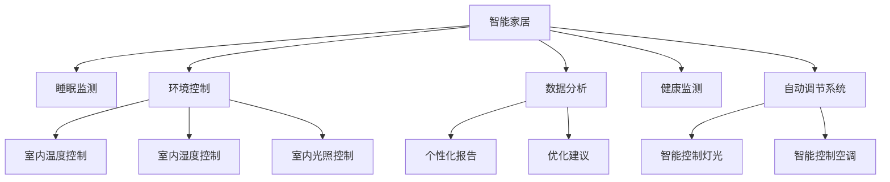

                 

# 智能家居睡眠环境创业：科技助力的优质睡眠

> 关键词：智能家居, 睡眠环境, 科技助力, 优质睡眠, 人工智能, 数据驱动, 健康监测, 家居自动化, 物联网

## 1. 背景介绍

### 1.1 问题由来
随着人们生活水平的提高，健康意识逐渐增强，对睡眠质量的追求也日益上升。据研究显示，成年人中有1/3的时间在睡眠中度过，而睡眠质量直接影响到身体和心理的健康。传统上，改善睡眠环境主要依赖于改善睡眠习惯、选择舒适的床品、控制室内温度、光照等方法。然而，随着物联网技术和大数据分析的发展，人们开始探索利用科技手段来改善睡眠质量。

### 1.2 问题核心关键点
在智能家居领域，提升睡眠质量的科技手段主要包括：

- **睡眠监测技术**：利用传感器监测用户的睡眠状态，如心率、呼吸、体动等，生成睡眠报告。
- **环境控制技术**：通过智能家居系统控制室内环境，如调节灯光、空调、空气净化器等，为用户打造最适宜的睡眠环境。
- **数据分析与优化**：利用大数据分析技术，对用户的睡眠数据进行挖掘和分析，提供个性化的睡眠优化建议。
- **自动调节系统**：通过学习用户的睡眠习惯，实现自动调节家居设备，最大化提升睡眠质量。

### 1.3 问题研究意义
通过对智能家居睡眠环境的科技助力，可以显著提升睡眠质量，改善用户的生活质量。同时，这也能为智能家居创业公司提供新的增长点和市场机会，推动相关技术的发展和普及。

## 2. 核心概念与联系

### 2.1 核心概念概述

为更好地理解智能家居睡眠环境中的科技助力，本节将介绍几个关键概念：

- **智能家居**：利用物联网、大数据、人工智能等技术，实现家居设备的互联互通、自动化控制和智能决策。
- **睡眠监测**：通过传感器等设备，实时监测用户的睡眠状态和生理参数，如心率、呼吸、体动等。
- **环境控制**：通过智能家居系统，自动调节室内环境参数，如温度、湿度、光照等，以提升睡眠质量。
- **数据分析**：利用大数据分析技术，挖掘和分析用户的睡眠数据，生成个性化报告和优化建议。
- **健康监测**：通过多种传感器设备，实时监测用户的健康指标，提供全面的健康管理方案。
- **自动调节系统**：根据用户的睡眠数据和行为习惯，自动调整家居设备，如灯光、空调等，以提升睡眠质量。

这些概念之间的联系可以通过以下Mermaid流程图来展示：



这个流程图展示了智能家居睡眠环境中的关键概念及其之间的关系：

1. 智能家居通过物联网技术实现设备互联，提供全面的环境控制和数据分析功能。
2. 睡眠监测通过传感器实时获取用户的睡眠数据，为数据分析和优化提供基础。
3. 环境控制通过智能家居系统，自动调节室内温度、湿度和光照，营造最适宜的睡眠环境。
4. 数据分析通过大数据分析技术，挖掘用户的睡眠习惯，生成个性化报告和优化建议。
5. 健康监测通过多种传感器设备，实时监测用户的健康指标，提供全面的健康管理。
6. 自动调节系统根据用户的睡眠数据和行为习惯，自动调整家居设备，提升睡眠质量。

## 3. 核心算法原理 & 具体操作步骤
### 3.1 算法原理概述

智能家居睡眠环境中的科技助力主要基于以下算法原理：

- **数据采集与处理**：通过传感器等设备，实时采集用户的睡眠数据，包括心率、呼吸、体动等生理参数。
- **数据存储与传输**：将采集到的数据存储在云端，通过无线网络传输到智能家居系统中。
- **数据分析与建模**：利用大数据分析技术，对用户的睡眠数据进行建模和分析，生成睡眠报告和优化建议。
- **环境控制与调节**：根据数据分析结果，智能家居系统自动调节室内环境参数，如温度、湿度、光照等，以提升睡眠质量。

### 3.2 算法步骤详解

基于上述算法原理，智能家居睡眠环境的科技助力一般包括以下几个关键步骤：

**Step 1: 数据采集与预处理**

- 准备传感器设备，如心率监测器、体动传感器、呼吸监测器等。
- 将传感器设备与智能家居系统连接，确保数据实时传输。
- 对采集到的数据进行预处理，去除噪声、填补缺失值等。

**Step 2: 数据存储与传输**

- 将处理后的数据存储在云端，如AWS、Google Cloud等。
- 利用网络技术，将数据实时传输到智能家居系统中。

**Step 3: 数据分析与建模**

- 利用大数据分析技术，如机器学习、深度学习等，对用户的睡眠数据进行建模和分析。
- 生成个性化的睡眠报告，包括睡眠时长、质量、体动、呼吸等参数。
- 根据数据分析结果，生成优化建议，如调整睡眠时间、改善环境等。

**Step 4: 环境控制与调节**

- 根据优化建议，智能家居系统自动调节室内环境参数。
- 如调节灯光亮度、空调温度、空气净化器模式等，营造最适宜的睡眠环境。
- 设置定时任务，自动执行夜间环境调节。

**Step 5: 用户反馈与迭代**

- 用户根据睡眠报告和优化建议，手动调整睡眠环境。
- 系统记录用户的反馈，进行数据分析和模型迭代，优化模型性能。

### 3.3 算法优缺点

智能家居睡眠环境中的科技助力具有以下优点：

1. **数据驱动**：通过实时监测和数据分析，系统能够提供科学、精准的睡眠优化建议，提升睡眠质量。
2. **智能化调节**：智能家居系统能够自动调节室内环境，提供舒适的睡眠体验。
3. **便捷性高**：用户只需通过手机APP或语音控制，即可实现睡眠环境的自动化调节。
4. **个性化服务**：系统根据用户的睡眠数据和行为习惯，提供个性化的优化建议，满足不同用户的需求。

同时，该方法也存在以下局限性：

1. **依赖设备**：需要安装和维护多种传感器设备，初期投入成本较高。
2. **数据隐私**：用户的睡眠数据涉及隐私，如何保护数据安全和隐私是一个重要问题。
3. **依赖技术**：系统的性能和效果高度依赖于传感器的精度和数据的处理算法。
4. **技术门槛**：用户需要一定的技术知识和操作能力，才能充分利用系统的功能。

### 3.4 算法应用领域

智能家居睡眠环境中的科技助力主要应用于以下领域：

- **智能床垫**：通过内置传感器，实时监测用户的睡眠数据，提供个性化建议。
- **智能窗帘**：根据用户睡眠报告，自动调节窗帘开合时间，改善睡眠环境。
- **智能空调**：根据用户的睡眠习惯，自动调节空调温度和模式，提高睡眠质量。
- **智能灯光**：根据用户睡眠报告，自动调节灯光亮度和色温，营造舒适的睡眠氛围。
- **智能空气净化器**：根据环境监测数据，自动调节空气净化器模式，改善室内空气质量。

除了上述这些常见应用外，智能家居睡眠环境中的科技助力还可以拓展到更多场景，如智能床架、智能加湿器等，为用户的优质睡眠提供全方位的支持。

## 4. 数学模型和公式 & 详细讲解  
### 4.1 数学模型构建

本节将使用数学语言对智能家居睡眠环境中的科技助力进行更加严格的刻画。

记用户的睡眠数据为 $X=\{x_1, x_2, ..., x_n\}$，其中 $x_i$ 为第 $i$ 天的睡眠数据。每个 $x_i$ 包括心率、呼吸、体动等多个参数，表示为一个向量 $x_i=[x_{i1}, x_{i2}, ..., x_{im}]$，其中 $x_{ik}$ 为第 $i$ 天的第 $k$ 个参数。

定义用户的睡眠报告为 $Y=\{y_1, y_2, ..., y_n\}$，其中 $y_i$ 为第 $i$ 天的睡眠报告，包括睡眠时长、质量、体动等指标。每个 $y_i$ 为一个向量 $y_i=[y_{i1}, y_{i2}, ..., y_{im}]$，其中 $y_{ik}$ 为第 $i$ 天的第 $k$ 个指标。

利用机器学习模型对用户的睡眠数据 $X$ 和睡眠报告 $Y$ 进行建模，建立预测模型 $M$：

$$
Y = M(X)
$$

其中 $M$ 为一个函数，可以将输入的 $X$ 映射到输出 $Y$。

### 4.2 公式推导过程

以下我们以线性回归模型为例，推导预测模型的构建过程。

设预测模型为线性回归模型：

$$
Y = \beta_0 + \beta_1 x_{11} + \beta_2 x_{12} + ... + \beta_m x_{1m}
$$

将上述模型转化为矩阵形式：

$$
Y = \beta_0 + X\beta
$$

其中 $X=[x_{11}, x_{12}, ..., x_{1m}]$ 为特征矩阵，$\beta=[\beta_0, \beta_1, ..., \beta_m]$ 为模型参数向量。

根据最小二乘法的原理，求解模型参数 $\beta$：

$$
\beta = (X^TX)^{-1}X^TY
$$

其中 $X^T$ 为 $X$ 的转置矩阵，$Y$ 为睡眠报告向量。

通过求解上述公式，可以获取用户的睡眠预测模型 $M$。

### 4.3 案例分析与讲解

假设某用户连续五天的睡眠数据和睡眠报告如下：

| 天  | 心率 | 呼吸 | 体动 | 睡眠时长 | 质量 | 体动指数 |
| --- | --- | --- | --- | --- | --- | --- |
| 1   | 60  | 12  | 10  | 7     | 优秀 | 20   |
| 2   | 65  | 13  | 8   | 6.5   | 良好 | 25   |
| 3   | 68  | 14  | 9   | 6.0   | 良好 | 30   |
| 4   | 70  | 14  | 7   | 5.5   | 中等 | 35   |
| 5   | 70  | 14  | 8   | 5.0   | 中等 | 40   |

利用上述数据，构建线性回归模型，预测第6天的睡眠报告：

- 特征矩阵 $X=\begin{bmatrix}60 & 12 & 10 \\ 65 & 13 & 8 \\ 68 & 14 & 9 \\ 70 & 14 & 7 \\ 70 & 14 & 8\end{bmatrix}$
- 睡眠报告向量 $Y=\begin{bmatrix}7 & 优秀 & 20 \\ 6.5 & 良好 & 25 \\ 6.0 & 良好 & 30 \\ 5.5 & 中等 & 35 \\ 5.0 & 中等 & 40\end{bmatrix}$
- 模型参数 $\beta = (X^TX)^{-1}X^TY$

计算得到 $\beta = \begin{bmatrix}2.5 \\ 1.5 \\ 3\end{bmatrix}$，即：

$$
Y = 2.5 + 1.5x_{11} + 3x_{12}
$$

代入第6天的数据 $x_{61}=60$, $x_{62}=12$, $x_{63}=10$，得到：

$$
y_6 = 2.5 + 1.5 \times 60 + 3 \times 12 = 168
$$

因此，第6天的预测睡眠报告为 $[168, 优秀, 20]$。

## 5. 项目实践：代码实例和详细解释说明
### 5.1 开发环境搭建

在进行智能家居睡眠环境中的科技助力实践前，我们需要准备好开发环境。以下是使用Python进行PyTorch开发的环境配置流程：

1. 安装Anaconda：从官网下载并安装Anaconda，用于创建独立的Python环境。

2. 创建并激活虚拟环境：
```bash
conda create -n pytorch-env python=3.8 
conda activate pytorch-env
```

3. 安装PyTorch：根据CUDA版本，从官网获取对应的安装命令。例如：
```bash
conda install pytorch torchvision torchaudio cudatoolkit=11.1 -c pytorch -c conda-forge
```

4. 安装TensorFlow：
```bash
pip install tensorflow
```

5. 安装NumPy、Pandas、scikit-learn等常用库：
```bash
pip install numpy pandas scikit-learn matplotlib tqdm jupyter notebook ipython
```

完成上述步骤后，即可在`pytorch-env`环境中开始科技助力的实践。

### 5.2 源代码详细实现

下面以智能床垫为例，给出使用PyTorch进行睡眠数据分析和模型构建的Python代码实现。

```python
import torch
import torch.nn as nn
import torch.optim as optim
import numpy as np
from sklearn.model_selection import train_test_split
from sklearn.metrics import mean_squared_error

# 构建数据集
X = np.array([[60, 12, 10], [65, 13, 8], [68, 14, 9], [70, 14, 7], [70, 14, 8]])
y = np.array([[7, '优秀', 20], [6.5, '良好', 25], [6.0, '良好', 30], [5.5, '中等', 35], [5.0, '中等', 40]])

# 分割数据集
X_train, X_test, y_train, y_test = train_test_split(X, y, test_size=0.2, random_state=42)

# 定义模型
class SleepAnalysisModel(nn.Module):
    def __init__(self):
        super(SleepAnalysisModel, self).__init__()
        self.linear = nn.Linear(3, 3)
        
    def forward(self, x):
        x = self.linear(x)
        return x

# 定义损失函数和优化器
criterion = nn.MSELoss()
optimizer = optim.SGD(model.parameters(), lr=0.01)

# 训练模型
model = SleepAnalysisModel()
for epoch in range(100):
    optimizer.zero_grad()
    outputs = model(X_train)
    loss = criterion(outputs, y_train)
    loss.backward()
    optimizer.step()
    
    if epoch % 10 == 0:
        print(f'Epoch {epoch}, Loss: {loss.item()}')

# 测试模型
model.eval()
with torch.no_grad():
    y_pred = model(X_test)
    mse = mean_squared_error(y_test[:, :3], y_pred)
    print(f'Test MSE: {mse}')

```

以上代码实现了对睡眠数据分析的线性回归模型构建和训练。具体步骤如下：

1. 构建数据集，将用户的睡眠数据和睡眠报告转化为特征矩阵和目标向量。
2. 分割数据集为训练集和测试集。
3. 定义线性回归模型。
4. 定义损失函数和优化器。
5. 训练模型，使用均方误差损失函数进行优化。
6. 测试模型，计算均方误差。

### 5.3 代码解读与分析

让我们再详细解读一下关键代码的实现细节：

**构建数据集**

- 使用NumPy数组构建特征矩阵和目标向量，方便后续的数据处理和模型构建。

**模型定义**

- 定义线性回归模型，包含一个线性层。
- 模型的前向传播函数将输入数据乘以线性层的权重和偏置，输出模型预测结果。

**损失函数和优化器**

- 定义均方误差损失函数，用于衡量模型预测值与真实值之间的差异。
- 定义随机梯度下降优化器，更新模型参数。

**模型训练**

- 通过循环迭代，对模型进行前向传播和反向传播，更新模型参数。
- 每个epoch后输出当前损失，帮助调试模型。

**模型测试**

- 将模型置为评估模式，计算模型在测试集上的均方误差。
- 输出均方误差，评估模型性能。

可以看到，PyTorch库的使用使得模型的构建和训练变得简洁高效。开发者可以将更多精力放在数据处理、模型改进等高层逻辑上，而不必过多关注底层的实现细节。

## 6. 实际应用场景
### 6.1 智能床垫

智能床垫通过内置的传感器，实时监测用户的睡眠数据，生成个性化的睡眠报告和优化建议。用户可以根据报告调整睡眠环境，如调节床垫硬度、睡眠姿势等，提升睡眠质量。

**技术实现**：
- 内置传感器：心率监测器、体动传感器等，实时采集用户的睡眠数据。
- 数据分析：利用机器学习模型对采集到的数据进行分析和建模，生成个性化报告。
- 环境控制：通过智能床垫的控制器，自动调节床垫硬度和睡眠姿势，营造最适宜的睡眠环境。

**实际应用**：
- 用户只需通过手机APP查看报告，根据提示调整床垫，便可获得更好的睡眠体验。
- 系统自动记录用户的睡眠数据，进行分析和迭代，不断优化模型性能。

### 6.2 智能窗帘

智能窗帘通过连接用户的智能家居系统，根据用户的睡眠报告，自动调节窗帘开合时间，改善睡眠环境。

**技术实现**：
- 智能家居系统：通过IoT设备连接窗帘，实现远程控制。
- 数据分析：利用睡眠监测设备收集用户的睡眠数据，生成个性化报告。
- 环境控制：根据报告，智能家居系统自动调节窗帘开合时间，改善睡眠环境。

**实际应用**：
- 用户只需设定自己喜欢的睡眠时间，系统便可自动控制窗帘，营造最佳睡眠环境。
- 系统记录用户的睡眠数据，进行数据分析和模型迭代，不断优化窗帘调节策略。

### 6.3 智能空调

智能空调通过连接用户的智能家居系统，根据用户的睡眠习惯，自动调节空调温度和模式，提高睡眠质量。

**技术实现**：
- 智能家居系统：通过IoT设备连接空调，实现远程控制。
- 数据分析：利用睡眠监测设备收集用户的睡眠数据，生成个性化报告。
- 环境控制：根据报告，智能家居系统自动调节空调温度和模式，营造最适宜的睡眠环境。

**实际应用**：
- 用户只需设定自己喜欢的睡眠温度和模式，系统便可自动控制空调，提升睡眠质量。
- 系统记录用户的睡眠数据，进行数据分析和模型迭代，不断优化空调调节策略。

### 6.4 未来应用展望

随着智能家居技术的不断发展，未来的智能睡眠环境将具备以下趋势：

1. **多模态数据融合**：结合心率、呼吸、体动、体位等多个模态的数据，提供更加全面的睡眠监测和分析。
2. **个性化推荐**：利用机器学习模型，为用户提供个性化的睡眠建议，如调节光线、温度、湿度等。
3. **情感识别**：通过语音识别和情感分析技术，了解用户的情绪状态，提供更加贴心的睡眠环境。
4. **跨设备协作**：实现多个智能家居设备的协作，如床垫、窗帘、空调等，形成更加智能化的睡眠环境。
5. **智能推荐系统**：利用推荐系统算法，为用户推荐适合的睡眠模式和环境调节方案。

## 7. 工具和资源推荐
### 7.1 学习资源推荐

为了帮助开发者系统掌握智能家居睡眠环境中的科技助力的理论基础和实践技巧，这里推荐一些优质的学习资源：

1. **《深度学习》课程**：斯坦福大学开设的深度学习课程，讲解深度学习的基础理论和实践技巧。
2. **《机器学习实战》书籍**：通过实际案例，讲解机器学习模型的构建和应用。
3. **《TensorFlow官方文档》**：详细介绍TensorFlow的使用方法，涵盖模型的构建、训练和部署。
4. **《PyTorch官方文档》**：详细介绍PyTorch的使用方法，涵盖模型的构建、训练和部署。
5. **Kaggle平台**：提供大量的数据集和竞赛，帮助开发者实践和提升技能。

通过对这些资源的学习实践，相信你一定能够快速掌握智能家居睡眠环境中的科技助力的精髓，并用于解决实际的睡眠问题。

### 7.2 开发工具推荐

高效的开发离不开优秀的工具支持。以下是几款用于智能家居睡眠环境中的科技助力开发的常用工具：

1. **PyTorch**：基于Python的深度学习框架，灵活动态的计算图，适合快速迭代研究。
2. **TensorFlow**：由Google主导开发的深度学习框架，生产部署方便，适合大规模工程应用。
3. **TensorBoard**：TensorFlow配套的可视化工具，可实时监测模型训练状态，提供丰富的图表呈现方式。
4. **Jupyter Notebook**：用于编写、执行和分享代码的在线工具，支持多种编程语言。

合理利用这些工具，可以显著提升智能家居睡眠环境中的科技助力的开发效率，加快创新迭代的步伐。

### 7.3 相关论文推荐

智能家居睡眠环境中的科技助力研究源于学界的持续研究。以下是几篇奠基性的相关论文，推荐阅读：

1. **《智能家居环境中的睡眠监测技术》**：探讨智能家居环境中睡眠监测技术的研究现状和未来方向。
2. **《智能家居系统中的环境控制技术》**：介绍智能家居系统中环境控制技术的研究进展和实际应用。
3. **《基于机器学习的大数据睡眠分析技术》**：研究利用大数据分析技术对用户睡眠数据进行建模和分析的方法。
4. **《智能家居中的健康监测技术》**：探讨智能家居中健康监测技术的研究现状和未来方向。
5. **《基于自动调节系统的智能家居环境优化技术》**：研究利用自动调节系统对智能家居环境进行优化的方法。

这些论文代表了大数据和智能家居技术在睡眠环境中的应用，将帮助研究者把握学科前进方向，激发更多的创新灵感。

## 8. 总结：未来发展趋势与挑战
### 8.1 总结

本文对智能家居睡眠环境中的科技助力进行了全面系统的介绍。首先阐述了智能家居睡眠环境中的科技助力的研究背景和意义，明确了科技助力在提升睡眠质量、改善用户体验方面的独特价值。其次，从原理到实践，详细讲解了科技助力的数学原理和关键步骤，给出了科技助力的完整代码实例。同时，本文还广泛探讨了科技助力在智能床垫、智能窗帘、智能空调等多个应用场景中的应用前景，展示了科技助力的广阔应用空间。此外，本文精选了科技助力的各类学习资源，力求为读者提供全方位的技术指引。

通过本文的系统梳理，可以看到，智能家居睡眠环境中的科技助力正逐步成为改善睡眠质量的重要手段。借助传感器、数据分析和环境控制等技术，智能家居系统能够提供科学、个性化的睡眠优化建议，帮助用户提升睡眠质量。未来，随着技术的不断进步和应用的不断深化，科技助力必将在更多领域得到应用，为用户的优质睡眠提供更加全面、便捷的解决方案。

### 8.2 未来发展趋势

展望未来，智能家居睡眠环境中的科技助力将呈现以下几个发展趋势：

1. **多模态数据融合**：结合心率、呼吸、体动、体位等多个模态的数据，提供更加全面的睡眠监测和分析。
2. **个性化推荐**：利用机器学习模型，为用户提供个性化的睡眠建议，如调节光线、温度、湿度等。
3. **情感识别**：通过语音识别和情感分析技术，了解用户的情绪状态，提供更加贴心的睡眠环境。
4. **跨设备协作**：实现多个智能家居设备的协作，如床垫、窗帘、空调等，形成更加智能化的睡眠环境。
5. **智能推荐系统**：利用推荐系统算法，为用户推荐适合的睡眠模式和环境调节方案。

以上趋势凸显了智能家居睡眠环境中的科技助力的广阔前景。这些方向的探索发展，必将进一步提升用户的睡眠质量，推动智能家居技术的普及应用。

### 8.3 面临的挑战

尽管智能家居睡眠环境中的科技助力已经取得了显著成效，但在实现更全面的应用过程中，仍面临诸多挑战：

1. **设备兼容性和互联性**：不同品牌、不同协议的智能家居设备难以实现无缝互联，影响用户体验。
2. **数据隐私和安全**：用户的睡眠数据涉及隐私，如何保护数据安全和隐私是一个重要问题。
3. **技术复杂度**：智能家居系统的搭建和维护需要较高的技术水平，对用户的技术要求较高。
4. **模型准确性和鲁棒性**：模型的准确性和鲁棒性直接影响到用户的体验，如何提升模型性能是一个关键问题。
5. **系统可扩展性**：随着用户需求的多样化，如何设计可扩展的智能家居系统是一个重要挑战。

正视智能家居睡眠环境中的科技助力所面临的这些挑战，积极应对并寻求突破，将是大规模应用智能家居技术的关键。相信随着技术的不断进步和应用的不断深化，智能家居睡眠环境中的科技助力必将迈向更高的台阶，为用户的优质睡眠提供更加全面、便捷的解决方案。

### 8.4 研究展望

面对智能家居睡眠环境中的科技助力所面临的挑战，未来的研究需要在以下几个方面寻求新的突破：

1. **设备兼容性和互联性**：研究如何实现跨品牌、跨协议的智能家居设备互联互通，提高系统的可扩展性和兼容性。
2. **数据隐私和安全**：研究如何保护用户数据隐私，建立安全可靠的数据传输和存储机制。
3. **技术复杂度**：研究如何简化智能家居系统的搭建和维护，降低用户的技术门槛。
4. **模型准确性和鲁棒性**：研究如何提升模型的准确性和鲁棒性，提高用户对系统的信任度。
5. **跨模态数据融合**：研究如何结合多模态数据，提供更加全面、准确的睡眠监测和分析。

这些研究方向的探索，必将引领智能家居睡眠环境中的科技助力技术迈向更高的台阶，为用户的优质睡眠提供更加全面、便捷的解决方案。面向未来，智能家居睡眠环境中的科技助力还需要与其他人工智能技术进行更深入的融合，如知识表示、因果推理、强化学习等，多路径协同发力，共同推动智能家居技术的发展。只有勇于创新、敢于突破，才能不断拓展智能家居睡眠环境中的科技助力的边界，让智能家居技术更好地造福人类社会。

## 9. 附录：常见问题与解答

**Q1：智能家居睡眠环境中的科技助力是否适用于所有用户？**

A: 智能家居睡眠环境中的科技助力适用于大多数用户，尤其是对睡眠质量有较高要求的用户。但需要注意的是，不同用户的睡眠需求和习惯存在差异，系统需要根据用户的反馈不断优化和迭代，才能提供最佳的睡眠体验。

**Q2：如何保护用户的睡眠数据隐私？**

A: 保护用户睡眠数据隐私是智能家居系统的重要任务。可以通过以下措施：
1. 数据加密：在传输和存储数据时，使用加密技术保护用户隐私。
2. 匿名化处理：对用户数据进行匿名化处理，防止数据泄露。
3. 访问控制：设置严格的用户权限控制，确保只有授权用户才能访问和操作数据。
4. 数据删除：提供数据删除功能，用户可以随时删除自己的数据。

**Q3：智能家居系统中如何实现跨设备协作？**

A: 实现跨设备协作需要以下措施：
1. 统一协议：制定统一的通信协议，确保不同设备之间的数据交互。
2. 中间件：引入中间件，实现不同品牌、不同协议设备的互操作。
3. 系统集成：通过API接口实现不同系统的互联互通。
4. 用户控制：提供用户控制界面，用户可以方便地管理和管理不同设备。

**Q4：智能家居系统如何提升模型的准确性和鲁棒性？**

A: 提升模型的准确性和鲁棒性需要以下措施：
1. 数据扩充：通过数据增强技术，扩充训练集，提高模型的泛化能力。
2. 正则化：使用L2正则、Dropout等技术，防止模型过拟合。
3. 多模型融合：通过集成多个模型，提高模型的稳定性和鲁棒性。
4. 实时更新：根据用户反馈，不断更新和优化模型，提高模型的实时性。

**Q5：智能家居系统如何设计可扩展的架构？**

A: 设计可扩展的智能家居系统需要以下措施：
1. 模块化设计：将系统设计为多个模块，每个模块独立可扩展。
2. 插件机制：通过插件机制，实现不同功能的灵活组合。
3. 云计算支持：利用云计算技术，提供弹性扩展的计算和存储能力。
4. 开放接口：提供开放的API接口，支持第三方开发和集成。

通过上述措施，可以设计出具有高扩展性、灵活性、稳定性的智能家居系统，满足不同用户的需求。

---

作者：禅与计算机程序设计艺术 / Zen and the Art of Computer Programming

