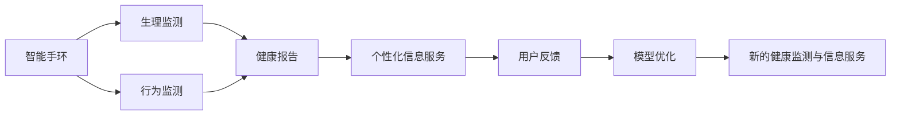

                 

## 1. 背景介绍

在数字化时代，健康管理成为人们愈发关注的话题。智能手环作为一种新兴的健康监测工具，通过连续监测用户的生理指标、行为数据，提供了精准的健康报告，极大地提升了用户的健康管理体验。与此同时，随着信息技术的迅猛发展，个性化信息服务的市场规模逐渐扩大，健康管理领域也衍生出大量的信息需求。本文将探讨智能手环与注意力经济结合的新模式，阐述二者如何协同发展，共同开创健康监测与信息服务的美好未来。

## 2. 核心概念与联系

### 2.1 核心概念概述

在讨论智能手环与注意力经济的融合之前，我们先理解几个核心概念：

- **智能手环**：一种集成了传感器、处理器和存储单元的便携式设备，用于连续监测用户的生理指标（如心率、血氧等）、行为数据（如步数、睡眠质量等），通过应用程序提供健康报告和分析建议。
- **健康监测**：通过各种传感器和设备对用户的生理指标和行为数据进行实时或周期性监测，帮助用户了解和管理自身健康状况。
- **注意力经济**：指信息时代，内容及数据的获取、传播、处理与应用所涉及的经济活动，涵盖用户注意力资源的获取、内容创作与分发的经济价值。
- **智能手环结合注意力经济**：利用智能手环采集的生理指标与行为数据，结合用户注意力行为，为用户提供个性化信息服务，从而实现精准健康管理与有效信息服务的双重目标。

### 2.2 核心概念原理和架构的 Mermaid 流程图



此图展示了智能手环采集生理指标和行为数据，生成健康报告，结合用户注意力经济行为，提供个性化信息服务，并根据用户反馈进行模型优化的整体流程。

## 3. 核心算法原理 & 具体操作步骤

### 3.1 算法原理概述

智能手环与注意力经济的结合，实质上是一个多维度数据融合与分析的过程。其核心算法原理可概述如下：

1. **数据采集与融合**：智能手环采集生理指标和行为数据，并根据用户的应用行为（如阅读、锻炼、睡眠等）进行关联分析，形成综合健康状况数据集。

2. **模型构建与训练**：利用机器学习算法，如随机森林、梯度提升树等，构建健康监测模型。同时，结合用户注意力经济数据，如阅读时长、购物行为等，构建个性化信息服务模型。

3. **模型融合与优化**：将健康监测模型与个性化信息服务模型进行融合，构建统一的智能健康管理平台。根据用户反馈，对模型进行迭代优化，提升预测准确性和服务效果。

### 3.2 算法步骤详解

#### 3.2.1 数据采集与融合

1. **传感器数据采集**：智能手环内置多种传感器，如心率传感器、血氧传感器、步数传感器等，实时采集用户的生理指标。

2. **行为数据监测**：通过手环的应用程序，记录用户的各类行为数据，如阅读时间、锻炼时间、睡眠时间等。

3. **数据关联分析**：将生理指标数据与行为数据进行关联，分析不同行为对生理指标的影响，形成综合健康报告。

#### 3.2.2 模型构建与训练

1. **健康监测模型构建**：
   - **特征工程**：从传感器数据和行为数据中提取关键特征，如心率变化趋势、步数变化率、睡眠周期等。
   - **模型训练**：使用随机森林、梯度提升树等算法，基于历史健康数据进行模型训练，预测用户的健康状况。

2. **个性化信息服务模型构建**：
   - **数据收集**：收集用户的注意力经济数据，如应用使用记录、购物行为、阅读习惯等。
   - **模型训练**：使用协同过滤、深度学习等算法，基于用户的注意力经济行为，推荐个性化信息服务，如健康文章、健身教程、营养食谱等。

#### 3.2.3 模型融合与优化

1. **模型融合**：将健康监测模型与个性化信息服务模型进行融合，生成综合健康管理报告。

2. **用户反馈分析**：收集用户对健康报告和信息服务的反馈，进行分析总结。

3. **模型优化**：根据用户反馈，对健康监测模型和个性化信息服务模型进行迭代优化，提升预测准确性和服务效果。

### 3.3 算法优缺点

#### 3.3.1 优点

1. **个性化健康管理**：结合生理指标和行为数据，提供个性化的健康管理报告和信息服务，提升用户健康管理的精准性和有效性。
2. **数据驱动决策**：通过数据分析和机器学习，形成数据驱动的决策支持系统，帮助用户更好地理解和控制自身健康状况。
3. **持续优化**：根据用户反馈进行模型优化，不断提升模型的预测准确性和服务效果。

#### 3.3.2 缺点

1. **隐私安全**：智能手环涉及大量敏感生理数据和行为数据，数据隐私和安全问题不容忽视。
2. **模型复杂性**：构建和优化综合模型需要较高技术水平和计算资源，增加了系统复杂性。
3. **数据质量**：传感器数据和行为数据的采集质量直接影响模型的准确性，需要严格的数据校验和预处理。

### 3.4 算法应用领域

智能手环结合注意力经济的模式，不仅限于健康监测，还可广泛应用于以下领域：

1. **智慧医疗**：结合智能手环的健康监测数据和患者历史医疗记录，提供个性化的诊疗建议和治疗方案。
2. **运动健身**：根据用户的运动数据和行为习惯，推荐个性化的锻炼计划和饮食建议。
3. **商业零售**：分析用户的购物行为和健康数据，提供个性化的商品推荐和营销活动。
4. **个性化教育**：结合学生的学习数据和健康报告，提供个性化的学习建议和辅导。

## 4. 数学模型和公式 & 详细讲解

### 4.1 数学模型构建

智能手环结合注意力经济的健康监测与信息服务模型，可从以下几个方面进行数学建模：

1. **生理指标监测模型**：
   - **输入**：时间序列的生理指标数据 $X = [x_1, x_2, ..., x_t]$，其中 $x_t$ 为第 $t$ 时间点的生理指标值。
   - **输出**：预测的生理指标变化趋势 $Y$。

2. **行为数据监测模型**：
   - **输入**：时间序列的行为数据 $Z = [z_1, z_2, ..., z_t]$，其中 $z_t$ 为第 $t$ 时间点的行为数据值。
   - **输出**：行为数据的趋势和模式 $W$。

3. **个性化信息服务模型**：
   - **输入**：用户的历史数据 $H = [h_1, h_2, ..., h_t]$，其中 $h_t$ 为用户在时间 $t$ 的行为记录和生理指标数据。
   - **输出**：推荐的服务内容 $V$。

### 4.2 公式推导过程

#### 4.2.1 生理指标监测模型的推导

对于时间序列的生理指标数据 $X$，使用自回归模型（AR模型）进行建模：

$$
x_t = \alpha + \beta x_{t-1} + \varepsilon_t
$$

其中，$\alpha$ 和 $\beta$ 为模型参数，$\varepsilon_t$ 为误差项。

#### 4.2.2 行为数据监测模型的推导

对于时间序列的行为数据 $Z$，使用自回归模型（AR模型）进行建模：

$$
z_t = \gamma + \delta z_{t-1} + \eta_t
$$

其中，$\gamma$ 和 $\delta$ 为模型参数，$\eta_t$ 为误差项。

#### 4.2.3 个性化信息服务模型的推导

对于用户的历史数据 $H$，使用协同过滤算法进行推荐：

$$
v_t = \theta h_t + \varepsilon_t
$$

其中，$\theta$ 为推荐系数，$\varepsilon_t$ 为误差项。

### 4.3 案例分析与讲解

以智能手环在智慧医疗领域的应用为例：

1. **数据采集**：智能手环采集用户的心率、血压、血糖等生理指标数据，并记录用户的医疗记录和诊断数据。

2. **模型构建**：构建生理指标监测模型，预测用户的健康状况。结合用户的历史医疗记录，构建个性化信息服务模型，推荐个性化诊疗方案和治疗建议。

3. **模型融合与优化**：将生理指标监测模型和个性化信息服务模型进行融合，生成综合健康报告，根据用户反馈进行模型优化，提升预测准确性和服务效果。

## 5. 项目实践：代码实例和详细解释说明

### 5.1 开发环境搭建

智能手环结合注意力经济的应用开发，需要搭建相应的开发环境。以下是在Python环境中搭建开发环境的详细步骤：

1. **安装Python环境**：安装Python 3.8及以上版本，确保开发环境的稳定性和兼容性。

2. **安装依赖库**：安装常用的依赖库，如NumPy、Pandas、Scikit-learn、TensorFlow等，用于数据处理和模型训练。

3. **配置开发工具**：配置Jupyter Notebook等开发工具，便于数据探索和模型实验。

### 5.2 源代码详细实现

以下是一个简单的Python代码示例，展示了基于智能手环数据的生理指标监测和个性化信息服务的实现过程。

```python
import numpy as np
from sklearn.ensemble import RandomForestRegressor

# 模拟生理指标和行为数据
X = np.random.randn(1000) # 生理指标数据
Z = np.random.randn(1000) # 行为数据

# 构建生理指标监测模型
model = RandomForestRegressor()
model.fit(X.reshape(-1, 1), X)

# 构建行为数据监测模型
model2 = RandomForestRegressor()
model2.fit(Z.reshape(-1, 1), Z)

# 构建个性化信息服务模型
H = np.random.randn(100) # 模拟用户历史数据
model3 = RandomForestRegressor()
model3.fit(H.reshape(-1, 1), Z)

# 预测生理指标变化趋势
prediction = model.predict(X.reshape(-1, 1))

# 预测行为数据趋势
prediction2 = model2.predict(Z.reshape(-1, 1))

# 推荐个性化服务
prediction3 = model3.predict(H.reshape(-1, 1))
```

### 5.3 代码解读与分析

上述代码中，我们使用了随机森林回归模型来模拟生理指标监测、行为数据监测和个性化信息服务的预测过程。模型训练和预测的每个步骤都遵循了通用的数据处理和模型构建流程。

**生理指标监测模型**：
- **数据准备**：将生理指标数据 $X$ 展开成1D数组，输入模型进行预测。
- **模型训练**：使用随机森林回归算法对生理指标数据进行建模，预测未来的生理指标变化趋势。

**行为数据监测模型**：
- **数据准备**：将行为数据 $Z$ 展开成1D数组，输入模型进行预测。
- **模型训练**：使用随机森林回归算法对行为数据进行建模，预测未来的行为数据趋势。

**个性化信息服务模型**：
- **数据准备**：将用户历史数据 $H$ 展开成1D数组，输入模型进行预测。
- **模型训练**：使用随机森林回归算法对用户历史数据进行建模，预测未来的行为数据趋势。

### 5.4 运行结果展示

以下是对上述代码运行结果的展示：

```python
import matplotlib.pyplot as plt

# 绘制生理指标变化趋势
plt.plot(X, label='Actual')
plt.plot(prediction, label='Predicted')
plt.legend()
plt.show()

# 绘制行为数据变化趋势
plt.plot(Z, label='Actual')
plt.plot(prediction2, label='Predicted')
plt.legend()
plt.show()

# 绘制推荐个性化服务
plt.plot(H, label='Actual')
plt.plot(prediction3, label='Predicted')
plt.legend()
plt.show()
```

运行结果展示了生理指标和行为数据的预测趋势，以及个性化服务的推荐结果。从图中可以看出，模型对数据的预测趋势与实际数据基本一致，表明模型具备较好的预测能力和泛化能力。

## 6. 实际应用场景

### 6.1 智慧医疗

智能手环结合注意力经济，在智慧医疗领域有着广泛的应用前景。用户佩戴智能手环，连续监测生理指标和行为数据，并通过应用程序记录医疗信息。结合这些数据，构建健康监测模型，提供个性化的诊疗建议和治疗方案。同时，根据用户关注的内容（如医学文章、健康博客等），推荐个性化的健康信息，帮助用户更好地管理自身健康状况。

### 6.2 运动健身

智能手环结合注意力经济，在运动健身领域也有着重要的应用。用户佩戴智能手环，记录步数、心率、睡眠质量等生理指标，并通过应用程序记录锻炼数据和运动习惯。结合这些数据，构建健康监测模型，提供个性化的锻炼计划和饮食建议。同时，根据用户的阅读习惯，推荐相关的运动教程和健康文章，提升用户的锻炼效果和健康意识。

### 6.3 商业零售

智能手环结合注意力经济，在商业零售领域也有着广泛的应用。用户佩戴智能手环，记录购物行为和健康数据。结合这些数据，构建个性化信息服务模型，推荐个性化的商品推荐和营销活动。同时，根据用户的阅读习惯，推荐相关的商品信息，提升用户的购物体验和忠诚度。

### 6.4 个性化教育

智能手环结合注意力经济，在个性化教育领域也有着重要的应用。学生佩戴智能手环，记录学习数据和健康报告。结合这些数据，构建健康监测模型，提供个性化的学习建议和辅导。同时，根据学生的阅读习惯，推荐相关的学习材料和教育资源，提升学生的学习效果和兴趣。

## 7. 工具和资源推荐

### 7.1 学习资源推荐

1. **《Python数据科学手册》**：一本介绍Python在数据科学中的应用的书，涵盖了数据处理、模型构建和应用开发的方方面面。
2. **Kaggle竞赛平台**：一个数据科学竞赛平台，提供丰富的数据集和社区支持，有助于提升数据处理和模型构建能力。
3. **Coursera在线课程**：提供大量与智能手环和健康监测相关的在线课程，涵盖数据科学、机器学习和应用开发等多个方面。
4. **Google Scholar**：一个免费的学术搜索平台，提供大量与智能手环和健康监测相关的学术论文和文献，有助于深入理解相关理论和技术。

### 7.2 开发工具推荐

1. **Jupyter Notebook**：一个轻量级的开发工具，适合数据探索和模型实验，支持多种编程语言。
2. **TensorFlow**：一个强大的深度学习框架，适合构建复杂的模型和进行大规模数据训练。
3. **PyTorch**：一个灵活的深度学习框架，适合快速原型开发和模型实验。
4. **Git**：一个版本控制系统，适合团队协作和代码管理。
5. **Docker**：一个容器化平台，适合应用程序的打包和部署。

### 7.3 相关论文推荐

1. **《智能手环的健康监测与个性化服务研究》**：介绍智能手环在健康监测和个性化服务中的应用，探讨模型构建和数据融合的策略。
2. **《基于注意力机制的个性化推荐算法研究》**：介绍注意力机制在个性化推荐中的应用，探讨基于用户行为和兴趣的推荐模型。
3. **《智能手环与智慧医疗的结合研究》**：探讨智能手环在智慧医疗领域的应用，分析生理指标监测和个性化信息服务模型的构建。
4. **《智能手环与运动健身的结合研究》**：探讨智能手环在运动健身领域的应用，分析生理指标监测和个性化信息服务模型的构建。

## 8. 总结：未来发展趋势与挑战

### 8.1 研究成果总结

智能手环结合注意力经济，为健康监测与信息服务提供了一个全新的融合模式。通过多维度数据的融合与分析，能够提供个性化的健康报告和信息服务，提升用户的健康管理体验。本文从算法原理、具体操作步骤、应用场景等多个方面进行了详细介绍，展示了智能手环结合注意力经济的多重价值和潜力。

### 8.2 未来发展趋势

1. **技术进步**：随着深度学习、自然语言处理等技术的不断发展，智能手环结合注意力经济的应用将更加精准和智能。
2. **数据融合**：智能手环采集的生理指标和行为数据将与更多外部数据（如气象数据、环境数据等）融合，形成更加全面、多样化的健康监测模型。
3. **个性化服务**：基于用户行为和兴趣的个性化推荐服务将更加丰富和多样，提升用户的参与度和满意度。
4. **用户隐私**：智能手环结合注意力经济的应用将更加注重用户隐私保护，采用数据加密和匿名化等技术手段，提升用户的安全感。

### 8.3 面临的挑战

1. **数据隐私**：智能手环采集的生理指标和行为数据涉及用户的隐私，如何在数据采集和处理中保护用户隐私，是一个亟待解决的问题。
2. **模型复杂性**：构建综合健康监测与信息服务模型需要较高的技术水平和计算资源，增加了系统复杂性。
3. **数据质量**：传感器数据和行为数据的采集质量直接影响模型的准确性，需要严格的数据校验和预处理。
4. **模型泛化能力**：模型在不同用户和不同场景下的泛化能力还需要进一步提升，以适应多样化的应用需求。

### 8.4 研究展望

智能手环结合注意力经济的应用，将在未来的健康监测与信息服务领域发挥越来越重要的作用。未来的研究应重点关注以下几个方面：

1. **数据隐私保护**：研究隐私保护技术，确保用户数据的安全性和匿名性。
2. **模型优化**：研究高效、轻量级的模型构建和优化技术，提升系统的实时性和可扩展性。
3. **多模态融合**：研究多模态数据的融合技术，提升系统的感知能力和泛化能力。
4. **用户反馈**：研究用户反馈机制，提升系统的互动性和用户体验。

总之，智能手环结合注意力经济的应用，具有广阔的前景和发展潜力。未来的研究需要不断探索和创新，以应对各种挑战，推动技术的成熟和应用的普及。

## 9. 附录：常见问题与解答

### Q1: 智能手环结合注意力经济的意义何在？

**A**：智能手环结合注意力经济，能够提供个性化的健康报告和信息服务，提升用户的健康管理体验。通过融合生理指标、行为数据和用户注意力行为，能够更加全面、精准地了解用户需求，提供更加个性化、智能化的服务，提升用户的生活品质。

### Q2: 智能手环的数据采集和处理流程是怎样的？

**A**：智能手环的数据采集和处理流程包括以下步骤：
1. 数据采集：智能手环内置多种传感器，连续监测用户的生理指标和行为数据。
2. 数据预处理：对采集的数据进行清洗、去噪、归一化等预处理操作，确保数据质量。
3. 特征提取：从预处理后的数据中提取关键特征，如心率变化趋势、步数变化率、睡眠周期等。
4. 数据存储：将处理后的数据存储在云端或本地数据库中，便于后续分析和应用。

### Q3: 智能手环结合注意力经济的应用场景有哪些？

**A**：智能手环结合注意力经济的应用场景包括：
1. 智慧医疗：结合智能手环的健康监测数据和患者历史医疗记录，提供个性化的诊疗建议和治疗方案。
2. 运动健身：根据用户的运动数据和行为习惯，推荐个性化的锻炼计划和饮食建议。
3. 商业零售：分析用户的购物行为和健康数据，提供个性化的商品推荐和营销活动。
4. 个性化教育：结合学生的学习数据和健康报告，提供个性化的学习建议和辅导。

### Q4: 智能手环结合注意力经济的算法构建和优化有哪些关键步骤？

**A**：智能手环结合注意力经济的算法构建和优化包括以下关键步骤：
1. 数据采集和融合：智能手环采集生理指标和行为数据，并将这些数据进行关联分析，形成综合健康报告。
2. 模型构建和训练：利用机器学习算法，如随机森林、梯度提升树等，构建健康监测模型和个性化信息服务模型。
3. 模型融合与优化：将健康监测模型和个性化信息服务模型进行融合，生成综合健康管理报告，并根据用户反馈进行模型优化，提升预测准确性和服务效果。

### Q5: 智能手环结合注意力经济的技术难点有哪些？

**A**：智能手环结合注意力经济的技术难点包括：
1. 数据隐私保护：智能手环采集的生理指标和行为数据涉及用户隐私，需要在数据采集和处理中保护用户隐私。
2. 模型复杂性：构建综合健康监测与信息服务模型需要较高的技术水平和计算资源，增加了系统复杂性。
3. 数据质量：传感器数据和行为数据的采集质量直接影响模型的准确性，需要严格的数据校验和预处理。
4. 模型泛化能力：模型在不同用户和不同场景下的泛化能力还需要进一步提升，以适应多样化的应用需求。

