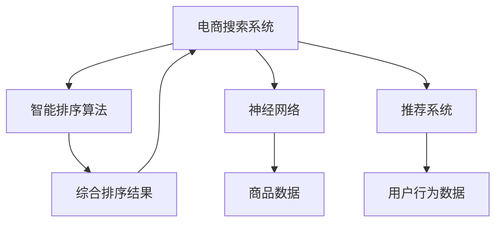

                 

## 1. 背景介绍

### 1.1 问题由来

电商搜索系统是电商平台的灵魂，直接影响着用户的购物体验。一个高效的电商搜索系统需要能够快速、准确地匹配用户查询与商品信息。传统的搜索引擎通常采用基于关键词的匹配方式，存在“长尾查询”问题（即用户输入的查询词可能非常长、复杂）。随着深度学习技术的兴起，智能排序算法逐步在电商搜索中得到应用，通过训练神经网络模型，对商品进行综合排序，显著提升了搜索精度和用户体验。

### 1.2 问题核心关键点

电商搜索系统对智能排序算法的关键要求包括：

- **高效性**：需要在短时内对大量商品进行排序，用户体验最佳。
- **准确性**：排序结果需要尽可能接近用户的真实意图，提升点击率和转化率。
- **可扩展性**：随着商品数量和用户查询需求的增加，算法需要具备良好的可扩展性。
- **鲁棒性**：需要能够应对不同用户、不同场景下的各种查询。

目前，智能排序算法在电商搜索中的应用已广泛覆盖，如京东、阿里巴巴、亚马逊等大型电商平台都采用了智能排序算法来优化搜索体验。这些平台通过大规模用户行为数据和商品数据的积累，训练模型，不断迭代优化搜索排序算法，使得智能排序在电商搜索中起到了至关重要的作用。

### 1.3 问题研究意义

智能排序算法在电商搜索中的应用具有重要意义：

- **提升用户体验**：通过个性化排序，使得搜索结果更加贴近用户需求，缩短用户浏览时间，提升满意度。
- **增加交易转化率**：高效的排序算法能够展示最相关、最具吸引力的商品给用户，提高点击率和购买转化率。
- **优化运营成本**：通过精准排序，减少无效流量和广告支出，提升广告投放效果，优化运营成本。
- **拓展市场份额**：提高用户粘性和留存率，拓展市场份额。
- **促进商品推荐**：借助排序算法，对用户行为进行深入分析，促进个性化推荐。

总之，智能排序算法是电商搜索系统的核心，其性能直接影响着电商平台的竞争力和盈利能力。

## 2. 核心概念与联系

### 2.1 核心概念概述

为更好地理解智能排序算法在电商搜索中的应用，本节将介绍几个密切相关的核心概念：

- **电商搜索系统**：提供搜索功能的电商平台，包括京东、阿里巴巴、亚马逊等。
- **智能排序算法**：通过机器学习模型，对搜索结果进行综合排序，提升搜索相关性和用户体验。
- **神经网络**：深度学习中的主要模型，包括卷积神经网络、循环神经网络、自注意力机制等。
- **推荐系统**：根据用户历史行为和偏好，推荐可能感兴趣的商品或服务。
- **用户行为数据**：用户浏览、点击、购买等行为数据，用于训练模型。
- **商品数据**：商品的图片、价格、描述、属性等信息，用于训练模型。

这些核心概念之间的逻辑关系可以通过以下Mermaid流程图来展示：



这个流程图展示了几者之间的逻辑关系：

1. 电商搜索系统通过智能排序算法，对商品进行综合排序。
2. 智能排序算法利用神经网络对商品和用户行为数据进行建模。
3. 推荐系统根据用户行为数据，推荐可能感兴趣的商品。
4. 商品数据和用户行为数据是模型训练的基础。

这些概念共同构成了智能排序算法在电商搜索中的应用框架，为其性能优化和应用扩展提供了理论基础。

## 3. 核心算法原理 & 具体操作步骤

### 3.1 算法原理概述

智能排序算法基于深度学习的框架，通常采用以下步骤：

1. **数据收集**：收集电商平台上的用户行为数据和商品数据。
2. **特征提取**：对商品和用户行为数据进行特征提取，转换为模型所需的形式。
3. **模型训练**：使用神经网络模型（如神经协同过滤、深度学习推荐系统等）对数据进行训练，优化排序结果。
4. **评估与迭代**：通过A/B测试等手段评估模型效果，根据反馈不断迭代优化。
5. **实时排序**：将训练好的模型应用于实时搜索排序，提升搜索相关性和用户体验。

智能排序算法的核心在于对用户行为和商品特征的综合建模，通过深度学习模型对搜索结果进行综合排序。

### 3.2 算法步骤详解

#### 3.2.1 数据收集

数据收集是智能排序算法的第一步，电商搜索系统需要收集用户行为数据和商品数据，并进行预处理和清洗。

- **用户行为数据**：包括用户浏览、点击、购买、评价等行为数据，用于训练模型，提升排序准确性。
- **商品数据**：包括商品的图片、价格、描述、属性等信息，用于特征提取和排序。

#### 3.2.2 特征提取

特征提取是智能排序算法的关键环节，需要将用户行为数据和商品数据转换为模型所需的形式。

- **用户行为特征**：如浏览时长、点击深度、购买频率等。
- **商品特征**：如价格、描述、品牌、属性等。

#### 3.2.3 模型训练

模型训练是智能排序算法的核心，通常采用神经网络模型对数据进行建模，优化排序结果。

- **神经协同过滤**：基于用户行为数据的协同过滤模型，通常采用神经网络实现。
- **深度学习推荐系统**：基于神经网络对商品和用户行为数据进行建模，实现深度学习推荐。

#### 3.2.4 评估与迭代

评估与迭代是智能排序算法的保障环节，通过评估模型效果，不断优化算法。

- **A/B测试**：将模型应用于实际搜索场景，进行对比测试，评估模型效果。
- **迭代优化**：根据评估结果，不断优化模型和算法，提升搜索相关性。

#### 3.2.5 实时排序

实时排序是智能排序算法的应用环节，将训练好的模型应用于实际搜索场景，提升搜索体验。

- **实时排序算法**：如线性回归、逻辑回归、深度学习模型等。
- **实时排序优化**：如内存优化、计算加速等。

### 3.3 算法优缺点

智能排序算法具有以下优点：

1. **准确性高**：通过深度学习模型对用户行为和商品特征进行综合建模，提升排序准确性。
2. **可扩展性强**：模型训练和实时排序算法具有良好的可扩展性，能够应对大规模数据。
3. **个性化推荐**：利用用户行为数据，实现个性化推荐，提升用户满意度和转化率。
4. **实时性强**：实时排序算法能够在用户查询时迅速返回结果，提升用户体验。

同时，智能排序算法也存在以下局限：

1. **计算资源需求高**：深度学习模型需要大量的计算资源进行训练和推理。
2. **模型复杂度高**：深度学习模型结构复杂，难以理解和解释。
3. **数据隐私问题**：用户行为数据涉及用户隐私，需要妥善处理。
4. **冷启动问题**：新用户或新商品缺乏足够数据，排序效果可能不佳。

### 3.4 算法应用领域

智能排序算法在电商搜索中的应用已经广泛覆盖，主要包括以下几个方面：

1. **搜索排序**：对用户查询进行智能排序，提升搜索结果的相关性和用户满意度。
2. **推荐系统**：根据用户行为数据，推荐可能感兴趣的商品。
3. **广告投放**：对搜索结果进行精准排序，优化广告投放效果。
4. **价格优化**：根据用户行为数据，优化商品定价策略。
5. **库存管理**：对商品库存进行优化管理，避免缺货和积压。

除了上述几个方面，智能排序算法还可以应用于用户画像构建、客户关系管理等多个领域，提升电商平台的运营效率和用户满意度。

## 4. 数学模型和公式 & 详细讲解 & 举例说明

### 4.1 数学模型构建

智能排序算法的数学模型通常基于深度学习框架，采用神经网络模型对用户行为和商品特征进行建模，实现智能排序。

- **输入层**：用户行为数据和商品数据。
- **隐藏层**：神经网络模型，如神经协同过滤、深度学习推荐系统等。
- **输出层**：排序结果，如相关性评分、推荐列表等。

### 4.2 公式推导过程

以神经协同过滤模型为例，其核心公式如下：

$$
p_{u,i} = \frac{\exp(\mathbf{u}^T \mathbf{v}_i)}{\sum_{j=1}^{N} \exp(\mathbf{u}^T \mathbf{v}_j)}
$$

其中，$\mathbf{u}$ 为用户的隐向量，$\mathbf{v}_i$ 为商品 $i$ 的隐向量，$N$ 为商品数量。

### 4.3 案例分析与讲解

以阿里巴巴电商搜索系统为例，其智能排序算法基于神经协同过滤模型。具体步骤如下：

1. **数据收集**：收集用户的浏览、点击、购买等行为数据，以及商品的图片、价格、描述、属性等信息。
2. **特征提取**：对用户行为数据和商品数据进行特征提取，生成用户行为特征和商品特征。
3. **模型训练**：使用神经协同过滤模型对用户行为特征和商品特征进行建模，训练得到用户的隐向量和商品的隐向量。
4. **评估与迭代**：通过A/B测试等手段评估模型效果，根据反馈不断优化模型和算法。
5. **实时排序**：将训练好的模型应用于实时搜索排序，提升搜索相关性和用户体验。

通过以上步骤，阿里巴巴电商搜索系统实现了高效的智能排序，显著提升了搜索相关性和用户体验。

## 5. 项目实践：代码实例和详细解释说明

### 5.1 开发环境搭建

在进行智能排序算法开发前，我们需要准备好开发环境。以下是使用Python进行TensorFlow开发的环境配置流程：

1. 安装Anaconda：从官网下载并安装Anaconda，用于创建独立的Python环境。

2. 创建并激活虚拟环境：
```bash
conda create -n tf-env python=3.8 
conda activate tf-env
```

3. 安装TensorFlow：根据CUDA版本，从官网获取对应的安装命令。例如：
```bash
conda install tensorflow -c pytorch -c conda-forge
```

4. 安装TensorFlow Addons：用于增强TensorFlow的功能，如Keras API、TPU支持等。

5. 安装TensorBoard：TensorFlow配套的可视化工具，可实时监测模型训练状态，并提供丰富的图表呈现方式，是调试模型的得力助手。

6. 安装TFT：TensorFlow中用于推荐系统的开源库，提供了多种推荐算法实现。

7. 安装相关依赖：
```bash
pip install tensorflow-io tensorboard
```

完成上述步骤后，即可在`tf-env`环境中开始智能排序算法开发。

### 5.2 源代码详细实现

以下是使用TensorFlow实现神经协同过滤模型的代码实现：

```python
import tensorflow as tf
import tensorflow_addons as addons
import tensorflow_io as tfio
from tensorflow.keras.layers import Input, Dense
from tensorflow.keras.models import Model

# 定义模型输入层
user_input = Input(shape=(1,), name='user_input')
item_input = Input(shape=(1,), name='item_input')

# 定义模型隐藏层
user_layer = Dense(32, activation='relu', name='user_layer')(user_input)
item_layer = Dense(32, activation='relu', name='item_layer')(item_input)

# 定义模型输出层
output_layer = Dense(1, activation='sigmoid', name='output_layer')(tf.keras.layers.dot(user_layer, item_layer, axes=1))

# 定义模型
model = Model(inputs=[user_input, item_input], outputs=output_layer)

# 定义损失函数
loss_fn = tf.keras.losses.BinaryCrossentropy(from_logits=True)

# 定义优化器
optimizer = tf.keras.optimizers.Adam(learning_rate=0.001)

# 定义评估指标
eval_metric = tf.keras.metrics.AUC(name='auc')

# 训练模型
model.compile(optimizer=optimizer, loss=loss_fn, metrics=[eval_metric])

# 数据加载函数
def load_data(batch_size):
    train_dataset = tfio.TFRecordDataset('train.tfrecord').map(load_user_item).batch(batch_size)
    test_dataset = tfio.TFRecordDataset('test.tfrecord').map(load_user_item).batch(batch_size)
    return train_dataset, test_dataset

# 数据加载函数
def load_user_item(example):
    user = tf.io.parse_single_example(example, {'user': tf.io.FixedLenFeature([1], dtype=tf.int64)})
    item = tf.io.parse_single_example(example, {'item': tf.io.FixedLenFeature([1], dtype=tf.int64)})
    return user, item

# 训练模型
train_dataset, test_dataset = load_data(32)

model.fit(train_dataset, epochs=10, validation_data=test_dataset)
```

### 5.3 代码解读与分析

让我们再详细解读一下关键代码的实现细节：

**神经协同过滤模型**：
- **输入层**：使用`Input`定义用户和商品的输入。
- **隐藏层**：使用`Dense`定义两个隐藏层，每个隐藏层有32个神经元，激活函数为ReLU。
- **输出层**：使用`Dense`定义输出层，输出1个神经元，激活函数为Sigmoid，输出相关性评分。
- **模型定义**：使用`Model`将输入层、隐藏层和输出层组合成模型。
- **损失函数**：使用`BinaryCrossentropy`定义损失函数，用于训练模型。
- **优化器**：使用`Adam`优化器，设置学习率为0.001。
- **评估指标**：使用`AUC`评估模型的效果。
- **数据加载函数**：使用`tfio.TFRecordDataset`加载数据，使用`load_user_item`函数解析样本。
- **模型训练**：使用`fit`函数进行模型训练，设置训练轮数为10。

**TensorFlow Addons**：
- **Keras API**：使用`tf.keras.layers`和`tf.keras.models`定义模型结构和模型训练。
- **TPU支持**：使用`tf.keras`和`tf.distribute`进行模型分布式训练，支持TPU等硬件加速。

**TensorBoard**：
- **可视化工具**：使用`tf.keras.callbacks`定义回调函数，记录训练过程中的损失和精度。
- **图表呈现**：通过TensorBoard可视化的方式呈现模型训练效果。

### 5.4 运行结果展示

在训练完成后，我们可以使用测试集评估模型的效果，具体步骤如下：

```python
# 测试模型
test_dataset = load_data(32)
model.evaluate(test_dataset)
```

通过以上步骤，我们可以评估模型在测试集上的性能，如AUC等指标。

## 6. 实际应用场景

### 6.1 智能客服系统

智能客服系统是电商平台的重要应用场景之一，智能排序算法可以应用于智能客服的对话生成和问题回答，提升客户满意度。

- **对话生成**：根据用户的历史行为和问题，智能排序算法可以推荐最合适的回答模板，通过预训练的模型生成自然流畅的对话内容。
- **问题回答**：智能排序算法可以识别用户的问题意图，匹配最相关的回答，提供精准的解决方案。

通过智能排序算法，电商平台可以实现更高效的智能客服，提升用户满意度和留存率。

### 6.2 个性化推荐系统

个性化推荐系统是电商搜索系统的核心功能之一，智能排序算法可以应用于商品推荐，提升用户满意度和转化率。

- **商品推荐**：智能排序算法可以根据用户的历史行为和兴趣，推荐最相关的商品，提高用户点击率和购买转化率。
- **行为分析**：智能排序算法可以对用户的行为数据进行深度分析，提供个性化的推荐策略。

通过智能排序算法，电商平台可以实现更精准的商品推荐，提升用户满意度和购买率。

### 6.3 广告投放系统

广告投放系统是电商平台的另一重要应用场景，智能排序算法可以应用于广告投放的排序和优化，提升广告投放效果。

- **广告排序**：智能排序算法可以根据用户的行为和兴趣，对广告进行排序，展示最相关的广告，提高点击率和转化率。
- **投放优化**：智能排序算法可以对广告投放的效果进行实时监测和优化，调整投放策略。

通过智能排序算法，电商平台可以实现更高效的广告投放，提升广告投放效果和ROI。

### 6.4 未来应用展望

随着智能排序算法的不断发展，其在电商搜索中的应用将更加广泛。未来，智能排序算法可能将在以下几个方面得到应用：

1. **跨平台推荐**：智能排序算法可以应用于多个平台和设备，提供跨平台的用户推荐。
2. **实时竞价广告**：智能排序算法可以对实时竞价广告进行优化，提高广告投放效果。
3. **个性化内容**：智能排序算法可以应用于个性化内容的推荐，如视频、音乐等。
4. **社交电商**：智能排序算法可以应用于社交电商平台的推荐和排序，提升用户满意度和粘性。
5. **语音搜索**：智能排序算法可以应用于语音搜索的排序和优化，提升用户体验。

总之，智能排序算法在电商搜索中的应用前景广阔，未来将为电商平台带来更多的创新和价值。

## 7. 工具和资源推荐

### 7.1 学习资源推荐

为了帮助开发者系统掌握智能排序算法的理论基础和实践技巧，这里推荐一些优质的学习资源：

1. 《深度学习推荐系统》课程：斯坦福大学开设的推荐系统经典课程，涵盖深度学习推荐系统的理论基础和实践技巧。
2. 《TensorFlow实战指南》书籍：由TensorFlow官方团队编写，详细介绍了TensorFlow的使用方法和应用实例。
3. 《推荐系统实战》书籍：介绍了推荐系统的理论基础和实践技巧，包含多个推荐算法和案例分析。
4. 《深度学习与推荐系统》书籍：介绍了深度学习在推荐系统中的应用，包含多个推荐算法的实现和优化。
5. Kaggle推荐系统竞赛：Kaggle提供的推荐系统竞赛，通过实际数据和任务，锻炼推荐算法的开发和优化能力。

通过对这些资源的学习实践，相信你一定能够快速掌握智能排序算法的精髓，并用于解决实际的电商搜索问题。

### 7.2 开发工具推荐

高效的开发离不开优秀的工具支持。以下是几款用于智能排序算法开发的常用工具：

1. TensorFlow：基于Python的开源深度学习框架，灵活动态的计算图，适合快速迭代研究。支持分布式训练和硬件加速。
2. TensorFlow Addons：增强TensorFlow的功能，如Keras API、TPU支持等。
3. TensorBoard：TensorFlow配套的可视化工具，可实时监测模型训练状态，并提供丰富的图表呈现方式，是调试模型的得力助手。
4. TensorFlow IoT：用于物联网领域的推荐系统实现，支持实时推荐和离线计算。
5. Weights & Biases：模型训练的实验跟踪工具，可以记录和可视化模型训练过程中的各项指标，方便对比和调优。
6. Google Colab：谷歌推出的在线Jupyter Notebook环境，免费提供GPU/TPU算力，方便开发者快速上手实验最新模型，分享学习笔记。

合理利用这些工具，可以显著提升智能排序算法的开发效率，加快创新迭代的步伐。

### 7.3 相关论文推荐

智能排序算法的不断发展源于学界的持续研究。以下是几篇奠基性的相关论文，推荐阅读：

1. "Neural Collaborative Filtering"（神经协同过滤）：由Xue等人提出，是神经网络在推荐系统中的应用，实现了较好的推荐效果。
2. "Deep Neural Networks for Ad Serving Optimization"（深度神经网络用于广告优化）：由Cao等人提出，实现了广告投放的深度学习优化。
3. "Scalable Deep Learning Recommendations via Implicit Feedback"（基于隐反馈的深度学习推荐）：由Ning等人提出，实现了基于隐反馈的深度学习推荐。
4. "Reinforcement Learning for Personalized Recommendation Systems"（强化学习用于个性化推荐系统）：由Zhou等人提出，实现了基于强化学习的推荐系统。
5. "Collaborative Filtering for Implicit Feedback Datasets"（隐反馈数据集上的协同过滤）：由Adomavicius等人提出，是协同过滤的深度学习实现，提升了推荐效果。

这些论文代表了大语言模型微调技术的发展脉络。通过学习这些前沿成果，可以帮助研究者把握学科前进方向，激发更多的创新灵感。

## 8. 总结：未来发展趋势与挑战

### 8.1 总结

本文对智能排序算法在电商搜索中的应用进行了全面系统的介绍。首先阐述了智能排序算法的背景和意义，明确了其在电商搜索系统中的重要地位。其次，从原理到实践，详细讲解了智能排序算法的数学模型和操作步骤，给出了模型开发的完整代码实例。同时，本文还广泛探讨了智能排序算法在智能客服、个性化推荐等多个行业领域的应用前景，展示了其广阔的应用前景。最后，本文精选了智能排序算法的各类学习资源，力求为读者提供全方位的技术指引。

通过本文的系统梳理，可以看到，智能排序算法在电商搜索中的应用前景广阔，其性能直接影响着电商平台的竞争力和盈利能力。未来，随着深度学习技术的不断演进，智能排序算法将迎来更多的创新和突破，为电商平台带来更多的商业价值。

### 8.2 未来发展趋势

展望未来，智能排序算法将呈现以下几个发展趋势：

1. **模型复杂度提升**：深度学习模型的复杂度将不断提升，实现更复杂的推荐和排序策略。
2. **多模态融合**：智能排序算法将逐渐融合多模态信息，如文本、图像、语音等，提升推荐效果。
3. **实时推荐**：智能排序算法将实现实时推荐，提升用户体验。
4. **跨平台推荐**：智能排序算法将应用于多个平台和设备，提供跨平台的用户推荐。
5. **个性化内容**：智能排序算法将应用于个性化内容的推荐，如视频、音乐等。
6. **社交电商**：智能排序算法将应用于社交电商平台的推荐和排序，提升用户满意度和粘性。
7. **语音搜索**：智能排序算法将应用于语音搜索的排序和优化，提升用户体验。

以上趋势凸显了智能排序算法的广阔前景，这些方向的探索发展，必将进一步提升电商平台的运营效率和用户满意度。

### 8.3 面临的挑战

尽管智能排序算法在电商搜索中的应用取得了显著效果，但在迈向更加智能化、普适化应用的过程中，它仍面临诸多挑战：

1. **计算资源需求高**：深度学习模型需要大量的计算资源进行训练和推理，如何降低计算成本是亟待解决的问题。
2. **模型复杂度高**：深度学习模型结构复杂，难以理解和解释，如何降低模型复杂度，提高可解释性是重要研究方向。
3. **数据隐私问题**：用户行为数据涉及用户隐私，如何保护用户隐私，合理使用数据是重要课题。
4. **冷启动问题**：新用户或新商品缺乏足够数据，排序效果可能不佳，如何提升冷启动效果是重要研究方向。
5. **算法鲁棒性不足**：智能排序算法面对不同的用户和场景时，鲁棒性可能不足，如何提升算法的鲁棒性是重要研究方向。
6. **模型泛化能力不足**：智能排序算法可能面临数据偏差等问题，如何提升模型的泛化能力是重要研究方向。

正视智能排序算法面临的这些挑战，积极应对并寻求突破，将是大语言模型微调走向成熟的必由之路。相信随着学界和产业界的共同努力，这些挑战终将一一被克服，智能排序算法必将在构建人机协同的智能时代中扮演越来越重要的角色。

### 8.4 未来突破

面对智能排序算法所面临的种种挑战，未来的研究需要在以下几个方面寻求新的突破：

1. **模型结构优化**：开发更加简洁高效的模型结构，降低计算成本，提升模型可解释性。
2. **多模态融合**：融合文本、图像、语音等多模态信息，提升推荐效果和用户体验。
3. **实时推荐优化**：优化实时推荐算法，提升推荐速度和效果。
4. **跨平台推荐**：实现跨平台推荐，提升用户满意度和留存率。
5. **个性化内容推荐**：应用于个性化内容的推荐，提升用户粘性和体验。
6. **社交电商推荐**：应用于社交电商平台的推荐和排序，提升用户满意度和粘性。
7. **语音搜索优化**：应用于语音搜索的排序和优化，提升用户体验。

这些研究方向的探索，必将引领智能排序算法迈向更高的台阶，为构建安全、可靠、可解释、可控的智能系统铺平道路。面向未来，智能排序算法还需要与其他人工智能技术进行更深入的融合，如知识表示、因果推理、强化学习等，多路径协同发力，共同推动智能搜索系统的进步。只有勇于创新、敢于突破，才能不断拓展智能排序算法的边界，让智能技术更好地造福人类社会。

## 9. 附录：常见问题与解答

**Q1：电商搜索系统对智能排序算法的关键要求有哪些？**

A: 电商搜索系统对智能排序算法的关键要求包括：

1. **高效性**：需要在短时内对大量商品进行排序，用户体验最佳。
2. **准确性**：排序结果需要尽可能接近用户真实意图，提升点击率和转化率。
3. **可扩展性**：随着商品数量和用户查询需求的增加，算法需要具备良好的可扩展性。
4. **鲁棒性**：需要能够应对不同用户、不同场景下的各种查询。

**Q2：智能排序算法如何处理冷启动问题？**

A: 冷启动问题是指新用户或新商品缺乏足够数据，排序效果可能不佳。智能排序算法通常采用以下几种方式处理冷启动问题：

1. **协同过滤**：通过用户的历史行为数据进行协同过滤，找到最相关的商品推荐。
2. **基于内容的推荐**：利用商品的描述、属性等信息进行推荐。
3. **混合推荐**：将协同过滤和基于内容的推荐结合，提升推荐效果。

**Q3：智能排序算法如何处理数据隐私问题？**

A: 数据隐私问题是指用户行为数据涉及用户隐私，如何保护用户隐私，合理使用数据是重要课题。智能排序算法通常采用以下几种方式处理数据隐私问题：

1. **数据匿名化**：对用户数据进行匿名化处理，保护用户隐私。
2. **差分隐私**：在数据处理过程中引入差分隐私技术，保护用户隐私。
3. **数据脱敏**：对敏感信息进行脱敏处理，保护用户隐私。

**Q4：智能排序算法如何提升模型鲁棒性？**

A: 模型鲁棒性不足是智能排序算法面临的重要挑战之一。智能排序算法通常采用以下几种方式提升模型鲁棒性：

1. **数据增强**：通过回译、近义替换等方式扩充训练集，提升模型泛化能力。
2. **正则化**：使用L2正则、Dropout等技术，防止模型过拟合。
3. **对抗训练**：引入对抗样本，提高模型鲁棒性。
4. **参数高效微调**：只更新少量参数，固定大部分预训练参数，减小过拟合风险。

这些方法可以结合使用，根据具体任务和数据特点进行灵活组合。只有在数据、模型、训练、推理等各环节进行全面优化，才能最大限度地发挥智能排序算法的威力。

**Q5：智能排序算法如何提升模型泛化能力？**

A: 模型泛化能力不足是智能排序算法面临的重要挑战之一。智能排序算法通常采用以下几种方式提升模型泛化能力：

1. **数据增强**：通过回译、近义替换等方式扩充训练集，提升模型泛化能力。
2. **多任务学习**：在训练过程中引入其他相关任务，提升模型泛化能力。
3. **迁移学习**：将已有的模型知识迁移到新任务上，提升模型泛化能力。
4. **模型融合**：将多个模型进行融合，提升模型泛化能力。

这些方法可以结合使用，根据具体任务和数据特点进行灵活组合。只有在数据、模型、训练、推理等各环节进行全面优化，才能最大限度地发挥智能排序算法的威力。

总之，智能排序算法在电商搜索中的应用前景广阔，未来将为电商平台带来更多的创新和价值。通过不断优化和创新，智能排序算法必将在构建人机协同的智能时代中扮演越来越重要的角色。

