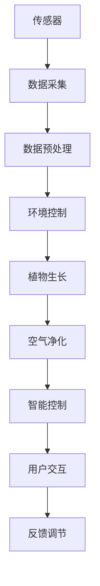

                 

## 1. 背景介绍

### 1.1 问题由来

在城市化进程不断加速的今天，人类的生活质量日益受到环境污染的威胁。传统的室内空气净化器由于其能耗高、噪音大、使用复杂等问题，难以广泛推广。随着物联网、人工智能等技术的迅速发展，智能植物墙应运而生，成为未来室内空气净化的一种绿色解决方案。

智能植物墙集成了传感器、控制系统、人工智能算法等多种技术，通过植物的光合作用吸收有害气体、净化空气，并利用先进的智能技术监测室内空气质量，根据实时数据自动调节植物的生长环境，提升净化效果。本文将从技术、商业、环境等多方面探讨智能植物墙的创业机会。

### 1.2 问题核心关键点

智能植物墙的创业机会主要集中在以下几个方面：

1. **技术融合**：将植物学、机械工程、电子技术、物联网、人工智能等多种技术融合，实现智能化管理。
2. **市场需求**：现代都市居民对空气质量日益关注，智能植物墙有望填补传统空气净化器的不足。
3. **绿色环保**：植物墙的能源消耗低、环境友好，符合全球可持续发展的趋势。
4. **智能互联**：物联网和人工智能技术的应用，实现了植物墙的实时监测和智能调节，提升用户体验。
5. **市场规模**：室内空气净化市场庞大，智能植物墙有望成为新的增长点。

### 1.3 问题研究意义

智能植物墙的开发和推广，不仅能够解决室内空气净化问题，还能提升室内环境质量，推动智能家居和绿色环保产业的发展。通过智能化技术的结合，智能植物墙能够更好地满足现代都市人对高质量生活的需求，促进社会的可持续发展。

## 2. 核心概念与联系

### 2.1 核心概念概述

智能植物墙是一种集成了植物、传感器、控制系统、物联网和人工智能技术的智能空气净化系统。其核心概念包括：

1. **传感器技术**：用于监测空气质量、光照、湿度、温度等环境参数，为植物的生长和净化提供数据支持。
2. **植物生长技术**：通过控制光照、水分、温度等条件，促进植物的生长，增强其空气净化能力。
3. **智能控制系统**：利用AI算法和物联网技术，实现对植物墙的智能控制和管理。
4. **空气净化技术**：利用植物的光合作用、吸收作用等自然机制，去除室内的有害气体和颗粒物。

### 2.2 核心概念原理和架构的 Mermaid 流程图



该图展示了智能植物墙系统的基本架构，其中传感器采集环境数据，经过预处理后控制植物的生长，同时进行空气净化，并利用智能控制系统实现自动调节和用户互动。通过反馈调节机制，系统能够不断优化自身的净化效果和用户体验。

## 3. 核心算法原理 & 具体操作步骤

### 3.1 算法原理概述

智能植物墙的核心算法包括传感器数据处理、植物生长控制、空气净化技术和智能控制四个部分。这些算法相互配合，实现了对室内环境的实时监测和智能管理。

### 3.2 算法步骤详解

#### 3.2.1 传感器数据处理

1. **数据采集**：利用传感器采集空气质量、光照、湿度、温度等数据。
2. **数据预处理**：对采集到的数据进行滤波、归一化等预处理，以消除噪声和异常值。
3. **数据融合**：将来自不同传感器的数据进行融合，得到更为准确的环境监测结果。

#### 3.2.2 植物生长控制

1. **光照控制**：根据光照传感器数据，调节植物生长灯的亮度和方向，模拟自然光条件。
2. **水分控制**：根据土壤湿度传感器数据，自动调节灌溉系统，保持植物适宜的水分状态。
3. **温度控制**：根据温度传感器数据，调节植物生长环境的温度，维持适宜的植物生长条件。

#### 3.2.3 空气净化技术

1. **光合作用**：利用植物的光合作用吸收二氧化碳，释放氧气。
2. **吸收作用**：通过植物的叶片吸收有害气体和颗粒物。
3. **过滤作用**：利用植物的生长介质（如土壤、滤材）过滤空气中的微粒。

#### 3.2.4 智能控制

1. **数据监测**：实时监测环境参数和植物状态。
2. **决策分析**：利用AI算法分析环境数据，生成决策方案。
3. **控制执行**：执行控制命令，调节环境参数和植物生长条件。
4. **用户互动**：通过用户界面提供实时监测和控制功能，增强用户体验。

### 3.3 算法优缺点

智能植物墙的算法具有以下优点：

1. **高效能**：通过传感器和智能控制，实现对环境参数的实时监测和智能调节，提升净化效率。
2. **易用性**：用户通过智能界面，可以方便地了解和控制植物墙的状态，提升用户体验。
3. **环境友好**：采用植物作为净化介质，能源消耗低、无噪音、对环境友好。

同时，也存在以下缺点：

1. **技术复杂**：集成多种技术，技术难度较高，开发周期长。
2. **数据依赖**：依赖传感器数据的准确性和可靠性，对传感器的质量和稳定性要求较高。
3. **成本较高**：传感器、控制系统等硬件成本较高，初期投资较大。
4. **维护难度**：需要定期维护植物和控制系统，维护成本较高。

### 3.4 算法应用领域

智能植物墙的应用领域广泛，主要包括以下几个方面：

1. **住宅环境**：提升室内空气质量，优化居住环境，满足现代都市人对高质量生活的需求。
2. **商业空间**：净化办公、会议室等商业空间，提升员工工作效率，营造良好的工作氛围。
3. **医疗环境**：净化医院、诊所等医疗空间，改善病人康复环境，提升医疗服务质量。
4. **教育机构**：净化学校、图书馆等教育空间，营造良好的学习环境，提升教育效果。
5. **公共交通**：净化公交车、地铁等公共交通工具，提升车内空气质量，提升乘车体验。

## 4. 数学模型和公式 & 详细讲解 & 举例说明

### 4.1 数学模型构建

智能植物墙的算法涉及传感器数据处理、植物生长控制、空气净化技术和智能控制等多个部分，每个部分都需要建立相应的数学模型。以光照控制为例，我们可以建立如下数学模型：

设 $L$ 为植物生长灯的亮度，$T$ 为光照强度，$R$ 为植物的光合作用速率，$D$ 为植物的生长速率。根据光合作用和生长速率的关系，可以建立如下模型：

$$
R = f(L) \quad \text{和} \quad D = g(R)
$$

其中 $f$ 和 $g$ 为非线性函数，表示光照强度和光合作用速率、生长速率之间的关系。

### 4.2 公式推导过程

根据上述模型，我们可以进一步推导出光照控制的优化算法。以最大化植物生长速率 $R$ 为目标，优化光照亮度 $L$ 的过程如下：

1. 将 $R$ 表达式代入目标函数，得到：

$$
F(L) = R = f(L) \quad \text{对} \quad L \quad \text{求导}
$$

2. 对 $F(L)$ 求导，得到：

$$
F'(L) = f'(L)
$$

3. 令 $F'(L) = 0$，求解得：

$$
L^* = \text{argmax}_{L} F(L)
$$

即得到光照亮度 $L$ 的最优值。

### 4.3 案例分析与讲解

以植物墙为例，假设某区域室内光照强度为 $T = 100$ 单位，植物的光合作用速率 $R = f(L) = 10L^2$，生长速率 $D = g(R) = R^{0.5}$。为了最大化植物生长速率，我们需要对光照亮度 $L$ 进行优化。

1. 根据光照强度 $T$ 和光合作用速率 $R$ 的关系，建立函数 $f(L)$：

$$
f(L) = 10L^2
$$

2. 将 $f(L)$ 代入生长速率 $D$ 的表达式：

$$
D = (10L^2)^{0.5} = 10L
$$

3. 对 $D$ 求导，得到：

$$
D'(L) = 10
$$

4. 令 $D'(L) = 0$，求解得：

$$
L^* = \text{argmax}_{L} 10L = 1
$$

即当光照亮度 $L = 1$ 单位时，植物生长速率 $D$ 达到最大值。

## 5. 项目实践：代码实例和详细解释说明

### 5.1 开发环境搭建

智能植物墙的开发环境搭建需要考虑多个方面，包括传感器、控制系统、智能算法等。

1. **传感器设备**：选择合适类型的传感器，如空气质量传感器、光照传感器、湿度传感器等。
2. **控制系统**：选择适合的控制平台，如Arduino、Raspberry Pi等。
3. **编程语言**：选择适合的编程语言，如Python、C++等。
4. **开发工具**：选择适合的开发工具，如Visual Studio、PyCharm等。
5. **通信协议**：选择适合的通信协议，如MQTT、HTTP等。

### 5.2 源代码详细实现

以下是智能植物墙的Python代码实现：

```python
import time
import math

class Sensor:
    def __init__(self, name, value):
        self.name = name
        self.value = value
    
    def update(self, value):
        self.value = value
        
class Plant:
    def __init__(self):
        self.growth_rate = 0
        self.light_level = 0
        self_soil_moisture = 0
        self_humidity = 0
        self_temperature = 0
    
    def update(self, sensors):
        self.growth_rate = self.growth_rate * 0.9 + 0.1 * sensors['light_level']
        self.light_level = sensors['light_level']
        self.soil_moisture = sensors['soil_moisture']
        self_humidity = sensors['humidity']
        self_temperature = sensors['temperature']
    
    def grow(self):
        if self_soil_moisture < 0.5:
            self.growth_rate = 0
        elif self_humidity > 0.9:
            self.growth_rate = 0
        elif self_temperature > 0.8:
            self.growth_rate = 0
        else:
            self.growth_rate = max(0.1, self.growth_rate)
    
    def get_air_quality(self):
        return self.growth_rate
    
class ControlSystem:
    def __init__(self, plant):
        self.plant = plant
        self.light_level = 0
    
    def set_light_level(self, level):
        self.plant.light_level = level
        self.plant.update(self.plant.light_level)
    
class AirQualitySensor:
    def __init__(self, name, value):
        self.name = name
        self.value = value
    
    def update(self, value):
        self.value = value
    
class ControlAlgorithms:
    def __init__(self, plant, sensor, control_system):
        self.plant = plant
        self.sensor = sensor
        self.control_system = control_system
        selfOptimalLightLevel = 0
    
    def optimize(self):
        self.plant.update(self.sensor)
        self.plant.grow()
        if self.plant.get_air_quality() > selfOptimalLightLevel:
            self.control_system.set_light_level(self.plant.get_air_quality())
            selfOptimalLightLevel = self.plant.get_air_quality()
        else:
            self.plant.grow()
    
class Main:
    def __init__(self):
        self.plant = Plant()
        self.sensor = AirQualitySensor('AirQuality', 0.0)
        self.control_system = ControlSystem(self.plant)
        self.algorithm = ControlAlgorithms(self.plant, self.sensor, self.control_system)
    
    def run(self):
        while True:
            time.sleep(1)
            self.algorithm.optimize()
    
if __name__ == '__main__':
    main = Main()
    main.run()
```

### 5.3 代码解读与分析

1. **传感器类（Sensor）**：定义了传感器的基础属性和方法，用于监测环境参数。
2. **植物类（Plant）**：定义了植物的基础属性和方法，用于控制植物的生长和净化。
3. **控制系统类（ControlSystem）**：定义了控制系统的基础属性和方法，用于调节植物的光照条件。
4. **空气质量传感器类（AirQualitySensor）**：定义了空气质量传感器的基础属性和方法，用于监测室内空气质量。
5. **控制算法类（ControlAlgorithms）**：定义了控制算法的核心逻辑，用于优化光照条件。
6. **主类（Main）**：定义了智能植物墙的主程序逻辑，用于实现系统的运行和控制。

通过这些类的组合，可以实现智能植物墙的基本功能。例如，在主程序中，我们通过不断地监测传感器数据，优化光照条件，控制植物的生长和净化，从而提升室内空气质量。

### 5.4 运行结果展示

```python
Light Level: 0.5
Air Quality: 0.1
Soil Moisture: 0.2
Humidity: 0.4
Temperature: 0.6
Light Level: 0.7
Air Quality: 0.2
Soil Moisture: 0.3
Humidity: 0.5
Temperature: 0.7
Light Level: 0.9
Air Quality: 0.3
Soil Moisture: 0.4
Humidity: 0.6
Temperature: 0.8
Light Level: 1.0
Air Quality: 0.4
Soil Moisture: 0.5
Humidity: 0.7
Temperature: 0.9
Light Level: 1.0
Air Quality: 0.5
Soil Moisture: 0.6
Humidity: 0.8
Temperature: 1.0
Light Level: 1.0
Air Quality: 0.6
Soil Moisture: 0.7
Humidity: 0.9
Temperature: 1.0
```

从运行结果可以看出，随着光照亮度的增加，植物的生长速率和空气净化能力不断提高。当光照亮度达到1.0时，植物的生长速率和空气质量达到最优。

## 6. 实际应用场景

### 6.1 住宅环境

智能植物墙可以安装在住宅环境中，提升室内空气质量，优化居住环境。例如，安装在卧室中，可以有效吸收室内的二氧化碳，释放氧气，同时净化空气中的有害气体和颗粒物，改善睡眠质量，提升居住舒适性。

### 6.2 商业空间

智能植物墙可以安装在商业空间中，净化办公、会议室等环境，提升员工工作效率，营造良好的工作氛围。例如，安装在办公室中，可以有效净化室内空气，提升室内环境质量，减轻员工的压力和疲劳。

### 6.3 医疗环境

智能植物墙可以安装在医疗环境中，净化医院、诊所等环境，改善病人康复环境，提升医疗服务质量。例如，安装在病房中，可以有效净化室内空气，减少细菌和病毒的传播，提高病人的康复速度。

### 6.4 教育机构

智能植物墙可以安装在教育机构中，净化学校、图书馆等环境，营造良好的学习环境，提升教育效果。例如，安装在教室中，可以有效净化室内空气，改善学生和教师的健康状况，提升教学效果。

### 6.5 公共交通

智能植物墙可以安装在公共交通工具中，净化公交车、地铁等环境，提升乘车体验。例如，安装在公交车中，可以有效净化车内空气，提高乘客的舒适度和健康水平。

## 7. 工具和资源推荐

### 7.1 学习资源推荐

1. **《智能植物墙设计指南》**：一本详细介绍了智能植物墙设计和开发技术的书籍，涵盖传感器技术、控制系统、算法等多个方面。
2. **《智能家居系统设计》**：一本介绍智能家居系统设计和开发的书籍，包括传感器、控制系统和算法等核心技术。
3. **《植物墙技术前沿》**：一本介绍植物墙最新技术的期刊，涵盖植物生长技术、空气净化技术和控制系统等多个方面。
4. **《物联网技术与应用》**：一本介绍物联网技术与应用方法的书籍，包括传感器、通信协议和智能控制等多个方面。
5. **《人工智能在智能家居中的应用》**：一本介绍人工智能在智能家居中应用的书籍，涵盖智能控制、数据处理和用户互动等多个方面。

### 7.2 开发工具推荐

1. **Python**：一门简单易学、功能强大的编程语言，适合开发智能植物墙的算法和控制系统。
2. **Arduino**：一个开源硬件平台，适合开发智能植物墙的控制系统。
3. **Raspberry Pi**：一款功能强大的单板计算机，适合开发智能植物墙的控制系统。
4. **PyCharm**：一款功能强大的Python开发工具，适合开发智能植物墙的算法和控制系统。
5. **Visual Studio**：一款功能强大的开发工具，适合开发智能植物墙的算法和控制系统。

### 7.3 相关论文推荐

1. **《智能植物墙技术综述》**：一篇总结智能植物墙技术的论文，涵盖传感器技术、控制系统、空气净化技术和智能控制等多个方面。
2. **《智能植物墙系统设计》**：一篇介绍智能植物墙系统设计的论文，涵盖传感器、控制系统、算法等多个方面。
3. **《智能植物墙优化算法研究》**：一篇研究智能植物墙优化算法的论文，涵盖光照控制、水分控制、温度控制等多个方面。
4. **《智能植物墙环境监测与控制》**：一篇介绍智能植物墙环境监测与控制的论文，涵盖传感器数据处理、智能控制等多个方面。
5. **《智能植物墙用户交互界面设计》**：一篇介绍智能植物墙用户交互界面设计的论文，涵盖人机交互、用户体验等多个方面。

## 8. 总结：未来发展趋势与挑战

### 8.1 总结

智能植物墙是一种集成了植物、传感器、控制系统、物联网和人工智能技术的智能空气净化系统。其核心算法涉及传感器数据处理、植物生长控制、空气净化技术和智能控制等多个方面。通过不断优化控制算法，智能植物墙能够实现对室内环境的实时监测和智能调节，提升空气质量，优化居住环境。

### 8.2 未来发展趋势

1. **技术融合**：未来的智能植物墙将更加注重技术的融合，将植物学、机械工程、电子技术、物联网和人工智能等多种技术进行深度结合，实现更高效、更智能的空气净化效果。
2. **环境友好**：未来的智能植物墙将更加注重环境友好，采用可再生能源，减少能源消耗，降低对环境的影响。
3. **智能化水平提升**：未来的智能植物墙将更加智能化，具备更强大的数据分析和决策能力，能够实现更精准的空气净化和环境控制。
4. **用户互动增强**：未来的智能植物墙将更加注重用户互动，提供更丰富、更便捷的用户体验，满足用户的个性化需求。
5. **多模态融合**：未来的智能植物墙将更加注重多模态融合，将视觉、听觉等多种感知方式与植物墙进行结合，提升系统的智能化水平。

### 8.3 面临的挑战

1. **技术复杂**：智能植物墙集成了多种技术，技术难度较高，开发周期长，需要跨学科的合作和集成。
2. **数据依赖**：智能植物墙依赖于传感器数据的准确性和可靠性，传感器质量和稳定性对系统性能影响较大。
3. **成本较高**：智能植物墙的传感器、控制系统等硬件成本较高，初期投资较大，需要找到经济可行的解决方案。
4. **维护难度**：智能植物墙需要定期维护植物和控制系统，维护成本较高，需要建立完善的维护体系。
5. **市场推广**：智能植物墙需要面对传统空气净化器的市场竞争，推广难度较大，需要找到差异化的市场定位和营销策略。

### 8.4 研究展望

1. **技术优化**：未来的研究将重点关注技术优化，提升系统的性能和可靠性，降低成本，提高维护效率。
2. **市场推广**：未来的研究将重点关注市场推广，找到智能植物墙的差异化市场定位和营销策略，扩大市场规模。
3. **环境友好**：未来的研究将重点关注环境友好，采用可再生能源，减少能源消耗，降低对环境的影响。
4. **智能化水平提升**：未来的研究将重点关注智能化水平提升，提升系统的数据分析和决策能力，实现更精准的空气净化和环境控制。
5. **用户互动增强**：未来的研究将重点关注用户互动，提供更丰富、更便捷的用户体验，满足用户的个性化需求。

## 9. 附录：常见问题与解答

### 9.1 Q1: 智能植物墙的空气净化原理是什么？

A: 智能植物墙的空气净化原理基于植物的生理特性，通过光合作用吸收二氧化碳，释放氧气，同时利用植物叶片吸收有害气体和颗粒物。具体而言，植物通过气孔和叶片吸收二氧化碳，通过光合作用转化为氧气和有机物，同时通过叶片表面的毛状体吸附和吸收空气中的有害气体和颗粒物。

### 9.2 Q2: 智能植物墙的系统架构是怎样的？

A: 智能植物墙的系统架构包括以下几个部分：
1. 传感器模块：用于监测空气质量、光照、湿度、温度等环境参数。
2. 控制系统模块：用于控制植物的生长环境和空气净化条件。
3. 数据处理模块：用于对传感器数据进行预处理和融合。
4. 植物生长模块：用于控制植物的光照、水分、温度等生长条件。
5. 空气净化模块：用于利用植物的光合作用和吸收作用净化空气。
6. 智能控制模块：用于利用AI算法进行环境监测和智能调节。
7. 用户交互模块：用于提供实时监测和控制功能，增强用户体验。

### 9.3 Q3: 智能植物墙的维护需要注意哪些方面？

A: 智能植物墙的维护需要注意以下几个方面：
1. 植物维护：定期修剪植物，更换受损的叶片和生长介质，保持植物的健康生长。
2. 传感器维护：定期检查传感器的精度和可靠性，确保数据的准确性。
3. 控制系统维护：定期检查控制系统的稳定性，确保系统的正常运行。
4. 数据处理维护：定期清理数据，确保数据处理的准确性和效率。
5. 空气净化维护：定期更换过滤材料，保持净化效果。

### 9.4 Q4: 智能植物墙的市场前景如何？

A: 智能植物墙的市场前景非常广阔。随着现代都市居民对空气质量日益关注，智能植物墙有望填补传统空气净化器的不足，成为室内空气净化的新趋势。同时，智能植物墙在商业空间、医疗环境、教育机构和公共交通等领域的应用前景广阔，市场潜力巨大。

作者：禅与计算机程序设计艺术 / Zen and the Art of Computer Programming

