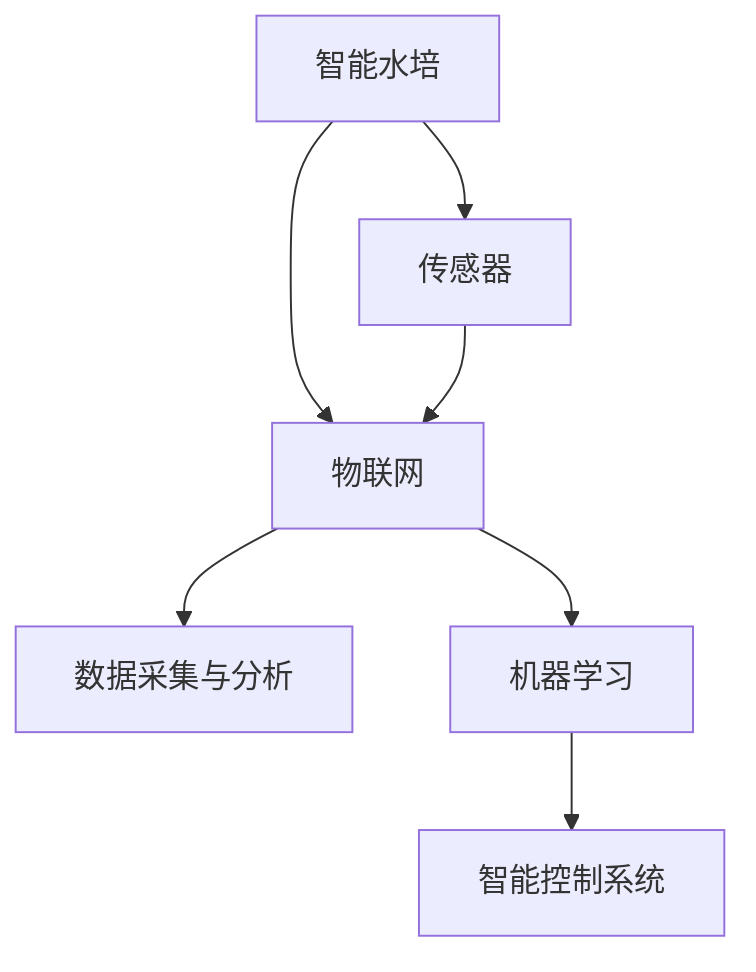

                 

# 智能水培创业：都市农业的科技解决方案

## 1. 背景介绍

### 1.1 问题由来

随着城市化进程的加快和环境保护意识的提升，都市农业成为现代城市发展的重要方向之一。传统农业主要依赖土地资源，而都市农业则是以城市空间和资源为基础，通过智能科技手段进行农业生产的创新模式。近年来，智能水培技术因其高效、清洁、可持续的特点，成为都市农业的关键技术之一。

智能水培技术结合了水培、传感器技术、物联网、人工智能等前沿科技，通过实时监测和智能控制，实现对植物生长环境的精确管理和资源的优化配置。这种技术不仅提高了农业生产效率，也降低了对环境的负面影响。在城市资源紧张、土地有限的背景下，智能水培技术成为城市农业发展的必然选择。

### 1.2 问题核心关键点

智能水培技术的核心在于如何通过物联网和人工智能技术实现对植物生长环境的精准控制和资源优化配置。具体包括：

- 传感器技术：用于实时监测植物生长的环境参数（如温度、湿度、光照、养分等）。
- 智能控制系统：基于传感器数据，通过自动控制灌溉、光照、通风等，实现精准农业。
- 数据采集与分析：收集植物生长数据，并通过数据分析优化生长条件。
- 人工智能算法：基于机器学习模型，预测植物生长趋势，指导智能控制。

## 2. 核心概念与联系

### 2.1 核心概念概述

为更好地理解智能水培技术的实现原理和架构，本节将介绍几个关键概念：

- 智能水培(Smart Hydroponics)：结合水培技术和智能科技手段，通过实时监测和智能控制，实现对植物生长环境的精确管理和资源的优化配置。
- 传感器(Sensors)：用于监测植物生长环境参数的物理或化学感知设备，如温度传感器、湿度传感器、光照传感器等。
- 物联网(IoT)：通过网络将传感器、控制器等设备连接起来，实现数据实时传输和自动化控制。
- 数据采集与分析(Data Collection & Analysis)：收集和分析植物生长数据，以优化生长条件和预测植物生长趋势。
- 机器学习(Machine Learning)：通过训练模型，使系统能够从历史数据中学习并预测植物生长状态，指导智能控制。

这些概念之间的逻辑关系可以通过以下Mermaid流程图来展示：



这个流程图展示了这个技术框架的主要组件及其相互关系：

1. 智能水培系统通过传感器实时监测植物生长环境。
2. 物联网技术将这些传感器数据实时传输到中央处理单元。
3. 数据采集与分析模块对数据进行存储和分析，识别植物生长状态。
4. 机器学习算法从历史数据中学习植物生长规律，预测未来趋势。
5. 智能控制系统根据预测结果，自动调整生长环境参数，实现精准农业。

## 3. 核心算法原理 & 具体操作步骤

### 3.1 算法原理概述

智能水培的核心算法主要包括以下几个方面：

- 传感器数据融合与预处理：将多种传感器数据融合为一个综合数据集，并对其进行预处理，去除噪声和异常值。
- 环境参数预测与优化：基于机器学习模型，预测植物的生长环境参数，并根据预测结果优化环境控制。
- 智能控制策略设计：设计基于规则或机器学习模型的智能控制策略，自动调整灌溉、光照、通风等参数。
- 数据驱动的决策支持：通过数据分析和机器学习，提供科学决策支持，优化资源配置。

### 3.2 算法步骤详解

智能水培的算法实现通常包括以下关键步骤：

1. **数据收集**：通过传感器收集植物生长环境的实时数据，如温度、湿度、光照、养分等。
2. **数据预处理**：对收集到的数据进行清洗、去噪、标准化等预处理，准备用于机器学习模型的训练。
3. **模型训练**：基于历史数据训练机器学习模型，用于预测植物生长状态和优化环境参数。
4. **环境控制**：根据模型的预测结果，自动调整灌溉、光照、通风等生长环境参数。
5. **性能评估**：持续监测和评估植物的生长状态，优化模型和控制策略。

### 3.3 算法优缺点

智能水培技术具有以下优点：

- 高效节能：通过智能控制和精准管理，减少资源浪费，降低能耗。
- 精确控制：实时监测和自动控制，确保植物生长环境的稳定和优化。
- 自动化程度高：物联网和机器学习技术的结合，实现了农业生产的高度自动化。
- 可持续性：减少对环境的负面影响，符合绿色可持续发展的要求。

同时，该技术也存在以下局限性：

- 初始投资高：传感器、控制器、网络等硬件设施的投入较大。
- 对技术依赖强：智能水培系统的有效运行依赖于传感器和网络设备的正常运行。
- 对操作人员要求高：需要掌握物联网、机器学习等相关技术。

### 3.4 算法应用领域

智能水培技术已经在多种农业场景中得到应用，具体包括：

- 室内垂直农场：利用室内空间进行植物种植，通过智能水培技术提高种植效率和产量。
- 屋顶农业：在城市屋顶种植蔬菜、水果等，利用智能水培技术优化资源配置，提升农作物产量。
- 农业试验场：用于农业科研，通过智能水培技术进行环境参数的精准控制和数据采集。
- 商业温室：用于高端农产品生产，通过智能水培技术提高产品质量和生产效率。
- 家庭园艺：通过智能水培技术，在家中进行小规模植物种植，实现自给自足。

## 4. 数学模型和公式 & 详细讲解 & 举例说明

### 4.1 数学模型构建

智能水培系统中的数学模型主要基于机器学习算法构建，用于预测植物生长状态和优化环境参数。以下以线性回归模型为例，介绍数学模型的构建方法：

假设传感器收集到的环境参数为 $x_1, x_2, ..., x_n$，对应的植物生长状态为 $y$。线性回归模型可表示为：

$$
y = \theta_0 + \sum_{i=1}^{n} \theta_i x_i + \epsilon
$$

其中，$\theta_0, \theta_1, ..., \theta_n$ 为模型参数，$\epsilon$ 为噪声项。

### 4.2 公式推导过程

线性回归模型的参数估计通常采用最小二乘法。通过最小化残差平方和，求解模型参数：

$$
\hat{\theta} = \mathop{\arg\min}_{\theta} \sum_{i=1}^{N} (y_i - \theta_0 - \sum_{j=1}^{n} \theta_j x_{ij})^2
$$

使用梯度下降算法求解，可得：

$$
\frac{\partial \mathcal{L}}{\partial \theta_j} = -2\sum_{i=1}^{N} (y_i - \hat{y}_i) x_{ij} = 0
$$

求解上述方程组，可得模型参数 $\hat{\theta}$：

$$
\hat{\theta} = (X^T X)^{-1} X^T y
$$

其中，$X = [x_1, x_2, ..., x_n]^T$，$y = [y_1, y_2, ..., y_n]^T$。

### 4.3 案例分析与讲解

假设某智能水培系统中，传感器监测到温度、湿度和光照三个环境参数，预测植物的生长状态。通过历史数据训练线性回归模型，得到的模型参数为：

$$
\hat{\theta} = [0.5, 0.2, -0.1]
$$

代入新的环境参数 $x_1 = 25^\circC, x_2 = 60\%$, $x_3 = 800$ 微摩尔/升，计算预测的植物生长状态：

$$
\hat{y} = 0.5 \times 25 + 0.2 \times 60 - 0.1 \times 800 = 0.8
$$

这意味着预测植物生长状态为健康状态。根据预测结果，智能控制系统可以调整灌溉和光照，确保植物的生长环境稳定。

## 5. 项目实践：代码实例和详细解释说明

### 5.1 开发环境搭建

在进行智能水培系统的开发前，需要准备好开发环境。以下是使用Python进行PyTorch开发的环境配置流程：

1. 安装Anaconda：从官网下载并安装Anaconda，用于创建独立的Python环境。
2. 创建并激活虚拟环境：
```bash
conda create -n pytorch-env python=3.8 
conda activate pytorch-env
```
3. 安装PyTorch：根据CUDA版本，从官网获取对应的安装命令。例如：
```bash
conda install pytorch torchvision torchaudio cudatoolkit=11.1 -c pytorch -c conda-forge
```
4. 安装TensorFlow：使用pip安装TensorFlow，适合使用GPU进行加速计算。
```bash
pip install tensorflow-gpu
```
5. 安装相关库：
```bash
pip install pandas numpy matplotlib
```

完成上述步骤后，即可在`pytorch-env`环境中开始项目开发。

### 5.2 源代码详细实现

以下是一个简单的智能水培系统代码实现，包括数据收集、预处理、模型训练、环境控制和性能评估等功能。

```python
import pandas as pd
import numpy as np
from sklearn.linear_model import LinearRegression
from sklearn.model_selection import train_test_split
import matplotlib.pyplot as plt

# 数据收集与预处理
data = pd.read_csv('plant_data.csv')
X = data[['temperature', 'humidity', 'light_intensity']]
y = data['growth_status']

X_train, X_test, y_train, y_test = train_test_split(X, y, test_size=0.2)

# 模型训练
model = LinearRegression()
model.fit(X_train, y_train)

# 环境控制
temperature = 25
humidity = 60
light_intensity = 800

# 预测植物生长状态
prediction = model.predict([[temperature, humidity, light_intensity]])
growth_status = round(prediction[0])

# 输出预测结果
print(f"预测植物生长状态：{growth_status}")
```

### 5.3 代码解读与分析

让我们再详细解读一下关键代码的实现细节：

**数据收集与预处理**：
- `pd.read_csv('plant_data.csv')`：读取数据文件，数据格式为csv文件。
- `X = data[['temperature', 'humidity', 'light_intensity']]`：选择环境参数作为模型输入特征。
- `y = data['growth_status']`：选择植物生长状态作为模型输出目标。

**模型训练**：
- `LinearRegression()`：实例化线性回归模型。
- `model.fit(X_train, y_train)`：在训练数据上训练模型。

**环境控制**：
- `temperature = 25`：设置温度传感器数据。
- `humidity = 60`：设置湿度传感器数据。
- `light_intensity = 800`：设置光照传感器数据。

**预测植物生长状态**：
- `prediction = model.predict([[temperature, humidity, light_intensity]])`：使用模型预测新的环境参数下的植物生长状态。
- `growth_status = round(prediction[0])`：将预测结果四舍五入为0或1，表示植物生长状态。

**输出预测结果**：
- `print(f"预测植物生长状态：{growth_status}")`：输出预测结果。

代码实现中，数据文件`plant_data.csv`和模型训练的具体细节根据实际应用场景有所不同，开发者需要根据实际情况调整代码。

## 6. 实际应用场景

### 6.1 智能农业监测系统

智能水培技术可以应用于智能农业监测系统，通过传感器实时监测环境参数，实现对植物生长状态的精准控制。该系统可以集成在温室大棚中，用于高精度农业生产管理。

在技术实现上，传感器实时采集环境数据，通过物联网技术传输到中央处理单元。数据采集与分析模块对数据进行处理，并使用机器学习模型预测植物生长状态。根据预测结果，智能控制系统自动调整灌溉、光照、通风等参数，确保植物生长环境的稳定和优化。

### 6.2 城市垂直农场

城市垂直农场是智能水培技术的典型应用场景之一。通过智能水培技术，可以在有限的室内空间内实现大规模蔬菜、水果等农产品的生产。垂直农场可以利用建筑物的屋顶、墙面等空间，高效利用城市资源，缓解城市农业用地短缺的问题。

智能水培系统通过传感器监测环境参数，实时控制灌溉、光照等，确保植物的健康生长。同时，系统可以自动记录生长数据，进行数据分析和趋势预测，优化种植策略。

### 6.3 家庭园艺系统

智能水培技术还可以应用于家庭园艺系统中，让用户在家中通过智能设备进行小规模植物种植。用户可以根据植物生长需求，通过智能控制系统调整环境参数，实现高效、便捷的家庭园艺。

家庭园艺系统可以通过移动端App进行操作，用户可以随时查看植物生长状态，获取智能建议。系统还可以集成智能灌溉和光照控制，节省用户的时间和精力。

### 6.4 未来应用展望

随着智能水培技术的不断发展，未来将有以下几个应用趋势：

1. 自动化程度更高：通过物联网和机器学习技术的进一步发展，智能水培系统将实现更高程度的自动化和智能化。
2. 多模态融合：结合视觉、声波等传感器技术，实现更全面的植物生长监测和分析。
3. 数据驱动的决策支持：通过大数据分析和机器学习，提供更科学的决策支持，优化资源配置。
4. 低成本化：随着技术成熟和市场竞争，智能水培系统的成本将进一步降低，更多企业和小农户能够负担得起。
5. 环境友好：智能水培系统通过精准控制，减少水资源和肥料的浪费，提高资源利用效率。

## 7. 工具和资源推荐

### 7.1 学习资源推荐

为了帮助开发者系统掌握智能水培技术的理论基础和实践技巧，这里推荐一些优质的学习资源：

1. 《智能水培系统设计与实现》书籍：系统介绍了智能水培系统的设计、实现和优化方法，适合初学者和实践者阅读。
2. CS224L《深度学习与自然语言处理》课程：斯坦福大学开设的NLP明星课程，涵盖机器学习、深度学习、智能水培等前沿话题。
3. 《智能农业技术与应用》书籍：详细介绍智能农业的各类技术，包括智能水培、物联网、人工智能等。
4. Kaggle智能水培竞赛数据集：Kaggle网站提供的多类智能水培竞赛数据集，适合进行机器学习和模型优化实践。
5. 智能水培开源项目：GitHub上提供的多类智能水培系统开源项目，包括数据采集、数据分析、模型训练等环节的代码实现。

通过对这些资源的学习实践，相信你一定能够快速掌握智能水培技术的精髓，并用于解决实际的农业问题。

### 7.2 开发工具推荐

高效的开发离不开优秀的工具支持。以下是几款用于智能水培系统开发的常用工具：

1. Python：基于Python的开源语言，生态丰富，适合进行科学计算和数据分析。
2. PyTorch：基于Python的开源深度学习框架，灵活动态的计算图，适合快速迭代研究。
3. TensorFlow：由Google主导开发的开源深度学习框架，生产部署方便，适合大规模工程应用。
4. Weights & Biases：模型训练的实验跟踪工具，可以记录和可视化模型训练过程中的各项指标，方便对比和调优。
5. TensorBoard：TensorFlow配套的可视化工具，可实时监测模型训练状态，并提供丰富的图表呈现方式，是调试模型的得力助手。
6. Jupyter Notebook：交互式的代码编辑器，支持多种编程语言，方便开发者进行实验和分享学习笔记。

合理利用这些工具，可以显著提升智能水培系统的开发效率，加快创新迭代的步伐。

### 7.3 相关论文推荐

智能水培技术的发展源于学界的持续研究。以下是几篇奠基性的相关论文，推荐阅读：

1. "Smart Hydroponics: An Overview of Research and Applications"（智能水培技术研究综述）：详细介绍智能水培技术的研究现状和未来发展方向。
2. "Irrigation Control for Hydroponic Plants Using Machine Learning"（基于机器学习的智能水培灌溉控制）：提出使用机器学习模型进行水培灌溉控制的方法，显著提升灌溉效率。
3. "IoT-Based Monitoring and Control for Hydroponic Farms"（物联网技术在水培农场中的应用）：介绍物联网技术在水培农场中的集成应用，实现精准农业。
4. "The Evolution of Hydroponics and its Integration with AI and IoT"（水培技术与人工智能和物联网的融合）：探讨水培技术如何与人工智能和物联网技术融合，实现更高效、智能的农业生产。
5. "Big Data Analytics for Smart Hydroponic Farms"（智能水培农场的大数据分析）：提出使用大数据分析方法优化水培农场的管理和决策。

这些论文代表了大数据技术在水培系统中的应用，展示了智能水培技术的广阔前景。通过学习这些前沿成果，可以帮助研究者把握学科前进方向，激发更多的创新灵感。

## 8. 总结：未来发展趋势与挑战

### 8.1 总结

本文对智能水培技术的实现原理和实际应用进行了全面系统的介绍。首先阐述了智能水培技术的发展背景和应用场景，明确了其在高精度农业生产和资源优化方面的独特价值。其次，从原理到实践，详细讲解了智能水培系统的核心算法和操作步骤，给出了智能水培系统开发的完整代码实例。同时，本文还广泛探讨了智能水培技术在多个实际场景中的应用前景，展示了智能水培技术的巨大潜力。此外，本文精选了智能水培技术的各类学习资源，力求为读者提供全方位的技术指引。

通过本文的系统梳理，可以看到，智能水培技术结合物联网和人工智能技术，在精准农业生产、资源优化、环境保护等方面具有重要应用价值。未来，伴随技术的不断发展和应用场景的拓展，智能水培技术必将在现代农业中发挥越来越重要的作用，助力实现绿色、可持续的农业生产。

### 8.2 未来发展趋势

展望未来，智能水培技术将呈现以下几个发展趋势：

1. 技术集成化：智能水培系统将与物联网、人工智能、大数据等技术进一步集成，实现更高程度的智能化和自动化。
2. 多模态融合：结合视觉、声波等传感器技术，实现更全面的植物生长监测和分析。
3. 数据驱动的决策支持：通过大数据分析和机器学习，提供更科学的决策支持，优化资源配置。
4. 低成本化：随着技术成熟和市场竞争，智能水培系统的成本将进一步降低，更多企业和小农户能够负担得起。
5. 环境友好：智能水培系统通过精准控制，减少水资源和肥料的浪费，提高资源利用效率。

以上趋势凸显了智能水培技术的广阔前景。这些方向的探索发展，必将进一步提升智能水培系统的性能和应用范围，为现代农业带来新的变革。

### 8.3 面临的挑战

尽管智能水培技术已经取得了瞩目成就，但在迈向更加智能化、普适化应用的过程中，它仍面临诸多挑战：

1. 传感器技术瓶颈：传感器技术的精度和稳定性直接影响智能水培系统的性能，需要持续研发高性能传感器。
2. 系统集成复杂：智能水培系统涉及多种传感器、控制器和软件组件，集成难度较大。
3. 数据处理量大：实时监测和分析大量环境数据，需要高效的数据处理和存储技术。
4. 用户接受度低：智能水培系统需要用户掌握一定的技术知识，普及难度较大。
5. 模型训练成本高：使用复杂模型进行预测和优化，需要大量高质量的数据和计算资源。

正视智能水培技术面临的这些挑战，积极应对并寻求突破，将是大规模推广应用的关键。相信随着技术的不断突破和应用场景的拓展，智能水培技术必将引领现代农业走向智能化、绿色化、可持续化的未来。

### 8.4 研究展望

未来的研究需要在以下几个方面寻求新的突破：

1. 开发高效传感器技术：研发高性能、低成本的传感器，提高数据采集的精度和稳定性。
2. 优化系统集成设计：设计简单易用的智能水培系统，降低集成难度和维护成本。
3. 提升数据处理能力：使用高性能计算和存储技术，优化数据采集、存储和分析过程。
4. 增强用户体验：开发易用性强的智能水培系统，降低用户使用门槛，提高普及率。
5. 降低训练成本：探索高效模型训练方法，减少数据和计算资源的消耗。

这些研究方向将推动智能水培技术的不断进步，使其在现代农业中发挥更大的作用，为社会和经济的可持续发展做出更大的贡献。

## 9. 附录：常见问题与解答

**Q1: 智能水培技术对传统农业的影响有多大？**

A: 智能水培技术对传统农业的影响主要体现在以下几个方面：

1. 提高生产效率：通过精准控制环境参数，智能水培技术能够显著提高农业生产的效率和产量。
2. 降低资源消耗：智能水培技术通过精确控制灌溉和施肥，减少资源浪费，降低能耗。
3. 环境友好：智能水培系统减少土地和化肥的使用，减少对环境的负面影响。
4. 推动农业现代化：智能水培技术的普及和应用，将推动农业生产方式的现代化和智能化。

因此，智能水培技术对传统农业的影响是深远和积极的，将推动农业生产方式的变革和农业现代化进程。

**Q2: 智能水培系统如何实现精准农业？**

A: 智能水培系统实现精准农业主要通过以下几个步骤：

1. 数据采集：通过传感器实时监测环境参数，如温度、湿度、光照等。
2. 数据预处理：对采集到的数据进行清洗、去噪、标准化等预处理，准备用于机器学习模型的训练。
3. 模型训练：使用历史数据训练机器学习模型，预测植物的生长状态和优化环境参数。
4. 环境控制：根据模型的预测结果，自动调整灌溉、光照、通风等参数，确保植物生长环境的稳定和优化。
5. 性能评估：持续监测和评估植物的生长状态，优化模型和控制策略。

通过以上步骤，智能水培系统能够实现对植物生长环境的精确控制，优化资源配置，提高农业生产效率和产量。

**Q3: 智能水培系统在城市农业中的应用前景如何？**

A: 智能水培系统在城市农业中的应用前景非常广阔，具体表现在以下几个方面：

1. 高效利用城市空间：智能水培系统可以在城市屋顶、墙面等空间进行植物种植，高效利用城市资源。
2. 缓解土地资源短缺：城市人口密集，土地资源紧张，智能水培系统可以解决土地资源短缺的问题。
3. 提升食品安全：智能水培系统能够生产新鲜、健康的蔬菜、水果等，保障食品安全和供应。
4. 提升农业生产效率：智能水培系统通过精准控制，提高农业生产的效率和产量。
5. 改善城市环境：智能水培系统可以减少化肥和农药的使用，减少对环境的负面影响，改善城市环境。

因此，智能水培系统在城市农业中具有广泛的应用前景，将为城市居民提供更加健康、新鲜的农产品，提升城市农业生产的现代化水平。

**Q4: 智能水培系统如何实现自动灌溉控制？**

A: 智能水培系统实现自动灌溉控制主要通过以下几个步骤：

1. 数据采集：通过传感器实时监测土壤湿度和环境参数。
2. 数据预处理：对采集到的数据进行清洗、去噪、标准化等预处理，准备用于机器学习模型的训练。
3. 模型训练：使用历史数据训练机器学习模型，预测植物的生长状态和优化环境参数。
4. 环境控制：根据模型的预测结果，自动调整灌溉参数，确保植物生长环境的稳定和优化。
5. 性能评估：持续监测和评估植物的生长状态，优化模型和控制策略。

通过以上步骤，智能水培系统能够实现对灌溉的精确控制，优化水资源配置，提高农业生产效率和产量。

**Q5: 智能水培系统对农业生产的影响有哪些？**

A: 智能水培系统对农业生产的影响主要体现在以下几个方面：

1. 提高生产效率：通过精准控制环境参数，智能水培技术能够显著提高农业生产的效率和产量。
2. 降低资源消耗：智能水培技术通过精确控制灌溉和施肥，减少资源浪费，降低能耗。
3. 环境友好：智能水培系统减少土地和化肥的使用，减少对环境的负面影响。
4. 推动农业现代化：智能水培技术的普及和应用，将推动农业生产方式的现代化和智能化。

因此，智能水培系统对农业生产的影响是深远和积极的，将推动农业生产方式的变革和农业现代化进程。

**Q6: 智能水培系统对城市居民的益处有哪些？**

A: 智能水培系统对城市居民的益处主要体现在以下几个方面：

1. 提供新鲜蔬菜：智能水培系统能够在城市居民家中种植新鲜蔬菜，保障居民健康饮食。
2. 减少化肥使用：智能水培系统能够减少化肥和农药的使用，减少对环境的负面影响。
3. 提升生活质量：智能水培系统能够提升居民的生活质量，增加生活的乐趣和趣味性。
4. 节省时间和精力：智能水培系统能够自动控制灌溉和光照，节省居民的时间和精力。
5. 降低成本：智能水培系统能够降低农业生产成本，减少居民的生活开支。

因此，智能水培系统对城市居民具有多重益处，将为城市居民提供更加健康、便捷、环保的生活方式。

---

作者：禅与计算机程序设计艺术 / Zen and the Art of Computer Programming

