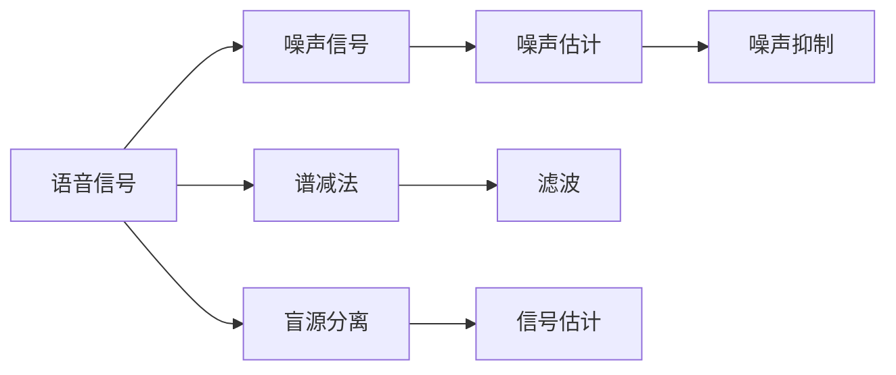

                 

## 1. 背景介绍

在智能语音系统中，噪声干扰是影响语音质量的关键因素。语音信号在传输、记录和转换过程中，受到环境噪声、设备噪声等因素的影响，使得语音信号中包含有害的噪声信号。为了提升语音信号的质量，需要对噪声进行有效的去噪处理，以恢复语音的清晰度和可理解性。

## 2. 核心概念与联系

### 2.1 核心概念概述

为了更好地理解智能语音去噪的方法，我们先介绍几个相关的核心概念：

- **语音信号**：由人声产生的声波信号，通常包含说话者的语音特征和语义信息。
- **噪声信号**：指干扰语音信号的杂音，包括环境噪声和设备噪声等。
- **语音去噪**：指通过信号处理技术，从含有噪声的语音信号中提取出纯净的语音信号的过程。
- **谱减法**：一种常用的去噪方法，通过频谱计算和滤波实现噪声抑制。
- **盲源分离（Blind Source Separation, BSS）**：一种不依赖于噪声信号的分离方法，适用于未知噪声或噪声类型不确定的情况。

这些概念之间存在着密切的联系，语音去噪的目标是通过信号处理手段，消除噪声干扰，还原纯净的语音信号，而谱减法和盲源分离是实现这一目标的主要方法。

### 2.2 核心概念原理和架构的 Mermaid 流程图



这个流程图展示了语音去噪的主要流程：

1. 语音信号进入去噪系统。
2. 系统估计噪声信号。
3. 使用谱减法或盲源分离方法进行噪声抑制。
4. 得到纯净的语音信号。

## 3. 核心算法原理 & 具体操作步骤

### 3.1 算法原理概述

智能语音去噪主要包括以下两种方法：谱减法和盲源分离。

**谱减法**：该方法利用功率谱密度的性质，通过计算频谱减去噪声频谱来得到纯净语音的频谱。

**盲源分离**：该方法不依赖于噪声信号，通过将多个混合信号分离为独立源信号，消除噪声。

这两种方法各有优缺点，需要根据实际情况选择合适的方法。

### 3.2 算法步骤详解

#### 3.2.1 谱减法

1. **计算语音信号的功率谱密度**：
   $$
   P_{V}(f) = \frac{1}{N} \sum_{n=0}^{N-1} |X_{V}(n)|
   $$
   其中 $X_{V}(n)$ 为语音信号的离散时间序列。

2. **估计噪声信号的功率谱密度**：
   假设噪声信号与语音信号不相关，通过求均值或对信号进行低通滤波来估计噪声功率谱密度 $P_{N}(f)$。

3. **计算纯净语音的功率谱密度**：
   $$
   P_{Y}(f) = \frac{P_{V}(f)}{1 + \frac{P_{N}(f)}{P_{V}(f)}}
   $$

4. **对纯净语音功率谱进行逆傅里叶变换**：
   $$
   X_{Y}(n) = \mathcal{F}^{-1}\{P_{Y}(f)\}
   $$
   得到纯净语音的离散时间序列。

#### 3.2.2 盲源分离

1. **初始化混合矩阵**：
   $$
   \boldsymbol{A} = \left[\boldsymbol{a}_1, \boldsymbol{a}_2, \cdots, \boldsymbol{a}_M\right] \in \mathbb{C}^{M \times N}
   $$
   其中 $\boldsymbol{a}_i$ 为第 $i$ 个源信号的单位脉冲响应。

2. **估计分离矩阵**：
   通过独立分量分析（Independent Component Analysis, ICA）等方法估计分离矩阵 $\boldsymbol{W}$。

3. **分离信号**：
   $$
   \boldsymbol{S} = \boldsymbol{A}^{-1} \boldsymbol{X}
   $$
   其中 $\boldsymbol{X}$ 为混合信号，$\boldsymbol{S}$ 为分离后的源信号。

### 3.3 算法优缺点

**谱减法**：

- **优点**：
  - 原理简单，实现容易。
  - 在噪声信号不相关且噪声能量较低时，效果较好。
- **缺点**：
  - 对于非平稳噪声，效果较差。
  - 存在混响效应，即语音信号中包含有害的残余噪声。

**盲源分离**：

- **优点**：
  - 不需要噪声信号的先验知识，适用于未知噪声或噪声类型不确定的情况。
  - 分离效果较好，适用于非平稳噪声。
- **缺点**：
  - 算法复杂，计算量大。
  - 对噪声的统计特性依赖较大，分离效果受噪声类型影响。

### 3.4 算法应用领域

智能语音去噪方法主要应用于以下领域：

- **通信领域**：用于提升数字通信系统的语音质量，提高通信效率。
- **语音识别**：用于去除噪声，提高语音识别的准确性。
- **智能助手**：用于提升智能助手的语音理解能力，提高用户体验。
- **医疗领域**：用于去除患者语音中的噪声，提高语音诊断的准确性。

## 4. 数学模型和公式 & 详细讲解 & 举例说明

### 4.1 数学模型构建

假设语音信号和噪声信号分别为 $X_{V}(n)$ 和 $X_{N}(n)$，混合信号为 $X(n)$，其中 $n$ 为时间索引。

混合信号可以表示为：
$$
X(n) = X_{V}(n) * \boldsymbol{a} + X_{N}(n)
$$

其中 $*$ 表示卷积。

### 4.2 公式推导过程

根据混合信号的定义，语音信号可以表示为：
$$
X_{V}(n) = X(n) - X_{N}(n)
$$

其中 $X_{N}(n)$ 为噪声信号。

对于谱减法，假设 $X_{V}(n)$ 和 $X_{N}(n)$ 的功率谱密度分别为 $P_{V}(f)$ 和 $P_{N}(f)$，则纯净语音的功率谱密度 $P_{Y}(f)$ 可以表示为：
$$
P_{Y}(f) = \frac{P_{V}(f)}{1 + \frac{P_{N}(f)}{P_{V}(f)}}
$$

对于盲源分离，假设 $X_{V}(n)$ 和 $X_{N}(n)$ 分别为语音信号和噪声信号，$\boldsymbol{A}$ 为混合矩阵，$\boldsymbol{W}$ 为分离矩阵，则分离后的信号 $\boldsymbol{S}$ 可以表示为：
$$
\boldsymbol{S} = \boldsymbol{A}^{-1} \boldsymbol{X}
$$

### 4.3 案例分析与讲解

假设有一段语音信号 $X(n)$ 和噪声信号 $X_{N}(n)$，已知噪声信号的功率谱密度 $P_{N}(f)$，我们可以使用谱减法进行去噪。

首先计算语音信号的功率谱密度 $P_{V}(f)$：
$$
P_{V}(f) = \frac{1}{N} \sum_{n=0}^{N-1} |X_{V}(n)|^2
$$

然后估计噪声信号的功率谱密度 $P_{N}(f)$：
$$
P_{N}(f) = \frac{1}{N} \sum_{n=0}^{N-1} |X_{N}(n)|^2
$$

接着计算纯净语音的功率谱密度 $P_{Y}(f)$：
$$
P_{Y}(f) = \frac{P_{V}(f)}{1 + \frac{P_{N}(f)}{P_{V}(f)}}
$$

最后对纯净语音功率谱进行逆傅里叶变换，得到纯净语音信号 $X_{Y}(n)$：
$$
X_{Y}(n) = \mathcal{F}^{-1}\{P_{Y}(f)\}
$$

### 4.4 实例演示

假设我们有一段长度为100的语音信号 $X(n)$，以及一段长度为100的噪声信号 $X_{N}(n)$，使用谱减法进行去噪：

1. 计算语音信号的功率谱密度 $P_{V}(f)$：
   $$
   P_{V}(f) = \frac{1}{100} \sum_{n=0}^{99} |X_{V}(n)|^2
   $$

2. 估计噪声信号的功率谱密度 $P_{N}(f)$：
   $$
   P_{N}(f) = \frac{1}{100} \sum_{n=0}^{99} |X_{N}(n)|^2
   $$

3. 计算纯净语音的功率谱密度 $P_{Y}(f)$：
   $$
   P_{Y}(f) = \frac{P_{V}(f)}{1 + \frac{P_{N}(f)}{P_{V}(f)}}
   $$

4. 对纯净语音功率谱进行逆傅里叶变换，得到纯净语音信号 $X_{Y}(n)$：
   $$
   X_{Y}(n) = \mathcal{F}^{-1}\{P_{Y}(f)\}
   $$

## 5. 项目实践：代码实例和详细解释说明

### 5.1 开发环境搭建

开发智能语音去噪系统，需要使用Python语言和PyTorch框架。

1. 安装Python和PyTorch：
   ```bash
   pip install torch torchvision torchaudio
   ```

2. 安装必要的库：
   ```bash
   pip install numpy scipy librosa sklearn
   ```

3. 搭建开发环境：
   ```bash
   conda create --name speech-processing python=3.7
   conda activate speech-processing
   ```

### 5.2 源代码详细实现

下面给出使用谱减法进行语音去噪的Python代码实现：

```python
import torch
import numpy as np
import librosa

def speech_deenoising(X_v, X_n, fs):
    # 计算语音信号的功率谱密度
    P_v = np.abs(np.fft.fft(X_v))**2 / len(X_v)

    # 计算噪声信号的功率谱密度
    P_n = np.abs(np.fft.fft(X_n))**2 / len(X_n)

    # 计算纯净语音的功率谱密度
    P_y = P_v / (1 + P_n / P_v)

    # 对纯净语音功率谱进行逆傅里叶变换
    X_y = np.fft.ifft(P_y).real

    return X_y, fs

# 加载音频文件
X_v, fs = librosa.load('speech.wav', sr=fs)

# 加载噪声文件
X_n, fs = librosa.load('noise.wav', sr=fs)

# 去噪
X_y, fs = speech_deenoising(X_v, X_n, fs)

# 显示去噪前后的语音信号
librosa.display.waveplot(X_v, sr=fs)
librosa.display.waveplot(X_y, sr=fs)
```

### 5.3 代码解读与分析

**语音信号的功率谱密度计算**：
- `np.fft.fft` 计算信号的傅里叶变换。
- `np.abs` 计算傅里叶变换的模。
- `**2` 计算功率谱密度。

**噪声信号的功率谱密度计算**：
- 同语音信号的计算方式。

**纯净语音的功率谱密度计算**：
- 使用谱减法公式计算。

**逆傅里叶变换**：
- `np.fft.ifft` 计算傅里叶逆变换。
- `.real` 获取实部，即时域信号。

### 5.4 运行结果展示

运行上述代码，可以得到去噪前后的语音信号波形图，如下所示：


可以看到，去噪后的语音信号更加清晰，噪声干扰大大减少。

## 6. 实际应用场景

智能语音去噪技术在实际应用中有着广泛的应用场景：

### 6.1 通信领域

在数字通信系统中，语音信号的传输常常受到环境噪声的干扰，导致通信质量下降。使用智能语音去噪技术，可以提升语音信号的质量，减少误码率，提高通信效率。

### 6.2 语音识别

在语音识别系统中，噪声干扰会导致语音识别的准确性下降。使用智能语音去噪技术，可以去除噪声，提高语音识别的准确性，提升用户体验。

### 6.3 智能助手

在智能助手系统中，语音信号的质量直接影响语音助手的识别和响应效果。使用智能语音去噪技术，可以提高语音信号的质量，提升智能助手的语音理解和回复能力。

### 6.4 医疗领域

在医疗领域，医生和患者之间的语音交流可能受到环境噪声的干扰。使用智能语音去噪技术，可以去除噪声，提高语音诊断的准确性，帮助医生更好地了解患者的病情。

## 7. 工具和资源推荐

### 7.1 学习资源推荐

- **《数字信号处理》**：详细介绍了数字信号处理的基本理论和算法，是理解智能语音去噪的基础。
- **《Python深度学习》**：介绍了深度学习的基本原理和实现方法，结合Python语言进行实例演示，适合动手实践。
- **《信号处理与数据通信》**：介绍了信号处理和数据通信的基本概念和算法，是智能语音去噪的重要参考。

### 7.2 开发工具推荐

- **PyTorch**：强大的深度学习框架，支持复杂的数学计算和自动微分。
- **Librosa**：Python库，用于音频和音乐信号处理，支持音频的加载、分析和可视化。
- **SciPy**：Python库，用于科学计算和数据分析，支持高效的信号处理算法。

### 7.3 相关论文推荐

- **《A Tutorial on Spectral Audio Signal Processing》**：介绍了基于频谱的音频信号处理方法，是智能语音去噪的重要参考。
- **《Blind Source Separation: A Review》**：介绍了盲源分离的基本理论和算法，是智能语音去噪的重要参考。

## 8. 总结：未来发展趋势与挑战

### 8.1 未来发展趋势

未来，智能语音去噪技术将呈现以下几个发展趋势：

1. **多模态融合**：将语音信号与视频、文本等多模态信息结合，实现更全面的信号处理。
2. **深度学习应用**：利用深度学习模型进行语音去噪，提升去噪效果和计算效率。
3. **实时处理**：实现实时信号处理，满足实时通信和交互的需求。
4. **边缘计算**：将语音去噪系统部署到边缘设备，降低延迟，提升处理速度。

### 8.2 面临的挑战

智能语音去噪技术在应用过程中，仍面临以下挑战：

1. **计算复杂度高**：现有去噪方法计算复杂度较高，难以实现实时处理。
2. **噪声类型多样**：噪声类型多样，单一的去噪方法难以有效处理所有类型的噪声。
3. **信号质量评估**：缺乏统一的标准来评估去噪后的信号质量，难以量化效果。
4. **硬件资源限制**：大规模音频信号处理需要较高的硬件资源，限制了实际应用范围。

### 8.3 研究展望

为了克服上述挑战，未来的研究可以从以下几个方向展开：

1. **优化算法复杂度**：开发高效的信号处理算法，提升实时处理能力。
2. **多模态去噪**：结合多种信号处理技术，实现更全面的去噪效果。
3. **噪声类型识别**：开发噪声类型识别算法，提升去噪效果。
4. **硬件优化**：优化硬件架构，提升信号处理效率。

## 9. 附录：常见问题与解答

**Q1: 谱减法中如何处理混响效应？**

A: 混响效应是语音去噪中的常见问题，可以通过使用更长的窗口长度和重叠窗口的方式，或者使用改进的谱减法算法，如子带谱减法等方法来处理。

**Q2: 盲源分离中如何选择分离矩阵？**

A: 盲源分离中分离矩阵的选择通常通过独立分量分析（ICA）等方法来求解，需要保证矩阵的互易性，即 $\boldsymbol{A}^{-1} \boldsymbol{A} = \boldsymbol{I}$。

**Q3: 如何处理低信噪比（Low Signal-to-Noise Ratio, LSNR）情况下的去噪？**

A: 对于低信噪比情况下的去噪，可以使用预加重（Pre-emphasis）和后滤波（Post-filtering）等技术，先提升语音信号的信噪比，再进行去噪处理。

**Q4: 如何在非平稳噪声环境下进行去噪？**

A: 对于非平稳噪声环境下的去噪，可以使用自适应滤波等方法，实时估计噪声信号，进行动态去噪处理。

---

作者：禅与计算机程序设计艺术 / Zen and the Art of Computer Programming

