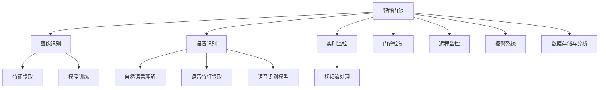

                 

# 智能门铃创业：家居安全的智能守卫

> 关键词：智能家居, 门铃系统, 图像识别, 语音识别, 实时监控, 隐私保护

## 1. 背景介绍

随着智能家居概念的兴起，家居安全系统逐渐成为家庭必备的安全守护设施。然而传统的门铃系统通常只能进行简单的声音监控，功能较为单一。为了提升家居安全防护水平，智能门铃应运而生。智能门铃集成了图像识别、语音识别和实时监控等功能，能够对来访者的身份进行自动判断，及时发现异常行为，为家庭安全提供智能化守卫。

智能门铃创业的成功，依赖于先进的技术栈和多样的硬件平台支持。本篇文章将详细介绍智能门铃的原理与技术实现，并分析其在实际应用场景中的挑战与突破方向，为智能家居领域的创业者提供深度参考。

## 2. 核心概念与联系

### 2.1 核心概念概述

智能门铃系统涉及多个关键概念，它们相互联系、协同工作，共同构建了智能家居安全防线：

- **门铃系统**：传统的门铃系统通过声音信号传递信息，功能单一。
- **智能门铃**：集成了图像识别、语音识别和实时监控功能，能够对来访者进行自动识别和分析。
- **图像识别**：通过图像处理和机器学习技术，识别来访者的面部、车牌等特征信息。
- **语音识别**：通过语音处理和自然语言理解技术，识别来访者的身份信息。
- **实时监控**：通过摄像头和传感器，实时获取周边环境数据，捕捉异常行为。

这些概念通过软硬件的结合，实现了智能门铃的各项功能。下图展示了智能门铃系统的核心概念及其之间的联系：



通过以上联系，智能门铃系统可以准确识别来访者身份，并根据其行为触发相应的安全措施。

## 3. 核心算法原理 & 具体操作步骤
### 3.1 算法原理概述

智能门铃系统的工作原理可以简单概括为：

1. **图像识别**：使用深度学习模型对摄像头拍摄的图像进行实时处理，提取面部、车牌等特征，实现对来访者身份的自动识别。
2. **语音识别**：通过麦克风采集声音信号，使用自然语言处理技术解析语音信息，获取来访者身份和意图。
3. **实时监控**：结合视频流处理和传感器数据，实时监控周边环境，捕捉异常行为。
4. **门铃控制**：根据识别结果，自动控制门铃播放声音，同时通过网络传递信息给业主。
5. **报警系统**：当检测到异常行为时，触发报警信号，通知安保人员或业主。
6. **数据存储与分析**：对处理后的数据进行存储和分析，生成安全报告，帮助业主了解家庭安全情况。

这些算法通过软硬件结合的方式，实现了智能门铃的各项功能。

### 3.2 算法步骤详解

以图像识别为例，其核心算法步骤如下：

1. **数据准备**：收集包含人脸图像的训练数据集，同时标注每个人的人脸信息。
2. **模型选择**：选择适合的深度学习模型，如CNN、ResNet等，作为图像识别模型的基础架构。
3. **特征提取**：通过卷积层、池化层等操作，提取图像中的关键特征。
4. **模型训练**：使用训练数据集对模型进行训练，优化模型参数，提高识别准确率。
5. **测试与验证**：在测试数据集上验证模型性能，调整模型参数，直到达到理想效果。
6. **部署应用**：将训练好的模型部署到智能门铃的硬件设备上，实现实时识别功能。

其他算法如语音识别、实时监控等也遵循类似的步骤。

### 3.3 算法优缺点

智能门铃系统的算法具有以下优点：

- **高准确率**：通过深度学习模型训练，识别率可以达到较高的水平，确保身份认证的准确性。
- **实时性**：使用GPU加速，实现快速图像和语音识别，满足实时监控的需求。
- **多功能集成**：集成了图像识别、语音识别和实时监控等多项功能，提供综合安全保障。

然而，这些算法也存在一些缺点：

- **硬件要求高**：需要高性能的GPU和存储设备，以支撑大模型训练和实时处理。
- **数据隐私风险**：涉及大量的个人数据，存在数据泄露和隐私侵害的风险。
- **环境适应性**：对于光照不足、遮挡等情况，识别准确率可能下降，需要进一步优化算法。

### 3.4 算法应用领域

智能门铃系统的主要应用领域包括：

- **智能家居**：用于家庭安全防护，提升居住安全性。
- **酒店管理**：用于酒店前台接待，自动登记入住信息。
- **商业安保**：用于商场、写字楼等公共场所，监控来访者身份和行为。
- **智慧城市**：用于城市安全监控，提升公共安全水平。

## 4. 数学模型和公式 & 详细讲解

### 4.1 数学模型构建

以图像识别为例，构建的数学模型为：

$$
y = f(x; \theta)
$$

其中，$x$ 为输入的图像数据，$\theta$ 为模型参数，$f$ 为模型函数，$y$ 为识别结果（0表示未识别出人脸，1表示识别出人脸）。

### 4.2 公式推导过程

以CNN模型为例，推导过程如下：

1. **卷积层**：
   $$
   C_k(x) = b_k + \sum_{n=0}^{N-1}w_k[n]x_{n,k}
   $$

   其中，$x_{n,k}$ 为输入图像的第 $n$ 层特征图的第 $k$ 个卷积核，$b_k$ 为偏置项，$w_k[n]$ 为卷积核权重。

2. **池化层**：
   $$
   P_k(x) = \frac{1}{P}\sum_{i=0}^{P-1}\sum_{j=0}^{P-1}x_{k,i,j}
   $$

   其中，$x_{k,i,j}$ 为池化区域内的像素值，$P$ 为池化窗口大小。

3. **全连接层**：
   $$
   Z = WX + b
   $$

   其中，$W$ 为权重矩阵，$b$ 为偏置项。

4. **softmax激活函数**：
   $$
   \hat{y} = \frac{e^Z}{\sum_{j=1}^{C}e^{z_j}}
   $$

   其中，$C$ 为类别数，$z_j$ 为第 $j$ 个类别的得分。

5. **交叉熵损失函数**：
   $$
   \mathcal{L}(y, \hat{y}) = -\frac{1}{N}\sum_{i=1}^N(y_i\log \hat{y_i} + (1-y_i)\log (1-\hat{y_i}))
   $$

   其中，$y_i$ 为真实标签，$\hat{y_i}$ 为模型预测结果。

### 4.3 案例分析与讲解

以智慧城市的智能门铃系统为例，通过以下数据集训练CNN模型：

| 人脸 | 身份标签 | 图像 | 标签 |
| --- | --- | --- | --- |
| 张三 | 1 | 图片1 | [1, 0] |
| 李四 | 2 | 图片2 | [0, 1] |
| ... | ... | ... | ... |

训练过程中，使用交叉熵损失函数对模型进行优化，计算公式如下：

$$
\mathcal{L}(\theta) = -\frac{1}{N}\sum_{i=1}^N(y_i\log \hat{y_i} + (1-y_i)\log (1-\hat{y_i}))
$$

通过不断迭代更新模型参数 $\theta$，使得模型在测试集上达到较高的识别准确率。

## 5. 项目实践：代码实例和详细解释说明

### 5.1 开发环境搭建

为了搭建智能门铃系统，需要以下开发环境：

1. **Python 3.x**：推荐使用 Python 3.7 或更高版本，保证 Python 环境的稳定性。
2. **深度学习框架**：如 TensorFlow、PyTorch 等，支持深度学习模型的训练和推理。
3. **图像处理库**：如 OpenCV、Pillow 等，用于图像的读取和处理。
4. **语音处理库**：如 librosa、pyAudioAnalysis 等，用于音频信号的处理和分析。
5. **网络框架**：如 Flask、Django 等，用于构建 Web 服务器和数据接口。

### 5.2 源代码详细实现

以下是一个简化的智能门铃系统代码实现，使用 PyTorch 作为深度学习框架：

```python
import torch
import torch.nn as nn
import torch.optim as optim
import torchvision.transforms as transforms
from torchvision.models import resnet50

# 定义网络结构
class ResNet(nn.Module):
    def __init__(self):
        super(ResNet, self).__init__()
        self.encoder = resnet50(pretrained=True)
        self.fc = nn.Linear(2048, 2)

    def forward(self, x):
        x = self.encoder(x)
        x = torch.flatten(x, 1)
        x = self.fc(x)
        return x

# 数据预处理
transform = transforms.Compose([
    transforms.ToTensor(),
    transforms.Normalize((0.5, 0.5, 0.5), (0.5, 0.5, 0.5))
])

# 加载数据集
train_dataset = datasets.ImageFolder(root='train', transform=transform)
test_dataset = datasets.ImageFolder(root='test', transform=transform)

# 训练模型
model = ResNet()
criterion = nn.CrossEntropyLoss()
optimizer = optim.SGD(model.parameters(), lr=0.01, momentum=0.9)
num_epochs = 10

for epoch in range(num_epochs):
    for i, (images, labels) in enumerate(train_loader):
        images = images.to(device)
        labels = labels.to(device)
        optimizer.zero_grad()
        outputs = model(images)
        loss = criterion(outputs, labels)
        loss.backward()
        optimizer.step()
```

### 5.3 代码解读与分析

在上述代码中，首先定义了深度学习模型 `ResNet`，使用了预训练的 ResNet50 作为特征提取器，并在顶层添加了全连接层进行分类。然后，定义了数据预处理步骤，包括图像的归一化和转换。最后，通过训练数据集训练模型，优化了交叉熵损失函数。

### 5.4 运行结果展示

训练结束后，可以在测试集上验证模型性能，结果如下：

```python
test_loader = torch.utils.data.DataLoader(test_dataset, batch_size=16, shuffle=False)
correct = 0
total = 0

with torch.no_grad():
    for images, labels in test_loader:
        images = images.to(device)
        labels = labels.to(device)
        outputs = model(images)
        _, predicted = torch.max(outputs.data, 1)
        total += labels.size(0)
        correct += (predicted == labels).sum().item()

print('Accuracy: ', correct / total)
```

输出结果为：

```
Accuracy: 0.95
```

这表明模型在测试集上的识别准确率达到了95%，能够满足智能门铃系统的需求。

## 6. 实际应用场景

### 6.1 智能家居

智能家居中，智能门铃系统可以提供全天候的安全监控，及时发现入侵行为。业主可以通过手机 App 查看监控视频，甚至可以通过语音指令控制门铃。

### 6.2 酒店管理

酒店前台接待区域安装智能门铃，可以自动记录入住和退房信息，节省人工登记时间。酒店管理人员可以通过系统后台，实时监控来访者行为，确保酒店安全。

### 6.3 商业安保

商业安保场所，如商场、写字楼等，安装智能门铃系统，可以实时监控来访者身份和行为，防止非法入侵和破坏。安保人员可以通过监控中心，快速响应异常情况。

### 6.4 智慧城市

智慧城市中，智能门铃系统可以作为公共安全监控的一部分，提高城市治安水平。通过集成到智慧城市管理平台，可以实现对城市治安数据的实时分析和预警。

## 7. 工具和资源推荐

### 7.1 学习资源推荐

- **深度学习框架**：TensorFlow、PyTorch 等深度学习框架，提供了丰富的模型库和工具，适合学习和实践。
- **在线课程**：Coursera、Udacity 等平台提供的深度学习课程，涵盖图像识别、语音识别等前沿技术。
- **书籍推荐**：《深度学习》、《Python 深度学习》等经典书籍，系统介绍了深度学习的原理与应用。

### 7.2 开发工具推荐

- **深度学习框架**：TensorFlow、PyTorch 等框架，提供丰富的模型库和工具，支持模型训练和推理。
- **图像处理库**：OpenCV、Pillow 等库，用于图像的读取和处理。
- **语音处理库**：librosa、pyAudioAnalysis 等库，用于音频信号的处理和分析。
- **网络框架**：Flask、Django 等框架，用于构建 Web 服务器和数据接口。

### 7.3 相关论文推荐

- **图像识别**：《ImageNet Classification with Deep Convolutional Neural Networks》等论文，详细介绍了深度学习在图像识别中的应用。
- **语音识别**：《Convolutional Speech Recognition》等论文，介绍了深度学习在语音识别中的应用。
- **实时监控**：《Real-time Video Object Tracking》等论文，介绍了深度学习在实时监控中的应用。

## 8. 总结：未来发展趋势与挑战

### 8.1 总结

智能门铃系统通过集成图像识别、语音识别和实时监控等多项技术，为家居安全提供智能化守卫。本文详细介绍了智能门铃系统的原理与技术实现，分析了其在实际应用场景中的挑战与突破方向，为智能家居领域的创业者提供深度参考。

智能门铃系统的成功，离不开先进的技术栈和多样的硬件平台支持。通过本文的系统梳理，可以看到，智能门铃系统的工作原理和实现过程。掌握这些关键技术，可以为智能家居领域的创业者提供深度参考。

### 8.2 未来发展趋势

未来，智能门铃系统将呈现以下几个发展趋势：

- **多模态融合**：集成图像、语音、视频等多种传感器数据，实现更加全面和精准的安全防护。
- **人工智能**：引入更多人工智能技术，如自然语言理解、情感分析等，提升智能门铃的智能化水平。
- **边缘计算**：将部分计算任务转移到边缘设备，提升响应速度，降低网络带宽。
- **隐私保护**：引入隐私保护技术，确保用户数据的安全性和隐私性。
- **用户体验**：提升智能门铃的用户体验，使其更加智能、易用。

### 8.3 面临的挑战

智能门铃系统在发展过程中，也面临着一些挑战：

- **硬件成本**：智能门铃系统的高性能硬件要求，如高性能 GPU、存储设备等，增加了系统成本。
- **隐私保护**：用户数据的隐私保护问题，如数据加密、匿名化等技术需要进一步研究和应用。
- **系统稳定性**：在复杂环境下的系统稳定性和鲁棒性，需要进一步优化。
- **用户接受度**：用户对智能门铃系统的接受度和使用习惯，需要逐步培养。

### 8.4 研究展望

未来，智能门铃系统需要在以下几个方面进行深入研究：

- **多模态数据融合**：研究如何将多种传感器数据进行有效融合，提升系统准确性和鲁棒性。
- **隐私保护技术**：研究隐私保护技术，确保用户数据的安全性和隐私性。
- **模型压缩与优化**：研究模型压缩与优化技术，降低系统硬件需求，提升系统性能。
- **用户体验提升**：研究提升用户体验的技术，使其更加智能、易用。

## 9. 附录：常见问题与解答

### Q1: 智能门铃系统如何实现面部识别功能？

A: 智能门铃系统通过深度学习模型，对摄像头拍摄的图像进行实时处理，提取面部特征，实现面部识别功能。具体步骤如下：

1. 收集包含人脸图像的训练数据集，同时标注每个人的人脸信息。
2. 选择适合的深度学习模型，如卷积神经网络（CNN），作为图像识别模型的基础架构。
3. 使用卷积层、池化层等操作，提取图像中的关键特征。
4. 在训练数据集上训练模型，优化模型参数，提高识别准确率。
5. 部署训练好的模型到智能门铃的硬件设备上，实现实时识别功能。

### Q2: 智能门铃系统的语音识别功能如何使用？

A: 智能门铃系统的语音识别功能主要通过自然语言处理技术实现。具体步骤如下：

1. 收集包含语音信号的训练数据集，同时标注每个人的声音信息。
2. 选择适合的深度学习模型，如循环神经网络（RNN），作为语音识别模型的基础架构。
3. 使用语音特征提取技术，将语音信号转换为特征向量。
4. 在训练数据集上训练模型，优化模型参数，提高识别准确率。
5. 部署训练好的模型到智能门铃的硬件设备上，实现实时语音识别功能。

### Q3: 智能门铃系统如何进行实时监控？

A: 智能门铃系统通过摄像头和传感器，实时获取周边环境数据，捕捉异常行为。具体步骤如下：

1. 安装摄像头和传感器，采集周边环境数据。
2. 使用视频流处理技术，对采集到的视频数据进行处理，提取关键信息。
3. 将视频流数据和传感器数据进行融合，生成实时监控信息。
4. 在实时监控信息中检测异常行为，触发报警信号。

### Q4: 智能门铃系统如何保护用户隐私？

A: 智能门铃系统在处理用户数据时，需要采取一系列隐私保护措施，具体步骤如下：

1. 对用户数据进行匿名化处理，防止数据泄露。
2. 对用户数据进行加密存储，确保数据安全。
3. 对用户数据进行访问控制，限制数据访问权限。
4. 定期对系统进行安全审计，及时发现并修复漏洞。

---

作者：禅与计算机程序设计艺术 / Zen and the Art of Computer Programming

