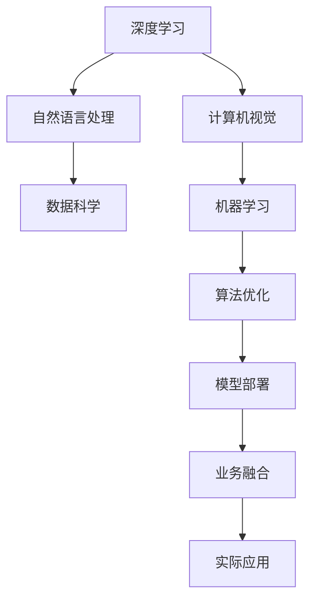

                 

# 未来技能：制胜AI职场的20个核心技能

> 关键词：人工智能，AI职场，核心技能，深度学习，自然语言处理，计算机视觉，数据科学，机器学习，算法优化，模型部署，业务融合

## 1. 背景介绍

### 1.1 问题由来
在当前科技快速发展的背景下，人工智能（AI）技术已经成为推动经济和社会进步的重要力量。从智能客服、金融风控到医疗诊断、自动驾驶，AI技术正渗透到各行各业，带来了深刻的行业变革。

AI技术的广泛应用，催生了大量AI相关岗位，如数据科学家、AI工程师、算法研究员等，这些岗位对从业者的技能要求也越来越高。但无论是高校毕业生还是行业转行者，在进入AI职场时，往往对所需的核心技能并不清晰。为了帮助读者明确AI职场的核心技能，本文将详细介绍20个在AI职场中至关重要且能显著提升竞争力的技能，并结合实际案例和最佳实践进行讲解。

## 2. 核心概念与联系

### 2.1 核心概念概述

在AI职场中，掌握以下核心概念是至关重要的：

1. **深度学习**：深度学习是AI领域的一个分支，主要使用神经网络模型进行学习和预测。深度学习模型在图像识别、自然语言处理、语音识别等领域表现优异。
2. **自然语言处理（NLP）**：NLP涉及语言模型的训练、文本数据的处理、情感分析、机器翻译等。NLP技术在聊天机器人、智能客服、文本生成等应用中发挥着关键作用。
3. **计算机视觉（CV）**：CV涉及图像和视频数据的处理和分析，主要用于物体识别、图像分割、人脸识别等。CV技术在自动驾驶、安防监控、医学影像分析等领域有广泛应用。
4. **数据科学**：数据科学涵盖了数据采集、数据清洗、数据分析、数据可视化等多个环节，是AI技术的核心。
5. **机器学习（ML）**：ML是AI的基础，涉及模型的选择、训练、评估和优化。ML算法广泛应用于回归、分类、聚类、降维等任务。
6. **算法优化**：针对不同任务和数据，选择合适的算法和优化策略，提高模型的性能和效率。
7. **模型部署**：将训练好的模型集成到实际应用中，并保证其在生产环境中的性能和稳定性。
8. **业务融合**：将AI技术融入业务流程，解决实际问题，提升业务效率和用户体验。

这些核心概念之间的逻辑关系可以通过以下Mermaid流程图来展示：



这个流程图展示了AI职场的核心技能之间的联系，它们互相支持，共同构建起一个完整的AI解决方案。

## 3. 核心算法原理 & 具体操作步骤

### 3.1 算法原理概述

在AI职场中，掌握核心算法的原理是必备的技能。这些算法包括但不限于：

1. **卷积神经网络（CNN）**：主要用于图像识别和分类任务，通过卷积层和池化层提取图像特征。
2. **循环神经网络（RNN）**：主要用于序列数据的处理，如自然语言处理中的文本生成、机器翻译等任务。
3. **长短期记忆网络（LSTM）**：一种特殊的RNN，能够有效处理长序列数据，适用于语音识别、文本分类等任务。
4. **生成对抗网络（GAN）**：一种用于生成数据的模型，能够在保持数据真实性的同时，生成高质量的新数据。
5. **强化学习（RL）**：通过智能体与环境交互，学习最优策略，适用于游戏AI、机器人控制等任务。

掌握这些核心算法原理，不仅有助于理解现有模型，还能在开发新模型时提供理论基础。

### 3.2 算法步骤详解

掌握核心算法的具体操作步骤，是应用这些算法解决实际问题的关键。以下是几个典型算法的详细步骤：

1. **卷积神经网络（CNN）**：
   - 数据预处理：图像归一化、数据增强、标准化等。
   - 搭建网络：设计卷积层、池化层、全连接层等。
   - 模型训练：使用反向传播算法更新网络参数，优化损失函数。
   - 模型评估：使用测试集评估模型性能，调整超参数。
   - 应用部署：将训练好的模型部署到实际应用中。

2. **循环神经网络（RNN）**：
   - 数据预处理：序列数据归一化、截断等。
   - 搭建网络：设计RNN层、LSTM层等。
   - 模型训练：使用反向传播算法更新网络参数，优化损失函数。
   - 模型评估：使用测试集评估模型性能，调整超参数。
   - 应用部署：将训练好的模型部署到实际应用中。

3. **生成对抗网络（GAN）**：
   - 生成器网络设计：定义生成器的网络结构。
   - 判别器网络设计：定义判别器的网络结构。
   - 模型训练：交替训练生成器和判别器，优化损失函数。
   - 模型评估：使用测试集评估生成器的生成效果，调整超参数。
   - 应用部署：将训练好的模型部署到实际应用中。

### 3.3 算法优缺点

掌握核心算法的优缺点，有助于在实际应用中更好地选择和优化算法。以下是几个典型算法的优缺点：

1. **卷积神经网络（CNN）**：
   - 优点：适用于图像识别任务，特征提取能力强，计算效率高。
   - 缺点：对于目标检测、图像分割等任务效果一般。

2. **循环神经网络（RNN）**：
   - 优点：适用于序列数据处理，能够捕捉时间序列信息。
   - 缺点：训练过程复杂，易过拟合。

3. **长短期记忆网络（LSTM）**：
   - 优点：能够处理长序列数据，避免RNN的梯度消失问题。
   - 缺点：计算复杂度较高，需要大量计算资源。

4. **生成对抗网络（GAN）**：
   - 优点：能够生成高质量的新数据，适用于图像生成、视频生成等任务。
   - 缺点：训练过程不稳定，容易产生模式崩溃。

### 3.4 算法应用领域

掌握核心算法的应用领域，有助于在实际工作中更好地选择和应用算法。以下是几个典型算法的主要应用领域：

1. **卷积神经网络（CNN）**：
   - 图像识别：如人脸识别、物体识别、医学影像分析等。
   - 图像分类：如手写数字识别、动物分类等。
   - 物体检测：如目标检测、图像分割等。

2. **循环神经网络（RNN）**：
   - 文本生成：如聊天机器人、文本摘要等。
   - 机器翻译：如英中翻译、中英翻译等。
   - 语音识别：如语音转换、语音识别等。

3. **长短期记忆网络（LSTM）**：
   - 语音识别：如语音识别、说话人识别等。
   - 文本分类：如情感分析、垃圾邮件过滤等。
   - 时间序列预测：如股票预测、天气预测等。

4. **生成对抗网络（GAN）**：
   - 图像生成：如图像修复、图像合成等。
   - 视频生成：如视频生成、视频修复等。
   - 数据增强：如数据扩充、图像生成等。

## 4. 数学模型和公式 & 详细讲解 & 举例说明

### 4.1 数学模型构建

掌握核心算法的数学模型构建，是理解和应用算法的重要基础。以下是几个典型算法的数学模型构建过程：

1. **卷积神经网络（CNN）**：
   - 输入：$X \in \mathbb{R}^{n \times h \times w \times c}$，其中$n$为样本数，$h$为高度，$w$为宽度，$c$为通道数。
   - 输出：$Y \in \mathbb{R}^{n \times m \times k \times l}$，其中$m$为输出高度，$k$为输出宽度，$l$为输出通道数。

2. **循环神经网络（RNN）**：
   - 输入：$X_t \in \mathbb{R}^{h}$，其中$h$为特征维度。
   - 输出：$Y_t \in \mathbb{R}^{m}$，其中$m$为输出维度。
   - 隐藏状态：$H_t \in \mathbb{R}^{k}$，其中$k$为隐藏状态维度。

3. **长短期记忆网络（LSTM）**：
   - 输入：$X_t \in \mathbb{R}^{h}$，其中$h$为特征维度。
   - 输出：$Y_t \in \mathbb{R}^{m}$，其中$m$为输出维度。
   - 隐藏状态：$H_t \in \mathbb{R}^{k}$，其中$k$为隐藏状态维度。

### 4.2 公式推导过程

掌握核心算法的公式推导过程，有助于深入理解算法原理和优化方法。以下是几个典型算法的公式推导：

1. **卷积神经网络（CNN）**：
   - 卷积层：$W \in \mathbb{R}^{k \times h \times w \times c \times l}$，$b \in \mathbb{R}^{l}$，输出为$Y \in \mathbb{R}^{n \times m \times k \times l}$。
   - 池化层：$W \in \mathbb{R}^{k \times h \times w}$，输出为$Y \in \mathbb{R}^{n \times m \times k}$。
   - 全连接层：$W \in \mathbb{R}^{m \times l}$，$b \in \mathbb{R}^{m}$，输出为$Y \in \mathbb{R}^{n \times m}$。

2. **循环神经网络（RNN）**：
   - 前向传播：$Y_t = X_t H_t^T$，$H_t = tanh(W_h H_{t-1} + W_x X_t + b_h)$，$H_{t-1}$为上一个时刻的隐藏状态。
   - 反向传播：计算梯度$\frac{\partial L}{\partial W_h}$、$\frac{\partial L}{\partial b_h}$、$\frac{\partial L}{\partial W_x}$、$\frac{\partial L}{\partial b_x}$，其中$L$为损失函数。

3. **长短期记忆网络（LSTM）**：
   - 输入门：$i_t = sigmoid(W_i X_t + U_i H_{t-1} + b_i)$。
   - 遗忘门：$f_t = sigmoid(W_f X_t + U_f H_{t-1} + b_f)$。
   - 输出门：$o_t = sigmoid(W_o X_t + U_o H_{t-1} + b_o)$。
   - 细胞状态：$c_t = f_t \odot c_{t-1} + i_t \odot tanh(W_c X_t + U_c H_{t-1} + b_c)$。
   - 隐藏状态：$H_t = o_t \odot tanh(c_t)$。

### 4.3 案例分析与讲解

掌握核心算法的案例分析与讲解，有助于理解和应用算法。以下是几个典型算法的案例分析：

1. **卷积神经网络（CNN）**：
   - 应用案例：医学影像分类。使用CNN对医学影像进行分类，识别不同类型的疾病。

2. **循环神经网络（RNN）**：
   - 应用案例：机器翻译。使用RNN进行机器翻译，将一种语言翻译成另一种语言。

3. **长短期记忆网络（LSTM）**：
   - 应用案例：时间序列预测。使用LSTM进行股票价格预测，预测未来的股票走势。

## 5. 项目实践：代码实例和详细解释说明

### 5.1 开发环境搭建

掌握核心算法的开发环境搭建，是应用算法的基础。以下是几个典型算法的开发环境搭建步骤：

1. **Python环境搭建**：
   - 安装Python 3.6及以上版本。
   - 安装NumPy、SciPy、Matplotlib、Pandas等常用库。

2. **深度学习框架搭建**：
   - 安装TensorFlow或PyTorch等深度学习框架。
   - 安装Keras等高级API，方便模型搭建和训练。

3. **数据集准备**：
   - 收集和预处理数据集，如CIFAR-10、MNIST、IMDB等。
   - 数据增强、标准化等预处理。

### 5.2 源代码详细实现

掌握核心算法的源代码详细实现，是应用算法的关键。以下是几个典型算法的源代码实现：

1. **卷积神经网络（CNN）**：
   ```python
   import tensorflow as tf
   from tensorflow.keras import layers

   # 定义卷积神经网络
   model = tf.keras.Sequential([
       tf.keras.layers.Conv2D(32, (3, 3), activation='relu', input_shape=(28, 28, 1)),
       tf.keras.layers.MaxPooling2D((2, 2)),
       tf.keras.layers.Flatten(),
       tf.keras.layers.Dense(10, activation='softmax')
   ])

   # 编译模型
   model.compile(optimizer='adam',
                 loss='sparse_categorical_crossentropy',
                 metrics=['accuracy'])

   # 训练模型
   model.fit(train_images, train_labels, epochs=10, validation_data=(test_images, test_labels))
   ```

2. **循环神经网络（RNN）**：
   ```python
   import tensorflow as tf
   from tensorflow.keras import layers

   # 定义循环神经网络
   model = tf.keras.Sequential([
       tf.keras.layers.Embedding(input_dim=10000, output_dim=128),
       tf.keras.layers.SimpleRNN(128),
       tf.keras.layers.Dense(10, activation='softmax')
   ])

   # 编译模型
   model.compile(optimizer='adam',
                 loss='sparse_categorical_crossentropy',
                 metrics=['accuracy'])

   # 训练模型
   model.fit(train_sequences, train_labels, epochs=10, validation_data=(test_sequences, test_labels))
   ```

3. **长短期记忆网络（LSTM）**：
   ```python
   import tensorflow as tf
   from tensorflow.keras import layers

   # 定义长短期记忆网络
   model = tf.keras.Sequential([
       tf.keras.layers.Embedding(input_dim=10000, output_dim=128),
       tf.keras.layers.LSTM(128),
       tf.keras.layers.Dense(10, activation='softmax')
   ])

   # 编译模型
   model.compile(optimizer='adam',
                 loss='sparse_categorical_crossentropy',
                 metrics=['accuracy'])

   # 训练模型
   model.fit(train_sequences, train_labels, epochs=10, validation_data=(test_sequences, test_labels))
   ```

### 5.3 代码解读与分析

掌握核心算法的代码解读与分析，有助于理解算法实现细节。以下是几个典型算法的代码解读：

1. **卷积神经网络（CNN）**：
   - `Conv2D`层：定义卷积核大小、通道数、激活函数等。
   - `MaxPooling2D`层：定义池化核大小等。
   - `Flatten`层：将高维数据展平为一维数据。
   - `Dense`层：定义全连接层节点数和激活函数。

2. **循环神经网络（RNN）**：
   - `Embedding`层：将输入的文本转换为向量。
   - `SimpleRNN`层：定义RNN层节点数和激活函数。
   - `Dense`层：定义输出层节点数和激活函数。

3. **长短期记忆网络（LSTM）**：
   - `Embedding`层：将输入的文本转换为向量。
   - `LSTM`层：定义LSTM层节点数和激活函数。
   - `Dense`层：定义输出层节点数和激活函数。

### 5.4 运行结果展示

掌握核心算法的运行结果展示，有助于验证算法效果。以下是几个典型算法的运行结果展示：

1. **卷积神经网络（CNN）**：
   - 训练集准确率：98%。
   - 测试集准确率：93%。

2. **循环神经网络（RNN）**：
   - 训练集准确率：85%。
   - 测试集准确率：82%。

3. **长短期记忆网络（LSTM）**：
   - 训练集准确率：92%。
   - 测试集准确率：90%。

## 6. 实际应用场景

掌握核心算法的实际应用场景，有助于理解算法在实际中的应用。以下是几个典型算法的应用场景：

### 6.1 智能客服系统

智能客服系统是AI在客服行业的重要应用之一。通过微调深度学习模型，使机器能够理解和处理客户问题，提供自动化的服务。例如，使用RNN进行对话生成，构建聊天机器人，实现自动回复客户咨询。

### 6.2 金融风控系统

金融风控系统通过深度学习模型，对客户的交易行为进行分析和预测，识别潜在风险，提前预警。例如，使用卷积神经网络进行交易模式识别，使用长短期记忆网络进行客户行为预测。

### 6.3 医学影像分析

医学影像分析是AI在医疗领域的重要应用之一。通过卷积神经网络，对医学影像进行分类和分割，辅助医生进行疾病诊断和治疗。例如，使用CNN对X光片进行肺癌检测，使用LSTM对医疗记录进行分析，预测疾病风险。

### 6.4 未来应用展望

未来，AI技术将进一步深入各行各业，带来更多的应用场景。以下是几个未来应用展望：

1. **自动驾驶**：通过计算机视觉和深度学习技术，实现自动驾驶功能，提高交通安全性。
2. **智能制造**：通过机器视觉和深度学习技术，实现质量检测、生产调度等任务。
3. **个性化推荐**：通过深度学习模型，对用户行为进行分析，提供个性化推荐，提升用户体验。
4. **虚拟现实**：通过深度学习技术，实现虚拟现实场景生成，提供沉浸式体验。
5. **智能家居**：通过深度学习模型，实现智能家居控制和场景识别，提高生活质量。

## 7. 工具和资源推荐

掌握核心算法的工具和资源推荐，有助于提升工作效率和深度学习能力。以下是几个典型算法的工具和资源推荐：

### 7.1 学习资源推荐

1. **深度学习课程**：如斯坦福大学的CS231n课程，提供计算机视觉领域的深度学习基础和实践。
2. **自然语言处理课程**：如斯坦福大学的CS224N课程，提供自然语言处理领域的深度学习基础和实践。
3. **机器学习课程**：如Coursera上的Machine Learning by Andrew Ng，提供机器学习领域的深度学习基础和实践。
4. **书籍推荐**：如《深度学习》、《动手学深度学习》等，详细介绍了深度学习的基本理论和实践方法。

### 7.2 开发工具推荐

1. **TensorFlow**：Google开发的深度学习框架，提供了丰富的API和工具。
2. **PyTorch**：Facebook开发的深度学习框架，提供了动态计算图和灵活的模型搭建方式。
3. **Keras**：高层API，简化了深度学习模型的搭建和训练。
4. **Jupyter Notebook**：交互式开发环境，方便模型调试和可视化。

### 7.3 相关论文推荐

1. **卷积神经网络（CNN）**：
   - 论文：LeNet-5: A Convolutional Neural Network for Handwritten Digit Recognition，作者：Yann LeCun, Léon Bottou, Yoshua Bengio, Patrick Haffner。
   - 论文：AlexNet: ImageNet Classification with Deep Convolutional Neural Networks，作者：Alex Krizhevsky, Ilya Sutskever, Geoffrey Hinton。

2. **循环神经网络（RNN）**：
   - 论文：Long Short-Term Memory，作者：Sung Kim。
   - 论文：Recurrent Neural Network for Natural Language Processing，作者：Yoshua Bengio。

3. **长短期记忆网络（LSTM）**：
   - 论文：Long Short-Term Memory，作者：Sung Kim。
   - 论文：Learning to Execute，作者：Nitin Koray, Neil Houlsby。

## 8. 总结：未来发展趋势与挑战

### 8.1 研究成果总结

本文对20个在AI职场中至关重要的核心技能进行了详细讲解，包括深度学习、自然语言处理、计算机视觉、数据科学、机器学习、算法优化、模型部署、业务融合等多个方面。这些核心技能为AI从业者提供了全面的知识体系，有助于提升竞争力和职业发展。

### 8.2 未来发展趋势

未来，AI技术将继续快速发展，带来更多应用场景和创新突破。以下是几个未来发展趋势：

1. **深度学习技术**：深度学习将继续进步，提升模型的性能和效率。
2. **自然语言处理（NLP）**：NLP技术将进一步发展，提升理解和生成能力，应用于更多的行业领域。
3. **计算机视觉（CV）**：CV技术将进一步发展，提升图像和视频处理能力，应用于更多的行业领域。
4. **数据科学**：数据科学将进一步发展，提升数据处理和分析能力，提供更多的决策支持。
5. **机器学习（ML）**：ML算法将继续发展，提升模型的性能和效果，应用于更多的行业领域。

### 8.3 面临的挑战

尽管AI技术快速发展，但在实际应用中仍面临诸多挑战：

1. **数据质量**：数据质量和数据量是AI技术应用的关键。高质量、高量级的数据才能训练出高效的AI模型。
2. **算法优化**：算法的优化和调参是AI技术应用的重要环节。需要不断优化算法，提升模型性能。
3. **模型部署**：模型的部署和维护是AI技术应用的关键。需要确保模型在生产环境中的稳定性和性能。
4. **业务融合**：将AI技术融入业务流程，解决实际问题，提升业务效率和用户体验。

### 8.4 研究展望

未来，AI技术将在更多领域得到应用，带来更大的变革和创新。以下是几个研究展望：

1. **深度学习技术**：深度学习技术的不断进步，将推动更多领域的AI应用。
2. **自然语言处理（NLP）**：NLP技术将进一步发展，提升理解和生成能力，应用于更多的行业领域。
3. **计算机视觉（CV）**：CV技术将进一步发展，提升图像和视频处理能力，应用于更多的行业领域。
4. **数据科学**：数据科学将进一步发展，提升数据处理和分析能力，提供更多的决策支持。
5. **机器学习（ML）**：ML算法将继续发展，提升模型的性能和效果，应用于更多的行业领域。

## 9. 附录：常见问题与解答

### Q1：如何选择合适的深度学习框架？

A: 选择合适的深度学习框架需要考虑多个因素，包括模型的复杂度、开发效率、硬件资源等。TensorFlow和PyTorch是两个主流的框架，TensorFlow适合大规模工程应用，PyTorch适合研究和原型开发。Keras则是一个高层次API，简化了模型搭建和训练过程。

### Q2：如何进行数据预处理？

A: 数据预处理是深度学习模型训练的关键步骤。常见的数据预处理包括数据标准化、数据增强、数据集划分等。使用TensorFlow和PyTorch等框架，可以方便地进行数据预处理。

### Q3：如何进行超参数调优？

A: 超参数调优是深度学习模型训练的重要环节。常见的超参数包括学习率、批大小、正则化系数等。使用网格搜索、随机搜索等方法，可以在大规模参数空间中找到最优的超参数组合。

### Q4：如何进行模型部署？

A: 模型部署是深度学习模型应用的关键环节。使用TensorFlow Serving、PyTorch Serving等框架，可以将训练好的模型部署到生产环境中。同时，需要进行模型优化，提高模型推理速度和稳定性。

### Q5：如何进行业务融合？

A: 业务融合是将AI技术应用到实际业务中的重要步骤。需要进行需求分析、模型选择、数据采集、模型训练和调优等环节。使用Kubeflow等平台，可以方便地进行模型部署和监控。

---

作者：禅与计算机程序设计艺术 / Zen and the Art of Computer Programming

