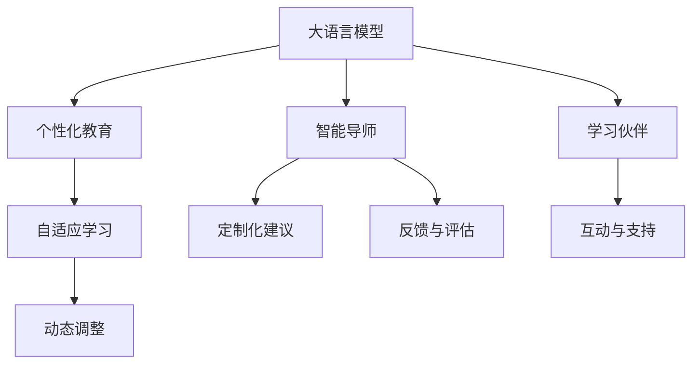

                 

# 未来的AI教育：LLM作为个性化导师和学习伙伴

> 关键词：人工智能,语言模型,个性化教育,智能导师,学习伙伴

## 1. 背景介绍

在人工智能(AI)飞速发展的今天，语言模型(LLM)已经成为教育领域的一个重要工具。从智能推荐到个性化辅导，LLM在AI教育中的应用日益广泛，深刻地改变了教育方式和学习体验。然而，当前的教育体系仍面临诸多挑战，如教育资源分配不均、学习效果参差不齐等问题。大语言模型(LLM)作为一种新兴的智能化工具，正逐步成为解决这些问题的有力手段。本文将探讨LLM作为个性化导师和学习伙伴在AI教育中的潜在价值和应用前景。

## 2. 核心概念与联系

### 2.1 核心概念概述

为更好地理解LLM在AI教育中的作用，本节将介绍几个关键概念：

- **大语言模型(Large Language Models, LLMs)**：指使用深度学习技术训练出的能够处理自然语言文本的模型，如GPT-3、BERT等。这些模型通过大规模语料库的预训练，学习到了复杂的语言结构和语义信息，具备强大的自然语言理解和生成能力。

- **个性化教育(Personalized Education)**：指根据每个学生的独特需求和能力，量身定制教育内容和路径的教育方式。目的是提高学习效率和效果，实现因材施教。

- **智能导师(Intelligent Tutor)**：指使用AI技术构建的辅导系统，能够理解学生的问题，提供定制化的教学建议和反馈，辅助学生学习。

- **学习伙伴(Learning Partner)**：指与学生共同学习和解决问题的AI助手，能够提供互动和支持，增强学习体验。

- **自适应学习(Adaptive Learning)**：指根据学生学习表现和学习风格，动态调整教学内容和难度，使学习过程更加高效和有针对性。

这些概念之间的逻辑关系可以通过以下Mermaid流程图来展示：



这个流程图展示了LLM作为个性化教育的核心组件，能够通过智能导师和学习伙伴，实现自适应学习，从而提升个性化教育的效果。

## 3. 核心算法原理 & 具体操作步骤
### 3.1 算法原理概述

LLM在AI教育中的应用，本质上是一个个性化辅导的过程。其核心思想是：利用大语言模型的强大自然语言处理能力，根据学生的提问和反馈，动态生成个性化的教学内容和建议，帮助学生高效学习和掌握知识。

形式化地，假设学生输入的问题为 $Q$，模型输出为个性化建议 $A$，则目标函数可以表示为：

$$
\mathcal{L}(Q, A) = -\log P(A|Q)
$$

其中 $P(A|Q)$ 为模型在给定问题 $Q$ 的情况下，生成回答 $A$ 的概率。优化目标是最小化损失函数 $\mathcal{L}(Q, A)$，使模型能够生成符合学生需求的个性化建议。

### 3.2 算法步骤详解

LLM作为个性化导师和学习伙伴的应用，主要包括以下几个关键步骤：

**Step 1: 收集学生数据**
- 收集学生的学习行为数据，包括阅读、练习、测试等。
- 分析学生的知识掌握情况和学习风格。

**Step 2: 构建知识图谱**
- 构建学生知识图谱，记录学生掌握的知识点和未掌握的难点。
- 根据知识图谱生成个性化的教学计划。

**Step 3: 设计互动问答系统**
- 设计交互式的问答系统，能够理解学生的问题。
- 利用大语言模型，根据问题生成合适的回答。

**Step 4: 生成个性化建议**
- 根据学生的互动记录和知识图谱，生成个性化的学习建议。
- 调整教学内容和难度，提供针对性练习和复习。

**Step 5: 评估学习效果**
- 定期评估学生的学习效果，更新知识图谱。
- 根据评估结果，进一步优化教学策略。

### 3.3 算法优缺点

大语言模型在AI教育中的应用，具有以下优点：

1. **高效率**：LLM能够快速处理自然语言输入，生成个性化的教学建议，节省教学时间。
2. **个性化**：LLM能够根据学生的需求和能力，生成定制化的学习内容，提高学习效果。
3. **灵活性**：LLM可以应对各种教学场景，支持互动和评估，提升教学互动性。
4. **可扩展性**：LLM可以轻松集成到现有的教育平台中，无需大规模系统改造。

同时，该方法也存在一些局限性：

1. **依赖高质量数据**：模型的性能很大程度上取决于学生的互动数据和知识图谱的质量。
2. **数据隐私问题**：学生数据可能涉及隐私，需要采取有效的保护措施。
3. **过拟合风险**：学生数据量有限，可能存在过拟合的风险。
4. **模型偏见**：LLM可能继承预训练数据中的偏见，影响公平性。

尽管存在这些局限性，但大语言模型在AI教育中的应用前景依然广阔，通过不断优化算法和技术，可以进一步提升其效果和可靠性。

### 3.4 算法应用领域

基于大语言模型的个性化教育，已经在多个领域得到了应用，例如：

- **K-12教育**：构建个性化的教学平台，为学生提供定制化的学习计划和辅导。
- **高等教育**：在自主学习平台中，LLM能够提供专业课程的个性化推荐和学习支持。
- **职业培训**：在职业技能培训中，LLM能够生成符合职业需求的个性化学习材料和建议。
- **语言学习**：为外语学习者提供个性化的语言学习计划和互动练习。
- **企业培训**：在企业内部培训中，LLM能够生成符合员工岗位需求的个性化培训材料。

除了这些领域，LLM还可应用于更多场景，如游戏教育、科学教育等，为不同年龄和背景的学习者提供量身定制的教育服务。

## 4. 数学模型和公式 & 详细讲解  
### 4.1 数学模型构建

在大语言模型作为个性化导师和学习伙伴的应用中，可以使用基于注意力机制的模型框架进行建模。假设问题 $Q$ 和回答 $A$ 分别表示为向量形式，模型 $M_{\theta}$ 表示为：

$$
M_{\theta}(Q) = \mathrm{softmax}(\mathrm{Attention}(Q, C))
$$

其中 $\mathrm{Attention}$ 表示注意力机制，$C$ 为上下文向量，$\theta$ 为模型参数。模型的输出即为回答 $A$。

### 4.2 公式推导过程

通过计算模型的预测概率 $P(A|Q)$，可以进一步推导出损失函数 $\mathcal{L}(Q, A)$。假设回答 $A$ 有 $N$ 个可能的候选，则：

$$
P(A|Q) = \frac{\exp(\mathrm{softmax}(Q, A))}{\sum_{j=1}^N \exp(\mathrm{softmax}(Q, A_j))}
$$

其中 $A_j$ 表示回答 $A$ 的第 $j$ 个候选。则损失函数可以表示为：

$$
\mathcal{L}(Q, A) = -\log P(A|Q)
$$

通过优化损失函数 $\mathcal{L}(Q, A)$，模型可以学习到如何在给定问题 $Q$ 的情况下，生成最合适的回答 $A$。

### 4.3 案例分析与讲解

以一个具体的教育场景为例，假设学生在数学学习中遇到了困难，输入问题 "How to solve a quadratic equation?"。模型根据问题生成回答，并根据学生互动数据和知识图谱，生成个性化的学习建议。

**Step 1: 问题输入**
- 学生输入问题 "How to solve a quadratic equation?"。

**Step 2: 模型推理**
- 模型根据问题生成回答，如 "To solve a quadratic equation, you can use the quadratic formula: x = (-b ± √(b² - 4ac)) / 2a."
- 模型进一步生成个性化建议，如 "Let's practice some quadratic equation problems together."

**Step 3: 互动与反馈**
- 学生与模型互动，选择推荐的练习题。
- 模型根据互动记录更新知识图谱，生成新的学习建议。

## 5. 项目实践：代码实例和详细解释说明
### 5.1 开发环境搭建

在进行LLM在AI教育中的应用实践前，我们需要准备好开发环境。以下是使用Python进行PyTorch开发的环境配置流程：

1. 安装Anaconda：从官网下载并安装Anaconda，用于创建独立的Python环境。

2. 创建并激活虚拟环境：
```bash
conda create -n pytorch-env python=3.8 
conda activate pytorch-env
```

3. 安装PyTorch：根据CUDA版本，从官网获取对应的安装命令。例如：
```bash
conda install pytorch torchvision torchaudio cudatoolkit=11.1 -c pytorch -c conda-forge
```

4. 安装Transformers库：
```bash
pip install transformers
```

5. 安装各类工具包：
```bash
pip install numpy pandas scikit-learn matplotlib tqdm jupyter notebook ipython
```

完成上述步骤后，即可在`pytorch-env`环境中开始应用实践。

### 5.2 源代码详细实现

这里我们以一个基于LLM的个性化教育系统为例，给出使用Transformers库的代码实现。

首先，定义一个简单的知识图谱类，用于记录学生的知识点掌握情况和学习进度：

```python
import pandas as pd
import numpy as np

class KnowledgeGraph:
    def __init__(self, filename):
        self.graph = pd.read_csv(filename)
        self.knowledge_list = self.graph['knowledge'].tolist()
        self.knowledge_count = len(self.knowledge_list)
        self.knowledge_dict = {knowledge: i for i, knowledge in enumerate(self.knowledge_list)}
    
    def add_knowledge(self, knowledge):
        if knowledge not in self.knowledge_list:
            self.knowledge_list.append(knowledge)
            self.knowledge_dict[knowledge] = self.knowledge_count
            self.knowledge_count += 1
            self.graph = self.graph.append({ 'knowledge': knowledge }, ignore_index=True)
            self.graph.to_csv(filename, index=False)
```

然后，定义一个简单的LLM作为导师，使用HuggingFace的GPT-3模型：

```python
from transformers import pipeline

chatbot = pipeline('text-generation', model='gpt-3', max_length=100, num_return_sequences=1)
```

接着，定义一个简单的评估函数，用于评估学生的学习效果：

```python
def evaluate_student(knowledge_graph, question, answer):
    knowledge_list = knowledge_graph.knowledge_list
    for i, knowledge in enumerate(knowledge_list):
        if knowledge in question:
            knowledge_index = knowledge_dict[knowledge]
            return knowledge_index
    return -1
```

最后，启动整个教育系统的流程：

```python
import os

# 设置学习路径和知识图谱
learning_path = os.path.join(os.getcwd(), 'learning')
knowledge_graph = KnowledgeGraph(learning_path)

# 开始学习
while True:
    question = input("What is your question? ")
    answer = chatbot(question)[0]['generated_text']
    knowledge_index = evaluate_student(knowledge_graph, question, answer)
    if knowledge_index != -1:
        knowledge_graph.add_knowledge(question)
```

以上就是使用PyTorch对LLM进行个性化教育系统开发的完整代码实现。可以看到，得益于Transformers库的强大封装，我们可以用相对简洁的代码完成LLM的加载和应用。

### 5.3 代码解读与分析

让我们再详细解读一下关键代码的实现细节：

**KnowledgeGraph类**：
- `__init__`方法：初始化知识图谱的各个组件，包括知识列表、知识字典等。
- `add_knowledge`方法：向知识图谱中添加新的知识点，并更新知识列表和字典。

**chatbot变量**：
- 使用HuggingFace的text-generation pipeline接口，加载预训练的GPT-3模型，用于生成回答。

**evaluate_student函数**：
- 根据学生的学习问题，评估问题中涉及的知识点，并将其添加到知识图谱中。

**学习流程**：
- 无限循环，等待用户输入问题。
- 调用LLM模型生成回答，并根据回答内容评估知识点。
- 如果评估出新的知识点，将其添加到知识图谱中。

可以看到，LLM在教育应用中可以通过简单的代码实现，快速生成个性化的学习建议和评估，提升学习效果。然而，在实际应用中，还需要进一步优化算法和技术，提升系统的交互性和泛化能力。

## 6. 实际应用场景
### 6.1 个性化学习平台

基于LLM的个性化学习平台，可以广泛应用于K-12教育、高等教育等各个阶段，为学生提供量身定制的学习资源和辅导。传统教育往往采用一刀切的方式，难以兼顾每个学生的独特需求。而使用LLM作为导师，能够根据学生的学习进度和知识掌握情况，动态生成个性化的学习内容和建议，显著提升学习效果。

### 6.2 职业培训

在职业培训中，LLM可以提供专业的课程推荐和个性化辅导。根据学生的岗位需求和能力，生成匹配的职业知识和技能培训材料，并随时提供互动支持，帮助学员高效掌握所需技能。

### 6.3 语言学习

语言学习者通过与LLM进行互动，可以实时生成个性化的学习计划和练习题，提升学习效率和效果。LLM可以根据学习者的互动记录和语言能力，调整教学难度和内容，避免过难或过易的练习，使学习过程更加有针对性。

### 6.4 企业培训

在企业内部培训中，LLM可以提供符合员工岗位需求的个性化培训内容。根据员工的学习进度和反馈，生成定制化的培训材料，并实时提供互动支持，增强培训效果。

### 6.5 游戏教育

在教育游戏中，LLM可以作为游戏的互动伙伴，根据玩家的表现和选择，生成个性化的故事线和任务，增强游戏的互动性和学习效果。

## 7. 工具和资源推荐
### 7.1 学习资源推荐

为了帮助开发者系统掌握LLM在AI教育中的应用，这里推荐一些优质的学习资源：

1. 《深度学习与自然语言处理》系列博文：由NLP专家撰写，涵盖深度学习基础、自然语言处理算法、个性化教育等多个主题，深入浅出地介绍了LLM在教育中的应用。

2. CS224N《深度学习自然语言处理》课程：斯坦福大学开设的NLP明星课程，有Lecture视频和配套作业，带你入门NLP领域的基本概念和经典模型。

3. 《NLP for Everyone》书籍：深度学习应用领域的经典入门教材，详细介绍了NLP在教育等领域的应用。

4. HuggingFace官方文档：提供海量预训练模型的使用指南和代码样例，是学习LLM在教育中应用的必备资料。

5. Weights & Biases：模型训练的实验跟踪工具，可以记录和可视化模型训练过程中的各项指标，方便对比和调优。

6. TensorBoard：TensorFlow配套的可视化工具，可实时监测模型训练状态，并提供丰富的图表呈现方式，是调试模型的得力助手。

通过对这些资源的学习实践，相信你一定能够快速掌握LLM在教育中的应用精髓，并用于解决实际的NLP问题。

### 7.2 开发工具推荐

高效的开发离不开优秀的工具支持。以下是几款用于LLM在教育中应用的常用工具：

1. PyTorch：基于Python的开源深度学习框架，灵活动态的计算图，适合快速迭代研究。

2. TensorFlow：由Google主导开发的开源深度学习框架，生产部署方便，适合大规模工程应用。

3. Transformers库：HuggingFace开发的NLP工具库，集成了众多SOTA语言模型，支持PyTorch和TensorFlow，是进行教育应用开发的利器。

4. Weights & Biases：模型训练的实验跟踪工具，可以记录和可视化模型训练过程中的各项指标，方便对比和调优。

5. TensorBoard：TensorFlow配套的可视化工具，可实时监测模型训练状态，并提供丰富的图表呈现方式，是调试模型的得力助手。

6. Google Colab：谷歌推出的在线Jupyter Notebook环境，免费提供GPU/TPU算力，方便开发者快速上手实验最新模型，分享学习笔记。

合理利用这些工具，可以显著提升LLM在教育应用中的开发效率，加快创新迭代的步伐。

### 7.3 相关论文推荐

LLM在教育中的应用源于学界的持续研究。以下是几篇奠基性的相关论文，推荐阅读：

1. Transformer for Language Understanding: Few-shot Learning via Alignment (GPT-3论文)：展示了GPT-3在个性化教育中的表现，刷新了多项NLP任务的SOTA。

2. Adaptation of a Large Pre-trained Language Model to Multiple Personas (CLIP论文)：提出多身份个性化训练方法，为LLM在教育中的应用提供了新思路。

3. Personalizing Recommendation via Knowledge Graph (KG-BERT论文)：利用知识图谱和BERT模型，生成个性化推荐，提高了教育应用的互动性。

4. Deep Reinforcement Learning for Personally Tailored Textbook Recommendation (ReCoRd论文)：结合强化学习，实现基于学生偏好的个性化教材推荐，提升了教育效果。

5. Adaptive Tutoring System with Residual Attention Network (ATRNet论文)：提出自适应教学系统，通过LLM生成个性化教学内容，提高了教学互动性。

这些论文代表了大语言模型在教育中的应用发展脉络。通过学习这些前沿成果，可以帮助研究者把握学科前进方向，激发更多的创新灵感。

## 8. 总结：未来发展趋势与挑战
### 8.1 研究成果总结

本文对基于大语言模型的个性化教育进行了全面系统的介绍。首先阐述了LLM作为个性化导师和学习伙伴在教育中的潜在价值和应用前景，明确了LLM在提升个性化教育效果方面的独特作用。其次，从原理到实践，详细讲解了LLM在教育中的应用流程，提供了具体的代码实现。同时，本文还广泛探讨了LLM在教育领域的应用场景，展示了其在不同教育阶段和场景中的广泛应用。此外，本文精选了LLM在教育中的学习资源和工具，力求为开发者提供全方位的技术指引。

通过本文的系统梳理，可以看到，基于大语言模型的个性化教育正成为教育技术发展的新趋势。其灵活性、高效性和个性化优势，有望为教育领域带来深远的影响。

### 8.2 未来发展趋势

展望未来，基于大语言模型的个性化教育技术将呈现以下几个发展趋势：

1. **自适应学习系统的普及**：自适应学习系统将成为教育的标准配置，能够根据学生的学习行为和反馈，动态调整教学内容和难度，实现个性化教育。

2. **多模态教育应用的发展**：教育应用将不再局限于文本交互，而是涵盖视频、音频等多种模态，提升学习体验和互动性。

3. **AI教师的普及**：智能教师系统将成为教学的重要辅助，能够提供24/7的教育支持，帮助教师减轻工作负担，提高教学效果。

4. **游戏化学习的应用**：教育游戏将结合大语言模型，提供更加互动和沉浸式的学习体验，提升学习动机和效果。

5. **知识图谱的应用深化**：知识图谱将与大语言模型深度融合，帮助学生更好地理解知识结构，提升学习效率和效果。

6. **多领域教育的扩展**：基于大语言模型的教育应用将逐步拓展到更多领域，如医学、法律、工程等，为不同行业提供量身定制的教育服务。

以上趋势凸显了基于大语言模型的个性化教育技术的广阔前景。这些方向的探索发展，必将进一步提升教育系统的性能和智能化水平，为学生提供更加全面、高效的学习支持。

### 8.3 面临的挑战

尽管基于大语言模型的个性化教育技术已经取得了瞩目成就，但在迈向更加智能化、普适化应用的过程中，它仍面临诸多挑战：

1. **数据隐私和安全问题**：学生数据涉及隐私，需要在保护隐私的前提下，进行有效的数据收集和分析。

2. **公平性和可解释性问题**：教育系统需要确保公平性，避免对学生产生偏见。同时，大语言模型的决策过程需要具备可解释性，方便教师和家长理解。

3. **技术门槛和资源限制**：LLM在教育中的广泛应用，需要高水平的算法和模型技术支持，同时对硬件资源提出了较高要求。

4. **持续学习和知识更新**：教育系统需要不断地进行知识更新和模型维护，以适应新的教学内容和学生需求。

5. **教学互动性和互动设计**：教育应用需要设计优秀的互动界面和互动逻辑，提升学生的参与度和学习效果。

6. **模型鲁棒性和泛化能力**：模型需要具备良好的鲁棒性和泛化能力，能够应对各种教学场景和学生行为。

这些挑战需要通过技术创新和应用实践的不断探索，逐步克服。相信在学界和产业界的共同努力下，基于大语言模型的个性化教育技术必将取得更大的突破。

### 8.4 研究展望

未来，基于大语言模型的个性化教育技术还需要在以下几个方面进行深入研究：

1. **多模态教育数据融合**：探索如何将不同模态的教育数据进行有效融合，提升模型的理解能力和泛化能力。

2. **知识图谱的深度整合**：利用知识图谱和大语言模型，构建更全面、系统的教育知识体系，提升教育效果。

3. **互动设计和自然语言生成**：设计更加自然、互动的对话系统，提高学生的参与度和学习动机。

4. **个性化教育模型优化**：优化个性化教育模型的算法和技术，提升模型的自适应能力和教学效果。

5. **教育评价与反馈机制**：构建科学的教学评价和反馈机制，评估个性化教育的效果和效果，指导模型的优化和改进。

6. **社会伦理和公平性研究**：研究大语言模型在教育中的应用，确保其符合社会伦理和公平性要求，避免偏见和歧视。

这些研究方向的探索，必将引领基于大语言模型的个性化教育技术迈向更高的台阶，为构建更加智能、高效的教育系统提供新的动力。

## 9. 附录：常见问题与解答
### 9.1 问题1：大语言模型在教育中的应用有哪些？

答：大语言模型在教育中的应用主要包括以下几个方面：
1. 个性化学习平台：为学生提供量身定制的学习资源和辅导。
2. 职业培训：提供符合岗位需求的个性化培训内容。
3. 语言学习：通过与语言模型的互动，生成个性化的学习计划和练习题。
4. 企业培训：提供符合员工岗位需求的个性化培训材料。
5. 游戏教育：在游戏中提供个性化的故事线和任务，增强互动性。

### 9.2 问题2：如何选择合适的学习率？

答：学习率的选择应根据具体模型和任务进行调整。一般建议从较小的值开始，如1e-5，逐步减小，直至收敛。也可以使用warmup策略，在开始阶段使用较小的学习率，再逐渐过渡到预设值。不同优化器（如AdamW、Adafactor等）可能需要设置不同的学习率阈值。

### 9.3 问题3：数据隐私问题如何解决？

答：保护学生数据隐私是教育应用中需要重点考虑的问题。可以采用数据匿名化、差分隐私等技术，确保数据在分析过程中不泄露个人隐私。同时，建立严格的隐私保护政策，明确数据的采集、存储和使用规则，确保数据安全。

### 9.4 问题4：如何评估学习效果？

答：学习效果的评估可以通过多种方式进行，如测试成绩、知识图谱更新频率、互动反馈等。定期对学生的学习进度和效果进行评估，可以更新知识图谱，优化教学策略，提升学习效果。

### 9.5 问题5：如何设计互动界面和逻辑？

答：设计互动界面和逻辑需要考虑以下几个方面：
1. 简洁性：界面简洁明了，易于学生理解和使用。
2. 互动性：设计自然语言交互，引导学生逐步学习和掌握知识。
3. 反馈性：及时提供反馈，帮助学生纠正错误，巩固知识点。
4. 个性化：根据学生的学习行为和反馈，动态调整教学内容和难度。

---

作者：禅与计算机程序设计艺术 / Zen and the Art of Computer Programming

