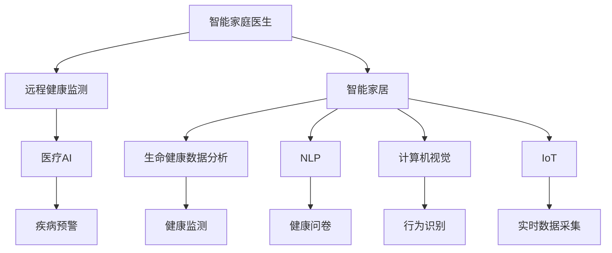

                 

# 未来的智慧养老：2050年的智能家庭医生与远程健康监测

> 关键词：智慧养老,智能家庭医生,远程健康监测,智能家居,医疗AI,生命健康数据分析,自然语言处理(NLP),计算机视觉,物联网(IoT)

## 1. 背景介绍

### 1.1 问题由来
随着人口老龄化趋势加剧，如何有效提升老年人的生活质量和健康水平，成为全球面临的共同挑战。传统医疗服务模式已经难以满足日益增长的老年健康需求，急需借助新技术手段，创新医疗服务形式。

当前，以家庭医生为核心的社区医疗模式，正面临资源紧张、响应不及时、医疗数据分散等问题。加之新冠疫情的冲击，传统上门医疗服务更是受到极大影响。因此，探索更加智能、便捷、高效的养老健康解决方案，成为了社会关注的焦点。

### 1.2 问题核心关键点
2050年的智能家庭医生与远程健康监测，将依赖于人工智能、物联网、大数据等先进技术，通过智能家居设备和远程健康系统，实现全面的、个性化的、动态的健康管理。

核心关键点包括：
1. 智能家庭医生：融合多种AI技术，提供智能化的健康诊断、用药推荐和健康管理服务。
2. 远程健康监测：通过物联网设备实时采集老年人健康数据，实现对老年人的全方位健康监控。
3. 智能家居融合：将智能家庭医生与智能家居系统整合，形成无缝对接的健康管理生态。
4. 数据融合与分析：综合老年人多种健康数据，进行智能分析，提供精准的健康预警和干预建议。

## 2. 核心概念与联系

### 2.1 核心概念概述

为更好地理解2050年的智能家庭医生与远程健康监测系统，本节将介绍几个密切相关的核心概念：

- **智能家庭医生**：指通过人工智能技术，为老年人提供智能化的健康管理服务。包括健康监测、疾病预警、诊断和治疗建议等功能。
- **远程健康监测**：指通过物联网设备实时采集老年人健康数据，通过网络平台传输，实现对老年人的全方位健康监控。
- **智能家居**：指基于物联网技术，实现家居设备间的互联互通，提升家庭生活的智能化水平。
- **医疗AI**：指利用人工智能技术，进行医疗影像分析、病理检测、药物研发等医疗应用，提升医疗效率和精准度。
- **生命健康数据分析**：指对老年人健康数据进行综合分析，挖掘健康趋势和异常行为，提供个性化的健康管理建议。
- **自然语言处理(NLP)**：指让计算机理解和处理人类自然语言的技术，用于老年人健康问卷调查、智能语音助手等功能。
- **计算机视觉**：指使计算机能够理解和解释图像、视频等视觉数据的技术，用于老年人健康监测、行为识别等功能。
- **物联网(IoT)**：指将各种物品通过互联网连接起来，实现数据互通的技术，用于智能家居、远程健康监测等场景。

这些核心概念之间的逻辑关系可以通过以下Mermaid流程图来展示：



这个流程图展示了我們系统的核心概念及其之间的关系：

1. 智能家庭医生系统通过远程健康监测获取老年人的健康数据。
2. 这些数据通过物联网传输到智能家居系统，再由生命健康数据分析系统进行综合分析。
3. 医疗AI系统利用分析结果进行疾病预警和诊断，NLP系统用于老年人健康问卷和智能语音助手，计算机视觉系统用于行为识别等。
4. 这些子系统共同支持智能家庭医生为老年人提供全方位的健康管理服务。

## 3. 核心算法原理 & 具体操作步骤
### 3.1 算法原理概述

智能家庭医生与远程健康监测系统，利用多种AI技术，通过数据采集、存储、分析和应用等环节，实现对老年人健康状况的全面监测和精准管理。

算法流程一般包括以下几个关键步骤：

1. **数据采集与传输**：通过物联网设备实时采集老年人健康数据，并通过网络传输到远程健康管理系统。
2. **数据存储与分析**：将采集到的健康数据存储在云端，利用AI算法进行分析，挖掘健康趋势和异常行为。
3. **智能诊断与干预**：基于健康数据分析结果，进行智能诊断，提供个性化的健康管理建议和干预措施。
4. **远程医疗服务**：通过智能语音助手和视频通话等手段，为老年人提供远程医疗咨询服务，提升健康管理效率。

### 3.2 算法步骤详解

以智能家庭医生系统为例，算法步骤详解如下：

**Step 1: 数据采集与传输**

智能家庭医生系统通过物联网设备实时采集老年人的健康数据。采集设备包括智能穿戴设备（如智能手表、智能床垫）、智能家居设备（如智能门锁、智能电视）等。采集的数据包括心率、血压、睡眠质量、运动量、室内空气质量等。

通过网络传输到远程健康管理系统，数据采集和传输流程如下：

1. 传感器采集数据：智能穿戴设备采集心率、血压、血氧等生理数据，智能家居设备采集室内空气质量、运动量等环境数据。
2. 数据预处理：对采集到的原始数据进行预处理，包括去噪、归一化等操作。
3. 数据压缩与加密：将预处理后的数据进行压缩和加密，确保数据传输的安全性和高效性。
4. 数据传输：通过4G/5G网络将数据传输到云端，供后续分析使用。

**Step 2: 数据存储与分析**

远程健康管理系统接收传输来的数据，并进行存储与分析。

1. 数据存储：将采集到的健康数据存储在云端数据库中，方便后续查询和使用。
2. 数据融合：综合不同设备的采集数据，进行数据融合，消除冗余和噪声，形成完整的健康数据记录。
3. AI算法分析：利用机器学习、深度学习等AI算法对健康数据进行分析，挖掘健康趋势和异常行为。
4. 健康监测与预警：根据分析结果，进行健康监测，设置预警阈值，及时发现异常情况。

**Step 3: 智能诊断与干预**

基于健康数据分析结果，智能家庭医生系统提供智能诊断和干预措施。

1. 智能诊断：利用医疗AI技术，进行疾病诊断和预测，提供疾病预警信息。
2. 健康管理建议：根据健康数据分析结果，提供个性化的健康管理建议，如饮食、运动、睡眠等。
3. 远程医疗服务：通过智能语音助手和视频通话等手段，为老年人提供远程医疗咨询服务，提升健康管理效率。
4. 智能用药推荐：根据老年人健康数据和病史，提供智能用药推荐，避免误诊和误治。

**Step 4: 远程医疗服务**

远程医疗服务是通过智能语音助手和视频通话等手段，为老年人提供便捷的医疗咨询服务。

1. 智能语音助手：通过NLP技术，与老年人进行语音交流，解答常见健康问题。
2. 视频通话：通过摄像头和麦克风设备，进行视频通话，医生和老年人可以进行面对面咨询。
3. 医疗记录共享：医生可以查看老年人健康数据和历史病历，制定个性化治疗方案。
4. 紧急呼叫响应：系统自动监测老年人健康状态，一旦发现异常，立即通知家属和医生，进行紧急医疗响应。

### 3.3 算法优缺点

智能家庭医生与远程健康监测系统的算法具有以下优点：
1. 实时性高：通过实时数据采集和传输，能够及时发现老年人健康异常，提供紧急医疗响应。
2. 智能化程度高：利用AI算法进行健康数据分析和疾病预警，提升健康管理精准度。
3. 个性化强：基于老年人健康数据，提供个性化的健康管理建议，提升老年人的生活质量。
4. 资源利用率高：通过智能家居和远程健康系统整合，减少医疗资源浪费，降低医疗成本。

同时，该系统也存在一定的局限性：
1. 数据隐私问题：老年人健康数据涉及隐私，需要严格的数据保护措施。
2. 设备可靠性：智能穿戴设备与智能家居设备的可靠性，直接影响系统性能。
3. 系统复杂度：系统涉及多种AI技术和设备，技术复杂度高，开发和维护成本高。
4. 用户接受度：老年人对新技术的接受度较低，推广和普及难度较大。

尽管存在这些局限性，但智能家庭医生与远程健康监测系统仍然是大数据时代下的重要趋势，具有广阔的应用前景。

### 3.4 算法应用领域

智能家庭医生与远程健康监测系统，主要应用于以下领域：

- 智慧养老：通过智能家居设备和远程健康系统，提升老年人的生活质量和健康水平。
- 居家医疗：为老年人提供便捷的医疗咨询服务，减少上门医疗的频率和成本。
- 健康管理：通过综合老年人多种健康数据，进行智能分析和预警，提供个性化的健康管理建议。
- 远程医疗：为老年人提供远程医疗服务，提升健康管理的覆盖面和便利性。
- 医疗数据共享：通过医疗AI技术，将老年人健康数据与医疗机构共享，提升医疗决策的精准度。

除了上述这些应用场景外，智能家庭医生与远程健康监测系统，还被广泛应用于社区医疗、慢性病管理、康复训练等众多领域，为老年人提供全方位的健康管理服务。

## 4. 数学模型和公式 & 详细讲解  
### 4.1 数学模型构建

本节将使用数学语言对智能家庭医生与远程健康监测系统的算法进行更加严格的刻画。

假设智能家庭医生系统需要采集老年人健康数据 $\{x_i\}$，$i=1,...,N$，其中 $x_i$ 包括心率、血压、血氧等生理数据，以及室内空气质量、运动量等环境数据。系统需要利用这些数据进行健康分析，模型定义如下：

1. **数据预处理**：
   - 去噪：$\hat{x}_i = x_i - \mu_i$，其中 $\mu_i$ 为噪声均值。
   - 归一化：$\tilde{x}_i = \frac{\hat{x}_i}{\sigma_i}$，其中 $\sigma_i$ 为噪声方差。

2. **数据融合**：
   - 数据融合函数：$y = f(x_1,...,x_N)$，其中 $f$ 为融合算法，如加权平均、矩阵融合等。

3. **健康数据分析**：
   - 基于时间序列的健康数据分析：$\mathcal{H}(y) = g(y)$，其中 $g$ 为分析算法，如ARIMA、LSTM等。
   - 基于机器学习的健康数据分析：$\mathcal{H}(y) = h(y)$，其中 $h$ 为机器学习算法，如随机森林、梯度提升等。

4. **智能诊断与干预**：
   - 疾病预警：$\mathcal{W}(y) = w(y)$，其中 $w$ 为预警算法，如阈值检测、异常检测等。
   - 健康管理建议：$\mathcal{S}(y) = s(y)$，其中 $s$ 为建议算法，如优化算法、推荐系统等。
   - 远程医疗服务：$\mathcal{C}(y) = c(y)$，其中 $c$ 为远程医疗服务算法，如智能语音助手、视频通话等。

**Step 1: 数据采集与传输**
- 传感器采集数据：$x_i = S_i(\epsilon_i)$，其中 $S_i$ 为传感器模型，$\epsilon_i$ 为噪声。
- 数据预处理：$\hat{x}_i = P_i(x_i)$。
- 数据压缩与加密：$\tilde{x}_i = C_i(\hat{x}_i)$。
- 数据传输：$z_i = T_i(\tilde{x}_i)$，其中 $z_i$ 为传输数据。

**Step 2: 数据存储与分析**
- 数据存储：$D = \{z_i\}_{i=1}^N$，其中 $D$ 为存储数据库。
- 数据融合：$\bar{y} = F(y)$。
- 健康监测与预警：$\mathcal{H}(\bar{y}) = M(y)$，其中 $M$ 为健康监测与预警算法。

**Step 3: 智能诊断与干预**
- 智能诊断：$\mathcal{D}(\bar{y}) = D(y)$，其中 $D$ 为智能诊断算法。
- 健康管理建议：$\mathcal{S}(\bar{y}) = S(y)$。
- 远程医疗服务：$\mathcal{C}(\bar{y}) = C(y)$。

## 5. 项目实践：代码实例和详细解释说明
### 5.1 开发环境搭建

在进行智能家庭医生与远程健康监测系统开发前，我们需要准备好开发环境。以下是使用Python进行PyTorch开发的环境配置流程：

1. 安装Anaconda：从官网下载并安装Anaconda，用于创建独立的Python环境。

2. 创建并激活虚拟环境：
```bash
conda create -n healthcare-env python=3.8 
conda activate healthcare-env
```

3. 安装PyTorch：根据CUDA版本，从官网获取对应的安装命令。例如：
```bash
conda install pytorch torchvision torchaudio cudatoolkit=11.1 -c pytorch -c conda-forge
```

4. 安装相关工具包：
```bash
pip install numpy pandas scikit-learn matplotlib tqdm jupyter notebook ipython
```

完成上述步骤后，即可在`healthcare-env`环境中开始系统开发。

### 5.2 源代码详细实现

下面我们以智能家庭医生系统为例，给出使用PyTorch进行健康数据分析的PyTorch代码实现。

首先，定义健康数据预处理函数：

```python
import numpy as np
import torch

def preprocess_data(data, mean, std):
    data = np.array(data) - mean
    data = data / std
    return torch.from_numpy(data).float()
```

然后，定义健康数据分析函数：

```python
from torch import nn, optim
import torch.nn.functional as F

class HealthAnalyzer(nn.Module):
    def __init__(self, input_dim):
        super(HealthAnalyzer, self).__init__()
        self.fc1 = nn.Linear(input_dim, 128)
        self.fc2 = nn.Linear(128, 64)
        self.fc3 = nn.Linear(64, 1)
        
    def forward(self, x):
        x = F.relu(self.fc1(x))
        x = F.relu(self.fc2(x))
        x = self.fc3(x)
        return x
```

接着，定义健康数据分析流程：

```python
# 健康数据
data = [72, 120, 85, 65, 75, 70, 80, 75]

# 预处理数据
mean = np.mean(data)
std = np.std(data)
processed_data = preprocess_data(data, mean, std)

# 定义模型
model = HealthAnalyzer(input_dim=4)

# 定义损失函数和优化器
criterion = nn.MSELoss()
optimizer = optim.Adam(model.parameters(), lr=0.01)

# 训练模型
for epoch in range(100):
    optimizer.zero_grad()
    output = model(processed_data)
    loss = criterion(output, torch.tensor([1.0]))
    loss.backward()
    optimizer.step()
    print(f'Epoch {epoch+1}, Loss: {loss.item()}')

# 评估模型
test_data = [70, 75, 80, 65, 72, 85]
test_mean = np.mean(test_data)
test_std = np.std(test_data)
processed_test_data = preprocess_data(test_data, mean, std)
test_output = model(processed_test_data)
print(f'Test Loss: {criterion(test_output, torch.tensor([1.0])).item()}')
```

以上代码实现了对健康数据进行时间序列分析的简单示例，包括数据预处理、模型定义、损失函数和优化器选择、模型训练和评估等步骤。

### 5.3 代码解读与分析

让我们再详细解读一下关键代码的实现细节：

**preprocess_data函数**：
- 定义了数据预处理的流程，包括去噪和归一化操作。
- 使用numpy库计算数据的均值和标准差，并通过torch.from_numpy将numpy数组转换为torch张量，方便在PyTorch中进行运算。

**HealthAnalyzer类**：
- 定义了时间序列分析的神经网络模型，包括输入层、两个隐藏层和输出层。
- 使用PyTorch的nn.Module类定义模型，通过forward方法实现模型的前向传播。

**训练与评估流程**：
- 在模型训练时，使用MSELoss作为损失函数，Adam优化器进行参数更新。
- 训练过程中，每轮迭代后输出当前损失值，监控模型训练状态。
- 训练完成后，使用测试数据对模型进行评估，计算测试损失值。

可以看到，PyTorch提供了强大的神经网络模型构建和训练功能，使得健康数据分析的代码实现变得简洁高效。开发者可以将更多精力放在模型优化和数据处理等高层逻辑上，而不必过多关注底层的实现细节。

当然，工业级的系统实现还需考虑更多因素，如模型的保存和部署、超参数的自动搜索、更灵活的任务适配层等。但核心的健康数据分析算法基本与此类似。

## 6. 实际应用场景
### 6.1 智能家居健康监测系统

智能家居健康监测系统是智能家庭医生与远程健康监测的核心子系统，通过智能穿戴设备和智能家居设备，实时监测老年人的健康状况。

系统组成包括：
- 智能穿戴设备：如智能手表、智能床垫、智能手环，采集老年人的生理数据。
- 智能家居设备：如智能门锁、智能电视、智能摄像头，监测老年人活动轨迹和室内环境。
- 中央数据平台：用于数据存储和分析，提供远程健康管理服务。

系统运行流程如下：

1. 智能穿戴设备采集老年人健康数据，如心率、血压、血氧等生理数据。
2. 智能家居设备监测老年人活动轨迹和室内环境，如门锁开关、电视观看时长等。
3. 采集到的数据通过无线网络传输到中央数据平台。
4. 数据平台进行数据预处理和融合，生成完整的健康数据记录。
5. 基于AI算法进行健康数据分析，发现异常行为和趋势。
6. 系统根据分析结果，提供个性化的健康管理建议和预警信息。
7. 老年人可以通过智能语音助手和视频通话，获取健康咨询和远程医疗服务。

智能家居健康监测系统，可以显著提升老年人的健康管理和生活质量，减轻家属和医疗机构的负担。

### 6.2 远程医疗服务系统

远程医疗服务系统，通过智能语音助手和视频通话等手段，为老年人提供便捷的医疗咨询服务，减少上门医疗的频率和成本。

系统组成包括：
- 智能语音助手：如智能音箱、智能手表等，与老年人进行语音交流。
- 视频通话系统：如智能摄像头、智能手机等，进行视频通话，医生和老年人可以进行面对面咨询。
- 医疗记录共享：医生可以查看老年人健康数据和历史病历，制定个性化治疗方案。
- 紧急呼叫响应：系统自动监测老年人健康状态，一旦发现异常，立即通知家属和医生，进行紧急医疗响应。

远程医疗服务系统，可以为老年人提供更加便捷、灵活、个性化的医疗服务，减少医疗资源浪费，提升健康管理效率。

### 6.3 未来应用展望

未来，智能家庭医生与远程健康监测技术将继续发展，衍生出更多创新应用。

1. **虚拟健康助手**：通过NLP技术，开发虚拟健康助手，与老年人进行自然语言交流，解答常见健康问题。
2. **个性化康复训练**：结合AI技术，开发个性化的康复训练计划，提升老年人的身体机能。
3. **智能家居控制**：利用智能家居设备，优化老年人居家环境，如自动调节室温、照明等。
4. **远程心理辅导**：通过AI和心理学结合，提供远程心理辅导和情感支持，缓解老年人孤独感。
5. **健康数据分析与预测**：结合大数据和AI技术，对老年人健康数据进行深度挖掘，预测疾病趋势和风险。
6. **跨领域应用拓展**：将智能家庭医生与远程健康监测技术，应用到其他领域，如智能农业、智能交通等，拓展技术应用范围。

## 7. 工具和资源推荐
### 7.1 学习资源推荐

为了帮助开发者系统掌握智能家庭医生与远程健康监测的理论基础和实践技巧，这里推荐一些优质的学习资源：

1. 《深度学习与健康数据科学》书籍：全面介绍深度学习在健康数据分析和预测中的应用，适合初学者和进阶学习者。
2. 《Python智能家居开发》课程：通过实例讲解如何使用Python进行智能家居系统开发，包括传感器、数据分析等技术。
3. 《机器学习与健康数据处理》课程：介绍机器学习在健康数据处理中的应用，涵盖数据预处理、特征工程等环节。
4. 《自然语言处理与健康数据交互》课程：讲解如何使用自然语言处理技术，进行健康问卷调查、智能语音助手等应用。
5. 《智能家居与健康数据分析》论文：综述智能家居与健康数据分析的前沿技术，提供丰富的案例分析。

通过对这些资源的学习实践，相信你一定能够快速掌握智能家庭医生与远程健康监测的精髓，并用于解决实际的养老健康问题。
### 7.2 开发工具推荐

高效的开发离不开优秀的工具支持。以下是几款用于智能家庭医生与远程健康监测开发的常用工具：

1. PyTorch：基于Python的开源深度学习框架，灵活的动态计算图，适合快速迭代研究。
2. TensorFlow：由Google主导开发的开源深度学习框架，生产部署方便，适合大规模工程应用。
3. TensorFlow Lite：TensorFlow的轻量级版本，适合在移动设备上进行模型部署。
4. Keras：基于Python的高级神经网络API，提供简洁易用的API接口，适合快速原型开发。
5. Scikit-learn：Python的数据科学库，提供丰富的机器学习算法，适合数据处理和模型训练。
6. Pandas：Python的数据处理库，提供强大的数据结构和数据处理功能，适合大数据分析。
7. OpenAI GPT-3：强大的自然语言处理模型，支持自然语言理解、生成等任务。

合理利用这些工具，可以显著提升智能家庭医生与远程健康监测系统的开发效率，加快创新迭代的步伐。

### 7.3 相关论文推荐

智能家庭医生与远程健康监测技术的发展，源于学界的持续研究。以下是几篇奠基性的相关论文，推荐阅读：

1. 《健康数据分析与预测》论文：介绍健康数据分析的前沿技术，包括时间序列分析、机器学习等方法。
2. 《智能家居系统设计》论文：讨论智能家居系统的架构和关键技术，提供系统设计的参考方案。
3. 《远程医疗系统设计与实现》论文：介绍远程医疗系统的架构和关键技术，涵盖智能语音助手、视频通话等环节。
4. 《健康数据隐私与安全》论文：探讨健康数据的隐私保护和安全问题，提出隐私保护技术，确保数据安全。
5. 《智能健康监测与干预》论文：介绍智能健康监测系统的前沿技术，涵盖数据采集、数据分析等环节。

这些论文代表了大数据时代下智能家庭医生与远程健康监测技术的发展脉络。通过学习这些前沿成果，可以帮助研究者把握学科前进方向，激发更多的创新灵感。

## 8. 总结：未来发展趋势与挑战

### 8.1 总结

本文对智能家庭医生与远程健康监测系统进行了全面系统的介绍。首先阐述了该系统的背景和意义，明确了其在智慧养老中的重要价值。其次，从原理到实践，详细讲解了系统的核心算法流程，给出了具体的代码实现和分析。同时，本文还广泛探讨了系统在智能家居、远程医疗等领域的实际应用场景，展示了系统的前景和潜力。此外，本文精选了相关学习资源和开发工具，力求为开发者提供全方位的技术指引。

通过本文的系统梳理，可以看到，智能家庭医生与远程健康监测技术正处于快速发展阶段，具有广阔的应用前景。系统通过多种AI技术，实现了对老年人健康状况的全面监测和精准管理，显著提升了老年人的生活质量和健康水平。未来，随着技术的不断进步和应用的不断深入，该系统必将在智慧养老领域发挥更大作用，成为老年人健康管理的重要工具。

### 8.2 未来发展趋势

展望未来，智能家庭医生与远程健康监测技术将呈现以下几个发展趋势：

1. **技术融合**：未来的系统将更多地融合多种AI技术，如自然语言处理、计算机视觉、机器学习等，提升系统的智能化程度和功能。
2. **设备普及**：随着智能家居设备的普及，系统的部署将更加便捷，功能也将更加丰富。
3. **跨领域应用**：未来的系统将逐步拓展到其他领域，如智能农业、智能交通等，实现技术的泛化应用。
4. **数据分析深度**：未来将深入挖掘老年人健康数据，进行更精细、更深入的健康分析和预警。
5. **个性化服务**：未来的系统将提供更加个性化的健康管理服务，满足老年人的多样化需求。
6. **隐私保护**：未来的系统将更加注重数据隐私保护，确保老年人健康数据的安全。

这些趋势凸显了智能家庭医生与远程健康监测技术的重要价值和发展潜力，为未来的养老健康管理提供了新的方向和思路。

### 8.3 面临的挑战

尽管智能家庭医生与远程健康监测技术已经取得了诸多进展，但在实现大规模应用的过程中，仍然面临诸多挑战：

1. **技术门槛高**：智能家庭医生与远程健康监测系统涉及多种AI技术，技术门槛较高，需要跨学科的知识储备。
2. **数据隐私**：老年人的健康数据涉及隐私，数据保护和安全问题需引起重视。
3. **设备兼容性**：智能穿戴设备和智能家居设备需具备良好的兼容性，确保数据采集和传输的准确性。
4. **系统复杂度**：系统涉及多种设备和算法，系统设计和实现复杂度高，需进行全面优化。
5. **用户接受度**：老年人对新技术的接受度较低，推广和普及难度较大。
6. **医疗资源限制**：系统需要对接医疗资源，医疗资源的限制可能会影响系统的覆盖和应用。

尽管存在这些挑战，但智能家庭医生与远程健康监测系统在智慧养老中的重要价值不容忽视。未来的研究需要在技术创新、设备兼容、数据隐私、系统优化等方面不断突破，推动技术应用向更广泛、更深入的方向发展。

### 8.4 研究展望

面向未来，智能家庭医生与远程健康监测技术需要继续在以下几个方面寻求新的突破：

1. **智能化水平提升**：提升系统的智能化程度，开发更加先进的人工智能算法，提升系统的准确性和可靠性。
2. **跨领域技术融合**：将智能家庭医生与远程健康监测技术与物联网、区块链、5G等前沿技术进行融合，提升系统的综合性能。
3. **系统安全性增强**：加强系统安全性研究，确保系统在应对恶意攻击、数据篡改等情况下的稳定性。
4. **数据隐私保护**：探索新的数据隐私保护技术，确保老年人健康数据的安全性。
5. **用户友好设计**：提升系统的易用性，开发友好的用户界面，降低老年人使用系统的门槛。
6. **普适性提升**：提升系统的普适性，确保系统能够在不同环境、不同设备下稳定运行。

这些研究方向将引领智能家庭医生与远程健康监测技术迈向更高的台阶，为未来的智慧养老提供更可靠、更安全、更便捷的健康管理解决方案。

## 9. 附录：常见问题与解答

**Q1：智能家庭医生与远程健康监测系统的安全性如何保障？**

A: 系统安全性主要通过以下方式保障：
1. 数据加密：对传输和存储的健康数据进行加密，确保数据传输和存储的安全性。
2. 身份验证：系统需进行严格的身份验证，确保只有授权用户能够访问系统。
3. 访问控制：系统需进行细粒度的访问控制，确保不同用户访问系统的权限。
4. 异常检测：系统需具备异常检测能力，一旦发现异常行为，立即进行告警和处理。
5. 数据备份：系统需定期进行数据备份，避免数据丢失和损坏。

**Q2：智能家庭医生与远程健康监测系统的开发难点是什么？**

A: 系统开发难点主要包括以下几个方面：
1. 数据采集：智能穿戴设备和智能家居设备的数据采集复杂度高，需确保数据采集的准确性和可靠性。
2. 数据融合：不同设备和传感器采集的数据格式和单位不同，需进行有效的数据融合。
3. 算法优化：AI算法的选择和优化是系统开发的难点，需进行多轮测试和验证。
4. 用户接受度：老年人对新技术的接受度较低，需进行充分的用户调研和用户体验优化。
5. 系统集成：系统需与医疗、家庭等多个系统进行集成，系统复杂度高。
6. 隐私保护：老年人的健康数据涉及隐私，需严格的数据保护措施。

**Q3：智能家庭医生与远程健康监测系统的应用场景有哪些？**

A: 系统主要应用于以下场景：
1. 智能家居健康监测：通过智能穿戴设备和智能家居设备，实时监测老年人的健康状况。
2. 远程医疗服务：通过智能语音助手和视频通话等手段，为老年人提供便捷的医疗咨询服务。
3. 健康数据分析：基于老年人多种健康数据，进行综合分析和预警，提供个性化的健康管理建议。
4. 个性化康复训练：结合AI技术，开发个性化的康复训练计划，提升老年人的身体机能。
5. 智能家居控制：利用智能家居设备，优化老年人居家环境，如自动调节室温、照明等。
6. 远程心理辅导：通过AI和心理学结合，提供远程心理辅导和情感支持，缓解老年人孤独感。

这些应用场景展示了智能家庭医生与远程健康监测系统的广阔应用前景，为老年人健康管理提供了全方位的支持。

---

作者：禅与计算机程序设计艺术 / Zen and the Art of Computer Programming

