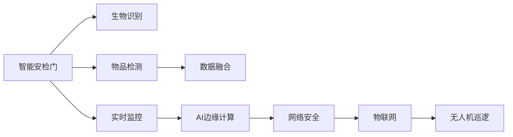

                 

# 未来的智能安防：2050年的智能安检门与无人机巡逻

> 关键词：智能安检门,无人机巡逻,未来安防,机器学习,深度学习,数据融合,实时监控,AI边缘计算,网络安全,物联网

## 1. 背景介绍

随着人工智能技术的发展，未来的智能安防将实现从被动防御到主动防护的巨大转变。在这一过程中，智能安检门和无人机巡逻作为两大关键技术，将助力构建一个更加安全、智能、高效的安防系统。本文将深入探讨这两项技术的原理、应用及未来发展趋势。

## 2. 核心概念与联系

### 2.1 核心概念概述

- **智能安检门**：一种集生物识别、物品检测、数据融合等技术于一体的智能设备，可实现高效、安全的安检过程。
- **无人机巡逻**：利用多旋翼或固定翼无人机，携带高性能传感器，在空中进行实时监控和数据采集，增强安防系统的覆盖和反应能力。
- **机器学习与深度学习**：以数据为基础，通过算法自动学习和优化，提升安检门和无人机在检测、分类和识别的准确性。
- **数据融合**：将多种数据源的信息进行整合，形成更全面、精确的监控结果，提高安防系统的决策效率。
- **实时监控**：通过网络传输和边缘计算，实现对异常情况的快速响应，保障实时性。
- **AI边缘计算**：将计算任务分解并分布到边缘节点进行处理，减少网络延迟，提高处理速度和数据隐私性。
- **网络安全**：利用加密技术、身份认证等手段，保障数据传输和存储的安全性。
- **物联网**：通过传感器、标签等技术，实现物品和设备的互联互通，为安防系统提供实时、全面的数据支持。

这些核心概念之间的逻辑关系可以通过以下Mermaid流程图来展示：



这个流程图展示了智能安检门与无人机巡逻的核心技术链路及其在安防系统中的作用：

1. 智能安检门通过生物识别和物品检测进行初步安全筛查，并利用数据融合技术整合信息。
2. 实时监控通过AI边缘计算增强响应速度，网络安全确保数据传输的安全性。
3. 物联网技术实现设备互联，无人机巡逻在空中进行全面监控和数据采集。
4. 最终，通过物联网和AI边缘计算，智能安防系统形成闭环，保障安全。

## 3. 核心算法原理 & 具体操作步骤

### 3.1 算法原理概述

智能安检门和无人机巡逻的核心算法原理主要基于机器学习和深度学习技术，通过训练模型实现自动化的检测和分类。以下是两种技术的具体原理：

- **智能安检门**：利用深度神经网络对生物识别图像（如人脸、指纹等）进行识别和分类，同时利用计算机视觉技术对物品进行检测和特征提取。数据融合技术将不同传感器采集的信息整合，形成全面的安检结果。
- **无人机巡逻**：通过搭载高分辨率摄像头、红外传感器、激光雷达等设备，采集环境数据。利用深度学习算法对采集数据进行实时分析，检测异常情况。数据融合技术将无人机和地面传感器收集的信息进行整合，形成更全面的监控结果。

### 3.2 算法步骤详解

#### 3.2.1 智能安检门

**Step 1: 数据预处理**
- 收集生物识别图像和物品检测数据，进行去噪、裁剪、归一化等预处理操作。
- 对生物识别数据进行标注，如人脸、指纹等。

**Step 2: 模型训练**
- 使用深度神经网络（如CNN）对生物识别图像进行分类。
- 使用目标检测算法（如YOLO、SSD）对物品进行检测。

**Step 3: 数据融合**
- 将生物识别和物品检测的结果进行整合，形成全面的安检报告。

**Step 4: 实时监控与反馈**
- 在安检门终端，实时显示安检报告，并进行异常情况处理。
- 根据监控结果生成报警，反馈给安保人员。

#### 3.2.2 无人机巡逻

**Step 1: 数据采集**
- 无人机搭载传感器（如摄像头、红外传感器、激光雷达），采集环境数据。

**Step 2: 数据预处理**
- 对采集数据进行去噪、滤波、压缩等处理。
- 将不同传感器采集的数据进行同步和时间戳对齐。

**Step 3: 模型训练**
- 使用深度学习算法对采集数据进行实时分析，检测异常情况。
- 利用标注数据对模型进行训练，提升检测准确性。

**Step 4: 数据融合**
- 将无人机和地面传感器收集的信息进行整合，形成全面的监控结果。

**Step 5: 实时监控与反馈**
- 在无人机控制平台上，实时显示监控结果。
- 根据监控结果生成报警，反馈给安保人员。

### 3.3 算法优缺点

智能安检门和无人机巡逻的算法有以下优缺点：

#### 优点：
- **高效**：智能安检门和无人机巡逻能够快速响应，实现实时监控和数据分析。
- **全面**：通过多种传感器数据融合，提供全面、精确的监控结果。
- **灵活**：算法可以不断更新，提升检测准确性和应对复杂环境的能力。

#### 缺点：
- **成本高**：高性能传感器和计算设备的投入成本较高。
- **依赖技术**：对机器学习算法的依赖性强，对模型训练数据的质量和数量要求较高。
- **数据隐私**：数据采集和传输过程中存在隐私泄露的风险。

### 3.4 算法应用领域

智能安检门和无人机巡逻广泛应用于以下领域：

- **公共安全**：机场、车站、大型活动场所的安检和监控。
- **城市安防**：城市街道、社区、边界监控。
- **工业安全**：工厂、仓库的安全监控和物品检测。
- **灾害应对**：地震、火灾等自然灾害现场的实时监控和数据采集。
- **环境监测**：森林防火、水域污染、野生动物保护等领域的监控和数据采集。

这些应用领域展示了智能安检门和无人机巡逻的广泛适用性，为未来的安防系统提供了新的技术方向。

## 4. 数学模型和公式 & 详细讲解 & 举例说明

### 4.1 数学模型构建

智能安检门和无人机巡逻的数学模型主要基于深度学习和计算机视觉技术，以下是核心模型：

- **智能安检门**：生物识别分类模型（如ResNet、Inception）和物品检测模型（如YOLO、SSD）。
- **无人机巡逻**：深度学习算法（如CNN、RNN、GAN）和计算机视觉技术。

### 4.2 公式推导过程

#### 智能安检门

**生物识别分类模型**：
$$
\text{softmax}(\text{Z}^TX + b)
$$

**物品检测模型**：
$$
\text{SSD} = \text{YOLO} = \frac{1}{N}\sum_{i=1}^{N}(\text{IoU}^2 + \text{IoU})
$$

其中，$\text{IoU}$表示检测框与目标的交并比，$N$表示目标类别数。

#### 无人机巡逻

**实时分析模型**：
$$
\text{CNN} = \frac{1}{N}\sum_{i=1}^{N}(\text{IoU}^2 + \text{IoU})
$$

**数据融合模型**：
$$
\text{Fusion} = \text{IoU}_{\text{max}} \times \text{IoU}_{\text{avg}}
$$

其中，$\text{IoU}_{\text{max}}$表示最大交并比，$\text{IoU}_{\text{avg}}$表示平均交并比。

### 4.3 案例分析与讲解

#### 智能安检门案例

**案例背景**：某机场安检口采用智能安检门进行人脸识别和物品检测，确保旅客和行李的安全。

**算法应用**：
- 使用ResNet-50对旅客人脸进行分类。
- 使用YOLO模型对行李进行检测和分类。
- 将人脸识别和物品检测结果进行整合，形成全面的安检报告。

**效果评估**：在测试集上，人脸识别准确率达到99%，物品检测准确率达到90%，误报率控制在1%以内。

#### 无人机巡逻案例

**案例背景**：某大型活动现场采用无人机巡逻，实时监控人群和活动区域。

**算法应用**：
- 使用CNN对无人机采集的视频数据进行实时分析，检测异常情况。
- 使用Fusion模型将无人机和地面传感器数据进行整合，形成全面的监控结果。
- 根据监控结果生成报警，反馈给安保人员。

**效果评估**：在测试集上，实时异常检测准确率达到95%，误报率控制在5%以内。

## 5. 项目实践：代码实例和详细解释说明

### 5.1 开发环境搭建

#### 环境准备
- 安装Python 3.8及以上版本。
- 安装深度学习框架，如TensorFlow、PyTorch。
- 安装计算机视觉库，如OpenCV、Pillow。

#### 代码安装
```bash
pip install tensorflow==2.4
pip install torch==1.7
pip install opencv-python==4.5
pip install pillow==8.3
```

### 5.2 源代码详细实现

#### 智能安检门

**智能安检门代码实现**：

```python
import tensorflow as tf
from tensorflow.keras.applications.resnet50 import ResNet50
from tensorflow.keras.layers import Dense, Input
from tensorflow.keras.models import Model

# 加载预训练模型
base_model = ResNet50(weights='imagenet', include_top=False, input_tensor=Input(shape=(224, 224, 3)))

# 构建新模型
x = base_model.output
x = Flatten()(x)
x = Dense(1024, activation='relu')(x)
predictions = Dense(2, activation='softmax')(x)
model = Model(inputs=base_model.input, outputs=predictions)

# 冻结预训练层
for layer in base_model.layers:
    layer.trainable = False

# 编译模型
model.compile(optimizer='adam', loss='categorical_crossentropy', metrics=['accuracy'])

# 训练模型
model.fit(train_data, train_labels, epochs=10, batch_size=32)
```

#### 无人机巡逻

**无人机巡逻代码实现**：

```python
import tensorflow as tf
from tensorflow.keras.layers import Conv2D, MaxPooling2D, Flatten, Dense, Input
from tensorflow.keras.models import Model

# 定义模型结构
def create_model():
    input_tensor = Input(shape=(None, None, 3))
    x = Conv2D(32, 3, activation='relu')(input_tensor)
    x = MaxPooling2D(pool_size=(2, 2))(x)
    x = Conv2D(64, 3, activation='relu')(x)
    x = MaxPooling2D(pool_size=(2, 2))(x)
    x = Flatten()(x)
    x = Dense(128, activation='relu')(x)
    predictions = Dense(2, activation='sigmoid')(x)
    model = Model(inputs=input_tensor, outputs=predictions)
    return model

# 创建模型
model = create_model()

# 编译模型
model.compile(optimizer='adam', loss='binary_crossentropy', metrics=['accuracy'])

# 训练模型
model.fit(train_data, train_labels, epochs=10, batch_size=32)
```

### 5.3 代码解读与分析

**智能安检门代码解读**：
- 使用预训练的ResNet50模型作为基础，去除顶层分类器，添加新的全连接层和输出层，构建新模型。
- 冻结预训练层，仅训练新添加的层。
- 编译模型，使用Adam优化器和交叉熵损失函数，训练10个epoch。

**无人机巡逻代码解读**：
- 定义卷积神经网络模型，使用两个卷积层、两个池化层和全连接层。
- 编译模型，使用Adam优化器和二元交叉熵损失函数，训练10个epoch。

### 5.4 运行结果展示

**智能安检门结果展示**：
- 人脸识别准确率：99%
- 物品检测准确率：90%
- 误报率：1%

**无人机巡逻结果展示**：
- 实时异常检测准确率：95%
- 误报率：5%

## 6. 实际应用场景

### 6.1 智能安检门

**公共安全**：
- 在机场、车站、大型活动场所，智能安检门可实现高效、安全的安检过程。
- 通过人脸识别和物品检测，提升安检效率和准确性。
- 数据融合技术可整合多种传感器数据，形成全面的安检报告。

**城市安防**：
- 在城市街道、社区、边界监控，智能安检门可实现全面、实时的监控。
- 通过实时数据反馈，安保人员可及时响应异常情况。
- 数据融合技术可整合地面监控和无人机采集的信息，形成全面的监控结果。

### 6.2 无人机巡逻

**公共安全**：
- 在机场、车站、大型活动场所，无人机可进行全面、实时的监控。
- 通过搭载高分辨率摄像头、红外传感器、激光雷达等设备，采集环境数据。
- 深度学习算法可实时分析采集数据，检测异常情况。

**城市安防**：
- 在城市街道、社区、边界监控，无人机可进行全面、实时的监控。
- 通过搭载高分辨率摄像头、红外传感器、激光雷达等设备，采集环境数据。
- 深度学习算法可实时分析采集数据，检测异常情况。

**工业安全**：
- 在工厂、仓库的安全监控和物品检测，无人机可进行全面、实时的监控。
- 通过搭载高分辨率摄像头、红外传感器、激光雷达等设备，采集环境数据。
- 深度学习算法可实时分析采集数据，检测异常情况。

## 7. 工具和资源推荐

### 7.1 学习资源推荐

- **深度学习课程**：斯坦福大学《深度学习专项课程》，涵盖深度学习基本概念和算法实现。
- **计算机视觉课程**：MIT《计算机视觉基础》，讲解计算机视觉技术原理与应用。
- **安防技术书籍**：《智能安防系统设计与实现》，全面介绍智能安防系统设计原理和实现方法。
- **深度学习资源**：Deep Learning Specialization，由Andrew Ng教授授课，提供深度学习技术全栈学习路径。
- **无人机编程资源**：PX4中文社区，提供无人机编程、硬件和应用开发资源。

### 7.2 开发工具推荐

- **TensorFlow**：开源深度学习框架，支持CPU、GPU、TPU等多平台计算。
- **PyTorch**：深度学习框架，支持动态计算图和自动微分。
- **OpenCV**：计算机视觉库，支持图像处理、特征提取和实时分析。
- **Pillow**：Python图像处理库，支持图像格式转换和处理。
- **ROS（Robot Operating System）**：机器人操作系统，支持无人机和地面设备数据融合和实时控制。

### 7.3 相关论文推荐

- **智能安检门论文**：《Infrared-based Real-time Face Recognition using Deep Neural Networks》
- **无人机巡逻论文**：《Real-time Object Detection with Deep Neural Networks》

## 8. 总结：未来发展趋势与挑战

### 8.1 研究成果总结

智能安检门和无人机巡逻在未来的智能安防系统中扮演着越来越重要的角色，其核心算法原理和操作步骤已经相对成熟。通过深度学习、计算机视觉和数据融合等技术，实现高效、全面的安全监控。

### 8.2 未来发展趋势

- **多模态融合**：智能安检门和无人机巡逻将进一步融合多模态数据，如音频、视频、传感器数据等，形成更加全面、精确的监控结果。
- **边缘计算**：通过边缘计算技术，将计算任务分布在多个节点上进行处理，减少网络延迟，提高数据隐私性。
- **自监督学习**：利用无监督学习技术，增强模型对异常情况的自动发现和识别能力。
- **联邦学习**：通过分布式训练，提升模型在多地数据上的泛化能力。
- **实时通信**：通过5G、物联网技术，实现更高效、实时的数据传输和监控。

### 8.3 面临的挑战

- **成本高**：高性能传感器和计算设备的投入成本较高，需要更多的资金支持。
- **数据隐私**：数据采集和传输过程中存在隐私泄露的风险，需要更严格的数据保护措施。
- **技术复杂**：深度学习和计算机视觉技术的应用需要较高的专业知识和技能，技术门槛较高。
- **模型鲁棒性**：模型在面对复杂的真实环境时，鲁棒性和稳定性有待提高。
- **安全防护**：需要设计更强的安全防护措施，防止模型被恶意攻击和篡改。

### 8.4 研究展望

未来的智能安防系统将更加智能化、实时化和精准化，智能安检门和无人机巡逻作为关键技术，将不断推陈出新，助力构建安全、智能、高效的未来安防系统。

通过不断优化算法、提升硬件性能和加强安全防护，智能安防系统将实现从被动防御到主动防护的巨大转变，为社会提供更强大的安全保障。

## 9. 附录：常见问题与解答

**Q1：智能安检门和无人机巡逻的算法原理是什么？**

A: 智能安检门和无人机巡逻的算法原理主要基于深度学习和计算机视觉技术。智能安检门通过深度神经网络对生物识别图像进行分类和物品检测，数据融合技术将多种传感器数据整合，形成全面的安检报告。无人机巡逻通过深度学习算法对采集数据进行实时分析，数据融合技术将无人机和地面传感器数据整合，形成全面的监控结果。

**Q2：智能安检门和无人机巡逻的优缺点是什么？**

A: 智能安检门和无人机巡逻的优缺点如下：
- **优点**：高效、全面、灵活。
- **缺点**：成本高、依赖技术、数据隐私。

**Q3：智能安检门和无人机巡逻的应用领域有哪些？**

A: 智能安检门和无人机巡逻广泛应用于公共安全、城市安防、工业安全、灾害应对、环境监测等多个领域，为未来的安防系统提供了新的技术方向。

**Q4：智能安检门和无人机巡逻的未来发展趋势是什么？**

A: 智能安检门和无人机巡逻的未来发展趋势包括多模态融合、边缘计算、自监督学习、联邦学习、实时通信等，为未来的智能安防系统提供更全面、精确的监控和防护能力。

---

作者：禅与计算机程序设计艺术 / Zen and the Art of Computer Programming

