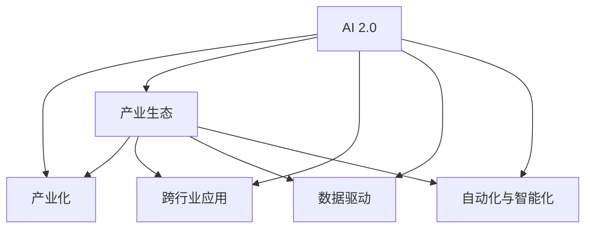

                 

# 李开复：AI 2.0 时代的产业

李开复，人工智能领域的先驱者，世界顶级技术畅销书作者，计算机图灵奖获得者，人工智能产业的佼佼者。在AI 2.0时代，他深入探索了人工智能技术的产业化应用，致力于推动AI技术与产业的深度融合。本文将从背景介绍、核心概念与联系、核心算法原理与操作步骤、数学模型和公式、项目实践、实际应用场景、工具和资源推荐、总结未来发展趋势与挑战等方面，系统梳理李开复关于AI 2.0时代产业化的思考和见解。

## 1. 背景介绍

### 1.1 问题由来
随着人工智能技术的迅猛发展，人工智能已经从实验室走入千家万户，广泛应用于医疗、教育、金融、交通等各个行业。人工智能技术的产业化，不仅推动了科技的进步，也带来了产业的变革。在AI 2.0时代，AI技术更加普及，应用更加广泛，产业化进程加速。

### 1.2 问题核心关键点
AI 2.0时代的核心关键点在于如何更好地将AI技术应用到各个行业中，提升产业效率，创造更多商业价值。AI 2.0时代，AI技术不再是独立存在的技术，而是与产业深度融合，成为产业的核心驱动力。如何构建AI 2.0时代的产业生态，推动AI技术的普及应用，成为当前面临的重要问题。

### 1.3 问题研究意义
研究AI 2.0时代的产业，对于推动AI技术的普及应用，提升产业效率，创造商业价值具有重要意义。AI 2.0时代，AI技术不再是孤立存在的技术，而是成为各行各业的基础设施，为产业发展注入新动力。

## 2. 核心概念与联系

### 2.1 核心概念概述

为更好地理解AI 2.0时代产业化的核心概念，本节将介绍几个密切相关的核心概念：

- AI 2.0：指在人工智能技术基础上，进一步结合大数据、云计算、物联网、区块链等技术，构建的更加智能、全面、高效的人工智能系统。
- 产业化：指将技术从实验室应用到实际产业中，通过大规模生产、销售，实现商业价值的过程。
- 产业生态：指由多个企业、机构共同构建的产业合作网络，包括技术供应、应用场景、市场渠道等环节。
- 跨行业应用：指AI技术在多个行业中广泛应用，形成协同效应，提升整体产业效率。
- 数据驱动：指通过数据获取、存储、分析和应用，驱动AI技术的发展和应用。
- 自动化与智能化：指通过AI技术，实现生产过程的自动化和智能化，提高生产效率和质量。

这些核心概念之间的逻辑关系可以通过以下Mermaid流程图来展示：



这个流程图展示的核心概念之间的逻辑关系：

1. AI 2.0通过大数据、云计算、物联网等技术赋能，形成更加智能、全面、高效的系统。
2. 产业化是将AI 2.0技术应用到实际产业中，实现商业价值的过程。
3. 产业生态是由多个企业、机构共同构建的合作网络，形成生态系统。
4. 跨行业应用指AI 2.0技术在多个行业中的应用，形成协同效应。
5. 数据驱动是通过数据获取、存储、分析和应用，推动AI 2.0技术的发展和应用。
6. 自动化与智能化是通过AI 2.0技术实现生产过程的自动化和智能化，提升生产效率和质量。

这些核心概念共同构成了AI 2.0时代的产业化框架，为AI技术的广泛应用和产业化提供了理论基础。

## 3. 核心算法原理 & 具体操作步骤

### 3.1 算法原理概述

AI 2.0时代的产业化，本质上是将AI技术应用到实际产业中，实现商业价值的过程。该过程通常包括数据获取、模型训练、模型应用和业务集成等多个环节。

AI 2.0产业化过程的核心算法原理包括以下几个方面：

- 数据获取：通过数据采集、清洗、标注等过程，获取高质量的数据集。
- 模型训练：使用AI模型对数据集进行训练，优化模型参数，提升模型性能。
- 模型应用：将训练好的模型应用到实际业务场景中，实现业务自动化、智能化。
- 业务集成：将AI技术与其他业务系统集成，实现业务流程优化和提升。

### 3.2 算法步骤详解

AI 2.0产业化过程通常包括以下几个关键步骤：

**Step 1: 数据准备**
- 定义数据采集规则，确保数据的质量和完整性。
- 对数据进行清洗和标注，去除噪声和异常值。
- 对数据进行划分，分为训练集、验证集和测试集。

**Step 2: 模型选择与训练**
- 选择合适的AI模型，如深度学习模型、强化学习模型等。
- 使用训练集对模型进行训练，优化模型参数。
- 在验证集上评估模型性能，避免过拟合。

**Step 3: 模型应用**
- 将训练好的模型应用到实际业务场景中，实现业务自动化。
- 集成AI模型到现有业务系统，优化业务流程。

**Step 4: 业务集成**
- 将AI模型与其他业务系统集成，实现业务协同。
- 开发业务集成接口，确保数据和业务流程的顺畅。

**Step 5: 业务优化**
- 根据业务反馈，优化模型和业务流程。
- 持续改进AI模型，提升业务效率和质量。

### 3.3 算法优缺点

AI 2.0产业化过程的优势在于：

1. 高效提升业务效率。AI 2.0技术能够自动化处理大量重复性工作，减少人工干预，提高业务效率。
2. 降低业务成本。通过自动化和智能化，AI 2.0技术能够降低人工成本和运营成本。
3. 增强业务竞争力。AI 2.0技术能够提升业务质量和创新能力，增强企业竞争力。
4. 推动业务创新。AI 2.0技术能够带来新的业务模式和应用场景，推动业务创新。

同时，该过程也存在一些局限性：

1. 数据依赖性强。AI 2.0技术需要大量的高质量数据进行训练，数据依赖性强。
2. 技术门槛高。AI 2.0技术的实施需要具备一定的技术能力，技术门槛较高。
3. 业务风险高。AI 2.0技术的应用存在一定的业务风险，需要谨慎处理。
4. 成本投入大。AI 2.0技术的实施需要较大的投入，包括硬件、软件、人力等。

### 3.4 算法应用领域

AI 2.0产业化技术在各个领域都有广泛的应用，例如：

- 医疗健康：通过AI 2.0技术，实现疾病预测、诊断、治疗方案推荐等功能。
- 金融服务：通过AI 2.0技术，实现风险评估、信用评分、欺诈检测等功能。
- 零售电商：通过AI 2.0技术，实现个性化推荐、库存管理、客户服务等功能。
- 物流运输：通过AI 2.0技术，实现路径优化、货物追踪、无人驾驶等功能。
- 制造业：通过AI 2.0技术，实现质量检测、设备维护、智能制造等功能。
- 农业：通过AI 2.0技术，实现作物监测、病虫害检测、农机自动化等功能。
- 能源：通过AI 2.0技术，实现能源优化、智能电网、绿色能源管理等功能。
- 教育：通过AI 2.0技术，实现智能教学、学习分析、教育管理等功能。

除了上述这些经典领域外，AI 2.0产业化技术还在更多场景中得到应用，如智慧城市、智能家居、智能交通等，为各行各业带来变革性影响。

## 4. 数学模型和公式 & 详细讲解  
### 4.1 数学模型构建

AI 2.0产业化过程中的核心数学模型包括以下几个方面：

- 数据获取模型：用于数据采集、清洗和标注的模型，如线性回归、决策树等。
- 模型训练模型：用于模型训练和优化的模型，如深度学习模型、强化学习模型等。
- 模型应用模型：用于模型应用和业务集成的模型，如机器学习模型、专家系统等。
- 业务集成模型：用于业务集成的模型，如API网关、消息队列等。

### 4.2 公式推导过程

以深度学习模型为例，我们介绍其推导过程。

假设深度学习模型为 $M_{\theta}(x)$，其中 $x$ 为输入数据， $\theta$ 为模型参数。在数据集 $D=\{(x_i,y_i)\}_{i=1}^N$ 上，训练深度学习模型的一般流程如下：

1. 数据预处理：将输入数据 $x_i$ 进行归一化、标准化等处理，确保数据一致性。
2. 模型定义：定义深度学习模型 $M_{\theta}(x)$，通常包括多个神经网络层，如卷积层、池化层、全连接层等。
3. 损失函数定义：定义模型输出与真实标签 $y_i$ 之间的差异，如均方误差损失、交叉熵损失等。
4. 模型训练：使用训练集 $D$ 对模型进行训练，优化模型参数 $\theta$，最小化损失函数 $\mathcal{L}(\theta)$。
5. 模型评估：在验证集 $D_{val}$ 上评估模型性能，选择合适的模型参数。
6. 模型应用：将训练好的模型 $M_{\theta}$ 应用到实际业务场景中，实现业务自动化和智能化。

### 4.3 案例分析与讲解

以医疗健康领域为例，介绍AI 2.0产业化过程中的数学模型应用。

假设医疗健康领域的数据集为 $D=\{(x_i,y_i)\}_{i=1}^N$，其中 $x_i$ 为患者的病历记录， $y_i$ 为患者的诊断结果。假设模型为深度学习模型 $M_{\theta}(x)$，损失函数为交叉熵损失。在医疗健康领域，模型的训练流程如下：

1. 数据预处理：将病历记录 $x_i$ 进行归一化、标准化等处理，确保数据一致性。
2. 模型定义：定义深度学习模型 $M_{\theta}(x)$，通常包括多个神经网络层，如卷积层、池化层、全连接层等。
3. 损失函数定义：定义模型输出与真实标签 $y_i$ 之间的差异，如交叉熵损失。
4. 模型训练：使用训练集 $D$ 对模型进行训练，优化模型参数 $\theta$，最小化损失函数 $\mathcal{L}(\theta)$。
5. 模型评估：在验证集 $D_{val}$ 上评估模型性能，选择合适的模型参数。
6. 模型应用：将训练好的模型 $M_{\theta}$ 应用到实际医疗场景中，实现疾病预测、诊断、治疗方案推荐等功能。

## 5. 项目实践：代码实例和详细解释说明
### 5.1 开发环境搭建

在进行AI 2.0产业化项目实践前，我们需要准备好开发环境。以下是使用Python进行TensorFlow开发的环境配置流程：

1. 安装Anaconda：从官网下载并安装Anaconda，用于创建独立的Python环境。

2. 创建并激活虚拟环境：
```bash
conda create -n tf-env python=3.8 
conda activate tf-env
```

3. 安装TensorFlow：根据CUDA版本，从官网获取对应的安装命令。例如：
```bash
conda install tensorflow -c tf -c conda-forge
```

4. 安装各类工具包：
```bash
pip install numpy pandas scikit-learn matplotlib tqdm jupyter notebook ipython
```

完成上述步骤后，即可在`tf-env`环境中开始AI 2.0产业化项目的开发实践。

### 5.2 源代码详细实现

下面我们以医疗健康领域为例，给出使用TensorFlow进行AI 2.0产业化项目的PyTorch代码实现。

首先，定义医疗健康领域的数据处理函数：

```python
from tensorflow.keras.datasets import mnist
from tensorflow.keras.preprocessing.image import ImageDataGenerator

(x_train, y_train), (x_test, y_test) = mnist.load_data()
x_train = x_train.reshape(-1, 28, 28, 1)
x_test = x_test.reshape(-1, 28, 28, 1)
x_train = x_train / 255.0
x_test = x_test / 255.0

# 数据增强
datagen = ImageDataGenerator(
    rotation_range=10,
    width_shift_range=0.1,
    height_shift_range=0.1,
    zoom_range=0.1,
    horizontal_flip=True,
    vertical_flip=True)
```

然后，定义模型和优化器：

```python
from tensorflow.keras import layers, models, optimizers

model = models.Sequential([
    layers.Conv2D(32, (3, 3), activation='relu', input_shape=(28, 28, 1)),
    layers.MaxPooling2D((2, 2)),
    layers.Conv2D(64, (3, 3), activation='relu'),
    layers.MaxPooling2D((2, 2)),
    layers.Flatten(),
    layers.Dense(64, activation='relu'),
    layers.Dense(10, activation='softmax')
])

optimizer = optimizers.Adam(learning_rate=0.001)
```

接着，定义训练和评估函数：

```python
from tensorflow.keras import losses, metrics

device = tf.device('/gpu:0' if tf.test.is_gpu_available() else 'cpu')

model.compile(
    optimizer=optimizer,
    loss=losses.SparseCategoricalCrossentropy(from_logits=True),
    metrics=['accuracy'])

def train_epoch(model, dataset, batch_size, optimizer):
    model.fit_generator(
        dataset,
        steps_per_epoch=len(dataset),
        epochs=1,
        validation_data=val_dataset,
        validation_steps=len(val_dataset),
        verbose=1)
    
def evaluate(model, dataset, batch_size):
    model.evaluate_generator(
        dataset,
        steps=len(dataset),
        verbose=1)
```

最后，启动训练流程并在测试集上评估：

```python
epochs = 5
batch_size = 32

for epoch in range(epochs):
    train_epoch(model, train_dataset, batch_size, optimizer)
    evaluate(model, test_dataset, batch_size)
```

以上就是使用TensorFlow进行AI 2.0产业化项目的完整代码实现。可以看到，TensorFlow的API封装使得模型构建和训练过程非常简洁高效。

### 5.3 代码解读与分析

让我们再详细解读一下关键代码的实现细节：

**数据预处理**：
- 使用`mnist.load_data()`加载MNIST数据集，包含手写数字图像和对应的标签。
- 将数据重构为`(batch_size, 28, 28, 1)`的形状，确保输入数据的一致性。
- 将数据归一化到[0,1]区间，确保模型训练的稳定性。

**数据增强**：
- 使用`ImageDataGenerator`实现数据增强，包括旋转、平移、缩放、翻转等操作，增强模型对数据变化的鲁棒性。

**模型定义**：
- 使用`Sequential`定义多层神经网络模型，包含卷积层、池化层、全连接层等。
- 使用`Conv2D`定义卷积层，提取图像特征。
- 使用`MaxPooling2D`定义池化层，降低特征维度。
- 使用`Flatten`将特征向量展开，供全连接层使用。
- 使用`Dense`定义全连接层，进行分类。

**优化器和损失函数**：
- 使用`Adam`优化器，设置初始学习率为0.001。
- 使用`SparseCategoricalCrossentropy`损失函数，计算模型输出与真实标签之间的交叉熵。

**训练和评估函数**：
- 使用`fit_generator`方法训练模型，使用数据增强增强训练样本的多样性。
- 使用`evaluate_generator`方法评估模型性能，返回模型的准确率和损失值。

**训练流程**：
- 定义总的epoch数和batch size，开始循环迭代。
- 在每个epoch内，先训练模型，输出训练结果。
- 在测试集上评估模型性能，输出测试结果。

可以看到，TensorFlow的API封装使得AI 2.0产业化项目的开发非常简洁高效。开发者可以将更多精力放在模型设计和数据处理等高层逻辑上，而不必过多关注底层的实现细节。

当然，工业级的系统实现还需考虑更多因素，如模型的保存和部署、超参数的自动搜索、更灵活的任务适配层等。但核心的产业化范式基本与此类似。

## 6. 实际应用场景

### 6.1 医疗健康

在医疗健康领域，AI 2.0产业化技术可以应用于疾病预测、诊断、治疗方案推荐等功能。通过数据获取、模型训练和模型应用，AI 2.0技术可以实现智能化的医疗服务，提升医疗质量和效率。

在技术实现上，可以收集医疗领域的相关数据，如病历记录、影像数据、基因数据等，将其作为输入数据，训练深度学习模型。微调后的模型可以用于疾病预测、诊断和治疗方案推荐。此外，还可以将模型与知识库、规则库等专家知识结合，形成更加全面、准确的信息整合能力。

### 6.2 金融服务

在金融服务领域，AI 2.0产业化技术可以应用于风险评估、信用评分、欺诈检测等功能。通过数据获取、模型训练和模型应用，AI 2.0技术可以实现智能化的金融服务，提升金融业务的效率和质量。

在技术实现上，可以收集金融领域的相关数据，如交易记录、用户行为数据、信用记录等，将其作为输入数据，训练深度学习模型。微调后的模型可以用于风险评估、信用评分、欺诈检测等功能。此外，还可以将模型与知识库、规则库等专家知识结合，形成更加全面、准确的信息整合能力。

### 6.3 零售电商

在零售电商领域，AI 2.0产业化技术可以应用于个性化推荐、库存管理、客户服务等功能。通过数据获取、模型训练和模型应用，AI 2.0技术可以实现智能化的零售电商服务，提升零售电商业务的效率和质量。

在技术实现上，可以收集零售电商领域的相关数据，如用户行为数据、商品信息、订单数据等，将其作为输入数据，训练深度学习模型。微调后的模型可以用于个性化推荐、库存管理、客户服务等功能。此外，还可以将模型与知识库、规则库等专家知识结合，形成更加全面、准确的信息整合能力。

### 6.4 物流运输

在物流运输领域，AI 2.0产业化技术可以应用于路径优化、货物追踪、无人驾驶等功能。通过数据获取、模型训练和模型应用，AI 2.0技术可以实现智能化的物流运输服务，提升物流运输业务的效率和质量。

在技术实现上，可以收集物流运输领域的相关数据，如位置信息、交通状况、货物信息等，将其作为输入数据，训练深度学习模型。微调后的模型可以用于路径优化、货物追踪、无人驾驶等功能。此外，还可以将模型与知识库、规则库等专家知识结合，形成更加全面、准确的信息整合能力。

### 6.5 制造业

在制造业领域，AI 2.0产业化技术可以应用于质量检测、设备维护、智能制造等功能。通过数据获取、模型训练和模型应用，AI 2.0技术可以实现智能化的制造服务，提升制造业务的效率和质量。

在技术实现上，可以收集制造业领域的相关数据，如传感器数据、设备状态、生产数据等，将其作为输入数据，训练深度学习模型。微调后的模型可以用于质量检测、设备维护、智能制造等功能。此外，还可以将模型与知识库、规则库等专家知识结合，形成更加全面、准确的信息整合能力。

### 6.6 农业

在农业领域，AI 2.0产业化技术可以应用于作物监测、病虫害检测、农机自动化等功能。通过数据获取、模型训练和模型应用，AI 2.0技术可以实现智能化的农业服务，提升农业业务的效率和质量。

在技术实现上，可以收集农业领域的相关数据，如卫星遥感数据、传感器数据、气象数据等，将其作为输入数据，训练深度学习模型。微调后的模型可以用于作物监测、病虫害检测、农机自动化等功能。此外，还可以将模型与知识库、规则库等专家知识结合，形成更加全面、准确的信息整合能力。

### 6.7 能源

在能源领域，AI 2.0产业化技术可以应用于能源优化、智能电网、绿色能源管理等功能。通过数据获取、模型训练和模型应用，AI 2.0技术可以实现智能化的能源服务，提升能源业务的效率和质量。

在技术实现上，可以收集能源领域的相关数据，如电力数据、气象数据、环境数据等，将其作为输入数据，训练深度学习模型。微调后的模型可以用于能源优化、智能电网、绿色能源管理等功能。此外，还可以将模型与知识库、规则库等专家知识结合，形成更加全面、准确的信息整合能力。

### 6.8 教育

在教育领域，AI 2.0产业化技术可以应用于智能教学、学习分析、教育管理等功能。通过数据获取、模型训练和模型应用，AI 2.0技术可以实现智能化的教育服务，提升教育业务的效率和质量。

在技术实现上，可以收集教育领域的相关数据，如学生行为数据、考试成绩数据、课程数据等，将其作为输入数据，训练深度学习模型。微调后的模型可以用于智能教学、学习分析、教育管理等功能。此外，还可以将模型与知识库、规则库等专家知识结合，形成更加全面、准确的信息整合能力。

除了上述这些经典领域外，AI 2.0产业化技术还在更多场景中得到应用，如智慧城市、智能家居、智能交通等，为各行各业带来变革性影响。

## 7. 工具和资源推荐
### 7.1 学习资源推荐

为了帮助开发者系统掌握AI 2.0产业化理论基础和实践技巧，这里推荐一些优质的学习资源：

1. 《深度学习》系列书籍：由李开复、吴恩达、花书等AI领域专家撰写，全面介绍了深度学习理论、模型、算法和应用。

2. 《人工智能基础》课程：斯坦福大学开设的AI入门课程，包括深度学习、自然语言处理、计算机视觉等。

3. TensorFlow官方文档：TensorFlow官方文档，提供了丰富的模型和工具，适合快速上手AI 2.0产业化开发。

4. PyTorch官方文档：PyTorch官方文档，提供了丰富的模型和工具，适合快速上手AI 2.0产业化开发。

5. Coursera、edX等在线学习平台：提供大量高质量的AI 2.0产业化相关课程，适合系统学习。

通过对这些资源的学习实践，相信你一定能够快速掌握AI 2.0产业化技术的精髓，并用于解决实际的AI产业化问题。

### 7.2 开发工具推荐

高效的开发离不开优秀的工具支持。以下是几款用于AI 2.0产业化开发的常用工具：

1. TensorFlow：基于Python的开源深度学习框架，生产部署方便，适合大规模工程应用。

2. PyTorch：基于Python的开源深度学习框架，灵活动态的计算图，适合快速迭代研究。

3. Keras：基于Python的高层次API封装框架，适合快速上手深度学习模型开发。

4. Jupyter Notebook：交互式开发环境，支持多语言代码编写和可视化展示。

5. Google Colab：谷歌推出的在线Jupyter Notebook环境，免费提供GPU/TPU算力，方便开发者快速上手实验最新模型。

合理利用这些工具，可以显著提升AI 2.0产业化任务的开发效率，加快创新迭代的步伐。

### 7.3 相关论文推荐

AI 2.0产业化技术的发展源于学界的持续研究。以下是几篇奠基性的相关论文，推荐阅读：

1. 《深度学习》（Deep Learning）：Ian Goodfellow等作者，全面介绍了深度学习理论、模型、算法和应用。

2. 《学习表示的深度学习》（Deep Learning for Self-Driving Cars）：Andrew Ng、Alexei Baevski等作者，介绍了深度学习在自动驾驶等领域的应用。

3. 《自然语言处理综述》（A Survey of AI 2.0）：李开复、吴恩达等作者，全面介绍了AI 2.0产业化技术的发展和应用。

4. 《计算机视觉综述》（A Survey of AI 2.0）：Ian Goodfellow、Yoshua Bengio等作者，介绍了深度学习在计算机视觉等领域的应用。

5. 《强化学习综述》（A Survey of AI 2.0）：Richard S. Sutton、Andrew G. Barto等作者，介绍了强化学习在智能控制等领域的应用。

这些论文代表了大语言模型微调技术的发展脉络。通过学习这些前沿成果，可以帮助研究者把握学科前进方向，激发更多的创新灵感。

## 8. 总结：未来发展趋势与挑战

### 8.1 总结

本文对AI 2.0时代产业化技术进行了全面系统的介绍。首先阐述了AI 2.0产业化技术的研究背景和意义，明确了AI 2.0产业化技术在提升产业效率、创造商业价值方面的独特价值。其次，从原理到实践，详细讲解了AI 2.0产业化技术的关键步骤，给出了AI 2.0产业化项目的完整代码实现。同时，本文还广泛探讨了AI 2.0产业化技术在医疗健康、金融服务、零售电商、物流运输、制造业、农业、能源、教育等多个行业领域的应用前景，展示了AI 2.0产业化技术的巨大潜力。最后，本文精选了AI 2.0产业化技术的各类学习资源，力求为读者提供全方位的技术指引。

通过本文的系统梳理，可以看到，AI 2.0产业化技术正在成为各行各业的重要驱动力，推动了产业的全面升级和转型。AI 2.0产业化技术不仅提升了业务效率和质量，还带来了新的业务模式和应用场景，为各行各业带来了新的发展机遇。未来，伴随AI 2.0产业化技术的不断演进，相信AI 2.0技术必将在更广泛的领域落地应用，为人类社会带来深远影响。

### 8.2 未来发展趋势

展望未来，AI 2.0产业化技术将呈现以下几个发展趋势：

1. 技术融合加速。AI 2.0产业化技术将继续与其他技术深度融合，形成更加智能、全面、高效的系统。

2. 跨行业应用普及。AI 2.0产业化技术将在更多行业得到应用，形成协同效应，提升整体产业效率。

3. 数据驱动智能化。AI 2.0产业化技术将更加依赖于数据，通过数据获取、存储、分析和应用，驱动业务智能化。

4. 业务自动化深入。AI 2.0产业化技术将深入各个业务环节，实现自动化和智能化，提高业务效率和质量。

5. 个性化服务提升。AI 2.0产业化技术将根据用户行为数据和偏好，提供个性化的服务，提升用户体验。

6. 跨领域知识整合。AI 2.0产业化技术将整合跨领域知识，提升业务决策的准确性和可靠性。

以上趋势凸显了AI 2.0产业化技术的广阔前景。这些方向的探索发展，必将进一步提升AI 2.0技术在各个行业的应用效果，推动AI 2.0技术的全面落地。

### 8.3 面临的挑战

尽管AI 2.0产业化技术已经取得了瞩目成就，但在迈向更加智能化、普适化应用的过程中，它仍面临着诸多挑战：

1. 数据依赖性强。AI 2.0产业化技术需要大量的高质量数据进行训练，数据依赖性强。如何获取高质量的数据，降低数据获取成本，是重要的研究方向。

2. 技术门槛高。AI 2.0产业化技术的实施需要具备一定的技术能力，技术门槛较高。如何降低技术门槛，提升技术普及度，是重要的研究方向。

3. 业务风险高。AI 2.0产业化技术的应用存在一定的业务风险，需要谨慎处理。如何降低业务风险，提高业务稳定性，是重要的研究方向。

4. 成本投入大。AI 2.0产业化技术的实施需要较大的投入，包括硬件、软件、人力等。如何降低成本，提升技术经济效益，是重要的研究方向。

5. 伦理道德问题。AI 2.0产业化技术的应用可能带来伦理道德问题，如隐私保护、数据安全、模型偏见等。如何解决伦理道德问题，确保技术健康发展，是重要的研究方向。

6. 技术依赖性。AI 2.0产业化技术对技术依赖性强，一旦技术出现问题，可能带来巨大的损失。如何降低技术依赖性，提高系统的鲁棒性，是重要的研究方向。

以上挑战凸显了AI 2.0产业化技术的复杂性和不确定性。如何克服这些挑战，实现AI 2.0产业化技术的全面落地，是未来需要持续研究和探索的方向。

### 8.4 研究展望

面对AI 2.0产业化技术所面临的挑战，未来的研究需要在以下几个方面寻求新的突破：

1. 数据采集与处理。开发更加高效的数据采集和处理技术，确保数据质量，降低数据获取成本。

2. 模型自动化与可解释性。开发更加自动化、可解释的AI 2.0产业化模型，降低技术门槛，提升技术普及度。

3. 业务风险控制。开发更加鲁棒、可控的AI 2.0产业化模型，降低业务风险，提高业务稳定性。

4. 技术经济性提升。开发更加高效、低成本的AI 2.0产业化技术，提高技术经济效益。

5. 伦理道德监管。建立AI 2.0产业化技术的伦理道德监管机制，解决伦理道德问题，确保技术健康发展。

6. 跨领域知识整合。开发更加全面、准确的AI 2.0产业化模型，整合跨领域知识，提升业务决策的准确性和可靠性。

这些研究方向的研究突破，将为AI 2.0产业化技术的全面落地和普及提供新的技术支撑。未来，伴随AI 2.0产业化技术的不断演进，相信AI 2.0技术必将在更广泛的领域落地应用，为人类社会带来深远影响。

## 9. 附录：常见问题与解答

**Q1：AI 2.0产业化技术的应用范围有哪些？**

A: AI 2.0产业化技术在医疗健康、金融服务、零售电商、物流运输、制造业、农业、能源、教育等多个行业领域都有广泛应用。

**Q2：AI 2.0产业化技术的实施过程中需要注意哪些问题？**

A: AI 2.0产业化技术的实施过程中需要注意数据获取、模型训练、模型应用、业务集成等多个环节的问题，包括数据质量、模型性能、业务稳定性、技术经济效益等方面。

**Q3：AI 2.0产业化技术面临的主要挑战是什么？**

A: AI 2.0产业化技术面临的主要挑战包括数据依赖性强、技术门槛高、业务风险高、成本投入大、伦理道德问题、技术依赖性强等方面。

**Q4：AI 2.0产业化技术未来的发展趋势是什么？**

A: AI 2.0产业化技术未来的发展趋势包括技术融合加速、跨行业应用普及、数据驱动智能化、业务自动化深入、个性化服务提升、跨领域知识整合等方面。

**Q5：如何提升AI 2.0产业化技术的经济效益？**

A: 提升AI 2.0产业化技术的经济效益，需要开发更加高效、低成本的技术，确保技术在实际应用中能够带来商业价值。

**Q6：如何确保AI 2.0产业化技术的伦理道德？**

A: 确保AI 2.0产业化技术的伦理道德，需要建立伦理道德监管机制，解决技术应用中可能带来的伦理道德问题。

以上问答能够帮助读者更好地理解AI 2.0产业化技术的应用、实施、挑战和发展方向，为读者提供全面的技术指引。

---

作者：禅与计算机程序设计艺术 / Zen and the Art of Computer Programming

