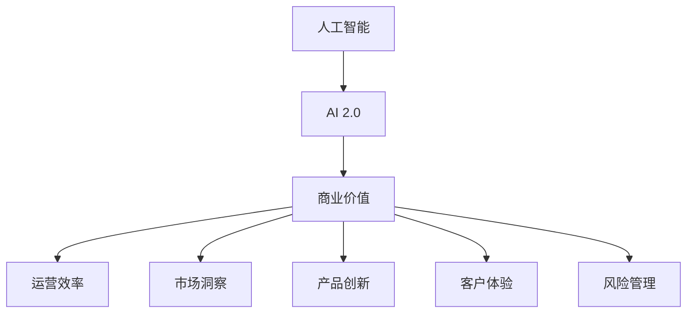

                 

## 1. 背景介绍

### 1.1 问题由来
在过去的几十年里，人工智能（AI）技术经历了从人工智能 1.0（基于符号规则的系统）到人工智能 2.0（基于深度学习和大数据驱动的系统）的转变。在AI 2.0时代，深度学习和数据分析技术取得了突破性进展，推动了AI在商业领域的应用。然而，尽管AI技术日益成熟，许多企业仍未充分理解其商业价值，导致AI技术的潜力尚未完全释放。本文将探讨AI 2.0时代的商业价值，帮助企业更好地理解和应用AI技术。

### 1.2 问题核心关键点
AI 2.0时代的商业价值主要体现在以下几个方面：
- **效率提升**：通过自动化和优化，AI可以帮助企业大幅提升运营效率，降低成本。
- **市场洞察**：AI能够从海量数据中提取有价值的洞察，帮助企业做出更好的决策。
- **产品创新**：AI技术可以应用于产品开发和设计，增强产品的个性化和智能化。
- **客户体验**：通过AI驱动的个性化推荐和智能客服，提升客户体验和满意度。
- **风险管理**：AI可以帮助企业预测和监控风险，提升业务稳健性。

理解这些关键点对于企业充分利用AI技术、获取竞争优势至关重要。

## 2. 核心概念与联系

### 2.1 核心概念概述

为更好地理解AI 2.0时代的商业价值，本节将介绍几个密切相关的核心概念：

- **人工智能（AI）**：利用机器学习、深度学习等技术，使机器具备智能能力，能够执行复杂任务。
- **AI 2.0**：基于深度学习和数据分析技术的AI，具有自适应、自学习和自优化的能力。
- **商业价值**：AI技术为企业带来的收益，包括效率提升、市场洞察、产品创新、客户体验和风险管理等方面的好处。
- **运营效率**：通过自动化和优化，AI技术可以大幅提升企业的运营效率和盈利能力。
- **市场洞察**：AI能够从大量数据中提取有价值的洞察，帮助企业做出更精准的决策。
- **产品创新**：AI技术可以应用于产品开发和设计，增强产品的智能化和个性化。
- **客户体验**：通过AI驱动的个性化推荐和智能客服，提升客户满意度和忠诚度。
- **风险管理**：AI可以帮助企业预测和监控风险，提升业务稳健性。

这些核心概念之间的逻辑关系可以通过以下Mermaid流程图来展示：



这个流程图展示了大规模AI 2.0技术为企业带来的多维度的商业价值，涉及运营效率、市场洞察、产品创新、客户体验和风险管理等方面。

## 3. 核心算法原理 & 具体操作步骤
### 3.1 算法原理概述

AI 2.0时代的商业价值主要通过以下几个核心算法实现：

1. **深度学习（Deep Learning）**：通过多层次的非线性变换，使机器能够学习复杂的数据表示和模式。
2. **自然语言处理（NLP）**：使机器能够理解和生成人类语言，实现语音识别、文本分类、情感分析等功能。
3. **计算机视觉（CV）**：使机器能够识别和理解图像和视频内容，应用于图像识别、视频监控等场景。
4. **强化学习（RL）**：通过奖励和惩罚机制，使机器能够在不断试错中学习最优策略，应用于自动驾驶、机器人控制等场景。

这些算法在AI 2.0时代得到了广泛应用，推动了AI技术的商业化进程。

### 3.2 算法步骤详解

以下是AI 2.0技术在商业应用中的详细步骤：

**Step 1: 数据准备**
- 收集和清洗数据，确保数据质量。
- 选择合适的数据集，包括历史交易数据、客户反馈数据、市场趋势数据等。
- 对数据进行预处理，如归一化、特征工程等。

**Step 2: 模型训练**
- 选择合适的算法模型，如神经网络、卷积神经网络（CNN）、循环神经网络（RNN）、Transformer等。
- 设定合适的超参数，如学习率、批量大小、迭代次数等。
- 使用训练数据集对模型进行训练，优化模型参数。

**Step 3: 模型评估**
- 使用验证数据集对模型进行评估，评估指标包括准确率、召回率、F1值等。
- 调整模型参数，提高模型性能。

**Step 4: 部署与应用**
- 将训练好的模型部署到生产环境中，如服务器、云平台等。
- 根据具体业务需求，对模型进行调优和优化，确保模型性能和稳定性。
- 监控模型性能，定期更新模型，保证模型始终处于最优状态。

### 3.3 算法优缺点

AI 2.0技术的商业应用具有以下优点：
1. **高效性**：AI技术可以自动化处理大量数据，提升业务效率。
2. **准确性**：AI模型在处理复杂任务时，通常具有较高的准确性和可靠性。
3. **灵活性**：AI模型可以根据业务需求进行灵活调整，适应不同的应用场景。
4. **可扩展性**：AI技术可以方便地集成到现有系统中，实现无缝升级。

同时，AI 2.0技术也存在一些局限性：
1. **数据依赖**：AI模型的效果依赖于高质量的数据，数据缺失或噪声会影响模型性能。
2. **计算资源需求高**：深度学习模型通常需要大量的计算资源，包括高性能计算设备和数据存储。
3. **模型复杂度**：AI模型通常较为复杂，需要专业的知识和技能进行开发和维护。
4. **可解释性不足**：AI模型通常被视为"黑盒"，难以解释其决策过程。

尽管存在这些局限性，AI 2.0技术仍然在商业领域发挥着重要作用，推动企业实现智能化转型。

### 3.4 算法应用领域

AI 2.0技术在商业领域有广泛的应用，涵盖多个行业，例如：

- **零售业**：通过AI技术进行客户行为分析、库存管理、个性化推荐等，提升销售效率和客户满意度。
- **金融业**：利用AI进行风险评估、欺诈检测、客户服务自动化等，降低金融风险，提升服务质量。
- **制造业**：通过AI技术进行设备监控、预测性维护、供应链优化等，提升生产效率和产品品质。
- **医疗保健**：利用AI进行疾病诊断、患者管理、医疗影像分析等，提高医疗服务的质量和效率。
- **物流行业**：通过AI技术进行路线优化、仓库管理、配送预测等，提升物流效率和客户体验。
- **能源行业**：利用AI进行能源消耗预测、智能电网管理、智能设备监控等，提高能源利用效率。

这些应用展示了AI 2.0技术在商业领域的广泛应用，为企业带来了显著的商业价值。

## 4. 数学模型和公式 & 详细讲解 & 举例说明
### 4.1 数学模型构建

以下是一个简单的AI 2.0应用示例，即基于深度学习的图像分类模型。

**输入**：一张输入图片 $x$。
**模型**：一个简单的卷积神经网络（CNN）。
**输出**：图片所属的类别 $y$。

**损失函数**：交叉熵损失函数：

$$
L(y, \hat{y}) = -\sum_{i} y_i \log \hat{y}_i
$$

其中 $y$ 为真实标签，$\hat{y}$ 为模型预测的类别概率。

### 4.2 公式推导过程

以CNN为例，其核心组件包括卷积层、池化层、全连接层等。以卷积层为例，其数学表达式如下：

$$
\mathcal{F}_{conv}(x) = \max_{k \in K} \left\{ \sum_{m,n} \left( \sum_{i,j} x_{i,j} * k_{i,j} \right) \right\}
$$

其中 $x_{i,j}$ 为输入图像在位置 $(i,j)$ 的像素值，$k_{i,j}$ 为卷积核在位置 $(i,j)$ 的权重。

### 4.3 案例分析与讲解

假设我们要训练一个简单的图像分类模型，将猫和狗的图像分类。首先，收集大量的猫和狗图像数据，并对这些图像进行预处理和标注。接着，使用这些标注数据训练一个简单的卷积神经网络，对图像进行分类。最后，使用验证集对模型进行评估，并对模型进行调整和优化，直至达到满意的性能。

## 5. 项目实践：代码实例和详细解释说明
### 5.1 开发环境搭建

在进行AI 2.0应用开发前，我们需要准备好开发环境。以下是使用Python进行TensorFlow开发的环境配置流程：

1. 安装Anaconda：从官网下载并安装Anaconda，用于创建独立的Python环境。

2. 创建并激活虚拟环境：
```bash
conda create -n tf-env python=3.8 
conda activate tf-env
```

3. 安装TensorFlow：根据CUDA版本，从官网获取对应的安装命令。例如：
```bash
conda install tensorflow tensorflow-gpu=cuda11.1 -c conda-forge
```

4. 安装各类工具包：
```bash
pip install numpy pandas scikit-learn matplotlib tqdm jupyter notebook ipython
```

完成上述步骤后，即可在`tf-env`环境中开始AI 2.0应用的开发。

### 5.2 源代码详细实现

以下是一个简单的基于TensorFlow的图像分类应用示例，使用CNN模型进行猫狗图像分类。

首先，定义数据处理函数：

```python
import tensorflow as tf
from tensorflow.keras.preprocessing.image import ImageDataGenerator

def load_and_preprocess_data():
    train_datagen = ImageDataGenerator(rescale=1./255)
    train_generator = train_datagen.flow_from_directory(
        'train',
        target_size=(224, 224),
        batch_size=32,
        class_mode='binary')
    
    validation_datagen = ImageDataGenerator(rescale=1./255)
    validation_generator = validation_datagen.flow_from_directory(
        'validation',
        target_size=(224, 224),
        batch_size=32,
        class_mode='binary')
    
    return train_generator, validation_generator
```

接着，定义模型和优化器：

```python
from tensorflow.keras.models import Sequential
from tensorflow.keras.layers import Conv2D, MaxPooling2D, Flatten, Dense
from tensorflow.keras.optimizers import Adam

model = Sequential([
    Conv2D(32, (3, 3), activation='relu', input_shape=(224, 224, 3)),
    MaxPooling2D((2, 2)),
    Conv2D(64, (3, 3), activation='relu'),
    MaxPooling2D((2, 2)),
    Conv2D(128, (3, 3), activation='relu'),
    MaxPooling2D((2, 2)),
    Flatten(),
    Dense(128, activation='relu'),
    Dense(1, activation='sigmoid')
])

optimizer = Adam(learning_rate=0.001)
```

然后，定义训练和评估函数：

```python
def train(model, train_generator, validation_generator, epochs):
    model.compile(optimizer=optimizer, loss='binary_crossentropy', metrics=['accuracy'])
    
    model.fit(
        train_generator,
        validation_data=validation_generator,
        epochs=epochs)
    
def evaluate(model, test_generator):
    model.evaluate(test_generator)
```

最后，启动训练流程并在测试集上评估：

```python
epochs = 10

train_generator, validation_generator = load_and_preprocess_data()

train(model, train_generator, validation_generator, epochs)

test_generator = load_and_preprocess_data('test')
evaluate(model, test_generator)
```

以上就是使用TensorFlow进行猫狗图像分类的完整代码实现。可以看到，得益于TensorFlow的强大封装，我们可以用相对简洁的代码完成模型的开发和训练。

### 5.3 代码解读与分析

让我们再详细解读一下关键代码的实现细节：

**load_and_preprocess_data函数**：
- 使用`ImageDataGenerator`对训练集和验证集进行数据增强和预处理，如归一化。
- 使用`flow_from_directory`方法从指定目录下加载图片数据，自动进行类别标注。

**model定义**：
- 使用`Sequential`定义模型结构，包括卷积层、池化层、全连接层等。
- 使用`Conv2D`和`MaxPooling2D`构建卷积神经网络，使用`Flatten`和`Dense`进行全连接层设计。
- 使用`Adam`优化器进行模型优化，设定学习率为0.001。

**train函数**：
- 使用`compile`方法编译模型，指定损失函数和评估指标。
- 使用`fit`方法进行模型训练，指定训练数据和验证数据，设定迭代轮数为10。

**evaluate函数**：
- 使用`evaluate`方法在测试集上评估模型性能。

## 6. 实际应用场景
### 6.1 智能客服系统

AI 2.0技术可以广泛应用于智能客服系统的构建。传统的客服系统需要大量人力，高峰期响应缓慢，且难以保证一致性和专业性。使用AI 2.0技术，可以构建7x24小时不间断服务的智能客服系统，快速响应客户咨询，提供自然流畅的语音和文字交互体验。

在技术实现上，可以收集企业内部的历史客服对话记录，将问题和最佳答复构建成监督数据，在此基础上对预训练模型进行微调。微调后的模型能够自动理解用户意图，匹配最合适的答案模板进行回复。对于客户提出的新问题，还可以接入检索系统实时搜索相关内容，动态组织生成回答。

### 6.2 金融舆情监测

AI 2.0技术可以用于金融舆情监测，帮助金融机构实时监测市场舆论动向，快速应对负面信息传播，规避金融风险。具体而言，可以收集金融领域相关的新闻、报道、评论等文本数据，并对其进行主题标注和情感标注。在此基础上对预训练语言模型进行微调，使其能够自动判断文本属于何种主题，情感倾向是正面、中性还是负面。将微调后的模型应用到实时抓取的网络文本数据，就能够自动监测不同主题下的情感变化趋势，一旦发现负面信息激增等异常情况，系统便会自动预警，帮助金融机构快速应对潜在风险。

### 6.3 个性化推荐系统

AI 2.0技术可以应用于个性化推荐系统，帮助企业提升推荐效果，增强用户粘性。具体而言，可以收集用户浏览、点击、评论、分享等行为数据，提取和用户交互的物品标题、描述、标签等文本内容。将文本内容作为模型输入，用户的后续行为（如是否点击、购买等）作为监督信号，在此基础上微调预训练语言模型。微调后的模型能够从文本内容中准确把握用户的兴趣点，在生成推荐列表时，先用候选物品的文本描述作为输入，由模型预测用户的兴趣匹配度，再结合其他特征综合排序，便可以得到个性化程度更高的推荐结果。

### 6.4 未来应用展望

随着AI 2.0技术的不断发展，未来的商业应用将更加广泛和深入。以下是对未来应用的一些展望：

1. **智能制造**：AI 2.0技术可以应用于智能制造领域，通过自动化和智能化生产，提高生产效率和产品质量。例如，使用AI进行设备监控和预测性维护，优化生产流程。
2. **智慧医疗**：AI 2.0技术可以应用于智慧医疗领域，通过智能诊断、个性化治疗等，提升医疗服务的质量和效率。例如，使用AI进行疾病诊断、患者管理、医疗影像分析等。
3. **智慧农业**：AI 2.0技术可以应用于智慧农业领域，通过智能监测和决策支持，提高农业生产的效率和可持续性。例如，使用AI进行作物病虫害监测、土壤质量分析等。
4. **智能交通**：AI 2.0技术可以应用于智能交通领域，通过交通流量预测、智能调度等，提升交通系统的效率和安全性。例如，使用AI进行交通流量预测、智能调度等。
5. **智慧城市**：AI 2.0技术可以应用于智慧城市建设，通过智能监测和管理，提升城市的运行效率和居民的幸福感。例如，使用AI进行环境监测、智能交通管理等。

## 7. 工具和资源推荐
### 7.1 学习资源推荐

为了帮助开发者系统掌握AI 2.0技术的应用，这里推荐一些优质的学习资源：

1. 《深度学习》系列书籍：由Ian Goodfellow、Yoshua Bengio和Aaron Courville合著，全面介绍了深度学习的基本概念和算法。
2. TensorFlow官方文档：TensorFlow的官方文档，提供了详细的API参考和代码示例。
3. Keras官方文档：Keras的官方文档，提供了简单易用的API接口。
4. PyTorch官方文档：PyTorch的官方文档，提供了灵活的动态计算图。
5. Coursera《深度学习专项课程》：由吴恩达等知名教授授课，系统讲解深度学习的基本概念和应用。

通过对这些资源的学习实践，相信你一定能够快速掌握AI 2.0技术的应用，并用于解决实际的商业问题。

### 7.2 开发工具推荐

高效的开发离不开优秀的工具支持。以下是几款用于AI 2.0应用开发的常用工具：

1. PyTorch：基于Python的开源深度学习框架，灵活的动态计算图，适合快速迭代研究。
2. TensorFlow：由Google主导开发的开源深度学习框架，生产部署方便，适合大规模工程应用。
3. Keras：基于Python的高层API，简洁易用，适合快速原型开发。
4. Jupyter Notebook：交互式编程环境，支持多种编程语言和数据格式，方便进行实验和交流。
5. Visual Studio Code：轻量级且功能强大的编程IDE，支持代码高亮、调试、版本控制等。

合理利用这些工具，可以显著提升AI 2.0应用的开发效率，加快创新迭代的步伐。

### 7.3 相关论文推荐

AI 2.0技术的发展源于学界的持续研究。以下是几篇奠基性的相关论文，推荐阅读：

1. 《深度学习》：Ian Goodfellow等，全面介绍了深度学习的基本概念和算法。
2. 《卷积神经网络》：Yann LeCun等，详细介绍了卷积神经网络的结构和应用。
3. 《递归神经网络》：Sepp Hochreiter等，介绍了递归神经网络的原理和应用。
4. 《自然语言处理综述》：Yoshua Bengio等，全面回顾了自然语言处理的基本概念和技术。
5. 《图像分类与物体检测》：Alex Krizhevsky等，介绍了图像分类和物体检测的基本算法。

这些论文代表了大规模AI 2.0技术的发展脉络。通过学习这些前沿成果，可以帮助研究者把握学科前进方向，激发更多的创新灵感。

## 8. 总结：未来发展趋势与挑战
### 8.1 总结

本文对AI 2.0时代的商业价值进行了全面系统的介绍。首先阐述了AI 2.0技术的核心算法和操作步骤，然后探讨了其在商业领域的广泛应用，展示了AI 2.0技术在提升运营效率、增强市场洞察、推动产品创新、提升客户体验和降低风险管理等方面的巨大潜力。通过对这些核心概念和算法的深入理解，企业可以更好地应用AI 2.0技术，实现智能化转型，获取更大的商业价值。

### 8.2 未来发展趋势

展望未来，AI 2.0技术的发展将呈现以下几个趋势：

1. **自动化和智能化**：AI技术将进一步自动化和智能化，提升业务效率和决策质量。例如，自动化流程优化、智能数据分析等。
2. **个性化和定制化**：AI技术将更好地理解和满足用户需求，提供个性化和定制化的服务。例如，个性化推荐、定制化产品等。
3. **多模态融合**：AI技术将实现多模态数据的融合，提升系统感知和理解能力。例如，图像、语音、文本等数据的协同处理。
4. **实时化和动态化**：AI技术将实现实时化和动态化，提升系统响应速度和灵活性。例如，实时数据分析、动态调整策略等。
5. **普适化和易用化**：AI技术将更加普适化和易用化，降低技术门槛，让更多企业能够应用AI技术。例如，用户友好的界面、自动化的配置等。

这些趋势将推动AI 2.0技术在更多行业和场景中的应用，带来更广泛和深入的商业价值。

### 8.3 面临的挑战

尽管AI 2.0技术在商业领域已经取得了显著成果，但在迈向更加智能化、普适化应用的过程中，它仍面临诸多挑战：

1. **数据隐私和安全**：AI技术需要大量的数据进行训练，涉及用户隐私和数据安全问题。如何保护用户隐私，确保数据安全，是AI应用中的重要挑战。
2. **模型可解释性**：AI模型通常被视为"黑盒"，难以解释其决策过程。如何在保证模型性能的同时，提高其可解释性，是AI应用中的重要挑战。
3. **技术壁垒**：AI技术通常较为复杂，需要专业的知识和技能进行开发和维护。如何降低技术壁垒，提高技术普及度，是AI应用中的重要挑战。
4. **算法偏见**：AI模型可能会学习到有偏见的数据，产生不公平或有害的输出。如何消除模型偏见，确保算法公平性，是AI应用中的重要挑战。
5. **资源消耗**：AI技术通常需要大量的计算资源和存储空间，如何优化资源使用，降低成本，是AI应用中的重要挑战。
6. **伦理和社会影响**：AI技术的应用可能带来伦理和社会影响，例如就业、隐私、安全等问题。如何平衡技术发展和伦理社会影响，是AI应用中的重要挑战。

尽管存在这些挑战，AI 2.0技术的发展势头不可阻挡，未来将在更多行业和场景中得到应用，带来更广泛的商业价值和社会效益。

### 8.4 研究展望

面对AI 2.0技术所面临的挑战，未来的研究需要在以下几个方面寻求新的突破：

1. **可解释性**：开发更加可解释的AI模型，提高模型的透明性和可理解性。例如，可解释的深度学习模型、解释性算法等。
2. **隐私保护**：开发隐私保护技术，确保用户数据的安全和隐私。例如，差分隐私、联邦学习等。
3. **普适性**：开发更加普适化的AI技术，降低技术门槛，提高技术普及度。例如，简单易用的API接口、用户友好的界面等。
4. **多模态融合**：开发多模态数据融合技术，提升系统的感知和理解能力。例如，图像、语音、文本等数据的协同处理。
5. **实时化**：开发实时化的AI技术，提升系统的响应速度和灵活性。例如，实时数据分析、动态调整策略等。
6. **伦理和社会影响**：建立AI应用的伦理和社会影响评估机制，确保技术发展的社会效益。例如，伦理审查、社会影响评估等。

这些研究方向将推动AI 2.0技术的持续发展，推动其在更多行业和场景中的应用，为人类社会的进步和繁荣做出更大的贡献。总之，AI 2.0技术的发展需要学术界和产业界的共同努力，只有勇于创新、敢于突破，才能实现技术的突破和应用的成功。

## 9. 附录：常见问题与解答

**Q1：AI 2.0技术是否适用于所有行业？**

A: AI 2.0技术在多个行业中都有广泛的应用，但不同行业的应用场景和需求有所不同。例如，在零售业中，可以使用AI进行库存管理和个性化推荐；在金融业中，可以使用AI进行风险评估和欺诈检测；在医疗保健中，可以使用AI进行疾病诊断和患者管理等。

**Q2：如何选择合适的AI 2.0技术？**

A: 选择合适的AI 2.0技术需要考虑以下几个因素：
1. 业务需求：根据具体业务需求选择合适的技术，如图像分类、语音识别、自然语言处理等。
2. 数据特点：根据数据特点选择合适的技术，如基于深度学习的模型、基于规则的专家系统等。
3. 技术成熟度：选择成熟度和可靠性较高的技术，以确保应用效果和稳定性。
4. 成本效益：考虑技术的开发和维护成本，确保在预算范围内实现应用。

**Q3：AI 2.0技术的应用有哪些潜在的风险？**

A: AI 2.0技术的应用存在一些潜在的风险，包括：
1. 数据隐私和安全：AI技术需要大量的数据进行训练，涉及用户隐私和数据安全问题。
2. 模型偏见：AI模型可能会学习到有偏见的数据，产生不公平或有害的输出。
3. 技术壁垒：AI技术通常较为复杂，需要专业的知识和技能进行开发和维护。
4. 伦理和社会影响：AI技术的应用可能带来伦理和社会影响，例如就业、隐私、安全等问题。

这些风险需要企业在应用AI 2.0技术时予以重视，采取相应的措施进行防范和应对。

**Q4：AI 2.0技术的发展前景如何？**

A: AI 2.0技术的发展前景非常广阔，将在更多行业和场景中得到应用，带来更广泛的商业价值和社会效益。例如，在智能制造、智慧医疗、智慧交通等领域，AI 2.0技术将发挥重要作用，推动行业的发展和变革。

总之，AI 2.0技术是未来发展的趋势，将深刻影响各行各业，推动社会的进步和繁荣。

---

作者：禅与计算机程序设计艺术 / Zen and the Art of Computer Programming

