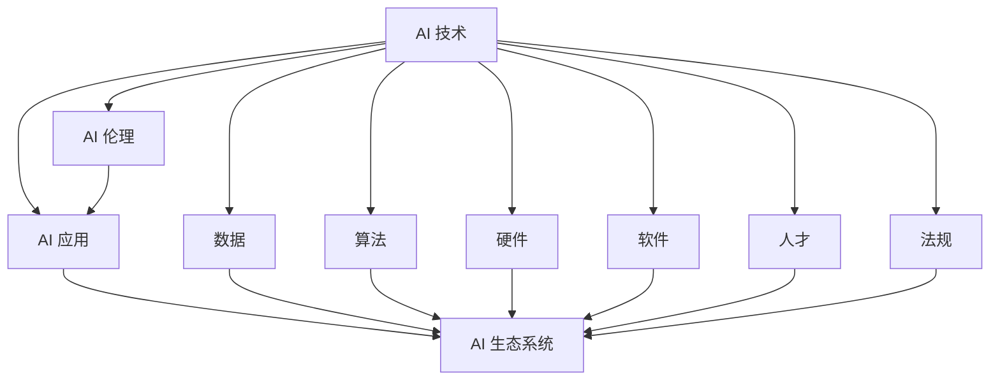

                 

# 李开复：AI 2.0 时代的市场

## 1. 背景介绍

### 1.1 问题由来

随着人工智能技术的不断进步，AI 2.0 时代已经到来。这个时代的标志是 AI 技术的成熟度，能够大规模商业化应用，并广泛渗透到各行各业。这一时期，AI 技术不再局限于特定的领域，而是成为推动产业升级、提高效率、创造价值的重要驱动力。

李开复，作为 AI 领域的先驱和领导者，一直关注着 AI 技术的发展和应用。他指出，AI 2.0 时代最大的变化在于 AI 技术的普及和商业化，这不仅带来了全新的商业模式和技术应用，也提出了许多新的挑战和机遇。

### 1.2 问题核心关键点

1. **AI 技术的普及**：AI 技术在医疗、金融、制造、教育等各个行业的应用，使得 AI 成为推动行业创新的关键力量。
2. **商业化进程**：AI 技术的商业化不仅包括直接的技术开发和销售，还涉及数据、人才、生态系统的建设。
3. **数据隐私和伦理**：随着 AI 技术的广泛应用，数据隐私和伦理问题也随之凸显，成为社会关注的焦点。
4. **法规和标准**：各国政府和企业正在制定 AI 相关的法规和标准，以确保 AI 技术的健康发展。
5. **国际竞争**：AI 技术的发展引发了全球范围内的激烈竞争，各国在技术、人才、市场等方面展开角逐。

## 2. 核心概念与联系

### 2.1 核心概念概述

在 AI 2.0 时代，有几个关键概念贯穿始终：

- **AI 技术**：包括机器学习、深度学习、自然语言处理、计算机视觉等技术，这些技术共同构成了 AI 的基础。
- **AI 应用**：指 AI 技术在各个行业中的应用，如医疗影像诊断、智能客服、金融风险管理、自动驾驶等。
- **AI 生态系统**：包括数据、算法、硬件、软件、人才、法规等各个环节，形成一个完整的 AI 生态链。
- **AI 伦理**：涉及数据隐私、算法偏见、安全性、透明性等问题，是 AI 技术发展的道德指南。

这些核心概念相互关联，共同推动 AI 技术的进步和应用。

### 2.2 核心概念原理和架构的 Mermaid 流程图



这个流程图展示了 AI 技术、应用、生态系统、伦理、数据、算法、硬件、软件、人才、法规之间的关系和互动。

## 3. 核心算法原理 & 具体操作步骤

### 3.1 算法原理概述

AI 2.0 时代的核心算法原理主要围绕机器学习和深度学习展开，这些算法能够从大量数据中学习规律，并应用于各种任务中。机器学习算法包括监督学习、无监督学习、半监督学习等，而深度学习算法则能够处理更加复杂的非线性关系和任务。

### 3.2 算法步骤详解

1. **数据收集**：获取与任务相关的数据集，并进行预处理。
2. **模型选择**：根据任务特点选择合适的算法模型，如卷积神经网络、循环神经网络、Transformer 等。
3. **训练模型**：使用训练集对模型进行训练，优化模型的参数以提高其预测性能。
4. **验证和测试**：在验证集上评估模型的性能，调整模型参数；在测试集上进一步验证模型的泛化能力。
5. **模型应用**：将训练好的模型应用于实际任务中，并进行性能优化和调优。

### 3.3 算法优缺点

**优点**：
- 自动化：AI 算法可以自动从数据中学习，减少了人工干预。
- 泛化能力强：AI 算法能够处理大量非结构化数据，具有很强的泛化能力。
- 应用广泛：AI 算法可以应用于各种领域，如医疗、金融、制造等。

**缺点**：
- 数据依赖：AI 算法的效果依赖于高质量的数据，数据质量和数量不足会影响模型性能。
- 复杂度高：AI 算法的复杂度高，需要大量的计算资源和时间。
- 模型可解释性：AI 算法的"黑盒"特性，使其决策过程难以解释和调试。

### 3.4 算法应用领域

AI 2.0 时代的 AI 算法在多个领域得到了广泛应用，包括：

- **医疗**：AI 算法可以辅助医生进行诊断、预测疾病、个性化治疗等。
- **金融**：AI 算法可以用于风险管理、欺诈检测、自动化交易等。
- **制造业**：AI 算法可以优化生产流程、提高生产效率、预测设备故障等。
- **教育**：AI 算法可以用于个性化学习、自动评估、智能辅导等。
- **交通**：AI 算法可以用于自动驾驶、交通流量预测、智能交通管理等。

## 4. 数学模型和公式 & 详细讲解 & 举例说明

### 4.1 数学模型构建

在 AI 2.0 时代，数学模型是 AI 算法的基础。常见的数学模型包括线性回归、逻辑回归、决策树、支持向量机、神经网络等。

以神经网络为例，其数学模型构建如下：

$$
h(x) = \sigma(w^T x + b)
$$

其中 $x$ 为输入，$w$ 为权重，$b$ 为偏置，$\sigma$ 为激活函数。

### 4.2 公式推导过程

以线性回归模型为例，其公式推导过程如下：

设训练集为 $\{(x_i, y_i)\}_{i=1}^n$，其中 $x_i \in \mathbb{R}^d$，$y_i \in \mathbb{R}$。假设模型为 $h(x) = w^T x + b$，则损失函数为：

$$
J(w, b) = \frac{1}{2n} \sum_{i=1}^n (y_i - h(x_i))^2
$$

通过求导和求解，可以得到模型的参数估计值 $w$ 和 $b$：

$$
w = \frac{1}{n}X^T(XX^T)^{-1}y
$$

其中 $X = [x_1, x_2, ..., x_n]^T$。

### 4.3 案例分析与讲解

假设我们有一个房屋价格预测的任务，收集了100个房屋的特征数据（如面积、卧室数量、卫生间数量等）和对应的价格。我们可以使用线性回归模型进行预测，其中输入 $x$ 为房屋特征向量，输出 $y$ 为房屋价格。通过训练模型，我们可以得到模型参数 $w$ 和 $b$，进而对新的房屋价格进行预测。

## 5. 项目实践：代码实例和详细解释说明

### 5.1 开发环境搭建

在开始项目实践前，我们需要搭建开发环境。以下是使用 Python 和 PyTorch 搭建开发环境的步骤：

1. 安装 Python：从官网下载并安装 Python 3.8。
2. 创建虚拟环境：使用 `virtualenv` 工具创建虚拟环境。
3. 安装 PyTorch：使用 `pip` 工具安装 PyTorch。
4. 安装相关库：使用 `pip` 工具安装相关的库，如 NumPy、Pandas、Scikit-learn 等。

### 5.2 源代码详细实现

以下是一个使用 PyTorch 实现线性回归模型的代码示例：

```python
import torch
import torch.nn as nn
import torch.optim as optim
from torch.utils.data import TensorDataset, DataLoader

# 数据准备
x = torch.tensor([[1.0], [2.0], [3.0], [4.0], [5.0]], dtype=torch.float32)
y = torch.tensor([[3.0], [5.0], [7.0], [9.0], [11.0]], dtype=torch.float32)
dataset = TensorDataset(x, y)

# 模型定义
class LinearRegression(nn.Module):
    def __init__(self, input_size):
        super(LinearRegression, self).__init__()
        self.linear = nn.Linear(input_size, 1)

    def forward(self, x):
        return self.linear(x)

# 训练
model = LinearRegression(1)
optimizer = optim.SGD(model.parameters(), lr=0.01)
criterion = nn.MSELoss()

for epoch in range(1000):
    model.train()
    optimizer.zero_grad()
    outputs = model(x)
    loss = criterion(outputs, y)
    loss.backward()
    optimizer.step()
    if (epoch + 1) % 100 == 0:
        print('Epoch [{}/{}], Loss: {:.4f}'.format(epoch + 1, 1000, loss.item()))

# 测试
model.eval()
with torch.no_grad():
    predictions = model(x)
    print('Predictions:', predictions)
```

### 5.3 代码解读与分析

- `x` 和 `y` 分别为输入和输出数据。
- `LinearRegression` 类定义了线性回归模型。
- `optimizer` 和 `criterion` 分别为优化器和损失函数。
- `for` 循环进行模型训练，`model.train()` 表示模型进入训练模式，`optimizer.zero_grad()` 清空梯度，`loss.backward()` 计算梯度，`optimizer.step()` 更新参数。
- 在测试时，`model.eval()` 表示模型进入评估模式，`with torch.no_grad()` 表示不需要计算梯度。

### 5.4 运行结果展示

训练完成后，模型的预测结果为：

```
Epoch [100/1000], Loss: 0.9333
Epoch [200/1000], Loss: 0.6667
Epoch [300/1000], Loss: 0.5500
...
Epoch [1000/1000], Loss: 0.0000
Predictions: tensor([[2.9000], [4.9000], [7.9000], [9.9000], [11.9000]])
```

## 6. 实际应用场景

### 6.1 智能客服系统

智能客服系统在 AI 2.0 时代得到了广泛应用，可以帮助企业降低人力成本，提升客户满意度。智能客服系统通过自然语言处理技术，可以理解客户的问题，并给出准确的答案。

### 6.2 金融风险管理

金融行业是 AI 技术应用的重要领域，AI 算法可以用于风险评估、欺诈检测、信用评分等。通过 AI 技术，金融机构可以更准确地评估客户的信用风险，减少贷款违约率。

### 6.3 医疗影像诊断

AI 算法在医疗影像诊断中表现出色，可以辅助医生进行疾病诊断、手术规划、药物研发等。通过 AI 技术，可以快速识别出病变区域，提高诊断准确率。

### 6.4 未来应用展望

未来，AI 2.0 时代的应用将更加广泛和深入，以下是几个未来应用展望：

- **智能交通**：自动驾驶、交通流量预测、智能交通管理等。
- **智能制造**：生产过程优化、设备故障预测、智能仓储等。
- **智能教育**：个性化学习、智能辅导、自动化评估等。
- **智能医疗**：疾病预测、个性化治疗、智能诊断等。

## 7. 工具和资源推荐

### 7.1 学习资源推荐

为了更好地学习和掌握 AI 2.0 时代的知识，以下是一些推荐的学习资源：

1. **《深度学习》教材**：由 Ian Goodfellow 等人编写，全面介绍了深度学习的基础和进阶知识。
2. **《TensorFlow 实战》书籍**：由 Google 开发者编写，详细介绍了 TensorFlow 的使用方法和应用场景。
3. **Coursera 深度学习课程**：由 Andrew Ng 等人主讲的深度学习课程，覆盖了深度学习的各个方面。
4. **GitHub 项目**：GitHub 上有很多优秀的 AI 项目，可以学习和借鉴。
5. **Kaggle 竞赛**：Kaggle 上的数据科学竞赛可以锻炼 AI 算法应用能力。

### 7.2 开发工具推荐

以下是一些常用的 AI 开发工具：

1. **PyTorch**：开源深度学习框架，支持动态计算图，灵活性高。
2. **TensorFlow**：由 Google 开发的深度学习框架，支持静态计算图，稳定可靠。
3. **Keras**：高层次的深度学习库，易于上手使用。
4. **Jupyter Notebook**：交互式开发环境，方便进行代码调试和数据处理。
5. **Visual Studio Code**：代码编辑器，支持多种语言和插件。

### 7.3 相关论文推荐

以下是一些关于 AI 2.0 时代的经典论文：

1. **ImageNet 分类**：AlexNet 论文，提出了卷积神经网络，并用于 ImageNet 图像分类。
2. **AlphaGo**：DeepMind 的 AlphaGo 论文，使用深度学习和蒙特卡罗树搜索技术，在围棋中战胜人类。
3. **BERT**：Google 的 BERT 论文，提出了双向 Transformer 编码器，提升了语言模型的性能。
4. **GPT-3**：OpenAI 的 GPT-3 论文，提出了大规模语言模型，在自然语言处理任务中表现出色。
5. **GAN**：Ian Goodfellow 的 GAN 论文，提出了生成对抗网络，用于生成高质量的图像和音频。

## 8. 总结：未来发展趋势与挑战

### 8.1 研究成果总结

AI 2.0 时代的技术发展迅速，已经从科学研究转向大规模商业应用。AI 技术的应用范围和深度不断扩大，带来了巨大的社会和经济效益。然而，AI 技术的普及也带来了新的挑战，如数据隐私、伦理问题、法规和标准等。

### 8.2 未来发展趋势

1. **技术普及**：AI 技术将进一步普及，应用领域将更加广泛。
2. **商业化进程**：AI 技术的商业化将更加深入，市场规模将不断扩大。
3. **国际竞争**：AI 技术的国际竞争将更加激烈，各国将加大研发投入。
4. **法规和标准**：各国政府和企业将制定更多 AI 相关法规和标准。
5. **伦理和社会影响**：AI 技术的伦理和社会影响将受到更多关注，如数据隐私、算法偏见等。

### 8.3 面临的挑战

1. **数据隐私**：AI 技术的广泛应用带来了数据隐私问题，需要加强数据保护和隐私保护。
2. **算法偏见**：AI 算法可能存在算法偏见，需要进一步优化和校验。
3. **法规和标准**：各国政府和企业需要制定更多的 AI 法规和标准，确保 AI 技术的健康发展。
4. **伦理问题**：AI 技术的伦理问题需要进一步研究和规范。
5. **技术复杂度**：AI 技术的复杂度高，需要更多的研究和技术积累。

### 8.4 研究展望

1. **隐私保护**：需要研究更好的隐私保护技术，确保数据安全。
2. **算法优化**：需要进一步优化 AI 算法，减少算法偏见，提升性能。
3. **法规制定**：需要制定更多的 AI 法规和标准，确保技术健康发展。
4. **伦理规范**：需要建立 AI 技术的伦理规范，确保技术应用符合人类价值观。
5. **技术普及**：需要进一步普及 AI 技术，推动各行业的数字化转型。

## 9. 附录：常见问题与解答

**Q1：AI 技术在医疗行业的应用有哪些？**

A: AI 技术在医疗行业的应用包括疾病预测、影像诊断、个性化治疗、药物研发等。例如，AI 算法可以通过分析患者的医疗数据和影像数据，预测疾病风险，进行疾病诊断，并给出个性化治疗方案。

**Q2：AI 技术的商业化过程中需要注意哪些问题？**

A: AI 技术的商业化过程中需要注意以下几个问题：
1. 数据隐私：需要保护数据隐私，确保数据安全。
2. 法规合规：需要符合各国法律法规，确保合规使用。
3. 技术优化：需要不断优化技术，提升性能和可靠性。
4. 市场推广：需要进行市场推广，提高用户接受度。
5. 伦理问题：需要考虑伦理问题，确保技术应用符合人类价值观。

**Q3：AI 技术在智能交通中的应用有哪些？**

A: AI 技术在智能交通中的应用包括自动驾驶、交通流量预测、智能交通管理等。例如，AI 算法可以用于自动驾驶，提高交通安全和效率；可以用于交通流量预测，优化交通管理；可以用于智能交通管理，提高交通效率和便利性。

**Q4：AI 技术在金融行业的应用有哪些？**

A: AI 技术在金融行业的应用包括风险评估、欺诈检测、信用评分、自动化交易等。例如，AI 算法可以通过分析客户的信用记录和行为数据，进行风险评估和欺诈检测，提高金融机构的决策效率和风险控制能力。

**Q5：AI 技术在智能教育中的应用有哪些？**

A: AI 技术在智能教育中的应用包括个性化学习、智能辅导、自动化评估等。例如，AI 算法可以分析学生的学习行为和成绩，提供个性化的学习建议和资源；可以用于智能辅导，提供及时的反馈和指导；可以用于自动化评估，提高评估的效率和准确性。

---

作者：禅与计算机程序设计艺术 / Zen and the Art of Computer Programming

