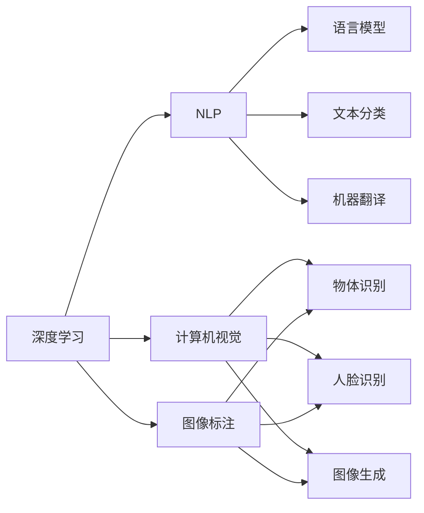

                 

# 李开复：AI 2.0 时代的意义

> 关键词：AI 2.0, 深度学习, 自然语言处理(NLP), 机器学习, 计算机视觉(CV), 人工智能, 大数据, 自动驾驶, 智慧城市

## 1. 背景介绍

### 1.1 问题由来

随着技术的飞速发展，人工智能(AI)领域正在经历着从1.0到2.0的深刻变革。这一变革不仅是技术的更新迭代，更是对人类未来社会、经济、生活的深远影响。在这场变革中，AI 2.0 正以它前所未有的力量，重新定义着科技、工业、教育、医疗等多个领域的发展路径。

### 1.2 问题核心关键点

AI 2.0时代，人工智能技术的核心驱动力是深度学习(Deep Learning)。这一范式相较于传统的符号主义(Symbolic AI)，通过数据驱动的方式，赋予机器以自主学习能力，从而在图像识别、自然语言处理、智能推荐等多个领域取得了突破性的进展。

AI 2.0的崛起得益于以下几个关键因素：

1. **大数据**：数据量级的爆炸式增长，为深度学习模型的训练提供了丰富的原料。
2. **计算力提升**：GPU、TPU等高性能计算设备的普及，使得大规模模型训练成为可能。
3. **算法创新**：深度学习算法的不断优化，如卷积神经网络(CNN)、循环神经网络(RNN)、Transformer等，为模型提供了强大的计算能力。
4. **数据标注工具**：图像标注、自然语言处理标注等工具的发展，极大地提升了数据获取和处理的效率。

这些因素共同推动了AI 2.0时代的到来，使得AI技术得以从实验室走向实用化、商业化，并开始影响社会的各个层面。

### 1.3 问题研究意义

深入理解AI 2.0时代的核心概念与技术，不仅对于从业者掌握前沿知识至关重要，也有助于公众更好地认识和利用AI技术。它帮助我们：

1. **提升技术水平**：通过学习深度学习、机器学习等AI核心技术，提升个人和团队的技术实力。
2. **拓展应用边界**：深入了解AI 2.0时代的应用场景，找到AI技术在各自领域内的潜在应用。
3. **预测未来发展**：把握AI技术的未来趋势，预见技术变革对社会、经济、文化等多方面的影响。
4. **应对挑战与机遇**：了解AI 2.0时代的挑战与机遇，制定有效的应对策略，最大化AI技术的社会价值。

本文旨在系统地介绍AI 2.0时代的重要概念和技术，并对AI 2.0的未来发展进行展望，以期对广大AI从业者和爱好者有所启发和帮助。

## 2. 核心概念与联系

### 2.1 核心概念概述

AI 2.0时代的核心概念包括深度学习、自然语言处理(NLP)、计算机视觉(CV)等。以下是这些关键概念的简要介绍及其相互联系：

- **深度学习**：通过多层神经网络进行学习，模拟人脑神经元之间的联接关系，从而实现对数据的深度抽象与处理。
- **自然语言处理(NLP)**：使机器能够理解和处理人类语言的技术，包括语言模型、文本分类、机器翻译、问答系统等。
- **计算机视觉(CV)**：使机器能够“看”和理解图像和视频的技术，包括物体识别、人脸识别、图像生成等。

这些技术相互联系，共同构成了AI 2.0时代的核心技术体系。深度学习为NLP和CV提供了强大的计算基础，而NLP和CV的进展，又进一步推动了深度学习的发展。

### 2.2 核心概念原理和架构的 Mermaid 流程图



这个流程图展示了深度学习、NLP和CV之间的联系和交互。深度学习是基础，NLP和CV在其上分别发展出不同的应用和技术。

## 3. 核心算法原理 & 具体操作步骤

### 3.1 算法原理概述

AI 2.0时代，深度学习技术是最核心的驱动力。其核心算法原理包括：

1. **前向传播**：将输入数据通过多层神经网络进行正向计算，生成模型输出。
2. **反向传播**：根据输出与真实标签的误差，通过链式法则计算各层参数的梯度，更新模型权重。
3. **损失函数**：度量模型输出与真实标签之间的差距，指导模型优化方向。
4. **优化算法**：如随机梯度下降(SGD)、Adam等，用于更新模型参数。

这些算法原理构成了深度学习的核心框架，使得AI 2.0时代能够高效处理各类数据，实现复杂任务的自动化处理。

### 3.2 算法步骤详解

AI 2.0时代，深度学习的应用步骤包括：

1. **数据准备**：收集、清洗、标注数据，准备训练集、验证集和测试集。
2. **模型选择与构建**：选择适合的深度学习模型架构，并进行初始化。
3. **模型训练**：将训练集输入模型，通过前向传播和反向传播更新模型参数，优化模型性能。
4. **模型评估**：使用验证集评估模型性能，调整超参数。
5. **模型测试**：使用测试集评估模型泛化能力，最终部署模型。

以NLP领域的情感分析任务为例，算法步骤详解如下：

**Step 1: 数据准备**

- 收集文本数据集，如电影评论、新闻文章等。
- 对文本进行清洗和分词处理。
- 为每个文本标注情感极性（如正、负、中性）。

**Step 2: 模型选择与构建**

- 选择RNN、LSTM、GRU或Transformer等模型架构。
- 设置模型参数，如隐藏层大小、学习率等。

**Step 3: 模型训练**

- 将文本数据分为训练集、验证集和测试集。
- 将文本数据输入模型，前向传播生成情感预测。
- 根据损失函数（如交叉熵）计算误差，反向传播更新模型参数。
- 在验证集上评估模型性能，调整超参数。

**Step 4: 模型评估**

- 在测试集上评估模型泛化能力。
- 调整模型参数，直到达到满意性能。

**Step 5: 模型测试**

- 将测试集输入模型，生成情感预测。
- 计算模型准确率、精确率、召回率等指标。

### 3.3 算法优缺点

深度学习算法在处理大规模数据时表现优异，但也存在一些显著的缺点：

**优点**：

1. **自动化处理**：深度学习能够自动发现数据中的复杂模式和特征，减少人工干预。
2. **泛化能力强**：深度学习模型经过大规模数据训练，通常具有较好的泛化能力。
3. **应用广泛**：深度学习在图像、语音、自然语言处理等领域都有广泛应用。

**缺点**：

1. **数据依赖性强**：深度学习模型需要大量的标注数据进行训练，数据质量对模型性能影响显著。
2. **计算资源消耗大**：大规模深度学习模型需要高性能计算设备，计算资源消耗大。
3. **模型可解释性差**：深度学习模型的“黑盒”特性，使得其决策过程难以解释。
4. **过拟合风险高**：在大规模数据集上训练深度学习模型时，容易出现过拟合问题。

### 3.4 算法应用领域

AI 2.0时代，深度学习技术已经被广泛应用于多个领域，具体包括：

1. **计算机视觉**：如物体识别、人脸识别、图像分割等。
2. **自然语言处理**：如机器翻译、情感分析、问答系统等。
3. **语音识别**：如自动语音识别(ASR)、文本到语音(TTS)等。
4. **自动驾驶**：如物体检测、车道线识别、交通标志识别等。
5. **智慧城市**：如智能交通、智慧安防、城市规划等。

这些应用展示了深度学习在各个领域中的巨大潜力，也标志着AI 2.0时代的到来。

## 4. 数学模型和公式 & 详细讲解 & 举例说明

### 4.1 数学模型构建

在AI 2.0时代，深度学习模型的数学模型通常包含多个神经网络层，以实现数据的逐层抽象和处理。以最简单的全连接神经网络为例，其数学模型构建如下：

- **输入层**：包含输入数据 $x$。
- **隐藏层**：包含多个神经元，通过权重矩阵 $W$ 和偏置向量 $b$ 进行线性变换，并引入激活函数 $f$。
- **输出层**：通过权重矩阵 $W$ 和偏置向量 $b$ 进行线性变换，并引入激活函数 $f$。

模型的前向传播过程可以表示为：

$$
h = f(xW_1 + b_1) \\
z = hW_2 + b_2 \\
y = f(z)
$$

其中 $x$ 为输入数据，$h$ 为隐藏层输出，$z$ 为输出层输入，$y$ 为最终输出。

### 4.2 公式推导过程

以二分类任务为例，推导使用sigmoid激活函数的二元分类器的损失函数。

设 $y$ 为真实标签，$y_h$ 为模型预测的输出（即隐藏层输出），损失函数定义为：

$$
L = -\frac{1}{N}\sum_{i=1}^N [y_i\log y_h + (1-y_i)\log (1-y_h)]
$$

其中 $N$ 为样本数量，$y_i$ 为样本的真实标签，$y_h$ 为模型预测的输出值。

损失函数的梯度计算公式为：

$$
\frac{\partial L}{\partial W} = -\frac{1}{N}\sum_{i=1}^N [(y_i-y_h)h_x] \\
\frac{\partial L}{\partial b} = -\frac{1}{N}\sum_{i=1}^N [y_i-y_h] \\
\frac{\partial L}{\partial h_x} = -\frac{1}{N}\sum_{i=1}^N [(y_i-y_h)h_x]
$$

其中 $h_x$ 为隐藏层的输入，即 $xW_1 + b_1$。

### 4.3 案例分析与讲解

以自然语言处理(NLP)中的情感分析任务为例，分析深度学习模型的实现步骤。

**Step 1: 数据准备**

- 收集电影评论数据集。
- 对评论文本进行清洗和分词处理。
- 对每个评论标注情感极性（如正、负、中性）。

**Step 2: 模型选择与构建**

- 选择LSTM或Transformer等模型架构。
- 设置模型参数，如隐藏层大小、学习率等。

**Step 3: 模型训练**

- 将评论数据分为训练集、验证集和测试集。
- 将评论数据输入模型，前向传播生成情感预测。
- 根据损失函数（如交叉熵）计算误差，反向传播更新模型参数。
- 在验证集上评估模型性能，调整超参数。

**Step 4: 模型评估**

- 在测试集上评估模型泛化能力。
- 调整模型参数，直到达到满意性能。

**Step 5: 模型测试**

- 将测试集输入模型，生成情感预测。
- 计算模型准确率、精确率、召回率等指标。

通过以上步骤，可以构建一个基于深度学习的情感分析模型。

## 5. 项目实践：代码实例和详细解释说明

### 5.1 开发环境搭建

在进行AI 2.0项目实践前，我们需要准备好开发环境。以下是使用Python进行PyTorch开发的环境配置流程：

1. 安装Anaconda：从官网下载并安装Anaconda，用于创建独立的Python环境。

2. 创建并激活虚拟环境：
```bash
conda create -n pytorch-env python=3.8 
conda activate pytorch-env
```

3. 安装PyTorch：根据CUDA版本，从官网获取对应的安装命令。例如：
```bash
conda install pytorch torchvision torchaudio cudatoolkit=11.1 -c pytorch -c conda-forge
```

4. 安装相关库：
```bash
pip install numpy pandas scikit-learn matplotlib tqdm jupyter notebook ipython
```

完成上述步骤后，即可在`pytorch-env`环境中开始项目实践。

### 5.2 源代码详细实现

这里我们以情感分析为例，给出使用PyTorch进行LSTM模型训练的代码实现。

```python
import torch
import torch.nn as nn
import torch.optim as optim
from torchtext.datasets import IMDB
from torchtext.data import Field, LabelField, TabularDataset

# 定义输入和输出字段
TEXT = Field(tokenize='spacy', lower=True, pad_first=True, pad_token='<PAD>')
LABEL = LabelField(num_classes=3, padding_idx=-1)

# 加载数据集
train_data, test_data = IMDB.splits(TEXT, LABEL)

# 构建词汇表
TEXT.build_vocab(train_data, min_freq=2)
LABEL.build_vocab(train_data)

# 定义模型
class LSTM(nn.Module):
    def __init__(self, input_size, hidden_size, output_size):
        super(LSTM, self).__init__()
        self.hidden_size = hidden_size
        self.embedding = nn.Embedding(input_size, hidden_size)
        self.lstm = nn.LSTM(hidden_size, hidden_size)
        self.fc = nn.Linear(hidden_size, output_size)
        
    def forward(self, x):
        x = self.embedding(x)
        output, (hidden, cell) = self.lstm(x)
        return self.fc(hidden[-1, :])

# 训练模型
model = LSTM(len(TEXT.vocab), 128, 3)
criterion = nn.CrossEntropyLoss()
optimizer = optim.Adam(model.parameters(), lr=0.001)

def train_epoch(model, data, batch_size):
    model.train()
    total_loss = 0
    for i, batch in enumerate(data):
        inputs, labels = batch
        optimizer.zero_grad()
        outputs = model(inputs)
        loss = criterion(outputs, labels)
        loss.backward()
        optimizer.step()
        total_loss += loss.item()
        if (i+1) % 100 == 0:
            print(f'Epoch {epoch+1}, batch {i+1}, loss: {total_loss/100:.4f}')
            total_loss = 0

def evaluate(model, data, batch_size):
    model.eval()
    total_correct = 0
    total_num = 0
    with torch.no_grad():
        for i, batch in enumerate(data):
            inputs, labels = batch
            outputs = model(inputs)
            _, predicted = torch.max(outputs.data, 1)
            total_correct += (predicted == labels).sum().item()
            total_num += predicted.size(0)
    print(f'Accuracy: {total_correct/total_num:.4f}')

# 定义数据集和迭代器
BATCH_SIZE = 64
train_iterator, test_iterator = iter(train_data), iter(test_data)

# 训练模型
for epoch in range(NUM_EPOCHS):
    train_epoch(model, train_iterator, BATCH_SIZE)
    evaluate(model, test_iterator, BATCH_SIZE)
```

以上代码展示了使用LSTM模型进行情感分析的完整训练过程。

### 5.3 代码解读与分析

**LSTM模型定义**：
```python
class LSTM(nn.Module):
    def __init__(self, input_size, hidden_size, output_size):
        super(LSTM, self).__init__()
        self.hidden_size = hidden_size
        self.embedding = nn.Embedding(input_size, hidden_size)
        self.lstm = nn.LSTM(hidden_size, hidden_size)
        self.fc = nn.Linear(hidden_size, output_size)
```

**模型训练函数train_epoch**：
```python
def train_epoch(model, data, batch_size):
    model.train()
    total_loss = 0
    for i, batch in enumerate(data):
        inputs, labels = batch
        optimizer.zero_grad()
        outputs = model(inputs)
        loss = criterion(outputs, labels)
        loss.backward()
        optimizer.step()
        total_loss += loss.item()
        if (i+1) % 100 == 0:
            print(f'Epoch {epoch+1}, batch {i+1}, loss: {total_loss/100:.4f}')
            total_loss = 0
```

**模型评估函数evaluate**：
```python
def evaluate(model, data, batch_size):
    model.eval()
    total_correct = 0
    total_num = 0
    with torch.no_grad():
        for i, batch in enumerate(data):
            inputs, labels = batch
            outputs = model(inputs)
            _, predicted = torch.max(outputs.data, 1)
            total_correct += (predicted == labels).sum().item()
            total_num += predicted.size(0)
    print(f'Accuracy: {total_correct/total_num:.4f}')
```

以上代码展示了模型的训练和评估过程。训练函数中，前向传播生成模型输出，反向传播更新模型参数，并在每个epoch结束时打印当前batch的平均损失。评估函数则计算模型在测试集上的准确率。

## 6. 实际应用场景

### 6.1 智能客服系统

智能客服系统是AI 2.0时代的重要应用之一。通过深度学习模型，客服系统可以自动理解用户问题，并给出准确的回复，提升用户体验和系统效率。

以问答系统为例，其核心在于理解用户意图和生成响应。通过训练基于Transformer的模型，可以实现高精度的意图识别和文本生成，使得客服系统能够24小时无间断服务，并提供多种自然语言支持。

### 6.2 金融舆情监测

金融舆情监测是AI 2.0时代的重要应用场景之一。通过深度学习模型，可以实时监测金融市场舆情，及时发现潜在风险，帮助金融机构进行风险控制和资产配置。

具体而言，可以收集金融新闻、社交媒体、财经评论等数据，使用情感分析、主题分类等技术，实时分析舆情变化，并给出风险预警。模型可以在新数据到来时，自动更新训练参数，确保模型的及时性和准确性。

### 6.3 个性化推荐系统

个性化推荐系统是AI 2.0时代的重要应用之一。通过深度学习模型，可以分析用户行为，理解用户兴趣，从而提供个性化推荐，提升用户满意度和转化率。

以电商推荐系统为例，通过收集用户浏览、购买、评价等行为数据，使用基于深度学习的推荐模型，分析用户兴趣和商品特征，生成个性化的推荐结果。通过不断的反馈调整，可以持续提升推荐效果，实现精准推荐。

## 7. 工具和资源推荐

### 7.1 学习资源推荐

为了帮助开发者系统掌握深度学习技术，以下是一些优质的学习资源：

1. 《深度学习》（Goodfellow等）：深度学习领域的经典教材，涵盖了深度学习的基础理论和实践技巧。
2. Coursera《深度学习专项课程》（Andrew Ng）：斯坦福大学教授Andrew Ng讲授的深度学习课程，系统讲解了深度学习的基本原理和应用。
3. Udacity《深度学习工程师纳米学位》：涵盖深度学习模型的构建、优化、应用等多个方面，适合有一定编程基础的开发者。
4. PyTorch官方文档：提供了丰富的深度学习模型和工具，适合快速上手实践。
5. TensorFlow官方文档：提供了多种深度学习模型和应用场景，适合大规模工程应用。

### 7.2 开发工具推荐

高效的开发离不开优秀的工具支持。以下是几款用于AI 2.0项目开发的常用工具：

1. PyTorch：基于Python的开源深度学习框架，灵活动态的计算图，适合快速迭代研究。
2. TensorFlow：由Google主导开发的开源深度学习框架，生产部署方便，适合大规模工程应用。
3. Weights & Biases：模型训练的实验跟踪工具，可以记录和可视化模型训练过程中的各项指标，方便对比和调优。
4. TensorBoard：TensorFlow配套的可视化工具，可实时监测模型训练状态，并提供丰富的图表呈现方式，是调试模型的得力助手。

### 7.3 相关论文推荐

深度学习技术在AI 2.0时代的发展离不开学界的持续研究。以下是几篇奠基性的相关论文，推荐阅读：

1. ImageNet大规模视觉识别竞赛（ILSVRC）：推动了计算机视觉领域的快速发展。
2. Google的BERT模型：提出了大规模预训练语言模型，推动了自然语言处理的发展。
3. OpenAI的GPT-3模型：展示了深度学习在语言生成任务上的强大能力。
4. Google的AlphaGo：通过深度强化学习，实现了人类在围棋领域的全面超越。
5. Facebook的Caffe2：提供了高效的深度学习框架，支持大规模模型训练和部署。

这些论文代表了大规模深度学习技术的发展脉络，通过学习这些前沿成果，可以帮助研究者把握学科前进方向，激发更多的创新灵感。

## 8. 总结：未来发展趋势与挑战

### 8.1 研究成果总结

AI 2.0时代，深度学习技术已经在多个领域取得了显著的成果，包括计算机视觉、自然语言处理、语音识别、自动驾驶等。这些技术的突破，不仅推动了人工智能技术的发展，也带来了诸多实际应用和商业价值。

### 8.2 未来发展趋势

展望未来，AI 2.0时代的深度学习技术将继续保持快速发展，以下是一些未来趋势：

1. **模型规模持续增大**：随着算力成本的下降和数据规模的扩张，深度学习模型的参数量将持续增长，能够处理更复杂、更大规模的数据。
2. **计算资源优化**：通过硬件加速、模型压缩等技术，提升深度学习模型的推理速度和资源效率。
3. **多模态融合**：将视觉、语音、文本等多模态数据进行融合，提升深度学习模型的综合处理能力。
4. **自监督学习**：利用未标注数据进行自监督学习，提升深度学习模型的泛化能力和自动化程度。
5. **弱监督学习**：在少量标注数据下，通过弱监督学习技术，提升深度学习模型的性能。

### 8.3 面临的挑战

尽管深度学习技术取得了显著的成果，但在迈向更加智能化、普适化应用的过程中，仍面临诸多挑战：

1. **数据依赖性强**：深度学习模型需要大量的标注数据进行训练，标注成本较高。
2. **模型可解释性差**：深度学习模型的“黑盒”特性，使得其决策过程难以解释。
3. **计算资源消耗大**：大规模深度学习模型需要高性能计算设备，计算资源消耗大。
4. **安全性和伦理问题**：深度学习模型可能学习到有害、偏见的知识，带来安全性、伦理问题。
5. **数据隐私保护**：在处理个人数据时，需要确保数据隐私和安全。

### 8.4 研究展望

为了应对这些挑战，未来研究需要在以下几个方面寻求新的突破：

1. **数据增强技术**：通过数据增强技术，利用生成对抗网络、回译等方法，提升数据集的多样性和质量。
2. **可解释性研究**：引入因果分析、符号化知识等方法，提升深度学习模型的可解释性和透明性。
3. **模型压缩与优化**：通过量化、剪枝等技术，优化深度学习模型的计算图，提升推理速度和资源效率。
4. **多模态融合**：将视觉、语音、文本等多模态数据进行融合，提升深度学习模型的综合处理能力。
5. **安全性与伦理研究**：引入伦理导向的评估指标，过滤和惩罚有害、偏见的输出，确保模型安全可靠。

这些研究方向，必将引领深度学习技术的进一步发展，为构建安全、可靠、可解释、可控的智能系统铺平道路。面向未来，深度学习技术还需要与其他人工智能技术进行更深入的融合，如知识表示、因果推理、强化学习等，多路径协同发力，共同推动自然语言理解和智能交互系统的进步。

## 9. 附录：常见问题与解答

**Q1: 深度学习算法的优点和缺点有哪些？**

A: 深度学习算法的优点包括：

1. 自动化处理：深度学习能够自动发现数据中的复杂模式和特征，减少人工干预。
2. 泛化能力强：深度学习模型经过大规模数据训练，通常具有较好的泛化能力。
3. 应用广泛：深度学习在图像、语音、自然语言处理等领域都有广泛应用。

深度学习算法的缺点包括：

1. 数据依赖性强：深度学习模型需要大量的标注数据进行训练，数据质量对模型性能影响显著。
2. 计算资源消耗大：大规模深度学习模型需要高性能计算设备，计算资源消耗大。
3. 模型可解释性差：深度学习模型的“黑盒”特性，使得其决策过程难以解释。
4. 过拟合风险高：在大规模数据集上训练深度学习模型时，容易出现过拟合问题。

**Q2: 深度学习算法在实际应用中如何避免过拟合？**

A: 深度学习算法在实际应用中可以通过以下方式避免过拟合：

1. 数据增强：通过回译、近义替换等方式扩充训练集。
2. 正则化技术：使用L2正则、Dropout、Early Stopping等避免模型过度适应小规模训练集。
3. 模型剪枝：去除不必要的层和参数，减小模型尺寸，加快推理速度。
4. 批量归一化：对输入数据进行归一化处理，提升模型稳定性和泛化能力。
5. 随机梯度下降：使用随机梯度下降(SGD)等优化算法，减少计算开销和内存消耗。

**Q3: 深度学习算法在应用中需要注意哪些问题？**

A: 在应用深度学习算法时，需要注意以下问题：

1. 数据质量：确保数据质量，避免噪音和噪声数据对模型性能的影响。
2. 超参数选择：选择合适的超参数，如学习率、批大小等，避免过拟合和欠拟合。
3. 模型评估：使用验证集评估模型性能，调整超参数。
4. 模型部署：确保模型在实际部署中高效、稳定、可解释。
5. 模型监控：实时监测模型性能，发现和解决潜在问题。

**Q4: 深度学习算法在工业应用中如何实现高性能推理？**

A: 在工业应用中实现高性能推理，需要考虑以下几个方面：

1. 模型优化：通过量化、剪枝、合并等技术，优化模型结构，减小推理内存占用和计算量。
2. 硬件加速：使用GPU、TPU等高性能计算设备，提升推理速度和计算效率。
3. 推理优化：通过推理优化技术，如动态图优化、代码注入等，提升推理性能。
4. 模型压缩：通过模型压缩技术，如参数压缩、算法优化等，减小推理内存占用和计算量。
5. 多模型融合：通过多模型融合技术，提升推理准确率和鲁棒性。

通过以上措施，可以显著提升深度学习模型在工业应用中的推理性能，实现高效、稳定、可解释的推理。

**Q5: 深度学习算法在实际应用中如何保证模型安全性和隐私保护？**

A: 在实际应用中，可以通过以下方式保证模型安全性和隐私保护：

1. 数据隐私保护：在处理个人数据时，确保数据隐私和安全，采用数据加密、匿名化等技术。
2. 模型安全评估：对模型进行安全性评估，确保模型不会学习到有害、偏见的知识。
3. 模型监控：实时监测模型行为，发现和解决潜在的安全问题。
4. 模型鲁棒性测试：通过对抗训练、鲁棒性测试等方法，提升模型鲁棒性和安全性。
5. 伦理导向评估：引入伦理导向的评估指标，确保模型符合人类价值观和伦理道德。

通过以上措施，可以确保深度学习模型在实际应用中的安全性、隐私保护和伦理道德。

---

作者：禅与计算机程序设计艺术 / Zen and the Art of Computer Programming

