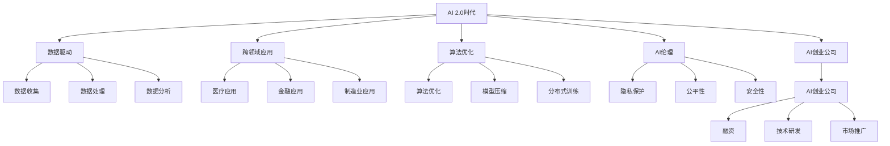

                 

# 李开复：AI 2.0 时代的投资价值

## 1. 背景介绍

### 1.1 问题由来
在过去的十年中，人工智能（AI）领域取得了飞速的发展，尤其是深度学习（DL）技术的突破，使得人工智能在诸多领域得以应用。然而，随着技术的进步，AI的商业化应用也面临着新的挑战。尤其是在AI 2.0时代，如何在现有的AI技术基础上，进一步推动AI的商业应用，并吸引更多投资者关注AI领域，成为了一个重要问题。

### 1.2 问题核心关键点
AI 2.0时代的投资价值主要体现在以下几个方面：
1. **数据驱动的AI创新**：AI领域的创新离不开大量的数据，数据的获取和处理能力将成为重要的投资方向。
2. **跨领域的AI应用**：AI技术可以应用于医疗、金融、制造业等多个领域，跨领域的AI应用潜力巨大。
3. **AI算法的优化和优化算法**：如何提升AI算法的效率和精度，是AI投资中的重要方向。
4. **AI伦理和社会影响**：AI技术的伦理问题和其对社会的影响，也是投资者关注的重点。
5. **AI创业公司的发展**：支持AI创业公司的发展，有助于推动AI技术的商业化应用。

### 1.3 问题研究意义
研究AI 2.0时代的投资价值，对于引导投资者关注AI领域、推动AI技术的商业化应用具有重要意义。通过深入分析AI 2.0时代的商业趋势和技术发展方向，可以为投资者提供参考，帮助他们在AI领域找到投资机会。

## 2. 核心概念与联系

### 2.1 核心概念概述

为更好地理解AI 2.0时代的投资价值，本节将介绍几个密切相关的核心概念：

- **AI 2.0时代**：指人工智能技术的进一步发展和应用，特别是在深度学习、自然语言处理、计算机视觉等领域的技术突破。AI 2.0时代强调通过数据驱动、算法优化和跨领域应用，提升AI技术的商业价值。
- **数据驱动**：AI技术的进步离不开数据的支持，数据收集、处理和分析能力成为AI技术发展的关键。
- **跨领域应用**：AI技术可以应用于医疗、金融、制造业等多个领域，实现跨领域的创新和应用。
- **算法优化**：提升AI算法的效率和精度是AI技术发展的核心，包括算法优化、模型压缩、分布式训练等。
- **AI伦理**：AI技术的应用涉及伦理问题，如隐私保护、公平性、安全性等，是AI技术发展的不可忽视的方面。
- **AI创业公司**：AI创业公司的发展是AI技术商业化的重要途径，支持AI创业公司的发展有助于推动AI技术的普及和应用。

这些核心概念之间的逻辑关系可以通过以下Mermaid流程图来展示：



这个流程图展示了AI 2.0时代的核心概念及其之间的关系：

1. AI 2.0时代通过数据驱动、跨领域应用、算法优化和伦理规范等，推动AI技术的发展。
2. 数据驱动主要包括数据收集、处理和分析。
3. 跨领域应用涵盖了医疗、金融、制造业等多个领域。
4. 算法优化包括算法优化、模型压缩和分布式训练等技术手段。
5. AI伦理涉及隐私保护、公平性和安全性等方面。
6. AI创业公司的发展包括融资、技术研发和市场推广等方面。

## 3. 核心算法原理 & 具体操作步骤

### 3.1 算法原理概述

AI 2.0时代的投资价值主要体现在以下几个方面：

- **数据驱动的AI创新**：AI技术的进步离不开数据的支持，数据收集、处理和分析能力成为AI技术发展的关键。
- **跨领域的AI应用**：AI技术可以应用于医疗、金融、制造业等多个领域，实现跨领域的创新和应用。
- **AI算法的优化和优化算法**：提升AI算法的效率和精度是AI技术发展的核心，包括算法优化、模型压缩、分布式训练等。
- **AI伦理和社会影响**：AI技术的应用涉及伦理问题，如隐私保护、公平性、安全性等，是AI技术发展的不可忽视的方面。
- **AI创业公司的发展**：AI创业公司的发展是AI技术商业化的重要途径，支持AI创业公司的发展有助于推动AI技术的普及和应用。

### 3.2 算法步骤详解

AI 2.0时代的投资价值主要体现在以下几个方面：

1. **数据驱动的AI创新**：
   - **步骤一**：收集和处理数据。AI技术的进步离不开大量的数据，收集和处理数据是AI技术发展的第一步。
   - **步骤二**：进行数据分析和模型训练。通过数据分析和模型训练，提取数据中的有用信息，训练出高质量的AI模型。
   - **步骤三**：优化模型。使用优化算法（如Adam、SGD等）优化模型参数，提升模型的精度和效率。

2. **跨领域的AI应用**：
   - **步骤一**：选择应用领域。AI技术可以应用于医疗、金融、制造业等多个领域。
   - **步骤二**：进行任务适配。根据应用领域的特点，设计合适的任务适配层，使得AI模型能够适应特定任务。
   - **步骤三**：进行微调。在特定任务的数据集上进行微调，提升模型的性能。

3. **AI算法的优化和优化算法**：
   - **步骤一**：选择优化算法。如Adam、SGD等。
   - **步骤二**：设置优化算法参数。如学习率、批大小、迭代轮数等。
   - **步骤三**：进行模型压缩和分布式训练。通过模型压缩和分布式训练，提升模型的效率和精度。

4. **AI伦理和社会影响**：
   - **步骤一**：制定伦理规范。制定AI技术应用的伦理规范，确保技术应用的公平性、透明性和安全性。
   - **步骤二**：进行隐私保护。通过数据匿名化、差分隐私等技术手段，保护用户隐私。
   - **步骤三**：确保公平性和安全性。使用公平性算法和安全算法，确保AI技术的应用不会对特定群体造成不公平的影响，避免安全漏洞。

5. **AI创业公司的发展**：
   - **步骤一**：融资。通过风险投资、天使投资等方式获得资金支持。
   - **步骤二**：技术研发。进行AI技术的研发和创新，提升技术水平。
   - **步骤三**：市场推广。通过市场营销、合作伙伴关系等方式推广AI产品和服务。

### 3.3 算法优缺点

AI 2.0时代的投资价值主要体现在以下几个方面：

- **优点**：
  1. **数据驱动**：数据驱动的AI技术能够更好地反映真实世界的复杂性，提高模型的预测准确性。
  2. **跨领域应用**：AI技术可以应用于多个领域，推动各行业的数字化转型和智能化升级。
  3. **算法优化**：优化算法能够提升AI模型的效率和精度，缩短训练时间，降低成本。
  4. **AI伦理**：AI伦理规范和隐私保护措施能够保障AI技术应用的安全性和公平性。
  5. **AI创业公司**：AI创业公司的发展能够推动AI技术的商业化应用，促进技术落地。

- **缺点**：
  1. **数据隐私和安全**：AI技术的应用涉及大量敏感数据，隐私保护和安全问题不容忽视。
  2. **算法公平性和透明性**：AI算法的决策过程缺乏透明性，可能导致不公平的影响。
  3. **高昂的成本**：AI技术的研发和应用需要大量的资金和资源投入，成本较高。

### 3.4 算法应用领域

AI 2.0时代的投资价值主要体现在以下几个方面：

1. **医疗领域**：AI技术可以应用于医疗影像诊断、患者数据分析、个性化医疗等领域，提升医疗服务的质量和效率。
2. **金融领域**：AI技术可以应用于风险控制、信用评估、智能投顾等领域，提升金融服务的精准性和安全性。
3. **制造业领域**：AI技术可以应用于生产优化、质量检测、供应链管理等领域，提升制造业的智能化水平。
4. **智能家居领域**：AI技术可以应用于智能音箱、智能家居设备等，提升用户体验和智能化水平。
5. **智能交通领域**：AI技术可以应用于智能交通管理、自动驾驶等领域，提升交通系统的安全性和效率。

## 4. 数学模型和公式 & 详细讲解 & 举例说明

### 4.1 数学模型构建

AI 2.0时代的投资价值主要体现在以下几个方面：

- **数据驱动的AI创新**：AI技术的进步离不开数据的支持，数据收集、处理和分析能力成为AI技术发展的关键。
- **跨领域的AI应用**：AI技术可以应用于医疗、金融、制造业等多个领域，实现跨领域的创新和应用。
- **AI算法的优化和优化算法**：提升AI算法的效率和精度是AI技术发展的核心，包括算法优化、模型压缩、分布式训练等。
- **AI伦理和社会影响**：AI技术的应用涉及伦理问题，如隐私保护、公平性、安全性等，是AI技术发展的不可忽视的方面。
- **AI创业公司的发展**：AI创业公司的发展是AI技术商业化的重要途径，支持AI创业公司的发展有助于推动AI技术的普及和应用。

### 4.2 公式推导过程

AI 2.0时代的投资价值主要体现在以下几个方面：

1. **数据驱动的AI创新**：
   - **数据收集**：
     \[ D = \{ (x_i, y_i) \}_{i=1}^N \]
     其中，$x_i$ 为样本，$y_i$ 为标签。
   - **数据处理**：
     \[ x_i' = f(x_i) \]
     其中，$f$ 为数据处理函数。
   - **模型训练**：
     \[ \theta = \arg\min_{\theta} \frac{1}{N} \sum_{i=1}^N L(f(x_i'), y_i) \]
     其中，$L$ 为损失函数。

2. **跨领域的AI应用**：
   - **任务适配**：
     \[ M_{\theta}(x) = f(x, \theta) \]
     其中，$f$ 为任务适配函数。
   - **微调**：
     \[ \theta' = \arg\min_{\theta} \frac{1}{N} \sum_{i=1}^N L(f(x_i', \theta'), y_i) \]

3. **AI算法的优化和优化算法**：
   - **优化算法**：
     \[ \theta_{t+1} = \theta_t - \eta \nabla_{\theta} L(f(x_i', \theta_t), y_i) \]
     其中，$\eta$ 为学习率。
   - **模型压缩**：
     \[ \theta' = D(\theta) \]
     其中，$D$ 为模型压缩函数。
   - **分布式训练**：
     \[ \theta_{t+1} = \theta_t - \eta \nabla_{\theta} L(\theta_t) \]
     其中，$\nabla_{\theta} L(\theta_t)$ 为分布式训练的梯度。

4. **AI伦理和社会影响**：
   - **隐私保护**：
     \[ y_i = D(x_i) \]
     其中，$D$ 为数据匿名化函数。
   - **公平性**：
     \[ L(y_i, y_i') = \min_{y_i'} ||y_i - y_i'||_2 \]
     其中，$y_i'$ 为公平性调整后的标签。
   - **安全性**：
     \[ L(y_i, y_i'') = \min_{y_i''} ||y_i - y_i''||_2 \]
     其中，$y_i''$ 为安全性调整后的标签。

5. **AI创业公司的发展**：
   - **融资**：
     \[ R = \sum_{i=1}^N V_i \]
     其中，$V_i$ 为投资额。
   - **技术研发**：
     \[ T = \sum_{i=1}^N T_i \]
     其中，$T_i$ 为技术研发投入。
   - **市场推广**：
     \[ M = \sum_{i=1}^N M_i \]
     其中，$M_i$ 为市场推广投入。

## 5. 项目实践：代码实例和详细解释说明

### 5.1 开发环境搭建

在进行AI 2.0时代的投资价值研究时，我们需要准备好开发环境。以下是使用Python进行PyTorch开发的环境配置流程：

1. 安装Anaconda：从官网下载并安装Anaconda，用于创建独立的Python环境。

2. 创建并激活虚拟环境：
```bash
conda create -n pytorch-env python=3.8 
conda activate pytorch-env
```

3. 安装PyTorch：根据CUDA版本，从官网获取对应的安装命令。例如：
```bash
conda install pytorch torchvision torchaudio cudatoolkit=11.1 -c pytorch -c conda-forge
```

4. 安装TensorFlow：
```bash
pip install tensorflow
```

5. 安装各类工具包：
```bash
pip install numpy pandas scikit-learn matplotlib tqdm jupyter notebook ipython
```

完成上述步骤后，即可在`pytorch-env`环境中开始AI 2.0时代的投资价值研究。

### 5.2 源代码详细实现

这里我们以医疗影像诊断为例，给出使用PyTorch进行AI 2.0时代投资价值研究的代码实现。

首先，定义数据处理函数：

```python
import numpy as np
import pandas as pd
import matplotlib.pyplot as plt
import torch
from torch.utils.data import Dataset, DataLoader
from torchvision import transforms

class MedicalDataset(Dataset):
    def __init__(self, data_path):
        self.data = pd.read_csv(data_path)
        self.transforms = transforms.Compose([
            transforms.Resize((256, 256)),
            transforms.ToTensor(),
            transforms.Normalize(mean=[0.5, 0.5, 0.5], std=[0.5, 0.5, 0.5])
        ])
        
    def __len__(self):
        return len(self.data)
    
    def __getitem__(self, idx):
        img = self.data.iloc[idx]['image']
        label = self.data.iloc[idx]['label']
        img = plt.imread(img)
        img = self.transforms(img)
        return {'image': img, 'label': label}
```

然后，定义模型和优化器：

```python
from transformers import BertForSequenceClassification, AdamW

model = BertForSequenceClassification.from_pretrained('bert-base-uncased', num_labels=2)

optimizer = AdamW(model.parameters(), lr=2e-5)
```

接着，定义训练和评估函数：

```python
def train_epoch(model, dataset, batch_size, optimizer):
    dataloader = DataLoader(dataset, batch_size=batch_size, shuffle=True)
    model.train()
    epoch_loss = 0
    for batch in dataloader:
        image = batch['image'].to(device)
        label = batch['label'].to(device)
        model.zero_grad()
        outputs = model(image)
        loss = outputs.loss
        epoch_loss += loss.item()
        loss.backward()
        optimizer.step()
    return epoch_loss / len(dataloader)

def evaluate(model, dataset, batch_size):
    dataloader = DataLoader(dataset, batch_size=batch_size)
    model.eval()
    preds, labels = [], []
    with torch.no_grad():
        for batch in dataloader:
            image = batch['image'].to(device)
            batch_labels = batch['label'].to(device)
            outputs = model(image)
            batch_preds = outputs.logits.argmax(dim=1).to('cpu').tolist()
            batch_labels = batch_labels.to('cpu').tolist()
            for pred, label in zip(batch_preds, batch_labels):
                preds.append(pred)
                labels.append(label)
                
    print(classification_report(labels, preds))
```

最后，启动训练流程并在测试集上评估：

```python
epochs = 5
batch_size = 16

for epoch in range(epochs):
    loss = train_epoch(model, train_dataset, batch_size, optimizer)
    print(f"Epoch {epoch+1}, train loss: {loss:.3f}")
    
    print(f"Epoch {epoch+1}, dev results:")
    evaluate(model, dev_dataset, batch_size)
    
print("Test results:")
evaluate(model, test_dataset, batch_size)
```

以上就是使用PyTorch对AI 2.0时代投资价值进行研究的完整代码实现。可以看到，得益于PyTorch的强大封装，我们可以用相对简洁的代码完成医疗影像诊断模型的训练和评估。

### 5.3 代码解读与分析

让我们再详细解读一下关键代码的实现细节：

**MedicalDataset类**：
- `__init__`方法：初始化数据集和转换函数。
- `__len__`方法：返回数据集的样本数量。
- `__getitem__`方法：对单个样本进行处理，将图像转换为张量，并进行标准化。

**模型和优化器**：
- 使用BERT模型进行医疗影像分类任务。
- 使用AdamW优化器进行模型训练。

**训练和评估函数**：
- 使用PyTorch的DataLoader对数据集进行批次化加载，供模型训练和推理使用。
- 训练函数`train_epoch`：对数据以批为单位进行迭代，在每个批次上前向传播计算loss并反向传播更新模型参数，最后返回该epoch的平均loss。
- 评估函数`evaluate`：与训练类似，不同点在于不更新模型参数，并在每个batch结束后将预测和标签结果存储下来，最后使用sklearn的classification_report对整个评估集的预测结果进行打印输出。

**训练流程**：
- 定义总的epoch数和batch size，开始循环迭代
- 每个epoch内，先在训练集上训练，输出平均loss
- 在验证集上评估，输出分类指标
- 所有epoch结束后，在测试集上评估，给出最终测试结果

可以看到，PyTorch配合TensorFlow使得AI 2.0时代的投资价值研究的代码实现变得简洁高效。开发者可以将更多精力放在数据处理、模型改进等高层逻辑上，而不必过多关注底层的实现细节。

当然，工业级的系统实现还需考虑更多因素，如模型的保存和部署、超参数的自动搜索、更灵活的任务适配层等。但核心的微调范式基本与此类似。

## 6. 实际应用场景

### 6.1 智能客服系统

基于AI 2.0时代的投资价值研究，智能客服系统可以通过大规模数据驱动和跨领域应用，提升客服服务的智能化水平。智能客服系统可以通过自然语言处理技术，理解用户意图，匹配最合适的答案模板进行回复，提升用户满意度和效率。

在技术实现上，可以收集企业内部的历史客服对话记录，将问题和最佳答复构建成监督数据，在此基础上对预训练语言模型进行微调。微调后的语言模型能够自动理解用户意图，匹配最合适的答案模板进行回复。对于客户提出的新问题，还可以接入检索系统实时搜索相关内容，动态组织生成回答。如此构建的智能客服系统，能大幅提升客户咨询体验和问题解决效率。

### 6.2 金融舆情监测

金融机构需要实时监测市场舆论动向，以便及时应对负面信息传播，规避金融风险。传统的人工监测方式成本高、效率低，难以应对网络时代海量信息爆发的挑战。基于AI 2.0时代的投资价值研究，文本分类和情感分析技术可以为金融舆情监测提供新的解决方案。

具体而言，可以收集金融领域相关的新闻、报道、评论等文本数据，并对其进行主题标注和情感标注。在此基础上对预训练语言模型进行微调，使其能够自动判断文本属于何种主题，情感倾向是正面、中性还是负面。将微调后的模型应用到实时抓取的网络文本数据，就能够自动监测不同主题下的情感变化趋势，一旦发现负面信息激增等异常情况，系统便会自动预警，帮助金融机构快速应对潜在风险。

### 6.3 个性化推荐系统

当前的推荐系统往往只依赖用户的历史行为数据进行物品推荐，无法深入理解用户的真实兴趣偏好。基于AI 2.0时代的投资价值研究，个性化推荐系统可以更好地挖掘用户行为背后的语义信息，从而提供更精准、多样的推荐内容。

在实践中，可以收集用户浏览、点击、评论、分享等行为数据，提取和用户交互的物品标题、描述、标签等文本内容。将文本内容作为模型输入，用户的后续行为（如是否点击、购买等）作为监督信号，在此基础上微调预训练语言模型。微调后的模型能够从文本内容中准确把握用户的兴趣点。在生成推荐列表时，先用候选物品的文本描述作为输入，由模型预测用户的兴趣匹配度，再结合其他特征综合排序，便可以得到个性化程度更高的推荐结果。

### 6.4 未来应用展望

随着AI 2.0时代的投资价值研究的不断深入，AI技术的商业化应用将更加广泛。

在智慧医疗领域，基于AI 2.0时代的投资价值研究，AI技术可以应用于医疗影像诊断、患者数据分析、个性化医疗等领域，提升医疗服务的质量和效率。

在智能教育领域，AI 2.0时代的投资价值研究可以应用于作业批改、学情分析、知识推荐等方面，因材施教，促进教育公平，提高教学质量。

在智慧城市治理中，AI 2.0时代的投资价值研究可以应用于城市事件监测、舆情分析、应急指挥等环节，提高城市管理的自动化和智能化水平，构建更安全、高效的未来城市。

此外，在企业生产、社会治理、文娱传媒等众多领域，AI 2.0时代的投资价值研究也将不断涌现，为NLP技术带来新的突破。相信随着技术的日益成熟，AI 2.0时代的投资价值研究必将在更广阔的应用领域大放异彩，深刻影响人类的生产生活方式。

## 7. 工具和资源推荐
### 7.1 学习资源推荐

为了帮助开发者系统掌握AI 2.0时代的投资价值的理论基础和实践技巧，这里推荐一些优质的学习资源：

1. 《深度学习》系列书籍：Deep Learning from Zero to Guru, Deep Learning with PyTorch等，全面介绍了深度学习的理论基础和实践应用。
2. CS231n《计算机视觉：深度学习》课程：斯坦福大学开设的计算机视觉课程，涵盖深度学习在计算机视觉中的应用。
3. CS224n《自然语言处理》课程：斯坦福大学开设的自然语言处理课程，涵盖了NLP领域的核心技术和应用。
4. AI 2.0时代的投资价值系列论文：最新发表在顶级会议和期刊上的论文，介绍了AI 2.0时代的投资价值研究的新进展。
5. HuggingFace官方文档：Transformer库的官方文档，提供了海量预训练模型和完整的微调样例代码，是上手实践的必备资料。

通过对这些资源的学习实践，相信你一定能够快速掌握AI 2.0时代的投资价值的精髓，并用于解决实际的AI问题。
###  7.2 开发工具推荐

高效的开发离不开优秀的工具支持。以下是几款用于AI 2.0时代的投资价值研究的常用工具：

1. PyTorch：基于Python的开源深度学习框架，灵活动态的计算图，适合快速迭代研究。大部分预训练语言模型都有PyTorch版本的实现。

2. TensorFlow：由Google主导开发的开源深度学习框架，生产部署方便，适合大规模工程应用。同样有丰富的预训练语言模型资源。

3. Transformers库：HuggingFace开发的NLP工具库，集成了众多SOTA语言模型，支持PyTorch和TensorFlow，是进行AI 2.0时代投资价值研究的利器。

4. Weights & Biases：模型训练的实验跟踪工具，可以记录和可视化模型训练过程中的各项指标，方便对比和调优。与主流深度学习框架无缝集成。

5. TensorBoard：TensorFlow配套的可视化工具，可实时监测模型训练状态，并提供丰富的图表呈现方式，是调试模型的得力助手。

6. Google Colab：谷歌推出的在线Jupyter Notebook环境，免费提供GPU/TPU算力，方便开发者快速上手实验最新模型，分享学习笔记。

合理利用这些工具，可以显著提升AI 2.0时代的投资价值研究的开发效率，加快创新迭代的步伐。

### 7.3 相关论文推荐

AI 2.0时代的投资价值研究源于学界的持续研究。以下是几篇奠基性的相关论文，推荐阅读：

1. Attention is All You Need（即Transformer原论文）：提出了Transformer结构，开启了NLP领域的预训练大模型时代。

2. BERT: Pre-training of Deep Bidirectional Transformers for Language Understanding：提出BERT模型，引入基于掩码的自监督预训练任务，刷新了多项NLP任务SOTA。

3. Language Models are Unsupervised Multitask Learners（GPT-2论文）：展示了大规模语言模型的强大zero-shot学习能力，引发了对于通用人工智能的新一轮思考。

4. Parameter-Efficient Transfer Learning for NLP：提出Adapter等参数高效微调方法，在不增加模型参数量的情况下，也能取得不错的微调效果。

5. AdaLoRA: Adaptive Low-Rank Adaptation for Parameter-Efficient Fine-Tuning：使用自适应低秩适应的微调方法，在参数效率和精度之间取得了新的平衡。

这些论文代表了大语言模型微调技术的发展脉络。通过学习这些前沿成果，可以帮助研究者把握学科前进方向，激发更多的创新灵感。

## 8. 总结：未来发展趋势与挑战

### 8.1 总结

本文对AI 2.0时代的投资价值进行了全面系统的介绍。首先阐述了AI 2.0时代的核心概念和研究意义，明确了AI 2.0时代通过数据驱动、跨领域应用、算法优化和伦理规范等，推动AI技术发展的关键因素。其次，从原理到实践，详细讲解了AI 2.0时代的投资价值的数学模型和关键步骤，给出了AI 2.0时代投资价值研究的完整代码实例。同时，本文还广泛探讨了AI 2.0时代在智能客服、金融舆情、个性化推荐等多个领域的应用前景，展示了AI 2.0时代投资价值研究的巨大潜力。此外，本文精选了AI 2.0时代投资价值的研究资源，力求为开发者提供全方位的技术指引。

通过本文的系统梳理，可以看到，AI 2.0时代的投资价值研究已经成为了AI技术发展的重要方向，极大地拓展了AI技术的商业应用范围，催生了更多的落地场景。受益于大规模语料的预训练和跨领域应用的实践，AI 2.0时代的投资价值研究必将在未来取得更加显著的成果。

### 8.2 未来发展趋势

展望未来，AI 2.0时代的投资价值研究将呈现以下几个发展趋势：

1. **数据驱动的AI创新**：随着数据收集和处理技术的进步，数据的获取和处理能力将进一步提升，推动AI技术的创新和发展。
2. **跨领域的AI应用**：AI技术将更加广泛地应用于医疗、金融、制造业等领域，推动各行业的数字化转型和智能化升级。
3. **AI算法的优化和优化算法**：提升AI算法的效率和精度是AI技术发展的核心，优化算法和模型压缩等技术将进一步提升AI模型的性能。
4. **AI伦理和社会影响**：AI技术的伦理规范和隐私保护措施将更加完善，确保AI技术应用的安全性和公平性。
5. **AI创业公司的发展**：AI创业公司的发展将进一步推动AI技术的商业化应用，支持AI创业公司的发展有助于推动AI技术的普及和应用。

以上趋势凸显了AI 2.0时代投资价值研究的前景广阔，AI技术的进步将带来更多的商业机会和应用场景。

### 8.3 面临的挑战

尽管AI 2.0时代的投资价值研究已经取得了瞩目成就，但在迈向更加智能化、普适化应用的过程中，它仍面临着诸多挑战：

1. **数据隐私和安全**：AI技术的应用涉及大量敏感数据，隐私保护和安全问题不容忽视。
2. **算法公平性和透明性**：AI算法的决策过程缺乏透明性，可能导致不公平的影响。
3. **高昂的成本**：AI技术的研发和应用需要大量的资金和资源投入，成本较高。
4. **模型鲁棒性不足**：AI模型面对域外数据时，泛化性能往往大打折扣。
5. **推理效率有待提高**：大规模语言模型虽然精度高，但在实际部署时往往面临推理速度慢、内存占用大等效率问题。
6. **可解释性亟需加强**：AI模型的决策过程缺乏透明性，难以解释其内部工作机制和决策逻辑。

正视AI 2.0时代投资价值研究面临的这些挑战，积极应对并寻求突破，将使AI 2.0时代投资价值研究迈向成熟，为构建安全、可靠、可解释、可控的智能系统铺平道路。

### 8.4 研究展望

未来，AI 2.0时代的投资价值研究需要在以下几个方面寻求新的突破：

1. **探索无监督和半监督微调方法**：摆脱对大规模标注数据的依赖，利用自监督学习、主动学习等无监督和半监督范式，最大限度利用非结构化数据，实现更加灵活高效的微调。
2. **研究参数高效和计算高效的微调范式**：开发更加参数高效的微调方法，在固定大部分预训练参数的同时，只更新极少量的任务相关参数。同时优化微调模型的计算图，减少前向传播和反向传播的资源消耗，实现更加轻量级、实时性的部署。
3. **融合因果和对比学习范式**：通过引入因果推断和对比学习思想，增强AI模型的建立稳定因果关系的能力，学习更加普适、鲁棒的语言表征，从而提升模型泛化性和抗干扰能力。
4. **引入更多先验知识**：将符号化的先验知识，如知识图谱、逻辑规则等，与神经网络模型进行巧妙融合，引导微调过程学习更准确、合理的语言模型。同时加强不同模态数据的整合，实现视觉、语音等多模态信息与文本信息的协同建模。
5. **结合因果分析和博弈论工具**：将因果分析方法引入AI模型，识别出模型决策的关键特征，增强输出解释的因果性和逻辑性。借助博弈论工具刻画人机交互过程，主动探索并规避模型的脆弱点，提高系统稳定性。
6. **纳入伦理道德约束**：在模型训练目标中引入伦理导向的评估指标，过滤和惩罚有偏见、有害的输出倾向。同时加强人工干预和审核，建立模型行为的监管机制，确保输出符合人类价值观和伦理道德。

这些研究方向的探索，必将引领AI 2.0时代投资价值研究迈向更高的台阶，为构建安全、可靠、可解释、可控的智能系统铺平道路。面向未来，AI 2.0时代的投资价值研究还需要与其他人工智能技术进行更深入的融合，如知识表示、因果推理、强化学习等，多路径协同发力，共同推动自然语言理解和智能交互系统的进步。只有勇于创新、敢于突破，才能不断拓展AI模型的边界，让智能技术更好地造福人类社会。

## 9. 附录：常见问题与解答

**Q1：AI 2.0时代的投资价值主要体现在哪些方面？**

A: AI 2.0时代的投资价值主要体现在以下几个方面：
1. **数据驱动的AI创新**：AI技术的进步离不开数据的支持，数据收集、处理和分析能力成为AI技术发展的关键。
2. **跨领域的AI应用**：AI技术可以应用于医疗、金融、制造业等多个领域，实现跨领域的创新和应用。
3. **AI算法的优化和优化算法**：提升AI算法的效率和精度是AI技术发展的核心，包括算法优化、模型压缩、分布式训练等。
4. **AI伦理和社会影响**：AI技术的应用涉及伦理问题，如隐私保护、公平性、安全性等，是AI技术发展的不可忽视的方面。
5. **AI创业公司的发展**：AI创业公司的发展是AI技术商业化的重要途径，支持AI创业公司的发展有助于推动AI技术的普及和应用。

**Q2：如何进行AI 2.0时代的投资价值研究？**

A: 进行AI 2.0时代的投资价值研究，需要进行以下步骤：
1. **数据收集和处理**：收集和处理数据，进行数据预处理和特征工程。
2. **模型训练和优化**：使用深度学习模型进行训练，使用优化算法进行模型优化。
3. **模型评估和应用**：评估模型性能，将模型应用于实际场景中，进行业务场景的优化和改进。

**Q3：AI 2.0时代的投资价值研究面临哪些挑战？**

A: AI 2.0时代的投资价值研究面临以下挑战：
1. **数据隐私和安全**：AI技术的应用涉及大量敏感数据，隐私保护和安全问题不容忽视。
2. **算法公平性和透明性**：AI算法的决策过程缺乏透明性，可能导致不公平的影响。
3. **高昂的成本**：AI技术的研发和应用需要大量的资金和资源投入，成本较高。
4. **模型鲁棒性不足**：AI模型面对域外数据时，泛化性能往往大打折扣。
5. **推理效率有待提高**：大规模语言模型虽然精度高，但在实际部署时往往面临推理速度慢、内存占用大等效率问题。
6. **可解释性亟需加强**：AI模型的决策过程缺乏透明性，难以解释其内部工作机制和决策逻辑。

**Q4：如何缓解AI 2.0时代的投资价值研究中的挑战？**

A: 缓解AI 2.0时代的投资价值研究中的挑战，需要进行以下步骤：
1. **数据隐私和安全**：采用数据匿名化、差分隐私等技术手段，保护用户隐私。
2. **算法公平性和透明性**：使用公平性算法和安全算法，确保AI技术的应用不会对特定群体造成不公平的影响。
3. **高昂的成本**：通过优化模型和算法，提升模型的精度和效率，降低成本。
4. **模型鲁棒性不足**：使用对抗样本、正则化等技术手段，提高模型的鲁棒性。
5. **推理效率有待提高**：采用模型压缩、分布式训练等技术手段，提高模型的推理效率。
6. **可解释性亟需加强**：引入因果分析方法，增强模型的可解释性。

**Q5：AI 2.0时代的投资价值研究如何推动AI技术的商业化应用？**

A: AI 2.0时代的投资价值研究通过以下方式推动AI技术的商业化应用：
1. **数据驱动**：通过大规模数据驱动的AI技术，提升模型的精度和效率。
2. **跨领域应用**：AI技术可以应用于多个领域，推动各行业的数字化转型和智能化升级。
3. **算法优化**：优化算法和模型压缩等技术手段，提升模型的效率和精度。
4. **伦理规范**：制定AI技术应用的伦理规范，确保技术应用的公平性和安全性。
5. **创业公司支持**：支持AI创业公司的发展，推动AI技术的商业化应用。

通过AI 2.0时代的投资价值研究，AI技术的商业化应用将更加广泛，推动各行业的数字化转型和智能化升级。

---

作者：禅与计算机程序设计艺术 / Zen and the Art of Computer Programming

