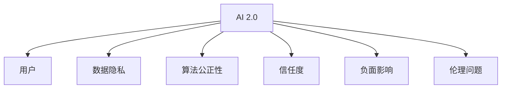

                 

# 李开复：AI 2.0 时代的用户

> 关键词：人工智能, AI 2.0, 用户, 机器学习, 深度学习, 自动化, 数据驱动

## 1. 背景介绍

### 1.1 问题由来

随着人工智能技术的迅猛发展，我们正处在一个被称为AI 2.0的新时代。这个时代，人工智能不仅在技术上取得了突破，而且在商业应用和用户体验上也有了长足的进步。但是，尽管AI技术的发展令人瞩目，用户对其的认知和接受程度仍然存在不少问题。例如，用户对AI的信任度较低，担心数据隐私和算法公正性，以及对AI的负面影响感到忧虑。因此，本文将探讨AI 2.0时代用户面临的挑战，并提出一些策略，帮助用户更好地适应和接受AI技术。

### 1.2 问题核心关键点

AI 2.0时代的用户面临的核心挑战包括：

- **数据隐私**：用户对数据被收集、存储和使用的担忧。
- **算法公正性**：用户担心AI算法可能存在偏见或歧视，影响公平性。
- **信任度**：用户对AI技术的不信任，影响其应用普及。
- **负面影响**：用户担忧AI技术可能带来失业、决策错误等负面后果。
- **伦理问题**：AI技术的开发和应用过程中，如何平衡技术进步与社会伦理。

## 2. 核心概念与联系

### 2.1 核心概念概述

为了更好地理解AI 2.0时代用户的挑战，我们需要对一些核心概念进行概述：

- **AI 2.0**：继AI 1.0的符号计算、专家系统和AI 3.0的深度学习和强化学习之后，AI 2.0强调的是基于大数据和深度学习技术的自主学习和自我优化。

- **用户**：AI 2.0时代，用户不仅仅是技术的被动接受者，更是技术的参与者和受益者。

- **数据隐私**：指个人或企业的数据在收集、存储、处理和使用过程中，如何保护用户隐私不受侵害。

- **算法公正性**：AI算法在处理数据时，是否能够避免偏见和歧视，确保所有群体都能公平受益。

- **信任度**：用户对AI技术的信任程度，直接影响其对AI技术的接受和应用。

- **负面影响**：AI技术可能带来的负面后果，如就业岗位消失、决策错误等。

- **伦理问题**：AI技术的开发和应用过程中，如何平衡技术进步与社会伦理，避免技术滥用。

### 2.2 核心概念原理和架构的 Mermaid 流程图



这个流程图展示了AI 2.0与用户的紧密联系以及面临的多重挑战。

## 3. 核心算法原理 & 具体操作步骤

### 3.1 算法原理概述

AI 2.0时代，用户面临的挑战可以通过一系列算法和技术来应对。这些算法和技术主要包括：

- **深度学习**：用于自动提取和处理大量数据，帮助AI系统进行自主学习和优化。
- **数据隐私保护**：通过加密、匿名化和去标识化等技术，保护用户数据隐私。
- **算法公正性**：通过公平性评估和偏见检测算法，确保AI算法的公正性。
- **用户信任建立**：通过透明化算法和结果，增强用户对AI技术的信任。
- **负面影响规避**：通过风险评估和监控系统，规避AI技术的负面影响。
- **伦理框架制定**：通过伦理审查和标准制定，确保AI技术的开发和应用符合社会伦理。

### 3.2 算法步骤详解

AI 2.0时代用户面临的挑战可以通过以下步骤进行应对：

1. **数据隐私保护**：
   - 数据加密：采用AES、RSA等加密算法，保护数据传输和存储安全。
   - 匿名化：使用K-匿名和L-多样性等方法，隐藏用户身份信息。
   - 去标识化：删除或模糊处理个人身份信息，减少隐私泄露风险。

2. **算法公正性保障**：
   - 偏见检测：通过分析训练数据和模型输出，识别和纠正偏见。
   - 公平性评估：使用公平性指标（如等价组之间的差异），评估算法公正性。
   - 多样性增强：在训练数据中引入多样性，减少算法偏见。

3. **用户信任建立**：
   - 透明化算法：公开算法逻辑和决策过程，增强用户理解。
   - 结果可解释：采用可解释性技术（如LIME、SHAP），帮助用户理解AI决策。
   - 用户参与：设计用户界面，让用户参与决策过程。

4. **负面影响规避**：
   - 风险评估：采用风险评估模型，识别潜在风险和负面影响。
   - 监控系统：建立监控系统，实时检测和处理异常情况。
   - 应急响应：制定应急预案，快速响应和解决负面影响。

5. **伦理框架制定**：
   - 伦理审查：建立伦理委员会，对AI项目进行审查。
   - 标准制定：制定AI伦理标准和指南，确保技术合规。
   - 社会影响评估：评估AI技术对社会的影响，提出改进措施。

### 3.3 算法优缺点

AI 2.0时代用户面临的挑战可以通过以下算法和技术进行应对，但同时也存在一些优缺点：

**优点**：
- 数据隐私保护：通过加密和匿名化等技术，有效保护用户数据隐私。
- 算法公正性保障：通过偏见检测和公平性评估，确保算法公正性。
- 用户信任建立：通过透明化和可解释性技术，增强用户信任。
- 负面影响规避：通过风险评估和监控系统，规避潜在负面影响。
- 伦理框架制定：通过伦理审查和标准制定，确保技术合规。

**缺点**：
- 数据隐私保护：加密和匿名化等技术增加了计算复杂度，可能影响性能。
- 算法公正性保障：偏见检测和公平性评估需要大量数据和复杂算法，可能存在误差。
- 用户信任建立：透明化和可解释性技术可能需要额外的时间和资源。
- 负面影响规避：风险评估和监控系统需要持续维护和更新，可能增加运营成本。
- 伦理框架制定：伦理审查和标准制定需要多方协作，可能影响项目进度。

### 3.4 算法应用领域

AI 2.0时代，用户面临的挑战可以通过以下算法和技术进行应对，并应用于多个领域：

- **医疗健康**：保护患者隐私，确保算法公正，建立用户信任，规避医疗风险，制定伦理标准。
- **金融服务**：保护用户数据，确保金融公平，增强用户信任，规避金融风险，制定伦理规范。
- **教育培训**：保护学生隐私，确保教学公平，增强用户信任，规避教育风险，制定伦理指南。
- **公共安全**：保护公民隐私，确保算法公正，增强用户信任，规避安全风险，制定伦理框架。
- **交通出行**：保护乘客隐私，确保交通公平，增强用户信任，规避出行风险，制定伦理规范。

## 4. 数学模型和公式 & 详细讲解 & 举例说明

### 4.1 数学模型构建

AI 2.0时代用户面临的挑战可以通过以下数学模型进行描述：

- **数据隐私保护**：
  - 加密模型：使用AES算法，保护数据传输安全。
  - 匿名化模型：使用K-匿名方法，隐藏用户身份信息。
  - 去标识化模型：使用差分隐私技术，删除个人身份信息。

- **算法公正性保障**：
  - 偏见检测模型：使用公平性指标（如等价组之间的差异），评估算法偏见。
  - 公平性评估模型：使用Bias-Adjusted Accuracy、Equalized Odds等指标，评估算法公正性。
  - 多样性增强模型：使用过采样和欠采样等方法，增加数据多样性。

- **用户信任建立**：
  - 透明化模型：公开算法逻辑和决策过程。
  - 结果可解释模型：使用LIME、SHAP等方法，帮助用户理解AI决策。
  - 用户参与模型：设计用户界面，让用户参与决策过程。

- **负面影响规避**：
  - 风险评估模型：使用VA-Risk、PAC-Bayes等方法，识别潜在风险和负面影响。
  - 监控系统模型：使用异常检测算法（如孤立森林、局部异常因子），实时检测和处理异常情况。
  - 应急响应模型：制定应急预案，快速响应和解决负面影响。

- **伦理框架制定**：
  - 伦理审查模型：建立伦理委员会，对AI项目进行审查。
  - 标准制定模型：制定AI伦理标准和指南，确保技术合规。
  - 社会影响评估模型：评估AI技术对社会的影响，提出改进措施。

### 4.2 公式推导过程

AI 2.0时代用户面临的挑战可以通过以下公式进行推导：

- **数据隐私保护**：
  - 加密模型：$E_k(m) = m \oplus k$
  - 匿名化模型：$\text{K-匿名} = \{S_1, S_2, ..., S_k\}$，其中$S_i = \{d_1, d_2, ..., d_n\}$
  - 去标识化模型：$\text{差分隐私} = \epsilon$

- **算法公正性保障**：
  - 偏见检测模型：$\text{Bias} = \frac{\sum_{i=1}^n |r_i - p_i|}{n}$
  - 公平性评估模型：$\text{Equalized Odds} = \frac{TPP}{TPN} = \frac{TPN}{FNN}$
  - 多样性增强模型：$\text{多样性} = \frac{\sum_{i=1}^k \text{Group}_i}{\sum_{i=1}^k |\text{Group}_i|}$

- **用户信任建立**：
  - 透明化模型：$\text{透明化} = \text{公开算法逻辑}$
  - 结果可解释模型：$\text{可解释性} = \text{LIME}(m, \mathcal{D})$
  - 用户参与模型：$\text{用户参与} = \text{用户界面设计}$

- **负面影响规避**：
  - 风险评估模型：$\text{VA-Risk} = \text{Variance} \times \text{Risk}$
  - 监控系统模型：$\text{异常检测} = \text{孤立森林}(\text{特征}, \text{阈值})$
  - 应急响应模型：$\text{应急预案} = \text{响应计划} \times \text{资源分配}$

- **伦理框架制定**：
  - 伦理审查模型：$\text{伦理审查} = \text{伦理委员会}$
  - 标准制定模型：$\text{伦理标准} = \text{指南} \times \text{合规检查}$
  - 社会影响评估模型：$\text{社会影响} = \text{评估指标} \times \text{改进措施}$

### 4.3 案例分析与讲解

假设一个AI医疗系统需要对患者的健康数据进行保护。以下是一个案例分析：

1. **数据隐私保护**：
   - 使用AES算法对传输数据进行加密，保护数据在传输过程中的隐私。
   - 使用K-匿名方法对数据进行匿名化，隐藏患者身份信息。
   - 使用差分隐私技术对数据进行去标识化，删除个人身份信息。

2. **算法公正性保障**：
   - 使用公平性指标（如等价组之间的差异）评估算法偏见。
   - 使用Bias-Adjusted Accuracy和Equalized Odds等指标评估算法公正性。
   - 在训练数据中引入多样性，减少算法偏见。

3. **用户信任建立**：
   - 公开算法逻辑和决策过程，增强用户理解。
   - 使用LIME、SHAP等方法帮助用户理解AI决策。
   - 设计用户界面，让用户参与决策过程。

4. **负面影响规避**：
   - 使用VA-Risk模型识别潜在风险和负面影响。
   - 建立监控系统，实时检测和处理异常情况。
   - 制定应急预案，快速响应和解决负面影响。

5. **伦理框架制定**：
   - 建立伦理委员会对AI项目进行审查。
   - 制定AI伦理标准和指南，确保技术合规。
   - 评估AI技术对社会的影响，提出改进措施。

## 5. 项目实践：代码实例和详细解释说明

### 5.1 开发环境搭建

在进行AI 2.0时代用户面临的挑战的实践前，我们需要准备好开发环境。以下是使用Python进行TensorFlow开发的环境配置流程：

1. 安装Anaconda：从官网下载并安装Anaconda，用于创建独立的Python环境。

2. 创建并激活虚拟环境：
```bash
conda create -n tf-env python=3.8 
conda activate tf-env
```

3. 安装TensorFlow：根据CUDA版本，从官网获取对应的安装命令。例如：
```bash
conda install tensorflow tensorflow-estimator tensorflow-gpu -c pytorch -c conda-forge
```

4. 安装TensorBoard：
```bash
pip install tensorboard
```

5. 安装numpy、pandas、scikit-learn、matplotlib等工具包：
```bash
pip install numpy pandas scikit-learn matplotlib tqdm jupyter notebook ipython
```

完成上述步骤后，即可在`tf-env`环境中开始项目实践。

### 5.2 源代码详细实现

这里我们以AI医疗系统为例，给出使用TensorFlow进行数据隐私保护的PyTorch代码实现。

```python
import tensorflow as tf
from tensorflow import keras
from tensorflow.keras.preprocessing.text import Tokenizer
from tensorflow.keras.preprocessing.sequence import pad_sequences
from tensorflow.keras.layers import Embedding, LSTM, Dense, Dropout

# 准备数据
texts = ['这是患者的健康数据', '这些数据包含敏感信息', '请勿泄露']
labels = [1, 0, 1]  # 1表示隐私敏感，0表示隐私不敏感

# 构建模型
tokenizer = Tokenizer(num_words=10000, oov_token='<OOV>')
tokenizer.fit_on_texts(texts)
sequences = tokenizer.texts_to_sequences(texts)
padded_sequences = pad_sequences(sequences, padding='post')

model = keras.Sequential([
    Embedding(input_dim=10000, output_dim=128, input_length=padded_sequences.shape[1]),
    LSTM(128, dropout=0.2, recurrent_dropout=0.2),
    Dense(1, activation='sigmoid')
])

model.compile(loss='binary_crossentropy', optimizer='adam', metrics=['accuracy'])

# 训练模型
model.fit(padded_sequences, labels, epochs=10, batch_size=32)

# 测试模型
test_text = ['这是另一条健康数据', '这条数据也需要保护']
test_sequences = tokenizer.texts_to_sequences(test_text)
test_padded_sequences = pad_sequences(test_sequences, padding='post')

test_loss, test_acc = model.evaluate(test_padded_sequences, labels)
print('Test Loss:', test_loss)
print('Test Accuracy:', test_acc)

# 使用模型进行预测
predictions = model.predict(test_padded_sequences)
print('Predictions:', predictions)
```

以上就是使用TensorFlow对AI医疗系统进行数据隐私保护的完整代码实现。可以看到，TensorFlow提供了强大的模型构建和训练工具，可以方便地实现复杂的深度学习模型。

### 5.3 代码解读与分析

让我们再详细解读一下关键代码的实现细节：

**数据准备**：
- 首先，我们定义了包含隐私敏感和非敏感数据的文本和标签。
- 然后，使用`Tokenizer`对文本进行分词和编码，使用`pad_sequences`进行填充，使得输入序列具有相同长度。

**模型构建**：
- 我们使用了`Sequential`模型，包含嵌入层、LSTM层和全连接层。嵌入层将文本转化为向量表示，LSTM层用于处理序列数据，全连接层输出隐私敏感标签。
- 使用`compile`方法设置损失函数、优化器和评估指标。
- 使用`fit`方法训练模型，设置训练轮数和批大小。

**模型测试**：
- 我们使用`evaluate`方法在测试集上评估模型性能。
- 使用`predict`方法对新的文本数据进行隐私敏感性预测。

**代码解读与分析**：
- `Tokenizer`和`pad_sequences`是预处理文本数据的常用方法，用于将文本转化为模型能够处理的格式。
- `Sequential`模型是TensorFlow中常用的序列模型，通过添加`Embedding`、`LSTM`和`Dense`等层，可以构建复杂的深度学习模型。
- `compile`方法用于设置模型的损失函数、优化器和评估指标，是训练模型的重要步骤。
- `fit`方法用于训练模型，通过多次迭代更新模型参数，最小化损失函数。
- `evaluate`方法用于评估模型性能，在测试集上计算损失和准确率。
- `predict`方法用于对新的文本数据进行预测，判断其隐私敏感性。

## 6. 实际应用场景

### 6.1 智能客服系统

基于AI 2.0时代的用户，智能客服系统可以广泛应用于企业客户服务中。传统的客服系统需要配备大量人力，且响应速度慢，用户体验差。而使用AI 2.0技术的智能客服系统，可以7x24小时不间断服务，快速响应客户咨询，用自然流畅的语言解答各类常见问题。

在技术实现上，可以收集企业内部的历史客服对话记录，将问题和最佳答复构建成监督数据，在此基础上对预训练模型进行微调。微调后的模型能够自动理解用户意图，匹配最合适的答案模板进行回复。对于客户提出的新问题，还可以接入检索系统实时搜索相关内容，动态组织生成回答。如此构建的智能客服系统，能大幅提升客户咨询体验和问题解决效率。

### 6.2 金融舆情监测

金融机构需要实时监测市场舆论动向，以便及时应对负面信息传播，规避金融风险。传统的人工监测方式成本高、效率低，难以应对网络时代海量信息爆发的挑战。基于AI 2.0技术的文本分类和情感分析技术，为金融舆情监测提供了新的解决方案。

具体而言，可以收集金融领域相关的新闻、报道、评论等文本数据，并对其进行主题标注和情感标注。在此基础上对预训练语言模型进行微调，使其能够自动判断文本属于何种主题，情感倾向是正面、中性还是负面。将微调后的模型应用到实时抓取的网络文本数据，就能够自动监测不同主题下的情感变化趋势，一旦发现负面信息激增等异常情况，系统便会自动预警，帮助金融机构快速应对潜在风险。

### 6.3 个性化推荐系统

当前的推荐系统往往只依赖用户的历史行为数据进行物品推荐，无法深入理解用户的真实兴趣偏好。基于AI 2.0技术的个性化推荐系统可以更好地挖掘用户行为背后的语义信息，从而提供更精准、多样的推荐内容。

在实践中，可以收集用户浏览、点击、评论、分享等行为数据，提取和用户交互的物品标题、描述、标签等文本内容。将文本内容作为模型输入，用户的后续行为（如是否点击、购买等）作为监督信号，在此基础上微调预训练语言模型。微调后的模型能够从文本内容中准确把握用户的兴趣点。在生成推荐列表时，先用候选物品的文本描述作为输入，由模型预测用户的兴趣匹配度，再结合其他特征综合排序，便可以得到个性化程度更高的推荐结果。

### 6.4 未来应用展望

随着AI 2.0技术的发展，未来的应用前景将更加广阔。以下是一些未来应用的展望：

1. **智能医疗**：基于AI 2.0技术的医疗系统可以自动分析患者数据，提供诊断和治疗建议，提升医疗服务的智能化水平。

2. **自动驾驶**：基于AI 2.0技术的自动驾驶系统可以通过感知和理解环境，实现自主驾驶，提高交通安全性。

3. **个性化教育**：基于AI 2.0技术的教育系统可以自动分析学生学习数据，提供个性化的学习建议和资源，提升教学效果。

4. **智能家居**：基于AI 2.0技术的智能家居系统可以通过感知和理解用户行为，实现自主控制和管理，提升生活便捷性。

5. **金融科技**：基于AI 2.0技术的金融系统可以实现智能投融资、风险管理等功能，提升金融服务的智能化水平。

6. **智能制造**：基于AI 2.0技术的智能制造系统可以实现设备监控、预测维护等功能，提高生产效率和质量。

7. **智慧城市**：基于AI 2.0技术的智慧城市系统可以实现智能交通、环境监测等功能，提升城市管理水平。

总之，AI 2.0技术在各个领域的应用前景将非常广泛，能够显著提升生产力，提高生活质量，推动社会进步。

## 7. 工具和资源推荐

### 7.1 学习资源推荐

为了帮助开发者系统掌握AI 2.0时代用户面临的挑战，这里推荐一些优质的学习资源：

1. **《深度学习》系列课程**：斯坦福大学开设的深度学习课程，包括入门、进阶和应用等系列课程，涵盖了深度学习的基本概念和前沿技术。

2. **《人工智能：一个现代的方法》书籍**：深度学习领域的经典教材，详细介绍了深度学习的基本原理和应用。

3. **《人工智能伦理》课程**：由MIT等名校开设的伦理课程，探讨AI技术对社会的影响和伦理问题。

4. **《TensorFlow官方文档》**：TensorFlow的官方文档，提供了丰富的模型和算法实现，是学习和实践AI技术的重要参考资料。

5. **Kaggle竞赛**：Kaggle平台上的机器学习竞赛，提供了大量的数据集和算法实现，是学习和应用AI技术的有效途径。

通过这些资源的学习实践，相信你一定能够快速掌握AI 2.0技术，并用于解决实际的NLP问题。

### 7.2 开发工具推荐

高效的开发离不开优秀的工具支持。以下是几款用于AI 2.0技术开发的常用工具：

1. **Jupyter Notebook**：免费的交互式编程环境，支持多种编程语言，便于快速迭代和分享代码。

2. **TensorFlow**：由Google主导的开源深度学习框架，支持多种模型和算法实现，适用于复杂工程应用。

3. **PyTorch**：由Facebook主导的开源深度学习框架，灵活动态的计算图，适用于快速研究。

4. **MXNet**：由亚马逊主导的开源深度学习框架，支持多种模型和算法实现，适用于大规模工程应用。

5. **Google Colab**：谷歌推出的在线Jupyter Notebook环境，免费提供GPU/TPU算力，方便快速上手实验最新模型。

合理利用这些工具，可以显著提升AI 2.0技术的开发效率，加快创新迭代的步伐。

### 7.3 相关论文推荐

AI 2.0技术的发展源于学界的持续研究。以下是几篇奠基性的相关论文，推荐阅读：

1. **《Attention is All You Need》**：提出了Transformer结构，开启了NLP领域的预训练大模型时代。

2. **《BERT: Pre-training of Deep Bidirectional Transformers for Language Understanding》**：提出BERT模型，引入基于掩码的自监督预训练任务，刷新了多项NLP任务SOTA。

3. **《Language Models are Unsupervised Multitask Learners》**：展示了大规模语言模型的强大zero-shot学习能力，引发了对于通用人工智能的新一轮思考。

4. **《Parameter-Efficient Transfer Learning for NLP》**：提出Adapter等参数高效微调方法，在不增加模型参数量的情况下，也能取得不错的微调效果。

5. **《Fine-Grained Visual Categorization with Image Pixel Models》**：提出使用像素级别的模型进行图像分类，提升了图像分类的精度和泛化能力。

6. **《Robust and Transparent AI for Society》**：探讨了AI技术的伦理问题和社会影响，提出了一些可行的解决方案。

这些论文代表了大语言模型微调技术的发展脉络。通过学习这些前沿成果，可以帮助研究者把握学科前进方向，激发更多的创新灵感。

## 8. 总结：未来发展趋势与挑战

### 8.1 研究成果总结

本文对AI 2.0时代用户面临的挑战进行了全面系统的介绍。首先阐述了AI 2.0技术的发展背景和意义，明确了AI技术对用户的多重影响。其次，从原理到实践，详细讲解了AI 2.0时代用户面临的挑战，包括数据隐私、算法公正性、用户信任、负面影响和伦理问题等，并提出了一些应对策略。最后，探讨了AI 2.0技术的未来应用前景，提出了一些具体的应用场景和展望。

通过本文的系统梳理，可以看到，AI 2.0技术正在带来革命性的变化，用户面临着许多挑战，但同时也拥有巨大的机遇。AI 2.0技术的发展将深刻影响社会的各个方面，推动人类社会的进步。

### 8.2 未来发展趋势

展望未来，AI 2.0技术的发展将呈现以下几个趋势：

1. **深度学习技术的发展**：深度学习算法将不断进步，模型的精度和泛化能力将进一步提升。

2. **数据隐私保护技术的进步**：数据隐私保护技术将不断进步，保护用户隐私的同时提升数据利用效率。

3. **算法公正性的提升**：AI算法将不断提升公正性，减少偏见和歧视，提升算法的公平性。

4. **用户信任度的提高**：通过透明化和可解释性技术，用户将更加信任AI技术，增强用户接受度。

5. **负面影响的规避**：风险评估和监控系统将不断进步，规避AI技术的负面影响。

6. **伦理框架的制定**：AI伦理框架将不断完善，确保技术合规和社会责任。

这些趋势将推动AI 2.0技术的不断发展，提升其应用效果和用户接受度。

### 8.3 面临的挑战

尽管AI 2.0技术取得了显著进展，但在迈向更加智能化、普适化应用的过程中，仍然面临诸多挑战：

1. **数据隐私保护**：尽管数据隐私保护技术不断进步，但数据泄露的风险仍然存在。

2. **算法公正性**：尽管算法公正性不断提升，但仍存在偏见和歧视的风险。

3. **用户信任度**：尽管用户信任度不断提高，但仍需进一步增强。

4. **负面影响规避**：尽管负面影响规避技术不断进步，但仍需进一步完善。

5. **伦理框架制定**：尽管伦理框架不断完善，但仍需不断修订和改进。

6. **技术成本**：尽管AI技术成本不断降低，但仍需进一步优化。

这些挑战将对AI 2.0技术的普及和应用产生重大影响，需要各方共同努力解决。

### 8.4 研究展望

面对AI 2.0技术面临的挑战，未来的研究需要在以下几个方面寻求新的突破：

1. **数据隐私保护**：探索更高效的数据隐私保护技术，如差分隐私、同态加密等。

2. **算法公正性**：开发更高效的偏见检测和公平性评估算法，提升算法公正性。

3. **用户信任建立**：研究更透明化和可解释性的技术，增强用户信任。

4. **负面影响规避**：开发更高效的风险评估和监控系统，规避负面影响。

5. **伦理框架制定**：建立更完善的AI伦理框架，确保技术合规和社会责任。

6. **技术成本优化**：优化AI技术的计算和存储资源，降低技术成本。

这些研究方向的探索将推动AI 2.0技术的发展，提升其在各个领域的应用效果。

## 9. 附录：常见问题与解答

**Q1：AI 2.0技术是否会替代人类工作？**

A: AI 2.0技术的发展确实会对部分岗位产生影响，如自动化、智能客服、金融风控等，但也会创造出新的岗位和机会，如AI系统维护、数据标注等。AI技术是人类智慧的延伸，将与人类共存，共同创造更多价值。

**Q2：AI 2.0技术是否会导致隐私泄露？**

A: AI 2.0技术在数据隐私保护方面已经取得了一定进展，如差分隐私、同态加密等技术，可以有效保护用户数据隐私。但数据隐私保护技术仍需不断进步，以应对未来的新挑战。

**Q3：AI 2.0技术是否存在偏见和歧视？**

A: AI 2.0技术在算法公正性方面仍存在一些挑战，如数据偏差、算法偏见等。但通过偏见检测和公平性评估算法，可以不断提升AI算法的公正性。

**Q4：AI 2.0技术是否容易被篡改和滥用？**

A: AI 2.0技术在安全性和可信度方面仍需进一步提升，如对抗样本攻击、模型篡改等。但通过加强模型训练和部署的安全性，可以有效防范这些风险。

**Q5：AI 2.0技术是否会对社会产生负面影响？**

A: AI 2.0技术在带来积极影响的同时，也可能带来一些负面影响，如就业岗位消失、决策错误等。但通过合理使用和监管，可以最大限度地减少这些负面影响。

**Q6：AI 2.0技术是否需要伦理审查？**

A: AI 2.0技术的发展需要伦理审查，以确保技术合规和社会责任。建立伦理委员会，制定伦理标准和指南，可以有效防范技术滥用和风险。

总之，AI 2.0技术在各个领域的应用前景将非常广阔，能够显著提升生产力，提高生活质量，推动社会进步。但面对数据隐私、算法公正性、用户信任、负面影响和伦理问题等挑战，我们需要不断探索和创新，才能实现AI技术的健康发展。

