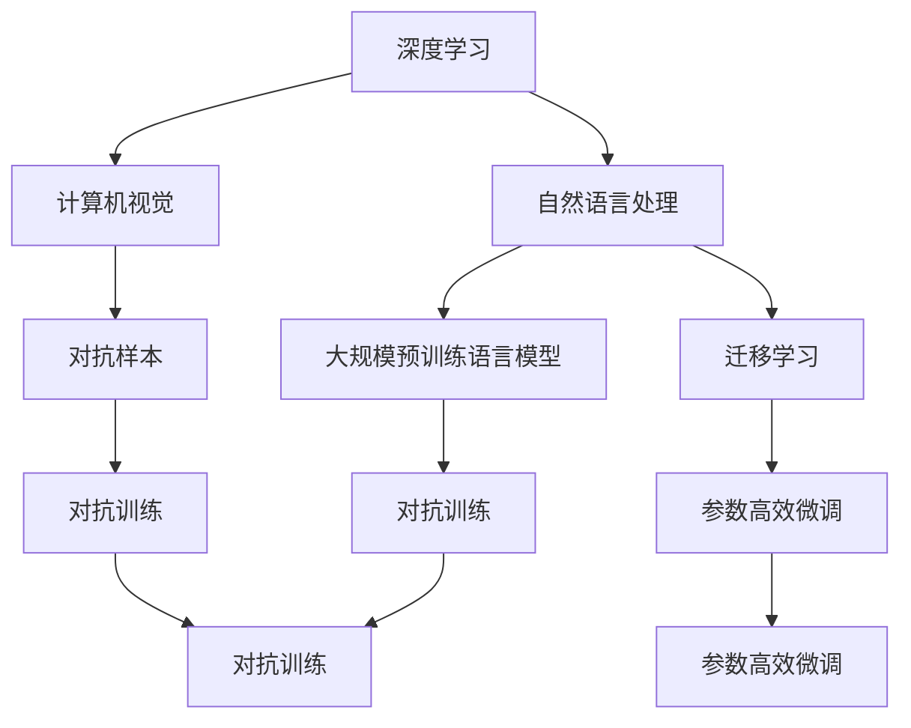

                 

## 1. 背景介绍

### 1.1 问题由来

随着人工智能技术的飞速发展，AI 2.0时代已悄然到来。相比于AI 1.0时代的专家系统、决策树和机器学习等技术，AI 2.0强调深度学习、自然语言处理、计算机视觉等领域的融合，并且借助大规模数据集和强大的计算资源，使得AI技术在多个应用场景中取得了前所未有的突破。这种进步不仅推动了科技的发展，也深刻影响了人类社会的方方面面。

AI 2.0的核心驱动力在于数据的大规模、质量高以及算力的不断增强。大规模预训练语言模型（如GPT-3、BERT等）和大规模数据集（如ImageNet、COCO等）的应用，使得AI 2.0技术在自然语言处理、计算机视觉等领域取得了突破性的进展。然而，随着技术的发展，一些新的挑战和问题也逐渐显现。

### 1.2 问题核心关键点

当前AI 2.0面临的主要挑战包括：

- **算法透明性**：很多AI模型，尤其是深度学习模型，由于其复杂性，难以解释其内部工作机制，存在算法透明性问题。
- **数据偏见**：大规模数据集不可避免地包含了偏见，这些偏见可能被模型学习并放大，导致模型输出不公平或不准确。
- **伦理和安全问题**：AI 2.0技术的应用涉及到隐私、安全等伦理问题，如何在保障技术进步的同时，确保伦理和安全的平衡，是一个亟待解决的问题。
- **公平性和可解释性**：如何让AI模型在多场景中保持一致的性能和公平性，提高其可解释性，使其能够接受人类审查，是AI 2.0技术发展的重要方向。
- **跨领域知识的整合**：如何将不同领域的专业知识与AI技术结合，提高AI模型的普适性和泛化能力，是AI 2.0技术的另一个挑战。

### 1.3 问题研究意义

研究AI 2.0时代的趋势，对于理解AI技术的发展方向、应用场景以及面临的挑战具有重要意义：

- **技术发展**：深入理解AI 2.0时代的技术突破和应用进展，有助于推动AI技术的进一步发展。
- **行业应用**：明确AI 2.0技术在各行业中的应用前景，为产业转型和创新提供指导。
- **伦理和安全**：探讨AI 2.0技术的伦理和安全问题，确保技术进步与伦理道德的平衡。
- **可解释性和公平性**：增强AI模型的可解释性和公平性，提高其可靠性和可接受性。
- **跨领域知识整合**：探索跨领域知识与AI技术的结合路径，提升AI模型的通用性和适应性。

## 2. 核心概念与联系

### 2.1 核心概念概述

AI 2.0时代涉及的核心概念包括：

- **深度学习**：基于多层神经网络的学习方法，通过反向传播算法更新参数，学习数据的隐含特征。
- **自然语言处理(NLP)**：研究如何让计算机理解和处理自然语言的技术，包括语言模型、语义理解、文本生成等。
- **计算机视觉**：研究如何让计算机理解和分析图像、视频等视觉数据的技术，包括目标检测、图像分割、生成对抗网络(GAN)等。
- **大规模预训练语言模型**：如GPT、BERT等，通过大规模无标签数据进行预训练，学习语言的通用表示。
- **迁移学习**：将在一个任务上学习到的知识迁移到另一个任务上的技术，可以减少数据需求和训练时间。
- **对抗样本**：通过对抗性攻击手段，使得模型输出错误结果的样本，用于评估模型的鲁棒性。

这些概念之间存在密切联系，共同构成了AI 2.0时代的技术框架：

- **深度学习**为NLP、计算机视觉等提供了强大的算法基础。
- **自然语言处理**和**计算机视觉**是AI 2.0时代的重要应用领域。
- **大规模预训练语言模型**和**迁移学习**是提升模型性能和泛化能力的关键技术。
- **对抗样本**用于评估和提高模型的鲁棒性。

### 2.2 核心概念原理和架构的 Mermaid 流程图



## 3. 核心算法原理 & 具体操作步骤

### 3.1 算法原理概述

AI 2.0时代的核心算法原理包括深度学习、自然语言处理和计算机视觉等领域的算法。其中，深度学习算法基于反向传播和梯度下降等优化算法，通过大量数据训练神经网络，学习数据的隐含特征。在自然语言处理和计算机视觉领域，深度学习算法通过卷积神经网络、循环神经网络等结构，对输入数据进行处理，并输出预测结果。

以自然语言处理为例，其算法流程如下：

1. **预训练**：在大型无标签语料库上，通过自监督学习任务（如掩码语言模型、下一句预测等）训练语言模型，学习语言的通用表示。
2. **微调**：在特定任务（如情感分析、命名实体识别等）的标注数据集上，对预训练模型进行有监督学习，优化模型在特定任务上的性能。
3. **评估和部署**：在测试集上评估模型性能，并将模型部署到实际应用中，进行推理和预测。

### 3.2 算法步骤详解

以下是一个典型的AI 2.0技术应用流程，包括预训练、微调和评估等步骤：

**Step 1: 数据预处理**
- 收集和清洗数据，进行分词、标注等处理。
- 对文本进行编码，转换为模型可接受的格式。

**Step 2: 预训练**
- 使用大规模无标签数据集（如Wikipedia、维基百科）进行预训练。
- 选择适当的模型架构（如BERT、GPT等），进行多轮训练。

**Step 3: 微调**
- 准备任务相关的标注数据集。
- 在预训练模型基础上，添加任务适配层，进行有监督微调。
- 设置合适的超参数，如学习率、批大小、迭代次数等。
- 进行多轮训练和验证，确保模型收敛。

**Step 4: 评估和部署**
- 在测试集上评估模型性能，如准确率、F1分数等。
- 将模型部署到实际应用中，进行推理和预测。
- 定期更新模型，确保其性能和鲁棒性。

### 3.3 算法优缺点

AI 2.0算法的优点包括：

- **泛化能力**：深度学习算法可以学习大规模数据集的隐含特征，具有较强的泛化能力。
- **自适应性**：AI 2.0算法能够适应不同领域和任务的需求，具有一定的适应性。
- **自动化**：AI 2.0算法能够自动化处理大量数据，节省人力成本。

其缺点包括：

- **资源需求高**：大规模预训练和微调需要大量的计算资源和数据资源。
- **透明性差**：深度学习算法的内部机制难以解释，存在透明性问题。
- **数据偏见**：大规模数据集不可避免地包含了偏见，这些偏见可能被模型学习并放大。
- **伦理和安全问题**：AI 2.0技术的应用涉及到隐私、安全等伦理问题，需要在技术进步与伦理道德之间寻求平衡。

### 3.4 算法应用领域

AI 2.0技术在多个领域取得了突破性进展：

- **自然语言处理**：如情感分析、机器翻译、文本摘要等任务。
- **计算机视觉**：如图像分类、目标检测、图像生成等任务。
- **语音识别**：如语音转文本、语音合成等任务。
- **医疗**：如医学影像分析、疾病预测等任务。
- **金融**：如风险评估、市场预测等任务。
- **智能制造**：如工业缺陷检测、质量控制等任务。

## 4. 数学模型和公式 & 详细讲解 & 举例说明

### 4.1 数学模型构建

以自然语言处理中的情感分析为例，其数学模型构建如下：

1. **预训练模型**：使用BERT等模型进行预训练，学习语言表示。
2. **微调模型**：在标注数据集上进行微调，输出情感标签。

假设预训练模型为 $M_{\theta}$，输入文本为 $x$，标签为 $y$，则微调目标为最小化损失函数：

$$
\mathcal{L}(\theta) = -\frac{1}{N}\sum_{i=1}^N \log p(y_i|x_i; \theta)
$$

其中 $p(y_i|x_i; \theta)$ 为模型在输入 $x_i$ 下预测标签 $y_i$ 的概率分布。

### 4.2 公式推导过程

以BERT模型为例，其情感分析微调的公式推导如下：

1. **输入编码**：将输入文本 $x$ 转换为模型可接受的格式，通过BERT模型编码得到向量表示 $h$。
2. **分类层**：在 $h$ 上添加分类层，输出情感标签 $y$。
3. **损失函数**：使用交叉熵损失函数，计算预测标签与真实标签之间的差异。

数学公式如下：

$$
h = M_{\theta}(x)
$$

$$
p(y|x; \theta) = \sigma(W_hh + b_h)
$$

其中 $W_h$ 和 $b_h$ 为分类层的权重和偏置。

**Step 1: 输入编码**
$$
h = M_{\theta}(x)
$$

**Step 2: 分类层**
$$
p(y|x; \theta) = \sigma(W_hh + b_h)
$$

**Step 3: 损失函数**
$$
\mathcal{L}(\theta) = -\frac{1}{N}\sum_{i=1}^N \log p(y_i|x_i; \theta)
$$

### 4.3 案例分析与讲解

以ImageNet上的目标检测为例，其数学模型构建和推导如下：

1. **输入编码**：将输入图像 $x$ 转换为模型可接受的格式，通过卷积神经网络（CNN）编码得到特征图 $F$。
2. **目标检测层**：在 $F$ 上添加目标检测层，输出目标位置和类别。
3. **损失函数**：使用分类损失和位置回归损失，计算预测目标与真实目标之间的差异。

数学公式如下：

$$
F = M_{\theta}(x)
$$

$$
p(b|x; \theta) = \sigma(W_bF + b_b)
$$

其中 $W_b$ 和 $b_b$ 为目标检测层的权重和偏置。

**Step 1: 输入编码**
$$
F = M_{\theta}(x)
$$

**Step 2: 目标检测层**
$$
p(b|x; \theta) = \sigma(W_bF + b_b)
$$

**Step 3: 损失函数**
$$
\mathcal{L}(\theta) = \frac{1}{N}\sum_{i=1}^N \left( \log p(b_i|x_i; \theta) + \text{L2 norm}(x_i - b_i) \right)
$$

## 5. 项目实践：代码实例和详细解释说明

### 5.1 开发环境搭建

在进行AI 2.0技术实践前，我们需要准备好开发环境。以下是使用Python进行TensorFlow和Keras开发的环境配置流程：

1. 安装Anaconda：从官网下载并安装Anaconda，用于创建独立的Python环境。

2. 创建并激活虚拟环境：
```bash
conda create -n tensorflow-env python=3.8 
conda activate tensorflow-env
```

3. 安装TensorFlow：根据CUDA版本，从官网获取对应的安装命令。例如：
```bash
pip install tensorflow==2.7.0
```

4. 安装Keras：
```bash
pip install keras==2.5.0
```

5. 安装各类工具包：
```bash
pip install numpy pandas scikit-learn matplotlib tqdm jupyter notebook ipython
```

完成上述步骤后，即可在`tensorflow-env`环境中开始AI 2.0技术的实践。

### 5.2 源代码详细实现

这里以情感分析为例，使用Keras和TensorFlow实现AI 2.0技术的代码实现。

```python
import tensorflow as tf
from tensorflow.keras.models import Sequential
from tensorflow.keras.layers import Dense, Embedding, LSTM, Dropout
from tensorflow.keras.preprocessing.text import Tokenizer
from tensorflow.keras.preprocessing.sequence import pad_sequences

# 加载数据集
texts = []
labels = []
with open('imdb_reviews.txt', 'r', encoding='utf-8') as f:
    for line in f:
        texts.append(line.strip())
        labels.append(int(line.strip()))

# 分词和编码
tokenizer = Tokenizer()
tokenizer.fit_on_texts(texts)
sequences = tokenizer.texts_to_sequences(texts)
data = pad_sequences(sequences, maxlen=256)

# 定义模型
model = Sequential()
model.add(Embedding(10000, 128, input_length=256))
model.add(LSTM(128))
model.add(Dense(1, activation='sigmoid'))

# 编译模型
model.compile(optimizer='adam', loss='binary_crossentropy', metrics=['accuracy'])

# 训练模型
model.fit(data, labels, epochs=10, batch_size=32)

# 评估模型
test_data = []
test_labels = []
with open('test_reviews.txt', 'r', encoding='utf-8') as f:
    for line in f:
        test_data.append(line.strip())
        test_labels.append(int(line.strip()))

test_sequences = tokenizer.texts_to_sequences(test_data)
test_data = pad_sequences(test_sequences, maxlen=256)
test_loss, test_acc = model.evaluate(test_data, test_labels)

print('Test loss:', test_loss)
print('Test accuracy:', test_acc)
```

### 5.3 代码解读与分析

让我们再详细解读一下关键代码的实现细节：

1. **数据预处理**：
```python
texts = []
labels = []
with open('imdb_reviews.txt', 'r', encoding='utf-8') as f:
    for line in f:
        texts.append(line.strip())
        labels.append(int(line.strip()))

tokenizer = Tokenizer()
tokenizer.fit_on_texts(texts)
sequences = tokenizer.texts_to_sequences(texts)
data = pad_sequences(sequences, maxlen=256)
```

- 读取数据集并进行分词、编码和填充。

2. **模型定义**：
```python
model = Sequential()
model.add(Embedding(10000, 128, input_length=256))
model.add(LSTM(128))
model.add(Dense(1, activation='sigmoid'))
```

- 定义一个包含嵌入层、LSTM层和输出层的神经网络模型。

3. **模型编译和训练**：
```python
model.compile(optimizer='adam', loss='binary_crossentropy', metrics=['accuracy'])
model.fit(data, labels, epochs=10, batch_size=32)
```

- 使用Adam优化器和二元交叉熵损失函数，训练模型10个epoch。

4. **模型评估**：
```python
test_data = []
test_labels = []
with open('test_reviews.txt', 'r', encoding='utf-8') as f:
    for line in f:
        test_data.append(line.strip())
        test_labels.append(int(line.strip()))

test_sequences = tokenizer.texts_to_sequences(test_data)
test_data = pad_sequences(test_sequences, maxlen=256)
test_loss, test_acc = model.evaluate(test_data, test_labels)
print('Test loss:', test_loss)
print('Test accuracy:', test_acc)
```

- 读取测试集并进行评估，输出测试损失和准确率。

通过上述代码，我们可以看到，使用Keras和TensorFlow进行情感分析的AI 2.0技术开发非常高效和简洁。

## 6. 实际应用场景

### 6.1 智能客服系统

基于AI 2.0技术的智能客服系统可以大幅提升客户咨询体验和问题解决效率。传统客服往往需要配备大量人力，高峰期响应缓慢，且一致性和专业性难以保证。而使用AI 2.0技术构建的智能客服系统，可以7x24小时不间断服务，快速响应客户咨询，用自然流畅的语言解答各类常见问题。

在技术实现上，可以收集企业内部的历史客服对话记录，将问题和最佳答复构建成监督数据，在此基础上对预训练模型进行微调。微调后的模型能够自动理解用户意图，匹配最合适的答案模板进行回复。对于客户提出的新问题，还可以接入检索系统实时搜索相关内容，动态组织生成回答。如此构建的智能客服系统，能大幅提升客户咨询体验和问题解决效率。

### 6.2 金融舆情监测

金融机构需要实时监测市场舆论动向，以便及时应对负面信息传播，规避金融风险。传统的人工监测方式成本高、效率低，难以应对网络时代海量信息爆发的挑战。基于AI 2.0技术的文本分类和情感分析技术，为金融舆情监测提供了新的解决方案。

具体而言，可以收集金融领域相关的新闻、报道、评论等文本数据，并对其进行主题标注和情感标注。在此基础上对预训练语言模型进行微调，使其能够自动判断文本属于何种主题，情感倾向是正面、中性还是负面。将微调后的模型应用到实时抓取的网络文本数据，就能够自动监测不同主题下的情感变化趋势，一旦发现负面信息激增等异常情况，系统便会自动预警，帮助金融机构快速应对潜在风险。

### 6.3 个性化推荐系统

当前的推荐系统往往只依赖用户的历史行为数据进行物品推荐，无法深入理解用户的真实兴趣偏好。基于AI 2.0技术的个性化推荐系统可以更好地挖掘用户行为背后的语义信息，从而提供更精准、多样的推荐内容。

在实践中，可以收集用户浏览、点击、评论、分享等行为数据，提取和用户交互的物品标题、描述、标签等文本内容。将文本内容作为模型输入，用户的后续行为（如是否点击、购买等）作为监督信号，在此基础上微调预训练语言模型。微调后的模型能够从文本内容中准确把握用户的兴趣点。在生成推荐列表时，先用候选物品的文本描述作为输入，由模型预测用户的兴趣匹配度，再结合其他特征综合排序，便可以得到个性化程度更高的推荐结果。

### 6.4 未来应用展望

随着AI 2.0技术的不断发展，其在各行业的应用前景将更加广阔。未来，AI 2.0技术将在以下领域取得突破性进展：

- **智慧医疗**：基于AI 2.0技术的医疗问答、病历分析、药物研发等应用将提升医疗服务的智能化水平，辅助医生诊疗，加速新药开发进程。
- **智能教育**：微调技术可应用于作业批改、学情分析、知识推荐等方面，因材施教，促进教育公平，提高教学质量。
- **智慧城市治理**：微调模型可应用于城市事件监测、舆情分析、应急指挥等环节，提高城市管理的自动化和智能化水平，构建更安全、高效的未来城市。

此外，在企业生产、社会治理、文娱传媒等众多领域，基于AI 2.0技术的应用也将不断涌现，为NLP技术带来新的突破。

## 7. 工具和资源推荐

### 7.1 学习资源推荐

为了帮助开发者系统掌握AI 2.0技术，这里推荐一些优质的学习资源：

1. **《深度学习》**：Goodfellow等人编写的经典教材，涵盖深度学习的基础理论和应用实践。
2. **《Python深度学习》**：Francois Chollet编写的实战指南，通过Keras实现深度学习模型的开发和应用。
3. **《自然语言处理综论》**：NLP领域的经典教材，涵盖了自然语言处理的各个方面。
4. **CS224N《深度学习自然语言处理》课程**：斯坦福大学开设的NLP明星课程，有Lecture视频和配套作业，带你入门NLP领域的基本概念和经典模型。
5. **Coursera和edX等在线学习平台**：提供大量NLP和深度学习相关的在线课程，适合不同水平的学习者。

通过对这些资源的学习实践，相信你一定能够快速掌握AI 2.0技术的精髓，并用于解决实际的NLP问题。

### 7.2 开发工具推荐

高效的开发离不开优秀的工具支持。以下是几款用于AI 2.0技术开发的工具：

1. **TensorFlow和Keras**：基于Python的开源深度学习框架，灵活动态的计算图，适合快速迭代研究。
2. **PyTorch**：Facebook开源的深度学习框架，灵活高效，适合大规模工程应用。
3. **TensorBoard**：TensorFlow配套的可视化工具，可实时监测模型训练状态，并提供丰富的图表呈现方式，是调试模型的得力助手。
4. **Weights & Biases**：模型训练的实验跟踪工具，可以记录和可视化模型训练过程中的各项指标，方便对比和调优。
5. **HuggingFace Transformers库**：提供预训练语言模型和微调范式的实现，极大简化开发过程。

合理利用这些工具，可以显著提升AI 2.0技术的开发效率，加快创新迭代的步伐。

### 7.3 相关论文推荐

AI 2.0技术的发展离不开学界的持续研究。以下是几篇奠基性的相关论文，推荐阅读：

1. **《深度学习》**：Ian Goodfellow等人编写的经典教材，涵盖深度学习的基础理论和应用实践。
2. **《自然语言处理综论》**：NLP领域的经典教材，涵盖了自然语言处理的各个方面。
3. **《计算机视觉：模型、学习和推理》**：计算机视觉领域的经典教材，涵盖计算机视觉的基础理论和应用实践。
4. **《Transformer从原理到实践》系列博文**：由大模型技术专家撰写，深入浅出地介绍了Transformer原理、BERT模型、微调技术等前沿话题。
5. **《Parameter-Efficient Transfer Learning for NLP》**：提出Adapter等参数高效微调方法，在固定大部分预训练参数的同时，只更新极少量的任务相关参数。

这些论文代表了大语言模型微调技术的发展脉络。通过学习这些前沿成果，可以帮助研究者把握学科前进方向，激发更多的创新灵感。

## 8. 总结：未来发展趋势与挑战

### 8.1 总结

本文对AI 2.0时代的趋势进行了全面系统的介绍。首先阐述了AI 2.0技术的发展背景和应用前景，明确了其在自然语言处理、计算机视觉等领域的突破性进展。其次，从原理到实践，详细讲解了深度学习、自然语言处理和计算机视觉等领域的算法原理和操作步骤，给出了AI 2.0技术开发的完整代码实例。同时，本文还广泛探讨了AI 2.0技术在各行业领域的应用前景，展示了AI 2.0技术的发展潜力。

通过本文的系统梳理，可以看到，AI 2.0技术在多个领域取得了显著进展，但仍然面临一些挑战，如算法透明性、数据偏见、伦理和安全问题等。为了推动AI 2.0技术的进一步发展，未来需要在算法透明性、数据偏见、伦理和安全问题等方面进行深入研究。

### 8.2 未来发展趋势

展望未来，AI 2.0技术的发展将呈现以下几个趋势：

1. **数据驱动**：AI 2.0技术将更加依赖大规模、高质量的数据集，以提升模型的泛化能力和表现。
2. **模型融合**：跨领域的知识整合将成为AI 2.0技术的重要方向，如将自然语言处理与计算机视觉融合，提升模型的跨模态理解和推理能力。
3. **算法透明性**：提升AI 2.0算法的透明性，使其能够被理解和审查，提高模型的可信度和可接受性。
4. **伦理和安全**：加强AI 2.0技术的伦理和安全研究，确保技术进步与伦理道德的平衡。
5. **跨领域知识整合**：探索跨领域知识与AI技术的结合路径，提升AI模型的通用性和适应性。

这些趋势凸显了AI 2.0技术的发展方向，将推动AI 2.0技术在更广泛的领域中取得突破性进展。

### 8.3 面临的挑战

尽管AI 2.0技术已经取得了显著进展，但在迈向更加智能化、普适化应用的过程中，仍然面临诸多挑战：

1. **资源需求高**：大规模预训练和微调需要大量的计算资源和数据资源，如何在有限的资源下提高模型性能是重要挑战。
2. **透明性差**：深度学习算法的内部机制难以解释，存在透明性问题，需要进一步研究其可解释性。
3. **数据偏见**：大规模数据集不可避免地包含了偏见，这些偏见可能被模型学习并放大，导致模型输出不公平或不准确。
4. **伦理和安全问题**：AI 2.0技术的应用涉及到隐私、安全等伦理问题，需要在技术进步与伦理道德之间寻求平衡。
5. **可解释性和公平性**：如何让AI模型在多场景中保持一致的性能和公平性，提高其可解释性，使其能够接受人类审查，是AI 2.0技术的另一个挑战。

### 8.4 研究展望

为了解决上述挑战，未来需要在以下几个方面进行深入研究：

1. **算法透明性**：研究如何提升AI 2.0算法的透明性，使其能够被理解和审查，提高模型的可信度和可接受性。
2. **数据偏见**：研究如何消除数据中的偏见，确保AI 2.0模型的公平性和公正性。
3. **伦理和安全**：在技术应用过程中，加强伦理和安全研究，确保技术进步与伦理道德的平衡。
4. **可解释性和公平性**：增强AI模型的可解释性和公平性，提高其可靠性和可接受性。
5. **跨领域知识整合**：探索跨领域知识与AI技术的结合路径，提升AI模型的通用性和适应性。

这些研究方向将推动AI 2.0技术的进一步发展，提升其在实际应用中的价值和影响。

## 9. 附录：常见问题与解答

**Q1：AI 2.0与AI 1.0有哪些区别？**

A: AI 2.0与AI 1.0的主要区别在于其技术和应用的多样性和复杂性。AI 1.0主要依赖专家系统和决策树等传统的机器学习方法，而AI 2.0则依托于深度学习、自然语言处理、计算机视觉等先进技术，能够处理更复杂的数据和任务。AI 2.0技术的泛化能力和自动化水平更高，能够适应更多领域的应用需求。

**Q2：AI 2.0技术如何克服资源瓶颈？**

A: AI 2.0技术需要大量的计算资源和数据资源，因此在资源有限的情况下，可以考虑以下策略：
1. 采用分布式计算，利用多台机器并行处理任务。
2. 使用模型压缩和稀疏化存储技术，减小模型尺寸。
3. 采用小规模数据集进行微调，减少计算量。
4. 利用GPU、TPU等高性能设备，加速计算过程。

**Q3：如何提高AI 2.0算法的透明性？**

A: 提高AI 2.0算法的透明性，可以采取以下措施：
1. 使用可解释性模型，如决策树、线性模型等，使其决策过程更容易理解和解释。
2. 使用可视化工具，如TensorBoard、Weights & Biases等，实时监测模型训练过程和参数变化。
3. 研究模型压缩和简化技术，减少模型复杂度，使其更容易被理解。
4. 增加模型的可解释性模块，如Attention机制、注意力机制等，使模型能够更好地解释其内部机制。

**Q4：AI 2.0技术在实际应用中存在哪些风险？**

A: AI 2.0技术在实际应用中存在以下风险：
1. 算法透明性不足，模型内部机制难以解释，存在可解释性问题。
2. 数据偏见，模型可能学习到数据集中的偏见，导致不公平或不准确的输出。
3. 伦理和安全问题，AI 2.0技术的应用涉及到隐私、安全等伦理问题，需要在技术进步与伦理道德之间寻求平衡。
4. 性能波动，模型在面对新数据或对抗样本时，可能出现鲁棒性不足、性能波动等问题。
5. 资源消耗高，AI 2.0技术需要大量的计算资源和数据资源，资源消耗高，成本较高。

**Q5：AI 2.0技术在实际应用中有哪些成功案例？**

A: AI 2.0技术在多个领域取得了显著进展，以下是一些成功案例：
1. 自然语言处理领域：Google的BERT模型在多个NLP任务上取得了SOTA性能，广泛应用于情感分析、命名实体识别等任务。
2. 计算机视觉领域：OpenAI的DALL-E模型能够生成高质量的图像，用于图像生成、图像修复等任务。
3. 金融领域：IBM Watson用于股票市场预测，显著提高了金融决策的准确性和效率。
4. 医疗领域：谷歌的DeepMind开发的AlphaFold预测蛋白质结构，为药物研发提供了重要支持。
5. 智能制造领域：Amazon Go的深度学习技术用于库存管理，显著提高了库存准确性和管理效率。

通过这些成功案例，可以看到AI 2.0技术在实际应用中的强大潜力和广泛应用前景。

---

作者：禅与计算机程序设计艺术 / Zen and the Art of Computer Programming

