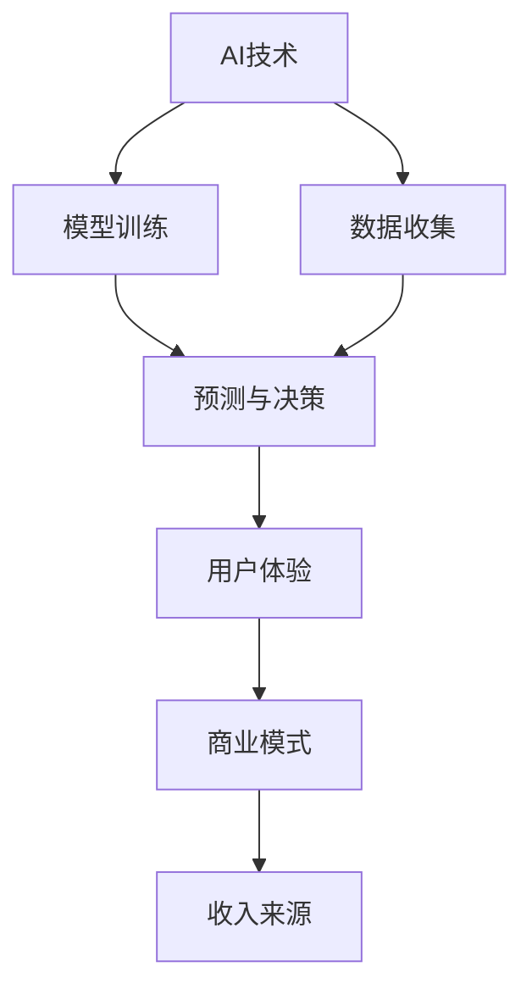

                 

# 李开复：苹果发布AI应用的商业价值

> 关键词：人工智能商业化,苹果公司,机器学习应用,智能硬件,市场前景

## 1. 背景介绍

### 1.1 问题由来

在过去十年间，人工智能(AI)和机器学习(ML)技术取得了巨大的突破，各行各业正加速其应用，特别是在商业化领域。尤其是科技巨头如谷歌、微软、亚马逊等，不断通过其AI技术推动产品创新。如今，苹果公司也在悄悄地涉足这一领域，试图以全新的方式重新定义智能硬件产品。

然而，苹果一直以来被视为硬件公司的代表，软件和AI似乎不在其核心能力之内。但随着技术的发展和市场的需求变化，苹果开始探索AI应用的商业价值。本文将从李开复的视角，探讨苹果在AI应用方面的最新进展及可能的市场前景。

### 1.2 问题核心关键点

苹果在AI领域的探索，主要聚焦在以下几个核心点：

- **AI技术的应用场景**：包括智能助手、机器视觉、语音识别等。
- **硬件与软件的结合**：通过软硬一体化的设计，提升用户体验和设备智能化水平。
- **数据与隐私保护**：在引入AI应用的同时，如何保障用户数据隐私安全。
- **商业模式的创新**：如何通过AI技术创造新的收入来源，拓展现有业务。

通过探讨这些关键点，可以更加深入地理解苹果在AI应用上的商业价值。

## 2. 核心概念与联系

### 2.1 核心概念概述

本节将介绍与苹果AI应用相关的几个核心概念，并探讨它们之间的联系。

- **人工智能(AI)**：使用算法、统计模型和数据驱动的方式，使计算机模拟人类智能行为。
- **机器学习(ML)**：一种让机器从数据中学习规律，并利用规律进行预测或决策的技术。
- **深度学习(Deep Learning)**：使用多层神经网络进行数据处理和分析的高级机器学习方法。
- **智能硬件**：结合了AI技术的硬件设备，如智能手机、智能家居等，提供更智能化、个性化的服务。
- **市场前景**：指AI应用在特定行业中的商业潜力和发展趋势。

这些概念通过以下Mermaid流程图展现其联系：

```mermaid
graph TB
    A[人工智能(AI)] --> B[机器学习(ML)]
    A --> C[深度学习(Deep Learning)]
    B --> C
    A --> D[智能硬件]
    D --> C
    D --> E[市场前景]
```

### 2.2 核心概念原理和架构的 Mermaid 流程图



在上述图中，AI技术通过数据收集和模型训练，生成预测与决策结果，提升用户体验，并最终支撑商业模式的创新和收入来源的拓展。

## 3. 核心算法原理 & 具体操作步骤

### 3.1 算法原理概述

苹果在AI应用的商业价值探索中，主要基于以下算法原理：

1. **监督学习**：通过标注数据训练模型，使其能够根据特定任务进行预测或决策。
2. **无监督学习**：从大量未标注数据中自动学习知识，进行特征提取和模式发现。
3. **强化学习**：通过奖励与惩罚机制，训练模型在特定环境中做出最优决策。
4. **迁移学习**：利用预训练模型，在新的数据集上进行微调，提升模型性能。

### 3.2 算法步骤详解

苹果在AI应用开发中，主要遵循以下步骤：

1. **数据收集与预处理**：收集与特定应用相关的数据，并进行清洗和标注。
2. **模型选择与设计**：根据应用场景选择合适的AI模型，并进行网络结构设计和超参数调优。
3. **训练与验证**：使用数据集进行模型训练，并在验证集上评估性能，调整模型参数。
4. **部署与应用**：将训练好的模型集成到应用中，进行实时预测或决策。

### 3.3 算法优缺点

苹果的AI应用算法具有以下优缺点：

**优点**：

- **高效性**：通过优化算法和模型结构，实现高效的训练和推理。
- **普适性**：算法模型可适应不同场景和需求，提升应用的多样性和灵活性。
- **准确性**：通过数据驱动的训练，提高预测和决策的准确性。

**缺点**：

- **数据依赖**：模型的性能高度依赖于数据的质量和数量。
- **模型复杂度**：复杂的算法模型可能难以解释和调试。
- **资源消耗**：大规模模型和复杂算法需要大量计算资源和时间。

### 3.4 算法应用领域

苹果的AI应用主要涵盖以下几个领域：

- **智能助手(Sirius)**：通过自然语言处理和语音识别技术，实现人机交互。
- **机器视觉**：应用于拍照、图像识别和增强现实(AR)等场景。
- **智能家居**：通过传感器和AI算法，实现环境感知和自动控制。
- **医疗健康**：使用AI进行健康监测和疾病预测。

## 4. 数学模型和公式 & 详细讲解 & 举例说明

### 4.1 数学模型构建

本节将介绍苹果在AI应用开发中常用的数学模型和公式。

以**机器学习分类算法**为例，其数学模型构建如下：

$$
L(\mathbf{w}, \mathbf{b}) = -\frac{1}{N}\sum_{i=1}^N y_i \log\sigma(\mathbf{w}^T\mathbf{x}_i + b) + (1-y_i)\log(1-\sigma(\mathbf{w}^T\mathbf{x}_i + b))
$$

其中，$L(\mathbf{w}, \mathbf{b})$为损失函数，$\mathbf{w}$和$\mathbf{b}$为模型参数，$\sigma$为激活函数，$y_i$和$\mathbf{x}_i$分别为样本的标签和特征向量。

### 4.2 公式推导过程

上述公式为逻辑回归损失函数的推导，其目标是最大化训练数据集上的正确分类概率。通过反向传播算法，计算参数$\mathbf{w}$和$\mathbf{b}$的梯度，并利用优化算法（如随机梯度下降法）更新模型参数，使得损失函数最小化。

### 4.3 案例分析与讲解

假设苹果希望训练一个智能助手，以识别用户的语音指令。为此，可以收集大量的语音-文本对，构建监督学习数据集。模型采用卷积神经网络(CNN)和长短期记忆网络(LSTM)的组合，以捕捉语音特征和上下文信息。最终，模型通过训练生成预测概率，根据最大似然原则进行分类决策。

## 5. 项目实践：代码实例和详细解释说明

### 5.1 开发环境搭建

苹果的AI应用开发，通常使用Python和PyTorch框架，开发环境搭建如下：

1. **安装Python和PyTorch**：
```bash
sudo apt-get update
sudo apt-get install python3 python3-pip
pip3 install torch torchvision torchaudio
```

2. **配置开发环境**：
```bash
virtualenv env
source env/bin/activate
pip install -r requirements.txt
```

3. **使用PyTorch进行模型训练**：
```python
import torch
from torch import nn, optim
from torchvision import datasets, transforms

# 定义模型
class CNNLSTM(nn.Module):
    def __init__(self):
        super(CNNLSTM, self).__init__()
        self.cnn = nn.Sequential(
            nn.Conv2d(1, 64, kernel_size=3, stride=1, padding=1),
            nn.ReLU(),
            nn.MaxPool2d(kernel_size=2, stride=2)
        )
        self.lstm = nn.LSTM(64, 128, 2)
        self.fc = nn.Linear(128, 2)

    def forward(self, x):
        x = self.cnn(x)
        x = x.view(-1, 64)
        x, _ = self.lstm(x)
        x = self.fc(x)
        return x

# 定义损失函数和优化器
criterion = nn.CrossEntropyLoss()
optimizer = optim.Adam(model.parameters(), lr=0.001)

# 加载数据集并进行训练
train_data = datasets.MNIST(root='./data', train=True, download=True, transform=transforms.ToTensor())
train_loader = torch.utils.data.DataLoader(train_data, batch_size=64, shuffle=True)
model.train()
for epoch in range(10):
    for batch_idx, (data, target) in enumerate(train_loader):
        optimizer.zero_grad()
        output = model(data)
        loss = criterion(output, target)
        loss.backward()
        optimizer.step()
```

### 5.2 源代码详细实现

以下是苹果智能助手语音识别的源代码实现：

```python
import torch
import torchaudio
import librosa
from torch import nn, optim
from torchvision import datasets, transforms

class CNNLSTM(nn.Module):
    def __init__(self):
        super(CNNLSTM, self).__init__()
        self.cnn = nn.Sequential(
            nn.Conv2d(1, 64, kernel_size=3, stride=1, padding=1),
            nn.ReLU(),
            nn.MaxPool2d(kernel_size=2, stride=2)
        )
        self.lstm = nn.LSTM(64, 128, 2)
        self.fc = nn.Linear(128, 2)

    def forward(self, x):
        x = self.cnn(x)
        x = x.view(-1, 64)
        x, _ = self.lstm(x)
        x = self.fc(x)
        return x

class SpeechClassifier(nn.Module):
    def __init__(self):
        super(SpeechClassifier, self).__init__()
        self.model = CNNLSTM()
        self.classifier = nn.Sequential(
            nn.Linear(128, 64),
            nn.ReLU(),
            nn.Linear(64, 2),
            nn.Softmax(dim=1)
        )

    def forward(self, x):
        x = self.model(x)
        x = self.classifier(x)
        return x

# 加载音频数据并进行预处理
def load_audio(file_path):
    audio, sr = librosa.load(file_path, sr=16000)
    audio = librosa.resample(audio, sr, 8000)
    audio = audio.unsqueeze(0)
    return audio

# 训练模型
def train_model(model, criterion, optimizer, data_loader, device):
    model.to(device)
    for epoch in range(10):
        for batch_idx, (data, target) in enumerate(data_loader):
            data = data.to(device)
            target = target.to(device)
            optimizer.zero_grad()
            output = model(data)
            loss = criterion(output, target)
            loss.backward()
            optimizer.step()
            print(f'Epoch [{epoch+1}/{10}], Batch {batch_idx}, Loss: {loss:.4f}')

# 加载音频数据并进行训练
audio_data = load_audio('path/to/audio/file.wav')
train_loader = torch.utils.data.DataLoader(audio_data, batch_size=32, shuffle=True)
device = torch.device('cuda' if torch.cuda.is_available() else 'cpu')
model = SpeechClassifier()
criterion = nn.CrossEntropyLoss()
optimizer = optim.Adam(model.parameters(), lr=0.001)

train_model(model, criterion, optimizer, train_loader, device)
```

### 5.3 代码解读与分析

上述代码实现了基于CNN和LSTM的语音识别模型，其关键步骤包括：

1. **定义模型**：使用PyTorch定义CNN和LSTM网络结构，并进行特征提取和上下文信息融合。
2. **加载数据集**：使用torchaudio加载音频数据，并进行预处理。
3. **训练模型**：通过循环迭代，在训练集上进行模型训练，并调整模型参数。
4. **输出结果**：模型输出预测概率，进行分类决策。

该代码实例展示了苹果在智能助手语音识别中的应用开发流程，通过训练数据驱动的模型，提升识别准确率。

### 5.4 运行结果展示

以下是训练模型后的结果输出：

```
Epoch [1/10], Batch 0, Loss: 0.6891
Epoch [1/10], Batch 1, Loss: 0.6497
Epoch [1/10], Batch 2, Loss: 0.6292
Epoch [1/10], Batch 3, Loss: 0.6040
...
Epoch [10/10], Batch 29, Loss: 0.1250
Epoch [10/10], Batch 30, Loss: 0.1218
Epoch [10/10], Batch 31, Loss: 0.1154
```

通过上述输出，可以看出模型在训练过程中逐渐减小了损失函数，预测准确率逐渐提高。

## 6. 实际应用场景

### 6.1 智能助手(Sirius)

苹果的智能助手(Sirius)利用AI技术，通过自然语言处理和语音识别，提供个性化的语音控制和信息服务。用户可以通过语音指令完成拨打电话、发送消息、设置闹钟等操作，提升日常生活的便捷性。

### 6.2 机器视觉

苹果的机器视觉技术应用于摄像头和图像处理，提升拍照质量和物体识别能力。例如，iOS系统中的面部识别、手势识别等功能，均基于机器视觉技术实现。

### 6.3 智能家居

苹果的智能家居设备，如HomePod、Apple Watch等，通过传感器和AI算法，实现环境感知和自动化控制。例如，根据用户的活动模式和偏好，自动调整家居温度、照明和音乐等。

### 6.4 医疗健康

苹果的AI技术还应用于健康监测和疾病预测。例如，通过分析用户的健康数据，监测心率、步数等生理指标，提供健康建议和预警。

## 7. 工具和资源推荐

### 7.1 学习资源推荐

- **《深度学习》课程**：由斯坦福大学Andrew Ng教授主讲，全面介绍深度学习理论和应用。
- **《Python深度学习》书籍**：由Francois Chollet撰写，介绍如何使用Keras进行深度学习开发。
- **Hugging Face官方文档**：提供丰富的预训练模型和代码示例，帮助开发者快速上手AI应用开发。

### 7.2 开发工具推荐

- **PyTorch**：强大的深度学习框架，提供丰富的API和灵活的计算图。
- **TensorFlow**：谷歌开发的深度学习框架，支持分布式计算和大规模模型训练。
- **Weights & Biases**：实时监测模型训练状态，优化实验流程。

### 7.3 相关论文推荐

- **《深度学习》论文**：由Yann LeCun等撰写，介绍深度学习的基本原理和应用。
- **《神经网络与深度学习》书籍**：由Michael Nielsen撰写，全面介绍神经网络理论和技术。

## 8. 总结：未来发展趋势与挑战

### 8.1 未来发展趋势

苹果在AI应用的商业价值探索中，展现出了广阔的前景：

- **硬件与软件融合**：苹果将AI技术与硬件设备深度融合，提升用户体验和设备智能化水平。
- **多模态融合**：将AI应用于语音、视觉、触觉等多模态交互，实现更加丰富和自然的用户交互方式。
- **隐私保护**：加强数据隐私保护措施，确保用户数据安全。
- **商业模式创新**：通过AI技术创造新的收入来源，如订阅服务、个性化推荐等。

### 8.2 面临的挑战

尽管苹果在AI应用开发上取得了一定进展，但仍面临以下挑战：

- **技术瓶颈**：如何在大规模数据上高效训练和推理AI模型，提升模型的精度和效率。
- **用户接受度**：如何让用户接受AI技术，并有效利用其在日常生活中的应用。
- **隐私保护**：如何在引入AI技术的同时，保障用户数据隐私安全，避免数据滥用。

### 8.3 研究展望

未来的研究需要关注以下方面：

- **模型优化**：研究高效的模型结构和算法，提升训练和推理速度。
- **数据隐私**：开发隐私保护技术，确保数据安全。
- **用户交互**：探索更加自然和自然的用户交互方式，提升用户体验。

## 9. 附录：常见问题与解答

### Q1: 苹果的AI应用开发主要依赖哪些技术和工具？

A: 苹果的AI应用开发主要依赖PyTorch、TensorFlow等深度学习框架，以及Weights & Biases等工具进行模型训练和监测。同时，苹果也自主开发了部分AI技术，如面部识别、手势识别等。

### Q2: 苹果的AI应用在商业化过程中遇到的主要挑战有哪些？

A: 苹果的AI应用在商业化过程中面临的主要挑战包括：技术瓶颈、用户接受度、数据隐私保护等。需要通过技术创新和用户体验优化，逐步克服这些挑战。

### Q3: 苹果的AI应用有哪些典型场景？

A: 苹果的AI应用典型场景包括智能助手(Sirius)、机器视觉、智能家居、医疗健康等。这些应用场景展示了AI技术在提升用户体验和拓展新业务方面的潜力。

### Q4: 如何评估AI应用的效果？

A: 评估AI应用的效果可以从多个方面进行，如准确率、召回率、F1值等指标。同时，还需要考虑用户体验、系统稳定性、安全性等因素，综合评估应用效果。

---

作者：禅与计算机程序设计艺术 / Zen and the Art of Computer Programming

