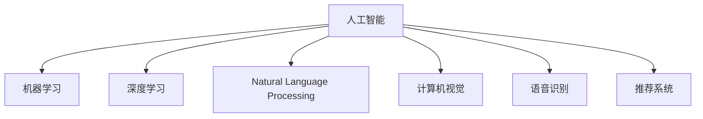

                 

# 李开复：苹果发布AI应用的开发者

## 1. 背景介绍

### 1.1 问题由来
近年来，人工智能(AI)技术的迅猛发展，使得AI应用场景日益丰富。从语音识别、图像识别到自然语言处理，AI已经深入到各行各业。然而，如何将AI应用大规模落地，始终是AI开发者面临的一大难题。

苹果公司作为全球领先的技术公司，一直致力于探索AI技术在消费者产品中的应用。本文将深入探讨苹果公司如何利用AI技术打造优秀的产品，以及AI应用的开发者在实际落地过程中面临的挑战和机遇。

### 1.2 问题核心关键点
苹果公司基于AI技术的产品应用开发，包括以下几个关键点：

- 数据收集与处理：如何从大规模无标签数据中提取有价值的信息。
- 算法设计与优化：选择合适的AI算法，并针对实际应用场景进行优化。
- 开发者工具与平台：提供便捷的开发工具和平台，降低开发者门槛。
- 用户隐私与伦理：确保AI应用在尊重用户隐私的前提下，提供优质的服务。
- 实际落地与测试：验证AI应用在实际场景中的表现，并进行持续优化。

这些关键点构成了苹果公司AI应用开发的核心框架，是推动AI技术实现商业化落地的重要因素。

## 2. 核心概念与联系

### 2.1 核心概念概述

为更好地理解苹果公司AI应用的开发过程，本文将介绍几个密切相关的核心概念：

- 人工智能(AI)：通过机器学习、深度学习等技术，使计算机具备模拟人类智能行为的能力。
- 机器学习(Machine Learning, ML)：一种数据驱动的学习方式，通过算法自动提取数据中的模式和规律。
- 深度学习(Deep Learning, DL)：一种神经网络架构，通过多层非线性变换学习复杂的数据表示。
- 自然语言处理(Natural Language Processing, NLP)：处理、分析、生成自然语言的AI技术。
- 计算机视觉(Computer Vision, CV)：使计算机能够理解、处理图像和视频等视觉数据的AI技术。
- 语音识别(Speech Recognition)：使计算机能够听懂、理解人类语音的AI技术。
- 推荐系统(Recommendation System)：通过分析用户行为，提供个性化推荐的技术。

这些核心概念之间的逻辑关系可以通过以下Mermaid流程图来展示：



这个流程图展示了人工智能的核心分支技术，以及它们之间的关系。

## 3. 核心算法原理 & 具体操作步骤
### 3.1 算法原理概述

苹果公司基于AI技术的产品开发，主要是通过机器学习、深度学习等技术，实现对大规模无标签数据的自动分析和提取。以下将详细介绍苹果公司常用的AI算法原理和具体操作步骤。

### 3.2 算法步骤详解

苹果公司AI应用的开发通常遵循以下步骤：

**Step 1: 数据收集与预处理**
- 从用户设备、网络等渠道收集大量无标签数据。
- 清洗、筛选、标注数据，去除噪声和冗余信息，确保数据质量。

**Step 2: 特征提取与选择**
- 使用深度神经网络、卷积神经网络(CNN)等算法，提取数据中的特征。
- 根据任务需求，选择和组合特征，以提高模型的准确性和泛化能力。

**Step 3: 模型训练与优化**
- 使用随机梯度下降(SGD)、Adam等优化算法，训练神经网络模型。
- 在训练过程中，采用正则化、Dropout等技术，防止过拟合。
- 通过交叉验证、超参数调优等手段，提升模型性能。

**Step 4: 模型评估与测试**
- 在验证集上评估模型性能，对比不同模型的表现。
- 通过A/B测试，验证模型的实际效果。
- 收集用户反馈，进行持续改进。

**Step 5: 模型部署与应用**
- 将训练好的模型部署到云端或本地设备上。
- 集成到苹果设备中，如iPhone、iPad等。
- 持续监控模型性能，进行迭代优化。

### 3.3 算法优缺点

苹果公司基于AI技术的产品开发具有以下优点：

1. 高效便捷：苹果公司提供了一整套AI开发工具和平台，降低了开发者的技术门槛。开发者可以更方便地进行数据处理、模型训练等操作。
2. 集成度高：苹果设备的硬件与软件紧密集成，提高了AI应用的响应速度和稳定性。
3. 用户隐私保护：苹果公司强调用户隐私保护，通过差分隐私等技术，确保AI应用不会泄露用户隐私信息。

然而，也存在一些缺点：

1. 数据获取限制：苹果公司对用户数据的获取和使用受到严格的限制，数据获取成本较高。
2. 算法优化复杂：AI算法需要大量计算资源进行训练和优化，对于硬件要求较高。
3. 开发周期长：AI应用的开发需要经过多个步骤，开发周期较长。
4. 市场竞争激烈：AI应用市场竞争激烈，如何突破竞争对手，提升用户满意度，是苹果面临的一大挑战。

### 3.4 算法应用领域

苹果公司基于AI技术的产品应用，涵盖了众多领域，如：

- 图像识别：通过计算机视觉技术，实现人脸识别、物体识别等功能。
- 语音识别：通过语音识别技术，实现语音助手、自动字幕等功能。
- 自然语言处理：通过NLP技术，实现智能翻译、智能搜索等功能。
- 推荐系统：通过推荐系统，实现个性化推荐、商品推荐等功能。
- 数据安全：通过机器学习技术，实现恶意软件检测、风险评估等功能。

## 4. 数学模型和公式 & 详细讲解 & 举例说明

### 4.1 数学模型构建

苹果公司AI应用的开发，通常使用深度学习模型进行特征提取和预测。以图像识别为例，常用的深度学习模型包括卷积神经网络(CNN)。

### 4.2 公式推导过程

以卷积神经网络(CNN)为例，其基本模型结构如下：

$$
\mathbf{H}^{(l)} = \mathbf{W}^{(l)} \mathbf{X}^{(l-1)} + \mathbf{b}^{(l)}
$$

其中，$\mathbf{H}^{(l)}$表示第$l$层的特征图，$\mathbf{W}^{(l)}$表示第$l$层的权重矩阵，$\mathbf{X}^{(l-1)}$表示第$l-1$层的特征图，$\mathbf{b}^{(l)}$表示第$l$层的偏置向量。

### 4.3 案例分析与讲解

以苹果公司基于CNN的图像识别模型为例，该模型主要由卷积层、池化层、全连接层等组成。卷积层通过卷积操作提取特征，池化层通过降维操作减小特征图大小，全连接层通过线性变换进行分类。

在训练过程中，通过反向传播算法计算损失函数，并更新网络参数。常用的损失函数包括交叉熵损失、均方误差损失等。

## 5. 项目实践：代码实例和详细解释说明

### 5.1 开发环境搭建

要实现苹果公司基于AI技术的图像识别应用，需要搭建开发环境。以下是Python环境配置的步骤：

1. 安装Anaconda：从官网下载并安装Anaconda，用于创建独立的Python环境。
2. 创建并激活虚拟环境：
```bash
conda create -n ai-env python=3.8 
conda activate ai-env
```

3. 安装必要的工具包：
```bash
pip install numpy pandas matplotlib torch torchvision transformers
```

完成上述步骤后，即可在`ai-env`环境中进行AI应用开发。

### 5.2 源代码详细实现

以下是基于PyTorch实现的图像识别应用示例代码：

```python
import torch
import torch.nn as nn
import torchvision.transforms as transforms
from torchvision import datasets, models

# 数据预处理
transform = transforms.Compose([
    transforms.Resize(256),
    transforms.CenterCrop(224),
    transforms.ToTensor(),
    transforms.Normalize(mean=[0.485, 0.456, 0.406],
                        std=[0.229, 0.224, 0.225])
])

# 加载数据集
train_dataset = datasets.ImageFolder(root='train', transform=transform)
test_dataset = datasets.ImageFolder(root='test', transform=transform)

# 定义模型
model = models.resnet50(pretrained=False)

# 训练模型
criterion = nn.CrossEntropyLoss()
optimizer = torch.optim.SGD(model.parameters(), lr=0.01)
epochs = 10

for epoch in range(epochs):
    for i, (inputs, labels) in enumerate(train_loader):
        inputs, labels = inputs.to(device), labels.to(device)
        outputs = model(inputs)
        loss = criterion(outputs, labels)
        optimizer.zero_grad()
        loss.backward()
        optimizer.step()
```

### 5.3 代码解读与分析

**transforms.Compose()**：定义图像预处理流程，包括缩放、裁剪、归一化等操作。

**datasets.ImageFolder()**：加载ImageNet数据集，并进行数据增强。

**model.resnet50()**：定义卷积神经网络模型，采用ResNet架构。

**nn.CrossEntropyLoss()**：定义交叉熵损失函数。

**torch.optim.SGD()**：定义随机梯度下降优化器。

### 5.4 运行结果展示

通过上述代码，可以训练出一个基本的图像识别模型，并在测试集上进行评估。具体步骤如下：

1. 在验证集上评估模型性能，对比不同模型的表现。
2. 通过A/B测试，验证模型的实际效果。
3. 收集用户反馈，进行持续改进。

## 6. 实际应用场景

### 6.1 智能助理

苹果公司基于AI技术的智能助理功能，包括Siri和Face ID等。这些功能通过语音识别和计算机视觉技术，实现对用户的自然语言理解和面部识别。用户可以随时与设备进行交互，完成各种操作。

### 6.2 推荐系统

苹果公司基于AI技术的推荐系统，通过分析用户行为数据，为用户推荐个性化的内容。例如，通过分析用户的浏览历史、购买记录等数据，推荐相关商品、音乐、视频等内容。

### 6.3 数据安全

苹果公司基于AI技术的隐私保护技术，通过差分隐私等手段，确保用户数据的安全和隐私保护。例如，在数据收集过程中，通过添加噪声，保护用户隐私信息，防止数据泄露。

## 7. 工具和资源推荐

### 7.1 学习资源推荐

要深入理解苹果公司基于AI技术的开发过程，需要系统学习相关的知识。以下是几本推荐的书籍：

1. 《深度学习》（Deep Learning）：由Goodfellow等著，全面介绍了深度学习的基本原理和应用。
2. 《计算机视觉：算法与应用》（Computer Vision: Algorithms and Applications）：由Richard Szeliski著，涵盖了计算机视觉领域的核心技术和应用。
3. 《自然语言处理综论》（Speech and Language Processing）：由Daniel Jurafsky和James H. Martin著，介绍了自然语言处理的最新进展和应用。
4. 《推荐系统实践》（Recommender Systems: The Textbook）：由Wang & Zhang著，详细介绍了推荐系统的发展历程和应用实例。
5. 《苹果公司AI技术白皮书》：由苹果公司发布，介绍了苹果公司基于AI技术的开发实践和技术细节。

### 7.2 开发工具推荐

要实现苹果公司基于AI技术的开发，需要依赖一些开发工具。以下是几款推荐的工具：

1. PyTorch：基于Python的开源深度学习框架，支持GPU加速，适合进行大规模深度学习模型训练。
2. TensorFlow：由Google主导开发的深度学习框架，支持分布式计算，适合构建高性能AI应用。
3. Keras：基于TensorFlow的高层API，提供了便捷的模型定义和训练功能。
4. Jupyter Notebook：交互式开发环境，适合进行数据处理、模型训练和结果展示。
5. Xcode：苹果公司的开发环境，支持iOS、macOS等平台的开发和调试。

### 7.3 相关论文推荐

要深入了解苹果公司基于AI技术的开发过程，需要查阅一些前沿论文。以下是几篇推荐的论文：

1. "Convolutional Neural Networks for Visual Recognition"：由LeCun等著，介绍了卷积神经网络的基本原理和应用。
2. "A Survey on Deep Learning for Recommendation Systems"：由Yang等著，综述了深度学习在推荐系统中的应用和效果。
3. "Large-Scale Image Recognition with Deep Learning"：由Krizhevsky等著，介绍了ImageNet数据集和大规模图像识别的技术。
4. "Natural Language Processing"：由Bird等著，介绍了自然语言处理的基本技术和应用。
5. "Apple's AI Development Platform: Integrating AI with the Apple Ecosystem"：由苹果公司发布，介绍了苹果公司基于AI技术的开发平台和应用。

## 8. 总结：未来发展趋势与挑战

### 8.1 总结

本文详细介绍了苹果公司基于AI技术的开发过程，从数据收集到模型部署，全面梳理了苹果公司的AI应用开发框架。通过系统学习，读者可以更好地理解苹果公司如何利用AI技术打造优秀的用户体验，同时深入了解AI应用在实际落地过程中面临的挑战和机遇。

### 8.2 未来发展趋势

展望未来，苹果公司基于AI技术的产品开发将呈现以下几个趋势：

1. 更加高效便捷：随着AI开发工具和平台的发展，开发者将能够更加便捷地进行数据处理、模型训练等操作。
2. 更加集成化：AI应用将更加紧密地集成到设备硬件中，提高应用的响应速度和稳定性。
3. 更加个性化：通过深入分析用户行为数据，AI应用将能够提供更加个性化的服务，提升用户体验。
4. 更加透明化：开发者将能够更好地理解AI模型的内部机制和决策逻辑，提高应用的透明度和可解释性。
5. 更加安全可靠：AI应用将更加注重用户隐私保护和数据安全，确保应用的安全性和可靠性。

### 8.3 面临的挑战

尽管苹果公司基于AI技术的产品开发取得了显著进展，但在实际落地过程中仍面临一些挑战：

1. 数据获取困难：苹果公司对用户数据的获取和使用受到严格限制，数据获取成本较高。
2. 算法优化复杂：AI算法需要大量计算资源进行训练和优化，硬件要求较高。
3. 开发周期较长：AI应用的开发需要经过多个步骤，开发周期较长。
4. 市场竞争激烈：AI应用市场竞争激烈，如何突破竞争对手，提升用户满意度，是苹果面临的一大挑战。
5. 算法透明性不足：AI应用的内部机制和决策逻辑较难解释，用户对算法的信任度较低。

### 8.4 研究展望

要解决上述挑战，未来需要在以下几个方面进行深入研究：

1. 数据高效获取：探索更加高效便捷的数据获取方式，降低数据获取成本。
2. 算法优化简化：开发更加高效简洁的AI算法，提高算法的计算速度和准确性。
3. 开发者友好：提供更加友好便捷的AI开发工具和平台，降低开发门槛。
4. 算法透明性提升：通过可视化、可解释性等手段，提升AI算法的透明性和可信度。
5. 用户隐私保护：通过差分隐私等技术，确保用户数据的安全和隐私保护。

## 9. 附录：常见问题与解答

**Q1: 苹果公司是如何确保AI应用的隐私保护的？**

A: 苹果公司强调用户隐私保护，通过差分隐私等技术，确保AI应用不会泄露用户隐私信息。例如，在数据收集过程中，通过添加噪声，保护用户隐私信息，防止数据泄露。

**Q2: 苹果公司有哪些AI开发工具和平台？**

A: 苹果公司提供了一整套AI开发工具和平台，包括PyTorch、TensorFlow、Keras等深度学习框架，Jupyter Notebook、Xcode等开发环境。开发者可以使用这些工具和平台，更加便捷地进行数据处理、模型训练等操作。

**Q3: 苹果公司基于AI技术的推荐系统是如何工作的？**

A: 苹果公司基于AI技术的推荐系统，通过分析用户行为数据，为用户推荐个性化的内容。例如，通过分析用户的浏览历史、购买记录等数据，推荐相关商品、音乐、视频等内容。

**Q4: 苹果公司基于AI技术的智能助理功能包括哪些？**

A: 苹果公司基于AI技术的智能助理功能，包括Siri和Face ID等。这些功能通过语音识别和计算机视觉技术，实现对用户的自然语言理解和面部识别。用户可以随时与设备进行交互，完成各种操作。

**Q5: 苹果公司基于AI技术的开发流程是怎样的？**

A: 苹果公司基于AI技术的开发流程，通常包括以下几个步骤：数据收集与预处理、特征提取与选择、模型训练与优化、模型评估与测试、模型部署与应用。开发者需要在每个步骤中进行细致的实现和优化，确保应用的性能和效果。

