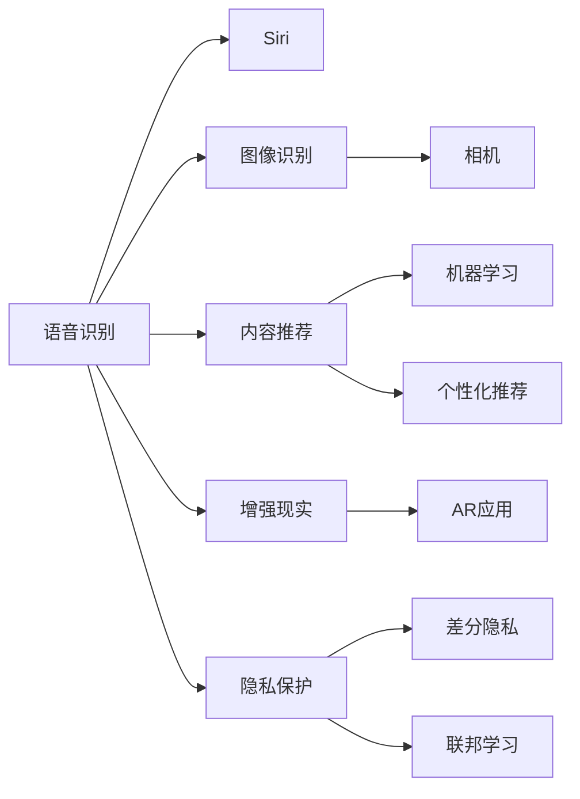

                 

# 李开复：苹果发布AI应用的意义

## 1. 背景介绍

在人工智能(AI)迅速发展的今天，各大科技公司纷纷将AI技术融入产品和服务中，以提升用户体验、提高效率。2023年，苹果公司发布了一系列基于AI的新产品和服务，这不仅展示了其在AI领域的深厚积累，也引发了业内外对于AI应用意义的广泛讨论。本文将深入探讨苹果AI应用背后的技术原理，分析其对于未来科技发展的意义，并展望AI在各行各业的应用前景。

## 2. 核心概念与联系

### 2.1 核心概念概述

苹果公司发布的AI应用主要集中在以下几个方面：

- **语音识别**：通过Siri等语音助手，利用自然语言处理(NLP)技术实现语音与文本之间的转换，为用户提供即时的语音交互服务。
- **图像识别**：通过相机和图像处理技术，实现面部识别、物体识别等，提升用户体验和设备智能化。
- **内容推荐**：基于机器学习算法，对用户行为进行分析，推荐个性化的内容和应用，提升用户黏性。
- **增强现实(AR)技术**：结合计算机视觉和机器学习技术，为用户提供沉浸式的AR体验，推动虚拟与现实结合。
- **隐私保护**：采用差分隐私、联邦学习等技术，确保用户数据在获得智能服务的同时，其隐私得到保护。

这些应用涵盖了AI技术的多个领域，如NLP、计算机视觉、机器学习等，展示了苹果在AI技术综合应用方面的卓越能力。

### 2.2 核心概念原理和架构的 Mermaid 流程图



该流程图展示了苹果AI应用的各个核心概念及其相互联系，从语音识别到隐私保护，每项技术都与用户数据和设备体验紧密相关。

## 3. 核心算法原理 & 具体操作步骤

### 3.1 算法原理概述

苹果的AI应用主要基于以下几个算法原理：

- **深度学习**：采用深度神经网络模型，对大规模数据进行学习，提取特征并进行分类、预测等任务。
- **迁移学习**：在特定任务上使用预训练模型，通过微调优化，以实现更高效的模型训练。
- **强化学习**：通过奖励机制，让模型在特定环境下学习最优策略，以提升用户体验和设备性能。
- **生成对抗网络(GANs)**：利用对抗性训练，生成更逼真的图像和视频，提升AR体验。
- **差分隐私**：在数据收集和处理过程中，通过添加噪声和数据扰动，确保用户数据隐私。

这些算法共同构成了苹果AI应用的技术基础，使得AI技术能够无缝集成到苹果的各类产品和服务中。

### 3.2 算法步骤详解

苹果AI应用的开发和部署通常遵循以下步骤：

1. **数据收集**：收集与AI应用相关的用户数据，如语音、图像、行为数据等。
2. **模型训练**：使用深度学习框架，对收集到的数据进行模型训练，优化算法参数。
3. **模型部署**：将训练好的模型部署到设备或云平台上，实现实时推理和预测。
4. **用户反馈**：收集用户对于AI应用的反馈，持续优化模型和算法。
5. **隐私保护**：采用差分隐私等技术，确保用户数据安全。

这些步骤涵盖了从数据到模型的全流程，确保了AI应用的高效性和安全性。

### 3.3 算法优缺点

苹果AI应用的优点包括：

- **用户体验提升**：通过AI技术，提升语音识别、图像识别等功能的准确性和流畅性，增强用户互动。
- **设备智能化**：利用AI进行内容推荐和增强现实，提升设备的功能和用户体验。
- **隐私保护**：通过差分隐私和联邦学习等技术，确保用户数据的安全和隐私。

缺点方面，主要集中在：

- **计算资源消耗**：大规模AI模型的训练和推理需要高性能计算资源，增加了设备成本。
- **算法复杂性**：部分算法（如GANs）训练复杂，对技术要求较高。
- **数据隐私问题**：用户数据收集和使用过程中，可能面临隐私泄露的风险。

### 3.4 算法应用领域

苹果AI应用主要应用在以下几个领域：

- **消费电子产品**：如iPhone、iPad等，通过AI技术提升设备智能化水平。
- **服务类应用**：如Siri语音助手、Apple Pay等，提供智能化的用户服务。
- **内容推荐**：如App Store的个性化推荐，提升用户黏性。
- **增强现实**：如ARKit等，提供沉浸式的交互体验。
- **健康与医疗**：如健康监测设备，通过AI分析用户健康数据。

## 4. 数学模型和公式 & 详细讲解 & 举例说明

### 4.1 数学模型构建

苹果AI应用中，深度学习模型是其核心。以图像识别为例，模型结构通常包括卷积层、池化层、全连接层等。以下是卷积神经网络(CNN)的基本结构：

$$
\text{CNN} = \text{Convolutional Layer} + \text{Pooling Layer} + \text{Fully Connected Layer} + \text{Softmax Layer}
$$

其中，卷积层和池化层用于提取图像特征，全连接层进行特征分类，Softmax层输出分类概率。

### 4.2 公式推导过程

以图像分类任务为例，常用的分类模型为LeNet，其目标函数为交叉熵损失函数：

$$
\mathcal{L} = -\frac{1}{N} \sum_{i=1}^N \sum_{j=1}^C y_{ij} \log(\hat{y}_{ij})
$$

其中，$y_{ij}$ 为真实标签，$\hat{y}_{ij}$ 为模型预测概率。通过反向传播算法，求解损失函数最小值，优化模型参数。

### 4.3 案例分析与讲解

苹果在Siri语音识别中，采用了基于RNN的深度学习模型，结合声学模型和语言模型，实现了高精度的语音转文本。其核心公式为：

$$
p(y_t|x_{1:T},y_{1:t-1}) = \frac{p(y_t|x_t)}{p(x_t|x_{1:t-1},y_{1:t-1})}
$$

其中，$y_t$ 为第$t$个时间步的文本输出，$x_t$ 为第$t$个时间步的音频信号。通过最大化似然函数，优化模型参数，实现高精度的语音识别。

## 5. 项目实践：代码实例和详细解释说明

### 5.1 开发环境搭建

为了实现苹果的AI应用，需要先搭建开发环境。以下是在MacOS上搭建Python环境的示例：

1. 安装Homebrew：
```bash
/bin/bash -c "$(curl -fsSL https://raw.githubusercontent.com/Homebrew/install/HEAD/install.sh)"
```

2. 安装Python和相关库：
```bash
brew install python@3.9
```

3. 配置Python环境：
```bash
python --version
```

### 5.2 源代码详细实现

以图像分类为例，以下是基于PyTorch框架的图像分类模型代码：

```python
import torch
import torch.nn as nn
import torch.optim as optim

class CNNModel(nn.Module):
    def __init__(self):
        super(CNNModel, self).__init__()
        self.conv1 = nn.Conv2d(3, 64, kernel_size=3, stride=1, padding=1)
        self.pool1 = nn.MaxPool2d(kernel_size=2, stride=2)
        self.conv2 = nn.Conv2d(64, 128, kernel_size=3, stride=1, padding=1)
        self.pool2 = nn.MaxPool2d(kernel_size=2, stride=2)
        self.fc1 = nn.Linear(128*4*4, 256)
        self.fc2 = nn.Linear(256, 10)

    def forward(self, x):
        x = nn.functional.relu(self.conv1(x))
        x = self.pool1(x)
        x = nn.functional.relu(self.conv2(x))
        x = self.pool2(x)
        x = x.view(-1, 128*4*4)
        x = nn.functional.relu(self.fc1(x))
        x = self.fc2(x)
        return x

model = CNNModel()
criterion = nn.CrossEntropyLoss()
optimizer = optim.SGD(model.parameters(), lr=0.001)

# 训练过程
for epoch in range(10):
    running_loss = 0.0
    for i, data in enumerate(trainloader, 0):
        inputs, labels = data
        optimizer.zero_grad()
        outputs = model(inputs)
        loss = criterion(outputs, labels)
        loss.backward()
        optimizer.step()
        running_loss += loss.item()
        if i % 200 == 199:
            print('[%d, %5d] loss: %.3f' %
                  (epoch + 1, i + 1, running_loss / 200))
            running_loss = 0.0
```

### 5.3 代码解读与分析

以上代码展示了基于PyTorch的卷积神经网络模型训练过程。关键代码解析如下：

1. `CNNModel`类定义了卷积神经网络的结构，包括卷积层、池化层、全连接层等。
2. `forward`方法实现了前向传播，计算输出。
3. `criterion`定义了交叉熵损失函数，用于评估模型预测准确性。
4. `optimizer`定义了优化器（这里使用SGD），用于更新模型参数。
5. 训练过程中，通过迭代训练集，更新模型参数，优化损失函数。

## 6. 实际应用场景

### 6.1 消费电子产品

苹果的AI应用在消费电子产品中得到了广泛应用，如iPhone、iPad等设备中集成了Siri、相机增强等功能，显著提升了用户体验。

### 6.2 服务类应用

Siri语音助手作为AI应用的重要代表，实现了语音识别、自然语言处理等功能，为用户提供便捷的交互方式。

### 6.3 内容推荐

Apple Pay等应用基于机器学习算法，通过分析用户行为，推荐个性化的支付方案和服务，提升用户体验和黏性。

### 6.4 增强现实

ARKit等技术结合计算机视觉和AI技术，提供沉浸式的AR体验，推动虚拟与现实结合，开辟了新的应用场景。

## 7. 工具和资源推荐

### 7.1 学习资源推荐

为了深入理解苹果AI应用的原理和实现，以下推荐一些优质的学习资源：

1. 《深度学习》课程：斯坦福大学Andrew Ng教授主讲的深度学习课程，系统介绍了深度学习的基本概念和算法。
2. PyTorch官方文档：PyTorch官方提供的文档，包括模型实现、API参考等，是学习深度学习的必备资源。
3. Apple官方开发者文档：苹果公司提供的开发者文档，涵盖各种AI应用的技术实现和API接口。

### 7.2 开发工具推荐

苹果AI应用开发常用的工具包括：

1. Xcode：苹果官方开发工具，支持iOS、macOS等多种平台开发。
2. PyTorch：深度学习框架，提供了丰富的模型和算法库。
3. TensorFlow：Google提供的深度学习框架，支持多种平台和算法。
4. FastAI：基于PyTorch的深度学习库，提供了高层次的API接口，便于快速开发。
5. Jupyter Notebook：交互式编程环境，便于编写和测试代码。

### 7.3 相关论文推荐

苹果AI应用的研发离不开前沿的学术研究。以下是几篇与苹果AI应用相关的论文，推荐阅读：

1. "FaceNet: A Unified Embedding for Face Recognition and Clustering"：提出基于深度神经网络的人脸识别算法，应用于iPhone的面部解锁功能。
2. "Reinforcement Learning for Personalized Notification in Apple's Notification System"：研究如何通过强化学习算法，优化iOS设备的通知策略，提升用户体验。
3. "Personalization and Modeling of Deep Learning Algorithms for Image Recognition on Mobile Devices"：探讨如何在移动设备上优化深度学习模型，实现高效的图像识别应用。

## 8. 总结：未来发展趋势与挑战

### 8.1 研究成果总结

苹果公司通过AI技术的应用，展示了其在AI领域的强大实力。其AI应用不仅提升了用户体验，还推动了设备的智能化和个性化发展。未来，随着AI技术的不断进步，苹果的AI应用将进一步拓展应用场景，提升产品竞争力。

### 8.2 未来发展趋势

展望未来，苹果AI应用的趋势可能包括：

- **更加智能化**：通过深度学习和大数据技术，提升设备的功能和体验，提供更智能化的服务。
- **跨平台集成**：将AI应用集成到更多设备和平台，实现无缝的跨平台体验。
- **增强现实**：进一步提升AR技术的体验和应用场景，推动虚拟与现实的深度融合。
- **隐私保护**：通过差分隐私等技术，确保用户数据的安全和隐私。

### 8.3 面临的挑战

苹果AI应用在发展过程中面临的挑战包括：

- **计算资源消耗**：大规模AI模型的训练和推理需要高性能计算资源，增加了设备成本。
- **算法复杂性**：部分算法（如GANs）训练复杂，对技术要求较高。
- **数据隐私问题**：用户数据收集和使用过程中，可能面临隐私泄露的风险。

### 8.4 研究展望

未来的研究应在以下几个方面进行突破：

- **高效计算**：优化AI模型和算法，降低计算资源消耗，提升推理速度。
- **算法简化**：简化复杂算法，提高模型的易用性和可扩展性。
- **隐私保护**：探索更多隐私保护技术，确保用户数据的安全。

## 9. 附录：常见问题与解答

**Q1：苹果的AI应用是如何提升用户体验的？**

A: 苹果的AI应用通过语音识别、图像识别、内容推荐等技术，提升了用户体验。例如，Siri语音助手通过自然语言处理技术，实现了语音与文本的转换，提供了便捷的交互方式。

**Q2：苹果的AI应用对计算资源有哪些要求？**

A: 苹果的AI应用对计算资源的需求较高，主要体现在以下几个方面：
1. 大规模数据训练：需要高性能计算资源进行模型训练。
2. 实时推理：需要高效的推理算法和硬件支持，保证模型实时响应。

**Q3：苹果的AI应用如何确保用户隐私安全？**

A: 苹果的AI应用采用了差分隐私等技术，确保用户数据在收集和使用过程中的隐私安全。具体措施包括：
1. 数据加密：对用户数据进行加密存储和传输。
2. 差分隐私：在数据处理过程中添加噪声，确保个体数据无法被逆向推断。
3. 联邦学习：通过分布式训练，保护用户数据本地存储。

**Q4：苹果的AI应用在开发过程中需要注意哪些问题？**

A: 苹果的AI应用在开发过程中需要注意以下几个问题：
1. 模型优化：优化模型结构，提高推理效率。
2. 数据质量：确保数据集的质量和多样性，提升模型性能。
3. 算法选择：根据具体任务选择合适的算法，避免过拟合。

**Q5：苹果的AI应用在各个行业领域的应用前景如何？**

A: 苹果的AI应用在各个行业领域具有广泛的应用前景：
1. 消费电子：提升设备的智能化和用户体验。
2. 服务类应用：提供智能化的用户服务，提升工作效率。
3. 医疗健康：通过健康监测设备，分析用户健康数据。
4. 教育：利用AI技术，提供个性化的学习推荐。

总之，苹果的AI应用展示了AI技术在各行各业的应用潜力，未来有望在更多领域实现突破和创新。

---

作者：禅与计算机程序设计艺术 / Zen and the Art of Computer Programming

