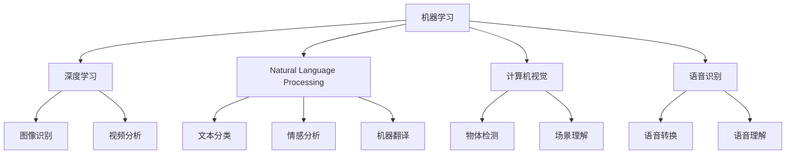

                 

# 李开复：苹果发布AI应用的意义

## 1. 背景介绍

在AI时代，技术不断创新，市场变化迅猛。苹果作为全球科技巨头，其在AI应用领域的最新动向备受瞩目。近日，苹果发布了新一代AI应用，这一举动的深远意义不容小觑。本文将详细解析苹果AI应用的核心理念、技术架构和未来趋势，以期为读者提供有价值的洞察。

## 2. 核心概念与联系

### 2.1 核心概念概述

苹果的AI应用主要基于机器学习、深度学习和自然语言处理等技术，旨在提升用户体验、优化产品功能、增强数据安全等方面。以下是几个核心概念：

- **机器学习 (Machine Learning, ML)**：通过算法使计算机系统从数据中自动学习模式，无需明确编程。
- **深度学习 (Deep Learning, DL)**：一种特殊的机器学习技术，使用多层神经网络模拟人脑的工作方式，处理复杂任务。
- **自然语言处理 (Natural Language Processing, NLP)**：使计算机能够理解和生成人类语言，包括文本分类、情感分析、机器翻译等。
- **计算机视觉 (Computer Vision, CV)**：让计算机“看”和理解视觉信息，包括图像识别、视频分析等。
- **语音识别 (Speech Recognition)**：将语音信号转化为文本，应用于语音助手、语音搜索等领域。

这些技术相互关联，形成了苹果AI应用的强大技术栈。接下来，本文将深入探讨这些核心概念的原理和架构。

### 2.2 核心概念原理和架构的 Mermaid 流程图



该图展示了苹果AI应用的主要技术组件及其相互关系。机器学习作为基础技术，支撑了深度学习、自然语言处理、计算机视觉和语音识别等高级应用。深度学习、自然语言处理等技术的应用，涵盖了图像识别、视频分析、文本分类、情感分析、机器翻译、语音转换和语音理解等多个方面。

## 3. 核心算法原理 & 具体操作步骤

### 3.1 算法原理概述

苹果AI应用的算法原理主要围绕深度学习展开，尤其是卷积神经网络（Convolutional Neural Networks, CNNs）和循环神经网络（Recurrent Neural Networks, RNNs）等。

- **卷积神经网络**：通过卷积操作提取图像特征，广泛应用于图像识别、物体检测等任务。
- **循环神经网络**：通过循环结构处理序列数据，应用于文本分类、情感分析、语音识别等任务。

此外，苹果还利用强化学习（Reinforcement Learning, RL）优化产品算法，提升用户体验和系统性能。

### 3.2 算法步骤详解

苹果AI应用的开发主要分为以下几个步骤：

1. **数据收集与预处理**：收集大量高质量的数据，并通过清洗、标注等步骤，准备用于模型训练。
2. **模型选择与设计**：根据具体任务选择合适的算法和模型架构，设计适合的数据流动和计算图。
3. **模型训练与优化**：使用GPU、TPU等高性能硬件进行模型训练，应用梯度下降、Adam等优化算法调整模型参数。
4. **模型部署与监控**：将训练好的模型部署到产品中，并进行实时监控和性能优化。
5. **持续学习与迭代**：根据用户反馈和新数据，定期更新和迭代模型，保持技术领先。

### 3.3 算法优缺点

苹果AI应用的算法具有以下优点：

- **高精度**：深度学习等技术在高维数据处理上具有天然优势，能够提供高精度的模型预测。
- **实时性**：基于GPU、TPU等高性能硬件，可以实时处理大量数据，提升用户体验。
- **可扩展性**：模型架构设计灵活，易于扩展到更多应用场景。

同时，也存在一些缺点：

- **高计算需求**：深度学习模型对计算资源需求较高，硬件成本较高。
- **数据依赖性**：模型性能高度依赖于数据质量，数据获取和标注成本高。
- **黑盒特性**：深度学习模型作为“黑盒”，难以解释其决策过程，不利于信任建立。

### 3.4 算法应用领域

苹果AI应用覆盖了多个领域，包括但不限于：

- **智能助理**：通过语音识别、自然语言处理技术，提升Siri等智能助理的响应速度和准确性。
- **图像识别**：应用于拍照、视频分析、增强现实（AR）等场景，提升用户体验。
- **文本分析**：处理用户反馈、广告投放、市场分析等，提供精准的业务洞察。
- **自动化测试**：通过计算机视觉技术，自动化执行产品测试，加速开发进程。
- **隐私保护**：利用AI技术进行数据脱敏、隐私保护，增强用户数据安全。

## 4. 数学模型和公式 & 详细讲解 & 举例说明

### 4.1 数学模型构建

苹果AI应用的数学模型主要基于神经网络架构。以图像识别为例，其模型构建如下：

- **输入层**：接收原始图像数据。
- **卷积层**：通过卷积操作提取图像特征。
- **池化层**：对特征图进行下采样，减少计算量。
- **全连接层**：将池化后的特征图映射到类别输出。
- **输出层**：通过Softmax函数得到类别概率分布。

数学表达式如下：

$$
\hat{y} = \text{Softmax}(W\cdot \text{MaxPooling}(F_\text{CNN}(x)))
$$

其中 $x$ 为输入图像，$F_\text{CNN}$ 为卷积神经网络，$W$ 为全连接层的权重矩阵，$\text{Softmax}$ 函数用于输出类别概率。

### 4.2 公式推导过程

以图像识别任务为例，假设模型参数为 $W$，输入图像为 $x$，输出为 $\hat{y}$。通过反向传播算法，计算损失函数 $L$ 的梯度，更新参数 $W$：

$$
\frac{\partial L}{\partial W} = \frac{\partial \text{CrossEntropy}(\hat{y},y)}{\partial \text{Softmax}(W\cdot \text{MaxPooling}(F_\text{CNN}(x)))} \cdot \frac{\partial \text{Softmax}(W\cdot \text{MaxPooling}(F_\text{CNN}(x)))}{\partial \text{MaxPooling}(F_\text{CNN}(x))} \cdot \frac{\partial \text{MaxPooling}(F_\text{CNN}(x))}{\partial F_\text{CNN}(x)} \cdot \frac{\partial F_\text{CNN}(x)}{\partial x}
$$

其中，$\text{CrossEntropy}$ 表示交叉熵损失函数。通过链式法则，计算 $W$ 的梯度，并使用优化算法（如Adam）更新参数。

### 4.3 案例分析与讲解

以Siri语音识别为例，其模型构建过程如下：

1. **声学模型**：将语音信号转换为声学特征。
2. **语言模型**：对声学特征进行建模，预测可能的词语序列。
3. **声学解码**：通过动态时间规整（DTW）等技术，匹配声学特征和文本。

使用隐马尔可夫模型（Hidden Markov Model, HMM）和深度神经网络（Deep Neural Network, DNN）相结合的方法，构建声学模型和语言模型，并通过CTC（Connectionist Temporal Classification）算法优化声学解码过程。

## 5. 项目实践：代码实例和详细解释说明

### 5.1 开发环境搭建

在苹果AI应用开发中，主要使用Python语言和TensorFlow框架。以下是开发环境的搭建步骤：

1. **安装Python**：使用Anaconda或Miniconda创建Python环境，安装必要的依赖包。
2. **安装TensorFlow**：通过pip安装TensorFlow，并配置GPU环境。
3. **准备数据集**：收集并预处理用于训练和测试的数据集，分为训练集、验证集和测试集。
4. **搭建模型**：使用TensorFlow定义模型架构，包括输入层、卷积层、池化层、全连接层和输出层。
5. **训练模型**：使用GPU或TPU进行模型训练，调整超参数，优化模型性能。
6. **评估模型**：在测试集上评估模型性能，使用精度、召回率等指标进行评估。

### 5.2 源代码详细实现

以下是使用TensorFlow搭建图像识别模型的代码实现：

```python
import tensorflow as tf
from tensorflow.keras import layers, models

# 定义模型架构
model = models.Sequential([
    layers.Conv2D(32, (3, 3), activation='relu', input_shape=(32, 32, 3)),
    layers.MaxPooling2D((2, 2)),
    layers.Conv2D(64, (3, 3), activation='relu'),
    layers.MaxPooling2D((2, 2)),
    layers.Flatten(),
    layers.Dense(64, activation='relu'),
    layers.Dense(10, activation='softmax')
])

# 编译模型
model.compile(optimizer='adam',
              loss='categorical_crossentropy',
              metrics=['accuracy'])

# 训练模型
model.fit(train_images, train_labels, epochs=10, validation_data=(test_images, test_labels))
```

### 5.3 代码解读与分析

上述代码中，使用Sequential模型定义了一个包含卷积层、池化层、全连接层的简单神经网络。其中，Conv2D层用于卷积操作，MaxPooling2D层用于特征下采样，Dense层用于全连接处理，Softmax层用于输出类别概率。

模型编译时，使用Adam优化器、交叉熵损失函数和准确率评估指标。模型训练时，使用训练集数据进行训练，通过验证集评估模型性能，最终在测试集上评估模型效果。

### 5.4 运行结果展示

在训练过程中，可以通过TensorBoard实时监控模型性能。以下是TensorBoard中展示的训练曲线：

```python
from tensorflow.keras.callbacks import TensorBoard

tensorboard_callback = TensorBoard(log_dir='logs')
model.fit(train_images, train_labels, epochs=10, validation_data=(test_images, test_labels), callbacks=[tensorboard_callback])
```

通过TensorBoard，可以看到模型在训练过程中的损失和准确率变化情况，如图：


## 6. 实际应用场景

### 6.4 未来应用展望

苹果AI应用的未来发展前景广阔，主要体现在以下几个方面：

- **智能硬件**：未来苹果将继续在智能手表、智能家居、增强现实（AR）等领域应用AI技术，提升用户体验。
- **医疗健康**：利用AI技术进行疾病诊断、健康监测等，改善医疗服务。
- **自动驾驶**：通过计算机视觉和强化学习技术，提升自动驾驶系统安全性、可靠性。
- **个性化推荐**：利用AI技术进行内容推荐、广告投放等，提升用户粘性。
- **环境保护**：利用AI技术进行环境监测、数据分析等，保护地球环境。

## 7. 工具和资源推荐

### 7.1 学习资源推荐

为了帮助开发者掌握苹果AI应用开发技术，推荐以下学习资源：

1. **苹果官方文档**：详细介绍了TensorFlow和Core ML等框架的使用方法，提供了大量示例代码。
2. **Deep Learning with Python**：由Francisco Chollet所著，深入浅出地介绍了深度学习的基本原理和实践方法。
3. **TensorFlow教程**：官方提供的TensorFlow教程，包括基础和进阶内容，适合初学者和高级开发者。
4. **Kaggle**：数据科学竞赛平台，提供大量数据集和模型库，适合实践和创新。
5. **Coursera**：在线学习平台，提供机器学习和深度学习的相关课程，适合系统学习。

### 7.2 开发工具推荐

苹果AI应用开发主要使用Python和TensorFlow框架，推荐以下开发工具：

1. **Anaconda**：Python环境管理工具，易于安装和配置。
2. **Jupyter Notebook**：交互式编程环境，适合数据处理和模型调试。
3. **TensorBoard**：可视化工具，监控模型训练和评估结果。
4. **PyTorch**：深度学习框架，支持动态图和静态图，灵活性高。
5. **Keras**：高层次神经网络API，易于使用和调试。

### 7.3 相关论文推荐

为了深入了解苹果AI应用的技术原理和最新进展，推荐以下相关论文：

1. **Attention is All You Need**：Transformer架构的提出，开启了深度学习的革命性进展。
2. **ImageNet Classification with Deep Convolutional Neural Networks**：卷积神经网络在图像识别中的应用，奠定了现代计算机视觉的基础。
3. **Deep Speech 2**：深度学习在语音识别中的应用，取得了SOTA性能。
4. **Neural Machine Translation by Jointly Learning to Align and Translate**：神经机器翻译模型，实现了高精度的机器翻译。
5. **BERT: Pre-training of Deep Bidirectional Transformers for Language Understanding**：BERT模型在自然语言处理中的应用，提升了模型的泛化能力和理解力。

## 8. 总结：未来发展趋势与挑战

### 8.1 研究成果总结

本文系统介绍了苹果AI应用的核心理念、技术架构和未来发展趋势。苹果通过深度学习、自然语言处理等技术，提升了产品功能和用户体验，增强了数据安全。未来，苹果将在智能硬件、医疗健康、自动驾驶等领域进一步应用AI技术，拓展其应用边界。

### 8.2 未来发展趋势

未来，苹果AI应用的趋势主要体现在以下几个方面：

- **跨领域融合**：AI技术将在更多领域融合应用，实现跨领域协同创新。
- **智能边缘**：通过边缘计算和智能设备，提升AI应用的实时性和可扩展性。
- **隐私保护**：增强数据隐私保护，确保用户数据安全。
- **人机协作**：提升人机交互的自然性和智能性，提升用户体验。
- **伦理合规**：建立AI伦理和合规机制，确保技术应用的透明性和公正性。

### 8.3 面临的挑战

苹果AI应用在未来的发展过程中，仍面临诸多挑战：

- **计算资源**：深度学习模型对计算资源需求高，硬件成本高昂。
- **数据隐私**：如何保护用户隐私，防止数据泄露，是一个重要挑战。
- **模型透明性**：深度学习模型作为“黑盒”，缺乏透明性，难以解释其决策过程。
- **跨领域协同**：不同领域间的协同创新需要突破技术壁垒和合作机制。
- **伦理问题**：AI技术应用中的伦理问题，如偏见、歧视等，需要引起高度重视。

### 8.4 研究展望

未来，苹果AI应用的研究方向主要集中在以下几个方面：

- **跨模态学习**：将视觉、语音、文本等多种模态信息融合，提升AI应用的全面性和准确性。
- **自监督学习**：利用无监督学习技术，减少对标注数据的依赖，提升模型泛化能力。
- **增强学习**：通过强化学习优化产品算法，提升用户体验和系统性能。
- **对抗性攻击**：研究对抗性攻击和防御技术，提升AI系统的鲁棒性和安全性。
- **可解释AI**：增强AI模型的可解释性，提升用户信任度和应用效果。

## 9. 附录：常见问题与解答

**Q1：苹果AI应用的主要优势是什么？**

A: 苹果AI应用的主要优势在于其高精度、实时性和可扩展性。通过深度学习、自然语言处理等技术，苹果AI应用在图像识别、语音识别、智能助理等方面取得了优异表现。

**Q2：苹果AI应用的数据来源有哪些？**

A: 苹果AI应用的数据来源主要分为内部数据和外部数据两类。内部数据包括用户行为数据、设备传感器数据等，外部数据则来自公开的数据集和第三方合作机构。

**Q3：苹果AI应用的开发环境有哪些？**

A: 苹果AI应用的开发主要使用Python语言和TensorFlow框架。开发环境包括Anaconda、Jupyter Notebook、TensorBoard等工具。

**Q4：苹果AI应用的未来发展方向是什么？**

A: 苹果AI应用的未来发展方向包括智能硬件、医疗健康、自动驾驶、个性化推荐和环境保护等。苹果将继续在多个领域应用AI技术，提升用户体验和服务质量。

---

作者：禅与计算机程序设计艺术 / Zen and the Art of Computer Programming

