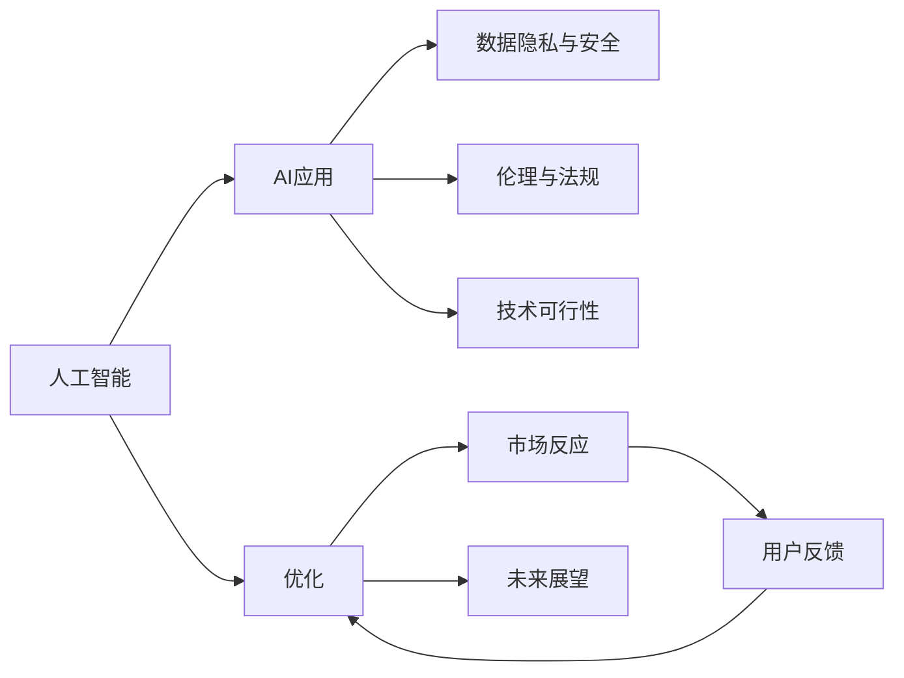

                 

# 李开复：苹果发布AI应用的挑战

> 关键词：苹果, 人工智能, AI应用, 创新, 挑战

## 1. 背景介绍

在科技与日俱进的今天，苹果公司无疑是全球科技创新的领军企业。然而，随着AI技术的快速发展和应用落地，苹果在发布其最新AI应用时也面临着一系列挑战。本文将深入探讨苹果在发布AI应用时所面临的挑战、应对策略及未来展望，以期为其他企业提供有价值的参考。

## 2. 核心概念与联系

### 2.1 核心概念概述

要理解苹果在发布AI应用时所面临的挑战，首先需了解几个关键概念：

- **人工智能 (AI)**：利用计算机算法和机器学习技术使计算机具备智能行为，包括学习、推理、自我纠正等能力。
- **AI应用**：将人工智能技术应用于具体领域或解决特定问题，如自动驾驶、语音识别、智能推荐等。
- **数据隐私与安全**：AI应用在获取和处理数据时，必须保护用户隐私，防止数据泄露和滥用。
- **伦理与法规**：AI应用应遵循一定的伦理原则和法律法规，如透明性、公平性、可解释性等。
- **技术可行性**：AI应用的技术实现，包括模型训练、算法选择、硬件支持等，是决定其成功与否的关键。

这些核心概念之间存在密切联系，共同构成了苹果在发布AI应用时所需要考虑的全面框架。

### 2.2 核心概念原理和架构的 Mermaid 流程图



上述流程图展示了从AI技术到AI应用发布及其面临的挑战和解决路径。苹果在发布AI应用时，需从技术、伦理、隐私和法规等多个维度进行考量，并根据市场和用户反馈不断优化。

## 3. 核心算法原理 & 具体操作步骤

### 3.1 算法原理概述

苹果在发布AI应用时，通常会结合其自身在硬件、软件、用户体验等方面的优势，采用如下几种算法原理：

- **深度学习 (Deep Learning)**：利用多层神经网络进行数据分析和模式识别，是当前AI应用的核心技术之一。
- **强化学习 (Reinforcement Learning)**：通过模拟环境和智能决策机制，使AI应用能够自适应环境变化，如自动驾驶。
- **自然语言处理 (Natural Language Processing, NLP)**：使AI应用能够理解、生成和处理人类语言，如语音助手、翻译工具。
- **计算机视觉 (Computer Vision)**：使AI应用能够识别和分析图像和视频内容，如人脸识别、图像搜索。

### 3.2 算法步骤详解

苹果在发布AI应用时，其核心步骤包括以下几个方面：

1. **需求调研**：根据用户需求和技术趋势，确定AI应用的目标和功能。
2. **模型训练与验证**：利用大量数据训练AI模型，并进行验证以确保其准确性和鲁棒性。
3. **用户体验设计**：结合苹果的硬件和软件优势，优化用户体验，如界面设计、交互方式等。
4. **测试与优化**：在发布前进行广泛的测试，根据用户反馈优化应用功能。
5. **合规与隐私保护**：确保应用符合数据隐私法规，保护用户数据安全。
6. **市场推广**：制定有效的市场推广策略，确保应用能够获得市场认可。

### 3.3 算法优缺点

苹果在发布AI应用时，面临的优缺点如下：

**优点**：
- 苹果拥有强大的硬件平台（如A系列芯片）和软件生态系统（如iOS系统），能够提供高性能和稳定的AI应用体验。
- 苹果在用户体验设计上有着深厚积累，能够提供流畅、易用的AI应用。
- 苹果在隐私保护方面有着较高的标准，能够赢得用户信任。

**缺点**：
- 苹果的生态系统较为封闭，可能影响与其他平台之间的互操作性。
- 苹果的AI算法依赖第三方开源库，可能存在安全漏洞。
- 苹果在AI技术的深度和广度上，相较于谷歌、亚马逊等技术巨头仍有一定的差距。

### 3.4 算法应用领域

苹果的AI应用主要涵盖以下几个领域：

1. **智能助手**：如Siri、Shortcuts等，利用NLP和强化学习技术，提供语音控制、任务自动化等功能。
2. **图像与视频处理**：如Face ID、照片增强等，利用计算机视觉技术，提高用户体验。
3. **增强现实 (AR)**：如ARKit、AR应用等，利用深度学习技术，提供沉浸式体验。
4. **健康管理**：如Apple Watch的健康监测、AI药物研发等，利用深度学习和大数据分析，提升健康管理水平。

## 4. 数学模型和公式 & 详细讲解 & 举例说明

### 4.1 数学模型构建

苹果在发布AI应用时，通常会构建以下数学模型：

- **卷积神经网络 (Convolutional Neural Network, CNN)**：用于图像识别和处理，模型结构如下：
$$
\mathcal{F}_{CNN}(x) = \sigma(W_{conv} * x + b_{conv}) + \sigma(W_{pool} * x + b_{pool})
$$
其中，$x$ 为输入图像，$W_{conv}$ 和 $W_{pool}$ 为卷积和池化层的权重矩阵，$b_{conv}$ 和 $b_{pool}$ 为偏置项，$\sigma$ 为激活函数。

- **循环神经网络 (Recurrent Neural Network, RNN)**：用于自然语言处理，模型结构如下：
$$
\mathcal{F}_{RNN}(x) = \sigma(W_{rec} * x + b_{rec}) + \sigma(W_{lstm} * x + b_{lstm})
$$
其中，$x$ 为输入序列，$W_{rec}$ 和 $W_{lstm}$ 为递归和LSTM层的权重矩阵，$b_{rec}$ 和 $b_{lstm}$ 为偏置项，$\sigma$ 为激活函数。

### 4.2 公式推导过程

以CNN为例，其前向传播过程的详细推导如下：

1. 卷积层：
$$
\mathcal{F}_{conv}(x) = \sigma(W_{conv} * x + b_{conv})
$$
其中，$*$ 表示卷积运算，$\sigma$ 为激活函数。

2. 池化层：
$$
\mathcal{F}_{pool}(x) = \sigma(W_{pool} * x + b_{pool})
$$
其中，$*$ 表示池化运算，$\sigma$ 为激活函数。

3. 全连接层：
$$
\mathcal{F}_{fc}(x) = \sigma(W_{fc} * x + b_{fc})
$$
其中，$*$ 表示矩阵乘法，$\sigma$ 为激活函数。

4. 输出层：
$$
\mathcal{F}_{out}(x) = \sigma(W_{out} * x + b_{out})
$$
其中，$*$ 表示矩阵乘法，$\sigma$ 为激活函数。

### 4.3 案例分析与讲解

以Siri为例，Siri的语音识别和理解过程通过NLP和深度学习技术实现。Siri首先通过前端处理，将语音信号转化为文本，然后通过RNN模型处理文本，最后通过全连接层输出结果。

具体而言，Siri的语音识别过程如下：
1. 前端处理：将语音信号转换为MFCC特征。
2. 特征提取：利用CNN模型提取语音特征。
3. 语音识别：利用RNN模型识别文本。
4. 意图理解：利用深度学习模型理解用户意图。

## 5. 项目实践：代码实例和详细解释说明

### 5.1 开发环境搭建

苹果在发布AI应用时，通常采用Xcode开发环境，以下是一步步搭建开发环境的指南：

1. 安装Xcode：从官网下载安装Xcode，并验证安装完成。
2. 配置iOS模拟器：在Xcode中选择模拟器，配置相关参数。
3. 安装第三方库：通过CocoaPods或Carthage等工具安装第三方库，如CoreML、AVFoundation等。

### 5.2 源代码详细实现

以下是一个使用CoreML进行图像识别的代码示例：

```python
import coremltools as ct
import cv2

# 加载模型
model = ct.load_model('my_model.mlmodel')

# 加载图片
img = cv2.imread('test.jpg')

# 预处理图片
img = cv2.resize(img, (224, 224))
img = (img - 127.5) / 127.5

# 进行推理
result = model.predict([img])

# 处理结果
labels = model.class_labels
predicted_label = result.argmax()
print(f"Predicted label: {labels[predicted_label]}")
```

### 5.3 代码解读与分析

上述代码实现了使用CoreML进行图像识别的过程。首先，通过`ct.load_model`方法加载CoreML模型。然后，通过OpenCV加载图片，并进行预处理，确保图片尺寸和格式符合模型要求。接着，调用`predict`方法进行推理，最后根据模型输出的结果，输出预测类别。

## 6. 实际应用场景

### 6.1 智能助手

苹果的智能助手Siri是AI应用的重要代表，通过语音识别和自然语言处理技术，能够实现语音控制、任务自动化等功能，极大地提升了用户的使用体验。

### 6.2 图像与视频处理

Face ID通过深度学习技术，能够在极短时间内完成人脸识别，极大地提升了安全性。此外，Apple Photos等应用通过图像增强技术，能够提升图片质量，增强用户体验。

### 6.3 增强现实

ARKit和AR应用通过深度学习技术，提供了沉浸式增强现实体验，如测量物体大小、3D场景建模等，为用户带来了全新的视觉体验。

### 6.4 健康管理

Apple Watch的健康监测和AI药物研发通过深度学习和大数据分析技术，能够提供个性化健康管理方案，提高了健康管理的水平。

## 7. 工具和资源推荐

### 7.1 学习资源推荐

- 《深度学习》课程：由斯坦福大学开设，涵盖深度学习的基本概念和算法，适合初学者学习。
- 《强化学习》课程：由加州大学伯克利分校开设，详细讲解强化学习的原理和应用。
- 《自然语言处理》课程：由北京大学开设，涵盖NLP的基本概念和技术。
- 《计算机视觉》课程：由清华大学开设，涵盖计算机视觉的基本概念和技术。

### 7.2 开发工具推荐

- Xcode：苹果官方提供的开发环境，支持iOS、macOS等平台的应用开发。
- CocoaPods：开源的第三方库管理工具，方便安装和管理第三方库。
- Carthage：开源的第三方库管理工具，支持跨平台项目。

### 7.3 相关论文推荐

- "ImageNet Classification with Deep Convolutional Neural Networks"：AlexNet论文，引入了深度学习技术，推动了图像识别领域的突破。
- "Long Short-Term Memory"：LSTM论文，提出了长短期记忆网络，提升了NLP任务的性能。
- "Learning from Examples in Unstructured Data"：提出了迁移学习的方法，提高了模型的泛化能力。
- "Real-Time Single-Image and Video Object Tracking Using Deep Association Embeddings"：提出了使用深度学习技术进行物体跟踪的方法。

## 8. 总结：未来发展趋势与挑战

### 8.1 研究成果总结

苹果在发布AI应用时，充分利用其强大的硬件和软件优势，结合深度学习和自然语言处理等技术，推出了如Siri、Face ID、ARKit等创新应用。然而，苹果在AI技术的深度和广度上，相较于其他科技巨头仍有一定的差距。

### 8.2 未来发展趋势

未来，苹果在AI应用发布上可能呈现以下趋势：

1. **跨平台合作**：苹果可能与其他平台合作，提升应用的可互操作性。
2. **隐私保护**：苹果可能推出更加严格的隐私保护措施，赢得用户信任。
3. **AI芯片优化**：苹果可能推出更先进的AI芯片，提升AI应用的性能和效率。
4. **AI技术融合**：苹果可能将AI技术与其他技术（如增强现实、虚拟现实）进行深度融合，提升用户体验。

### 8.3 面临的挑战

苹果在发布AI应用时，面临的挑战主要包括：

1. **技术壁垒**：苹果在AI技术的深度和广度上，相较于其他科技巨头仍有一定的差距。
2. **生态系统封闭**：苹果的生态系统较为封闭，可能影响与其他平台之间的互操作性。
3. **安全与隐私**：苹果需要在AI应用中严格保护用户数据隐私，防止数据泄露和滥用。

### 8.4 研究展望

苹果未来的研究重点可能包括以下几个方面：

1. **跨平台互操作性**：提升应用的可互操作性，扩展生态系统。
2. **AI芯片优化**：推出更先进的AI芯片，提升应用性能。
3. **隐私保护技术**：研究更加严格的隐私保护技术，保护用户数据。
4. **AI与其他技术的融合**：将AI技术与增强现实、虚拟现实等技术进行深度融合，提升用户体验。

## 9. 附录：常见问题与解答

**Q1：苹果在发布AI应用时，如何保护用户隐私？**

A: 苹果在发布AI应用时，通过以下几种方式保护用户隐私：
1. 数据加密：对用户数据进行加密存储，确保数据传输过程中的安全性。
2. 匿名化处理：对用户数据进行匿名化处理，保护用户隐私。
3. 访问控制：严格控制数据访问权限，确保只有授权人员才能访问用户数据。

**Q2：苹果在发布AI应用时，如何处理数据隐私与法规的冲突？**

A: 苹果在发布AI应用时，通过以下几种方式处理数据隐私与法规的冲突：
1. 合规审查：在应用发布前，进行合规审查，确保应用符合相关法规。
2. 用户同意：在使用AI应用前，获取用户同意，明确告知用户数据的使用方式。
3. 透明性：向用户公开应用数据的使用方式，确保用户知情权。

**Q3：苹果在发布AI应用时，如何确保应用的安全性？**

A: 苹果在发布AI应用时，通过以下几种方式确保应用的安全性：
1. 安全测试：在应用发布前，进行严格的安全测试，发现并修复潜在的安全漏洞。
2. 访问控制：通过身份验证和权限控制，限制对敏感数据的访问。
3. 加密传输：确保数据在传输过程中的安全性，防止数据泄露。

**Q4：苹果在发布AI应用时，如何提升用户体验？**

A: 苹果在发布AI应用时，通过以下几种方式提升用户体验：
1. 简洁易用的界面：提供简洁易用的用户界面，提升用户操作体验。
2. 智能推荐：通过AI技术，为用户提供个性化的推荐服务。
3. 即时反馈：快速响应用户操作，提供即时的反馈和响应。

作者：禅与计算机程序设计艺术 / Zen and the Art of Computer Programming

