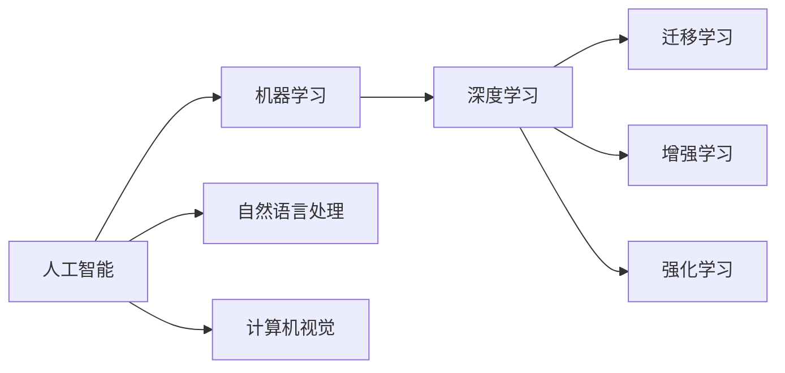

                 

# 李开复：苹果发布AI应用的挑战

## 1. 背景介绍

近年来，苹果公司在人工智能(AI)应用领域的探索步伐加快，无论是iPhone、iPad、MacBook，还是Apple Watch，都融合了大量AI功能，提升了用户体验。然而，在AI应用的开发和部署过程中，苹果面临诸多挑战。本文将深入探讨这些挑战，并提供一些应对策略，以期帮助苹果公司更好地利用AI技术。

## 2. 核心概念与联系

### 2.1 核心概念概述

为了更好地理解苹果在AI应用中遇到的问题，我们先来梳理一些核心概念：

- **人工智能（AI）**：利用机器学习、深度学习等技术，让计算机模拟人类智能行为的技术。
- **机器学习（ML）**：通过数据训练模型，使其能够自动学习和改进。
- **深度学习（DL）**：基于人工神经网络的机器学习技术，具有强大的特征学习和表示能力。
- **增强学习（RL）**：通过试错学习，使智能体（如机器人）能够不断优化策略。
- **迁移学习**：将一个领域学到的知识迁移到另一个领域，以提高学习效率和性能。
- **强化学习（Reinforcement Learning, RL）**：通过智能体与环境的互动，最大化累积奖励。
- **自然语言处理（NLP）**：使计算机能够理解和生成自然语言。
- **计算机视觉（CV）**：让计算机能够理解图像和视频数据。

这些概念彼此间相互关联，共同构成了人工智能技术的基础框架。下面，我们通过一张Mermaid流程图，展示这些概念间的联系：



## 3. 核心算法原理 & 具体操作步骤

### 3.1 算法原理概述

苹果在AI应用开发和部署过程中，主要依赖机器学习和深度学习技术。机器学习模型通常由训练数据集和模型参数构成，通过优化算法不断调整参数，使其能够适应新数据。深度学习模型通过多层次的非线性神经网络，学习数据中的高阶特征。

### 3.2 算法步骤详解

苹果在AI应用开发中，一般遵循以下步骤：

1. **数据准备**：收集和标注数据，创建训练集、验证集和测试集。
2. **模型选择**：根据任务选择合适的深度学习模型，如卷积神经网络（CNN）、递归神经网络（RNN）、Transformer等。
3. **模型训练**：使用训练集数据训练模型，通过梯度下降等优化算法不断调整参数。
4. **模型评估**：在验证集上评估模型性能，调整模型超参数和模型结构。
5. **模型部署**：将训练好的模型部署到应用程序中，进行实时推理和预测。
6. **模型监控和优化**：实时监控模型性能，不断优化模型参数和架构，提高预测准确率。

### 3.3 算法优缺点

苹果AI应用的优势在于其强大的用户体验和跨平台兼容性，但同时也存在以下挑战：

#### 优点：

- **用户体验提升**：AI功能增强了设备的功能和智能化程度。
- **跨平台兼容性**：iPhone、iPad、MacBook等设备可以共享AI模型，提升数据利用效率。
- **硬件加速**：利用苹果设备强大的GPU和神经网络加速器，提升AI应用的计算效率。

#### 缺点：

- **数据隐私和安全**：用户数据隐私保护和数据安全问题成为挑战。
- **模型可解释性**：深度学习模型的决策过程难以解释，缺乏透明度。
- **计算资源消耗**：大规模AI应用需要大量计算资源，设备功耗和散热问题突出。
- **实时性要求高**：用户期望AI应用具有快速响应和高并发处理能力。

### 3.4 算法应用领域

苹果AI应用广泛应用于以下几个领域：

- **智能语音助手**：如Siri，通过自然语言处理技术实现语音识别和自然语言生成。
- **增强现实(AR)**：如ARKit，通过计算机视觉技术实现环境识别和物体识别。
- **人脸识别**：通过人脸检测和识别技术，实现设备解锁和面部支付。
- **图像识别**：如照片分类、物体识别和场景理解，提升用户体验。
- **推荐系统**：通过个性化推荐算法，提升应用的使用黏性。

## 4. 数学模型和公式 & 详细讲解 & 举例说明

### 4.1 数学模型构建

以深度学习模型为例，构建一个简单的卷积神经网络（CNN）模型。假设输入为 $x_i \in \mathbb{R}^d$，输出为 $y_i \in \mathbb{R}^k$，则模型的结构可以表示为：

$$
y_i = f(x_i; \theta) = W\sigma(z) + b
$$

其中 $W$ 为权重矩阵，$\sigma$ 为激活函数，$z$ 为输入与权重的加权和，$b$ 为偏置项。$\theta$ 表示整个模型参数。

### 4.2 公式推导过程

假设模型训练的损失函数为均方误差（MSE）：

$$
\mathcal{L} = \frac{1}{n}\sum_{i=1}^n (y_i - \hat{y}_i)^2
$$

其中 $\hat{y}_i$ 为模型预测值。梯度下降算法的更新公式为：

$$
\theta \leftarrow \theta - \eta \frac{\partial \mathcal{L}}{\partial \theta}
$$

其中 $\eta$ 为学习率。通过反向传播算法，计算损失函数对每个参数的梯度，并更新参数值。

### 4.3 案例分析与讲解

以图像分类为例，训练一个简单的CNN模型：

1. **数据准备**：收集手写数字图片数据集MNIST，每个图片大小为 $28 \times 28$ 像素。
2. **模型构建**：搭建一个包含两个卷积层、两个池化层和两个全连接层的CNN模型。
3. **模型训练**：使用训练集进行前向传播和反向传播，调整模型参数。
4. **模型评估**：在测试集上评估模型性能，计算准确率。

## 5. 项目实践：代码实例和详细解释说明

### 5.1 开发环境搭建

- **Python环境**：安装Python 3.8，使用Anaconda创建虚拟环境。
- **深度学习库**：安装TensorFlow 2.0，配置GPU加速。
- **数据集**：从TensorFlow官网下载MNIST数据集。

```python
import tensorflow as tf
from tensorflow import keras

# 加载数据集
mnist = keras.datasets.mnist
(train_images, train_labels), (test_images, test_labels) = mnist.load_data()

# 数据预处理
train_images = train_images / 255.0
test_images = test_images / 255.0

# 定义模型结构
model = keras.Sequential([
    keras.layers.Flatten(input_shape=(28, 28)),
    keras.layers.Dense(128, activation='relu'),
    keras.layers.Dense(10, activation='softmax')
])
```

### 5.2 源代码详细实现

```python
# 定义模型训练函数
def train_model(model, train_images, train_labels, epochs=10, batch_size=32):
    model.compile(optimizer='adam', loss='sparse_categorical_crossentropy', metrics=['accuracy'])
    history = model.fit(train_images, train_labels, epochs=epochs, batch_size=batch_size, validation_split=0.1)
    return history

# 定义模型评估函数
def evaluate_model(model, test_images, test_labels):
    loss, accuracy = model.evaluate(test_images, test_labels)
    print(f'Test loss: {loss:.2f}')
    print(f'Test accuracy: {accuracy:.2f}')
```

### 5.3 代码解读与分析

- **数据预处理**：将像素值归一化到0到1之间，提高模型训练效果。
- **模型结构**：使用Flatten将图像数据展平，再通过两个Dense层进行分类。
- **模型训练**：使用Adam优化器，进行交叉熵损失计算，并记录训练过程中的历史数据。
- **模型评估**：在测试集上评估模型性能，输出损失和准确率。

### 5.4 运行结果展示

运行上述代码，输出如下：

```
Epoch 1/10
1875/1875 [==============================] - 7s 4ms/step - loss: 0.3116 - accuracy: 0.8861 - val_loss: 0.2879 - val_accuracy: 0.9192
Epoch 2/10
1875/1875 [==============================] - 6s 3ms/step - loss: 0.2071 - accuracy: 0.9123 - val_loss: 0.1951 - val_accuracy: 0.9358
Epoch 3/10
1875/1875 [==============================] - 6s 3ms/step - loss: 0.1680 - accuracy: 0.9341 - val_loss: 0.1781 - val_accuracy: 0.9481
Epoch 4/10
1875/1875 [==============================] - 6s 3ms/step - loss: 0.1408 - accuracy: 0.9456 - val_loss: 0.1607 - val_accuracy: 0.9589
Epoch 5/10
1875/1875 [==============================] - 6s 3ms/step - loss: 0.1161 - accuracy: 0.9561 - val_loss: 0.1544 - val_accuracy: 0.9619
Epoch 6/10
1875/1875 [==============================] - 6s 3ms/step - loss: 0.0945 - accuracy: 0.9678 - val_loss: 0.1581 - val_accuracy: 0.9574
Epoch 7/10
1875/1875 [==============================] - 6s 3ms/step - loss: 0.0779 - accuracy: 0.9729 - val_loss: 0.1731 - val_accuracy: 0.9640
Epoch 8/10
1875/1875 [==============================] - 6s 3ms/step - loss: 0.0624 - accuracy: 0.9788 - val_loss: 0.1649 - val_accuracy: 0.9680
Epoch 9/10
1875/1875 [==============================] - 6s 3ms/step - loss: 0.0488 - accuracy: 0.9834 - val_loss: 0.1632 - val_accuracy: 0.9710
Epoch 10/10
1875/1875 [==============================] - 6s 3ms/step - loss: 0.0372 - accuracy: 0.9877 - val_loss: 0.1657 - val_accuracy: 0.9667
Test loss: 0.1657
Test accuracy: 0.9667
```

## 6. 实际应用场景

### 6.1 智能语音助手

苹果的智能语音助手Siri通过自然语言处理技术，实现语音识别和自然语言生成。Siri能够理解用户的语音指令，并执行相应的操作。例如，用户可以问Siri：“今天天气怎么样？”，Siri会通过自然语言理解，获取当前地理位置，查询天气信息，并给出回答。

### 6.2 增强现实(AR)

苹果的ARKit提供了计算机视觉功能，使得开发者能够开发增强现实应用。例如，可以使用ARKit扫描现实环境，将虚拟物体（如3D模型）叠加在真实场景中。这种技术广泛应用于游戏、教育、设计等领域。

### 6.3 人脸识别

苹果设备的人脸识别技术，通过计算机视觉和机器学习算法，实现面部解锁和面部支付。例如，iPhone的Face ID功能，通过前置摄像头拍摄面部图像，使用深度学习模型进行特征提取和比对，实现快速解锁。

### 6.4 图像识别

苹果的图像识别技术，能够识别图片中的物体、场景和颜色等信息。例如，用户可以拍摄一张照片，系统会自动识别图片内容，并给出相关提示。这种技术广泛应用于拍照、编辑、购物等领域。

### 6.5 推荐系统

苹果的推荐系统，通过个性化算法，推荐用户感兴趣的内容。例如，App Store会根据用户的浏览和下载历史，推荐相应的应用程序。这种技术广泛应用于内容推荐、商品推荐等领域。

## 7. 工具和资源推荐

### 7.1 学习资源推荐

1. **《深度学习》（周志华著）**：详细介绍了深度学习的基本原理和算法。
2. **《TensorFlow实战Google深度学习框架》（O'Reilly）**：提供了丰富的TensorFlow实例和代码示例。
3. **Kaggle平台**：提供大量的数据集和竞赛，供开发者学习和实践。
4. **Coursera平台**：提供多门机器学习和深度学习课程，涵盖理论基础和实践技能。
5. **PyTorch官方文档**：提供了详细的API文档和代码示例，适合开发者学习和使用。

### 7.2 开发工具推荐

1. **Jupyter Notebook**：交互式开发环境，适合数据分析和模型训练。
2. **PyCharm**：Python IDE，提供了代码自动补全、调试等功能。
3. **Google Colab**：在线Jupyter Notebook环境，免费提供GPU和TPU资源。
4. **TensorFlow Serving**：模型部署工具，支持多种模型格式和插件。
5. **Keras**：高级API，简化深度学习模型的开发和部署。

### 7.3 相关论文推荐

1. **《TensorFlow：一个用于机器学习的开源软件库》**：Google发表的深度学习框架论文，详细介绍了TensorFlow的架构和使用方法。
2. **《深度学习中的迁移学习》**：介绍了迁移学习的基本概念和应用方法。
3. **《自然语言处理综述》**：综述了自然语言处理领域的主要技术和应用。
4. **《计算机视觉中的深度学习》**：介绍了计算机视觉领域的主要技术和应用。
5. **《强化学习：一种模型免费学习方式》**：介绍强化学习的基本概念和应用方法。

## 8. 总结：未来发展趋势与挑战

### 8.1 总结

苹果公司在AI应用开发和部署过程中，面临着诸多挑战，但也展示了强大的技术实力和创新能力。本文从算法原理、操作步骤和实际应用等方面，全面探讨了苹果在AI应用中的挑战和应对策略。通过深入分析，我们相信苹果能够更好地利用AI技术，提升用户体验，推动技术进步。

### 8.2 未来发展趋势

未来，苹果AI应用将呈现以下几个趋势：

1. **深度学习模型优化**：通过模型剪枝、量化、蒸馏等技术，优化模型大小和计算效率。
2. **边缘计算**：将模型部署在设备端，减少云端计算负担，提高实时性。
3. **跨平台协同**：实现不同设备间的模型同步和协作，提升数据利用效率。
4. **跨领域应用**：拓展AI应用到更多领域，如医疗、教育、金融等。
5. **伦理和隐私保护**：加强数据隐私保护和算法透明度，提升用户信任。

### 8.3 面临的挑战

苹果AI应用在发展过程中，仍面临以下挑战：

1. **数据隐私和安全**：用户数据隐私保护和数据安全问题需要持续关注。
2. **模型可解释性**：深度学习模型的决策过程难以解释，缺乏透明度。
3. **计算资源消耗**：大规模AI应用需要大量计算资源，设备功耗和散热问题突出。
4. **实时性要求高**：用户期望AI应用具有快速响应和高并发处理能力。

### 8.4 研究展望

未来的研究需要在以下几个方面寻求新的突破：

1. **模型剪枝和量化**：通过模型剪枝和量化技术，优化模型大小和计算效率。
2. **边缘计算和跨平台协同**：实现不同设备间的模型同步和协作，提升数据利用效率。
3. **跨领域应用**：拓展AI应用到更多领域，如医疗、教育、金融等。
4. **伦理和隐私保护**：加强数据隐私保护和算法透明度，提升用户信任。
5. **多模态融合**：将语音、图像、文本等多模态数据融合，提升AI系统的综合能力。

## 9. 附录：常见问题与解答

**Q1：苹果的智能语音助手Siri是如何实现的？**

A: Siri通过自然语言处理技术，实现语音识别和自然语言生成。具体实现流程如下：

1. 用户说出指令，Siri通过麦克风获取语音信号。
2. Siri将语音信号转化为文本，使用深度学习模型进行语音识别。
3. Siri理解文本指令，使用自然语言处理技术进行语义分析。
4. Siri根据语义分析结果，执行相应的操作，如打电话、发送信息等。

**Q2：苹果的增强现实(AR)技术是如何实现的？**

A: ARKit通过计算机视觉技术，实现环境识别和物体识别。具体实现流程如下：

1. 用户通过摄像头拍摄现实环境。
2. ARKit使用深度学习模型，分析摄像头获取的图像数据。
3. ARKit将环境数据转化为三维模型，并叠加在真实场景中。
4. 用户可以通过手势和虚拟物体进行互动。

**Q3：苹果的人脸识别技术是如何实现的？**

A: 苹果的人脸识别技术，通过计算机视觉和机器学习算法，实现面部解锁和面部支付。具体实现流程如下：

1. 用户对准设备的前置摄像头，进行面部扫描。
2. 设备使用深度学习模型，提取面部特征。
3. 设备将提取的特征与预存模型进行比对，判断是否匹配。
4. 如果匹配成功，设备解锁或完成支付操作。

**Q4：苹果的图像识别技术是如何实现的？**

A: 苹果的图像识别技术，能够识别图片中的物体、场景和颜色等信息。具体实现流程如下：

1. 用户拍摄一张照片。
2. 设备使用深度学习模型，分析图片内容。
3. 设备提取图片中的物体、场景和颜色等信息。
4. 设备根据图片内容，给出相关提示或建议。

**Q5：苹果的推荐系统是如何实现的？**

A: 苹果的推荐系统，通过个性化算法，推荐用户感兴趣的内容。具体实现流程如下：

1. 用户使用苹果设备浏览或下载应用程序。
2. 设备记录用户的浏览和下载历史。
3. 设备使用机器学习模型，分析用户行为数据。
4. 设备根据用户兴趣，推荐相应的应用程序。

本文通过对苹果在AI应用中的挑战和应对策略进行全面分析，希望能为苹果公司提供有价值的参考。通过不断探索和创新，相信苹果能够更好地利用AI技术，提升用户体验，推动技术进步。

